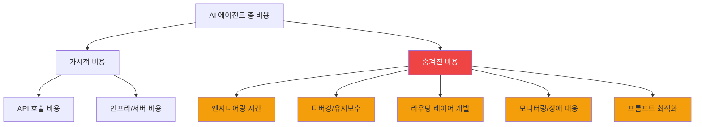
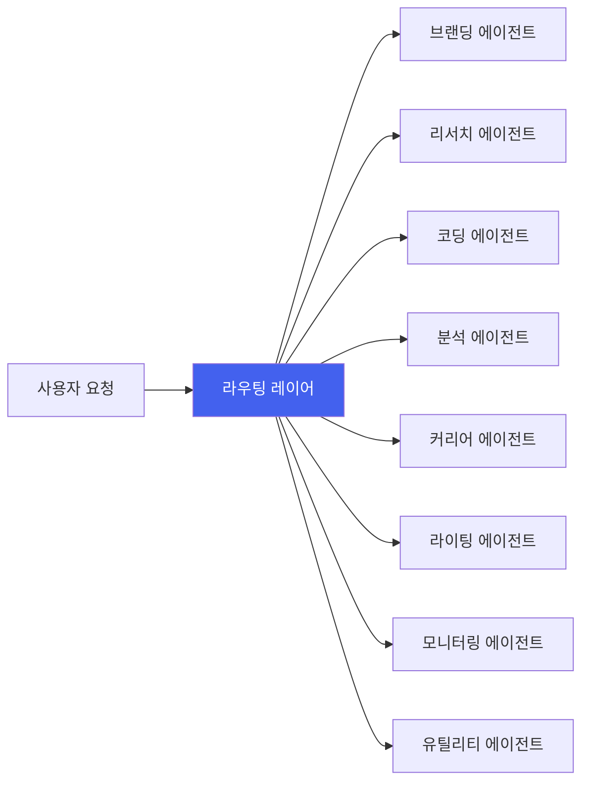
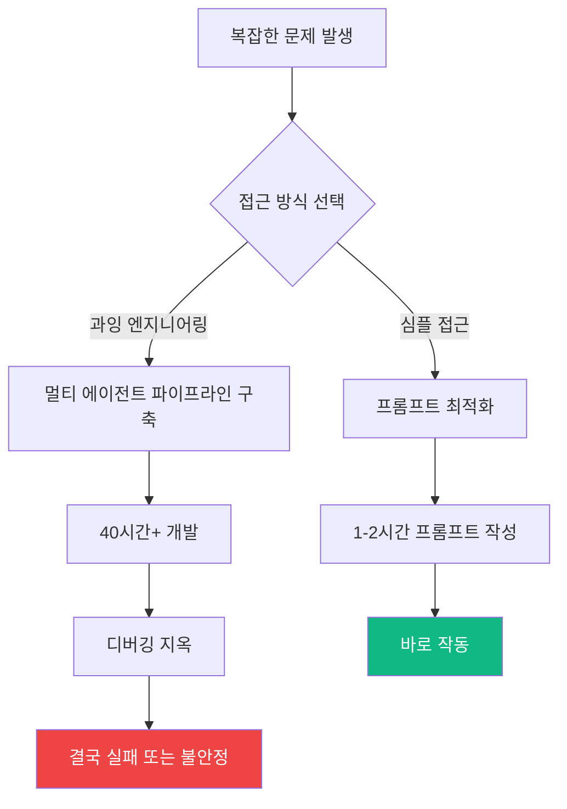

## AI 에이전트는 마법이 아니다

AI 에이전트에 대한 기대가 폭발적으로 커지고 있습니다. "에이전트에게 맡기면 인건비를 절감할 수 있다"는 이야기가 넘쳐나고 있죠. 하지만 실제로 AI 에이전트 8체를 운용하고 있는 입장에서 말씀드리면, **현실은 그렇게 단순하지 않습니다**.

이 글에서는 AI 에이전트의 실제 운용 비용을 데이터 기반으로 분석하고, "AI 에이전트는 마법이 아니라 트레이드오프"라는 관점에서 솔직한 경험을 공유합니다.

## 충격적인 데이터: AI 모더레이션 vs 인간 모더레이션

최근 영어권에서 화제가 된 분석이 있습니다. AI 에이전트를 사용한 자율 모더레이션의 비용 구조를 계산한 것인데, 결과가 놀랍습니다.

| 항목 | AI 에이전트 모더레이션 | 인간 모더레이터 |
|------|----------------------|----------------|
| **월간 비용** | $1,350 ~ $2,250 | ~$1,200 |
| **24시간 가동** | ✅ 가능 | ❌ 교대제 필요 |
| **판단 일관성** | 높음 (프롬프트 의존) | 변동 있음 |
| **컨텍스트 이해** | 제한적 | 높음 |
| **초기 구축 비용** | 높음 | 낮음 |

핵심은 이것입니다: **API 호출 비용만으로도 인간 모더레이터 인건비를 초과할 수 있습니다**. 24시간 자율 운용, 대량 처리, 복잡한 판단을 하려면 비용은 더 올라갑니다.

## 8체 AI 에이전트 운용의 현실: 비용 구조 해부

저는 현재 8체의 AI 에이전트를 실제로 운용하고 있습니다. 각 에이전트는 브랜딩, 리서치, 코딩, 분석 등 전문 역할을 담당합니다. 이 경험에서 체감한 비용 구조를 공유합니다.

### 1. API 비용: 빙산의 일각

```
월간 API 비용 내역 (예시)
├── Claude API (주력 모델)     : ~$150-300/월
├── GPT-4 API (보조 모델)      : ~$50-100/월
├── 이미지 생성 API            : ~$20-50/월
├── 검색/스크래핑 API          : ~$30-60/월
└── 기타 (임베딩, TTS 등)      : ~$20-40/월
────────────────────────────────────
합계                           : ~$270-550/월
```

API 비용만 보면 "저렴하네?"라고 생각할 수 있습니다. 하지만 이것은 빙산의 일각입니다.

### 2. 숨겨진 비용: 진짜 돈이 드는 곳



실제 비용 구조는 이렇습니다:

| 비용 항목 | 월간 추정 | 비고 |
|-----------|----------|------|
| API 비용 | $270-550 | 사용량에 비례 |
| 인프라 (서버, DB) | $50-100 | 고정 비용 |
| 엔지니어링 시간 | **$500-2,000+** | 가장 큰 비용 |
| 장애 대응/디버깅 | $200-500 | 예측 불가 |
| **합계** | **$1,020-3,150+** | |

**엔지니어링 시간이 압도적으로 가장 큰 비용입니다.** 이것을 간과하면 비용 계산이 완전히 틀어집니다.

## 라우팅 레이어: 최대 난관

8체 AI 에이전트 운용에서 가장 어렵고 비용이 많이 드는 부분은 **라우팅 레이어**입니다.



라우팅 레이어가 해결해야 하는 문제들:

- **의도 분류**: 사용자 요청을 어느 에이전트에 보낼 것인가?
- **컨텍스트 전달**: 에이전트 간 상태를 어떻게 공유할 것인가?
- **에러 처리**: 에이전트가 실패하면 어떻게 복구할 것인가?
- **비용 최적화**: 비싼 모델과 저렴한 모델을 어떻게 혼합할 것인가?

이 라우팅 레이어를 구축하고 안정화하는 데 드는 시간이, 다른 모든 비용을 합친 것보다 큽니다.

## 과잉 엔지니어링의 함정: 40시간 vs 1프롬프트

AI 에이전트 개발에서 가장 뼈아팠던 교훈이 있습니다.

> **복잡한 에이전트 파이프라인을 40시간 동안 구축했는데 실패. 결국 잘 작성된 1개의 프롬프트로 해결.**

이것은 저만의 경험이 아닙니다. AI 에이전트 커뮤니티에서 반복적으로 보고되는 패턴입니다:



### 과잉 엔지니어링 체크리스트

이런 신호가 보이면 한 발 물러서야 합니다:

- ✅ "에이전트가 에이전트를 호출하는" 3단계 이상의 체인을 설계하고 있다
- ✅ 에이전트 간 통신 프로토콜을 만들고 있다
- ✅ 단순한 if-else로 해결될 문제에 LLM을 사용하고 있다
- ✅ 프롬프트 하나로 테스트해보지 않고 아키텍처부터 설계하고 있다

**Rule of Thumb**: 먼저 단일 프롬프트로 시도하고, 그것이 실패할 때만 에이전트로 분리하세요.

## 그러면 AI 에이전트는 언제 쓸모 있는가?

비용만 보면 "그냥 사람을 고용하는 게 낫다"고 생각할 수 있습니다. 하지만 AI 에이전트가 명확하게 우위를 갖는 영역이 있습니다:

| AI 에이전트가 유리한 경우 | 인간이 유리한 경우 |
|--------------------------|-------------------|
| 24시간 무중단 처리 필요 | 복잡한 맥락 판단 필요 |
| 대량의 정형 작업 반복 | 창의적/감성적 판단 필요 |
| 빠른 응답 속도가 핵심 | 이해관계자 설득 필요 |
| 일관된 기준 적용 필수 | 예외 상황 대응 |
| 개인 생산성 확장 (1인 팀) | 팀 협업/커뮤니케이션 |

특히 **1인 개발자나 소규모 팀에서 개인 생산성을 확장**하는 용도로는 AI 에이전트가 압도적으로 효과적입니다. 저의 8체 에이전트도 이 목적으로 운용하고 있으며, "사람을 대체한다"가 아니라 "나 혼자서 할 수 있는 범위를 넓힌다"는 관점이 핵심입니다.

## 실전 비용 최적화 팁

8체 운용 경험에서 얻은 비용 최적화 전략을 공유합니다:

### 1. 모델 티어링 전략

```
작업 복잡도별 모델 배분:
├── 높은 복잡도 (10%): Claude Opus / GPT-4 → 아키텍처 결정, 복잡한 분석
├── 중간 복잡도 (30%): Claude Sonnet / GPT-4o → 코드 생성, 문서 작성
└── 낮은 복잡도 (60%): Claude Haiku / GPT-4o-mini → 분류, 요약, 포맷팅
```

이 전략만으로 API 비용을 **40-60% 절감**할 수 있습니다.

### 2. 캐싱과 배치 처리

- 동일한 프롬프트 패턴은 결과를 캐싱
- 실시간 처리가 불필요한 작업은 배치로 모아서 처리
- 임베딩 결과는 반드시 캐싱 (재계산 비용이 큼)

### 3. 실패 비용 최소화

- 타임아웃과 리트라이 로직을 반드시 구현
- 비싼 모델 호출 전에 저렴한 모델로 사전 검증
- 에이전트 실패 시 graceful degradation 설계

## 결론: 트레이드오프를 인식하라

AI 에이전트는 마법이 아닙니다. **명확한 트레이드오프가 존재하는 엔지니어링 도구**입니다.

핵심 교훈을 정리하면:

1. **API 비용은 총 비용의 일부일 뿐입니다.** 엔지니어링 시간, 유지보수, 장애 대응까지 포함해야 합니다.
2. **라우팅 레이어가 가장 큰 기술적 난관입니다.** 멀티 에이전트 시스템의 진짜 어려움은 개별 에이전트가 아니라 오케스트레이션입니다.
3. **과잉 엔지니어링을 경계하세요.** 40시간의 복잡한 파이프라인보다 1개의 잘 작성된 프롬프트가 나을 수 있습니다.
4. **용도에 맞게 사용하세요.** 개인 생산성 확장에는 탁월하지만, 단순 인건비 대체 목적으로는 비용이 더 들 수 있습니다.

AI 에이전트를 도입하려는 분들에게 한 마디: **먼저 작은 프롬프트로 시작하고, 필요할 때만 에이전트로 확장하세요.** 그것이 8체 에이전트를 운용하면서 얻은 가장 값진 교훈입니다.

## 참고 자료

- [AI Content Moderation Cost Analysis](https://www.getrevue.co/) — AI 모더레이션 비용 $1,350-2,250/월 분석
- [Anthropic Claude API Pricing](https://www.anthropic.com/pricing) — Claude 모델별 가격 정보
- [OpenAI API Pricing](https://openai.com/pricing) — GPT 모델별 가격 정보
- [Building Effective Agents - Anthropic](https://docs.anthropic.com/en/docs/build-with-claude/agents) — 에이전트 설계 패턴 가이드
