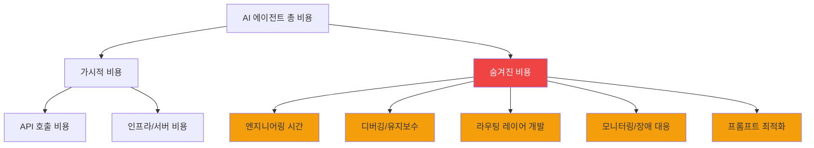
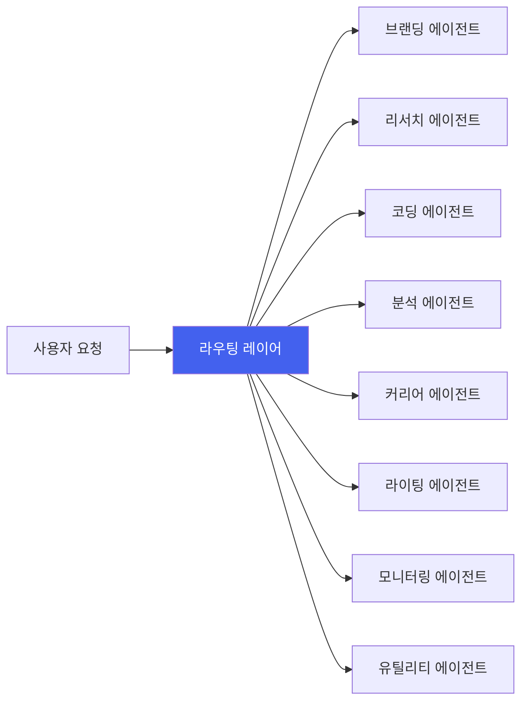
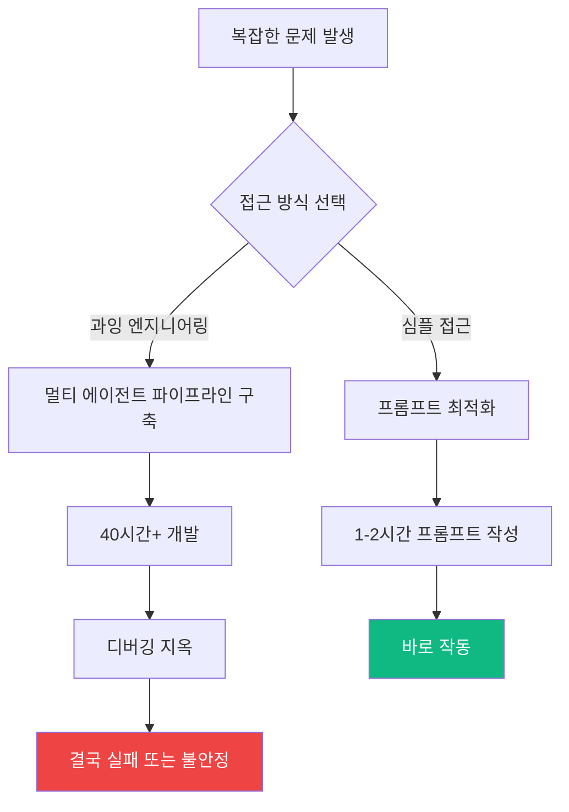

## AI 에이전트는 마법이 아니다

AI 에이전트에 대한 기대가 폭발적으로 커지고 있습니다. "에이전트에게 맡기면 인건비를 절감할 수 있다"는 이야기가 넘쳐나고 있죠. 하지만 실제로 AI 에이전트 8체를 운용하고 있는 입장에서 말씀드리면, <strong>현실은 그렇게 단순하지 않습니다</strong>.

그래서 숫자를 직접 들여다봤습니다. 8체를 굴리면서 매달 빠져나가는 비용을 항목별로 쪼개보니, "에이전트는 마법이 아니라 트레이드오프"라는 말이 추상적인 구호가 아니라 청구서로 다가오더군요. 아래는 그 청구서를 솔직하게 풀어낸 기록입니다.

## 충격적인 데이터: AI 모더레이션 vs 인간 모더레이션

최근 영어권에서 화제가 된 분석이 있습니다. AI 에이전트를 사용한 자율 모더레이션의 비용 구조를 계산한 것인데, 결과가 놀랍습니다.

| 항목 | AI 에이전트 모더레이션 | 인간 모더레이터 |
|------|----------------------|----------------|
| <strong>월간 비용</strong> | $1,350 ~ $2,250 | ~$1,200 |
| <strong>24시간 가동</strong> | ✅ 가능 | ❌ 교대제 필요 |
| <strong>판단 일관성</strong> | 높음 (프롬프트 의존) | 변동 있음 |
| <strong>컨텍스트 이해</strong> | 제한적 | 높음 |
| <strong>초기 구축 비용</strong> | 높음 | 낮음 |

핵심은 이것입니다: <strong>API 호출 비용만으로도 인간 모더레이터 인건비를 초과할 수 있습니다</strong>. 24시간 자율 운용, 대량 처리, 복잡한 판단을 하려면 비용은 더 올라갑니다.

## 8체 AI 에이전트 운용의 현실: 비용 구조 해부

저는 현재 8체의 AI 에이전트를 실제로 운용하고 있습니다. 각 에이전트는 브랜딩, 리서치, 코딩, 분석 등 전문 역할을 담당합니다. 이 경험에서 체감한 비용 구조를 공유합니다.

### 1. API 비용: 빙산의 일각

```
월간 API 비용 내역 (예시)
├── Claude API (주력 모델)     : ~$150-300/월
├── GPT-4 API (보조 모델)      : ~$50-100/월
├── 이미지 생성 API            : ~$20-50/월
├── 검색/스크래핑 API          : ~$30-60/월
└── 기타 (임베딩, TTS 등)      : ~$20-40/월
────────────────────────────────────
합계                           : ~$270-550/월
```

API 비용만 보면 "저렴하네?"라고 생각할 수 있습니다. 하지만 이것은 빙산의 일각입니다.

### 2. 숨겨진 비용: 진짜 돈이 드는 곳


```mermaid
graph TD
    A[AI 에이전트 총 비용] --> B[가시적 비용]
    A --> C[숨겨진 비용]
    B --> B1[API 호출 비용]
    B --> B2[인프라/서버 비용]
    C --> C1[엔지니어링 시간]
    C --> C2[디버깅/유지보수]
    C --> C3[라우팅 레이어 개발]
    C --> C4[모니터링/장애 대응]
    C --> C5[프롬프트 최적화]
    style C fill:#EF4444,color:#fff
    style C1 fill:#F59E0B
    style C2 fill:#F59E0B
    style C3 fill:#F59E0B
    style C4 fill:#F59E0B
    style C5 fill:#F59E0B
```

실제 비용 구조는 이렇습니다:

| 비용 항목 | 월간 추정 | 비고 |
|-----------|----------|------|
| API 비용 | $270-550 | 사용량에 비례 |
| 인프라 (서버, DB) | $50-100 | 고정 비용 |
| 엔지니어링 시간 | <strong>$500-2,000+</strong> | 가장 큰 비용 |
| 장애 대응/디버깅 | $200-500 | 예측 불가 |
| <strong>합계</strong> | <strong>$1,020-3,150+</strong> | |

<strong>엔지니어링 시간이 압도적으로 가장 큰 비용입니다.</strong> 이것을 간과하면 비용 계산이 완전히 틀어집니다.

## 라우팅 레이어: 최대 난관

8체 AI 에이전트 운용에서 가장 어렵고 비용이 많이 드는 부분은 <strong>라우팅 레이어</strong>입니다.


```mermaid
graph LR
    User[사용자 요청] --> Router[라우팅 레이어]
    Router --> A1[브랜딩 에이전트]
    Router --> A2[리서치 에이전트]
    Router --> A3[코딩 에이전트]
    Router --> A4[분석 에이전트]
    Router --> A5[커리어 에이전트]
    Router --> A6[라이팅 에이전트]
    Router --> A7[모니터링 에이전트]
    Router --> A8[유틸리티 에이전트]
    style Router fill:#4361EE,color:#fff
```

라우팅 레이어가 해결해야 하는 문제들:

- <strong>의도 분류</strong>: 사용자 요청을 어느 에이전트에 보낼 것인가?
- <strong>컨텍스트 전달</strong>: 에이전트 간 상태를 어떻게 공유할 것인가?
- <strong>에러 처리</strong>: 에이전트가 실패하면 어떻게 복구할 것인가?
- <strong>비용 최적화</strong>: 비싼 모델과 저렴한 모델을 어떻게 혼합할 것인가?

이 라우팅 레이어를 구축하고 안정화하는 데 드는 시간이, 다른 모든 비용을 합친 것보다 큽니다. [Claude 에이전트 팀 구성 가이드](/ko/blog/ko/claude-agent-teams-guide)에서 다루는 멀티 에이전트 오케스트레이션 패턴은 이 라우팅 복잡도를 줄이는 실용적인 출발점이 됩니다.

## 과잉 엔지니어링의 함정: 40시간 vs 1프롬프트

AI 에이전트 개발에서 가장 뼈아팠던 교훈이 있습니다.

> <strong>복잡한 에이전트 파이프라인을 40시간 동안 구축했는데 실패. 결국 잘 작성된 1개의 프롬프트로 해결.</strong>

이것은 저만의 경험이 아닙니다. AI 에이전트 커뮤니티에서 반복적으로 보고되는 패턴입니다:


```mermaid
graph TD
    A[복잡한 문제 발생] --> B{접근 방식 선택}
    B -->|과잉 엔지니어링| C[멀티 에이전트 파이프라인 구축]
    B -->|심플 접근| D[프롬프트 최적화]
    C --> E[40시간+ 개발]
    E --> F[디버깅 지옥]
    F --> G[결국 실패 또는 불안정]
    D --> H[1-2시간 프롬프트 작성]
    H --> I[바로 작동]
    style G fill:#EF4444,color:#fff
    style I fill:#10B981,color:#fff
```

### 과잉 엔지니어링 체크리스트

이런 신호가 보이면 한 발 물러서야 합니다:

- ✅ "에이전트가 에이전트를 호출하는" 3단계 이상의 체인을 설계하고 있다
- ✅ 에이전트 간 통신 프로토콜을 만들고 있다
- ✅ 단순한 if-else로 해결될 문제에 LLM을 사용하고 있다
- ✅ 프롬프트 하나로 테스트해보지 않고 아키텍처부터 설계하고 있다

<strong>Rule of Thumb</strong>: 먼저 단일 프롬프트로 시도하고, 그것이 실패할 때만 에이전트로 분리하세요.

## 비용을 직접 계산하는 법: 공식 가격표 읽기

비용 추정을 남의 숫자에 의존하지 않으려면, 모델 제공사의 공식 가격표를 직접 보는 것이 가장 정확합니다. 가격은 거의 매 분기 바뀌므로, 블로그 글의 숫자보다 1차 출처를 확인하는 습관이 중요합니다.

- <strong>Anthropic API 가격</strong>: 공식 문서 페이지([docs.anthropic.com/en/docs/about-claude/pricing](https://docs.anthropic.com/en/docs/about-claude/pricing))에서 모델별 입력/출력 토큰 단가, 프롬프트 캐싱 할인, 배치 처리 50% 할인 조건을 확인할 수 있습니다. 요금제 비교는 [anthropic.com/pricing](https://www.anthropic.com/pricing)에서 봅니다.
- <strong>OpenAI API 가격</strong>: [openai.com/api/pricing](https://openai.com/api/pricing/)에서 GPT 모델별 토큰 단가와 Batch API 할인을 확인합니다. ChatGPT 구독료와 API 과금은 완전히 별개라는 점에 주의하세요.

비용 추정 공식은 단순합니다. <strong>(월간 입력 토큰 ÷ 100만 × 입력 단가) + (월간 출력 토큰 ÷ 100만 × 출력 단가)</strong>. 여기에 캐싱 적중률과 배치 비율을 반영하면 실제 청구액에 가까워집니다. 출력 토큰이 입력보다 4〜5배 비싼 경우가 많으므로, 출력 길이를 줄이는 것이 가장 빠른 절감 수단입니다.

## 언제 쓰고, 언제 피할 것인가

에이전트 자동화를 도입할지 말지는 "할 수 있는가"가 아니라 "비용 대비 맞는가"로 판단해야 합니다. 다음 기준을 체크리스트로 쓰세요.

<strong>도입이 비용 대비 맞는 경우</strong>

- 동일한 작업이 하루 수백 건 이상 반복되고, 규칙이 비교적 안정적일 때. 반복량이 클수록 초기 구축 비용이 분산됩니다.
- 24시간 응답이 매출이나 SLA에 직접 연결될 때. 야간 교대 인건비를 대체하는 지점에서 손익이 뒤집힙니다.
- 작업 결과의 오류 비용이 낮거나, 사람 검수로 쉽게 잡을 수 있을 때. 잘못된 분류 하나가 큰 손해로 이어지지 않는 영역이 안전합니다.
- 입력과 출력이 짧은 텍스트 위주여서 토큰 단가가 통제 가능할 때.

<strong>도입을 피하거나 미뤄야 하는 경우</strong>

- 작업 빈도가 낮고 비정형적일 때. 월 수십 건짜리 작업에 라우팅 레이어를 만드는 것은 거의 항상 적자입니다.
- 오류 한 건의 비용이 매우 클 때(법률, 의료, 금융 판단 등). 이런 영역은 사람의 최종 책임이 비용보다 중요합니다.
- 입력 컨텍스트가 매우 길어 매 호출마다 대량 토큰을 소비할 때. 긴 문서를 반복적으로 통째로 넣으면 API 비용이 빠르게 인건비를 추월합니다.
- 요구사항이 아직 자주 바뀔 때. 프롬프트와 파이프라인을 매주 갈아엎으면 엔지니어링 시간이 무한정 늘어납니다.

판단이 애매할 때의 원칙은 하나입니다. <strong>먼저 단일 프롬프트로 1〜2주 운용해 실제 토큰 사용량과 오류율을 측정하고, 그 데이터로 풀 자동화의 손익을 계산</strong>하세요. 측정 없이 아키텍처부터 짓는 것이 가장 비싼 실수입니다.

## 그러면 AI 에이전트는 언제 쓸모 있는가?

비용만 보면 "그냥 사람을 고용하는 게 낫다"고 생각할 수 있습니다. 하지만 AI 에이전트가 명확하게 우위를 갖는 영역이 있습니다:

| AI 에이전트가 유리한 경우 | 인간이 유리한 경우 |
|--------------------------|-------------------|
| 24시간 무중단 처리 필요 | 복잡한 맥락 판단 필요 |
| 대량의 정형 작업 반복 | 창의적/감성적 판단 필요 |
| 빠른 응답 속도가 핵심 | 이해관계자 설득 필요 |
| 일관된 기준 적용 필수 | 예외 상황 대응 |
| 개인 생산성 확장 (1인 팀) | 팀 협업/커뮤니케이션 |

특히 <strong>1인 개발자나 소규모 팀에서 개인 생산성을 확장</strong>하는 용도로는 AI 에이전트가 압도적으로 효과적입니다. Anthropic 에이전트 스킬 실전 가이드에서 구체적인 구현 패턴과 비용 효율적인 설계 방법을 확인할 수 있습니다. 저의 8체 에이전트도 이 목적으로 운용하고 있으며, "사람을 대체한다"가 아니라 "나 혼자서 할 수 있는 범위를 넓힌다"는 관점이 핵심입니다.

## 실전 비용 최적화 팁

8체 운용 경험에서 얻은 비용 최적화 전략을 공유합니다:

### 1. 모델 티어링 전략

```
작업 복잡도별 모델 배분:
├── 높은 복잡도 (10%): Claude Opus / GPT-4 → 아키텍처 결정, 복잡한 분석
├── 중간 복잡도 (30%): Claude Sonnet / GPT-4o → 코드 생성, 문서 작성
└── 낮은 복잡도 (60%): Claude Haiku / GPT-4o-mini → 분류, 요약, 포맷팅
```

이 전략만으로 API 비용을 <strong>40-60% 절감</strong>할 수 있습니다. 모델별 단가와 도구 호출 비용을 코드 레벨에서 어떻게 다루는지는 [Claude Agent SDK 도구 사용 완전 가이드](/ko/blog/ko/claude-agent-sdk-tool-use-complete-guide-2026)에서 구체적인 구현과 함께 확인할 수 있습니다.

### 2. 캐싱과 배치 처리

- 동일한 프롬프트 패턴은 결과를 캐싱
- 실시간 처리가 불필요한 작업은 배치로 모아서 처리
- 임베딩 결과는 반드시 캐싱 (재계산 비용이 큼)

LLM PM 워크플로우 자동화 사례에서 이런 배치 처리와 캐싱 전략이 실제 프로덕션 환경에서 어떻게 적용되는지 확인할 수 있습니다.

### 3. 실패 비용 최소화

- 타임아웃과 리트라이 로직을 반드시 구현
- 비싼 모델 호출 전에 저렴한 모델로 사전 검증
- 에이전트 실패 시 graceful degradation 설계

## 8체를 굴리며 배운 네 가지

AI 에이전트는 마법이 아닙니다. <strong>명확한 트레이드오프가 존재하는 엔지니어링 도구</strong>입니다.

지난 운용에서 건진 교훈을 정리하면:

1. <strong>API 비용은 총 비용의 일부일 뿐입니다.</strong> 엔지니어링 시간, 유지보수, 장애 대응까지 포함해야 합니다.
2. <strong>라우팅 레이어가 가장 큰 기술적 난관입니다.</strong> 멀티 에이전트 시스템의 진짜 어려움은 개별 에이전트가 아니라 오케스트레이션입니다.
3. <strong>과잉 엔지니어링을 경계하세요.</strong> 40시간의 복잡한 파이프라인보다 1개의 잘 작성된 프롬프트가 나을 수 있습니다.
4. <strong>용도에 맞게 사용하세요.</strong> 개인 생산성 확장에는 탁월하지만, 단순 인건비 대체 목적으로는 비용이 더 들 수 있습니다.

AI 에이전트를 도입하려는 분들에게 한 마디: <strong>먼저 작은 프롬프트로 시작하고, 필요할 때만 에이전트로 확장하세요.</strong> 그것이 8체 에이전트를 운용하면서 얻은 가장 값진 교훈입니다.

## 참고 자료

<strong>1차 출처 (공식 가격·문서)</strong>

- [Anthropic API Pricing (공식 문서)](https://docs.anthropic.com/en/docs/about-claude/pricing) — Claude 모델별 입력/출력 토큰 단가, 캐싱·배치 할인
- [Anthropic Plans & Pricing](https://www.anthropic.com/pricing) — 요금제 및 플랜 비교
- [OpenAI API Pricing (공식)](https://openai.com/api/pricing/) — GPT 모델별 토큰 단가 및 Batch API 할인
- [Building Effective Agents - Anthropic](https://docs.anthropic.com/en/docs/build-with-claude/agents) — 에이전트 설계 패턴 가이드
