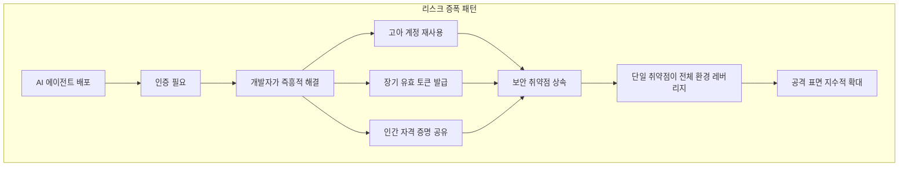

## 보이지 않는 위협의 등장

2026년 3월 기준, 기업의 약 70%가 이미 AI 에이전트를 프로덕션 환경에서 운영하고 있습니다. 고객 지원 봇, 코드 리뷰 에이전트, 데이터 파이프라인 자동화, 보안 모니터링 에이전트 — 이들은 24시간 365일 인프라 안을 돌아다닙니다.

그런데 이 에이전트들이 **어디에 있는지, 무엇을 하는지, 누구의 권한으로 움직이는지** 실시간으로 파악하고 있는 기업은 얼마나 될까요?

Strata Identity와 Cloud Security Alliance(CSA)의 공동 조사(285명 IT·보안 전문가 대상)에 따르면, **80%에 가까운 응답자가 자사 AI 에이전트의 실시간 행동을 파악하지 못한다**고 답했습니다. 이것이 바로 "아이덴티티 다크 매터(Identity Dark Matter)" 문제입니다.

## 아이덴티티 다크 매터란 무엇인가

우주의 다크 매터처럼, 아이덴티티 다크 매터는 **존재하지만 보이지 않는 위험**입니다. 기존의 IAM(Identity and Access Management) 시스템은 사람이 입사·퇴사하는 흐름을 중심으로 설계되었습니다. 하지만 AI 에이전트는 HR을 통해 입사하지도, 퇴직 처리가 되지도 않습니다.

에이전트들은 다음과 같은 경로로 "보이지 않는" 존재가 됩니다:

- **API 키 또는 서비스 계정 직접 사용**: 사람이 아닌 무언가가 사람의 토큰으로 인증
- **마이크로서비스 간 무선 연결**: CI/CD 파이프라인, Lambda 함수, 컨테이너 내부에 에이전트 자격 증명이 하드코딩
- **Shadow AI**: IT 부서 승인 없이 개발팀이 자체 구축한 에이전트
- **이관된 권한**: 담당자가 퇴사했지만 그 사람의 서비스 계정을 계속 사용하는 에이전트

이 모든 경우에서, 에이전트는 **기존 IAM 시스템의 시야 밖**에 존재합니다.

## 수치로 보는 거버넌스 격차

CSA 조사 결과는 문제의 심각성을 명확히 보여줍니다:

```
에이전트 아이덴티티 관리 실태 (2026년 기준)
────────────────────────────────────────────
IAM이 에이전트 아이덴티티를 효과적으로 관리할 수 있다고
"매우 자신 있다"고 답한 보안 리더             → 18%
                                             (나머지 82%는 보통 이하의 신뢰도)

인증 방식
  정적 API 키 사용                            → 44%
  유저네임/패스워드 조합 사용                  → 43%
  공유 서비스 계정 사용                        → 35%

가시성
  에이전트 행동을 인간 스폰서에게 추적 가능     → 28%
  실시간 에이전트 인벤토리 유지                 → 21%
  실시간 행동 파악 가능                        → ~20%

거버넌스
  공식 전사 에이전트 아이덴티티 전략 보유        → 23%
  비공식 관행에 의존                           → 37%
  컴플라이언스 감사 자신 있음                   → <50%
────────────────────────────────────────────
```

특히 주목해야 할 숫자는 **21%**입니다. 현재 실시간으로 활성 에이전트 인벤토리를 유지하고 있는 기업이 5곳 중 1곳도 안 된다는 의미입니다. 나머지 기업들은 자사 환경에서 몇 개의 에이전트가 지금 이 순간 실행되고 있는지조차 파악하지 못하고 있습니다.

## 어떻게 리스크가 증폭되는가

AI 에이전트는 본질적으로 **가장 마찰이 적은 경로**를 따라 움직입니다. 이는 인프라에 이미 존재하는 보안 취약점을 자동으로 찾아 활용한다는 의미이기도 합니다.



The Hacker News가 3월 보도한 사례를 보면, 에이전트가 "가장 잘 작동하는" 방식을 찾다가 수개월 전 퇴직자의 고아 계정을 활용하는 패턴이 발견되었습니다. 이 계정 하나가 **여러 에이전트의 재사용 지름길**이 되면서, 한 번의 침해가 전체 에이전트 플릿에 영향을 줄 수 있는 구조가 만들어졌습니다.

## EM/CTO가 바로 실행할 수 있는 5단계

### 1단계: 에이전트 인벤토리 작성

지금 당장 팀에 물어보세요: "우리 환경에서 실행 중인 AI 에이전트가 몇 개입니까?" 대부분의 팀이 정확한 답을 모를 것입니다. 인벤토리는 가시성의 출발점입니다.

```bash
# 예시: Kubernetes 환경에서 AI 에이전트 관련 서비스 계정 탐색
kubectl get serviceaccounts --all-namespaces | grep -i "agent\|bot\|ai\|llm\|claude\|gpt"

# 예시: AWS에서 AI 에이전트 관련 IAM 역할 탐색
aws iam list-roles --query 'Roles[?contains(RoleName, `agent`) || contains(RoleName, `bot`)]'
```

### 2단계: 각 에이전트에 인간 스폰서 지정

모든 에이전트는 **책임지는 사람**이 있어야 합니다. "에이전트가 한 일"이 아니라 "누구의 책임 아래 에이전트가 한 일"이 될 수 있도록 오너십을 명시하세요.

인벤토리 양식 예시:

```
에이전트명: code-review-agent-prod
목적: PR 코드 리뷰 자동화
인간 스폰서: 김장욱 (EM)
사용 권한: GitHub Read, Jira Write
마지막 감사: 2026-03-01
다음 감사 예정: 2026-06-01
```

### 3단계: 정적 자격 증명 → 동적 토큰으로 전환

44%의 기업이 사용하는 정적 API 키는 가장 위험한 인증 방식입니다. 만료되지 않는 키는 침해되면 영구적 피해를 낳습니다.

권장 전환 경로:

- **AWS**: IAM Roles + 임시 자격 증명 (STS AssumeRole)
- **GCP**: Workload Identity Federation + 단기 토큰
- **Azure**: Managed Identity
- **범용**: HashiCorp Vault의 Dynamic Secrets

### 4단계: 최소 권한 원칙(PoLP) 에이전트 적용

에이전트가 "일단 넓게" 권한을 가지는 것은 흔한 실수입니다. 에이전트가 실제로 필요한 작업만 할 수 있도록 권한을 좁히세요.

```yaml
# Bad: 광범위한 권한
agent-permissions:
  - s3:*
  - rds:*
  - lambda:*

# Good: 최소 필요 권한
agent-permissions:
  - s3:GetObject
  - s3:PutObject
  resources:
    - "arn:aws:s3:::blog-assets/*"
  condition:
    time-based: "09:00-18:00 JST"
```

### 5단계: 에이전트 행동 감사 로그 구축

에이전트가 무엇을 했는지 추적할 수 없다면, 문제가 발생해도 원인을 파악할 수 없습니다. 모든 에이전트 액션을 로깅하고, 그것을 인간 스폰서에게 연결하세요.

```python
# 에이전트 행동 감사 로그 예시 (구조)
audit_log = {
    "timestamp": "2026-03-14T10:30:00Z",
    "agent_id": "code-review-agent-001",
    "human_sponsor": "kim.jangwook@company.com",
    "action": "github.create_review_comment",
    "resource": "github.com/org/repo/pull/123",
    "decision_context": {
        "policy_version": "v2.1",
        "risk_score": 0.12,
        "approved": True
    }
}
```

## Microsoft와 CyberArk가 제시하는 방향

2026년 1월 Microsoft Security Blog가 발표한 "2026 아이덴티티 및 네트워크 접근 보안 4대 우선순위"에서도 AI 에이전트 아이덴티티는 1순위로 꼽혔습니다. CyberArk의 분석에 따르면 2026년 아이덴티티 보안 투자의 가장 빠르게 성장하는 카테고리가 바로 "비인간 아이덴티티(Non-Human Identity)" 관리입니다.

좋은 소식도 있습니다. CSA 조사 응답자의 **40%가 AI 에이전트 리스크를 위한 아이덴티티 및 보안 예산을 늘리고 있다**고 답했습니다. 문제를 인식하는 기업이 빠르게 행동에 나서고 있는 것입니다.

## EM으로서의 실천 포인트

Engineering Manager 관점에서, 이 문제는 단순히 보안팀에 넘길 수 있는 것이 아닙니다. AI 에이전트를 배포하는 팀을 이끄는 EM이라면 다음 세 가지를 팀 문화로 정착시켜야 합니다:

**1. "에이전트도 팀원이다" 원칙**: 신규 에이전트를 배포할 때 사람 채용과 동일한 온보딩 프로세스를 적용하세요. 에이전트의 목적, 권한, 스폰서, 감사 주기를 문서화하는 것이 출발점입니다.

**2. 정기 에이전트 감사**: 분기 1회, 팀의 모든 에이전트 인벤토리를 검토하고, 더 이상 사용되지 않는 에이전트와 그 자격 증명을 폐기하세요.

**3. 아이덴티티 채무 없는 스프린트**: 기술 채무를 트래킹하듯이, 에이전트의 자격 증명 채무(정적 키, 과도한 권한, 오래된 토큰)를 스프린트 백로그에 추가하세요.

## 결론: 보이지 않는 것이 가장 위험하다

"에이전트는 알아서 잘 돌아가고 있다"는 생각이 가장 위험한 착각입니다. 기업의 AI 에이전트 채택 속도가 거버넌스 성숙도를 압도하고 있는 지금, **아이덴티티 다크 매터는 2026년 가장 빠르게 확대되는 엔터프라이즈 보안 위협**이 되고 있습니다.

70%가 이미 에이전트를 운영하고 있지만, 23%만이 공식적인 거버넌스 전략을 갖고 있다는 격차 — 이것이 바로 EM과 CTO가 지금 메워야 하는 공간입니다.

에이전트를 배포하는 것만큼 중요한 것은, 그 에이전트가 **보이는 존재**로 운영되도록 하는 것입니다. 아이덴티티가 없는 에이전트는 어두운 곳을 혼자 걷는 것과 같습니다 — 사고가 나기 전까지는 아무도 모릅니다.

---

*Sources: [AI Agents: The Next Wave Identity Dark Matter](https://thehackernews.com/2026/03/ai-agents-next-wave-identity-dark.html) (The Hacker News, 2026.03), [The AI Agent Identity Crisis](https://www.strata.io/blog/agentic-identity/the-ai-agent-identity-crisis-new-research-reveals-a-governance-gap/) (Strata Identity / CSA Survey, 2026), [AI Agents and Identity Risks](https://www.cyberark.com/resources/blog/ai-agents-and-identity-risks-how-security-will-shift-in-2026) (CyberArk, 2026.01)*
