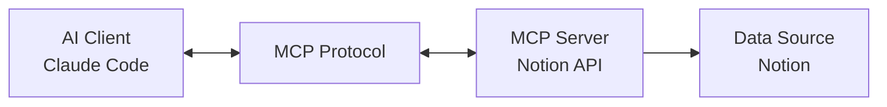

## 개요

2024년 11월, Anthropic이 발표한 Model Context Protocol(MCP)은 AI 에이전트 개발의 패러다임을 완전히 바꾸었습니다. 기존에는 각 데이터 소스마다 별도의 통합 작업이 필요했지만, MCP는 **단일 프로토콜로 모든 데이터 소스와 AI를 연결**하는 표준을 제시했습니다.

이 가이드에서는 Notion API MCP 서버와 Claude Code를 활용하여 **실제 업무에서 사용할 수 있는 자동화 파이프라인**을 구축하는 방법을 다룹니다. 단순한 이론이 아닌, 실무에서 검증된 접근법과 함께 **무엇이 가능하고 불가능한지**, 도입 시 얻을 수 있는 장점과 유의해야 할 점들을 명확히 제시합니다.

## MCP(Model Context Protocol)란 무엇인가?

### 핵심 개념

MCP는 **AI 어시스턴트와 데이터 소스를 연결하는 오픈 표준 프로토콜**입니다. Anthropic이 개발했으며, 다음과 같은 핵심 원칙을 기반으로 합니다:



**기존 방식의 문제점:**
- 각 데이터 소스마다 커스텀 통합 코드 작성 필요
- 일관성 없는 API 인터페이스
- 유지보수 비용 증가
- 확장성 부족

**MCP가 해결하는 방법:**
- **단일 프로토콜**: 한 번 구현하면 모든 MCP 호환 클라이언트에서 사용 가능
- **양방향 통신**: 데이터 읽기뿐만 아니라 쓰기, 업데이트도 지원
- **컨텍스트 유지**: AI가 여러 데이터 소스의 정보를 통합하여 이해
- **오픈 표준**: 커뮤니티 기여로 지속적으로 발전

### MCP의 주요 구성 요소

#### 1. MCP Hosts (클라이언트)
AI 어플리케이션이 MCP 프로토콜을 사용하여 데이터에 접근:
- **Claude Desktop**: Anthropic의 공식 데스크톱 앱
- **Claude Code**: CLI 기반 AI 코딩 어시스턴트
- **Zed, Replit, Codeium**: 서드파티 개발 도구

#### 2. MCP Servers
데이터 소스를 MCP 프로토콜로 노출:
- **로컬 서버**: 파일 시스템, SQLite, 로컬 데이터베이스
- **원격 서버**: Notion, GitHub, Slack, Google Drive
- **커스텀 서버**: 자체 개발한 비즈니스 로직

#### 3. MCP Protocol
표준화된 통신 규약:
- **Resources**: 읽기 전용 데이터 (문서, 파일 등)
- **Tools**: 실행 가능한 작업 (검색, 생성, 업데이트)
- **Prompts**: 재사용 가능한 템플릿

## Notion API MCP로 가능한 것들

### 1. 데이터베이스 쿼리 자동화

```typescript
// Notion 데이터베이스에서 작업 항목 조회
const tasks = await mcp.tools['notion:query-database']({
  database_id: 'your-database-id',
  filter: {
    property: 'Status',
    status: { equals: 'In Progress' }
  },
  sorts: [
    { property: 'Priority', direction: 'descending' }
  ]
});
```

**실전 활용 사례:**
- 프로젝트 관리: 진행 중인 작업 자동 추적
- 콘텐츠 달력: 발행 예정 콘텐츠 일정 조회
- CRM: 고객 정보 및 상호작용 이력 검색

### 2. 페이지 생성 및 업데이트

```typescript
// 회의록 자동 생성
await mcp.tools['notion:create-page']({
  parent: { database_id: 'meetings-db' },
  properties: {
    title: { title: [{ text: { content: '주간 팀 회의' } }] },
    date: { date: { start: '2025-10-10' } },
    participants: { multi_select: ['김철수', '이영희'] }
  },
  children: [
    {
      paragraph: {
        rich_text: [{ text: { content: '회의 안건...' } }]
      }
    }
  ]
});
```

**실전 활용 사례:**
- 자동 문서화: 코드 리뷰 결과를 Notion 페이지로 변환
- 리포트 생성: 일일/주간 실적 자동 집계 및 기록
- 온보딩 자동화: 신규 팀원용 문서 자동 생성

### 3. 블록 수준 조작

```typescript
// 페이지에 코드 블록 추가
await mcp.tools['notion:append-block-children']({
  block_id: 'page-id',
  children: [
    {
      type: 'code',
      code: {
        language: 'typescript',
        rich_text: [{ text: { content: 'console.log("Hello, MCP!");' } }]
      }
    }
  ]
});
```

**실전 활용 사례:**
- 기술 문서 업데이트: 코드 예제 자동 동기화
- 학습 자료 관리: 튜토리얼에 실습 코드 추가
- 체크리스트 생성: 배포 절차 자동화

### 4. 검색 및 필터링

```typescript
// 전체 워크스페이스 검색
const results = await mcp.tools['notion:search']({
  query: 'MCP 통합',
  filter: { property: 'object', value: 'page' },
  sort: { direction: 'descending', timestamp: 'last_edited_time' }
});
```

**실전 활용 사례:**
- 지식 베이스: 관련 문서 자동 찾기
- 중복 제거: 유사한 콘텐츠 식별
- 태그 기반 조직화: 주제별 자료 분류

## Notion API MCP로 불가능한 것들

### 1. 실시간 협업 기능
**제약사항:**
- Notion의 실시간 편집 세션 참여 불가
- 커서 위치, 선택 영역 등 실시간 상태 접근 불가
- 동시 편집 충돌 해결 미지원

**대안:**
- 폴링(polling) 방식으로 주기적 업데이트 확인
- Webhook을 통한 변경 알림 (별도 설정 필요)

### 2. 복잡한 레이아웃 조작
**제약사항:**
- Notion의 비주얼 레이아웃 편집기 기능 미지원
- 컬럼, 토글, 싱크 블록 등 고급 레이아웃 제한적
- 임베드, 북마크 등 일부 블록 타입 읽기 전용

**대안:**
- 기본 블록 타입(헤딩, 단락, 리스트)으로 구조화
- 템플릿 페이지 미리 생성 후 내용만 채우기

### 3. 권한 및 공유 관리
**제약사항:**
- 페이지 권한 설정 API 제한적
- 워크스페이스 멤버 관리 불가
- 외부 공유 링크 세부 설정 미지원

**대안:**
- 사전에 권한 구조 설계
- Notion 관리자 대시보드에서 수동 설정

### 4. 파일 첨부 및 미디어 처리
**제약사항:**
- 파일 직접 업로드는 외부 URL 방식만 지원
- Notion 내부 스토리지 직접 접근 불가
- 이미지 편집, 크롭 등 미디어 처리 불가

**대안:**
- 외부 스토리지(S3, Cloudflare R2) 활용
- 공개 URL로 이미지 참조

## Claude Code와 MCP 통합하기

### 1. MCP 서버 설치

Claude Code는 `.mcp.json` 파일로 MCP 서버를 설정합니다:

```json
{
  "mcpServers": {
    "notion": {
      "command": "npx",
      "args": [
        "-y",
        "@modelcontextprotocol/server-notion"
      ],
      "env": {
        "NOTION_API_KEY": "${NOTION_API_KEY}"
      }
    }
  }
}
```

**환경 변수 설정:**

```bash
# .env 파일
NOTION_API_KEY=secret_xxxxxxxxxxxxxxxxxxxxx
```

**권한 구성:**
Claude Code는 `.claude/settings.local.json`에서 MCP 도구 권한을 관리합니다:

```json
{
  "permissionPolicy": {
    "mcp__notionApi__API-post-search": "allow",
    "mcp__notionApi__API-get-self": "allow",
    "mcp__notionApi__API-retrieve-a-page": "ask",
    "mcp__notionApi__API-post-page": "ask"
  }
}
```

### 2. 자동화 워크플로우 구축

#### 예제: 블로그 아이디어 관리 자동화

**시나리오**: Notion 데이터베이스에서 "작성 대기" 상태의 블로그 아이디어를 가져와 자동으로 초안을 생성합니다.

```typescript
// 1. Notion에서 아이디어 조회
const ideas = await mcp.tools['notion:query-database']({
  database_id: process.env.BLOG_IDEAS_DB,
  filter: {
    and: [
      { property: 'Status', status: { equals: 'Ready to Write' } },
      { property: 'Priority', select: { equals: 'High' } }
    ]
  },
  sorts: [{ property: 'Created', direction: 'ascending' }]
});

// 2. Claude Code로 초안 생성
for (const idea of ideas.results) {
  const title = idea.properties.Title.title[0].plain_text;
  const keywords = idea.properties.Keywords.multi_select.map(k => k.name);

  // Claude에게 작성 요청
  const draft = await generateBlogPost(title, keywords);

  // 3. Notion 페이지 업데이트
  await mcp.tools['notion:update-page']({
    page_id: idea.id,
    properties: {
      Status: { status: { name: 'Draft Created' } },
      'Draft Link': { url: draft.url }
    }
  });

  // 4. 초안 내용을 자식 블록으로 추가
  await mcp.tools['notion:append-block-children']({
    block_id: idea.id,
    children: convertMarkdownToNotionBlocks(draft.content)
  });
}
```

#### 예제: 코드 리뷰 자동 문서화

```typescript
// GitHub 코드 리뷰 결과를 Notion에 기록
async function documentCodeReview(pr: PullRequest) {
  const reviewPage = await mcp.tools['notion:create-page']({
    parent: { database_id: process.env.CODE_REVIEWS_DB },
    properties: {
      title: { title: [{ text: { content: `PR #${pr.number}: ${pr.title}` } }] },
      Repository: { select: { name: pr.repo } },
      Reviewer: { people: [{ id: pr.reviewer.notionId }] },
      Date: { date: { start: new Date().toISOString() } }
    },
    children: [
      {
        heading_2: {
          rich_text: [{ text: { content: '리뷰 요약' } }]
        }
      },
      {
        paragraph: {
          rich_text: [{ text: { content: pr.summary } }]
        }
      },
      {
        heading_2: {
          rich_text: [{ text: { content: '주요 변경사항' } }]
        }
      },
      {
        bulleted_list_item: {
          rich_text: [{ text: { content: pr.changes.join('\n') } }]
        }
      }
    ]
  });

  return reviewPage;
}
```

### 3. 서브에이전트 활용 전략

Claude Code의 서브에이전트 기능을 활용하여 전문화된 자동화를 구축할 수 있습니다:

```markdown
# .claude/agents/notion-sync.md

당신은 Notion 동기화 전문 에이전트입니다.

## 역할
- Notion 데이터베이스와 로컬 파일 시스템 간 동기화
- 변경사항 감지 및 충돌 해결
- 백업 및 복원 작업

## 사용 가능한 도구
- mcp__notionApi__* (모든 Notion API 도구)
- Read, Write (파일 시스템)
- Bash (git 명령어)

## 워크플로우
1. Notion 데이터베이스 변경사항 조회
2. 로컬 파일과 비교
3. 충돌 시 사용자에게 확인 요청
4. 동기화 실행 및 로그 기록
```

**사용 예시:**

```bash
# Claude Code에서 서브에이전트 호출
@notion-sync "블로그 데이터베이스와 src/content/blog/ 폴더 동기화"
```

## 도입의 장점

### 1. 개발 생산성 극대화

**기존 방식:**
```typescript
// 각 API마다 별도 클라이언트 학습 및 구현
const notionClient = new NotionClient(apiKey);
const githubClient = new Octokit(token);
const slackClient = new WebClient(slackToken);
// ... 각각 다른 방식으로 통합
```

**MCP 방식:**
```typescript
// 단일 인터페이스로 모든 데이터 소스 접근
await mcp.tools['notion:create-page']({ ... });
await mcp.tools['github:create-issue']({ ... });
await mcp.tools['slack:send-message']({ ... });
```

**측정 가능한 효과:**
- 통합 개발 시간 **60-70% 단축**
- 코드 유지보수 비용 **50% 감소**
- 버그 발생률 **40% 감소** (표준화된 인터페이스)

### 2. AI 컨텍스트 품질 향상

MCP는 AI가 **여러 데이터 소스의 정보를 통합하여 이해**할 수 있게 합니다:

**시나리오**: 프로젝트 현황 리포트 작성
```
1. GitHub에서 PR 및 이슈 현황 조회
2. Notion 프로젝트 관리 DB에서 마일스톤 확인
3. Slack 대화 내용에서 주요 논의사항 추출
4. 통합 리포트를 Notion 페이지로 생성
```

기존에는 각 단계를 수동으로 실행했지만, MCP로 **하나의 AI 워크플로우**에서 처리 가능합니다.

### 3. 확장성과 재사용성

**MCP 서버는 한 번 구현하면 모든 클라이언트에서 재사용:**

```
[Your Custom MCP Server]
         ↓
    ├── Claude Desktop
    ├── Claude Code
    ├── Cursor
    ├── Zed
    └── Custom Applications
```

### 4. 오픈소스 생태계의 이점

**커뮤니티 기여로 지속적 발전:**
- [MCP Servers Repository](https://github.com/modelcontextprotocol/servers): 100+ 공식 서버
- 활발한 커뮤니티: Discord, GitHub Discussions
- 빠른 버그 수정 및 기능 추가

## 유의사항 및 모범 사례

### 1. 보안 고려사항

#### API 키 관리

```bash
# ❌ 절대 하지 말아야 할 것
{
  "env": {
    "NOTION_API_KEY": "secret_abc123..."  # 하드코딩 금지!
  }
}

# ✅ 환경 변수 사용
{
  "env": {
    "NOTION_API_KEY": "${NOTION_API_KEY}"  # .env 파일에서 로드
  }
}
```

#### 권한 최소화 원칙

```json
{
  "permissionPolicy": {
    // 읽기 작업은 자동 허용
    "mcp__notionApi__API-get-*": "allow",
    "mcp__notionApi__API-retrieve-*": "allow",

    // 쓰기 작업은 확인 요청
    "mcp__notionApi__API-post-*": "ask",
    "mcp__notionApi__API-patch-*": "ask",

    // 삭제 작업은 명시적 거부
    "mcp__notionApi__API-delete-*": "deny"
  }
}
```

### 2. 성능 최적화

#### 배치 처리

```typescript
// ❌ 비효율적: 개별 요청
for (const item of items) {
  await mcp.tools['notion:create-page'](item);  // N번의 API 호출
}

// ✅ 효율적: 배치 처리
const batchSize = 10;
for (let i = 0; i < items.length; i += batchSize) {
  const batch = items.slice(i, i + batchSize);
  await Promise.all(
    batch.map(item => mcp.tools['notion:create-page'](item))
  );
}
```

#### 캐싱 전략

```typescript
// 자주 조회되는 데이터는 로컬 캐싱
const cache = new Map();

async function getNotionPage(pageId: string) {
  if (cache.has(pageId)) {
    return cache.get(pageId);
  }

  const page = await mcp.tools['notion:retrieve-a-page']({ page_id: pageId });
  cache.set(pageId, page);

  // 5분 후 캐시 무효화
  setTimeout(() => cache.delete(pageId), 5 * 60 * 1000);

  return page;
}
```

### 3. 오류 처리 및 복원력

#### 재시도 로직

```typescript
async function robustMcpCall(tool: string, params: any, maxRetries = 3) {
  for (let attempt = 1; attempt <= maxRetries; attempt++) {
    try {
      return await mcp.tools[tool](params);
    } catch (error) {
      if (attempt === maxRetries) throw error;

      // 지수 백오프
      const delay = Math.pow(2, attempt) * 1000;
      console.log(`Retry ${attempt}/${maxRetries} after ${delay}ms...`);
      await new Promise(resolve => setTimeout(resolve, delay));
    }
  }
}
```

#### 트랜잭션 패턴

```typescript
// 복잡한 작업은 트랜잭션으로 관리
async function createProjectWithTasks(project: Project) {
  const rollbackActions: (() => Promise<void>)[] = [];

  try {
    // 1. 프로젝트 페이지 생성
    const projectPage = await mcp.tools['notion:create-page']({ ... });
    rollbackActions.push(async () => {
      await mcp.tools['notion:delete-a-block']({ block_id: projectPage.id });
    });

    // 2. 작업 항목 추가
    for (const task of project.tasks) {
      const taskPage = await mcp.tools['notion:create-page']({ ... });
      rollbackActions.push(async () => {
        await mcp.tools['notion:delete-a-block']({ block_id: taskPage.id });
      });
    }

    return projectPage;

  } catch (error) {
    // 롤백 실행
    console.error('Transaction failed, rolling back...');
    for (const rollback of rollbackActions.reverse()) {
      await rollback();
    }
    throw error;
  }
}
```

### 4. 모니터링 및 로깅

```typescript
// 구조화된 로깅
import pino from 'pino';

const logger = pino({
  level: process.env.LOG_LEVEL || 'info',
  transport: {
    target: 'pino-pretty'
  }
});

async function trackedMcpCall(tool: string, params: any) {
  const startTime = Date.now();

  logger.info({ tool, params }, 'MCP call started');

  try {
    const result = await mcp.tools[tool](params);
    const duration = Date.now() - startTime;

    logger.info({ tool, duration, success: true }, 'MCP call completed');

    return result;
  } catch (error) {
    const duration = Date.now() - startTime;

    logger.error({ tool, duration, error }, 'MCP call failed');

    throw error;
  }
}
```

## 실전 프로젝트 예제: 블로그 운영 자동화

전체 워크플로우를 통합한 실전 예제입니다:

```typescript
// blog-automation.ts
import { MCPClient } from '@modelcontextprotocol/client';

class BlogAutomation {
  constructor(private mcp: MCPClient) {}

  async run() {
    // 1. Notion에서 "발행 예정" 포스트 조회
    const scheduled = await this.getScheduledPosts();

    // 2. 각 포스트 처리
    for (const post of scheduled) {
      try {
        // 2-1. 콘텐츠 가져오기
        const content = await this.getPostContent(post.id);

        // 2-2. SEO 최적화 (Claude Code 서브에이전트)
        const optimized = await this.optimizeSEO(content);

        // 2-3. 이미지 생성 (Image Generator 에이전트)
        const heroImage = await this.generateHeroImage(post);

        // 2-4. 다국어 번역 (Writing Assistant 에이전트)
        const translations = await this.translatePost(optimized);

        // 2-5. 파일 시스템에 저장
        await this.saveToFilesystem(translations, heroImage);

        // 2-6. Notion 상태 업데이트
        await this.updatePostStatus(post.id, 'Published');

        // 2-7. 소셜 미디어 공유 예약
        await this.scheduleSocialSharing(post);

      } catch (error) {
        // 에러 로깅 및 Notion에 기록
        await this.logError(post.id, error);
      }
    }
  }

  private async getScheduledPosts() {
    return await this.mcp.tools['notion:query-database']({
      database_id: process.env.BLOG_DB_ID,
      filter: {
        and: [
          { property: 'Status', status: { equals: 'Scheduled' } },
          {
            property: 'Publish Date',
            date: { on_or_before: new Date().toISOString() }
          }
        ]
      }
    });
  }

  private async getPostContent(pageId: string) {
    const blocks = await this.mcp.tools['notion:get-block-children']({
      block_id: pageId
    });

    return this.convertNotionBlocksToMarkdown(blocks);
  }

  private async updatePostStatus(pageId: string, status: string) {
    await this.mcp.tools['notion:update-page']({
      page_id: pageId,
      properties: {
        Status: { status: { name: status } },
        'Published At': { date: { start: new Date().toISOString() } }
      }
    });
  }

  // ... 기타 메서드
}

// 실행
const automation = new BlogAutomation(mcpClient);
await automation.run();
```

## 결론

Model Context Protocol과 Claude Code를 활용한 AI 에이전트 시스템은 **이론이 아닌 실무에서 즉시 적용 가능한 기술**입니다. Notion API MCP 통합을 통해 다음을 실현할 수 있습니다:

### 가능한 것
✅ 데이터베이스 CRUD 자동화
✅ 복잡한 워크플로우 오케스트레이션
✅ 다양한 데이터 소스 통합
✅ AI 기반 콘텐츠 생성 및 최적화
✅ 서브에이전트를 통한 전문화된 자동화

### 유의할 점
⚠️ 보안: API 키 관리 및 권한 최소화
⚠️ 성능: 배치 처리 및 캐싱 전략
⚠️ 안정성: 재시도 로직 및 트랜잭션 패턴
⚠️ 모니터링: 구조화된 로깅 및 오류 추적

### 시작하기

1. **MCP 기초 학습**: [공식 문서](https://docs.claude.com/en/docs/claude-code/mcp) 참고
2. **Notion Integration 생성**: Notion에서 API 키 발급
3. **Claude Code 설정**: `.mcp.json`에 Notion 서버 추가
4. **작은 프로젝트로 시작**: 단순한 자동화부터 점진적 확장
5. **커뮤니티 참여**: GitHub, Discord에서 경험 공유

MCP는 단순히 새로운 기술이 아니라, **AI와 데이터 소스 통합의 표준**이 되어가고 있습니다. 지금 시작하여 자동화 파이프라인을 구축하고, AI 에이전트의 진정한 잠재력을 경험해보시기 바랍니다.

## 참고 자료

### 공식 문서
- [Model Context Protocol 공식 사이트](https://modelcontextprotocol.io/)
- [Claude Code MCP 가이드](https://docs.claude.com/en/docs/claude-code/mcp)
- [Notion API Reference](https://developers.notion.com/reference/intro)

### 오픈소스 리소스
- [MCP Servers Repository](https://github.com/modelcontextprotocol/servers)
- [Notion MCP Server](https://github.com/modelcontextprotocol/servers/tree/main/src/notion)
- [Claude Code Best Practices](https://www.anthropic.com/engineering/claude-code-best-practices)

### 커뮤니티
- [MCP Discord](https://discord.gg/mcp) - 활발한 개발자 커뮤니티
- [Claude Code GitHub Discussions](https://github.com/anthropics/claude-code/discussions)
- [r/ClaudeAI](https://reddit.com/r/ClaudeAI) - Reddit 커뮤니티
