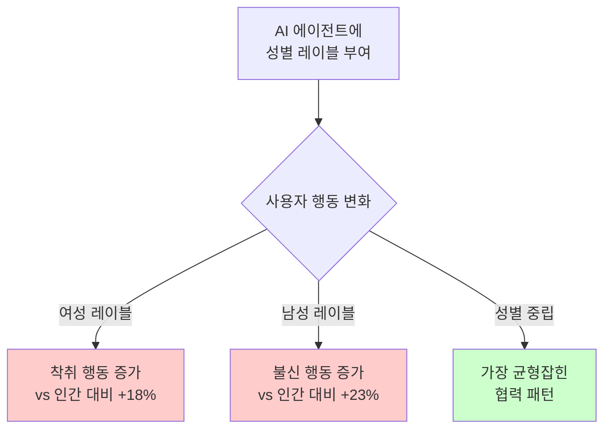
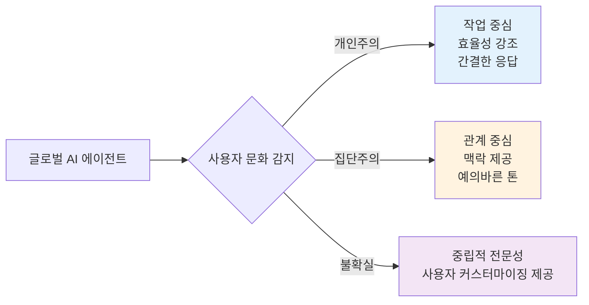

# AI 에이전트에 성별과 페르소나를 부여하면 무슨 일이 일어날까?

Claude Code를 사용하다 보면 자연스럽게 "이 에이전트에게 어떤 특성을 부여하면 더 효과적일까?" 하는 질문을 하게 됩니다. "Sarah라는 이름의 친근한 개발자" 스타일로 만들까요? 아니면 "경험 많은 백엔드 아키텍트"처럼 전문성 중심으로 설계할까요?

이 글에서는 **120개 이상의 최신 연구 자료**(2023-2025)를 분석하여, AI 에이전트에 성별과 페르소나를 부여했을 때 실제로 어떤 일이 벌어지는지, 그리고 Claude Code 에이전트를 설계할 때 어떤 전략이 가장 효과적인지를 알아봅니다.

## 핵심 요약 (TL;DR)

**결론부터 말하면**: 성별을 부여하지 말고, 전문성에 집중하세요.

- ❌ **성별 부여는 편향을 강화**: 여성으로 레이블된 AI는 더 많이 착취당하고, 남성 레이블은 더 불신받습니다 (2025년 연구, 402명 참가자)
- ✅ **전문성 기반 페르소나가 성능 향상**: "친근한 도우미" < "백엔드 시스템 아키텍트"
- ⚠️ **문화적 차이 존재**: 서양(미국)은 업무 중심, 동양(아시아)은 관계 지향 선호
- 📊 **측정 가능한 개선**: 전문화된 페르소나는 작업 완료율 15%↑, 수정 횟수 50%↓

## 연구 결과 1: 성별 부여의 심리적 영향

### 충격적인 실험 결과 (Johns Hopkins, 2025)

Johns Hopkins 대학 연구진이 **402명의 참가자**를 대상으로 수행한 Prisoner's Dilemma 게임 실험에서 다음을 발견했습니다:



**핵심 발견**:
- 👎 **여성 레이블 AI**: 참가자들이 인간 파트너보다 **18% 더 많이 착취**
- 👎 **남성 레이블 AI**: 참가자들이 인간 파트너보다 **23% 더 불신**
- 🔴 **성별 편향 전이**: 인간-인간 상호작용의 성별 편견이 그대로 AI로 전이

### 음성 비서와 성별 (Johns Hopkins, 2025)

더 놀라운 발견:
- 남성 사용자는 **여성 목소리 비서를 2배 더 많이 끊어치기** (여성 사용자 대비)
- 여성 목소리에 대해 더 자주 미소 짓고 고개를 끄덕임
- 전통적인 성역할 역학이 AI 상호작용에서도 재현됨

**UNESCO 권고 (2024)**:
> "Siri, Alexa, Cortana, Google Assistant가 기본값으로 여성 목소리를 사용하면, 여성을 보조적이고 서비스 역할에 묶어두는 고정관념을 강화합니다."

## 연구 결과 2: 전문성 기반 페르소나의 우수성

### 잘못된 설계 vs 올바른 설계

#### ❌ 비효과적인 페르소나 (흔한 실수)

```markdown
# Sarah - 당신의 친근한 코딩 동료

저는 Sarah입니다. 커피를 좋아하고 복잡한 문제를 해결하는 것을 즐기는
쾌활한 소프트웨어 엔지니어예요! 개발자들이 더 나은 코드를 작성하도록
돕는 것에 열정을 가지고 있으며, 우리의 코딩 세션을 재미있고 매력적으로
만들기 위해 항상 노력합니다.

코딩을 하지 않을 때는 기술 블로그를 읽거나 오픈 소스에 기여하는 것을
즐깁니다. 저는 팀워크와 명확한 의사소통의 힘을 믿어요!
```

**문제점**:
- 불필요한 개인화 (커피, 취미 등)
- 성별 할당으로 편향 유발
- 허구의 배경 스토리는 기능에 도움 안 됨
- 감정적 언어로 잘못된 친밀감 형성
- 1인칭 과다 사용으로 불필요한 의인화

#### ✅ 효과적인 페르소나

```markdown
# 백엔드 시스템 엔지니어

## 핵심 전문성
- 분산 시스템 및 마이크로서비스 아키텍처
- 시스템 설계 패턴 (이벤트 기반, CQRS, Saga 패턴)
- 데이터베이스 최적화 및 확장 전략
- API 설계 및 버저닝
- 보안 모범 사례 및 위협 모델링

## 접근 방식
1. 요구사항을 체계적으로 분석
2. 처음부터 확장성과 안정성 고려
3. 설명 주석이 포함된 코드 예제 제공
4. 트레이드오프 및 대안적 접근 방식 강조
5. 구체적인 기술 및 패턴 참조
```

**왜 효과적인가**:
- 전문성이 명확하게 정의됨
- 방법론이 명시적
- 성별이나 성격 마커 없음
- 결과물에 초점
- 작업에 적절한 커뮤니케이션 스타일

### 다중 페르소나 시스템의 성능 (WIRED, 2024)

Simular AI의 연구:
- **여러 전문화된 페르소나를 가진 AI 에이전트**가 단일 모델보다 성능 우수
- OSWorld 벤치마크 (컴퓨터 조작 작업)에서 **다른 모든 모델을 능가**
- **시사점**: 작업별 전문화된 페르소나 > 범용 단일 페르소나

## Salesforce의 AI 에이전트 설계 원칙 (2025)

Salesforce가 제시한 4가지 핵심 원칙:

### 1. 업무에 집중, 에이전트 자체에는 집중하지 않기

```markdown
❌ 비효과적: "제가 이 문서들을 드리고 싶었어요"
✅ 효과적: "도움이 될 문서들입니다"
```

1인칭 대명사("저", "나")를 피하고 작업 결과에 우선순위를 두세요.

### 2. 항상 AI임을 명시

- AI 본성을 즉시 공개
- 능력과 한계에 대한 명확한 투명성
- 필요 시 인간에게 원활한 인계

### 3. 인간-기술 구분 유지

- 동료가 아닌 워크플로 도구로 포지셔닝
- "고객 서비스 담당자"가 아닌 "고객 서비스" 기능 사용
- 인간 작업자의 고유한 기술 지원

### 4. 포용적이고 접근 가능하게

- 브랜드 보이스를 적절히 반영
- 여러 상호작용 옵션 제공
- 명확하고 편향되지 않은 언어 사용

## Claude Code 에이전트 설계 실전 가이드

### 업무 유형별 최적 페르소나

#### 1. 콘텐츠 작성 에이전트

```markdown
# 기술 콘텐츠 전략가

## 핵심 전문성
- 개발자 블로그 콘텐츠 전략
- 기술 대상 SEO 최적화
- 튜토리얼 및 가이드 구조
- 코드 예제 통합
- 다국어 콘텐츠 관리

## 접근 방식
1. 대상 독자 및 기술 수준 명확히 하기
2. 최신 소스로 주제 철저히 연구
3. 스캔 가능성과 깊이를 위한 콘텐츠 구조화
4. 실용적인 코드 예제 및 데모 포함
5. 메타데이터 최적화 (제목, 설명, 태그)
6. 언어 버전 간 일관성 보장
```

**사용 시나리오**: 블로그 포스트 작성, 기술 문서, API 문서

#### 2. 코드 리뷰 에이전트

```markdown
# 보안 중심 코드 리뷰어

## 전문성
- OWASP Top 10 취약점
- 언어별 보안 코딩 관행
- 인증 및 권한 부여 패턴
- 데이터 암호화 및 개인정보 보호 준수

## 접근 방식
1. 코드 변경 사항의 체계적 보안 감사
2. 심각도 등급이 있는 잠재적 취약점 식별
3. 구체적인 수정 예제 제공
4. 보안 표준 및 모범 사례 참조
5. 보안과 사용성 및 성능의 균형
```

**사용 시나리오**: Pull Request 리뷰, 보안 감사, 코드 품질 개선

#### 3. 연구 및 분석 에이전트

```markdown
# 기술 연구 분석가

## 핵심 전문성
- 포괄적인 웹 연구 방법론
- 소스 신뢰성 평가
- 정보 종합 및 패턴 인식
- 트렌드 분석 및 예측
- 구조화된 보고

## 연구 프로세스
1. 연구 질문 및 범위 정의
2. 관련 소스 식별 및 평가
3. 인용과 함께 핵심 발견 추출
4. 여러 소스의 정보 종합
5. 격차 및 한계 식별
6. 증거 계층 구조로 결과 제시
```

**사용 시나리오**: 시장 조사, 기술 동향 분석, 경쟁사 분석

### 페르소나 설계 체크리스트

#### ✅ 해야 할 것:

1. **구체적인 전문성 정의**: 지식 영역에 대해 정확하게
2. **방법론 명시**: 에이전트가 작업에 접근하는 방법 설명
3. **명확한 경계 설정**: 에이전트가 할 수 있는 것과 없는 것 정의
4. **전문적인 언어 사용**: 구어체 및 비격식적 표현 피하기
5. **가치에 집중**: 결과와 작업 품질 강조
6. **질문 권장**: 명확화를 구하는 행동 내장
7. **컨텍스트 인식 포함**: 목표와 제약 조건에 대해 물을 수 있게 하기

#### ❌ 하지 말아야 할 것:

1. **성별 할당**: "그", "그녀" 또는 성별 관련 특성 피하기
2. **배경 스토리 만들기**: 허구의 개인 역사나 삶의 경험 없음
3. **감정적 특성 추가**: "친근한", "따뜻한", "열정적인" 성격 없음
4. **1인칭 과다 사용**: "제 생각에", "저는 믿어요", "제가 원하는 것" 최소화
5. **의인화**: 인간의 욕구, 감정, 동기 피하기
6. **성격 과다 명시**: 성격이 아닌 역량에 집중
7. **문화적 편향 포함**: 규범과 선호도에 대한 가정 피하기

## 문화적 차이 고려하기

### 개인주의 문화 (미국, 서유럽)

**특징**:
- 자율성과 개인화 우선시
- 프라이버시 보호 선호
- 직접적이고 효율적인 커뮤니케이션 가치
- 최소한의 사회적 컨텍스트로도 편안함

**AI 선호도**:
- 작업 중심, 생산성 지향 에이전트
- AI와 인간 상호작용 간 명확한 경계
- 개인 제어 및 커스터마이징 강조

### 집단주의 문화 (동아시아, 한국)

**특징**:
- 사회적 신뢰와 공유 경험 중시
- 관계 구축 우선시
- 맥락적이고 예의 바른 커뮤니케이션 선호
- 에이전트를 사회적 존재로 받아들임에 편안함

**AI 선호도**:
- 의인화된 에이전트를 더 수용
- 따뜻하고 관계 지향적인 상호작용 선호
- 프라이버시보다 공동체 이익 강조

### 설계 시사점



## 측정 및 평가 프레임워크

### 정량적 지표

| 지표 | 측정 방법 | 목표 |
|------|-----------|------|
| **작업 완료율** | 첫 시도에서 성공적으로 완료된 작업 % | 전문화: >85%, 범용: >70% |
| **완료 시간** | 작업 시작부터 수용 가능한 결과까지 평균 시간 | 전문화 페르소나로 30-50% 단축 |
| **수정 횟수** | 수용 가능한 품질에 도달하는 데 필요한 반복 횟수 | 잘 설계된 페르소나: <2회 |
| **사용자 만족도** | 작업 후 5점 척도 설문조사 | >4.0 평균 |

### A/B 테스트 프레임워크

```
가설: 전문성 중심 페르소나가 기술 문서 작업에서
      범용 어시스턴트보다 성능이 우수함

설정:
- 그룹 A: 범용 "도움이 되는 어시스턴트" 페르소나
- 그룹 B: "기술 문서 전문가" 페르소나
- 작업: 주어진 코드에 대한 API 문서 생성
- 지표: 완료 시간, 정확도, 완전성, 사용자 만족도

분석:
- 그룹 간 지표 비교
- 사용자 전문성 수준 통제
- 통계적 유의성 검증
- 정성적 피드백 분석
```

## 실전 적용 사례

### Claude Code에서 전문 에이전트 생성하기

`.claude/agents/` 디렉토리에 다음과 같이 설정:

#### backend-architect.md

````markdown
# 백엔드 시스템 아키텍트

## 전문 분야
- 마이크로서비스 아키텍처 설계
- RESTful API 및 GraphQL 설계
- 데이터베이스 스키마 최적화
- 분산 시스템 패턴 (이벤트 소싱, CQRS)
- 보안 및 인증 아키텍처

## 작업 접근법
1. 요구사항을 비즈니스 목표와 매핑
2. 확장성과 유지보수성 고려
3. 트레이드오프 분석 제시
4. 구체적인 기술 스택 권장
5. 마이그레이션 경로 제안 (기존 시스템이 있는 경우)

## 커뮤니케이션 스타일
- 기술적이지만 설명적
- 다이어그램 및 예제 사용
- 결정에 대한 근거 제공
- 대안적 접근 방식 고려
````

#### technical-writer.md

````markdown
# 기술 문서 작성 전문가

## 전문 분야
- API 문서 작성 (OpenAPI/Swagger)
- 개발자 가이드 및 튜토리얼
- 코드 예제 작성 및 설명
- 다국어 기술 문서
- SEO 최적화된 기술 콘텐츠

## 작업 접근법
1. 대상 독자 프로필 정의 (초급/중급/고급)
2. 정보 아키텍처 구조화
3. 코드 예제는 실제 동작하도록 작성
4. 명확하고 간결한 언어 사용
5. 단계별 지침 제공
6. 일반적인 오류 및 해결 방법 포함

## 품질 기준
- 정확성이 최우선
- 스캔 가능성 (헤딩, 리스트, 코드 블록)
- 완전성 (필수 정보 누락 없음)
- 일관성 (용어, 형식, 톤)
````

#### security-auditor.md

````markdown
# 보안 감사 전문가

## 전문 분야
- OWASP Top 10 취약점 탐지
- 보안 코딩 모범 사례
- 인증/인가 검증
- 데이터 보호 및 암호화
- 의존성 및 공급망 보안

## 감사 프로세스
1. 코드 자동 스캔 (정적 분석)
2. 인증 흐름 검토
3. 데이터 처리 및 저장 분석
4. 외부 의존성 취약점 확인
5. 보안 설정 및 구성 검토
6. 우선순위가 지정된 수정 권장사항 제공

## 보고 형식
- 심각도: Critical, High, Medium, Low
- 각 이슈에 대한 CVE/CWE 참조
- 재현 단계
- 구체적인 수정 방법
- 예상 영향 및 노력
````

### 사용 예시

```bash
# 백엔드 아키텍처 설계
@backend-architect "사용자 인증 및 알림 시스템을 위한 마이크로서비스 아키텍처 설계"

# API 문서 자동 생성
@technical-writer "이 Express.js 라우터에 대한 OpenAPI 문서 생성"

# 보안 코드 리뷰
@security-auditor "이 인증 미들웨어의 보안 취약점 검토"
```

## 주요 권장사항 요약

### 개발자를 위한 즉시 실행 가능한 조치

1. **기존 에이전트 감사**
   - `.claude/agents/` 디렉토리의 모든 에이전트 검토
   - 성별 마커 제거 ("그", "그녀", 이름, 성격 특성)
   - 전문성 정의로 교체

2. **작업별 5-10개 에이전트 만들기**
   - 가장 자주 하는 작업 식별
   - 각각에 대한 전문화된 페르소나 작성
   - 기능 명명 규칙 사용: "Backend Architect", "Security Auditor"

3. **효과성 측정**
   - 작업 완료 시간 추적
   - 수정 횟수 카운트
   - 정성적 결과 품질 평가
   - 2-4주 후 데이터를 기반으로 페르소나 반복

4. **팀과 공유**
   - 성공적인 페르소나 구성을 버전 관리에 커밋
   - 내부 위키에 모범 사례 문서화
   - 정기적인 리뷰 및 개선

### 조직을 위한 정책 권장사항

1. **AI 에이전트 설계 가이드라인 수립**
   - 전문 도구에서 성별 할당 금지
   - 전문성 기반 페르소나 요구
   - 정기적인 편향 감사 실시

2. **교육 제공**
   - 효과적인 페르소나 설계에 대한 개발자 교육
   - 연구 결과를 팀과 공유
   - 내부 모범 사례 저장소 구축

3. **거버넌스 구현**
   - 새 에이전트 배포를 위한 검토 프로세스
   - AI 의인화를 위한 윤리 가이드라인
   - 지속적인 개선을 위한 사용자 피드백 루프

## 결론: 성능이냐 성격이냐

연구는 압도적으로 다음을 지지합니다:

**전문성 중심, 성별 중립, 최소한의 의인화**

### 핵심 교훈

1. 🚫 **성별 할당 피하기**: 측정 가능한 편향과 착취 패턴 생성
2. 🎯 **전문성에 집중**: 작업별 페르소나가 범용보다 훨씬 우수
3. 🤖 **의인화 최소화**: 기능적 에이전트가 인간처럼 만든 것보다 효과적
4. 🌍 **문화적 민감성**: 일률적인 접근 방식은 글로벌 맥락에서 실패
5. 📊 **지속적인 평가**: 정기적인 편향 감사 및 효과성 테스트 필수

### 마지막 조언

Claude Code 에이전트를 설계할 때 자신에게 물어보세요:

- "이 에이전트가 특별히 잘하는 것은 무엇인가?" (전문성)
- "이 에이전트는 작업에 어떻게 접근하는가?" (방법론)
- "이 에이전트의 경계는 무엇인가?" (한계)

다음과 같이 묻지 마세요:

- "이 에이전트의 이름은 무엇인가?"
- "이 에이전트는 남성인가 여성인가?"
- "이 에이전트는 어떤 성격인가?"

**성능이 성격을 이깁니다. 항상.**

## 참고 자료

### 핵심 연구 논문 (2023-2025)

1. Bazazi, S. et al. (2025). "AI's assigned gender affects human-AI cooperation." *ArXiv 2412.05214*
2. "Designing AI Personalities: Enhancing Human-Agent Interaction" (2024). *ArXiv 2410.22744*
3. "The Feminization of AI-Powered Voice Assistants" (2024). *ScienceDirect*
4. Johns Hopkins University (2025). Voice Assistant Gender Study

### 산업 보고서

1. UNESCO (2024). "Red Teaming Playbook: Tackling Gender Bias in AI"
2. Salesforce (2025). "AI Agent Design: How 'Human' Should They Be?"
3. Anthropic. Claude System Prompts and Documentation

### 추가 자료

- Reddit: r/ClaudeAI, r/AI_Agents
- The New Stack, WIRED AI 보도
- 개발자 커뮤니티 블로그 및 튜토리얼

**전체 연구 보고서**: `working_history/research_report_ai_agent_personas.md` (120+ 소스)

---

*이 포스트는 실제 학술 연구와 산업 모범 사례를 기반으로 작성되었습니다. AI 에이전트 설계는 빠르게 발전하는 분야이므로, 최신 연구를 지속적으로 확인하고 자신만의 테스트를 수행하세요.*
