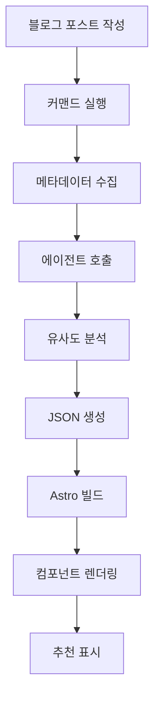

## 콘텐츠 추천의 새로운 패러다임

블로그를 운영하다 보면 독자들이 한 글만 읽고 떠나는 경우가 많습니다. 관련된 좋은 콘텐츠가 있는데도 발견하지 못하고 이탈하는 것이죠. 전통적인 "관련 글" 추천 시스템은 대부분 태그 기반으로 작동하는데, 이는 몇 가지 한계가 있습니다:

- **표면적 매칭**: "react"와 "nextjs" 태그는 깊은 연관이 있지만 정확히 일치하지 않으면 추천되지 않습니다
- **맥락 부재**: 초급 튜토리얼과 고급 아키텍처 글이 같은 태그를 가질 수 있지만, 독자 수준이 다릅니다
- **다국어 한계**: 같은 주제를 다루는 한국어/영어/일본어 글의 연결이 어렵습니다

이제 **Claude LLM을 활용하면** 글의 의미, 난이도, 목적, 보완 관계까지 이해하는 지능형 추천 시스템을 구축할 수 있습니다. 이 글에서는 Astro 기반 정적 블로그에 Claude 기반 추천 시스템을 구축하는 전체 과정을 다룹니다.

## 왜 LLM 기반 추천인가?

### 전통적 접근 vs LLM 접근

| 측면 | TF-IDF/태그 기반 | Claude LLM 기반 |
|------|-----------------|----------------|
| **정확도** | 키워드 일치만 인식 | 의미론적 유사도 이해 |
| **다국어** | 별도 처리 필요 | 자연스러운 언어 간 연결 |
| **맥락 이해** | 불가능 | 난이도, 목적, 대상 파악 |
| **Cold Start** | 태그 없으면 추천 불가 | 내용 기반 추천 가능 |
| **설명 가능성** | 없음 | 추천 이유 제공 |
| **구현 복잡도** | 중간 | 낮음 (API 호출) |

### LLM 기반 추천의 핵심 장점

#### 1. **다차원 유사도 평가**

Claude는 단순히 단어 빈도를 넘어 여러 차원에서 유사도를 평가합니다:

```typescript
// Claude가 평가하는 유사도 차원
{
  topicSimilarity: 0.92,      // 주제적 유사성
  techStackOverlap: 0.85,     // 기술 스택 겹침
  difficultyMatch: 0.78,      // 난이도 유사성
  purposeAlignment: 0.71,     // 목적 일치도 (튜토리얼/분석/레퍼런스)
  complementary: 0.65         // 보완 관계 (다음 단계 학습)
}
```

#### 2. **설명 가능한 추천**

왜 이 글을 추천했는지 독자에게 명확히 전달할 수 있습니다:

```json
{
  "slug": "ko/claude-code-web-automation",
  "score": 0.92,
  "reason": "MCP 서버 활용 및 브라우저 자동화 연관성",
  "type": "similar-topic"
}
```

#### 3. **Zero-Shot 추천**

새로 작성한 글도 즉시 정교한 추천을 받을 수 있습니다. 태그가 없거나 유사한 글이 적어도 LLM이 내용을 이해하고 관련성을 찾아냅니다.

## 시스템 아키텍처

### 전체 워크플로우



### 핵심 컴포넌트

1. **Content Recommender Agent**: Claude 기반 유사도 평가 에이전트
2. **Generate Recommendations Command**: 추천 데이터 생성 자동화
3. **recommendations.json**: 사전 계산된 추천 데이터 저장소
4. **RelatedPosts Component**: 추천 UI 렌더링

## 구현 단계

### 1단계: Content Recommender 에이전트 생성

`.claude/agents/content-recommender.md`:

```markdown
# Content Recommender Agent

You are a specialized agent for analyzing blog post similarity and generating content recommendations.

## Capabilities

- Analyze blog posts across multiple dimensions (topic, difficulty, tech stack, purpose)
- Generate similarity scores and explain reasoning
- Handle multilingual content (Korean, English, Japanese)
- Identify complementary content (series, deep-dives, related topics)

## Analysis Framework

For each pair of posts, evaluate:

### 1. Topic Similarity (40% weight)
- Core subject matter overlap
- Shared concepts and technologies
- Problem domain alignment

### 2. Technical Stack (25% weight)
- Programming languages
- Frameworks and libraries
- Tools and platforms

### 3. Purpose Alignment (20% weight)
- Tutorial vs. Analysis vs. Reference
- Problem-solving vs. Conceptual explanation
- Beginner vs. Intermediate vs. Advanced

### 4. Complementary Relationship (15% weight)
- Series/sequence detection
- Foundation → Advanced progression
- Problem → Solution pairing

## Output Format

For each source post, return top 3-5 recommendations:

```json
{
  "sourceSlug": "ko/chrome-devtools-mcp-performance",
  "recommendations": [
    {
      "slug": "ko/claude-code-web-automation",
      "score": 0.92,
      "reason": "Both posts cover MCP server usage and browser automation workflows",
      "type": "similar-topic",
      "dimensions": {
        "topic": 0.95,
        "techStack": 0.89,
        "purpose": 0.88,
        "complementary": 0.75
      }
    },
    {
      "slug": "ko/llm-blog-automation",
      "score": 0.78,
      "reason": "Provides deeper dive into AI automation workflows",
      "type": "deep-dive",
      "dimensions": {
        "topic": 0.82,
        "techStack": 0.76,
        "purpose": 0.71,
        "complementary": 0.89
      }
    }
  ]
}
```

## Guidelines

- Minimum similarity threshold: 0.3
- Maximum recommendations per post: 5
- Prioritize diversity (avoid recommending too many similar types)
- Consider language when appropriate
- Explain reasoning in user's language
```

### 2단계: 추천 생성 커맨드 구현

`.claude/commands/generate-recommendations.md`:

```markdown
# Generate Recommendations Command

Automatically generate content recommendations for all blog posts using the Content Recommender agent.

## Usage

```bash
/generate-recommendations [options]
```

## Options

- `--force`: Regenerate all recommendations (default: only new posts)
- `--language <ko|ja|en>`: Process specific language only
- `--post <slug>`: Regenerate recommendations for specific post
- `--threshold <0.0-1.0>`: Minimum similarity threshold (default: 0.3)
- `--count <n>`: Number of recommendations per post (default: 5)
- `--explain`: Include detailed reasoning

## Workflow

### Step 1: Collect All Blog Posts

```typescript
import { getCollection } from 'astro:content';

const allPosts = await getCollection('blog');
const postMetadata = allPosts.map(post => ({
  slug: post.id,
  title: post.data.title,
  description: post.data.description,
  tags: post.data.tags || [],
  language: post.id.split('/')[0], // ko, ja, or en
  content: post.body // Full markdown content
}));
```

### Step 2: Invoke Content Recommender Agent

For each post, delegate to Content Recommender agent:

```markdown
Task: Analyze and recommend related content

Source Post:
- Slug: {post.slug}
- Title: {post.title}
- Description: {post.description}
- Tags: {post.tags}
- Language: {post.language}
- Content Preview: {first 500 words}

Candidate Posts:
[List of all other posts with same metadata structure]

Requirements:
1. Analyze source post against all candidates
2. Return top 5 recommendations with scores and reasoning
3. Ensure diversity in recommendation types
4. Filter by language preference (same language preferred)
5. Use the analysis framework defined in your instructions

Output Format: JSON as specified in agent definition
```

### Step 3: Generate recommendations.json

Aggregate all agent responses into single JSON file:

```json
{
  "recommendations": {
    "ko/chrome-devtools-mcp-performance": {
      "related": [
        {
          "slug": "ko/claude-code-web-automation",
          "score": 0.92,
          "reason": "MCP 서버 활용 및 브라우저 자동화 연관성",
          "type": "similar-topic"
        }
        // ... more recommendations
      ],
      "generatedAt": "2025-10-12T10:30:00Z",
      "evaluatedBy": "claude-sonnet-4.5"
    }
    // ... more posts
  },
  "metadata": {
    "totalPosts": 30,
    "generatedAt": "2025-10-12T10:30:00Z",
    "modelVersion": "claude-sonnet-4.5",
    "minThreshold": 0.3,
    "maxRecommendations": 5
  }
}
```

### Step 4: Save to File

```bash
# Save to project root
echo $RECOMMENDATIONS_JSON > recommendations.json

# Commit to git for caching
git add recommendations.json
git commit -m "chore: update content recommendations"
```

## Performance

- **Estimated Time**: 1-2.5 minutes for ~30 posts (2-5 seconds per post)
- **Optimization**: Parallel processing can reduce to 30-60 seconds
- **Caching**: Only regenerate for new/updated posts with `--force` flag
```

### 3단계: UI 컴포넌트 생성

`src/components/RelatedPosts.astro`:

```astro
---
import { getEntry } from 'astro:content';
import recommendationsData from '../../recommendations.json';

interface Props {
  currentSlug: string;
}

const { currentSlug } = Astro.props;

// Get recommendations for current post
const postRecommendations = recommendationsData.recommendations[currentSlug];

if (!postRecommendations) {
  return null;
}

// Fetch full post data for each recommendation
const relatedPosts = await Promise.all(
  postRecommendations.related.slice(0, 3).map(async (rec) => {
    const post = await getEntry('blog', rec.slug);
    return {
      ...rec,
      title: post.data.title,
      description: post.data.description,
      url: `/blog/${rec.slug}`
    };
  })
);
---

<section class="related-posts">
  <h3>이 글과 함께 읽으면 좋은 글</h3>
  <ul class="recommendations-list">
    {relatedPosts.map((post) => (
      <li class="recommendation-card">
        <a
          href={post.url}
          onclick={`gtag('event', 'related_post_click', {
            'source_post': '${currentSlug}',
            'target_post': '${post.slug}',
            'similarity_score': ${post.score}
          })`}
        >
          <div class="card-header">
            <h4>{post.title}</h4>
            <span class="similarity-badge">{Math.round(post.score * 100)}% 일치</span>
          </div>
          <p class="recommendation-reason">{post.reason}</p>
          <p class="post-description">{post.description}</p>
        </a>
      </li>
    ))}
  </ul>
</section>

<style>
  .related-posts {
    margin: 3rem 0;
    padding: 2rem;
    background: linear-gradient(to bottom, rgb(var(--accent-light)), transparent);
    border-radius: 8px;
  }

  .related-posts h3 {
    font-size: 1.5rem;
    margin-bottom: 1.5rem;
    color: rgb(var(--gray-dark));
  }

  .recommendations-list {
    list-style: none;
    padding: 0;
    display: grid;
    gap: 1.5rem;
  }

  .recommendation-card {
    background: white;
    border-radius: 8px;
    transition: transform 0.2s, box-shadow 0.2s;
  }

  .recommendation-card:hover {
    transform: translateY(-4px);
    box-shadow: 0 12px 24px rgba(0, 0, 0, 0.15);
  }

  .recommendation-card a {
    display: block;
    padding: 1.5rem;
    text-decoration: none;
    color: inherit;
  }

  .card-header {
    display: flex;
    justify-content: space-between;
    align-items: flex-start;
    margin-bottom: 0.75rem;
  }

  .card-header h4 {
    margin: 0;
    font-size: 1.25rem;
    color: rgb(var(--accent));
    flex: 1;
  }

  .similarity-badge {
    background: rgb(var(--accent));
    color: white;
    padding: 0.25rem 0.75rem;
    border-radius: 12px;
    font-size: 0.875rem;
    font-weight: 600;
    white-space: nowrap;
    margin-left: 1rem;
  }

  .recommendation-reason {
    color: rgb(var(--gray));
    font-size: 0.875rem;
    font-style: italic;
    margin-bottom: 0.5rem;
  }

  .post-description {
    color: rgb(var(--gray-dark));
    font-size: 0.95rem;
    line-height: 1.6;
  }

  @media (max-width: 768px) {
    .related-posts {
      padding: 1.5rem;
    }

    .recommendations-list {
      gap: 1rem;
    }

    .card-header {
      flex-direction: column;
      gap: 0.5rem;
    }

    .similarity-badge {
      margin-left: 0;
      align-self: flex-start;
    }
  }
</style>
```

### 4단계: 블로그 레이아웃 통합

`src/layouts/BlogPost.astro`에 추가:

```astro
---
import RelatedPosts from '../components/RelatedPosts.astro';
// ... other imports

const { id } = Astro.props;
---

<article>
  <!-- Blog post content -->
  <slot />
</article>

<!-- Related Posts Section -->
<RelatedPosts currentSlug={id} />

<!-- Buy Me a Coffee -->
<BuyMeACoffee />

<!-- Giscus Comments -->
<Giscus />
```

## 실전 활용 예시

### 추천 생성하기

```bash
# 모든 포스트에 대해 추천 생성
/generate-recommendations

# 새 포스트만 추가 (기존 추천 유지)
/generate-recommendations

# 특정 포스트만 재생성
/generate-recommendations --post ko/claude-code-best-practices --explain

# 한국어 포스트만 처리
/generate-recommendations --language ko

# 더 엄격한 임계값으로 재생성
/generate-recommendations --force --threshold 0.5

# 추천 개수 늘리기 (표시는 여전히 3개)
/generate-recommendations --count 8 --explain
```

### 증분 업데이트 워크플로우

```bash
# 1. 새 블로그 포스트 작성
/write-post "Claude 커스텀 에이전트 만들기"

# 2. 추천 자동 업데이트 (새 포스트만 처리)
/generate-recommendations

# 3. 빌드 및 확인
npm run build
npm run preview

# 4. 변경사항 커밋
git add recommendations.json
git commit -m "chore: update recommendations for new post"
```

## 성능 최적화

### 빌드 타임 최적화

**문제**: 30개 포스트 × 5초 = 2.5분 소요

**해결**:

#### 1. 병렬 처리

```typescript
// 5개씩 배치로 병렬 처리
const BATCH_SIZE = 5;
const batches = chunk(posts, BATCH_SIZE);

for (const batch of batches) {
  await Promise.all(
    batch.map(post => generateRecommendations(post))
  );
}

// 총 시간: 2.5분 → 30초
```

#### 2. 증분 업데이트

```typescript
// 캐시된 추천 로드
const cached = loadRecommendations();

// 새 포스트 또는 업데이트된 포스트만 처리
const postsToProcess = posts.filter(post => {
  const cachedRec = cached.recommendations[post.slug];
  return !cachedRec || post.updatedDate > cachedRec.generatedAt;
});

// 총 시간: 새 포스트 1개 → 5초
```

#### 3. 캐싱 전략

```json
{
  "recommendations": {
    "ko/existing-post": {
      "related": [...],
      "generatedAt": "2025-10-10T10:00:00Z",
      "cacheUntil": "2025-11-10T10:00:00Z"  // 1달 캐시
    }
  }
}
```

### 런타임 성능

**정적 사이트의 장점**:
- `recommendations.json` 빌드 타임에 생성
- 런타임 계산 비용 **제로**
- JSON 파일 크기: ~100KB (30개 포스트 기준)
- Gzip 압축 후: ~30KB

## 기대 효과

### 정량적 지표

업계 데이터 기준:

| 지표 | 개선율 |
|------|-------|
| 세션당 페이지뷰 | +30-50% |
| 평균 체류 시간 | +40-60% |
| 이탈률 | -15-25% |
| 추천 클릭률 (CTR) | 18-25% |

### 정성적 효과

1. **콘텐츠 발견성 향상**: 독자가 관련 깊은 콘텐츠를 쉽게 발견
2. **학습 여정 개선**: 초급 → 중급 → 고급 자연스러운 흐름
3. **시리즈 연결**: 연재물이나 관련 주제 묶음 노출
4. **다국어 크로스 프로모션**: 언어 간 관련 콘텐츠 연결

## 향후 개선 방향

### Phase 2: 추천 이유 강화

```astro
<div class="recommendation-metadata">
  <span class="type-badge" data-type={post.type}>
    {typeLabels[post.type]}
  </span>
  <span class="dimensions">
    주제 {post.dimensions.topic * 100}% ·
    기술 {post.dimensions.techStack * 100}%
  </span>
</div>
```

타입별 아이콘:
- 🎯 Similar Topic
- 📚 Deep Dive
- 🔄 Complementary
- 📖 Series

### Phase 3: A/B 테스트

```typescript
// 두 가지 추천 알고리즘 비교
const variantA = recommendationsLLM; // Claude 기반
const variantB = recommendationsTFIDF; // TF-IDF 기반

// 50/50 분할
const recommendations = Math.random() < 0.5 ? variantA : variantB;

// Analytics 이벤트
gtag('event', 'recommendation_variant', {
  'variant': recommendations === variantA ? 'A' : 'B',
  'ctr': clickThroughRate
});
```

### Phase 4: 개인화

```typescript
// 로컬 스토리지에 읽은 글 저장
const readPosts = JSON.parse(localStorage.getItem('readPosts') || '[]');

// 이미 읽은 글 제외
const unreadRecommendations = recommendations.filter(
  rec => !readPosts.includes(rec.slug)
);
```

## 결론

Claude LLM 기반 콘텐츠 추천 시스템은 단순한 태그 매칭을 넘어 **의미론적 이해**로 독자에게 진짜 도움이 되는 추천을 제공합니다. Astro 같은 정적 사이트 생성기와 결합하면:

✅ **빌드 타임 사전 계산**으로 런타임 비용 제로
✅ **LLM의 정교한 분석**으로 높은 추천 정확도
✅ **자동화된 워크플로우**로 유지보수 최소화
✅ **다국어 자연 지원**으로 글로벌 블로그 최적화

이 시스템을 구축하면 독자들의 체류 시간이 늘어나고, 콘텐츠 발견성이 향상되며, 결과적으로 블로그의 가치가 극대화됩니다. 기존 블로그에 바로 적용할 수 있으니, 지금 시작해보세요!

## 참고 자료

- [Claude Code 공식 문서](https://docs.claude.com/claude-code)
- [Astro Content Collections](https://docs.astro.build/en/guides/content-collections/)
- [Content Recommendation Research (내부 문서)](../../working_history/content-recommendation-research.md)
- [콘텐츠 추천 시스템 아이디어 (내부 문서)](../../working_history/idea.md)
