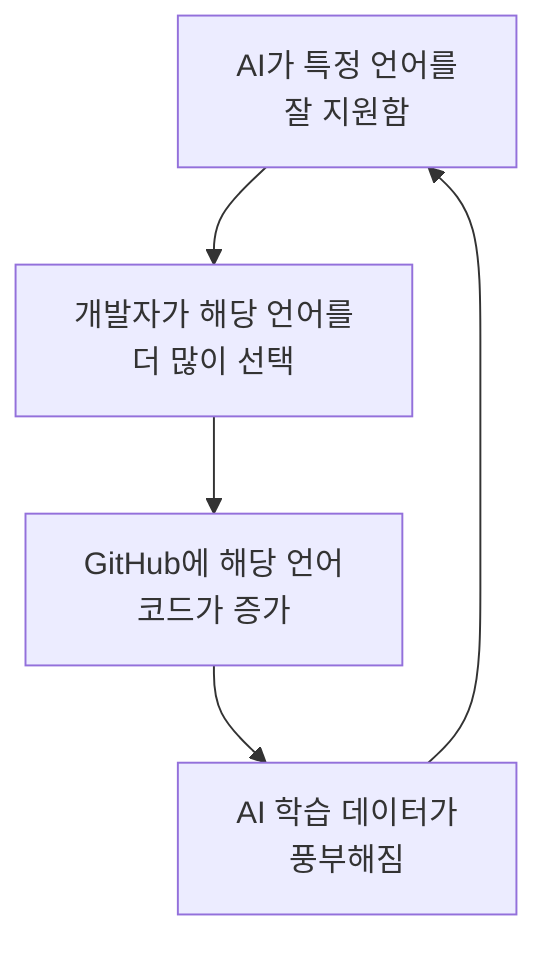
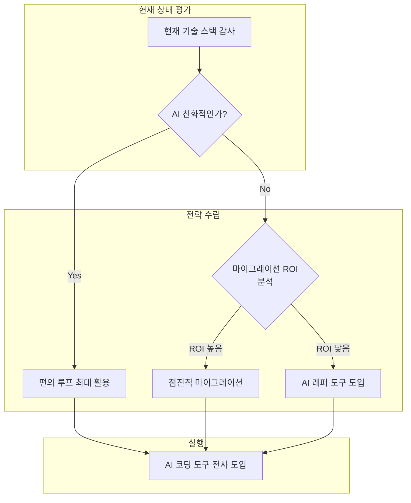

## 개요

AI 코딩 어시스턴트가 단순히 "코드를 빨리 짜는 도구"에 머물지 않고, <strong>개발자가 어떤 언어를 선택하는지까지 바꾸고 있다</strong>는 데이터가 나왔습니다. GitHub의 Octoverse 2025 리포트에 따르면 TypeScript는 전년 대비 <strong>66% 급등</strong>하며 GitHub에서 가장 많이 사용되는 언어 1위에 올랐고, GitHub 개발자 애드보킷 Andrea Griffiths는 이를 <strong>"편의 루프(Convenience Loop)"</strong>라고 명명했습니다.

이 글에서는 편의 루프의 메커니즘을 분석하고, Engineering Manager와 CTO가 기술 스택 결정에서 고려해야 할 구조적 변화를 살펴봅니다.

## 편의 루프란 무엇인가

### 자기 강화 피드백 메커니즘

편의 루프(Convenience Loop)는 다음과 같은 순환 구조를 가집니다:



AI 코딩 도구가 특정 기술을 마찰 없이(frictionless) 사용할 수 있게 만들면, 개발자들이 그 기술로 몰립니다. 이것이 더 많은 학습 데이터를 생성하고, AI가 해당 기술에서 더 정확해지는 <strong>자기 강화 사이클</strong>이 형성됩니다.

### 왜 TypeScript가 66% 급등했나

TypeScript가 이 루프의 최대 수혜자가 된 이유는 <strong>정적 타입 시스템이 LLM의 작동 방식과 구조적으로 궁합이 맞기 때문</strong>입니다.

<strong>학술 연구 데이터</strong>: 2025년 학술 연구에 따르면 LLM이 생성한 코드의 컴파일 오류 중 <strong>94%가 타입 체크 실패</strong>였습니다. 이는 정적 타이핑이 AI의 실수를 프로덕션에 배포되기 전에 잡아주는 "안전 가드레일" 역할을 한다는 것을 의미합니다.

```typescript
// TypeScript: AI가 타입을 보고 즉시 유효한 연산만 제안
function processUser(user: { name: string; age: number }) {
  // AI는 user.name이 string임을 알고 .toUpperCase()를 정확히 제안
  // user.age에는 숫자 연산만 제안
  return `${user.name.toUpperCase()} (${user.age + 1}세)`;
}

// JavaScript: AI가 런타임 타입을 추측해야 함
function processUser(user) {
  // user.name이 string인지, user.age가 number인지 보장 없음
  // AI의 제안이 런타임 에러를 유발할 수 있음
  return `${user.name.toUpperCase()} (${user.age + 1}세)`;
}
```

<strong>핵심 차이</strong>: `x: string`이라고 선언하면 AI는 즉시 string에서 작동하지 않는 모든 연산을 배제합니다. 타입이 없으면 AI는 "아마 string일 것"이라고 추측해야 하고, 이 추측이 틀리면 런타임 에러로 이어집니다.

### 프레임워크 생태계의 가속 효과

TypeScript의 급등은 언어 자체만의 힘이 아닙니다. <strong>Next.js, Astro, Remix</strong> 등 주요 프레임워크가 TypeScript를 기본값으로 채택하면서 시너지가 발생했습니다:

- <strong>Next.js 15+</strong>: `create-next-app`이 TypeScript를 기본으로 생성
- <strong>Astro 5+</strong>: Content Collections에서 TypeScript 기반 스키마 검증
- <strong>Remix/React Router 7</strong>: 타입 안전한 라우팅을 핵심 기능으로 제공

프레임워크 → TypeScript 기본 채택 → AI 코드 생성 품질 향상 → 개발자 채택 증가의 <strong>다층 편의 루프</strong>가 형성되고 있습니다.

## 언어별 AI 호환성 격차

### AI 친화적 언어 vs 비친화적 언어

| 언어 | AI 코드 생성 품질 | 주요 이유 |
|------|-----------------|----------|
| <strong>Python</strong> | 매우 높음 | 교육/ML에서 압도적 학습 데이터 |
| <strong>TypeScript</strong> | 매우 높음 | 정적 타입 + 풍부한 생태계 |
| <strong>Go</strong> | 높음 | 단순한 문법 + 명시적 에러 처리 |
| <strong>Rust</strong> | 중간 | 강력한 타입이지만 소유권 규칙이 복잡 |
| <strong>C++</strong> | 낮음 | 복잡한 문법, 학습 데이터 대비 패턴 다양 |
| <strong>Perl</strong> | 매우 낮음 | 학습 데이터 부족, 문법 모호성 |

<strong>주목할 패턴</strong>: AI 도구가 잘 지원하는 언어로 개발자가 이동하면서, 지원이 약한 언어의 학습 곡선은 더 가파라집니다. 새 개발자가 C++을 배울 때 AI 도움을 거의 받지 못한다면, Python이나 TypeScript를 선택할 확률이 높아집니다.

### GitHub 데이터가 보여주는 숫자

- <strong>TypeScript</strong>: 월간 활성 기여자 263만 6천 명 (1위)
- <strong>Python</strong>: AI/ML 연구에서 25.87%로 여전히 선두
- <strong>공용 LLM SDK 레포</strong>: 110만 개 이상이 이미 LLM SDK를 사용

이 수치가 보여주는 것은 <strong>AI 도구 호환성이 "있으면 좋은 것"이 아니라 언어 선택의 핵심 변수</strong>가 되었다는 점입니다.

## EM/CTO 관점: 기술 스택 전략의 변화

### 1. 채용 전략의 재검토

AI 편의 루프는 채용 시장에도 영향을 미칩니다:

- <strong>TypeScript/Python 개발자 풀이 가장 빠르게 성장</strong>: 신규 개발자들이 AI와의 궁합이 좋은 언어부터 학습
- <strong>레거시 언어 전문가의 희소성 증가</strong>: Perl, COBOL 등은 AI 지원이 약해 신규 유입이 감소
- <strong>AI 활용 능력이 새로운 기술 역량 기준</strong>: 언어 자체보다 "AI 도구와 함께 생산적으로 일할 수 있는가"가 중요

### 2. 기술 부채 대응 전략



<strong>실무 가이드</strong>:

- <strong>Python/TypeScript 중심 스택</strong>: AI 코딩 도구를 적극 활용해 생산성 극대화
- <strong>Java/C# 스택</strong>: 정적 타입의 이점을 활용하되, AI 도구 커버리지 확인 필요
- <strong>동적 타입 레거시(PHP, Ruby)</strong>: TypeScript 타입 정의 추가나 점진적 마이그레이션 검토
- <strong>시스템 언어(C/C++)</strong>: AI 지원이 제한적이므로 Rust로의 전환 로드맵 수립 고려

### 3. 개발 생산성 측정의 변화

기존 생산성 지표에 <strong>AI 활용 효율</strong>을 추가해야 합니다:

- <strong>AI 제안 채택률</strong>: 팀이 AI 코드 제안을 얼마나 활용하는가
- <strong>타입 커버리지</strong>: 코드베이스에서 타입이 명시된 비율 (AI 성능과 직결)
- <strong>AI 유발 버그 비율</strong>: AI가 생성한 코드에서 발생하는 결함 추적
- <strong>언어별 AI ROI</strong>: 어떤 언어/프레임워크에서 AI 도구 투자 대비 생산성 향상이 높은가

## 편의 루프의 리스크

### 다양성 감소 문제

편의 루프의 자기 강화 특성은 장점이자 리스크입니다:

- <strong>새로운 언어의 진입 장벽 상승</strong>: AI 학습 데이터가 부족한 신규 언어는 개발자 유입이 어려움
- <strong>특정 패러다임 편향</strong>: AI가 잘 생성하는 코드 패턴으로 획일화 우려
- <strong>혁신적 접근의 저평가</strong>: AI가 "일반적인" 솔루션을 선호하면서 비전통적 접근이 도태될 가능성

### 보안 관점

LLM이 생성한 코드의 <strong>94%가 타입 체크 실패</strong>라는 데이터는 타입 시스템의 중요성을 보여주지만, 동시에 <strong>AI 생성 코드의 품질이 아직 완전하지 않다</strong>는 신호이기도 합니다. 타입 시스템을 갖춘 언어에서도 보안 취약점 검토는 필수입니다.

## 결론: 기술 선택의 새로운 축

AI 편의 루프는 프로그래밍 언어 선택에 <strong>새로운 차원의 기준</strong>을 추가했습니다. 기존에는 성능, 생태계, 팀 역량이 주요 기준이었다면, 이제는 <strong>"AI 도구와의 궁합"</strong>이 무시할 수 없는 변수가 되었습니다.

<strong>Engineering Manager와 CTO를 위한 핵심 시사점</strong>:

1. <strong>기술 스택 결정에 AI 호환성을 공식 기준으로 포함</strong>하세요
2. 정적 타입 시스템을 갖춘 언어가 AI 시대에 구조적 우위를 가집니다
3. 편의 루프의 혜택을 극대화하되, <strong>다양성 감소와 보안 리스크를 모니터링</strong>하세요
4. 팀의 AI 활용 효율을 <strong>생산성 KPI에 반영</strong>하는 것을 검토하세요

TypeScript의 66% 급등은 시작에 불과합니다. AI 코딩 도구가 고도화될수록 편의 루프의 영향력은 강해질 것이며, 이를 이해하고 활용하는 조직이 개발 생산성에서 앞서 나갈 것입니다.

## 참고 자료

- [GitHub Data Shows AI Tools Creating "Convenience Loops" That Reshape Developer Language Choices — InfoQ](https://www.infoq.com/news/2026/03/ai-reshapes-language-choice/)
- [Octoverse: AI leads TypeScript to #1 — GitHub Blog](https://github.blog/news-insights/octoverse/octoverse-a-new-developer-joins-github-every-second-as-ai-leads-typescript-to-1/)
- [Is AI Impacting Which Programming Language Projects Use? — Slashdot](https://developers.slashdot.org/story/26/02/23/0732245/is-ai-impacting-which-programming-language-projects-use)
- [Generative coding: Breakthrough Technologies 2026 — MIT Technology Review](https://www.technologyreview.com/2026/01/12/1130027/generative-coding-ai-software-2026-breakthrough-technology/)
