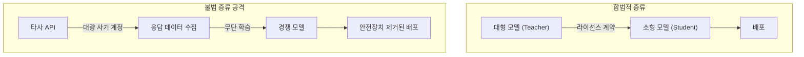
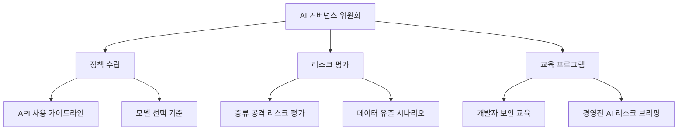

## 1600만 건의 요청, 24,000개의 가짜 계정 — 무슨 일이 있었나

2026년 2월, Anthropic은 자사의 Claude 모델을 대상으로 한 대규모 <strong>증류 공격(distillation attack)</strong>을 공개했습니다. DeepSeek, Moonshot AI, MiniMax 세 곳의 중국 AI 기업이 약 24,000개의 사기 계정과 상업용 프록시 서비스를 이용해 Claude와 <strong>1,600만 건 이상의 대화</strong>를 생성하고, 이를 통해 자사 모델 학습에 활용한 것입니다.

각 기업이 타겟한 영역은 달랐습니다:

- <strong>DeepSeek</strong>: 추론(reasoning) 능력, 루브릭 기반 채점, 검열 우회 쿼리 (15만+ 건)
- <strong>Moonshot AI</strong>: 에이전트 추론, 도구 사용, 코딩, 컴퓨터 비전 (340만+ 건)
- <strong>MiniMax</strong>: 에이전트 코딩 및 도구 사용 능력 (1,300만+ 건)

Anthropic은 IP 주소 상관관계, 요청 메타데이터, 인프라 지표를 통해 각 캠페인을 특정 AI 연구소에 귀속시킬 수 있었다고 밝혔습니다.

## 증류 공격이란 무엇인가

<strong>모델 증류(model distillation)</strong>는 원래 합법적인 머신러닝 기법입니다. 대형 모델(teacher)의 출력을 활용해 소형 모델(student)을 훈련시키는 방식으로, 정당한 라이선스 하에서 널리 사용됩니다.

문제는 이것이 <strong>무단으로</strong> 수행될 때 발생합니다:



불법 증류의 핵심 위험은 <strong>안전장치(safeguard)의 소실</strong>입니다. 원본 모델에 내장된 유해 콘텐츠 필터링, 편향 방지 메커니즘 등이 증류 과정에서 제거되어, 위험한 능력이 보호 장치 없이 확산될 수 있습니다.

## EM/CTO 관점에서의 위협 분석

### 기업 AI 거버넌스에 미치는 영향

이 사건은 단순한 기업 간 분쟁이 아닙니다. AI API를 활용하는 모든 기업에게 중요한 시사점을 줍니다:

<strong>1. API 활용 데이터의 보안 위험</strong>

기업이 AI API를 통해 전송하는 데이터 — 프롬프트, 컨텍스트, 비즈니스 로직 — 가 외부에 노출될 수 있다는 사실을 재인식해야 합니다. 증류 공격자들이 이와 같은 프록시 네트워크를 통해 트래픽을 가로챌 가능성도 존재합니다.

<strong>2. 벤더 선택 시 보안 평가 기준 변화</strong>

AI 벤더를 선택할 때 성능과 비용뿐 아니라, <strong>증류 공격 대응 능력</strong>도 평가해야 합니다:

- 행동 분류기(behavioral classifier) 구현 여부
- 비정상 사용 패턴 탐지 시스템
- 계정 검증 및 인증 강화 수준
- 사용량 제한(rate limiting) 정교함

<strong>3. 오픈소스 모델의 출처 리스크</strong>

불법 증류로 만들어진 모델이 오픈소스로 공개되면, 이를 사용하는 기업도 간접적으로 IP 침해에 연루될 수 있습니다. 모델의 <strong>출처(provenance)</strong>를 검증하는 것이 중요해졌습니다.

### 국가 안보 차원의 우려

Anthropic은 불법 증류된 모델이 군사, 정보, 감시 시스템에 투입될 위험을 경고했습니다. 안전장치가 제거된 프론티어 AI 모델이 공격적 사이버 작전, 허위 정보 캠페인, 대규모 감시에 활용될 수 있다는 것입니다.

## 기업의 실무 대응 전략

### 1단계: AI API 사용 정책 재검토

```yaml
# AI API 거버넌스 체크리스트
보안_정책:
  - 민감 데이터를 AI API에 전송하기 전 분류 체계 수립
  - PII/기밀 데이터 마스킹 파이프라인 구축
  - API 호출 로깅 및 감사 시스템 운영

벤더_관리:
  - AI 벤더의 증류 공격 대응 능력 평가
  - Terms of Service의 데이터 사용 조항 검토
  - 정기적인 벤더 보안 감사 실시

모델_출처_관리:
  - 사용 중인 오픈소스 모델의 학습 데이터 출처 확인
  - 모델 라이선스 및 IP 정책 검토
  - SBOM(Software Bill of Materials)에 AI 모델 포함
```

### 2단계: 기술적 방어 체계 구축

Anthropic이 공개한 방어 전략에서 배울 수 있는 기술적 접근법:

<strong>행동 분석 기반 탐지</strong>

기존의 방화벽, DLP, 네트워크 모니터링은 ML-API 계층의 위협을 탐지하지 못합니다. 다음과 같은 새로운 관점의 모니터링이 필요합니다:

- <strong>사용 패턴 이상 탐지</strong>: 대량의 체계적 쿼리, 비정상적 시간대 사용, 반복적 패턴
- <strong>계정 클러스터 분석</strong>: 동일 IP 대역, 유사한 쿼리 패턴을 가진 계정 그룹 탐지
- <strong>핑거프린팅</strong>: 모델 출력에 탐지 가능한 워터마크 삽입

### 3단계: 조직 차원의 AI 리터러시 강화



## 업계 전체의 대응 방향

이 사건 이후, AI 업계에서는 다음과 같은 움직임이 나타나고 있습니다:

<strong>1. 산업 전반의 협력 강화</strong>

Anthropic은 OpenAI와 함께 증류 공격에 대한 산업 전체의 대응을 촉구하고 있습니다. 개별 기업의 방어만으로는 부족하며, AI 산업, 클라우드 제공자, 정책 입안자의 공조가 필요합니다.

<strong>2. Microsoft의 오픈 웨이트 모델 백도어 스캐너</strong>

Microsoft는 오픈 웨이트 AI 모델의 백도어를 탐지하는 스캐너를 개발했습니다. 이는 증류된 모델에 삽입된 악성 기능을 식별하는 데 활용될 수 있습니다.

<strong>3. 규제 프레임워크 진화</strong>

미국 AI 칩 수출 규제 논의와 맞물려, AI 모델 IP 보호에 대한 규제 논의도 활발해지고 있습니다.

## 실무자를 위한 핵심 정리

| 영역 | 조치 | 우선순위 |
|------|------|----------|
| API 보안 | 민감 데이터 분류 및 마스킹 | 즉시 |
| 벤더 관리 | 증류 방어 능력 평가 추가 | 1개월 내 |
| 모델 관리 | 오픈소스 모델 출처 검증 | 분기별 |
| 조직 | AI 거버넌스 위원회 구성 | 3개월 내 |
| 교육 | 개발자 AI 보안 교육 | 반기별 |
| 모니터링 | API 사용 이상 탐지 시스템 | 6개월 내 |

## 결론 — "신뢰하되 검증하라"

AI 모델 증류 공격은 AI 산업의 신뢰 기반을 흔드는 사건입니다. EM이나 CTO로서 우리가 할 수 있는 일은 명확합니다:

1. <strong>사용 중인 AI API의 보안 정책을 재검토</strong>하고
2. <strong>오픈소스 모델의 출처를 검증</strong>하며
3. <strong>조직 내 AI 거버넌스 체계를 수립</strong>하는 것입니다

AI 기술의 민주화는 환영할 일이지만, 그것이 타인의 지적재산을 무단으로 수탈하는 방식이 되어서는 안 됩니다. "신뢰하되 검증하라(Trust but verify)"의 원칙이 AI 시대에도 여전히 유효합니다.

## 참고 자료

- [Anthropic 공식 발표: Detecting and Preventing Distillation Attacks](https://www.anthropic.com/news/detecting-and-preventing-distillation-attacks)
- [CNBC: Anthropic accuses DeepSeek, Moonshot and MiniMax of distillation attacks on Claude](https://www.cnbc.com/2026/02/24/anthropic-openai-china-firms-distillation-deepseek.html)
- [TechCrunch: Anthropic accuses Chinese AI labs of mining Claude](https://techcrunch.com/2026/02/23/anthropic-accuses-chinese-ai-labs-of-mining-claude-as-us-debates-ai-chip-exports/)
- [The Hacker News: Anthropic Says Chinese AI Firms Used 16 Million Claude Queries](https://thehackernews.com/2026/02/anthropic-says-chinese-ai-firms-used-16.html)
- [Google GTIG: AI Threat Tracker — Distillation and Adversarial AI Use](https://cloud.google.com/blog/topics/threat-intelligence/distillation-experimentation-integration-ai-adversarial-use)
