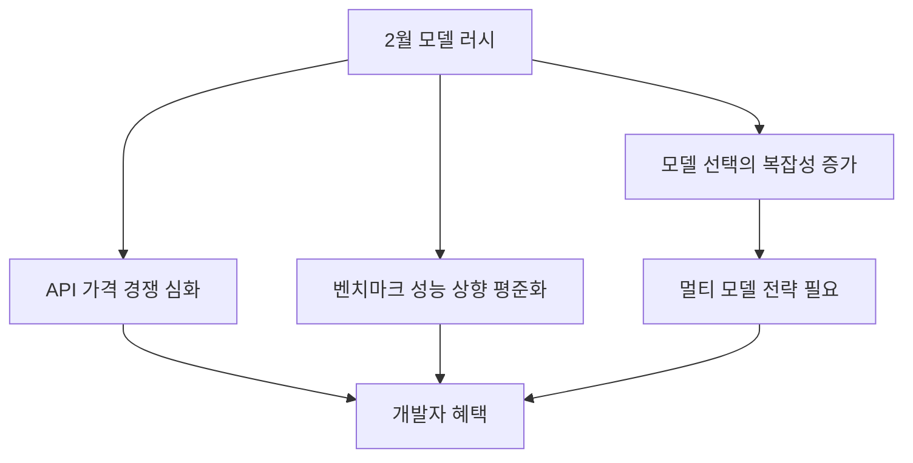

2026년 2월, AI 업계에 유례없는 일이 벌어지고 있습니다. <strong>7개의 주요 AI 모델이 같은 달에 출시 예정</strong>이라는 소식이 전해지면서, 업계는 그야말로 '모델 러시(Model Rush)' 상태에 돌입했습니다.

## 2월 출시 예정 모델 일람

[Mark(@mark_k)의 X 포스트](https://x.com/mark_k/status/2020822166984372373)에 따르면, 다음 7개 모델이 2026년 2월 중 출시될 예정입니다.

| 모델 | 개발사 | 비고 |
|------|--------|------|
| <strong>Gemini 3 Pro GA</strong> | Google DeepMind | Gemini 3 Pro의 정식 출시(General Availability) |
| <strong>Sonnet 5</strong> | Anthropic | Claude Sonnet 시리즈의 차기 버전 |
| <strong>GPT-5.3</strong> | OpenAI | GPT-5 시리즈의 마이너 업데이트 |
| <strong>Qwen 3.5</strong> | Alibaba Cloud | 오픈소스 진영의 강자 |
| <strong>GLM 5</strong> | Zhipu AI | 중국 AI 스타트업의 차세대 모델 |
| <strong>Deepseek v4</strong> | DeepSeek | 추론 특화 모델의 신버전 |
| <strong>Grok 4.20</strong> | xAI | Elon Musk의 xAI가 내놓는 최신 모델 |

## 왜 2월에 집중되는가?

### 1. 연초 발표 시즌의 본격화

CES와 MWC 사이에 위치한 2월은 기업들이 한 해의 기술 로드맵을 제시하는 시기입니다. 특히 2026년은 AI 경쟁이 극도로 과열되면서, 각 기업이 경쟁사보다 먼저 시장을 선점하려는 움직임이 뚜렷합니다.

### 2. 오픈소스 vs 클로즈드 소스의 전면전

이번 러시에서 주목할 점은 <strong>오픈소스 모델(Qwen 3.5, DeepSeek v4)과 클로즈드 소스 모델(Gemini, Sonnet, GPT)이 동시에 격돌</strong>한다는 것입니다. 2025년 하반기부터 오픈소스 모델의 성능이 급격히 향상되면서, 클로즈드 소스 진영도 더 빠른 업데이트 주기로 대응하고 있습니다.

### 3. 중국 AI 기업의 부상

GLM 5(Zhipu AI)와 DeepSeek v4, Qwen 3.5까지 <strong>중국발 모델이 3개</strong>나 포함되어 있습니다. 이는 미·중 AI 경쟁이 모델 수준에서도 본격적으로 전개되고 있음을 보여줍니다.

## 각 모델별 주목 포인트

### Gemini 3 Pro GA — Google의 본격 반격

Gemini 3 Pro는 이미 프리뷰 단계에서 멀티모달 성능과 긴 컨텍스트 윈도우로 주목받았습니다. GA 출시와 함께 API 안정성과 가격 경쟁력이 어떻게 달라질지가 핵심입니다.

### Sonnet 5 — Anthropic의 균형 전략

Claude 시리즈에서 Sonnet은 성능과 비용의 균형점을 담당합니다. Sonnet 5가 코딩, 분석, 창작 등 어느 영역에서 차별화를 꾀할지 주목됩니다.

### GPT-5.3 — OpenAI의 점진적 진화

GPT-5 출시 이후 마이너 업데이트를 이어가는 OpenAI의 전략입니다. 5.3에서는 추론 능력과 도구 사용(function calling) 정확도 향상이 기대됩니다.

### Qwen 3.5 — 오픈소스의 새 기준

Alibaba Cloud의 Qwen은 오픈소스 LLM 중 가장 빠른 업데이트 주기를 보여주고 있습니다. 3.5에서는 다국어 성능과 코딩 능력의 대폭 향상이 예상됩니다.

### GLM 5 — Zhipu AI의 도전

GLM 시리즈는 중국 내에서 강력한 입지를 구축하고 있으며, GLM 5로 글로벌 시장 진출을 본격화할 것으로 보입니다.

### DeepSeek v4 — 추론의 끝판왕

DeepSeek는 추론(reasoning) 특화 모델로 주목받아 왔습니다. v4에서는 수학, 코딩, 논리적 추론 벤치마크에서 새로운 기록을 세울 가능성이 높습니다.

### Grok 4.20 — xAI의 독자 노선

xAI의 Grok은 실시간 정보 접근과 유머러스한 응답 스타일로 차별화해 왔습니다. 4.20에서는 기업용 API 강화에 초점을 맞출 것으로 예상됩니다.

## 개발자에게 미치는 영향

### 1. API 가격 경쟁의 수혜

7개 모델이 동시에 경쟁하면서 API 가격은 더욱 하락할 전망입니다. 특히 오픈소스 모델의 셀프 호스팅 옵션은 비용 절감에 큰 도움이 됩니다.

### 2. 멀티 모델 전략의 필수화

단일 모델에 의존하는 시대는 끝났습니다. 작업 유형별로 최적의 모델을 선택하는 <strong>모델 라우팅(Model Routing)</strong> 전략이 점점 더 중요해지고 있습니다.

### 3. 벤치마크를 넘어선 실전 평가

모델이 많아질수록 벤치마크 점수만으로는 판단이 어렵습니다. 자체 유스케이스에 맞는 <strong>실전 평가(Eval) 파이프라인</strong> 구축이 필수가 됩니다.

## 향후 전망

2026년 2월의 모델 러시는 AI 업계의 경쟁이 새로운 국면에 진입했음을 보여줍니다. 모델의 절대 성능 차이가 줄어들면서, 앞으로는 <strong>가격, 속도, 특화 영역, 에코시스템</strong>이 모델 선택의 핵심 기준이 될 것입니다.

개발자로서 우리가 할 일은 명확합니다. 특정 모델에 종속되지 않는 아키텍처를 설계하고, 빠르게 변화하는 모델 생태계에 유연하게 대응할 수 있는 인프라를 구축하는 것입니다.

## 참고 자료

- [Mark(@mark_k) — 2026년 2월 AI 모델 출시 일정 정리](https://x.com/mark_k/status/2020822166984372373)
