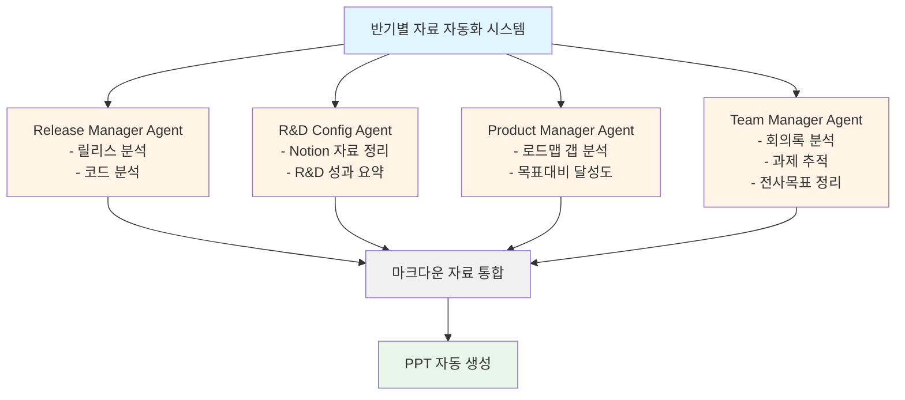

## 들어가며: 60시간의 고통

팀장으로서 1년에 두 번, 전 사원 앞에서 반기별 성과 보고를 해야 합니다. 릴리스 내역, 연구개발 성과, 로드맵 대비 실제 달성도, 팀 커뮤니케이션 현황까지 모든 것을 종합하여 PPT로 정리하고 발표해야 하죠.

<strong>기존 프로세스는 총 60시간 이상이 소요</strong>되었습니다:
- 릴리스 분석: 4-5시간
- R&D 자료화: 20-30시간
- 로드맵 리뷰: 4-5시간
- 회의록 분석: 8-10시간
- 전사 목표 파악: 2-3시간
- PPT 생성: 20-30시간
- 리뷰 및 개선: 6-11시간
- 발표 연습: 5-10시간

하지만 AI와 자동화 도구를 도입한 결과, <strong>이 시간을 약 10시간으로 단축</strong>할 수 있었습니다. 이 글에서는 어떻게 이런 혁신적인 변화를 만들어냈는지 실전 프로세스를 공유합니다.

## 얻을 수 있는 효과

AI 자동화 시스템 도입을 통해 다음과 같은 효과를 얻을 수 있었습니다:

### 1. 시간 단축: 60시간 → 10시간
단순히 작업 속도만 빨라진 것이 아닙니다. 반복적이고 지루한 데이터 수집 작업을 AI가 대신하면서, 핵심 메시지 구성과 스토리텔링에 집중할 수 있게 되었습니다.

### 2. 데이터 누락 방지
사람이 수작업으로 정리하다 보면 일부 릴리스나 회의 내용을 빠뜨리기 쉽습니다. AI 에이전트는 정해진 기간의 모든 데이터를 빠짐없이 수집하여 체계적으로 정리합니다.

### 3. 불필요한 내용 제거
과거에는 "혹시 필요할까봐" 모든 내용을 담다가 PPT가 50-60장까지 늘어나곤 했습니다. AI가 중요도를 판단하고 핵심만 추려주면서, 임원진에게 전달해야 할 메시지에만 집중할 수 있게 되었습니다.

### 4. 효과적인 스토리텔링
AI는 수집한 데이터를 "Overview → 성과 중심 Review → 과제 도출"이라는 논리적 구조로 자동 정리합니다. 이를 기반으로 설득력 있는 스토리를 만들 수 있습니다.

## 기존 프로세스 분석

먼저 기존의 비효율적인 프로세스를 자세히 살펴보겠습니다.

### 1. 릴리스 노트 및 코드 분석 (4-5시간)
반기 동안 배포한 기능들을 Git 히스토리와 릴리스 노트를 뒤져가며 수작업으로 추출합니다. 커밋 메시지가 불명확하거나 릴리스 노트가 부실한 경우, 코드를 직접 열어서 확인해야 했습니다.

### 2. R&D 자료화 (20-30시간)
팀 내에서 진행한 연구개발 활동(새로운 기술 검토, POC, 성능 최적화 등)을 정리하는 작업입니다. 각 엔지니어가 작성한 Notion 문서, 슬랙 대화, 코드 주석 등을 모두 찾아서 통합해야 했습니다. <strong>가장 많은 시간이 소요되는 단계</strong>입니다.

### 3. 개발 로드맵 리뷰 (4-5시간)
연초에 세운 개발 계획과 실제 달성 내역을 비교합니다. "왜 A 기능은 완료했는데 B 기능은 지연되었는가?" 같은 갭 분석이 핵심입니다.

### 4. 회의록 분석 (8-10시간)
매주 진행되는 팀 미팅, 격주 비즈니스 사이드 미팅 등의 회의록을 읽으며 주요 이슈와 의사결정 사항을 추출합니다. 반기 동안 최소 20-30건의 회의록을 검토해야 합니다.

### 5. 전사/부서 목표 파악 (2-3시간)
우리 팀의 성과가 전사 목표와 어떻게 연결되는지 정리합니다. CEO 발표 자료나 부서 OKR 문서를 참조합니다.

### 6. PPT 자료 생성 (20-30시간)
수집한 모든 자료를 바탕으로 스토리를 구성하고, 슬라이드를 디자인하고, 그래프와 표를 만듭니다. <strong>두 번째로 많은 시간이 소요되는 단계</strong>입니다.

### 7. 리뷰 및 개선 (6-11시간)
동료나 상사에게 리뷰를 받고, 피드백을 반영하여 수정합니다. 보통 2-3번의 반복이 필요합니다.

### 8. 발표 연습 (5-10시간)
발표 시간(보통 10-15분)에 맞춰 스크립트를 작성하고, 흐름을 점검하며, 실제로 발표 연습을 합니다.

## AI 및 생산성 도구 도입

본격적인 자동화 전에, 일상 업무에 AI와 생산성 도구를 먼저 도입했습니다.

### 1. Notion AI로 회의록 자동 작성
[Notion AI의 회의 노트 기능](https://www.notion.so/help/guides/using-notions-meeting-notes-feature)을 활용하여, 회의 중 음성을 실시간으로 텍스트로 변환하고 요약합니다.

<strong>효과</strong>:
- 회의 후 회의록 작성 시간 제로
- 회의 내용 누락 없음
- 나중에 검색 가능한 구조화된 데이터 확보

### 2. Notion API MCP로 자동 문서화
[Notion API MCP(Model Context Protocol)](https://modelcontextprotocol.io/introduction)를 활용하여, 코드베이스에서 자동으로 문서를 추출하여 Notion에 정리합니다.

<strong>자동화된 항목</strong>:
- 개발 진척 상황
- 발생한 문제와 해결 방법
- 기술 조사 내용
- 사양서 및 API 문서

<strong>구현 예시</strong>:
```typescript
// Notion API MCP를 통해 코드 주석을 자동으로 Notion 페이지로 변환
// 코드에 특정 태그를 달면 자동으로 문서화됨
/**
 * @notion-doc
 * @category: Infrastructure
 * @title: Redis 캐싱 전략
 *
 * Redis를 활용한 API 응답 캐싱 구현.
 * TTL 설정: 5분
 * 캐시 키 패턴: api:{endpoint}:{params}
 */
export class CacheService {
  // ...
}
```

### 3. AI 코드 리뷰 및 인프라 트러블슈팅
Claude Code, ChatGPT, Gemini 등 다양한 AI 도구를 코드 리뷰와 인프라 문제 해결에 적극 활용합니다.

<strong>효과</strong>:
- 코드 리뷰 시간 단축
- 에러 로그 분석 속도 향상
- 인프라 설정 문제 신속 해결

## AI 에이전트 기반 자동화 시스템

이제 핵심인 반기별 자료 생성 자동화 시스템을 소개합니다. 4개의 전문 AI 에이전트가 병렬로 작업하며 각자의 영역을 담당합니다.

### 전체 아키텍처



### 1. Release Manager Agent (릴리스 관리자)

<strong>역할</strong>: Git 히스토리와 릴리스 노트를 분석하여 반기 동안의 모든 배포 내역을 자동 정리

<strong>입력 데이터</strong>:
- Git commit history (특정 날짜 범위)
- GitHub/GitLab Release Notes
- JIRA/Linear 티켓 정보

<strong>출력 형식</strong>:
```markdown
# 릴리스 요약 (2024-04 ~ 2024-09)

## 주요 기능 릴리스
- [2024-04-15] 사용자 알림 시스템 v2.0
  - 실시간 푸시 알림 구현
  - 알림 설정 커스터마이징 기능

- [2024-06-20] 결제 시스템 개선
  - 카카오페이 연동
  - 정기결제 기능 추가

## 버그 수정 및 개선
- [2024-05-03] 로그인 속도 40% 개선
- [2024-07-12] 메모리 누수 이슈 해결

## 통계
- 총 배포 횟수: 23회
- 주요 기능: 8개
- 버그 수정: 47건
```

<strong>구현 팁</strong>:
Claude Code의 MCP를 활용하여 Git API에 직접 접근하거나, GitHub Actions로 주기적으로 릴리스 데이터를 수집하여 Notion에 저장합니다.

### 2. R&D Configuration Agent (연구개발 형상관리)

<strong>역할</strong>: Notion에 작성된 연구개발 관련 자료를 자동으로 분류하고 요약

<strong>입력 데이터</strong>:
- Notion 페이지 (특정 데이터베이스 필터링)
- 기술 조사 문서
- POC 결과 리포트
- 성능 측정 데이터

<strong>출력 형식</strong>:
```markdown
# 연구개발 활동 요약

## 신규 기술 도입
### GraphQL 도입 검토 (2024-04 ~ 2024-05)
- **목적**: REST API 대비 네트워크 효율성 향상
- **결과**: POC 완료, 일부 서비스에 단계적 적용 계획
- **투입 공수**: 120시간
- **핵심 학습**: Schema-first 설계의 중요성

## 성능 최적화
### 데이터베이스 쿼리 최적화 (2024-06)
- **문제**: 특정 API 응답 시간 3초 이상
- **해결**: 인덱스 추가 및 N+1 쿼리 제거
- **성과**: 응답 시간 300ms로 단축 (90% 개선)
- **투입 공수**: 40시간

## 통계
- 연구 주제: 5개
- 총 투입 시간: 280시간
- 실제 적용: 3개
```

<strong>구현 팁</strong>:
Notion API를 통해 특정 기간의 페이지를 필터링하고, AI가 각 페이지의 핵심 내용을 요약하도록 합니다. 태그나 속성으로 카테고리를 자동 분류합니다.

### 3. Product Manager Agent (프로덕트 매니저)

<strong>역할</strong>: 로드맵 대비 실제 달성도를 분석하고, 목표와 실제의 갭을 파악

<strong>입력 데이터</strong>:
- 연초 제품 로드맵 (Excel/Notion/JIRA)
- Release Manager의 릴리스 데이터
- R&D Agent의 연구개발 데이터

<strong>출력 형식</strong>:
```markdown
# 로드맵 대비 달성도 분석

## 계획 대비 실적
### 완료된 기능 (80% 달성)
✅ 사용자 알림 시스템 v2.0 (계획: Q2, 완료: Q2)
✅ 결제 시스템 개선 (계획: Q2, 완료: Q2)
✅ 관리자 대시보드 v3 (계획: Q3, 완료: Q3)

### 지연된 기능 (20%)
⚠️ 다국어 지원 (계획: Q3, 예상: Q4)
- **지연 사유**: 번역 리소스 부족, 외부 번역 업체 계약 지연
- **대응 방안**: Q4 우선순위 상향 조정

## 갭 분석
### 계획에 없었지만 추가된 작업
- 카카오페이 연동 (비즈니스 요청으로 긴급 추가)
- 데이터베이스 마이그레이션 (성능 문제로 불가피)

### 영향 분석
추가 작업으로 인해 다국어 지원 일정이 1개월 지연됨.
```

<strong>구현 팁</strong>:
Product Manager Agent는 Release Manager와 R&D Agent의 결과물을 input으로 받아, 로드맵 Excel과 비교합니다. Claude의 structured output을 활용하여 JSON 형태로 갭 분석 결과를 생성합니다.

### 4. Team Manager Agent (팀 매니저)

<strong>역할</strong>: AI 회의록을 분석하여 과제 진행 상황 및 전사 목표 정리

<strong>입력 데이터</strong>:
- Notion AI 회의록 (반기 동안 모든 미팅)
- 전사 OKR 문서
- 부서 목표 문서

<strong>출력 형식</strong>:
```markdown
# 팀 커뮤니케이션 및 목표 정렬

## 주요 회의 주제 분석
### 1. 비즈니스 사이드 협업 (10회 미팅)
- **주요 안건**: 신규 기능 우선순위 조정, 버그 이슈 대응
- **의사결정**: 카카오페이 연동 긴급 추가 (CEO 승인)

### 2. 팀 내부 미팅 (24회 미팅)
- **주요 안건**: 기술 스택 개선, 코드 리뷰 프로세스 개선
- **액션 아이템 완료율**: 85% (34/40건)

## 전사 목표 대비 기여도
### 2024 전사 목표: "사용자 경험 혁신"
- **우리 팀 기여**:
  - 알림 시스템 개편으로 사용자 재방문율 15% 증가
  - 결제 프로세스 간소화로 전환율 8% 향상

### 부서 목표: "개발 생산성 20% 향상"
- **우리 팀 달성도**:
  - AI 도구 도입으로 코드 리뷰 시간 30% 단축
  - CI/CD 개선으로 배포 빈도 2배 증가
```

<strong>구현 팁</strong>:
Notion AI 회의록은 이미 구조화되어 있으므로, 특정 키워드(액션 아이템, 의사결정, 이슈 등)를 추출하는 간단한 스크립트를 작성합니다. AI가 전사 목표 문서와 매칭하여 기여도를 자동 계산합니다.

## PPT 자동 생성 프로세스

4개 에이전트의 작업이 완료되면, 모든 자료가 마크다운 파일로 저장됩니다. 이제 Product Manager Agent가 최종 PPT를 생성합니다.

### Step 1: 구조화된 마크다운 생성

Product Manager Agent에게 다음과 같이 지시합니다:

```
다음 자료들을 활용하여, [Overview → 성과 중심 Review → 과제 도출]
구조로 슬라이드별 마크다운을 생성하세요:

- release_summary.md
- rnd_summary.md
- roadmap_gap_analysis.md
- team_communication.md

각 섹션은 다음 원칙을 따르세요:
1. 한 슬라이드에 1-2개의 핵심 메시지만
2. 임원진이 3초 안에 이해할 수 있는 간결한 표현
3. 숫자와 데이터로 뒷받침
4. 비주얼 (그래프, 표)을 적극 활용
```

<strong>출력 예시</strong>:
```markdown
# Slide 1: Overview
## 2024 상반기 개발팀 성과 요약
- ✅ 주요 기능 8개 릴리스 (계획 대비 100%)
- ✅ R&D 투자 280시간, 3개 기술 적용
- ⚠️ 다국어 지원 1개월 지연 (Q4 완료 예정)

---

# Slide 2: 릴리스 성과
## 사용자 경험 개선 중심 개발
| 기능 | 출시일 | 비즈니스 임팩트 |
|------|--------|----------------|
| 알림 시스템 v2.0 | 2024-04 | 재방문율 +15% |
| 결제 시스템 개선 | 2024-06 | 전환율 +8% |
| 관리자 대시보드 v3 | 2024-09 | 운영 효율 +25% |

---

# Slide 3: R&D 활동
## 기술 부채 해소 및 미래 준비
- **GraphQL 도입**: API 효율성 향상, Q4 단계적 적용
- **DB 쿼리 최적화**: 응답 시간 90% 개선 (3초 → 300ms)
- **CI/CD 개선**: 배포 빈도 2배 증가, 장애 감소
```

### Step 2: AI 리뷰 및 개선

생성된 초안을 Claude, Gemini, ChatGPT에 각각 첨부하여 리뷰를 요청합니다:

```
첨부된 마크다운 자료는 반기별 임원 보고용 PPT 초안입니다.
다음 관점에서 개선점을 제안해주세요:

1. 메시지가 명확한가? (임원진 관점)
2. 논리적 흐름이 자연스러운가?
3. 불필요하거나 중복된 내용이 있는가?
4. 숫자와 데이터가 설득력 있게 제시되었는가?
5. 시각적으로 표현하면 좋을 내용이 있는가?
```

<strong>AI별 피드백 예시</strong>:
- <strong>Claude</strong>: "Slide 2의 비즈니스 임팩트가 정량적으로 잘 표현되었습니다. 다만 Slide 3의 R&D 활동은 기술 용어가 많아 비기술 임원이 이해하기 어려울 수 있습니다. '성능 90% 개선'보다 '사용자 대기 시간 10분의 1로 단축'이 더 직관적입니다."
- <strong>Gemini</strong>: "Overview에서 지연된 기능을 언급하는 것은 좋지만, 해결 방안을 함께 제시하면 더 긍정적입니다."
- <strong>ChatGPT</strong>: "Slide 3에 그래프를 추가하면 좋겠습니다. 예: R&D 투자 시간 vs 비즈니스 임팩트 상관관계"

### Step 3: 수동 검토 및 수정

AI 피드백을 참고하여 틀린 부분이나 맥락이 잘못된 내용을 직접 수정합니다. 특히 민감한 숫자나 비즈니스 데이터는 반드시 검증합니다.

### Step 4: PowerPoint 생성

Claude Code의 "Create File" 기능을 활용하여 마크다운을 PowerPoint로 변환합니다:

```
수정된 마크다운 파일을 바탕으로 PowerPoint 파일(.pptx)을 생성해주세요.

요구사항:
- 템플릿: 회사 표준 템플릿 사용 (template.pptx)
- 폰트: 나눔고딕, 제목 28pt, 본문 18pt
- 색상: 회사 브랜드 컬러 (#1E40AF 메인, #F59E0B 강조)
- 표와 그래프는 가독성 우선
- 애니메이션: 최소화 (fade-in 정도만)
```

또는 Python 라이브러리(`python-pptx`)를 사용하여 프로그래밍 방식으로 생성할 수도 있습니다:

```python
from pptx import Presentation
from pptx.util import Inches, Pt

prs = Presentation('template.pptx')

# 슬라이드 추가
slide_layout = prs.slide_layouts[1]  # Title and Content
slide = prs.slides.add_slide(slide_layout)

# 제목 추가
title = slide.shapes.title
title.text = "2024 상반기 개발팀 성과 요약"

# 본문 추가
content = slide.placeholders[1]
tf = content.text_frame
tf.text = "✅ 주요 기능 8개 릴리스 (계획 대비 100%)"
# ...

prs.save('presentation.pptx')
```

### Step 5: 발표 스크립트 생성

마지막으로 AI에게 10분 분량의 발표 스크립트를 작성하도록 지시합니다:

```
첨부된 PPT를 10분 동안 발표할 스크립트를 작성해주세요.

- 청중: 임원진 (CEO, CFO, 각 부서장)
- 톤: 자신감 있지만 겸손하게
- 구조: 도입 (1분) → 본론 (7분) → 결론 (2분)
- 각 슬라이드별로 말할 내용을 상세히 작성
- 예상 질문과 답변도 포함
```

<strong>출력 예시</strong>:
```markdown
## 슬라이드 1: 도입 (30초)
"안녕하십니까, 개발팀 팀장 홍길동입니다. 오늘은 2024년 상반기
개발팀의 성과와 하반기 계획을 말씀드리겠습니다."

(슬라이드를 가리키며)
"한눈에 보시면, 계획했던 주요 기능 8개를 모두 릴리스했고,
신기술 도입을 위한 R&D에도 280시간을 투자했습니다."

## 슬라이드 2: 릴리스 성과 (2분)
"첫 번째로 릴리스 성과입니다. 올해 상반기는 '사용자 경험 혁신'이라는
전사 목표에 맞춰 세 가지 핵심 기능을 출시했습니다."

(표를 가리키며)
"특히 4월에 출시한 알림 시스템 v2.0은 사용자 재방문율을 15% 높이는
성과를 냈고, 6월의 결제 시스템 개선은 전환율을 8% 향상시켰습니다..."

## 예상 질문
Q: "다국어 지원이 지연된 이유는 무엇인가요?"
A: "외부 번역 업체와의 계약이 예상보다 지연되었고, 카카오페이 연동이
긴급 추가되면서 리소스가 분산되었습니다. 다만 하반기 최우선 과제로
설정하여 Q4에는 반드시 완료할 계획입니다."
```

## 최종 결과 및 효과

### 시간 투입 비교

| 단계 | 기존 (수작업) | AI 자동화 | 절감률 |
|------|---------------|-----------|--------|
| 데이터 수집 | 18-23시간 | 2시간 | <strong>90%</strong> |
| 자료 정리 | 20-30시간 | 1시간 | <strong>96%</strong> |
| PPT 작성 | 20-30시간 | 4시간 | <strong>85%</strong> |
| 리뷰 및 개선 | 6-11시간 | 2시간 | <strong>75%</strong> |
| 발표 연습 | 5-10시간 | 1시간 | <strong>87%</strong> |
| <strong>총계</strong> | <strong>60+ 시간</strong> | <strong>~10시간</strong> | <strong>83%</strong> |

### 정성적 효과

<strong>1. 업무 만족도 향상</strong>
반복적인 데이터 수집 작업에서 해방되어, 창의적인 스토리텔링에 집중할 수 있게 되었습니다.

<strong>2. 신뢰도 향상</strong>
AI가 체계적으로 정리한 데이터 덕분에 "이 수치가 맞나요?" 같은 질문을 받는 일이 줄었습니다.

<strong>3. 재사용 가능한 시스템 구축</strong>
한 번 구축한 에이전트 시스템은 다음 반기, 다음 해에도 계속 사용할 수 있습니다. 개선도 쉽습니다.

<strong>4. 팀 전체의 생산성 향상</strong>
Notion AI 회의록, 자동 문서화 등 구축한 인프라를 팀 전체가 활용하면서, 다른 업무의 효율도 함께 높아졌습니다.

## 구축 시 주의사항

### 1. 데이터 품질이 핵심
"Garbage in, garbage out." AI는 입력 데이터의 품질에 전적으로 의존합니다. Notion 문서가 부실하거나, Git 커밋 메시지가 불명확하면 AI도 제대로 정리할 수 없습니다.

<strong>해결책</strong>: 평소에 문서화와 커밋 메시지 작성 규칙을 팀에 정착시킵니다.

### 2. AI는 검증이 필요
AI가 생성한 내용은 반드시 사람이 검토해야 합니다. 특히 숫자, 날짜, 인과관계는 틀릴 수 있습니다.

<strong>해결책</strong>: Step 3 (수동 검토)를 절대 생략하지 않습니다.

### 3. 초기 구축 비용
에이전트 시스템을 처음 구축하는 데는 시행착오가 필요합니다. 첫 번째 반기 보고서는 오히려 시간이 더 걸릴 수 있습니다.

<strong>해결책</strong>: 장기적 관점에서 투자합니다. 두 번째부터는 정말 10시간이면 충분합니다.

### 4. 보안 및 민감 정보
회사 내부 데이터를 AI에 입력할 때는 보안 정책을 준수해야 합니다.

<strong>해결책</strong>: 온프레미스 LLM(예: Llama, GPT-4 Azure Enterprise)을 사용하거나, 민감한 정보는 마스킹 처리합니다.

## 확장 가능성

이 시스템은 반기별 보고서 외에도 다양하게 활용할 수 있습니다:

- <strong>월간 팀 리포트</strong>: 에이전트 입력 기간만 1개월로 조정
- <strong>프로젝트 회고</strong>: 특정 프로젝트의 타임라인과 데이터만 필터링
- <strong>연간 성과 평가</strong>: 1년치 데이터를 종합하여 개인별/팀별 평가 자료 생성
- <strong>대외 발표 자료</strong>: 컨퍼런스나 채용 설명회용 자료로도 변환 가능

## 결론: AI는 도구, 핵심은 프로세스

AI 자동화의 핵심은 기술 자체가 아니라 <strong>프로세스 설계</strong>입니다.
- 어떤 데이터가 필요한가?
- 어떤 순서로 정리할 것인가?
- 최종 산출물의 형태는 무엇인가?

이런 질문에 먼저 답한 후, AI는 그 프로세스를 실행하는 "도구"로 활용해야 합니다.

60시간을 10시간으로 줄인 것은 단순히 "빠른 도구"를 쓴 게 아니라, <strong>반복 작업을 시스템화</strong>했기 때문입니다. AI는 그 시스템을 구현하는 최고의 수단일 뿐입니다.

여러분의 업무에도 이런 반복적이고 시간이 많이 걸리는 작업이 있다면, 한 번 AI 자동화를 시도해보시길 권장합니다. 첫 시도는 어렵지만, 일단 시스템이 구축되면 그 효과는 상상 이상입니다.

---

<strong>다음 글 예고</strong>: [AI 에이전트 시스템 구축 실전 가이드: Notion API MCP와 Claude Code로 자동화 파이프라인 만들기](/ko/blog/ko/ai-agent-notion-mcp-automation)

궁금한 점이나 추가로 알고 싶은 내용이 있다면 댓글로 남겨주세요!
