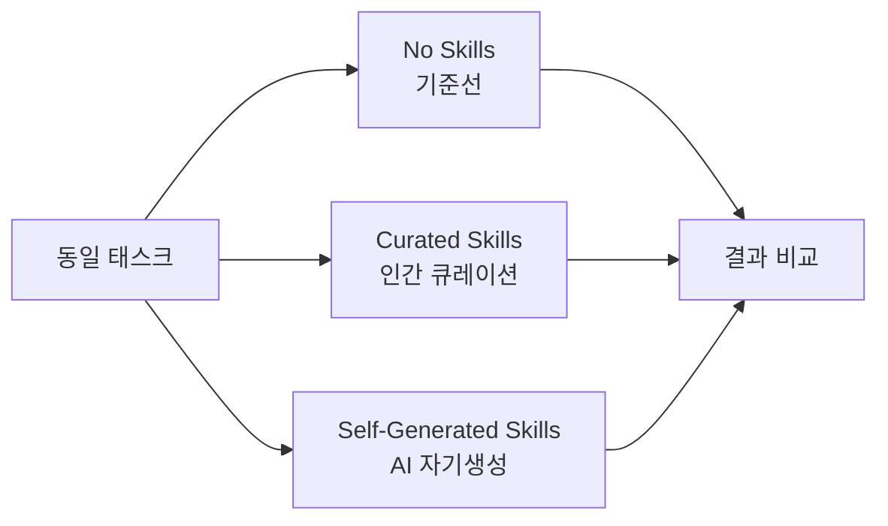
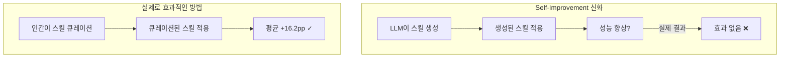

## 개요

"AI가 스스로 더 나은 AI를 만든다" — self-play, self-improvement 패러다임은 AI 업계의 강력한 내러티브 중 하나입니다. 하지만 최신 연구 <strong>SkillsBench</strong>(arXiv:2602.12670)는 이 신화에 정면으로 반박합니다.

11개 도메인, 86개 태스크, 7개 에이전트-모델 구성, <strong>7,308개 트라젝토리</strong>에 걸친 대규모 실험 결과:

- 인간이 큐레이션한 스킬: 평균 <strong>+16.2pp</strong> 성능 향상
- AI가 자기생성한 스킬: <strong>효과 없음 (0pp)</strong>

즉, <strong>LLM은 자신이 소비하면 도움이 되는 절차적 지식을 스스로 작성하는 능력이 없습니다</strong>.

## Agent Skill이란 무엇인가

연구에서 정의하는 <strong>Agent Skill</strong>은 LLM 에이전트의 추론 시점에 주입되는 구조화된 절차적 지식 패키지입니다.

```
Skills 패키지 구조
├── SKILL.md          # 절차적 가이드 (워크플로, SOP)
├── scripts/          # 실행 가능한 스크립트
├── templates/        # 코드 템플릿
└── examples/         # 참고 예제
```

기존의 프롬프트 엔지니어링이나 RAG와 구분되는 핵심 특징:

| 구분 | System Prompt | RAG | Few-shot | <strong>Skills</strong> |
|------|--------------|-----|----------|---------|
| 구조화 | ✗ | ✗ | ✗ | <strong>✓</strong> |
| 절차적 | △ | ✗ | ✗ | <strong>✓</strong> |
| 실행 가능 리소스 | ✗ | ✗ | ✗ | <strong>✓</strong> |
| 이식성 | ✗ | △ | △ | <strong>✓</strong> |

Claude Code의 `CLAUDE.md`, Gemini CLI, Codex CLI 등 최신 에이전트 도구들이 이 Skills 개념을 채택하고 있습니다.

## 실험 설계: 3가지 조건 비교

SkillsBench는 동일한 태스크를 3가지 조건에서 평가합니다:



<strong>핵심 실험 규모:</strong>
- 11개 도메인 (SW 엔지니어링, 데이터 분석, 헬스케어 등)
- 86개 태스크 (105명 기여자가 322개 후보 중 선별)
- 7개 에이전트-모델 구성 (Claude Code, Gemini CLI, Codex CLI)
- <strong>7,308개 트라젝토리</strong> (전수 평가)

모든 평가는 결정론적 검증기(deterministic verifier)로 pass/fail을 판정하여 LLM-as-judge의 편향을 제거했습니다.

## 핵심 발견 1: 큐레이션된 스킬은 효과적이다

인간이 큐레이션한 스킬은 평균 <strong>+16.2pp</strong>의 성능 향상을 보였습니다. 하지만 도메인별 편차가 극심합니다:

| 도메인 | 성능 향상 |
|--------|----------|
| 헬스케어 | <strong>+51.9pp</strong> |
| 데이터 분석 | 높은 향상 |
| SW 엔지니어링 | <strong>+4.5pp</strong> |
| 일부 태스크 (16/84) | <strong>마이너스</strong> |

<strong>84개 태스크 중 16개에서는 스킬이 오히려 성능을 저하</strong>시켰다는 점이 중요합니다. 스킬은 만능이 아닙니다.

## 핵심 발견 2: 자기생성 스킬은 무의미하다

이것이 이 연구의 가장 충격적인 결과입니다.

LLM에게 "이 태스크를 잘 수행하기 위한 스킬을 직접 작성해봐"라고 요청한 뒤, 그 스킬을 사용하게 했을 때:

> <strong>"Self-generated Skills provide no benefit on average, showing that models cannot reliably author the procedural knowledge they benefit from consuming."</strong>

자기생성 스킬의 평균 효과는 <strong>0pp</strong>. 일부에서는 오히려 해로웠습니다.



이것은 <strong>self-play/self-improvement 만능론</strong>에 대한 강력한 반증입니다. 모델은 외부에서 제공된 절차적 지식을 <strong>소비</strong>하는 데는 능숙하지만, 유용한 절차적 지식을 <strong>생산</strong>하는 능력은 결여되어 있습니다.

## 핵심 발견 3: 적은 것이 더 낫다

또 하나의 중요한 발견은 스킬의 크기에 관한 것입니다:

> <strong>2~3개 모듈로 구성된 집중된 스킬이 포괄적인 문서보다 더 효과적</strong>

방대한 매뉴얼보다 핵심만 담긴 작은 스킬 패키지가 성능을 더 끌어올립니다. 이는 LLM의 컨텍스트 윈도우 활용 효율과 관련이 있을 것으로 보입니다.

또한 <strong>작은 모델 + 스킬 = 큰 모델 (스킬 없이)</strong>이라는 결과도 주목할 만합니다. 적절한 스킬로 무장한 소형 모델이 대형 모델의 기본 성능에 필적할 수 있다는 것입니다.

## 실무적 시사점

이 연구 결과가 AI 에이전트를 활용하는 실무자에게 주는 메시지는 명확합니다:

<strong>1. 스킬 자동생성 파이프라인은 재고하라</strong>

"AI가 자기 스킬을 생성하고 개선한다"는 접근은 현 시점에서 효과가 없습니다. 인간 전문가의 큐레이션이 여전히 필수입니다.

<strong>2. 스킬은 작고 집중적으로</strong>

2~3개 모듈의 핵심 스킬이 거대한 문서 뭉치보다 효과적입니다. `CLAUDE.md`를 수백 줄로 작성하는 것보다 핵심 워크플로만 담는 것이 낫습니다.

<strong>3. 도메인별 효과 편차를 인식하라</strong>

헬스케어(+51.9pp)와 SW 엔지니어링(+4.5pp)의 차이가 10배 이상입니다. 이미 모델이 잘 아는 도메인에서는 스킬의 한계 효용이 낮습니다.

<strong>4. 스킬이 해로울 수 있음을 인지하라</strong>

84개 중 16개 태스크에서 스킬이 성능을 저하시켰습니다. 잘못된 스킬은 없느니만 못합니다.

## 기술적 분석: 왜 자기생성은 실패하는가

논문은 직접적인 원인 분석을 제시하지는 않지만, 다음과 같은 구조적 이유를 추론할 수 있습니다:

<strong>메타인지의 한계</strong>: LLM은 "무엇을 모르는지"를 정확히 파악하지 못합니다. 자기에게 필요한 절차적 지식이 무엇인지 진단하는 능력 자체가 부족합니다.

<strong>일반화된 지식 vs 절차적 지식</strong>: LLM의 사전학습 데이터는 선언적(declarative) 지식에 치중되어 있습니다. "어떻게(how-to)"보다 "무엇(what)"을 더 잘 학습합니다.

<strong>검증 불가능성</strong>: 자기생성된 스킬의 품질을 모델 스스로 검증할 방법이 없습니다. 큐레이션된 스킬은 인간 전문가의 검증을 거칩니다.

## 결론

SkillsBench는 AI 에이전트 스킬에 대한 최초의 체계적 벤치마크로서, <strong>"AI의 자기개선"이라는 매력적 내러티브에 냉정한 데이터를 제시</strong>합니다.

핵심 메시지는 단순합니다:

- ✅ 인간이 만든 스킬은 효과적이다 (+16.2pp)
- ❌ AI가 만든 스킬은 효과가 없다 (0pp)
- ✅ 작고 집중된 스킬이 방대한 문서보다 낫다
- ✅ 작은 모델 + 좋은 스킬 ≈ 큰 모델

self-improvement의 꿈은 매력적이지만, 현재의 LLM은 아직 그 수준에 도달하지 못했습니다. <strong>인간의 도메인 전문성과 큐레이션은 여전히 대체 불가능</strong>합니다.

## 참고 자료

- [SkillsBench: Benchmarking How Well Agent Skills Work Across Diverse Tasks](https://arxiv.org/abs/2602.12670) — Xiangyi Li et al., 2026
- [Anthropic Claude Code Skills Documentation](https://docs.anthropic.com/en/docs/agents-and-tools/claude-code/skills)
- [Harbor Framework](https://github.com/harbor-ai/harbor) — 에이전트 벤치마크 프레임워크
