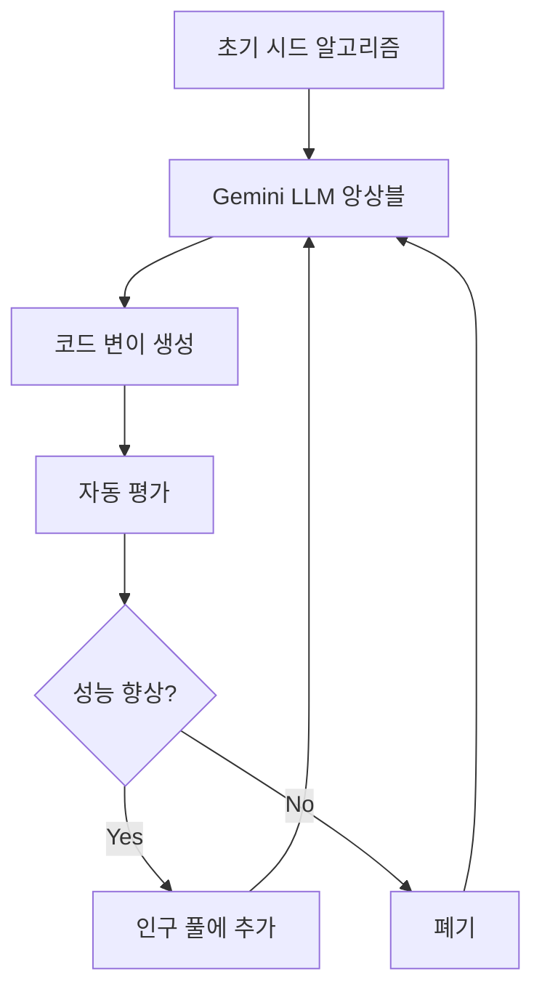
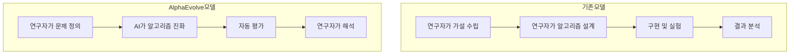
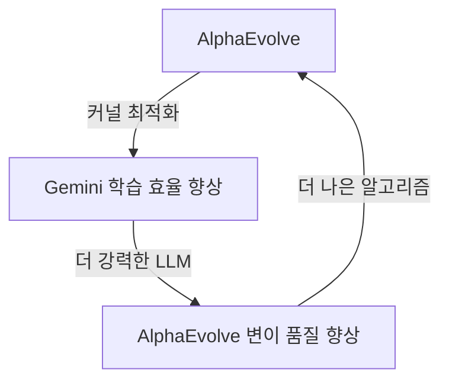

## 들어가며

2026년 3월 10일, Google DeepMind 팀이 arXiv에 공개한 논문 "Reinforced Generation of Combinatorial Structures: Ramsey Numbers"는 조용하지만 의미 있는 이정표를 세웠습니다. <strong>AlphaEvolve라는 단일 메타 알고리즘이 5개의 고전적인 라마지(Ramsey) 수 하한을 동시에 갱신</strong>한 것입니다. 일부 기록은 20년간 유지되던 것이었습니다.

AI가 코드를 작성하고, 버그를 수정하고, PR을 리뷰하는 것은 이미 일상이 되었습니다. 하지만 AI가 <strong>수학자들이 수십 년간 풀지 못한 문제의 새로운 해를 발견</strong>하는 것은 차원이 다른 이야기입니다. 이 글에서는 AlphaEvolve의 작동 방식, 라마지 수 돌파의 의미, 그리고 이것이 엔지니어링 조직에 시사하는 바를 정리합니다.

## 라마지 수란 무엇인가

라마지 이론(Ramsey Theory)은 조합론의 한 분야로, "충분히 큰 구조에서는 반드시 규칙적인 부분 구조가 나타난다"는 원리를 다룹니다.

<strong>라마지 수 R(s, t)</strong>는 다음을 만족하는 최소 정수 n입니다:

> n명의 사람이 모였을 때, 반드시 서로 모두 아는 s명의 그룹이 있거나, 서로 모두 모르는 t명의 그룹이 존재한다.

그래프 이론으로 표현하면, n개의 꼭짓점을 가진 완전 그래프의 간선을 빨강/파랑 두 색으로 칠할 때, 반드시 빨간색 완전 부분 그래프 K_s 또는 파란색 완전 부분 그래프 K_t가 나타나는 최소 n을 의미합니다.

라마지 수의 정확한 값을 구하는 것은 <strong>조합론에서 가장 어려운 문제 중 하나</strong>로 알려져 있습니다. 유명한 수학자 폴 에르되시(Paul Erdős)는 이렇게 말했습니다:

> "외계인이 지구를 파괴하겠다고 위협하면서 R(5,5)의 값을 요구한다면, 우리는 모든 컴퓨터와 수학자를 동원해 그 답을 찾아야 할 것이다. 하지만 R(6,6)을 요구한다면, 차라리 외계인을 공격하는 편이 나을 것이다."

## AlphaEvolve가 달성한 것

AlphaEvolve는 이번에 5개의 라마지 수 하한(lower bound)을 갱신했습니다:

| 라마지 수 | 이전 하한 | 새로운 하한 | 기록 유지 기간 |
|-----------|----------|------------|--------------|
| R(3, 13) | 60 | <strong>61</strong> | 11년 |
| R(3, 18) | 99 | <strong>100</strong> | 20년 |
| R(4, 13) | 138 | <strong>139</strong> | 11년 |
| R(4, 14) | 147 | <strong>148</strong> | 11년 |
| R(4, 15) | 158 | <strong>159</strong> | 6년 |

단순히 하한을 1씩 올린 것처럼 보일 수 있지만, 라마지 수 연구에서 이 정도의 진전은 <strong>단일 논문으로는 극히 이례적</strong>입니다. 기존에는 하나의 라마지 수 하한을 개선하는 데 수년의 연구가 필요했습니다.

더 주목할 점은 AlphaEvolve가 기존에 정확한 값이 알려진 모든 라마지 수에 대해서도 해당 하한을 성공적으로 복원했다는 것입니다. 이는 시스템의 신뢰성을 입증합니다.

## AlphaEvolve의 작동 원리

AlphaEvolve는 Google DeepMind가 개발한 <strong>진화적 코딩 에이전트(evolutionary coding agent)</strong>입니다. 핵심 아이디어는 "문제를 직접 풀지 않고, 문제를 푸는 알고리즘을 진화시킨다"는 것입니다.

### 1단계: 초기화

문제 명세, 평가 로직, 그리고 시드 프로그램(초기 알고리즘)을 정의합니다. 시드 프로그램은 최적이 아니더라도 문제를 풀 수 있는 기본 코드입니다.

### 2단계: 변이(Mutation)

Gemini 모델 앙상블이 현재 코드를 분석하고 변이된 버전을 생성합니다:

- <strong>Gemini Flash</strong>: 빠른 속도로 다양한 아이디어를 탐색 (탐색의 폭)
- <strong>Gemini Pro</strong>: 깊은 분석으로 질 높은 개선안 제시 (탐색의 깊이)

이 앙상블 접근법이 핵심입니다. Flash가 넓은 공간을 탐색하는 동안 Pro가 돌파구를 만들어냅니다.

### 3단계: 진화(Evolution)

진화 알고리즘이 인구 풀(population space)에서 유망한 변이들을 선택하고, 이를 조합하여 다음 세대의 출발점으로 사용합니다.

### 4단계: 평가 및 반복

자동화된 평가 메트릭이 각 후보 프로그램의 정확성과 품질을 정량적으로 측정합니다. 결과는 다시 LLM에 피드백되어 다음 라운드의 개선된 솔루션을 생성합니다.

이 루프가 재귀적으로 반복되면서, 초기의 단순한 시드 코드가 <strong>최첨단(state-of-the-art) 알고리즘으로 진화</strong>합니다.

## 메타 알고리즘이 의미하는 것

이번 라마지 수 연구에서 가장 놀라운 발견은 AlphaEvolve가 독립적으로 발명한 알고리즘들을 분석했을 때, <strong>인간 수학자들이 이전에 수작업으로 개발한 기법들을 재발견</strong>했다는 점입니다.

구체적으로:

- <strong>Paley 그래프</strong> 기반 접근법
- <strong>이차 잉여(Quadratic Residue) 그래프</strong> 구성법
- 기타 대수적 그래프 이론 기법

AI가 이러한 수학적 구성법을 "학습"한 것이 아니라, 진화적 탐색 과정에서 <strong>독자적으로 재발견</strong>한 것입니다. 이는 AlphaEvolve의 메타 알고리즘 접근법이 단순한 패턴 매칭을 넘어 근본적인 수학적 구조를 포착할 수 있음을 보여줍니다.

## 기존 AI 연구 도구와의 차이점

AlphaEvolve 이전에도 AI가 과학 연구에 기여한 사례는 있었습니다. 하지만 접근 방식에 중요한 차이가 있습니다:

| 시스템 | 접근 방식 | 특징 |
|--------|---------|------|
| AlphaFold | 단백질 구조 예측 | 특정 도메인에 특화된 모델 |
| GPT-5.2 | 이론물리학 추론 | 대형 모델의 추론 능력 활용 |
| AlphaEvolve | 알고리즘 자동 발견 | <strong>도메인 비의존적 메타 알고리즘</strong> |

AlphaEvolve의 핵심 차별점은 <strong>범용성</strong>입니다. 라마지 수뿐 아니라:

- Gemini 학습 시 행렬 곱셈 커널을 23% 최적화하여 전체 학습 시간 1% 절감
- 50개 이상의 공개 수학 문제 중 약 20%에서 기존 최고 해를 개선
- Kissing Number 문제 등 다양한 조합론 문제에 적용

<strong>하나의 시스템이 수학, 최적화, 엔지니어링 전반</strong>에 걸쳐 성과를 내고 있다는 점이 주목할 만합니다.

## CTO/EM이 주목해야 할 포인트

### 1. AI R&D 파이프라인의 변화

AlphaEvolve의 사례는 AI가 <strong>"도구"에서 "연구 동반자"로 진화</strong>하고 있음을 보여줍니다. 이는 R&D 조직 운영에 구조적 변화를 시사합니다:

연구자의 역할이 "알고리즘 설계자"에서 <strong>"문제 정의자 + 결과 해석자"</strong>로 변화하고 있습니다.

### 2. 엔지니어링 최적화 적용 가능성

AlphaEvolve는 이미 Google 내부에서 프로덕션 최적화에 활용되고 있습니다:

- <strong>행렬 곱셈 커널 최적화</strong>: Gemini 학습 속도 23% 향상
- <strong>데이터센터 스케줄링</strong>: 리소스 할당 알고리즘 개선
- <strong>컴파일러 최적화</strong>: 자동 코드 최적화 탐색

엔지니어링 팀이 당장 적용할 수 있는 영역:

- 성능 크리티컬 알고리즘의 자동 최적화
- A/B 테스트 전략의 진화적 개선
- 인프라 비용 최적화 알고리즘 탐색

### 3. "AI가 AI를 개선하는" 피드백 루프

AlphaEvolve가 Gemini의 학습 효율을 개선하고, 개선된 Gemini가 다시 AlphaEvolve의 성능을 높이는 구조는 <strong>자기 강화 루프(self-reinforcing loop)</strong>의 초기 형태입니다:

이 루프가 가속화될수록 AI 역량의 발전 속도는 비선형적으로 증가할 수 있습니다. CTO로서 이 트렌드를 모니터링하고, 자사 시스템에 유사한 자동 최적화 파이프라인을 설계하는 것이 중요합니다.

### 4. 인재 전략의 재고

AI가 알고리즘 설계와 최적화를 점점 더 잘하게 되면서, 엔지니어링 팀에 필요한 역량의 무게 중심이 이동합니다:

- <strong>문제 정의 능력</strong>: 올바른 질문을 던지는 역량
- <strong>평가 설계 능력</strong>: AI가 생성한 결과를 검증할 메트릭 설계
- <strong>결과 해석 능력</strong>: AI가 발견한 솔루션의 의미를 이해하는 도메인 지식
- <strong>AI 시스템 오케스트레이션</strong>: 복수의 AI 에이전트를 조율하는 역량

## 앞으로의 전망

AlphaEvolve의 라마지 수 돌파는 시작에 불과합니다. 2026년 현재, AI가 과학 연구에 미치는 영향은 가속화되고 있습니다:

- <strong>2025년 5월</strong>: AlphaEvolve 최초 공개 (행렬 곱셈 최적화)
- <strong>2025년 12월</strong>: Google Cloud에서 AlphaEvolve 서비스화
- <strong>2026년 3월</strong>: 라마지 수 5개 동시 갱신

Google Cloud를 통해 AlphaEvolve에 접근할 수 있게 되면서, 대기업뿐 아니라 스타트업과 연구 기관도 이 도구를 활용할 수 있는 길이 열렸습니다.

## 결론

AlphaEvolve의 라마지 수 돌파는 단순한 수학적 성과가 아닙니다. 이것은 <strong>AI가 인간의 지적 활동에서 점점 더 깊은 역할</strong>을 하게 되는 흐름의 이정표입니다.

엔지니어링 리더로서 우리가 준비해야 할 것은:

1. <strong>문제를 정의하는 역량</strong>을 조직의 핵심 역량으로 육성
2. <strong>자동 평가 파이프라인</strong>을 기술 스택에 통합
3. AI를 "도구"가 아닌 <strong>"연구/최적화 동반자"</strong>로 포지셔닝하는 조직 문화
4. <strong>진화적 접근법</strong>을 엔지니어링 프로세스에 실험적으로 도입

코드를 작성하는 AI는 이미 보편화되었습니다. 이제는 <strong>알고리즘을 발명하는 AI</strong>의 시대가 열리고 있습니다.

## 참고 자료

- [Reinforced Generation of Combinatorial Structures: Ramsey Numbers (arXiv)](https://arxiv.org/abs/2603.09172)
- [AlphaEvolve: A Gemini-powered coding agent for designing advanced algorithms (Google DeepMind)](https://deepmind.google/blog/alphaevolve-a-gemini-powered-coding-agent-for-designing-advanced-algorithms/)
- [AI as a research partner: Advancing theoretical computer science with AlphaEvolve (Google Research)](https://research.google/blog/ai-as-a-research-partner-advancing-theoretical-computer-science-with-alphaevolve/)
- [AlphaEvolve on Google Cloud](https://cloud.google.com/blog/products/ai-machine-learning/alphaevolve-on-google-cloud)
