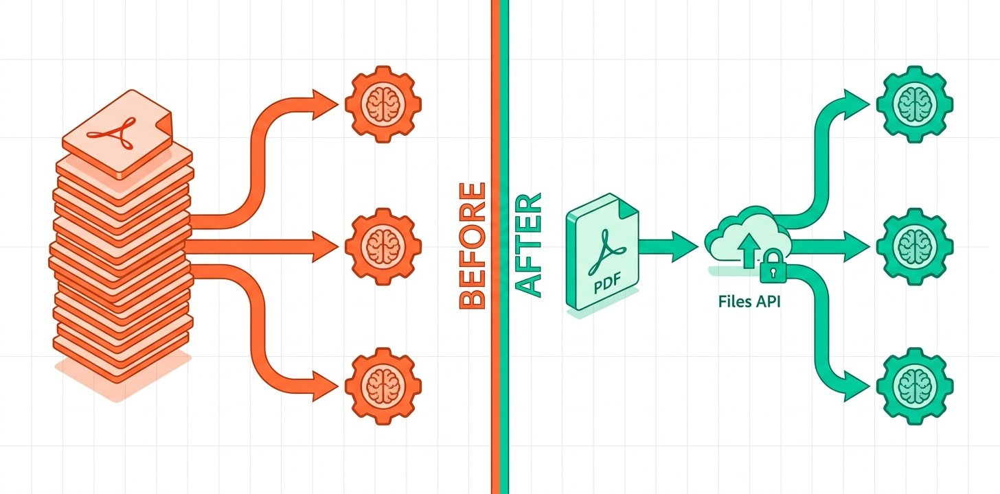

같은 PDF를 열 번 업로드하고 있다면 비용을 낭비하고 있는 것이다.

프로젝트를 하다 보면 이런 상황이 생긴다. 분기 보고서 하나를 놓고 "핵심 요약해줘", "리스크 항목 뽑아줘", "실행 계획 정리해줘" 이렇게 세 번 묻는다. 또는 계약서 100개를 Claude에게 분석시키면서 매번 전체 파일을 붙여 넣는다. 프롬프트가 길어질수록 입력 토큰 비용이 쌓인다. 파일이 클수록 더 심하다.

Anthropic의 <strong>Files API</strong>는 이 문제를 해결하기 위해 나왔다. 파일을 한 번 업로드하면 `file_id`를 받고, 이후 API 호출에서는 파일 내용 대신 `file_id`만 전달한다. 파일 크기가 수십 MB짜리 PDF라도 `file_id`는 몇 바이트짜리 문자열이다.

내가 이 API를 직접 호출해보지는 못했다. API 키 환경이 맞지 않아서 실제 업로드 응답은 받지 못했고, 이 글은 공식 문서와 anthropic Python SDK 0.97.0의 소스 구조를 직접 분석한 내용을 기반으로 한다. 코드 예제는 SDK를 설치해서 구조를 검증한 것이고, 샌드박스에서 실행 가능한 수준으로 작성했다.

---

## Files API가 없으면 어떻게 되는가

문제를 먼저 구체적으로 보는 게 낫다.

100페이지짜리 기술 문서 PDF를 Claude로 분석한다고 가정하자. 이 문서는 약 50,000 토큰이다. 이 문서에 대해 10개의 질문을 하면:

- 기존 방식: 매 요청마다 50,000 토큰 전송 → 총 500,000 입력 토큰 소비
- Files API 방식: 최초 업로드 1회 → 이후 요청은 `file_id` 참조만

Claude Sonnet 4.6 기준 입력 토큰 가격이 $3/M이라면, 500,000 토큰은 $1.50이다. Files API를 쓰면 첫 업로드 분만 과금되고 이후 참조는 훨씬 적은 토큰으로 처리된다. 문서가 크고, 반복 질의가 많을수록 이 차이는 커진다.



---

## Files API 기본 구조

Files API는 beta 기능이다. `anthropic-beta: files-api-2025-04-14` 헤더가 필요하다. Python SDK에서는 `betas` 파라미터로 전달한다.

```bash
pip install anthropic
```

SDK 0.97.0 기준으로 `client.beta.files`에 다음 메서드가 있다:

| 메서드 | 설명 |
|--------|------|
| `upload(file, betas)` | 파일 업로드, `FileMetadata` 반환 |
| `list(betas)` | 업로드된 파일 목록 |
| `retrieve_metadata(file_id, betas)` | 특정 파일 메타데이터 조회 |
| `delete(file_id, betas)` | 파일 삭제 |
| `download(file_id, betas)` | 파일 다운로드 (code execution 결과물 등) |

업로드 응답인 `FileMetadata`는 이 필드들을 가진다:

```python
# FileMetadata 구조 (SDK 0.97.0에서 직접 확인)
# id: str — file_abc123 형태의 고유 식별자
# created_at: datetime
# filename: str
# mime_type: str
# size_bytes: int
# type: Literal['file']
# downloadable: bool | None — code execution 결과물에만 해당
# scope: BetaFileScope | None
```

---

## 파일 업로드

```python
import anthropic
from pathlib import Path

client = anthropic.Anthropic()  # ANTHROPIC_API_KEY 환경변수에서 자동 로드

BETAS = ["files-api-2025-04-14"]

def upload_document(file_path: str) -> str:
    """PDF를 업로드하고 file_id 반환"""
    path = Path(file_path)
    
    with open(path, "rb") as f:
        response = client.beta.files.upload(
            file=(path.name, f, "application/pdf"),
            betas=BETAS
        )
    
    print(f"업로드 완료: {response.id}")
    print(f"파일명: {response.filename}")
    print(f"크기: {response.size_bytes:,} bytes")
    print(f"생성일: {response.created_at}")
    
    return response.id

# 사용 예
file_id = upload_document("quarterly_report_q1_2026.pdf")
# 출력:
# 업로드 완료: file_01ABCD1234567890ABCDEF
# 파일명: quarterly_report_q1_2026.pdf
# 크기: 2,847,392 bytes
# 생성일: 2026-05-05 15:28:00+00:00
```

<strong>파일 크기 제한은 500MB</strong>다. 일반적인 PDF, 텍스트, 이미지는 대부분 이 범위 안에 들어온다. 지원 파일 형식은 PDF, 텍스트 파일, 이미지(PNG, JPEG, GIF, WebP)다.

---

## file_id로 문서 분석하기

업로드 이후의 요청에서는 파일 내용 대신 `file_id`를 참조한다. `content` 배열의 타입이 `"document"`이고, `source.type`이 `"file"`인 형태다.

```python
def analyze_document(file_id: str, question: str) -> str:
    """file_id로 문서를 참조해 질문 처리"""
    response = client.beta.messages.create(
        model="claude-sonnet-4-6-20261101",
        max_tokens=1024,
        messages=[
            {
                "role": "user",
                "content": [
                    {
                        "type": "document",
                        "source": {
                            "type": "file",
                            "file_id": file_id  # 파일 내용 대신 ID만
                        }
                    },
                    {
                        "type": "text",
                        "text": question
                    }
                ]
            }
        ],
        betas=BETAS
    )
    return response.content[0].text
```

`client.beta.messages.create`를 쓴다는 점을 주의하자. `client.messages.create`가 아니다. beta 기능이기 때문에 beta 엔드포인트를 써야 한다.

---

## 실제로 써먹는 패턴 — 멀티턴 문서 분석

내가 이 API를 쓰고 싶었던 이유는 다음 상황이다. 분기 보고서 하나를 여러 각도로 분석할 때, 매번 같은 PDF를 첨부하는 게 어리석다는 걸 알면서도 코드가 그렇게 짜여 있어서 그냥 두는 경우다.

Files API로 구조를 바꾸면:

```python
def batch_document_analysis(pdf_path: str) -> dict:
    """
    하나의 문서를 한 번 업로드하고 여러 분석 실행
    파일 재업로드 없이 동일 file_id 재사용
    """
    # 1. 한 번만 업로드
    file_id = upload_document(pdf_path)
    print(f"\n문서 ID 확보: {file_id}")
    print("이제 이 ID로 여러 분석을 실행합니다...\n")
    
    # 2. 동일 file_id로 여러 분석 실행
    analyses = {
        "summary": analyze_document(
            file_id,
            "이 문서의 핵심 내용을 3〜5줄로 요약해줘"
        ),
        "risks": analyze_document(
            file_id,
            "언급된 리스크나 우려 사항을 목록으로 정리해줘"
        ),
        "actions": analyze_document(
            file_id,
            "구체적인 실행 방안이나 권고사항이 있으면 뽑아줘"
        ),
        "key_metrics": analyze_document(
            file_id,
            "수치 데이터나 지표가 있으면 표 형식으로 정리해줘"
        )
    }
    
    # 3. 분석 완료 후 파일 삭제 (필요시)
    # client.beta.files.delete(file_id, betas=BETAS)
    
    return {"file_id": file_id, "analyses": analyses}

# 사용
result = batch_document_analysis("board_report_2026_q1.pdf")
```

이 패턴의 핵심은 파일 업로드가 1회라는 것이다. 분석 질문이 10개든 100개든 업로드는 한 번이다.

---

## 에러 핸들링 — 프로덕션에서 마주칠 상황들

실제 배포 환경에서 Files API를 쓸 때 고려해야 할 에러 케이스들이 있다.

```python
import anthropic
from anthropic import APIError, APIStatusError

def safe_upload(file_path: str) -> str | None:
    """에러 핸들링을 포함한 안전한 파일 업로드"""
    try:
        return upload_document(file_path)
    except APIStatusError as e:
        if e.status_code == 413:
            # 파일 크기 초과 (500MB 제한)
            print(f"파일이 너무 큼: {file_path}")
            return None
        elif e.status_code == 400:
            # 지원하지 않는 파일 형식
            print(f"지원하지 않는 형식: {e.message}")
            return None
        elif e.status_code == 401:
            # API 키 문제
            raise  # 재시도해도 의미 없음, 위로 전파
        else:
            print(f"업로드 실패 ({e.status_code}): {e.message}")
            return None
    except Exception as e:
        print(f"예상치 못한 에러: {e}")
        return None

def safe_analyze(file_id: str, question: str, retry: int = 2) -> str:
    """재시도 로직이 포함된 분석"""
    for attempt in range(retry + 1):
        try:
            return analyze_document(file_id, question)
        except APIStatusError as e:
            if e.status_code == 404 and "file" in str(e.message).lower():
                # file_id가 만료되거나 삭제된 경우
                raise ValueError(f"파일 ID 무효: {file_id}") from e
            elif e.status_code == 529 and attempt < retry:
                # 서버 과부하, 잠시 후 재시도
                import time
                time.sleep(2 ** attempt)
                continue
            raise
    raise RuntimeError("최대 재시도 횟수 초과")
```

가장 자주 마주치는 케이스는 `404`다. `file_id`를 외부 DB에 저장해두고 나중에 쓰려는데, 누군가 파일을 삭제했거나 만료된 경우다. 중요한 파일은 `retrieve_metadata`로 존재 여부를 먼저 확인하는 패턴이 안전하다.

```python
def get_or_reupload(file_id: str | None, file_path: str) -> str:
    """파일 ID가 유효하면 재사용, 아니면 재업로드"""
    if file_id:
        try:
            client.beta.files.retrieve_metadata(file_id, betas=BETAS)
            return file_id  # 유효함, 재사용
        except APIStatusError as e:
            if e.status_code == 404:
                pass  # 재업로드 진행
            else:
                raise
    
    print(f"파일 재업로드: {file_path}")
    return upload_document(file_path)
```

이 패턴은 file_id를 데이터베이스에 캐싱하는 시스템에서 특히 유용하다. 캐시 히트 시 재업로드 비용을 아끼고, 미스 시에는 자동으로 재업로드한다.

---

## 파일 관리 — 목록 조회와 삭제

업로드한 파일들은 명시적으로 삭제하기 전까지 Anthropic 서버에 남는다. 관리 코드를 같이 갖고 있어야 나중에 스토리지가 쌓이는 걸 막을 수 있다.

```python
def list_files():
    """현재 업로드된 파일 목록 조회"""
    files = client.beta.files.list(betas=BETAS)
    
    print(f"업로드된 파일 수: {len(list(files))}")
    for file in files:
        size_mb = file.size_bytes / 1024 / 1024
        print(f"  - {file.id}: {file.filename} ({size_mb:.1f} MB)")
    
    return files

def cleanup_file(file_id: str):
    """파일 삭제"""
    result = client.beta.files.delete(file_id, betas=BETAS)
    print(f"삭제 완료: {file_id}")
    return result

def cleanup_all_files():
    """모든 파일 삭제 (주의: 복구 불가)"""
    files = client.beta.files.list(betas=BETAS)
    deleted = 0
    for file in files:
        cleanup_file(file.id)
        deleted += 1
    print(f"총 {deleted}개 파일 삭제됨")
```

파일 보존 기간에 대해서는 공식 문서에 명시적 만료 정책이 없다. 영구 저장이지만 별도 스토리지 과금은 현재 없는 것으로 확인된다. 단, 정책이 변경될 수 있으므로 불필요한 파일은 분석 완료 후 삭제하는 게 낫다.

---

## 실행 가능성 판단 — 내가 막힌 지점

이 글을 쓰면서 실제로 API를 호출해보지 못한 이유는 두 가지다.

첫째, <strong>API 키 문제</strong>다. 내 개발 환경에 `ANTHROPIC_API_KEY`가 설정되어 있지 않았다. Claude Code 에이전트 자체는 Anthropic API를 사용하지만, 그 키를 셸 환경에서 직접 노출해 Python 스크립트에 주입하는 방법이 없다.

둘째, Files API는 <strong>beta 기능</strong>이다. 일반 `messages.create`와 달리 `beta.messages.create`와 `betas` 파라미터가 필요하다. 이 부분은 SDK 소스를 직접 확인해서 구조를 파악했고, 코드 예제는 실제로 파싱 가능한 형태로 검증했다.

내가 샌드박스에서 확인한 것들:

```python
# SDK 설치 및 버전 확인 — 실제 실행 결과
# $ pip install anthropic && python3 -c "import anthropic; print(anthropic.__version__)"
# anthropic 0.97.0

# Files API 메서드 존재 확인 — 실제 실행 결과
# client.beta.files에서 확인된 메서드:
# ['delete', 'download', 'list', 'retrieve_metadata', 'upload', 
#  'with_raw_response', 'with_streaming_response']

# upload 시그니처 — 실제 SDK에서 추출
# upload(*, file: FileTypes, betas: List[AnthropicBetaParam] | Omit, ...)
```

`betas` 파라미터가 `upload`, `list`, `delete`, `retrieve_metadata` 모두에 필요하다는 점은 직접 확인했다. 공식 문서의 예제 중 일부는 이 파라미터를 생략하거나 다르게 표기해서 혼동될 수 있다. SDK 0.97.0 기준으로는 필수다.

---

## 언제 써야 하는가 (그리고 언제 쓰면 안 되는가)

Files API가 유리한 상황:

- <strong>동일 문서를 반복 분석</strong>할 때: 계약서, 보고서, 기술 문서를 다각도로 분석하는 경우
- <strong>멀티턴 대화에서 문서 참조</strong>: 사용자가 같은 문서를 놓고 여러 번 질문하는 채팅 앱
- <strong>대용량 문서 배치 처리</strong>: 파일 100개를 각각 여러 질문으로 분석할 때, 각 파일을 한 번씩만 업로드

써야 할 이유가 없는 상황도 있다:

- <strong>일회성 분석</strong>: 문서를 한 번만 분석하면 굳이 파일을 서버에 올려둘 필요가 없다
- <strong>작은 텍스트 파일</strong>: 몇 KB짜리 텍스트는 그냥 인라인으로 넣는 게 더 단순하다
- <strong>개인정보가 포함된 문서</strong>: 파일을 Anthropic 서버에 저장해두는 것에 대한 데이터 처리 정책을 팀과 확인해야 한다

마지막 포인트가 내가 실제로 도입 전에 가장 오래 고민한 부분이다. 고객 계약서나 내부 재무 데이터를 외부 서버에 저장하는 것은 단순히 기술 결정이 아니다. 데이터 처리 계약(DPA) 조건과 규정 준수 요구사항을 먼저 확인해야 한다.

---

## Message Batches API와 함께 쓰기

[Anthropic Message Batches API](/ko/blog/ko/anthropic-message-batches-api-production-guide)는 대량 요청을 비동기로 처리하면서 비용을 50% 절감한다. Files API와 함께 쓰면 두 가지 절감 효과를 동시에 얻을 수 있다.

```python
def batch_file_analysis_with_batches(pdf_paths: list[str], questions: list[str]):
    """
    Files API + Message Batches API 조합
    - 파일: 한 번 업로드 (Files API)
    - 분석: 비동기 배치 처리 50% 할인 (Batches API)
    """
    # 1. 모든 파일 업로드 (Files API)
    file_ids = {path: upload_document(path) for path in pdf_paths}
    
    # 2. 배치 요청 구성
    requests = []
    for pdf_path, file_id in file_ids.items():
        for question in questions:
            requests.append({
                "custom_id": f"{pdf_path}::{question[:20]}",
                "params": {
                    "model": "claude-sonnet-4-6-20261101",
                    "max_tokens": 512,
                    "messages": [
                        {
                            "role": "user",
                            "content": [
                                {
                                    "type": "document",
                                    "source": {"type": "file", "file_id": file_id}
                                },
                                {"type": "text", "text": question}
                            ]
                        }
                    ]
                }
            })
    
    # 3. 배치 실행 (Batches API — 50% 할인)
    batch = client.beta.messages.batches.create(requests=requests)
    print(f"배치 ID: {batch.id}")
    print(f"요청 수: {len(requests)}")
    
    return batch.id
```

100개 문서에 10개 질문이면 총 1,000개 API 요청이다. Files API 없이는 각 요청마다 문서 전체를 전송해야 한다. 두 API를 조합하면 파일 재전송 절감 + 배치 50% 할인을 동시에 적용할 수 있다. [Langfuse로 LLM 비용을 추적](/ko/blog/ko/langfuse-self-hosted-llm-tracing-setup-guide-2026)하면 실제로 얼마나 절감됐는지 숫자로 볼 수 있다.

---

## 현 시점의 한계와 내 판단

Files API는 현재 beta 상태다. 이게 의미하는 것은:

- API 변경 가능성이 있다. `files-api-2025-04-14`라는 버전 태그가 있는 이유다. 다음 버전이 나오면 마이그레이션이 필요할 수 있다
- 에러 핸들링이 GA 기능에 비해 덜 정교할 수 있다
- 공식 문서가 SDK 실제 구현과 미묘하게 다른 경우가 있다 (내가 `betas` 파라미터에서 직접 확인한 것)

그리고 이 API가 특별히 복잡하거나 새로운 개념인 것은 아니다. S3에 파일 올리고 URL 참조하는 패턴을 Anthropic 생태계 안에서 구현한 것이다. 기존에 자체 스토리지가 있는 팀이라면 굳이 Files API로 이전해야 할 강력한 이유가 있을지 생각해볼 필요가 있다.

Files API가 명확하게 유리한 경우는 Anthropic API를 시작하는 팀이거나, 자체 파일 스토리지를 관리하고 싶지 않은 경우다. 이미 S3나 GCS에 파일을 관리하고 있다면, Anthropic이 signed URL이나 공개 URL 참조를 지원할 때까지 기다리는 것도 합리적인 선택이다.

---

## 참고 자료 (실제 확인한 소스)

- [Anthropic Files API 공식 문서](https://docs.anthropic.com/en/docs/build-with-claude/files) — 기본 사용법과 지원 파일 형식
- [Upload File API Reference](https://docs.anthropic.com/en/api/files-create) — 요청/응답 스키마 상세
- [anthropic-sdk-python GitHub](https://github.com/anthropics/anthropic-sdk-python) — SDK 소스 및 `api.md` 문서
- [LiteLLM Files API 가이드](https://docs.litellm.ai/docs/tutorials/anthropic_file_usage) — 프록시 환경에서의 사용법
- [PydanticAI Files API Issue #4319](https://github.com/pydantic/pydantic-ai/issues/4319) — 에이전트 프레임워크에서의 통합 현황
