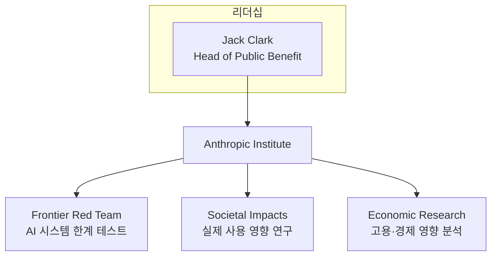
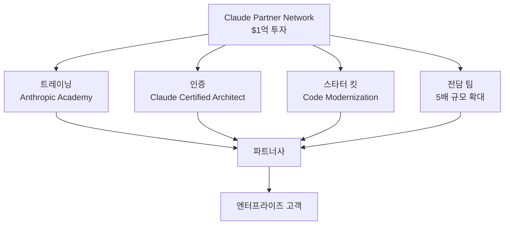

2026년 3월 11일과 12일, Anthropic이 이틀 연속으로 대형 발표를 했습니다. 첫 번째는 AI의 사회적 영향을 연구하는 <strong>Anthropic Institute</strong>의 설립, 두 번째는 엔터프라이즈 파트너 생태계 구축을 위한 <strong>$1억 규모의 Claude Partner Network</strong> 투자입니다.

이 두 발표는 단순한 신규 프로그램 론칭이 아닙니다. Anthropic이 "모델 회사"에서 "AI 플랫폼 생태계 기업"으로 전환하고 있다는 명확한 신호입니다. CTO와 VPoE의 시각에서 이것이 의미하는 바를 분석합니다.

## Anthropic Institute — AI 연구소가 왜 필요한가

### 3개 팀의 통합

Anthropic Institute는 기존에 분산되어 있던 세 개의 연구 팀을 하나의 조직으로 통합한 것입니다.



<strong>Frontier Red Team</strong>은 AI 시스템의 극한 능력을 스트레스 테스트하는 팀입니다. 최근에는 Claude를 활용해 Firefox 코드베이스에서 22개의 CVE(보안 취약점)를 자율 발견한 프로젝트가 대표적입니다. 단순히 취약점을 찾는 것을 넘어, AI가 그 취약점을 자율적으로 익스플로잇할 수 있는지까지 테스트했습니다. 이 프로젝트의 기술적 세부 내용은 [Claude가 Firefox에서 22개 CVE를 발견하다 — AI 보안 감사의 새로운 패러다임](/ko/blog/ko/claude-firefox-22-cves-ai-security-audit)에서 확인할 수 있습니다.

<strong>Societal Impacts</strong> 팀은 AI가 실제 세계에서 어떻게 사용되고 있는지 현장 연구를 수행합니다. <strong>Economic Research</strong> 팀은 AI가 고용 시장과 거시 경제에 미치는 영향을 추적합니다.

### 왜 모델 회사가 연구소를 만드는가

AI 모델의 성능이 급격히 향상되면서, "이 기술이 사회에 어떤 영향을 미치는가"를 모델 개발사 자체가 연구해야 할 필요성이 커졌습니다. Anthropic Institute의 설립은 세 가지 메시지를 담고 있습니다.

1. <strong>규제 대응의 선제적 전략</strong>: 외부에서 규제가 오기 전에, 자체 연구 데이터로 정책 논의에 참여하겠다는 의지입니다. 실제로 Anthropic은 워싱턴 D.C.에 Public Policy 팀 사무실을 올봄 개설할 예정입니다.

2. <strong>엔터프라이즈 신뢰 구축</strong>: 대기업 고객에게 "우리는 모델만 파는 게 아니라, 그 모델이 미치는 영향까지 책임지겠다"는 신호를 보내는 것입니다.

3. <strong>인재 확보</strong>: 머신러닝 엔지니어뿐 아니라 경제학자, 사회과학자, 사이버보안 전문가를 한 조직으로 모으는 것은 AI 안전성 인재 시장에서의 경쟁력을 의미합니다.

## Claude Partner Network — $1억의 생태계 투자

### 프로그램의 구조

Anthropic Institute가 "연구"라면, Claude Partner Network는 "실행"입니다. $1억 규모의 이 투자는 엔터프라이즈 AI 도입을 가속화하기 위한 파트너 생태계 구축에 집중합니다.



<strong>대상 파트너</strong>는 경영 컨설팅 펌, SI(시스템 통합) 기업, AI 전문 서비스 기업입니다. AWS나 Azure의 파트너 프로그램과 유사한 구조이지만, AI 모델 벤더가 직접 운영한다는 점이 차별점입니다.

### Claude Certified Architect — AI 벤더 최초의 기술 인증

이번 발표에서 가장 주목할 부분은 <strong>Claude Certified Architect, Foundations</strong> 인증 프로그램입니다. 이것은 Claude를 활용한 프로덕션 애플리케이션을 설계하는 솔루션 아키텍트를 위한 기술 시험입니다.

AWS Solutions Architect나 Google Cloud Professional Architect처럼, AI 플랫폼 벤더도 자체 인증 체계를 갖추기 시작한 것입니다. 2026년 후반에는 세일즈, 아키텍트, 개발자를 위한 추가 인증이 출시될 예정입니다.

이것이 의미하는 바는 명확합니다:

- <strong>인재 시장의 구조적 변화</strong>: "Claude 전문가"가 하나의 커리어 트랙이 됩니다
- <strong>조직의 역량 증명</strong>: 파트너사가 고객에게 전문성을 증명할 수 있는 공식 채널이 생겼습니다
- <strong>벤더 락인의 심화</strong>: 인증 생태계는 전환 비용을 높이는 가장 강력한 도구입니다

### Code Modernization Starter Kit

또 하나의 핵심은 <strong>Code Modernization 스타터 킷</strong>입니다. 이는 레거시 코드베이스 마이그레이션과 기술 부채 해소를 위한 표준화된 시작점을 파트너사에 제공합니다.

Anthropic 스스로도 이것이 "가장 수요가 높은 엔터프라이즈 워크로드"라고 밝혔습니다. Claude의 에이전틱 코딩 능력이 가장 직접적으로 고객 성과로 이어지는 영역이라는 판단입니다.

## CTO가 읽어야 할 3가지 신호

### 신호 1: AI 벤더 평가 기준의 변화

2024〜2025년까지 AI 벤더 평가는 대부분 벤치마크 성능에 집중되었습니다. "SWE-bench에서 몇 %인가", "코딩 벤치마크 1위인가"가 주된 기준이었습니다.

2026년부터는 다른 질문을 해야 합니다:

| 과거의 질문 | 2026년의 질문 |
|---|---|
| 모델 성능 벤치마크 | 파트너 생태계 규모와 성숙도 |
| API 가격 | 도입 지원 체계 (교육, 인증, 전담팀) |
| 컨텍스트 윈도우 크기 | 규제 대응 및 안전성 연구 투자 |
| 추론 속도 | 레거시 현대화 도구 및 스타터 킷 |

벤더의 모델 성능은 점점 수렴하고 있습니다. 차별화는 생태계에서 나옵니다.

### 신호 2: 안전성 연구가 영업 도구가 된다

Anthropic Institute의 Frontier Red Team이 Firefox에서 CVE를 발견한 것은 순수한 연구 성과이기도 하지만, 동시에 강력한 엔터프라이즈 세일즈 메시지입니다. "우리 모델은 여러분의 코드베이스에서 보안 취약점을 찾을 수 있습니다."

이는 AI 안전성 연구가 단순한 비용 센터가 아니라, 매출에 직접 기여하는 자산이 될 수 있음을 보여줍니다. CTO는 벤더의 안전성 투자를 "윤리적 장식"이 아닌 "기술적 역량의 증거"로 재평가해야 합니다.

### 신호 3: AI 인증 생태계의 시작

AWS 인증이 클라우드 인재 시장을 구조적으로 바꿨듯이, AI 벤더 인증도 같은 효과를 낼 가능성이 있습니다. 차이점은 속도입니다. 클라우드 인증 생태계가 성숙하는 데 5〜7년이 걸렸다면, AI 인증은 이미 검증된 모델 위에서 훨씬 빠르게 확산될 수 있습니다.

엔지니어링 리더에게 이는 두 가지 의미입니다:

1. <strong>팀원의 성장 경로</strong>: Claude Certified Architect가 팀원의 커리어 마일스톤이 될 수 있습니다
2. <strong>채용 기준</strong>: 조만간 "Claude 인증 보유"가 채용 공고의 우대 조건에 등장할 것입니다

## 경쟁사 대비 포지셔닝

Anthropic만 생태계 전략을 추진하는 것은 아닙니다. 3대 AI 벤더의 최근 행보를 비교해 보겠습니다.

| 영역 | Anthropic | OpenAI | Google |
|---|---|---|---|
| 연구 기관 | Anthropic Institute | — | DeepMind (기존) |
| 파트너 프로그램 | Claude Partner Network ($1억) | Frontier Program | Google Cloud AI Partner |
| 보안 전략 | Frontier Red Team (내부) | Promptfoo 인수 (외부) | Project Zero (기존) |
| 프로토콜 표준 | MCP (Linux Foundation) | Open Responses API | A2A 프로토콜 |
| 인증 프로그램 | Claude Certified Architect | — | Google Cloud AI 인증 |

<strong>Anthropic</strong>은 "안전성 + 생태계" 투트랙 전략입니다. 연구소가 신뢰를 구축하고, 파트너 네트워크가 시장을 확대합니다.

<strong>OpenAI</strong>는 Promptfoo 인수를 통해 에이전트 보안 테스팅을 Frontier 플랫폼에 내장하는 방식으로, 보안을 제품 기능으로 흡수하는 전략입니다.

<strong>Google</strong>은 기존 클라우드 파트너 생태계 위에 AI를 얹는 전략으로, 이미 구축된 인프라의 장점을 활용합니다.

## 실전: 엔지니어링 팀이 지금 해야 할 것

### 1. Claude Certified Architect 준비 검토

팀 내 솔루션 아키텍트나 테크 리드 중 1〜2명에게 초기 인증 취득을 권장합니다. 초기 인증 취득자는 커뮤니티에서의 가시성과 벤더와의 관계 구축 측면에서 유리합니다.

```bash
# Anthropic Academy 접근 (파트너 등록 후)
# Partner Portal에서 트레이닝 자료 확인
# Claude Certified Architect, Foundations 시험 준비
```

### 2. Partner Network 가입 검토

멤버십은 무료입니다. 가입하면 다음을 얻을 수 있습니다:

- Anthropic Academy 트레이닝 자료
- 세일즈 리소스 및 공동 마케팅 문서
- 전담 Applied AI 엔지니어 지원
- Code Modernization 스타터 킷

특히 SI나 컨설팅 사업을 하는 조직이라면, 조기 가입이 경쟁 우위가 됩니다. 파트너 생태계에서 Claude 에이전트가 수행할 수 있는 역량 확장에 대해서는 [Anthropic Agent Skills 표준: AI 에이전트 역량 확장](/ko/blog/ko/anthropic-agent-skills-standard)을 참고하세요.

### 3. 벤더 평가 프레임워크 업데이트

기존 AI 벤더 평가표에 생태계 성숙도 항목을 추가하세요.

```yaml
# AI 벤더 평가 프레임워크 (2026 업데이트)
model_performance:
  weight: 0.25  # 기존 0.50에서 하향
  metrics: [benchmark_scores, latency, context_window]

ecosystem_maturity:
  weight: 0.30  # 신규 항목
  metrics:
    - partner_program_scale
    - certification_availability
    - starter_kits_and_tools
    - dedicated_support_team

safety_and_governance:
  weight: 0.20  # 신규 항목
  metrics:
    - safety_research_investment
    - regulatory_engagement
    - vulnerability_research_track_record

cost_and_scalability:
  weight: 0.15
  metrics: [api_pricing, volume_discounts, sla]

developer_experience:
  weight: 0.10
  metrics: [sdk_quality, documentation, community]
```

### 4. Code Modernization 파일럿

레거시 코드베이스가 있는 프로젝트에서 Code Modernization 스타터 킷을 활용한 소규모 파일럿을 시작하세요. 전체 마이그레이션이 아닌, 하나의 모듈 또는 서비스에서 시작해 ROI를 측정하는 것이 핵심입니다. Claude를 활용한 에이전틱 코딩 패턴에 대해서는 [Claude Code 에이전틱 워크플로우 패턴 5가지](/ko/blog/ko/claude-code-agentic-workflow-patterns-5-types)를 참고하세요.

## 마치며

Anthropic의 이번 발표는 AI 산업이 "모델 성능 경쟁"에서 "생태계 성숙도 경쟁"으로 전환하고 있다는 가장 명확한 신호입니다. AWS가 클라우드 시장을 인증·파트너·교육 생태계로 장악했듯이, AI 시장에서도 같은 역학이 작동하기 시작했습니다.

CTO와 VPoE는 지금 세 가지를 해야 합니다:

1. AI 벤더 평가 기준을 "모델 성능"에서 "생태계 성숙도"로 확장할 것
2. 팀 내 AI 인증 로드맵을 수립할 것
3. 파트너 프로그램의 조기 참여 여부를 결정할 것

기술의 차별화가 수렴하는 시대에, 진정한 경쟁 우위는 생태계에서 나옵니다.

## 참고 자료

- [Introducing The Anthropic Institute](https://www.anthropic.com/news/the-anthropic-institute)
- [Anthropic invests $100 million into the Claude Partner Network](https://www.anthropic.com/news/claude-partner-network)
- [Anthropic forms institute to study long-term AI risks](https://www.helpnetsecurity.com/2026/03/11/anthropic-institute-ai-challenges/)
- [Anthropic launches partner network with $100m investment](https://www.investing.com/news/economy-news/anthropic-launches-partner-network-with-100m-investment-93CH-4557957)
