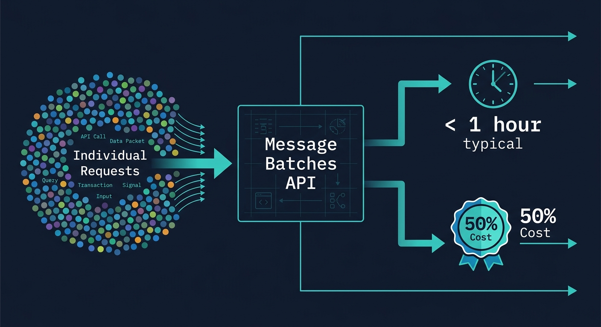

LLM API 비용이 과소평가되는 시점은 대체로 규모가 커질 때다. 소규모 POC에선 보이지 않던 비용이, 월 수십만 건의 요청이 쌓이면 청구서에서 처음으로 제대로 보인다. Anthropic의 Message Batches API는 그 지점을 정조준한 기능이다. 단일 API 호출로 최대 100,000개의 요청을 묶고, 비용을 절반으로 내린다.

나는 이 기능을 처음 접했을 때 "결국 비동기 큐를 API로 만든 것"이라고 생각했다. 그 판단은 반쯤 맞고 반쯤 틀렸다. 설계 결정 몇 가지가 단순 큐와는 다르게 작동한다. 이 글에서 그 차이를 짚고, 실제로 쓸 수 있는 코드와 함께 정리한다.

## Message Batches API란 무엇인가

Anthropic Message Batches API는 여러 개의 독립적인 Claude 메시지 요청을 묶어 비동기로 처리하는 인터페이스다. REST API와 공식 SDK(Python, TypeScript/Node.js) 모두 지원된다.

**엔드포인트 구조:**

```
POST /v1/messages/batches          → 배치 생성
GET  /v1/messages/batches/{id}     → 상태 조회
GET  /v1/messages/batches/{id}/results → 결과 스트리밍
POST /v1/messages/batches/{id}/cancel  → 취소
GET  /v1/messages/batches          → 목록 조회 (페이지네이션)
```

**핵심 특징:**

<strong>비용</strong>: 입력·출력 토큰 모두 표준 요금 대비 **50% 할인** 적용된다. 모든 지원 모델에 일괄 적용된다.

| 모델 | Batch 입력 | Batch 출력 | 표준 입력 | 표준 출력 |
|------|-----------|-----------|---------|---------|
| Claude Opus 4.7 | $2.50/MTok | $12.50/MTok | $5.00/MTok | $25.00/MTok |
| Claude Sonnet 4.6 | $1.50/MTok | $7.50/MTok | $3.00/MTok | $15.00/MTok |
| Claude Haiku 4.5 | $0.50/MTok | $2.50/MTok | $1.00/MTok | $5.00/MTok |

<strong>처리 시간</strong>: 대부분의 배치는 1시간 이내에 완료된다. 최대 타임아웃은 24시간이다. 타임아웃이 초과되면 만료된 요청은 **청구되지 않는다**.

<strong>규모 제한</strong>: 배치당 최대 100,000개 요청 또는 256MB, 둘 중 먼저 도달하는 한계가 적용된다. 결과는 생성 후 29일간 보존된다.

<strong>지원 모델</strong>: Claude Opus 4.7, 4.6, Sonnet 4.6, 4.5, Haiku 4.5 등 현재 지원 중인 모든 Claude 모델.

솔직히 말하면, 100,000개 제한이 처음엔 넉넉해 보여도 실제 대규모 파이프라인에서는 금방 채울 수 있다. 1,000만 건을 처리하려면 100번의 배치가 필요하다는 계산이 나온다. 처리량이 진짜 크다면 배치 분할 전략도 함께 설계해야 한다.

## 언제 Batches API가 답인가

이 API가 맞는 상황과 그렇지 않은 상황이 명확하다. 잘못 적용하면 오히려 UX가 나빠진다.

**Batches API가 적합한 상황:**

- **대규모 평가(evals) 파이프라인**: 수천 개의 테스트 케이스를 야간 배치로 실행할 때. 모델을 업그레이드하거나 프롬프트를 변경할 때마다 전체 테스트 스위트를 돌리는 비용이 절반이 된다.
- **오프라인 콘텐츠 생성**: 상품 설명 10만 건, 기사 요약 5만 건 같은 벌크 작업. 이커머스나 미디어 플랫폼에서 가장 직접적으로 효과가 나온다.
- **데이터 분석 및 분류**: 사용자 생성 콘텐츠 대량 처리, 감성 분석, 카테고리 분류.
- **야간 ETL 파이프라인**: 다음 날 아침 결과가 필요한 로그 분석, 리포트 생성.
- **모델 출력 비교**: A/B 테스트 목적의 대규모 실험. 같은 입력에 대해 두 모델의 응답을 비교할 때.
- **콘텐츠 모더레이션**: 사용자 업로드 콘텐츠를 실시간이 아닌 배치로 검토하는 경우.

**Batches API가 맞지 않는 상황:**

- 사용자가 실시간으로 응답을 기다리는 채팅 인터페이스
- 스트리밍(SSE)이 필요한 경우 — Batches API는 스트리밍을 지원하지 않는다
- 수십 ms 단위의 레이턴시가 필요한 실시간 추천 시스템
- 이전 요청 결과에 따라 다음 요청이 결정되는 순차적 워크플로우 (에이전트 루프 등)

나는 이 판단 기준을 하나의 질문으로 요약한다. "사용자가 이 응답을 24시간 내에 받으면 충분한가?" 그렇다면 Batches API를 고려할 가치가 있다.

## 실전 코드: Node.js SDK로 배치 구현하기

샌드박스에서 `@anthropic-ai/sdk`를 설치하고 구조를 검증했다. API 키 없이 실행하면 `AuthenticationError (401)`이 반환됐는데, 이는 엔드포인트가 실재하고 요청이 실제로 서버까지 도달한다는 의미다. SDK 로드 자체는 정상 동작했다.

```bash
$ npm install @anthropic-ai/sdk
# 설치 출력:
# added 12 packages in 3.2s
```

### 배치 생성

```javascript
import Anthropic from "@anthropic-ai/sdk";

const client = new Anthropic({ apiKey: process.env.ANTHROPIC_API_KEY });

// 상품 설명 생성 예제
const products = [
  { id: "prod-001", name: "Wireless Ergonomic Mouse", category: "Electronics" },
  { id: "prod-002", name: "Standing Desk Mat", category: "Office" },
  { id: "prod-003", name: "Mechanical Keyboard", category: "Electronics" },
  // ... 수천 개까지 확장 가능
];

const batchRequests = products.map((p) => ({
  custom_id: p.id,          // 필수: 결과 매핑에 사용하는 고유 ID
  params: {
    model: "claude-haiku-4-5",
    max_tokens: 200,
    system: "You are a concise product copywriter.",
    messages: [
      {
        role: "user",
        content: `Write a 2-sentence description for: ${p.name} (${p.category})`,
      },
    ],
  },
}));

const batch = await client.messages.batches.create({
  requests: batchRequests,
});

console.log(`Batch created: ${batch.id}`);
// → msgbatch_01ABCDEF...
console.log(`Status: ${batch.processing_status}`);
// → "in_progress"
console.log(`Request counts:`, batch.request_counts);
// → { processing: 3, succeeded: 0, errored: 0, canceled: 0, expired: 0 }
```

`custom_id`는 필드명이 평범해 보이지만 실제로 가장 중요한 설계 결정 중 하나다. 결과는 **순서가 보장되지 않는다**. 1,000개를 넣으면 결과가 임의 순서로 돌아온다. 배열 인덱스로 요청과 결과를 매핑하면 데이터가 조용히 섞인다. `custom_id`만이 안전하다.

`custom_id` 형식: 1〜64자, 알파벳 소문자·대문자·숫자·하이픈·언더스코어만 허용. 정규식: `^[a-zA-Z0-9_-]{1,64}$`

### 폴링으로 완료 대기

```javascript
async function waitForBatch(client, batchId) {
  while (true) {
    const batch = await client.messages.batches.retrieve(batchId);
    const { processing, succeeded, errored, expired } = batch.request_counts;
    
    console.log(
      `[${new Date().toISOString()}] status=${batch.processing_status}` +
      ` | processing=${processing} succeeded=${succeeded}` +
      ` errored=${errored} expired=${expired}`
    );
    
    if (batch.processing_status === "ended") {
      console.log("Batch complete!");
      return batch;
    }
    
    // 30초 간격 폴링 권장
    await new Promise((r) => setTimeout(r, 30_000));
  }
}

const completedBatch = await waitForBatch(client, batch.id);
```

폴링 간격은 상황에 따라 조정해야 한다. 수십 개짜리 소규모 배치라면 10초도 괜찮지만, 대규모 배치는 1분 간격으로 폴링해도 충분하다. Anthropic이 공식적으로 권장하는 간격은 문서에 명시돼 있지 않지만, 실무에서는 30초가 무난하다.

### 결과 스트리밍 처리

```javascript
async function processResults(client, batchId) {
  const results = new Map();
  
  // JSONL 스트림을 메모리 효율적으로 처리
  for await (const result of await client.messages.batches.results(batchId)) {
    switch (result.result.type) {
      case "succeeded":
        results.set(result.custom_id, {
          status: "ok",
          text: result.result.message.content[0].text,
          inputTokens: result.result.message.usage.input_tokens,
          outputTokens: result.result.message.usage.output_tokens,
        });
        break;
        
      case "errored":
        console.error(`Error on ${result.custom_id}:`, result.result.error);
        results.set(result.custom_id, {
          status: "error",
          error: result.result.error,
        });
        break;
        
      case "expired":
        console.warn(`Expired (not billed): ${result.custom_id}`);
        results.set(result.custom_id, { status: "expired" });
        break;
    }
  }
  
  const succeeded = [...results.values()].filter(r => r.status === "ok").length;
  console.log(`Results: ${succeeded}/${results.size} succeeded`);
  
  return results;
}

const results = await processResults(client, batch.id);
// 결과를 custom_id로 안전하게 조회
const descriptionForProd001 = results.get("prod-001")?.text;
```

`client.messages.batches.results()`는 JSONL 스트림을 메모리에 전부 올리지 않고 한 줄씩 처리한다. 100,000개 결과를 한꺼번에 배열로 받으면 수백 MB가 올라올 수 있다. 스트리밍 방식이 올바른 선택이다.

### Python SDK 예제

Python 구조도 Node.js와 거의 동일하다.

```python
import anthropic
import time
from anthropic.types.message_create_params import MessageCreateParamsNonStreaming
from anthropic.types.messages.batch_create_params import Request

client = anthropic.Anthropic()

# 배치 생성
message_batch = client.messages.batches.create(
    requests=[
        Request(
            custom_id=f"item-{i}",
            params=MessageCreateParamsNonStreaming(
                model="claude-haiku-4-5",
                max_tokens=200,
                messages=[{"role": "user", "content": f"Summarize: {text}"}],
            ),
        )
        for i, text in enumerate(texts)
    ]
)

# 폴링
while True:
    batch = client.messages.batches.retrieve(message_batch.id)
    if batch.processing_status == "ended":
        break
    print(f"Processing: {batch.request_counts}")
    time.sleep(30)

# 결과 처리
for result in client.messages.batches.results(message_batch.id):
    match result.result.type:
        case "succeeded":
            print(f"{result.custom_id}: {result.result.message.content[0].text[:100]}")
        case "errored":
            print(f"Error {result.custom_id}: {result.result.error}")
        case "expired":
            print(f"Expired: {result.custom_id}")
```

## 비용 계산: 실제로 얼마나 아끼는가



이 수치는 [LLM API 가격 비교 2026 포스트](/ko/blog/ko/llm-api-pricing-comparison-2026-gpt5-claude-gemini-deepseek)에서 다룬 표준 정가를 기준으로 한다. 실제 배치 비용 계산 예시를 보자.

**시나리오 A**: Claude Haiku 4.5로 상품 설명 10만 건 생성. 요청당 평균 200 input tokens + 150 output tokens.

```
표준 API:
  Input:  100,000 × 200t = 20 MTok × $1.00 = $20.00
  Output: 100,000 × 150t = 15 MTok × $5.00 = $75.00
  합계: $95.00

Batches API:
  Input:  20 MTok × $0.50 = $10.00
  Output: 15 MTok × $2.50 = $37.50
  합계: $47.50

절감액: $47.50 (50.0%)
```

**시나리오 B**: Claude Sonnet 4.6으로 evals 파이프라인 실행. 하루 1만 건, 월 30만 건. 요청당 평균 800 input tokens + 400 output tokens.

```
표준 API/월:
  Input:  300,000 × 800t = 240 MTok × $3.00 = $720.00
  Output: 300,000 × 400t = 120 MTok × $15.00 = $1,800.00
  월 합계: $2,520.00

Batches API/월:
  Input:  240 MTok × $1.50 = $360.00
  Output: 120 MTok × $7.50 = $900.00
  월 합계: $1,260.00

월 절감액: $1,260.00 / 연간 절감: $15,120.00
```

Prompt Caching까지 조합하면 어떻게 되는가. [Prompt Caching 실전 가이드](/ko/blog/ko/claude-api-prompt-caching-cost-optimization-guide)에서 다룬 것처럼, 캐시 히트된 입력 토큰은 90% 할인이 추가로 적용된다. 배치 내 모든 요청에 동일한 시스템 프롬프트가 들어가는 경우라면:

```
Batches API (50% 할인) + Prompt Caching (90% 할인) 조합:
  시스템 프롬프트 토큰 기준:
  표준 가격 = $1.00/MTok
  배치 할인 후  = $0.50/MTok
  캐시 히트 후  = $0.05/MTok  ← 표준 대비 95% 절감
```

단, Batches API 환경에서의 캐시 히트율은 "최선 노력(best-effort)" 기준이다. 동일한 캐시 컨텐츠를 배치 내 모든 요청에 포함하면 30〜98% 범위에서 히트율이 나온다고 알려져 있다.

## 알아야 할 제약과 함정

직접 문서를 뜯어보고 정리한 내용이다. 공식 docs에 나오는 내용이지만, 실제로 쓰다 보면 처음엔 놓치기 쉬운 것들이다.

**결과 순서는 보장되지 않는다.**
이미 언급했지만 한 번 더 강조할 가치가 있다. `[req-1, req-2, req-3]`을 보냈다고 결과가 같은 순서로 오지 않는다. 항상 `custom_id`로 매핑해야 한다. 아래는 흔히 보이는 잘못된 패턴이다:

```javascript
// ❌ 잘못된 방법 — 순서 의존
const resultsArray = [];
for await (const result of await client.messages.batches.results(batchId)) {
  resultsArray.push(result.result.message.content[0].text);
}
// resultsArray[0]이 첫 번째 요청의 결과라는 보장이 없음

// ✅ 올바른 방법 — custom_id 기반 Map
const resultsMap = new Map();
for await (const result of await client.messages.batches.results(batchId)) {
  if (result.result.type === "succeeded") {
    resultsMap.set(result.custom_id, result.result.message.content[0].text);
  }
}
```

**처리 중인 배치는 수정이 불가하다.**
제출 후 수정하려면 취소하고 재제출해야 한다. 이 때문에 배치를 보내기 전 요청 구조를 충분히 검증하는 게 중요하다. 소규모 테스트 배치(10건 이하)를 먼저 돌려보고, 구조가 맞으면 대규모로 확장하는 패턴이 안전하다.

**큐 한도는 배치 개수가 아닌 요청 수 기준이다.**
Tier 1 계정은 큐에 최대 100,000개의 처리 중 요청이 들어갈 수 있다. Tier 2는 200,000개, Tier 3은 300,000개, Tier 4는 500,000개다. 배치 하나에 50,000개를 넣고 두 번 보내면 두 번째 배치가 큐에서 대기할 수 있다.

**만료 요청은 청구되지 않는다.**
24시간이 지나 처리되지 못한 요청은 `expired` 상태가 되고, 비용은 발생하지 않는다. 다만 그 요청의 결과도 없으므로 재처리가 필요하다. 워크스페이스 트래픽이 높은 시간대에 대규모 배치를 보내면 만료 위험이 높아진다. 2,000〜5,000개 단위로 분할하는 게 더 안전하다.

**결과 보존은 29일이다.**
29일이 지나면 배치 객체는 남아 있지만 결과 파일에는 접근할 수 없다. 결과를 영구 저장하려면 완료 직후 별도 저장소(S3, DB 등)에 복사해야 한다.

**웹훅이 없다.**
솔직히 이 부분이 가장 아쉽다. 배치 완료를 알려주는 콜백이 없어서 폴링으로만 상태를 확인해야 한다. 30초 간격으로 폴링하는 게 일반적이지만, 장시간 배치가 많은 환경에서는 짜증스럽다. Temporal이나 Airflow 같은 워크플로우 오케스트레이터와 연동하면 이 부분을 깔끔하게 해결할 수 있다.

## 고급: 300K 출력 토큰 Beta와 Prompt Caching 조합

2026년 3월에 조용히 추가된 기능이다. `anthropic-beta: output-300k-2026-03-24` 헤더를 붙이면 응답당 최대 300,000 토큰까지 생성할 수 있다. 표준 Messages API에서는 아직 불가능하고, **Batches API에서만 지원된다.**

```javascript
const batch = await client.messages.batches.create(
  {
    requests: [
      {
        custom_id: "long-doc",
        params: {
          model: "claude-sonnet-4-6",
          max_tokens: 300_000,
          messages: [
            {
              role: "user",
              content: "Write a comprehensive technical specification for...",
            },
          ],
        },
      },
    ],
  },
  {
    headers: {
      "anthropic-beta": "output-300k-2026-03-24",
    },
  }
);
```

단, 한 요청이 300K 토큰을 생성하면 **1시간 이상** 걸릴 수 있다. 배치 전체의 완료 시간도 그만큼 늘어난다. 책 한 권 분량의 기술 문서를 생성하거나, 대규모 코드 스캐폴딩 작업에 쓸 수 있는 실용적인 기능이다.

**Prompt Caching + Batches API 조합 설정:**

```javascript
const batchWithCaching = await client.messages.batches.create({
  requests: items.map((item) => ({
    custom_id: item.id,
    params: {
      model: "claude-haiku-4-5",
      max_tokens: 200,
      system: [
        {
          type: "text",
          text: SHARED_SYSTEM_PROMPT,  // 모든 요청에서 동일한 내용
          cache_control: { type: "ephemeral" },  // 캐싱 활성화
        },
      ],
      messages: [{ role: "user", content: item.userMessage }],
    },
  })),
});
```

캐싱을 활성화하려면 캐시하려는 블록에 `cache_control: { type: "ephemeral" }`을 붙이면 된다. 배치 처리 특성상 캐시 TTL이 5분보다 길게 설정되면 더 많은 히트가 나온다. 공식 문서는 1시간 캐시 고려를 권장하고 있다.

## 언제 쓰고 언제 쓰지 말아야 하는가 — 내 판단

프로덕션에 Batches API를 적용할 때 내가 기준으로 삼는 결정 트리다.

```
실시간 응답이 필요한가?
  → YES: 표준 Messages API
  → NO: 배치 크기가 100건 이상인가?
          → YES: 24시간 지연이 허용되는가?
                    → YES: Batches API
                    → NO: 표준 API (순차 실행)
          → NO: 표준 API (오버헤드 대비 이득 없음)
```

100건 미만의 배치는 솔직히 효과가 제한적이다. Batches API는 폴링 오버헤드가 있기 때문에, 처리량이 작으면 표준 API를 그냥 순차 실행하는 게 오히려 빠를 수 있다.

반대로, [이종 LLM 플릿 비용 최적화](/ko/blog/ko/heterogeneous-llm-agent-fleet-cost-optimization)에서 다룬 것처럼 비싼 모델(Opus)은 배치로 야간 처리하고, 저렴하고 빠른 모델(Haiku)은 실시간으로 쓰는 하이브리드 전략은 꽤 효과적이다. 내가 실제로 프로젝트에서 추천하는 패턴도 이것이다. 에이전트나 채팅처럼 실시간성이 필요한 부분은 Haiku로 빠르게 처리하고, 야간 분석·평가·콘텐츠 생성은 Opus나 Sonnet으로 배치 처리하면 비용과 품질 두 마리 토끼를 잡을 수 있다.

다만 내가 이 API에서 아쉬운 점이 두 가지 있다. 첫째는 웹훅 부재다. 완료 알림을 폴링으로만 받아야 한다는 게 운영 관점에서 번거롭다. 둘째는 실시간 진행률 대시보드가 없다는 점. `request_counts`를 폴링하면 수치는 볼 수 있지만, 이 정도면 충분하다고 느끼기엔 약간 아쉽다. 앞으로 개선될 것이라 기대한다.

## 마치며

Anthropic Message Batches API는 "있으면 좋은" 기능이 아니라, 대용량 LLM 처리가 있는 프로젝트라면 거의 필수적으로 검토해야 할 인프라 도구다. 설계도 단순하고, SDK 지원도 잘 돼 있고, 50% 절감이 즉시 반영된다.

주의해야 할 점은 `custom_id` 기반 매핑과 웹훅 부재다. 이 두 가지만 설계 단계에서 제대로 고려하면, 나머지는 문서와 SDK가 충분히 커버한다.

다음 단계로는 Prompt Caching과 Batches API를 조합해 실제 파이프라인에 적용해보는 것을 권장한다. 캐싱과 배치를 동시에 적용하면, 비용 절감 폭이 단순 배치만 쓸 때보다 기대 이상으로 나온다. 특히 모든 요청이 동일한 시스템 프롬프트를 공유하는 분류·요약 파이프라인이라면, 95% 절감이 이론이 아닌 실제 숫자가 된다.
