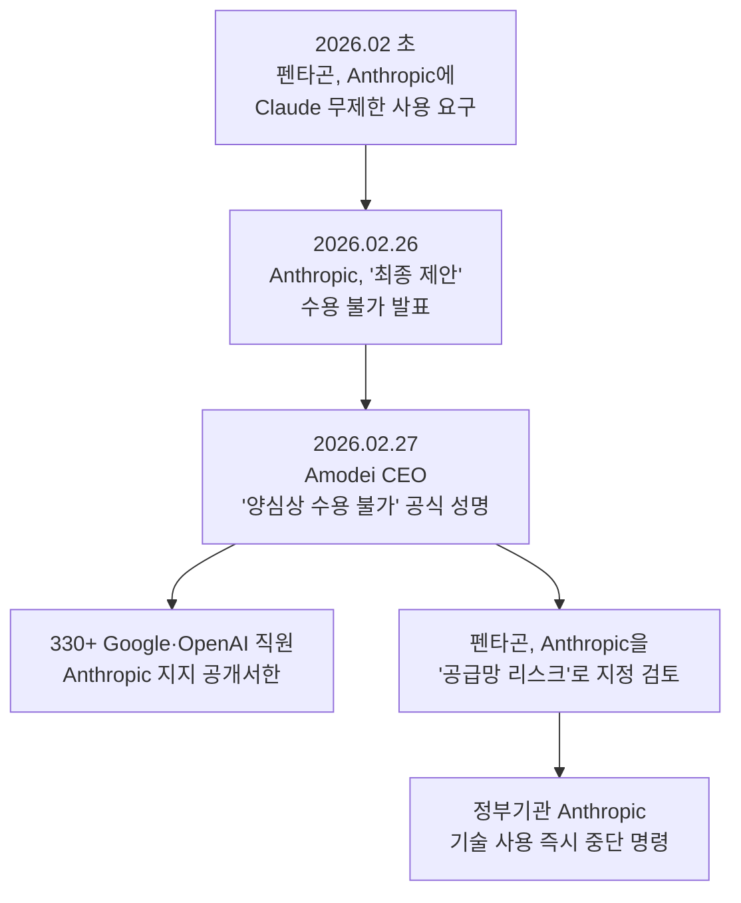
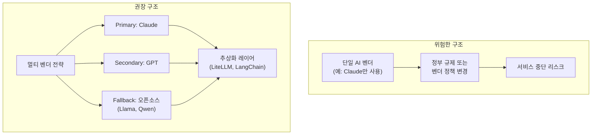
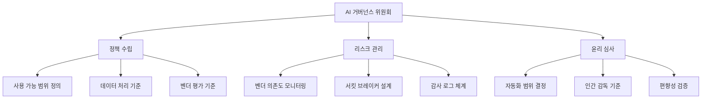
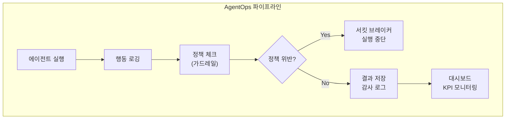

## 개요

2026년 2월 27일, 테크 업계를 뒤흔든 사건이 발생했습니다. Anthropic CEO Dario Amodei가 미국 국방부(펜타곤)의 Claude AI 무제한 군사 사용 요구를 공식 거부한 것입니다. 이 사건은 단순한 기업-정부 간 분쟁이 아닙니다. <strong>AI를 도입한 모든 조직의 CTO와 VPoE가 반드시 직면하게 될 "AI 거버넌스"라는 새로운 과제</strong>를 선명하게 드러낸 사건입니다.

이 포스트에서는 사태의 핵심을 분석하고, 기술 리더가 AI 벤더 전략과 거버넌스 프레임워크를 어떻게 수립해야 하는지 실전 가이드를 제시합니다.

## 사건의 핵심: 무엇이 벌어졌는가

### 타임라인



### 쟁점 정리

펜타곤이 요구한 것은 크게 두 가지였습니다.

<strong>1. 미국 시민 대상 대량 감시(Mass Surveillance)</strong>에 Claude를 제한 없이 사용할 권한

<strong>2. 인간 개입 없는 완전 자율 무기(Fully Autonomous Weapons)</strong>에 Claude를 통합할 권한

Anthropic은 이 두 가지를 "넘을 수 없는 선"으로 규정하고 거부했습니다. Amodei CEO는 공식 성명에서 이렇게 밝혔습니다:

> 이 두 사안에 대해서는 양심상 수용할 수 없다.

### 업계의 반응

주목할 점은 Google과 OpenAI 직원 330명 이상이 Anthropic을 공개 지지했다는 것입니다. Google DeepMind의 수석 과학자 Jeff Dean도 대량 감시에 반대 의사를 표명했습니다. 이는 AI 업계 전체가 "AI의 군사적 사용"에 대한 윤리적 기준선을 형성하고 있음을 보여줍니다.

## CTO/VPoE가 이 사태에서 배워야 할 5가지

### 1. AI 벤더는 하루아침에 사용 불가능해질 수 있다

펜타곤은 Anthropic을 "공급망 리스크"로 지정하여, 국방 관련 기업(Boeing, Lockheed Martin 등)이 Anthropic 기술을 사용하지 못하도록 조치했습니다. 더 나아가 모든 정부기관의 Anthropic 기술 사용 중단을 명령했습니다.

<strong>시사점</strong>: 여러분의 조직이 특정 AI 벤더에 깊이 의존하고 있다면, 정치적·규제적 이유로 해당 벤더가 갑자기 사용 불가능해지는 시나리오를 반드시 대비해야 합니다.



### 2. AI 거버넌스는 선택이 아닌 필수가 되었다

Deloitte의 2026 Tech Trends 리포트에 따르면, 정식 AI 거버넌스 프레임워크를 갖춘 기업은 <strong>17%에 불과</strong>하지만, 이들 기업이 에이전트 배포 확장에 훨씬 높은 성공률을 보입니다.

<strong>CTO가 수립해야 할 AI 거버넌스 프레임워크</strong>:



### 3. "AI 벤더의 윤리적 입장"이 비즈니스 리스크가 된다

Anthropic의 사례는 AI 벤더의 윤리적 결정이 고객사의 비즈니스에 직접적인 영향을 미칠 수 있음을 보여줍니다. 반대로, 윤리적 기준이 낮은 벤더를 선택하면 평판 리스크가 발생합니다.

<strong>벤더 평가 시 확인해야 할 항목</strong>:

| 평가 항목 | 질문 | 중요도 |
|-----------|------|--------|
| 윤리 정책 | 벤더의 AI 사용 정책(Acceptable Use Policy)은 명확한가? | 높음 |
| 정부 관계 | 벤더가 정부 압력에 어떻게 대응하는가? | 높음 |
| 데이터 주권 | 데이터가 어느 국가 관할권에 저장되는가? | 높음 |
| 오픈소스 대안 | 벤더 차단 시 오픈소스로 전환 가능한가? | 중간 |
| SLA 보장 | 정치적 리스크에 대한 서비스 보장이 있는가? | 중간 |

### 4. 멀티 벤더 + 추상화 레이어는 생존 전략이다

2026년 현재, 기업이 AI 벤더를 선택할 때 고려해야 할 현실적인 아키텍처 전략입니다.

```typescript
// AI 벤더 추상화 레이어 예시
interface AIProvider {
  name: string;
  chat(messages: Message[]): Promise<Response>;
  isAvailable(): Promise<boolean>;
}

class AIGateway {
  private providers: AIProvider[];
  private primary: AIProvider;

  async chat(messages: Message[]): Promise<Response> {
    // Primary 벤더 시도
    if (await this.primary.isAvailable()) {
      return this.primary.chat(messages);
    }
    // Fallback 체인
    for (const provider of this.providers) {
      if (await provider.isAvailable()) {
        console.warn(
          `Primary unavailable, falling back to ${provider.name}`
        );
        return provider.chat(messages);
      }
    }
    throw new Error('All AI providers unavailable');
  }
}
```

<strong>핵심 원칙</strong>: 프롬프트와 도구 정의를 벤더 독립적으로 설계하고, API 호출 레이어만 교체 가능하게 만드세요. MCP(Model Context Protocol)와 같은 표준 프로토콜을 활용하면 벤더 전환 비용을 크게 줄일 수 있습니다.

### 5. AgentOps와 관찰 가능성(Observability)에 투자하라

Anthropic-펜타곤 사태가 보여주듯, AI 시스템의 "무엇을 하고 있는지"를 추적하는 능력은 기술적 요구사항을 넘어 <strong>법적·윤리적 필수 요건</strong>이 되고 있습니다.



<strong>최소한 구축해야 할 관찰 가능성 항목</strong>:

| 항목 | 설명 | 도구 예시 |
|------|------|----------|
| 실행 추적 | 에이전트가 어떤 도구를 어떤 순서로 사용했는지 | LangSmith, Braintrust |
| 비용 모니터링 | 토큰 사용량, API 호출 비용 | Helicone, OpenMeter |
| 정책 준수 | 가드레일 위반 감지 및 차단 | Guardrails AI, NeMo |
| 감사 로그 | 모든 입출력의 변경 불가능한 기록 | 자체 구축 또는 Langfuse |

## 실전 체크리스트: 월요일부터 시작할 수 있는 3가지

<strong>1단계: AI 벤더 의존도 감사 (1주)</strong>

현재 조직에서 사용 중인 AI 서비스를 목록화하고, 각 서비스가 중단되었을 때의 비즈니스 임팩트를 평가합니다.

<strong>2단계: 멀티 벤더 전환 계획 수립 (2〜4주)</strong>

Primary/Secondary/Fallback 구조를 설계하고, 추상화 레이어 도입을 검토합니다. LiteLLM이나 LangChain 같은 도구가 빠른 시작점이 됩니다.

<strong>3단계: AI 거버넌스 초안 작성 (1개월)</strong>

경영진과 함께 AI 사용 정책을 정의합니다. 최소한 "자동화 범위", "인간 감독 기준", "데이터 처리 원칙" 세 가지는 문서화해야 합니다.

## 결론

Anthropic vs 펜타곤 사태는 AI 기술이 순수한 기술적 도구를 넘어 <strong>정치적·윤리적·법적 복잡성</strong>을 내포하고 있음을 생생하게 보여주었습니다.

CTO/VPoE로서 우리가 할 일은 명확합니다:

1. 단일 벤더 의존을 탈피하고 멀티 벤더 전략을 수립할 것
2. AI 거버넌스 프레임워크를 조직 문화의 일부로 내재화할 것
3. 관찰 가능성과 감사 체계를 처음부터 설계할 것

AI가 비즈니스의 핵심이 된 2026년, <strong>"AI를 잘 쓰는 것"만큼 "AI를 안전하게 관리하는 것"</strong>이 기술 리더의 핵심 역량이 되었습니다.

## 참고 자료

- [Anthropic CEO refuses Pentagon demands - Fortune](https://fortune.com/2026/02/27/dario-amodei-says-he-cannot-in-good-conscience-bow-to-pentagons-demands-over-ai-use-in-military/)
- [Anthropic rejects Pentagon's final offer - Axios](https://www.axios.com/2026/02/26/anthropic-rejects-pentagon-ai-terms)
- [Google & OpenAI employees support Anthropic - TechCrunch](https://techcrunch.com/2026/02/27/employees-at-google-and-openai-support-anthropics-pentagon-stand-in-open-letter/)
- [Deloitte Agentic AI Strategy Report 2026](https://www.deloitte.com/us/en/insights/topics/technology-management/tech-trends/2026/agentic-ai-strategy.html)
- [Best Practices for AI Agent Implementations 2026](https://onereach.ai/blog/best-practices-for-ai-agent-implementations/)
