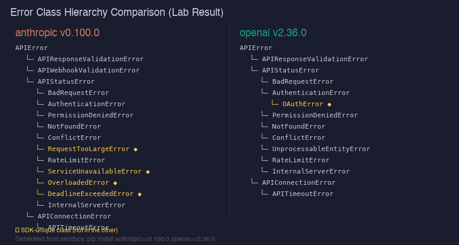

`pip install anthropic openai`를 실행하고 두 패키지를 나란히 뜯어본 게 이 글의 출발점이다. anthropic 0.100.0, openai 2.36.0 — 버전 번호부터 분위기가 다르다. Anthropic은 여전히 0.x대고, OpenAI는 이미 2.x를 달리고 있다. 숫자 자체보다, 그 뒤에 감춰진 설계 철학의 차이가 흥미롭다.

나는 두 SDK를 임시 샌드박스에서 설치하고, 타입 트리부터 에러 계층, 스트리밍 구현 코드까지 직접 확인했다. 이 글은 그 결과를 정리한 것이다.

## 첫인상: 버전 번호가 말해주는 것

anthropic 0.100.0 — 0.x대지만 100번째 마이너 릴리스라는 게 흥미롭다. 아직 1.0을 내지 않았다는 건 API 안정화를 신중하게 판단하고 있다는 뜻일 수 있다. openai 2.36.0은 이미 major version bump를 한 번 거쳤다.

두 SDK 모두 내부적으로 `httpx` 기반이고, `SSE(Server-Sent Events)` 방식으로 스트리밍을 처리한다. 최상위 클라이언트 초기화 파라미터를 비교해보면 철학의 차이가 보인다.

```python
# anthropic.Anthropic() 고유 파라미터
client = anthropic.Anthropic(
    api_key=None,        # 환경변수 ANTHROPIC_API_KEY 자동 감지
    auth_token=None,
    credentials=None,   # 엔터프라이즈 자격증명
    config=None,        # 프로파일 기반 설정
    profile=None,       # named profile
    webhook_key=None,
    _token_cache=NOT_GIVEN,  # 토큰 캐시
)

# openai.OpenAI() 고유 파라미터
client = openai.OpenAI(
    api_key=None,
    admin_api_key=None,       # 관리자 API 키
    workload_identity=None,   # IAM 기반 인증
    organization=None,        # 조직 ID
    project=None,             # 프로젝트 ID
    webhook_secret=None,
    websocket_base_url=None,  # Realtime API용
    _enforce_credentials=True,
)
```

Anthropic은 `credentials`, `config`, `profile` — 엔터프라이즈 환경에서 여러 계정을 구성 파일로 관리하는 패턴을 지원한다. OpenAI는 `organization`, `project`, `workload_identity` — 팀 단위 청구와 IAM 기반 인증에 초점을 맞췄다.

공통 파라미터는 `max_retries=2`, `timeout`, `default_headers`, `http_client` — 둘 다 같은 기본값을 쓴다.

한 가지 더 눈여겨볼 점은 Anthropic의 `_token_cache` 파라미터다. 이것은 OAuth나 임시 자격증명을 사용할 때 토큰 갱신 비용을 줄이기 위한 캐시다. OpenAI의 `workload_identity`는 GCP나 Azure에서 IAM 기반 신뢰 관계로 API 키 없이 인증하는 방식이다. 둘 다 대기업 환경을 위한 기능이지만, 지향하는 인프라 생태계가 다르다.

## 타입 시스템 비교: 408 vs 230

샌드박스에서 확인한 수치가 가장 놀라웠다.

```
anthropic.types 모듈 내 exported types: 408
openai.types 모듈 내 exported types: 230
```

차이가 크다. 이유는 Anthropic의 모델이 더 다양한 콘텐츠 블록 타입을 갖기 때문이다. Claude는 텍스트 외에 `ToolUseBlock`, `ThinkingBlock`, `CitationContentBlockLocation`, `BashCodeExecutionOutputBlock` 등을 응답 메시지로 반환할 수 있다. 각각에 대응하는 TypedDict param 타입이 따로 존재하기 때문에 타입 수가 더 많다.

반면 OpenAI는 `ChatCompletion`을 중심으로 하는 단순한 구조다. 응답 포맷이 더 일관적이라 타입 수가 적다. 이게 나쁜 게 아니다 — 단순성에는 이점이 있다.

Anthropic SDK만 있는 타입들:

| 타입 | 기능 |
|------|------|
| `ThinkingBlock` / `ThinkingConfigParam` | 확장 사고(Extended Thinking) |
| `CacheControlEphemeralParam` | 프롬프트 캐싱 (TTL: '5m' / '1h') |
| `CitationContentBlockLocation` | AI 응답 인용 위치 추적 |
| `BashCodeExecutionOutputBlock` | 코드 실행 도구 결과 |
| `MemoryTool20250818Param` | 에이전트 메모리 툴 |
| `ServerToolCaller20260120Param` | 서버사이드 툴 실행기 |
| `AnthropicBetaParam` | Beta 기능 헤더 제어 |

OpenAI SDK만 있는 것들:

| 기능 | 설명 |
|------|------|
| `AssistantEventHandler` | Assistants API 이벤트 스트리밍 |
| Realtime API | WebSocket 기반 실시간 스트리밍 |
| Fine-tuning types | `fine_tuning` 모듈 |
| `OAuthError` | `AuthenticationError`의 하위 타입 |

솔직히 Anthropic의 타입 수가 많은 건 Claude의 기능이 더 많아서이기도 하지만, API 설계가 더 복잡하다는 의미이기도 하다. 툴 결과 타입이 `BashCodeExecutionToolResultBlockParam`, `BashCodeExecutionToolResultErrorParam`처럼 세분화되면 자동완성은 정교해지지만 학습 곡선도 올라간다.

실용적인 시각에서 보면 이 차이가 생산성에 영향을 주는 시점은 IDE에서 타입 완성이 작동하기 시작할 때다. `ThinkingBlock`을 처리하는 코드를 쓸 때, VS Code가 `block.type == "thinking"`인 경우에만 `block.thinking`이 존재한다는 걸 컴파일 타임에 알려준다. OpenAI의 타입이 단순한 대신 런타임 에러가 더 늦게 잡힌다는 트레이드오프가 있다. 프로덕션 코드에서 응답 타입을 잘못 다루면 `None`이 내려오거나 조용히 오작동한다. 두 SDK 모두 TypeScript 사용자라면 타입 이점이 훨씬 크다 — Python의 런타임 타입 검사와 달리 빌드 시점에 잡힌다.

## 툴 호출 포맷: input_schema vs function.parameters

두 SDK의 가장 눈에 띄는 API 설계 차이가 여기다.

```python
# Anthropic: 툴 정의
anthropic_tool = {
    "name": "get_weather",
    "description": "현재 날씨를 가져온다",
    "input_schema": {              # 이것이 JSON Schema 루트
        "type": "object",
        "properties": {
            "location": {"type": "string"}
        },
        "required": ["location"]
    }
}

# OpenAI: 툴 정의
openai_tool = {
    "type": "function",            # 래퍼 레이어가 하나 더 있음
    "function": {
        "name": "get_weather",
        "description": "현재 날씨를 가져온다",
        "parameters": {            # function 안에 중첩
            "type": "object",
            "properties": {
                "location": {"type": "string"}
            },
            "required": ["location"]
        }
    }
}
```

결과를 반환할 때도 포맷이 다르다.

```python
# Anthropic: 툴 결과를 user 메시지의 content 블록으로 전달
messages.append({
    "role": "user",
    "content": [
        {
            "type": "tool_result",
            "tool_use_id": "toolu_01A...",   # Anthropic 고유 ID 형식
            "content": "15°C 맑음"
        }
    ]
})

# OpenAI: 툴 결과를 tool role 메시지로 전달
messages.append({
    "role": "tool",                          # 별도 role
    "tool_call_id": "call_abc123",
    "content": "15°C 맑음"
})
```

Anthropic은 모든 것을 `content` 블록의 배열로 통일했다. OpenAI는 tool을 별도 role로 처리한다. 어느 쪽이 더 낫다고 단정하기는 어렵지만, Anthropic의 방식이 메시지 구조를 더 일관적으로 유지한다는 느낌이 있다.

멀티 턴 에이전트 루프를 설계할 때 이 차이가 실질적으로 느껴진다. Anthropic에서는 모든 메시지가 `{"role": "user", "content": [...]}` 또는 `{"role": "assistant", "content": [...]}` 두 가지뿐이다. 컨텐츠 블록의 타입으로 일반 텍스트인지, 툴 호출인지, 툴 결과인지를 구분한다. OpenAI에서는 `role`이 `user`, `assistant`, `tool`, `system`, `function`(레거시) 등으로 늘어난다. 히스토리를 직렬화하거나 외부 스토리지에 저장할 때 schema가 더 복잡해진다. 이것은 설계 취향의 문제지만, 장기 메모리 시스템을 구현한다면 Anthropic의 단순한 role 체계가 더 관리하기 쉬울 수 있다.

## 에러 처리 아키텍처: 공통점과 결정적 차이

두 SDK의 에러 계층을 샌드박스에서 직접 출력해봤다.



```
# Anthropic 에러 계층 (0.100.0)
APIError
├─ APIResponseValidationError
├─ APIWebhookValidationError
├─ APIStatusError
│   ├─ BadRequestError
│   ├─ AuthenticationError
│   ├─ PermissionDeniedError
│   ├─ NotFoundError
│   ├─ ConflictError
│   ├─ RequestTooLargeError     ← Anthropic 고유
│   ├─ RateLimitError
│   ├─ ServiceUnavailableError  ← Anthropic 고유
│   ├─ OverloadedError          ← Anthropic 고유 (HTTP 529)
│   ├─ DeadlineExceededError    ← Anthropic 고유
│   └─ InternalServerError
└─ APIConnectionError
    └─ APITimeoutError

# OpenAI 에러 계층 (2.36.0)
APIError
├─ APIResponseValidationError
├─ APIStatusError
│   ├─ BadRequestError
│   ├─ AuthenticationError
│   │   └─ OAuthError           ← OpenAI 고유
│   ├─ PermissionDeniedError
│   ├─ NotFoundError
│   ├─ ConflictError
│   ├─ UnprocessableEntityError
│   ├─ RateLimitError
│   └─ InternalServerError
└─ APIConnectionError
    └─ APITimeoutError
```

Anthropic에만 있는 에러들이 흥미롭다. `OverloadedError`는 HTTP 529로, Claude 서버가 트래픽 과부하 상태일 때 반환된다. `DeadlineExceededError`는 타임아웃보다 더 구체적인 상황을 표현한다. `RequestTooLargeError`는 컨텍스트 길이 초과와는 별개로, 요청 자체의 크기가 너무 클 때다.

프로덕션 에러 핸들링을 짤 때 이 구분이 중요하다. `OverloadedError`는 백오프 재시도가 맞고, `DeadlineExceededError`는 재시도보다 타임아웃 설정을 늘리는 게 적절할 수 있다.

```python
import anthropic
from anthropic import (
    OverloadedError, RateLimitError, 
    DeadlineExceededError, APITimeoutError
)

def safe_call(client, **kwargs):
    try:
        return client.messages.create(**kwargs)
    except OverloadedError:
        # 서버 과부하 — exponential backoff
        time.sleep(10)
        return client.messages.create(**kwargs)
    except RateLimitError as e:
        # 요청 한도 초과 — Retry-After 헤더 확인
        wait = int(e.response.headers.get('retry-after', 60))
        time.sleep(wait)
        return client.messages.create(**kwargs)
    except DeadlineExceededError:
        # 처리 시간 초과 — 더 짧은 요청으로 나눠 재시도
        raise
```

두 SDK 모두 `max_retries=2`가 기본이고, 재시도 조건도 동일하다. 429(Rate Limit), 500대 서버 에러에서 자동 재시도한다. 재시도 간격은 exponential backoff로 구현되어 있고, `Retry-After` 헤더가 있으면 그 값을 우선 사용한다. 커스텀 재시도 로직이 필요하면 `max_retries=0`으로 자동 재시도를 끄고 직접 구현하는 게 낫다.

## 스트리밍 패턴: 코어는 같고 표면은 다르다

두 SDK의 스트리밍 코어 구현을 직접 소스에서 확인했다. `Stream` 클래스의 `__iter__` 구현이 거의 동일하다.

```python
# anthropic._streaming.Stream — 실제 소스
class Stream(Generic[_T], metaclass=_SyncStreamMeta):
    response: httpx.Response
    _decoder: SSEBytesDecoder

    def __iter__(self) -> Iterator[_T]:
        for item in self._iterator:
            yield item

    def _iter_events(self) -> Iterator[ServerSentEvent]:
        yield from self._decoder.iter_bytes(self.response.iter_bytes())

# openai._streaming.Stream — 실제 소스 (거의 동일)
class Stream(Generic[_T]):
    response: httpx.Response
    _decoder: SSEBytesDecoder

    def __iter__(self) -> Iterator[_T]:
        for item in self._iterator:
            yield item

    def _iter_events(self) -> Iterator[ServerSentEvent]:
        yield from self._decoder.iter_bytes(self.response.iter_bytes())
```

내부 구현이 동일에 가깝다. 차이는 메타클래스 유무 정도다 — Anthropic은 `_SyncStreamMeta`를 쓴다.

사용 인터페이스는 다르다.

```python
# Anthropic 스트리밍
with client.messages.stream(
    model="claude-opus-4-7",
    max_tokens=1024,
    messages=[{"role": "user", "content": "안녕?"}]
) as stream:
    for text in stream.text_stream:
        print(text, end="", flush=True)
    final = stream.get_final_message()

# OpenAI 스트리밍
with client.chat.completions.stream(
    model="gpt-5",
    messages=[{"role": "user", "content": "안녕?"}]
) as stream:
    for chunk in stream:
        delta = chunk.choices[0].delta
        if delta.content:
            print(delta.content, end="", flush=True)
    final = stream.get_final_completion()
```

Anthropic은 `stream.text_stream`으로 텍스트만 직접 추출할 수 있다. OpenAI는 `chunk.choices[0].delta.content`까지 직접 파고 들어가야 한다. 단순 텍스트 스트리밍이라면 Anthropic이 더 편하다.

[Vercel AI SDK로 Claude 스트리밍 에이전트를 구축](/ko/blog/ko/vercel-ai-sdk-claude-streaming-agent-2026)하는 방법도 이 스트리밍 패턴을 응용한 사례다.

비동기 스트리밍은 어떨까? 두 SDK 모두 `async with` 패턴을 지원한다. `async for text in stream.text_stream:` (Anthropic)과 `async for chunk in stream:` (OpenAI)처럼 사용 방식은 동기와 거의 같다. 다만 FastAPI나 Starlette 같은 비동기 웹 프레임워크에서 스트리밍 응답을 바로 전달할 때는, 두 SDK의 스트림 객체가 AsyncGenerator를 구현하므로 `StreamingResponse`에 직접 넘길 수 있다. 이 부분의 인터페이스는 둘이 거의 동일하다.

## Anthropic SDK만의 기능: 프롬프트 캐싱과 확장 사고

두 SDK를 비교하면서 가장 주목한 건 Anthropic의 고유 기능들이다.

**프롬프트 캐싱 (Prompt Caching)**

`CacheControlEphemeralParam`에 `ttl` 필드가 있다 — `'5m'` 또는 `'1h'`. 이건 내가 예상하지 못한 발견이었다. 기존에는 ephemeral 캐시 하나뿐이었는데, 이제 만료 시간을 지정할 수 있다.

```python
# 시스템 프롬프트를 1시간 캐시
client.messages.create(
    model="claude-opus-4-7",
    system=[
        {
            "type": "text",
            "text": "매우 긴 시스템 프롬프트... (수만 토큰)",
            "cache_control": {"type": "ephemeral", "ttl": "1h"}  # 1h 캐시
        }
    ],
    messages=[{"role": "user", "content": "요약해줘"}]
)
```

[Claude API Prompt Caching 실전 가이드](/ko/blog/ko/claude-api-prompt-caching-cost-optimization-guide)에서 이 기능을 활용해 비용을 70%까지 낮추는 패턴을 다룬다.

**확장 사고 (Extended Thinking)**

`ThinkingConfigParam`과 `ThinkingBlock` 타입이 SDK에 있다. OpenAI에는 없는 기능이다. Claude가 추론 과정을 단계별로 출력하는 것을 구조화된 타입으로 받을 수 있다.

```python
response = client.messages.create(
    model="claude-opus-4-7",
    max_tokens=16000,
    thinking={"type": "enabled", "budget_tokens": 10000},
    messages=[{"role": "user", "content": "복잡한 수학 문제"}]
)

for block in response.content:
    if block.type == "thinking":
        print("추론 과정:", block.thinking)
    elif block.type == "text":
        print("최종 답변:", block.text)
```

**인용 시스템 (Citations)**

`CitationContentBlockLocation`, `CitationPageLocationParam` 같은 타입이 있다. RAG 시스템에서 어떤 문서의 어느 부분을 참고했는지를 응답과 함께 받을 수 있다. 문서 기반 QA 시스템에서 유용하다. 예를 들어 법률 문서를 다루는 서비스에서 "이 주장은 계약서 3페이지 2항에서 근거함"이라는 인용 위치를 자동으로 추출해 UI에 보여줄 수 있다. 할루시네이션을 줄이고 신뢰성을 높이는 데 실질적으로 기여하는 기능이다.

## OpenAI SDK만의 기능: Assistants API와 Realtime

OpenAI도 Anthropic에 없는 것들을 가지고 있다.

**Assistants API**

`AssistantEventHandler`가 있다. 파일 검색, 코드 인터프리터, 커스텀 함수를 조합한 상태 유지형 에이전트를 만들 수 있다. Anthropic에는 이에 대응하는 공식 SDK 레벨 추상화가 없다.

**Realtime API**

`websocket_base_url` 파라미터가 OpenAI 클라이언트에 있는 게 이것 때문이다. WebSocket 기반의 실시간 양방향 통신을 SDK가 지원한다. 음성 에이전트나 인터랙티브 애플리케이션에 적합하다.

**OAuthError**

`AuthenticationError`의 하위 타입으로 `OAuthError`가 있다. OAuth 기반 인증 흐름을 사용하는 기업 환경에서 인증 에러를 더 세분화할 수 있다.

**Fine-tuning 내장 지원**

OpenAI SDK의 `fine_tuning` 모듈은 파인튜닝 작업을 SDK에서 직접 제어할 수 있다. Anthropic의 파인튜닝은 현재 별도 계약 채널을 통해 제공되어, SDK에 공식 인터페이스가 없다.

## 선택 기준: 프로젝트 유형별 가이드

두 SDK를 써본 결과, 단순히 "어느 게 더 낫다"는 결론을 내리기 어렵다. 프로젝트 특성에 따라 다르다.

**Anthropic SDK를 선택해야 할 때**

- 장문 컨텍스트(소설, 코드베이스, 법률 문서)를 반복 처리하는 시스템 → 프롬프트 캐싱으로 비용 절감
- 복잡한 추론이 필요하고 사고 과정을 추적해야 하는 경우 → Extended Thinking
- 문서 기반 QA에서 인용 출처를 자동으로 추적하고 싶을 때 → Citations
- 코드 실행 에이전트 → BashCodeExecution 타입 내장
- 타입 안전성을 최우선으로 두는 팀 → 408개 TypedDict 타입

**OpenAI SDK를 선택해야 할 때**

- 음성 인터페이스나 실시간 인터랙션이 필요한 경우 → Realtime API
- Assistants API의 파일 검색, 코드 인터프리터 조합이 필요한 경우
- 조직/프로젝트 단위의 청구 분리가 필요한 경우 → organization, project 파라미터
- 특정 도메인에 파인튜닝된 모델을 SDK에서 직접 관리해야 할 때

**둘 다 써야 하는 경우**

멀티모델 아키텍처를 운영한다면 두 SDK를 모두 쓸 수밖에 없다. 이때는 [PydanticAI](/ko/blog/ko/pydantic-ai-type-safe-agent-tutorial-2026)처럼 SDK를 추상화하는 레이어를 두는 게 관리가 편하다. 각 SDK를 직접 쓰면 툴 호출 포맷(`input_schema` vs `function.parameters`)부터 다르기 때문에 코드 분기가 늘어난다.

비교 요약:

| 항목 | Anthropic SDK 0.100.0 | OpenAI SDK 2.36.0 |
|------|----------------------|-------------------|
| 타입 수 | 408 | 230 |
| 에러 클래스 | 16개 (529 포함) | 13개 |
| 기본 최대 재시도 | 2 | 2 |
| 스트리밍 코어 | httpx + SSE | httpx + SSE |
| 프롬프트 캐싱 | ✓ (SDK 레벨) | ✗ |
| 확장 사고 | ✓ | ✗ |
| Realtime API | ✗ | ✓ |
| Assistants API | ✗ | ✓ |
| 파인튜닝 내장 | ✗ | ✓ |
| 인용 시스템 | ✓ | ✗ |
| 툴 결과 포맷 | content 블록 | tool role 메시지 |

## SDK 전쟁의 진짜 의미

두 SDK를 직접 비교하면서 든 생각은, 이게 단순한 API 래퍼 경쟁이 아니라는 것이다. SDK는 그 회사가 LLM으로 무엇을 하려고 하는지를 보여주는 인터페이스다.

Anthropic은 추론 품질, 비용 최적화, 엔터프라이즈 문서 처리에 무게를 두고 있다. SDK 타입 구조가 그걸 반영한다. OpenAI는 멀티모달 인터페이스, 실시간 통신, 파인튜닝 생태계로 확장하고 있다.

나는 현재 Claude 기반 프로젝트에는 Anthropic SDK를 쓰고, 음성이나 Assistants가 필요한 부분에서만 OpenAI를 사용한다. 멀티모델 설계를 할 때는 각 SDK를 직접 노출하지 않고 인터페이스 레이어로 감싼다.

중요한 건 SDK 선택 자체보다, 해당 모델이 내 워크로드에 적합한지를 먼저 판단하는 것이다. SDK는 그다음이다.

## 마이그레이션 시 주의할 점

프로젝트 중간에 한 SDK에서 다른 SDK로 전환하거나, 둘을 병행 사용하는 아키텍처로 이동할 때 실수가 잦은 지점을 정리해둔다.

**툴 포맷 변환**이 가장 흔한 함정이다. Anthropic의 `input_schema`를 OpenAI 포맷으로 변환할 때 `type: "function"` 래퍼를 빠뜨리거나, `parameters`를 `input_schema`로 바꾸는 걸 잊는 경우가 있다. 이 오류는 런타임에 API가 400을 반환할 때야 나타난다.

**스트리밍 컨텍스트 매니저** 사용법이 다르다. Anthropic은 `with client.messages.stream()` 블록 안에서만 스트림이 유효하다. 컨텍스트 바깥에서 `stream` 객체를 참조하면 이미 닫힌 스트림을 읽으려고 한다. OpenAI도 같은 패턴이지만, `.get_final_message()`와 `.get_final_completion()`처럼 메서드 이름이 다르다.

**에러 클래스 임포트 경로**가 다르다. `from anthropic import RateLimitError`는 작동하지만, OpenAI의 경우 `from openai import RateLimitError`도 작동한다. 그러나 `OverloadedError`는 Anthropic에만 있어서 OpenAI 응답을 처리하는 코드 경로에 두면 절대 잡히지 않는다.

**비동기 클라이언트**는 양쪽 다 `AsyncAnthropic`과 `AsyncOpenAI`가 있다. 인터페이스는 동일하지만, 동일 프로세스에서 두 비동기 클라이언트를 같은 이벤트 루프로 돌릴 때 httpx 연결 풀이 각각 별도로 생성된다. 수천 건의 동시 요청을 처리하는 경우, 연결 풀 크기를 `http_client` 파라미터로 직접 제어하는 게 낫다.

이 글의 비교는 anthropic 0.100.0과 openai 2.36.0 기준이다. 두 패키지 모두 빠르게 업데이트되므로, 실제 적용 전에 해당 버전의 릴리스 노트를 확인하는 걸 권장한다.

LLM API 가격까지 고려한 최종 결정을 내리고 싶다면, [LLM API 가격 비교 2026](/ko/blog/ko/llm-api-pricing-comparison-2026-gpt5-claude-gemini-deepseek)에서 토큰당 실제 비용을 확인해볼 수 있다. SDK 선택과 모델 선택을 묶어서 판단하는 게 결국 총비용 관점에서 더 현명한 접근이다. SDK 품질이 아무리 좋아도, 호출하는 모델의 성능과 가격이 맞지 않으면 전체 시스템이 최적화되지 않는다. 두 결정을 함께 고려하라.
