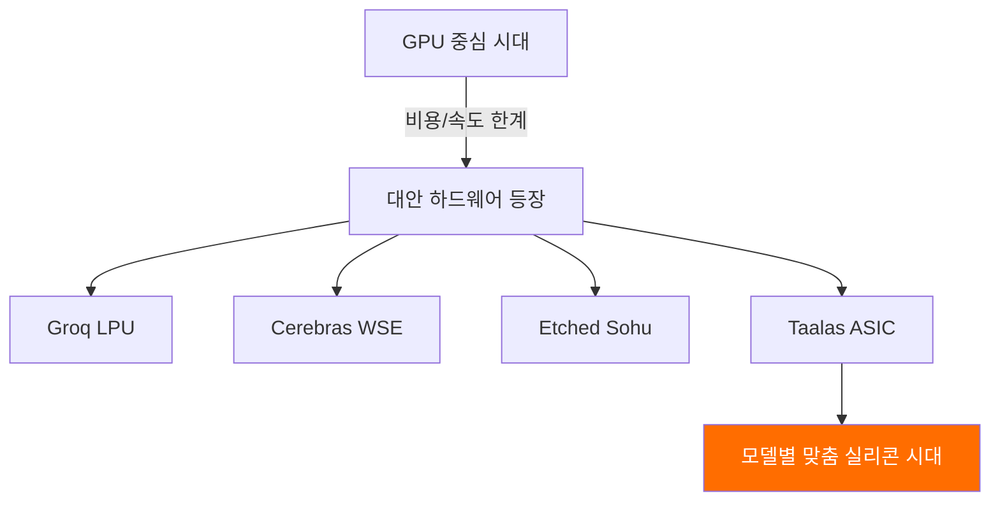

## 개요

AI 추론 비용과 속도는 GPU 하드웨어에 의존해왔습니다. 그런데 스타트업 <strong>Taalas</strong>가 ASIC 전용 칩으로 <strong>Llama 3.1 8B를 16,000 tok/s</strong>라는 놀라운 속도로 구동하며, 이를 무료로 공개했습니다. Reddit r/LocalLLaMA에서 77포인트, 70개 이상의 댓글로 큰 화제를 모았습니다.

GPU 없이 이 정도 속도가 가능하다는 것은 AI 추론 인프라의 패러다임 전환을 의미합니다.

## Taalas와 ASIC 추론 칩이란

### 기존 GPU 추론의 한계

현재 LLM 추론은 대부분 NVIDIA GPU(A100, H100 등)에 의존합니다. 이 접근법의 문제점은 명확합니다:

- <strong>높은 비용</strong>: H100 한 대 가격이 3만 달러 이상
- <strong>높은 전력 소비</strong>: GPU 클러스터는 수백 kW의 전력 소비
- <strong>복잡한 인프라</strong>: 액체 냉각, HBM 스택, 고속 I/O 등 필요
- <strong>범용 설계의 비효율</strong>: GPU는 그래픽 처리용으로 설계된 범용 칩

### Taalas의 접근법: 완전 특화

Taalas는 2.5년 전에 설립되어 <strong>모델별 맞춤 실리콘</strong>을 제작하는 플랫폼을 개발했습니다. 핵심 원칙 3가지:

1. <strong>완전 특화(Total Specialization)</strong>: 각 AI 모델에 최적화된 전용 실리콘 생산
2. <strong>스토리지-연산 통합</strong>: 메모리와 연산을 단일 칩에 DRAM 밀도로 통합
3. <strong>급진적 단순화</strong>: HBM, 고급 패키징, 3D 스택, 액체 냉각 불필요

모델을 받은 후 <strong>단 2개월</strong>만에 하드웨어로 구현할 수 있다고 합니다.

## 성능 비교: GPU vs ASIC

| 항목 | GPU (H100) | Taalas ASIC |
|------|-----------|-------------|
| Llama 3.1 8B 속도 | ~1,500-2,000 tok/s | <strong>16,000+ tok/s</strong> |
| 속도 배율 | 1x | <strong>~10x</strong> |
| 전력 효율 | 낮음 (700W/칩) | 높음 (대폭 절감) |
| 냉각 방식 | 액체 냉각 필요 | 공냉 가능 |
| 인프라 복잡도 | 높음 | 낮음 |

기존 GPU 대비 <strong>약 10배의 속도 향상</strong>을 달성하면서도, 인프라는 훨씬 단순해졌습니다.

## GPU 의존 탈피 트렌드

이 움직임은 Taalas만의 것이 아닙니다. AI 추론 하드웨어 시장에서 GPU 대안이 속속 등장하고 있습니다:

- <strong>Groq</strong>: LPU(Language Processing Unit)로 초고속 추론
- <strong>Cerebras</strong>: 웨이퍼 스케일 칩으로 대규모 모델 처리
- <strong>Etched</strong>: Transformer 전용 ASIC 개발
- <strong>Taalas</strong>: 모델별 맞춤 ASIC

Taalas CEO Ljubisa Bajic은 ENIAC에서 트랜지스터로의 전환을 비유하며, AI도 <strong>"쉽게 만들고, 빠르고, 저렴한"</strong> 방향으로 진화해야 한다고 강조합니다.

## 추론 비용 구조의 격변

### 현재 비용 구조

현재 LLM 추론 비용의 대부분은 하드웨어와 전력에서 발생합니다:

- GPU 하드웨어: 40-50%
- 전력 및 냉각: 20-30%
- 네트워크/스토리지: 10-15%
- 인건비/운영: 10-15%

### ASIC이 바꿀 비용 구조

ASIC 전용 칩이 보편화되면:

- <strong>하드웨어 비용 대폭 절감</strong>: HBM, 고급 패키징 불필요
- <strong>전력 비용 급감</strong>: 10배 이상 효율 개선
- <strong>인프라 단순화</strong>: 데이터센터 복잡도 감소
- <strong>tok당 비용 1/10 이하</strong>로 하락 가능

이는 현재 API 호출당 과금 방식의 가격 파괴를 의미합니다. 추론이 거의 무료에 가까워지면 AI 활용의 범위가 폭발적으로 확대됩니다.

## 한계와 주의점

물론 현재 단계에서 주의할 점도 있습니다:

- <strong>모델 한정</strong>: 현재 Llama 3.1 8B만 지원 (소규모 모델)
- <strong>유연성 부족</strong>: 모델이 바뀌면 새 칩이 필요
- <strong>양산 검증 미완</strong>: 대규모 상용화까지는 시간 필요
- <strong>대형 모델 미지원</strong>: 70B, 405B 등 대형 모델은 아직 로드맵 단계

Reddit 커뮤니티에서도 "8B는 너무 작다"는 의견과 "proof of concept으로는 충분하다"는 의견이 엇갈렸습니다.

## 실전 활용: 체험해보기

Taalas는 현재 무료로 두 가지를 제공합니다:

1. <strong>챗봇 데모</strong>: [ChatJimmy](https://chatjimmy.ai/)에서 16,000 tok/s의 속도를 직접 체험
2. <strong>추론 API</strong>: [API 신청 폼](https://taalas.com/api-request-form)에서 무료 액세스 신청 가능

Reddit 사용자들의 반응처럼, 속도 자체가 압도적인 경험이라고 합니다.

## 결론

Taalas의 ASIC 추론 칩은 AI 추론 하드웨어의 미래를 보여주는 중요한 이정표입니다. 현재는 8B 모델에 한정되지만, 이 기술이 대형 모델로 확장되면 <strong>GPU 의존적 AI 인프라 구조가 근본적으로 변할</strong> 수 있습니다.

핵심 포인트:

- GPU 대비 <strong>10배 이상의 추론 속도</strong>
- 전력·냉각·인프라 비용의 <strong>대폭 절감</strong>
- 모델별 맞춤 실리콘이라는 <strong>새로운 패러다임</strong>
- 추론 비용 구조의 <strong>근본적 변화</strong> 가능성

AI가 진정으로 유비쿼터스해지려면, 추론 인프라가 먼저 민주화되어야 합니다. ASIC 전용 칩은 그 길의 시작점입니다.

## 참고 자료

- [Taalas 공식 블로그: The Path to Ubiquitous AI](https://taalas.com/the-path-to-ubiquitous-ai/)
- [Reddit r/LocalLLaMA 토론](https://www.reddit.com/r/LocalLLaMA/comments/1r9e27i/free_asic_llama_31_8b_inference_at_16000_toks_no/)
- [ChatJimmy 챗봇 데모](https://chatjimmy.ai/)
