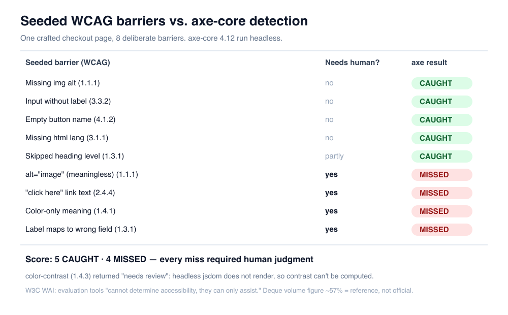

장벽 여덟 개를 일부러 심은 체크아웃 페이지를 만들었다. 그리고 axe-core로 돌렸다. 넷은 빨간불로 잡혔고, 넷은 조용히 통과했다. 통과한 넷은 전부 스크린 리더 사용자가 실제로 막히는 진짜 장벽이다. 도구는 그걸 문제라고 부르지 않았다.

이게 자동 접근성 검사의 진짜 모습이다. 도구가 나쁘다는 얘기가 아니다. axe-core는 훌륭하고, 나도 매일 쓴다. 문제는 초록불을 "접근성 통과"로 읽는 순간 생긴다. 접근성을 CI 한 줄로 끝내고 싶은 마음은 이해한다. 나도 그랬다. 그런데 그 한 줄이 검사하는 층과, 사용자가 실제로 부딪히는 층이 같지 않다는 걸 눈으로 봐야 감이 온다. 오늘은 그 초록불 뒤에 무엇이 남는지, 여덟 개를 심어 하나씩 확인한 로그를 그대로 펼친다.

## 기초: 자동 도구는 '규칙 위반'을 보고 '경험'은 못 본다

접근성 검사기가 하는 일은 근본적으로 하나다. DOM을 훑으면서 기계가 판정할 수 있는 규칙에 걸리는 노드를 찾는다. ``에 `alt` 속성이 있나 없나, `<button>`에 접근 가능한 이름이 붙어 있나, `<html>`에 `lang`이 있나. 이런 건 참/거짓이 명확하다. 속성이 없으면 위반이다. 코드로 판정 끝.

그런데 WCAG 성공 기준의 상당수는 참/거짓으로 안 갈린다. `alt` 속성이 **있는지**는 기계가 보지만, 그 alt가 이미지의 의미를 제대로 담았는지는 못 본다. 링크에 텍스트가 **있는지**는 보지만, "여기를 클릭"이 목적지를 설명하는지는 판단 못 한다. 이건 규칙 위반이 아니라 의미의 문제다. 사람이 화면과 맥락을 읽어야 답이 나온다.

그래서 접근성은 두 층으로 나뉜다. 아래층은 기계가 훑을 수 있는 규칙형 위반. 위층은 사람이 판단해야 하는 경험형 장벽. 자동 도구는 아래층을 아주 잘, 아주 빠르게 훑는다. 위층은 손도 못 댄다. 문제는 두 층 다 똑같이 스크린 리더 사용자를 막는다는 점이다. 사용자 입장에선 "기계가 잡을 수 있었냐"가 중요하지 않다.

숫자로 감을 잡자면 이렇다. WCAG 2.2에는 성공 기준이 여러 층위로 걸쳐 있는데, 그중 완전히 자동으로 참/거짓을 가릴 수 있는 항목은 일부에 불과하다. 나머지는 자동 도구가 "여기 의심스럽다"까지만 짚고 최종 판정은 사람에게 넘기거나, 아예 손도 못 댄다. 어느 항목이 어느 쪽인지는 도구마다 조금씩 다르지만, "자동만으로 WCAG 전체를 검증한다"는 건 어떤 도구로도 성립하지 않는다. 이건 도구의 성능 문제가 아니라 기준 자체의 성격 문제다.

이 구분을 머리로만 알면 잊어버린다. 그래서 직접 심어봤다.

## 여덟 개의 장벽을 심은 체크아웃 페이지

repo 밖 임시 샌드박스에 `page.html` 하나를 만들었다. 흔한 체크아웃 폼이다. 여기에 장벽 여덟 개를 의도적으로 넣었다. 넷은 규칙형(기계가 잡아야 정상), 넷은 경험형(사람만 잡을 수 있음)으로 골랐다.

```html
<!DOCTYPE html>
<html>
<head><meta charset="utf-8"><title>Checkout</title></head>
<body>
  <h1>Checkout</h1>

  <!-- #1 규칙형: alt 없는 이미지 -->
  

  <!-- #2 규칙형: 라벨 없는 입력 -->
  <input type="email" name="email">

  <!-- #3 규칙형: 이름 없는 빈 버튼 -->
  <button></button>

  <!-- #4 경험형: alt는 있으나 의미가 없음 -->
  

  <!-- #5 경험형: 목적지를 설명 못 하는 링크 -->
  <p>환불 정책은 <a href="/refund">여기를 클릭</a>하세요.</p>

  <!-- #6 경험형: 색으로만 의미 전달 -->
  <p><span style="color:red">빨간색</span> 항목은 필수입니다.</p>

  <!-- #7 경험형: 라벨이 엉뚱한 필드를 가리킴 -->
  <label for="zip">카드 번호</label>
  <input id="zip" name="postal" type="text">

  <!-- #8 규칙형: 헤딩 레벨 건너뜀 h1 -> h3 -->
  <h3>배송</h3>
</body>
</html>
```

`html`에 `lang`을 안 붙인 것도 눈치챘을지 모르겠다. 그건 내가 심은 게 아니라 실수로 빠뜨린 거다. 뒤에서 axe가 이걸 잡아내는데, 오히려 도구가 제 값을 한다는 증거로 남겨뒀다.

검사는 axe-core 4.12.1을 jsdom 위에서 헤드리스로 돌렸다. 브라우저를 띄우지 않은 이유는 이 실험의 초점이 "환경 차이"가 아니라 "규칙으로 판정 가능한가"에 있기 때문이다. 환경 차이(브라우저 대 jsdom)가 궁금하면 [axe-core를 CI에 넣으면 color-contrast만 조용히 사라지는 이유](/ko/blog/ko/axe-core-ci-a11y-jsdom-vs-browser-2026)에서 그 부분만 따로 실측했다.

```javascript
import { JSDOM } from 'jsdom';
import fs from 'fs';
import axeSource from 'axe-core';

const html = fs.readFileSync('page.html', 'utf8');
const dom = new JSDOM(html, { pretendToBeVisual: true });
const { window } = dom;
window.eval(axeSource.source);           // axe를 jsdom 창에 주입
const results = await window.axe.run(window.document, {
  resultTypes: ['violations', 'incomplete'],
});
```

## axe-core가 잡은 것

실행 결과의 violations부터 보자. 노이즈(landmark/region 계열)를 걷어내고 실제 심은 장벽에 해당하는 것만 추리면 이렇다.

```text
[image-alt]     impact=critical  img[src$="logo.png"]  Images must have alternative text
[label]         impact=critical  input[type="email"]   Form elements must have labels
[button-name]   impact=critical  button                Buttons must have discernible text
[html-has-lang] impact=serious   html                  <html> element must have a lang attribute
[heading-order] impact=moderate  h3                     Heading levels should only increase by one
```

깔끔하다. 심은 규칙형 넷(#1 alt 없음, #2 라벨 없음, #3 빈 버튼, #8 헤딩 건너뜀)을 정확히 잡았고, 내가 실수로 빠뜨린 `lang`까지 덤으로 물었다. 이게 자동 도구의 진짜 가치다. 사람이 리뷰에서 놓치기 쉬운 기계적 누락을, 커밋 몇 초 만에 빠짐없이 훑는다. 나는 이 층을 손으로 검사하는 걸 시간 낭비라고 본다. 그건 도구가 압도적으로 잘한다.

한 가지 정직하게 덧붙이면, 실제 출력엔 이 다섯 줄만 있던 게 아니다. `region`(모든 콘텐츠가 랜드마크 안에 있어야 함) 위반이 노드마다 하나씩, 열 줄 넘게 딸려 나왔다. 이건 진짜 문제라기보단 "이 페이지엔 `<main>` 같은 랜드마크가 없다"는 구조 신호에 가깝다. 자동 도구를 처음 붙이면 이런 저심각도 항목이 리포트를 채워서, 정작 critical 위반이 묻히기 쉽다. 그래서 나는 결과를 impact로 정렬하고 best-practice 계열을 따로 빼서 본다. 도구가 뱉는 걸 다 고쳐야 할 목록으로 받으면 오히려 지친다. 무엇을 먼저 볼지 고르는 것도 사람 몫이다.

여기까지만 보면 페이지는 "위반 다섯 개, 고치면 초록불" 상태다. 그 다섯 개를 다 고쳤다고 상상해보자. alt 채우고, 라벨 붙이고, 버튼에 텍스트 넣고, lang 달고, 헤딩 정리하고. axe는 이제 통과를 선언한다. 그런데 그 페이지, 여전히 부서져 있다.

## axe-core가 못 잡은 네 가지

심은 경험형 넷(#4~#7)에 대해 axe는 **단 한 건의 위반도, 단 한 건의 '검토 필요'도** 내지 않았다. 완전한 침묵이다. 하나씩 보자.

**#4 · `alt="image"`.** axe는 `alt` 속성의 존재만 확인한다. 값이 "image"든 "asdf"든, 비어 있지 않으면 통과다. 그런데 분기 실적 차트에 "image"라고 읽어주면 스크린 리더 사용자는 아무 정보도 못 얻는다. 오히려 alt가 아예 없느니만 못하다. 빈 alt는 "장식 이미지"라는 신호라도 되지만, "image"는 진짜 정보를 가짜 정보로 덮는다. WCAG 1.1.1은 "동등한 대체 텍스트"를 요구하는데, 동등한지는 기계가 판정 못 한다.

**#5 · "여기를 클릭".** 링크에 텍스트가 있으니 `link-name` 규칙은 통과다. 하지만 스크린 리더 사용자는 링크만 목록으로 훑어 페이지를 탐색하는 경우가 많다. "여기를 클릭" "여기를 클릭" "여기를 클릭"이 줄줄이 뜨면 어디로 가는 링크인지 알 방법이 없다. WCAG 2.4.4는 링크 목적이 링크 텍스트만으로(또는 맥락으로) 파악되기를 요구한다. 맥락을 읽는 건 사람 몫이다.

**#6 · 색으로만 전달.** "빨간색 항목은 필수입니다"는 색을 못 보는 사용자에게 무의미하다. 색맹 사용자, 스크린 리더 사용자 모두 "필수"라는 정보를 놓친다. WCAG 1.4.1이 정확히 이걸 금지한다. 그런데 axe는 그 문장이 색에만 의존하는지 판단할 수 없다. `color:red`라는 스타일은 보이지만, 그 색이 유일한 정보 전달 수단인지는 문맥의 문제다.

**#7 · 라벨이 엉뚱한 필드를 가리킴.** 이게 제일 음흉하다. `<label for="zip">카드 번호</label>`가 `id="zip"`인 입력과 정상적으로 연결돼 있다. 연결 자체는 완벽해서 `label` 규칙은 통과한다. 문제는 그 입력의 `name`이 `postal`이라는 것. 라벨은 "카드 번호"라 읽어주는데 실제로는 우편번호 필드다. 스크린 리더 사용자는 카드 번호를 입력하라는 안내를 듣고 엉뚱한 칸을 채운다. 연결의 **존재**는 기계가 보지만, 연결의 **정확성**은 못 본다.

네 개의 공통점이 보이나. 전부 "속성이나 요소는 자리에 있는데, 그 내용이 틀렸다"는 유형이다. 자동 도구는 구조를 검사하지 의미를 검사하지 않는다. 그리고 실무에서 진짜 사용자를 막는 장벽의 상당수가 바로 이 의미의 층에 있다. 나는 이게 자동 접근성 도구를 둘러싼 가장 큰 오해라고 본다. 초록불은 "규칙 위반이 없다"는 뜻이지 "접근 가능하다"는 뜻이 아니다. 접근 가능한 이름이 대표적이다. `aria-label`을 붙여 axe는 통과시켜도, 그 이름이 화면 글자와 어긋나면 음성 제어도 AI 에이전트도 버튼을 못 누른다. 이 층은 [접근성 이름이 틀리면 음성 제어도 AI 에이전트도 버튼을 못 누른다](/ko/blog/ko/accessible-name-agents-2026)에서 따로 실측해뒀다. 모달도 같은 함정을 판다. `aria-modal="true"` 하나로 초록불은 켜지지만, [실제로 포커스가 모달 밖으로 빠져나가는지 재보면](/ko/blog/ko/modal-focus-escape-inert-measure-2026) 아무것도 막고 있지 않다.

구체적으로 그려보면 감이 온다. 이 페이지를 스크린 리더로 위에서 아래로 읽으면 대략 이렇게 들린다. "Checkout, 제목 수준 1. 이미지. 편집, 이메일. 버튼. 이미지, image. 환불 정책은 링크, 여기를 클릭, 하세요. 빨간색 항목은 필수입니다. 카드 번호, 편집." alt를 채우고 라벨을 붙여 axe를 초록불로 만든 뒤에도, 사용자가 듣는 문장은 여전히 "이미지 image", "링크 여기를 클릭", "카드 번호"라 안내하는 우편번호 칸이다. 도구의 통과와 사용자의 경험 사이에 이만큼 틈이 벌어진다.

### 왜 팀은 초록불을 오해하는가

이 오해가 생기는 건 대개 악의가 아니라 프로세스 때문이다. 접근성이 스프린트 막바지에 "axe 통과" 한 줄짜리 완료 조건으로 들어오면, 통과 = 완료로 굳는다. 리포트에 위반 0으로 찍히면 아무도 그 뒤를 안 본다. 숫자가 주는 안도감이 워낙 강하다. 나도 초록불 스크린샷을 PR에 붙이고 넘어간 적이 있다. 그게 규칙형 층만 봤다는 걸 인정하기까지 시간이 걸렸다.

여기에 도구 벤더의 마케팅도 한몫한다. "자동으로 접근성을 보장한다"는 문구는 팔기엔 좋지만 사실이 아니다. 표준 기관이 공식으로 부정하는 주장이다(뒤에서 인용한다). 자동화가 할 수 있는 일과 할 수 없는 일을 정확히 구분하는 것 자체가 실무 역량이라고 본다. 도구를 안 쓰는 것도, 도구만 믿는 것도 둘 다 틀렸다.



## color-contrast는 왜 '판단 보류'로 빠졌나

violations 말고 incomplete(검토 필요) 목록도 나왔다. 그중 하나가 `color-contrast`다.

```text
--- INCOMPLETE / needs review ---
[color-contrast]      h1    Elements must meet minimum color contrast ratio thresholds
[page-has-heading-one] html  Page should contain a level-one heading
```

색 대비는 원래 axe가 자동으로 잡는 대표 항목이다. 그런데 여기선 위반이 아니라 "검토 필요"로 빠졌다. 이유는 단순하다. jsdom은 화면을 실제로 그리지 않는다. 대비를 계산하려면 렌더링된 픽셀의 실제 전경색과 배경색이 필요한데, 렌더링이 없으니 계산할 수가 없다. 그래서 axe는 "판정 불가, 사람이 봐라"로 넘긴다.

이건 앞의 경험형 미검출과는 성격이 다르다. 경험형 넷은 브라우저를 띄워도 영원히 못 잡는다. 색 대비는 진짜 브라우저에서 돌리면 자동으로 잡힌다. 헷갈리기 쉬운 지점이 여기다. 같은 "못 잡음"처럼 보여도, 하나는 환경을 바꾸면 해결되고 하나는 절대 안 된다. 이 둘을 섞어 생각하면 "브라우저에서 돌리니까 이제 다 잡히겠지"라는 또 다른 초록불 오해로 이어진다. 그래서 CI 파이프라인을 짤 때 이 구분이 중요해진다. 그 설계는 [color-contrast가 CI에서 조용히 사라지는 이유](/ko/blog/ko/axe-core-ci-a11y-jsdom-vs-browser-2026)에 따로 정리해뒀으니 여기선 반복하지 않겠다. 핵심만: "검토 필요"를 빈 줄로 취급하면 실제 커버리지에 구멍이 생긴다.

## W3C가 공식으로 말하는 것과 '57%'라는 참고값

이건 내 개인 의견이 아니다. W3C WAI가 공식 문서에서 못 박는다. 접근성 평가 도구 선정 가이드는 이렇게 적는다. 평가 도구는 "접근성을 판정할 수 없으며, 판정을 도울 수만 있다(cannot determine accessibility, they can only assist in doing so)". 그리고 사이트가 접근 가능한지 결정하려면 "지식을 갖춘 사람의 평가가 필요하다"고 명시한다. 어떤 도구도 단독으로 준수 여부를 판정하지 못한다는 게 표준 기관의 공식 입장이다.

수치 하나가 자주 인용된다. 자동 도구가 접근성 문제의 약 57%를 잡는다는 Deque의 조사다. 여기엔 조건이 붙는다. 이 57%는 **문제 건수 기준(by volume)**이다. alt 누락이나 색 대비처럼 빈도가 높은 문제가 감사 건수를 지배하는데, 이게 바로 자동 도구가 잘 잡는 항목이다. 그래서 건수로 세면 숫자가 커진다. 측정 방식을 바꾸면 30% 근처로 내려가기도 한다. 이 수치는 참고값이지 공식 기준이 아니다. 나는 이 57%를 인용할 때마다 "무엇의 57%인가"를 반드시 같이 말해야 한다고 본다. WCAG 성공 기준의 57%가 아니라, 흔한 문제 건수의 57%다. 성공 기준 커버리지로 따지면 자동으로 완전 검증 가능한 항목은 그보다 훨씬 적다.

정직하게 한계를 하나 더 붙이자. 내 실험은 페이지 한 장, 장벽 여덟 개짜리 예시다. 벤치마크가 아니라 원리를 보여주는 재현이다. "4개 잡고 4개 놓쳤으니 자동화는 50%"라고 일반화하면 그것도 틀린 얘기다. 비율은 어떤 장벽을 심느냐에 따라 얼마든 달라진다. 이 실험이 말하는 건 비율이 아니라 **종류**다. 못 잡는 것들은 우연히 못 잡는 게 아니라, 구조적으로 못 잡는다.

## 자동 초록불 뒤에 돌려야 할 수동 리뷰 체크리스트

그래서 뭘 해야 하나. 자동 도구는 계속 쓴다. CI에 넣고, 커밋마다 돌린다. 그건 아래층을 지키는 가장 싼 방법이다. 대신 초록불이 뜬 뒤에 사람이 위층을 훑는다. 매번 전체 감사를 할 순 없으니, 자동화가 구조적으로 못 보는 항목만 추린 체크리스트를 리뷰에 붙인다.

- **이미지 alt의 품질**: alt가 "있는지"가 아니라 이미지의 의미를 대체하는지 읽는다. 정보성 이미지(차트, 다이어그램)는 데이터를, 장식 이미지는 빈 alt를. "image", "photo", 파일명은 전부 실패로 본다.
- **링크·버튼 텍스트를 맥락에서 분리**: 링크 텍스트만 목록으로 뽑아 읽어본다. "여기", "클릭", "더 보기"만으로 목적지를 알 수 없으면 고친다. 스크린 리더의 링크 목록 탐색을 흉내 내는 것이다.
- **색·모양에만 기댄 정보**: "빨간 항목", "초록 배지", "위 그래프"처럼 색이나 위치로만 의미를 주는 문장을 찾는다. 색을 텍스트나 아이콘 라벨로 이중화한다.
- **라벨과 필드의 실제 대응**: 라벨이 연결됐는지가 아니라, 라벨이 말하는 것과 필드가 받는 것이 같은지 확인한다. 자동 채움(autocomplete) 속성과 `name`이 라벨과 어긋나지 않는지 본다.
- **읽기 순서와 헤딩의 의미**: 헤딩이 시각적 크기 조절용으로 쓰이지 않았는지, 탭 순서가 논리적 흐름을 따르는지 본다. 이건 기계가 구조는 봐도 의도는 못 본다.
- **키보드만으로 전체 흐름**: 마우스를 치우고 탭·엔터·화살표만으로 폼을 끝까지 제출해본다. 5분이면 자동 도구가 못 잡는 포커스 함정 대부분이 드러난다. 포커스가 어디 있는지 눈에 안 보이거나, 모달을 열었는데 탭이 뒤 페이지로 새거나, 순서가 시각적 배치와 어긋나는 문제는 이 5분에 거의 다 걸린다.

이 여섯 줄을 PR 템플릿에 넣어두면, 자동 검사가 초록불을 줘도 사람이 위층을 한 번은 훑고 지나가게 된다. 완벽하진 않다. 하지만 "초록불 = 접근성 통과"라는 가장 비싼 오해는 막는다.

체크리스트를 다 자동화하려는 유혹도 생길 것이다. 실제로 요즘은 LLM에게 "이 alt가 적절한가" 묻는 도구도 나온다. 방향은 흥미롭지만, 나는 아직 이걸 게이트로 신뢰하진 않는다. LLM은 "빨간색 항목은 필수"가 색에만 의존하는지 그럴듯하게 답하지만, 그 판단이 페이지 전체 맥락과 디자인 의도를 반영했다는 보장이 없다. 보조 도구로는 쓸 만하고, 사람의 마지막 판단을 대체하는 용도로는 이르다. 위층을 또 다른 자동화로 덮으려다 오탐과 미탐을 새로 들이는 셈이 될 수 있다. 여기서도 규칙은 같다. 자동화가 무엇을 못 보는지 정확히 알고 쓰는 것.

접근성은 도구가 대신 판정해주는 체크박스가 아니라, 코드와 콘텐츠가 실제 사용자에게 어떻게 도착하는지의 문제다. 기존 사이트의 접근성이 자동 초록불 뒤에서 실제로 어디까지 막혀 있는지 점검하거나, 규칙형과 경험형을 나눠 검증하는 파이프라인을 세우고 싶다면, 개인적으로 상담과 구현 의뢰를 받는다. 프로필의 문의 경로로 연락하면 된다.

---

*출처: [W3C WAI: Selecting Web Accessibility Evaluation Tools](https://www.w3.org/WAI/test-evaluate/tools/selecting/) (공식). 자동 검출 비율 약 57%는 [Deque](https://www.deque.com/blog/automated-testing-study-identifies-57-percent-of-digital-accessibility-issues/)의 건수 기준 조사로 참고값이며 공식 기준이 아님. 실행 환경: axe-core 4.12.1 · jsdom · 헤드리스.*
