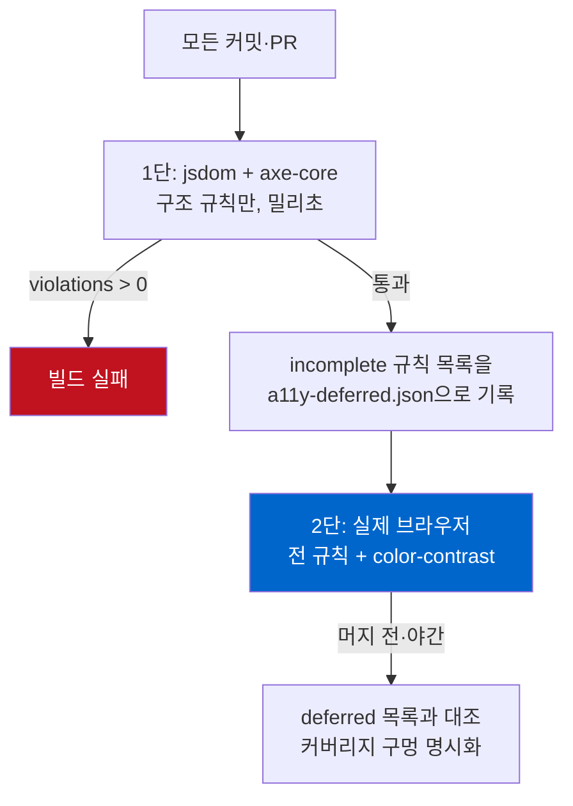

같은 HTML 한 장을 axe-core로 두 번 돌렸는데 판정이 달랐다. 한쪽은 `color-contrast`를 `incomplete`라고 하고, 다른 쪽은 `2.4:1`이라며 명백한 위반으로 잡았다. 마크업은 한 글자도 안 바꿨다. 바뀐 건 실행 환경 하나뿐이었다.

이게 사소한 디테일 같지만, 접근성 검사를 CI에 넣는 팀이 가장 자주 밟는 지뢰다. `axe-core`를 Jest나 Vitest에 붙이면 브라우저 없이 유닛 테스트 속도로 접근성을 검사할 수 있다. 매력적이다. 문제는 그 편리함의 대가로 특정 규칙이 커버리지에서 **조용히 빠진다**는 점이고, 대부분은 그 사실을 모른 채 초록불을 신뢰한다. 오늘 샌드박스에서 이걸 재현하고, 왜 그런지 파고들고, 파이프라인을 어떻게 짜야 구멍이 안 생기는지까지 정리했다.

## AI가 뽑아준 컴포넌트에서 반복되는 위반 네 가지

요즘 컴포넌트를 생성 도구로 뽑는 경우가 많다. 나도 그렇다. 그런데 생성된 마크업을 접근성 관점에서 뜯어보면 비슷한 자리에서 계속 같은 실수가 나온다. 아이콘만 든 버튼, alt 없는 이미지, 텍스트 없는 링크, `lang` 빠진 문서. 화면에는 멀쩡히 보이니 사람 눈으로는 안 걸린다.

실험용으로 "예약 위젯"을 하나 만들었다. 딱 생성 도구가 뱉을 법한 모양이다.

```html
<!DOCTYPE html>
<html>
<head><title>Booking widget</title></head>
<body>
  <div class="card">
    <h3>Reserve a table</h3>
    
    <p class="muted">Popular near you. Book in seconds.</p>

    <input type="text" placeholder="Your name">
    <input type="email" placeholder="Email">

    <button class="icon-btn">
      <svg viewBox="0 0 24 24"><path d="M12 2v20M2 12h20" stroke="black"/></svg>
    </button>
    <a href="/help">
      <svg viewBox="0 0 24 24"><circle cx="12" cy="12" r="10"/></svg>
    </a>
  </div>
</body>
</html>
```

눈으로 보면 입력창 두 개에 아이콘 버튼과 도움말 링크가 있는, 흔한 카드다. 스크린리더로 읽으면 전혀 다른 물건이 된다. 버튼은 "버튼"이라고만 읽히고 무슨 버튼인지 알 수 없다. 링크도 목적지가 없다. 입력창은 `placeholder`가 사라지는 순간(포커스가 들어오면) 무엇을 넣는 칸인지 단서가 없어진다. `placeholder`는 레이블이 아니다. 이건 취향 문제가 아니라 W3C가 정의한 위반이다.

## 브라우저 없이 axe-core 돌리기

먼저 CI 친화적인 쪽부터. `axe-core`와 `jsdom`만 있으면 브라우저를 띄우지 않고 Node 안에서 접근성 검사를 돌릴 수 있다. 유닛 테스트에 그대로 얹는 방식이다.

```javascript
import { readFileSync } from 'node:fs';
import { JSDOM } from 'jsdom';
import axe from 'axe-core';

async function auditFile(path) {
  const html = readFileSync(path, 'utf8');
  const dom = new JSDOM(html, { runScripts: 'dangerously', pretendToBeVisual: true });
  const { window } = dom;
  window.eval(axe.source); // axe를 이 window 안에 주입
  return window.axe.run(window.document, {
    resultTypes: ['violations', 'incomplete'],
    runOnly: { type: 'tag', values: ['wcag2a', 'wcag2aa', 'wcag21a', 'wcag21aa'] },
  });
}
```

핵심은 `window.eval(axe.source)`다. `axe-core` 패키지는 라이브러리 전체를 문자열로 담은 `axe.source`를 제공한다. 이걸 jsdom이 만든 `window`에 주입하면, 그 안에서 `axe.run()`을 진짜 브라우저처럼 부를 수 있다. `runOnly`로 WCAG 2.1 A/AA 태그만 걸었다. 실무에서 준수 목표로 삼는 기준선이다.

before 페이지를 이 코드로 돌린 실제 출력이다. 꾸미지 않았다.


```text
===== BEFORE (AI-generated markup) =====
violations: 4 | incomplete: 1 | passes: 7
  [critical] button-name (1)   — Buttons must have discernible text
  [serious]  html-has-lang (1) — <html> element must have a lang attribute
  [critical] image-alt (1)     — Images must have alternative text
  [serious]  link-name (1)     — Links must have discernible text
  incomplete:
     ~ color-contrast (1)      — Elements must meet minimum contrast ratio
```

구조적 위반 네 개가 정확히 잡혔다. `button-name`은 아이콘 버튼에 접근 가능한 이름이 없다는 것, `link-name`은 링크에 텍스트가 없다는 것, `image-alt`와 `html-has-lang`은 이름 그대로다. 여기까지는 브라우저가 전혀 필요 없었다. 마크업 구조만 보고 판정할 수 있는 규칙이기 때문이다. 이게 jsdom 방식의 진짜 값어치다. `git push`마다 몇 밀리초 만에 이런 회귀를 막을 수 있다.

위반을 고친 after 페이지도 같이 돌렸다. 아이콘 버튼엔 `aria-label`을, SVG엔 `aria-hidden="true"`를, 이미지엔 `alt`를, 입력창엔 진짜 `<label for>`를 붙였다.

```text
===== AFTER (fixed) =====
violations: 0 | incomplete: 1 | passes: 19
  incomplete:
     ~ color-contrast (1)      — Elements must meet minimum contrast ratio
```

위반 0, 통과 19. 깔끔하다. 그런데 `incomplete`에 남은 `color-contrast` 한 줄이 눈에 걸린다. before에서도, after에서도 이 규칙만은 판정이 안 났다. 여기가 함정이다.

## 왜 color-contrast만 incomplete로 빠지나

`incomplete`는 pass가 아니다. "위반이 없다"가 아니라 **"이 환경에서는 확인할 수 없다"**는 뜻이다. axe-core가 판정을 포기했다는 신호다.

이유는 jsdom의 근본 성격에 있다. jsdom은 DOM 트리를 만들지만 레이아웃과 렌더링은 하지 않는다. 어떤 요소가 화면 어디에 어떤 색으로 그려지는지, 그 뒤에 겹친 배경이 무엇인지를 계산하지 않는다. 그런데 색 대비 판정은 바로 그 "실제로 칠해진 전경색과 배경색"이 있어야 가능하다. axe-core의 대비 검사는 내부적으로 `document.createRange()`와 `getClientRects()`로 텍스트가 실제로 차지하는 영역을 잡는데, jsdom에는 이 API가 구현돼 있지 않다. Deque가 관리하는 axe-core 저장소의 [이슈 #595](https://github.com/dequelabs/axe-core/issues/595)에 이 한계가 그대로 기록돼 있고, 인기 있는 [jest-axe](https://github.com/nickcolley/jest-axe)는 이 문제 때문에 `color-contrast` 규칙을 아예 기본 비활성화한다.

정리하면 이렇다. jsdom에서 대비 검사는 "통과"하는 게 아니라 "존재하지 않는다". 그리고 axe-core를 처음 붙인 팀은 `incomplete`를 그냥 안 읽고 넘어가거나, `resultTypes`에서 아예 빼버리는 경우가 많다. 그 순간 WCAG에서 가장 흔하게 어기는 위반 중 하나인 색 대비가 테스트 커버리지에서 통째로 사라진다.

그래서 같은 before 페이지를 실제 브라우저 엔진(헤드리스 크로미엄)에서 다시 돌려봤다. 대비 규칙만 지정해서.

```javascript
// 실제 브라우저 페이지 컨텍스트 안에서 실행
const r = await window.axe.run(document, {
  runOnly: { type: 'rule', values: ['color-contrast'] }
});
```

결과는 명확한 위반이었다.

```json
{
  "id": "color-contrast",
  "impact": "serious",
  "message": "Element has insufficient color contrast of 2.4
              (foreground #a7a7a7, background #ffffff, 16px).
              Expected contrast ratio of 4.5:1"
}
```

`2.4:1`. W3C의 [WCAG 2.1 SC 1.4.3 Contrast (Minimum)](https://www.w3.org/WAI/WCAG21/Understanding/contrast-minimum.html)은 본문 텍스트에 최소 `4.5:1`(큰 텍스트는 `3:1`)을 요구한다. `#a7a7a7`의 연회색 안내문은 절반 수준이었다. jsdom이 "확인 불가"라고 넘긴 바로 그 요소를, 브라우저는 단칼에 잡아냈다. 고친 뒤 색을 `#595959`로 진하게 바꾸자 대비는 `7:1`을 넘겼고 브라우저에서도 위반 0이 됐다.

같은 axe-core, 같은 마크업, 다른 런타임. 판정이 갈린다. 렌더링 시점이 자동 도구의 시야를 결정하는 이 함정은 접근성에만 있는 게 아니다. [구조화 데이터를 서버에서 렌더링하느냐 클라이언트 JS로 주입하느냐](/ko/blog/ko/localbusiness-structured-data-server-side-vs-js-2026/)에 따라 크롤러가 스키마를 읽거나 통째로 놓치는 것도 정확히 같은 구조다. 이 그림 하나가 오늘 글의 전부다.

## 그래서 파이프라인을 2단으로 짠다

여기서 결론이 "그럼 jsdom은 쓰지 말고 항상 브라우저를 띄워라"가 되면 곤란하다. 브라우저 기동은 느리고, 유닛 테스트마다 크로미엄을 올리면 CI가 답답해진다. 나는 역할을 나누는 쪽을 택한다.

<strong>1단 — jsdom + axe-core (빠른 게이트).</strong> 모든 커밋, 모든 PR에서 유닛 테스트로 돈다. `button-name`·`image-alt`·`link-name`·`label`·`html-has-lang`처럼 마크업만으로 판정되는 구조적 위반을 여기서 막는다. 밀리초 단위라 부담이 없다. 컴포넌트 스냅샷 테스트 옆에 그냥 얹으면 된다.

<strong>2단 — 실제 브라우저 (전체 규칙).</strong> Playwright나 Puppeteer로 렌더링까지 한 뒤 `color-contrast`를 포함한 전 규칙을 돌린다. `@axe-core/playwright` 같은 어댑터를 쓰면 배선이 짧다. 이 단계는 무겁게 매 커밋마다 돌릴 필요 없이, 머지 전이나 야간 파이프라인에서 핵심 페이지만 골라 돌려도 된다.

두 단을 이을 때 반드시 넣어야 할 장치가 하나 있다. **1단에서 `incomplete`로 빠진 규칙 목록을 로그로 남기고, 2단이 그 규칙들을 실제로 커버하는지 대조하는 것**이다. 이렇게 하면 "jsdom이 판단 못 한 게 어떤 규칙인지"가 파이프라인에 명시적으로 드러난다. 안 그러면 `incomplete`는 아무도 안 보는 로그 줄로 남고, 커버리지 구멍은 계속 열려 있다.

간단한 게이트 로직은 이 정도면 충분하다.

```javascript
const results = await runAxeInJsdom(html);
if (results.violations.length > 0) {
  console.error('구조적 접근성 위반:', results.violations.map(v => v.id));
  process.exit(1); // 1단 게이트: 여기서 빌드 실패
}
// incomplete는 실패로 처리하지 않되, 2단이 커버해야 할 목록으로 넘긴다
const deferred = results.incomplete.map(v => v.id);
writeFileSync('a11y-deferred.json', JSON.stringify(deferred));
```

이 발상 자체는 새롭지 않다. 나는 [SEO 감사를 빌드 게이트로 상설화한 캠페인](/ko/blog/ko/multilingual-blog-technical-audit-campaign-2026/)에서 같은 원리를 썼다. 한 번 고친 걸 사람의 규율에 맡기지 않고 파이프라인에 고정하는 것. 접근성도 정확히 같다. 감사는 이벤트가 아니라 루프여야 한다.

2단 구조를 그림으로 정리하면 이렇다.



## 자동 도구가 초록불을 줘도 남는 것들

솔직히 말하면, 위 2단을 다 통과해도 그 페이지가 접근성을 지켰다는 보장은 없다. 이건 axe-core의 한계가 아니라 자동 검사 전체의 한계다.

axe-core가 못 잡는 대표적인 것들이 있다. 키보드만으로 모든 버튼과 링크에 도달하고 조작할 수 있는가. `Tab` 순서가 시각적 순서와 논리적으로 맞는가. 모달을 열었을 때 포커스가 그 안에 갇히고, 닫으면 원래 자리로 돌아오는가. 스크린리더로 처음부터 끝까지 읽었을 때 흐름이 말이 되는가. 이 중 어느 것도 마크업 정적 분석으로는 판정이 안 된다. 실제로 [Lighthouse로 접근성 100점을 만든 페이지](/ko/blog/ko/a11y-lighthouse-audit-fix-2026/)에서도, `div`에 `onclick`만 달아둔 가짜 버튼은 만점을 받고도 키보드로는 눌리지 않은 채 남아 있었다.

그래서 나는 자동 도구를 "천장"이 아니라 "바닥"으로 본다. axe-core가 잡는 위반은 사람이 굳이 시간 들여 확인할 필요가 없는, 반드시 0이어야 하는 하한선이다. 그 하한을 CI로 눌러두고 남는 시간을 키보드 워크스루와 스크린리더 통독에 쓰는 게 맞다. 도구가 다 해줄 거라 믿는 순간, 도구가 못 보는 절반이 그대로 프로덕션에 나간다.

## 오늘 바로 적용할 체크리스트

- `axe-core`를 유닛 테스트에 붙였다면 `resultTypes`에 `'incomplete'`를 반드시 포함하고, 그 목록을 실제로 읽어라. `color-contrast`가 거기 있다면 그건 통과가 아니라 미검사다.
- jsdom 단계는 구조 규칙(`button-name`, `image-alt`, `link-name`, `label`, `html-has-lang`) 전용으로 명확히 스코프하라. 대비·포커스 가시성처럼 렌더링이 필요한 규칙을 여기서 통과했다고 착각하지 마라.
- 대비 검사는 실제 브라우저 단계로 반드시 승격하라. Playwright/Puppeteer + `@axe-core/*` 어댑터면 배선은 짧다.
- 아이콘 버튼엔 `aria-label`, 장식용 SVG엔 `aria-hidden="true"`, 입력창엔 `placeholder`가 아니라 `<label for>`. 이 세 가지만 지켜도 생성된 마크업의 흔한 위반 대부분이 사라진다.
- 자동 게이트를 통과시킨 뒤엔 키보드만으로 그 화면을 한 번 끝까지 조작해보라. 도구가 초록불을 줘도, 그건 시작이다.

접근성은 한 번 고치는 게 아니라 회귀를 막는 문제다. `incomplete`를 그냥 넘기지 않는 것에서 시작한다.

---

구조화 데이터를 서버사이드로 확실히 내보내거나, 기존 사이트의 접근성·검색 대응을 실측 기반으로 점검하고 게이트로 고정하는 작업을 개인적으로 상담하고 의뢰받고 있다. 비슷한 파이프라인을 짜다 막힌 지점이 있으면 [프로필](/ko/about/)의 연락처로 편하게 문의를 남겨두면 된다.
