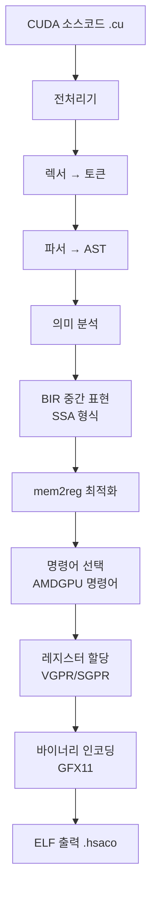

## 개요

GPU 컴퓨팅 세계에서 NVIDIA의 CUDA는 사실상의 표준입니다. 하지만 이는 동시에 <strong>벤더 종속(vendor lock-in)</strong>을 의미합니다. CUDA로 작성된 코드는 NVIDIA GPU에서만 실행할 수 있었습니다.

<strong>BarraCUDA</strong>는 이 벽을 허물기 위해 탄생한 오픈소스 컴파일러입니다. `.cu` 파일을 받아 AMD RDNA 3(GFX11) 머신 코드로 직접 컴파일합니다. LLVM 의존성 없이 15,000줄의 C99로 작성되었으며, HIP 변환 레이어도 필요하지 않습니다.

## BarraCUDA의 아키텍처

BarraCUDA의 컴파일 파이프라인은 전통적인 컴파일러 구조를 따르면서도, AMD GPU를 직접 타겟으로 합니다.



핵심적인 특징은 다음과 같습니다:

- <strong>LLVM 제로 의존성</strong>: 약 1,700줄의 직접 작성된 명령어 선택 로직
- <strong>SSA 기반 IR</strong>: BIR(BarraCUDA IR)이라는 자체 중간 표현 사용
- <strong>완전한 전처리기</strong>: `#include`, `#define`, 매크로, 조건부 컴파일 지원
- <strong>검증된 인코딩</strong>: 모든 명령어 인코딩이 `llvm-objdump`으로 검증 완료

## 지원하는 CUDA 기능

BarraCUDA는 이미 상당히 많은 CUDA 기능을 지원합니다:

### 코어 언어 기능

- `__global__`, `__device__`, `__host__` 함수 한정자
- `threadIdx`, `blockIdx`, `blockDim`, `gridDim` 내장 변수
- 구조체, 열거형, typedef, 네임스페이스
- 포인터, 배열, 포인터 산술
- 모든 C 제어 흐름: if/else, for, while, switch/case, goto
- 기본 템플릿 인스턴스화

### CUDA 특화 기능

- <strong>`__shared__` 메모리</strong>: LDS에서 할당, 적절히 추적
- <strong>`__syncthreads()`</strong>: `s_barrier`로 변환
- <strong>원자적 연산</strong>: `atomicAdd`, `atomicSub`, `atomicMin`, `atomicMax` 등
- <strong>Warp 인트린식</strong>: `__shfl_sync`, `__shfl_up_sync`, `__shfl_down_sync`
- <strong>벡터 타입</strong>: `float2`, `float3`, `float4` 등 `.x/.y/.z/.w` 접근
- <strong>반정밀도</strong>: `__half`, `__float2half()`, `__half2float()`
- <strong>Cooperative Groups</strong>: `this_thread_block()` 및 `.sync()`, `.thread_rank()`

## 사용 방법

빌드는 놀라울 정도로 간단합니다:

```bash
# 빌드 — C99 컴파일러만 있으면 됩니다
make

# AMD GPU 바이너리로 컴파일
./barracuda --amdgpu-bin kernel.cu -o kernel.hsaco

# IR 덤프 (디버깅용)
./barracuda --ir kernel.cu

# AST 출력
./barracuda --ast kernel.cu
```

## GPU 민주화의 의미

BarraCUDA의 등장은 단순한 기술적 성과를 넘어, GPU 생태계의 구조적 변화를 시사합니다.

### NVIDIA 독점에 대한 도전

현재 GPU 컴퓨팅 시장에서 CUDA의 위치는 절대적입니다. AI/ML 워크로드의 대부분이 CUDA 기반이며, 이는 NVIDIA GPU 없이는 실행이 불가능했습니다. BarraCUDA는 이 구도에 균열을 만듭니다.

### AMD GPU 활용 가능성 확대

AMD의 ROCm/HIP 생태계는 성장하고 있지만, 기존 CUDA 코드를 변환하는 데 여전히 마찰이 존재합니다. BarraCUDA는 <strong>코드 변환 없이 직접 컴파일</strong>하는 접근법으로 이 마찰을 최소화합니다.

### 오픈소스의 힘

15,000줄의 C99로 CUDA 컴파일러를 구현했다는 사실 자체가, 오픈소스 커뮤니티의 역량을 보여줍니다. Hacker News에서 66포인트를 기록하며 개발자 커뮤니티의 관심을 모았습니다.

## 현재 한계와 전망

물론 아직 초기 단계인 만큼 한계도 있습니다:

- <strong>GFX11(RDNA 3) 전용</strong>: 현재 AMD의 최신 아키텍처만 지원
- <strong>런타임 미포함</strong>: `cudaMalloc`, `cudaMemcpy` 등 호스트 API는 별도 구현 필요
- <strong>최적화 제한적</strong>: nvcc 수준의 최적화에는 아직 미치지 못함
- <strong>Tenstorrent 지원 진행 중</strong>: AMD 이외의 아키텍처로 확장 계획

그러나 프로젝트의 방향성은 명확합니다. CUDA 코드의 포터빌리티를 높이고, GPU 선택의 자유를 개발자에게 돌려주는 것입니다.

## 결론

BarraCUDA는 GPU 컴퓨팅의 미래를 엿볼 수 있는 프로젝트입니다. NVIDIA의 CUDA 독점에 대한 오픈소스의 대안으로서, <strong>코드 변경 없이 AMD GPU에서 CUDA 코드를 실행</strong>할 수 있는 가능성을 보여줍니다.

AI/ML 워크로드가 폭발적으로 증가하는 지금, GPU 선택의 다양성은 비용 절감과 공급망 안정성 측면에서도 중요합니다. BarraCUDA와 같은 프로젝트가 성숙해진다면, GPU 생태계의 경쟁 구도가 한층 건강해질 것입니다.

## 참고 자료

- [BarraCUDA GitHub 리포지토리](https://github.com/Zaneham/BarraCUDA)
- [Hacker News 토론](https://news.ycombinator.com/item?id=barracuda)
- [AMD ROCm 공식 문서](https://rocm.docs.amd.com/)
- [NVIDIA CUDA 공식 문서](https://developer.nvidia.com/cuda-zone)
