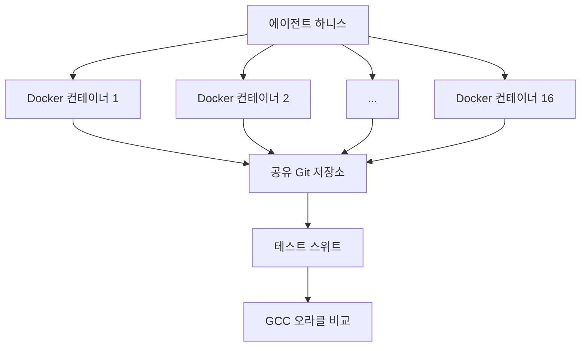

## 개요

Anthropic이 2026년 2월 5일에 공개한 **CCC(Claude's C Compiler)**는 AI가 만든 컴파일러의 가능성과 한계를 동시에 보여주는 인상적인 프로젝트입니다. Claude Opus 4.6이 100% 코드를 생성한 Rust 기반 C 컴파일러로, **Linux 6.9 커널을 x86, ARM, RISC-V에서 빌드하고 부팅**하는 데 성공했습니다.

2,000회의 Claude Code 세션, $20,000의 API 비용, 10만 줄의 코드. AI가 "동작하는 컴파일러"를 만드는 데 필요했던 건 이것이 전부였습니다.

## CCC란 무엇인가

CCC는 Anthropic Safeguards팀의 Nicholas Carlini가 설계한 **에이전트 팀(Agent Teams)** 방식으로 개발되었습니다. 핵심 아이디어는 간단합니다:

> 16개의 Claude 인스턴스가 공유 코드베이스에서 병렬로 작업하며, 사람의 개입 없이 컴파일러를 완성한다.

### 아키텍처



각 에이전트는 독립된 Docker 컨테이너에서 실행됩니다. 작업 충돌을 막기 위해 `current_tasks/` 디렉토리에 "잠금 파일"을 생성하는 방식을 사용합니다. 한 에이전트가 `parse_if_statement.txt`를 잠그면, 다른 에이전트는 `codegen_function_definition.txt` 같은 다른 작업을 선택합니다.

### 에이전트 루프

각 에이전트의 실행 루프는 놀라울 만큼 단순합니다:

```bash
#!/bin/bash
while true; do
  COMMIT=$(git rev-parse --short=6 HEAD)
  LOGFILE="agent_logs/agent_${COMMIT}.log"
  claude --dangerously-skip-permissions \
    -p "$(cat AGENT_PROMPT.md)" \
    --model claude-opus-X-Y &> "$LOGFILE"
done
```

## CCC의 성과

### 컴파일에 성공한 프로젝트

| 프로젝트 | 상태 |
|----------|------|
| Linux 6.9 커널 (x86, ARM, RISC-V) | ✅ 부팅 성공 |
| QEMU | ✅ |
| FFmpeg | ✅ |
| SQLite | ✅ |
| PostgreSQL | ✅ |
| Redis | ✅ |
| Doom | ✅ 실행 가능 |

### 테스트 스위트 결과

- **GCC torture test suite**: 99% 통과
- **대부분의 컴파일러 테스트 스위트**: 99% 통과

## CCC vs GCC — 현실적인 비교

GCC는 40년 이상의 역사를 지닌 프로덕션 컴파일러입니다. CCC와의 비교는 AI가 **현재 어디까지 왔는지**를 보여줍니다.

### 성능

> "모든 최적화를 활성화해도 CCC가 생성한 코드는 GCC의 최적화 비활성화(-O0)보다 비효율적입니다."

이것이 CCC의 가장 큰 약점입니다. 컴파일러의 핵심 가치인 **코드 최적화**에서 GCC에 크게 뒤처집니다.

### 기능 격차

| 기능 | GCC | CCC |
|------|-----|-----|
| 자체 어셈블러/링커 | ✅ | ❌ (GCC 어셈블러/링커 사용) |
| 16비트 x86 | ✅ | ❌ (GCC에 위임) |
| 모든 프로젝트 빌드 | ✅ | ❌ (일부만 가능) |
| 코드 최적화 | 수십 개 패스 | 기본 SSA IR 수준 |
| 아키텍처 지원 | 수십 개 | 3개 (x86, ARM, RISC-V) |

### 하지만 정말 중요한 것

GCC는 수천 명의 개발자가 40년에 걸쳐 만든 것입니다. CCC는 **AI가 2주 만에 $20,000로 만들었습니다**.

## 80% 품질을 초고속으로 — AI 코딩의 본질

CCC 프로젝트의 진짜 의미는 "GCC를 이겼다"가 아닙니다. 핵심은 다음에 있습니다:

### 1. 제로에서 동작하는 컴파일러까지

숙련된 컴파일러 개발자라도 10만 줄의 Rust 컴파일러를 만들려면 **수개월에서 수년**이 걸립니다. AI는 이를 2주 만에 해냈습니다. 완벽하지는 않지만, **동작합니다**.

### 2. 병렬화의 힘

16개 에이전트가 병렬로 작업한다는 건 단순히 속도가 빨라진다는 의미가 아닙니다. 각 에이전트가 **전문 역할을 분담**합니다:

- 기능 구현 에이전트
- 중복 코드 통합 에이전트
- 컴파일러 성능 최적화 에이전트
- 코드 품질 개선 에이전트
- 문서화 에이전트

### 3. 테스트 주도 개발의 중요성

이 프로젝트에서 가장 많은 공을 들인 부분은 **코드 작성이 아니라 테스트 환경 설계**였습니다:

- GCC를 "정답 오라클"로 삼아 출력을 비교
- 컨텍스트 윈도우 오염을 막기 위한 출력 최소화
- 시간 개념이 없는 AI를 위한 진행 상황 추적 장치
- 1%/10% 랜덤 샘플링을 통한 빠른 회귀 테스트

## 기술적 설계 포인트

### 클린룸 구현

CCC는 **인터넷 접속 없이** 개발되었습니다. Rust 표준 라이브러리만 사용하는 완전한 클린룸 구현입니다. AI가 학습된 지식만으로도 컴파일러를 구축할 수 있음을 증명한 셈입니다.

### SSA IR 기반 설계


SSA(Static Single Assignment) 중간 표현을 사용해 여러 최적화 패스를 지원하는 구조입니다. 이 아키텍처 결정은 사람이 내렸지만, 구현은 100% AI가 담당했습니다.

### 병렬 에이전트의 한계

Linux 커널 컴파일 단계에서 흥미로운 문제가 발생했습니다. 수백 개의 독립 테스트와 달리 커널 빌드는 **하나의 거대한 작업**이었고, 모든 에이전트가 같은 버그에 부딪히면서 16개 에이전트의 이점이 사라졌습니다.

해결책은 GCC를 온라인 오라클로 사용해 **커널 파일을 무작위로 분배**하고, 각 에이전트가 서로 다른 파일의 버그를 수정하도록 한 것이었습니다.

## 미래 전망

### 모델 세대별 진화

| 모델 | 컴파일러 능력 |
|------|--------------|
| 초기 Opus 4.x | 기본적인 컴파일러만 가능 |
| Opus 4.5 | 테스트 스위트 통과 가능, 실제 프로젝트 빌드 불가 |
| Opus 4.6 | Linux 커널 빌드 성공 |

세대가 바뀔 때마다 능력이 급격히 향상되고 있습니다. Opus 4.7이나 5.0에서는 GCC 수준의 최적화도 가능해질 수 있습니다.

### 개발자에게 주는 시사점

1. **테스트가 핵심입니다**: AI 에이전트의 품질은 테스트 환경의 품질에 직결됩니다
2. **아키텍처 설계는 아직 사람의 몫입니다**: SSA IR 같은 고수준 설계 결정은 여전히 사람이 내렸습니다
3. **80% 완성도의 가치를 과소평가하지 마세요**: 완벽하지 않아도 동작하는 결과물은 그 자체로 가치가 있습니다
4. **병렬 에이전트 시대가 왔습니다**: 하나의 AI가 아니라 팀으로 동작하는 AI의 가능성이 열렸습니다

## 결론

CCC는 GCC의 대체품이 아닙니다. **AI가 소프트웨어 개발에서 어디까지 왔는지를 보여주는 이정표**입니다.

- 10만 줄의 동작하는 컴파일러를 2주 만에 생성
- Linux 커널을 부팅 가능하게 빌드
- $20,000의 비용 (인간 팀 대비 극히 일부)
- GCC 수준의 최적화에는 아직 미달

"80% 품질을 초고속으로 달성한다"는 AI의 특성이, 컴파일러라는 극한의 소프트웨어 프로젝트에서도 통했습니다. 나머지 20%를 채우는 건 여전히 어렵지만, 그 80%조차 이전에는 불가능했던 것입니다.

## 참고 자료

- [Building a C compiler with a team of parallel Claudes — Anthropic Engineering Blog](https://www.anthropic.com/engineering/building-c-compiler)
- [Claude's C Compiler — GitHub](https://github.com/anthropics/claudes-c-compiler)
- [GCC Torture Test Suite](https://gcc.gnu.org/onlinedocs/gccint/Torture-Tests.html)
