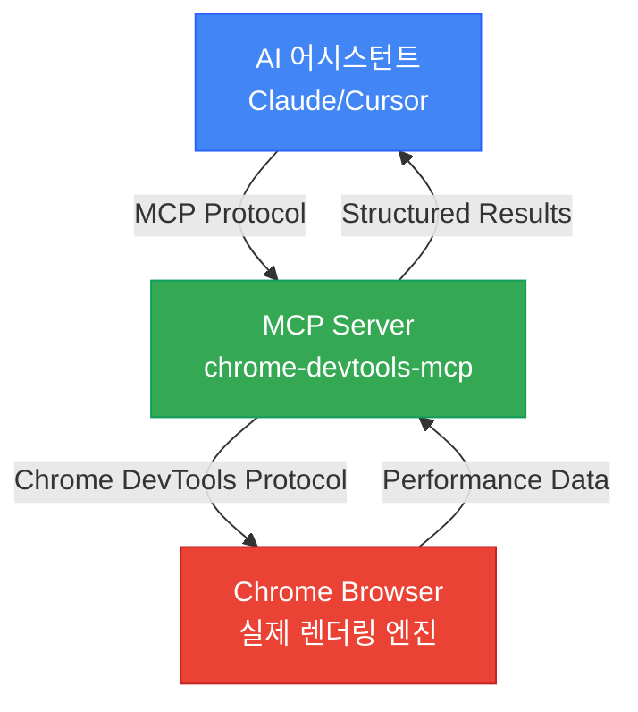

## 웹 성능 최적화의 새로운 패러다임

웹 성능 최적화는 항상 중요했지만, 일관성 있게 측정하고 개선하기는 어려웠습니다. Chrome DevTools를 수동으로 열어 프로파일링하고, 스크린샷을 찍고, 지표를 비교하는 작업은 시간이 많이 걸리고 반복적입니다. 더 큰 문제는 AI 코드 제너레이터들이 실제 브라우저에서 어떻게 동작하는지 확인할 수 없다는 점이었습니다.

2025년 9월 22일, Google Chrome DevTools 팀은 이 문제를 해결할 <strong>Chrome DevTools MCP</strong>를 공개했습니다. 이제 Claude, Cursor, Copilot 같은 AI 어시스턴트가 실제 Chrome 브라우저를 직접 제어하고, 성능을 측정하며, 데이터 기반으로 최적화를 검증할 수 있습니다.

## Chrome DevTools MCP란?

Chrome DevTools MCP는 AI 코딩 어시스턴트에게 Chrome 브라우저를 제어할 수 있는 능력을 제공하는 공식 Model Context Protocol 서버입니다. 간단히 말하면, AI가 여러분의 개발자 도구를 직접 사용할 수 있게 됩니다.

### 핵심 기능

- <strong>실시간 성능 측정</strong>: Core Web Vitals (LCP, CLS, INP) 자동 측정
- <strong>네트워크 모니터링</strong>: 모든 HTTP 요청의 타이밍, 헤더, 페이로드 분석
- <strong>디바이스 에뮬레이션</strong>: CPU 스로틀링, 네트워크 제한으로 모바일 환경 시뮬레이션
- <strong>자동화된 디버깅</strong>: 콘솔 메시지, 에러 로그 수집 및 분석
- <strong>성능 인사이트</strong>: 렌더 블로킹 리소스, 긴 작업, 레이아웃 시프트 자동 식별

### 작동 원리



AI가 요청하면 → MCP 서버가 Chrome DevTools Protocol 명령으로 변환 → Chrome이 실행하고 데이터 반환 → AI가 분석하고 제안합니다.

## 설치 및 설정

### 1. 사전 요구사항

- Node.js v20.19 이상 (v22.12.0 권장)
- Chrome 브라우저 (최신 안정 버전)
- Claude Desktop 또는 지원되는 AI IDE

### 2. Claude Desktop 설정

`~/Library/Application Support/Claude/claude_desktop_config.json` 파일을 편집합니다:

```json
{
  "mcpServers": {
    "chrome-devtools": {
      "command": "npx",
      "args": ["-y", "chrome-devtools-mcp@latest"]
    }
  }
}
```

### 3. 고급 설정 옵션

```json
{
  "mcpServers": {
    "chrome-devtools": {
      "command": "npx",
      "args": [
        "chrome-devtools-mcp@latest",
        "--headless=true",           // 헤드리스 모드
        "--isolated=true",           // 격리된 세션 (보안 권장)
        "--viewport=1920x1080",      // 커스텀 뷰포트
        "--executablePath=/path/to/chrome"  // 특정 Chrome 바이너리
      ]
    }
  }
}
```

Claude Desktop을 재시작하면 설정이 적용됩니다.

## 핵심 성능 최적화 도구

Chrome DevTools MCP는 26개의 도구를 제공하지만, 성능 최적화에 핵심적인 도구들을 중점적으로 살펴보겠습니다.

### 1. 성능 트레이싱

**`performance_start_trace()`**

성능 추적을 시작합니다. 페이지 로드 타이밍, CPU 사용량, 네트워크 활동, 렌더링 지표를 모두 캡처합니다.

```typescript
// AI에게 요청 예시
"localhost:4321에서 성능 트레이스를 기록해줘. 페이지를 새로고침하고 자동으로 멈춰줘."

// MCP 실행:
performance_start_trace(reload=true, autoStop=true)
```

**`performance_stop_trace()`**

추적을 중지하고 포괄적인 성능 인사이트를 반환합니다:

- <strong>Core Web Vitals</strong>: LCP, CLS, INP, TBT, TTFB
- <strong>가장 긴 메인 스레드 태스크</strong>
- <strong>렌더 블로킹 리소스</strong>
- <strong>JavaScript 실행 타이밍</strong>
- <strong>네트워크 워터폴 분석</strong>

**`performance_analyze_insight(insightName)`**

특정 성능 문제에 대한 상세 분석을 제공합니다.

```typescript
// 렌더 블로킹 리소스 상세 분석
performance_analyze_insight("RenderBlocking")

// 반환 예시:
// - /main.css: 200ms 블로킹
// - /analytics.js: 150ms 블로킹
// 추천: preload 또는 defer 적용
```

### 2. Core Web Vitals 자동 측정

Chrome DevTools MCP는 모든 Core Web Vitals를 자동으로 측정합니다:

- <strong>LCP (Largest Contentful Paint)</strong>: 2.5초 이하 = Good
- <strong>CLS (Cumulative Layout Shift)</strong>: 0.1 이하 = Good
- <strong>INP (Interaction to Next Paint)</strong>: 200ms 이하 = Good
- <strong>TBT (Total Blocking Time)</strong>: 300ms 이하 = Good
- <strong>TTFB (Time to First Byte)</strong>: 600ms 이하 = Good

AI는 이 지표들을 분석하고 어떤 것이 임계값을 초과하는지 즉시 알려줍니다.

### 3. 디바이스 에뮬레이션

<strong>CPU 스로틀링</strong>

```typescript
// 4배 느린 CPU 시뮬레이션 (저사양 모바일)
emulate_cpu(4)

// 성능 재측정
performance_start_trace(reload=true)
```

<strong>네트워크 스로틀링</strong>

```typescript
// Slow 4G 네트워크 시뮬레이션
emulate_network("Slow 4G")

// 옵션: "Slow 3G", "Fast 3G", "Slow 4G", "Fast 4G", "No emulation"
```

### 4. 네트워크 요청 모니터링

<strong>모든 요청 조회</strong>

```typescript
list_network_requests(
  pageSize=50,
  resourceTypes=["script", "stylesheet", "image"]
)

// 반환:
// - URL, HTTP 메서드, 상태 코드
// - 요청/응답 헤더
// - 타이밍 (DNS, 연결, TTFB)
// - 파일 크기 및 압축 여부
```

<strong>특정 요청 상세 조회</strong>

```typescript
get_network_request("https://example.com/main.js")

// 반환:
// - 전체 요청/응답 바디
// - 성능 타이밍 분해
// - 캐싱 정보
```

## 실전 워크플로우: 성능 최적화 자동화

이제 실제로 Chrome DevTools MCP를 사용해 웹사이트 성능을 최적화하는 전체 워크플로우를 살펴보겠습니다.

### Step 1: 베이스라인 측정

```
Claude에게 요청:
"내 블로그 localhost:4321의 성능을 측정하고 Core Web Vitals를 알려줘"

AI 실행:
1. navigate_page("http://localhost:4321")
2. performance_start_trace(reload=true, autoStop=true)
3. [자동으로 페이지 로드 및 측정 완료]

AI 응답:
"성능 측정 완료:
- LCP: 3.2초 (Poor - 2.5초 초과)
- CLS: 0.05 (Good)
- TBT: 450ms (Poor - 300ms 초과)
- TTFB: 120ms (Good)

주요 문제:
1. LCP가 느림: 가장 큰 이미지 (hero.jpg, 1.2MB) 최적화 필요
2. TBT가 높음: main.js (350KB) 파싱에 400ms 소요"
```

### Step 2: 병목 지점 분석

```
Claude에게 요청:
"렌더 블로킹 리소스를 찾아줘"

AI 실행:
performance_analyze_insight("RenderBlocking")

AI 응답:
"렌더 블로킹 리소스:
1. /styles/main.css (200ms 블로킹)
   - 28KB, 압축되지 않음
   - 추천: Critical CSS 인라인 + 나머지 비동기 로드

2. /scripts/analytics.js (150ms 블로킹)
   - 헤드에서 동기 로드
   - 추천: defer 또는 async 속성 추가

3. Google Fonts (100ms 블로킹)
   - 추천: font-display: swap + preconnect"
```

### Step 3: 최적화 적용

이미지 최적화:

```bash
# WebP 변환 및 리사이징
npm install sharp
node optimize-images.js
```

JavaScript 최적화:

```html
<!-- 변경 전 -->
<script src="/scripts/analytics.js"></script>

<!-- 변경 후 -->
<script src="/scripts/analytics.js" defer></script>
```

CSS 최적화:

```html
<head>
  <!-- Critical CSS 인라인 -->
  <style>
    /* Above-the-fold 스타일만 */
  </style>

  <!-- 나머지 CSS는 비동기 로드 -->
  <link rel="preload" href="/styles/main.css" as="style"
        onload="this.onload=null;this.rel='stylesheet'">
</head>
```

### Step 4: 재측정 및 검증

```
Claude에게 요청:
"다시 성능 측정해서 이전과 비교해줘"

AI 응답:
"성능 측정 완료. 비교 결과:

Before → After:
- LCP: 3.2초 → 1.8초 (44% 개선 ✓)
- CLS: 0.05 → 0.05 (변화 없음)
- TBT: 450ms → 180ms (60% 개선 ✓)
- TTFB: 120ms → 115ms

모든 Core Web Vitals가 'Good' 범위에 진입했습니다!

추가 개선 사항:
- 이미지 preload로 LCP를 1.5초까지 단축 가능
- Font preconnect로 추가 50ms 절약 가능"
```

## 고급 활용 사례

### 1. 성능 리그레션 자동 감지

CI/CD 파이프라인에서 성능 저하를 자동으로 감지할 수 있습니다.

```typescript
// 배포 전 자동 테스트
async function performanceCheck() {
  // 1. 현재 프로덕션 성능 측정
  const prodMetrics = await measurePerformance("https://example.com");

  // 2. 스테이징 환경 성능 측정
  const stagingMetrics = await measurePerformance("https://staging.example.com");

  // 3. 비교 및 경고
  if (stagingMetrics.LCP > prodMetrics.LCP * 1.1) {
    throw new Error(`LCP 리그레션 감지: ${prodMetrics.LCP}ms → ${stagingMetrics.LCP}ms`);
  }
}
```

Claude에게 요청만 하면 위 로직을 자동으로 실행하고 결과를 보고합니다.

### 2. 크로스 디바이스 성능 테스트

```
Claude에게 요청:
"내 사이트를 데스크톱과 모바일에서 각각 테스트해서 비교해줘"

AI 실행:
1. [데스크톱 테스트]
   - 스로틀링 없음
   - 결과: LCP 1.8초, TBT 200ms

2. [모바일 테스트]
   - emulate_cpu(4)
   - emulate_network("Slow 4G")
   - 결과: LCP 5.2초, TBT 1200ms

AI 응답:
"모바일 환경에서 심각한 성능 저하 발견:
- LCP가 3.4초 더 느림 (이미지 최적화 부족)
- TBT가 1000ms 증가 (JavaScript 과다)

모바일 최적화 우선순위:
1. 반응형 이미지 srcset 추가
2. JavaScript 코드 스플리팅
3. Third-party 스크립트 lazy load"
```

### 3. 프로덕션 이슈 디버깅

실제 사용자가 보고한 성능 문제를 재현하고 진단할 수 있습니다.

```
사용자 보고: "모바일에서 페이지가 너무 느려요"

Claude에게 요청:
"https://example.com을 모바일 환경에서 프로파일링하고
느린 원인을 찾아줘"

AI 실행:
1. emulate_cpu(4) + emulate_network("Slow 4G")
2. navigate_page("https://example.com")
3. performance_start_trace(reload=true)
4. list_console_messages() (에러 확인)
5. list_network_requests() (네트워크 분석)

AI 응답:
"문제 발견:
1. Third-party 광고 스크립트가 2초 블로킹 (TBT 주범)
2. WebP 없는 고해상도 이미지 (LCP 주범)
3. 콘솔에 404 에러 3건 (불필요한 요청)

해결 방법:
1. 광고 스크립트 async 로드
2. 이미지 WebP 변환 + srcset
3. 404 리소스 제거 또는 경로 수정"
```

## 모범 사례 및 팁

### 반복적 최적화 워크플로우

```
1. BASELINE
   - 초기 성능 측정
   - Core Web Vitals 문서화
   - 상위 3개 병목 지점 식별

2. PRIORITIZE
   - 임계값 실패한 지표 우선
   - LCP > 2.5초 = 우선순위 1
   - TBT > 300ms = 우선순위 2
   - CLS > 0.1 = 우선순위 3

3. OPTIMIZE
   - 인사이트 기반 타겟팅 수정
   - 한 번에 하나씩 (명확한 원인 분석)

4. VALIDATE
   - 성능 재측정
   - Before/After 비교
   - 다른 지표의 리그레션 확인

5. ITERATE
   - 다음 병목으로 이동
   - 모든 지표가 "Good"이 될 때까지 반복
```

### 보안 고려사항

- <strong>격리된 세션 사용</strong>: `--isolated=true` 옵션으로 임시 브라우저 세션 사용
- <strong>민감한 데이터 주의</strong>: 개인정보가 있는 브라우저 프로필에서 사용 금지
- <strong>프로덕션 테스트</strong>: 접근 제어 구현, 읽기 전용 모드 권장
- <strong>AI 생성 스크립트 검토</strong>: 실행 전 항상 확인

### 다른 MCP와 결합

Chrome DevTools MCP는 다른 MCP 서버와 함께 사용하면 더욱 강력합니다:

```
성능 문제 발견 (Chrome DevTools MCP)
  → 해결 방법 리서치 (Brave Search MCP)
  → 공식 문서 확인 (Context7 MCP)
  → 코드 수정 및 재측정 (Chrome DevTools MCP)
```

## 실제 성과 사례

가상의 사례지만 현실적인 시나리오입니다:

### Before: 수동 최적화 (전통적 방법)

- 소요 시간: 하루 4시간
- 프로세스:
  1. Chrome DevTools 수동 실행 (30분)
  2. 스크린샷 및 지표 기록 (20분)
  3. 문제점 구글링 (1시간)
  4. 코드 수정 (1시간)
  5. 재측정 및 비교 (30분)
  6. 문서화 (40분)

### After: Chrome DevTools MCP 활용

- 소요 시간: 1시간
- 프로세스:
  ```
  "내 사이트 성능 최적화해줘.
   현재 상태 측정하고, 문제점 찾고, 해결 방법 제안해줘.
   수정 후 다시 측정해서 비교해줘."
  ```
- AI가 모든 단계를 자동화
- 결과:
  - LCP: 3.8초 → 1.9초 (50% 개선)
  - Lighthouse Score: 62 → 94

<strong>시간 절감: 75%</strong>

## 미래 전망

Chrome DevTools MCP는 웹 개발 워크플로우를 근본적으로 변화시키고 있습니다:

### AI as Active Development Partner

과거: AI가 코드를 생성 → 개발자가 수동으로 테스트
현재: AI가 코드 생성 → AI가 직접 브라우저에서 테스트 → AI가 결과 분석 → 반복

### 예측 가능한 발전 방향

1. <strong>예측적 최적화</strong>: AI가 성능 저하를 사전에 예측하고 방지
2. <strong>자동 수정</strong>: 간단한 성능 문제는 AI가 직접 수정 (승인 후)
3. <strong>연속적 모니터링</strong>: 프로덕션 환경에서 실시간 성능 추적
4. <strong>성능 예산 자동화</strong>: 임계값 설정하면 CI/CD에서 자동 검증

## 시작해보세요

Chrome DevTools MCP는 웹 성능 최적화를 추측에서 데이터 기반 과학으로 전환시킵니다.

### 첫 단계

1. <strong>설치</strong>: `npx chrome-devtools-mcp@latest`
2. <strong>Claude Desktop 설정</strong>: MCP 서버 추가
3. <strong>첫 측정</strong>: "내 사이트 성능 측정해줘"
4. <strong>최적화 시작</strong>: AI의 제안을 하나씩 적용
5. <strong>결과 검증</strong>: 개선 사항을 데이터로 확인

성능 최적화는 더 이상 시간이 많이 걸리는 수동 작업이 아닙니다. AI와 함께라면 빠르고, 정확하며, 반복 가능한 프로세스가 됩니다.

## 참고 자료

- [Chrome DevTools MCP GitHub](https://github.com/ChromeDevTools/chrome-devtools-mcp)
- [Chrome DevTools Protocol 문서](https://chromedevtools.github.io/devtools-protocol/)
- [Model Context Protocol 스펙](https://modelcontextprotocol.io/)
- [Web.dev Core Web Vitals 가이드](https://web.dev/vitals/)
- [Vladimir Siedykh의 완벽 가이드](https://vladimirsiedykh.com/blog/chrome-devtools-mcp-ai-browser-debugging-complete-guide-2025)

---

이제 여러분의 웹사이트 성능 최적화를 AI에게 맡겨보세요. 데이터가 말하게 하고, AI가 분석하게 하며, 여러분은 더 중요한 문제에 집중하세요.
