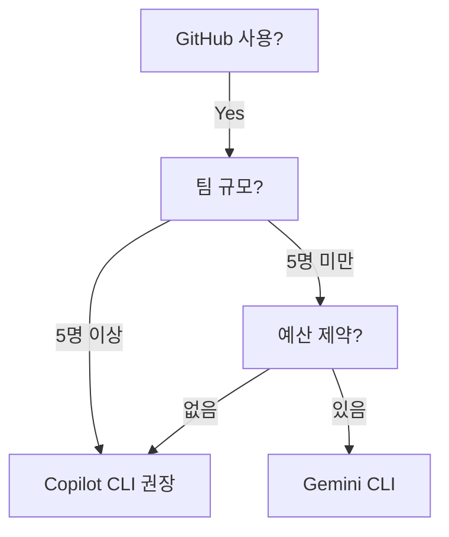
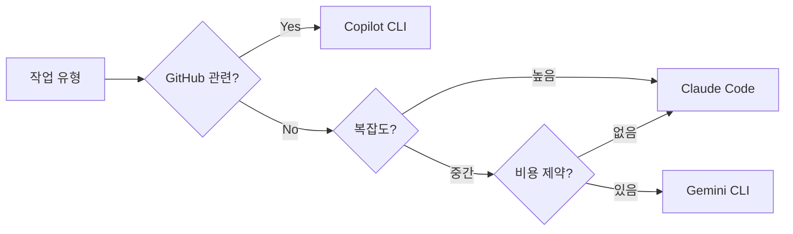
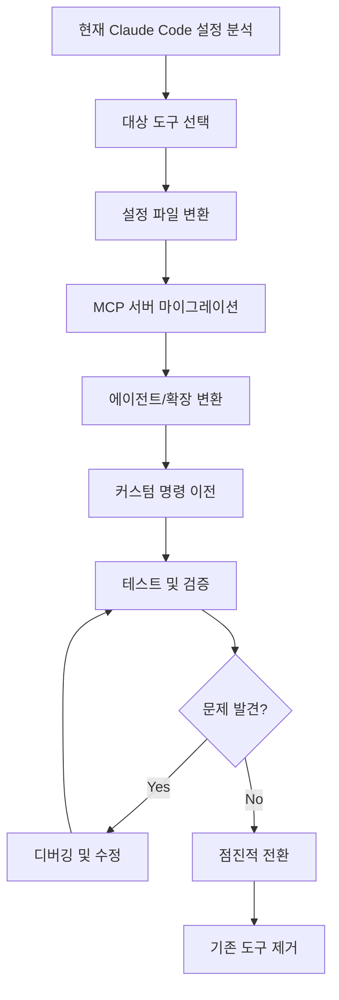

## 개요

2024년부터 시작된 CLI 기반 AI 코딩 도구의 급속한 발전으로, 개발자들은 이제 다양한 선택지를 갖게 되었습니다. Claude Code가 시장을 선도하고 있지만, GitHub Copilot CLI, Gemini CLI, Codex CLI 등 경쟁 도구들이 각자의 강점을 내세우며 빠르게 성장하고 있습니다.

### 왜 마이그레이션을 고려하는가

마이그레이션을 고려하는 주요 이유는 크게 세 가지입니다:

1. <strong>비용 최적화</strong>: Claude Code의 토큰 기반 과금($3/M input, $15/M output)은 사용량에 따라 월 $100 이상이 될 수 있습니다. 반면 Copilot CLI는 월 $10 정액제, Gemini CLI는 무료 티어를 제공합니다.

2. <strong>생태계 통합</strong>: GitHub 중심 워크플로우를 사용한다면 Copilot CLI가, Google Cloud를 주로 사용한다면 Gemini CLI가 더 나은 통합을 제공합니다.

3. <strong>기능 요구사항</strong>: 오픈소스 커스터마이징이 필요하다면 Codex CLI가, 복잡한 멀티에이전트 시스템이 필요하다면 Claude Code가 적합합니다.

## 핵심 비교: 4가지 CLI 도구

### 아키텍처 비교 표

| 항목 | Claude Code | Copilot CLI | Gemini CLI | Codex CLI |
|------|-------------|-------------|------------|-----------|
| <strong>제공사</strong> | Anthropic | GitHub/Microsoft | Google | OpenAI |
| <strong>LLM 모델</strong> | Claude 3.5/4 | GPT-4, Claude, Gemini | Gemini 2.5 | GPT-4o, o1 |
| <strong>가격</strong> | 토큰 기반 | $10/월 | 무료〜$20/월 | 토큰 기반 |
| <strong>설정 포맷</strong> | JSON | JSON | JSON | TOML |
| <strong>프로젝트 지시</strong> | CLAUDE.md | copilot-instructions.md | GEMINI.md | AGENTS.md |
| <strong>MCP 지원</strong> | 네이티브 | 지원 | 지원 | 제한적 |
| <strong>에이전트 시스템</strong> | 서브에이전트 | Extensions | 없음 | AGENTS.md |
| <strong>커스텀 명령</strong> | Slash commands | /commands | /prompts | /commands |
| <strong>GitHub 통합</strong> | gh CLI 활용 | 네이티브 | 별도 설정 | 별도 설정 |
| <strong>오픈소스</strong> | 아니오 | 아니오 | 아니오 | 예 |

### 설정 파일 구조 비교

각 도구의 프로젝트 설정 구조를 비교해보면 마이그레이션에 필요한 작업을 파악할 수 있습니다:

```
# Claude Code
project/
├── .claude/
│   ├── settings.json
│   ├── settings.local.json
│   ├── commands/
│   │   └── my-command.md
│   └── agents/
│       └── my-agent.md
├── .mcp.json
└── CLAUDE.md

# GitHub Copilot CLI
project/
├── .github/
│   ├── copilot-instructions.md
│   └── copilot/
│       └── extensions/
│           └── my-extension.md
├── mcp-config.json
└── .copilotignore

# Gemini CLI
project/
├── .gemini/
│   ├── settings.json
│   └── prompts/
│       └── my-prompt.toml
└── GEMINI.md

# Codex CLI
project/
├── .codex/
│   ├── config.toml
│   └── commands/
│       └── my-command.md
├── codex.toml
└── AGENTS.md
```

## 마이그레이션 가이드

### 1. GitHub Copilot CLI로 마이그레이션

GitHub Copilot CLI는 GitHub과의 긴밀한 통합과 월 $10의 합리적인 가격이 장점입니다. 특히 2025년부터 Claude와 Gemini 모델도 지원하여 Multi-vendor 환경을 제공합니다.

#### 장점

- <strong>저렴한 가격</strong>: 월 $10 정액제로 예측 가능한 비용
- <strong>GitHub 네이티브 통합</strong>: PR 리뷰, 이슈 관리가 자연스럽게 연동
- <strong>Multi-vendor 모델</strong>: GPT-4, Claude, Gemini 중 선택 가능
- <strong>기업 환경 지원</strong>: Enterprise 플랜과 SSO 통합

#### 주요 변환 작업

<strong>1) MCP 설정 마이그레이션</strong>

```json
// Claude Code: .mcp.json
{
  "mcpServers": {
    "brave-search": {
      "command": "npx",
      "args": ["-y", "@anthropic-ai/mcp-server-brave-search"]
    }
  }
}

// Copilot CLI: mcp-config.json
{
  "servers": {
    "brave-search": {
      "command": "npx",
      "args": ["-y", "@anthropic-ai/mcp-server-brave-search"],
      "env": {}
    }
  }
}
```

<strong>2) 프로젝트 지시 파일 변환</strong>

```markdown
<!-- Claude Code: CLAUDE.md -->
## 프로젝트 개요
Astro 기반의 블로그 프로젝트입니다.

## 명령어
npm run dev

<!-- Copilot CLI: .github/copilot-instructions.md -->
## Project Overview
Astro-based blog project.

## Commands
npm run dev

## Coding Standards
- Use TypeScript strict mode
- Follow ESLint rules
```

<strong>3) 에이전트/확장 변환</strong>

Claude Code의 서브에이전트를 Copilot Extensions로 변환할 때는 YAML frontmatter를 추가해야 합니다:

```markdown
<!-- Claude Code: .claude/agents/seo-optimizer.md -->
# SEO Optimizer Agent
SEO 최적화를 담당하는 에이전트입니다.
...

<!-- Copilot CLI: .github/copilot/extensions/seo-optimizer.md -->
---
name: seo-optimizer
description: Handles SEO optimization tasks
triggers:
  - seo
  - meta
  - sitemap
---
# SEO Optimizer Extension
Handles SEO optimization tasks.
...
```

#### 마이그레이션 체크리스트

- [ ] mcp-config.json으로 MCP 서버 설정 이전
- [ ] CLAUDE.md → copilot-instructions.md 변환
- [ ] 서브에이전트 → Extensions 변환 (YAML frontmatter 추가)
- [ ] Slash commands → /commands 디렉토리 이전
- [ ] .gitignore에 .copilotignore 규칙 동기화
- [ ] GitHub CLI 인증 확인

<strong>예상 소요 시간</strong>: 중간 규모 프로젝트 기준 9〜13시간

---

### 2. Gemini CLI로 마이그레이션

Gemini CLI는 무료 티어와 Google 생태계 통합이 가장 큰 장점입니다. 단, 서브에이전트 시스템이 없어 복잡한 워크플로우에는 제한이 있습니다.

#### 장점

- <strong>무료 티어</strong>: 개인 개발자에게 이상적
- <strong>Google 생태계</strong>: Firebase, Cloud Run, BigQuery 등과 통합
- <strong>빠른 응답</strong>: Gemini 2.5의 빠른 처리 속도
- <strong>멀티모달</strong>: 이미지, 동영상 분석 지원

#### 주요 변환 작업

<strong>1) MCP 설정 마이그레이션</strong>

```json
// Claude Code: .mcp.json
{
  "mcpServers": {
    "context7": {
      "command": "npx",
      "args": ["-y", "@anthropic-ai/mcp-server-context7"]
    }
  }
}

// Gemini CLI: .gemini/settings.json
{
  "mcp": {
    "servers": {
      "context7": {
        "command": "npx",
        "args": ["-y", "@anthropic-ai/mcp-server-context7"]
      }
    }
  }
}
```

<strong>2) 프로젝트 지시 파일 변환</strong>

```markdown
<!-- Claude Code: CLAUDE.md -->
## 아키텍처
- Astro 5.0 사용
- Content Collections로 블로그 관리

## 코드 스타일
TypeScript strict 모드 활성화

<!-- Gemini CLI: GEMINI.md -->
## Architecture
- Using Astro 5.0
- Blog managed with Content Collections

## Code Style
TypeScript strict mode enabled

## Gemini-Specific
- Prefer concise responses
- Use Korean for comments
```

<strong>3) 커맨드 변환 (Markdown → TOML)</strong>

```markdown
<!-- Claude Code: .claude/commands/generate-post.md -->
새로운 블로그 포스트를 생성합니다.
$ARGUMENTS에 제목을 입력하세요.
```

```toml
# Gemini CLI: .gemini/prompts/generate-post.toml
[prompt]
name = "generate-post"
description = "Generate a new blog post"

[prompt.parameters]
title = { type = "string", required = true }

[prompt.template]
content = """
Create a new blog post with the title: {{title}}
Follow the project's content guidelines.
"""
```

#### 제한 사항

- <strong>서브에이전트 없음</strong>: 복잡한 워크플로우 분리 불가
- <strong>커스텀 명령 제한</strong>: TOML 형식만 지원
- <strong>GitHub 통합</strong>: 네이티브 지원 없음 (별도 설정 필요)

#### 마이그레이션 체크리스트

- [ ] settings.json으로 MCP 설정 이전
- [ ] CLAUDE.md → GEMINI.md 변환
- [ ] Slash commands → TOML prompts 변환
- [ ] Google Cloud 인증 설정
- [ ] 서브에이전트 로직을 단일 프롬프트로 통합

<strong>예상 소요 시간</strong>: 중간 규모 프로젝트 기준 6〜9시간

---

### 3. Codex CLI로 마이그레이션

Codex CLI는 OpenAI의 오픈소스 프로젝트로, TypeScript SDK와 Rust로 구현된 빠른 성능이 특징입니다.

#### 장점

- <strong>오픈소스</strong>: 완전한 커스터마이징 가능
- <strong>TypeScript SDK</strong>: CI/CD 자동화에 적합
- <strong>Rust 구현</strong>: 빠른 시작과 낮은 메모리 사용
- <strong>AGENTS.md</strong>: 유연한 에이전트 정의

#### 주요 변환 작업

<strong>1) 설정 파일 변환 (JSON → TOML)</strong>

```json
// Claude Code: .claude/settings.json
{
  "permissions": {
    "allow": ["Read", "Write", "Bash"],
    "deny": ["mcp__notionApi__*"]
  }
}
```

```toml
# Codex CLI: codex.toml
[permissions]
allow = ["read", "write", "bash"]
deny = ["notion:*"]

[model]
provider = "openai"
name = "gpt-4o"
```

<strong>2) 에이전트 정의 변환</strong>

```markdown
<!-- Claude Code: .claude/agents/reviewer.md -->
코드 리뷰를 담당하는 에이전트입니다.
- 코드 스타일 검사
- 버그 탐지
- 성능 개선 제안

<!-- Codex CLI: AGENTS.md -->
## reviewer

코드 리뷰를 담당하는 에이전트입니다.

### Capabilities
- Code style checking
- Bug detection
- Performance improvement suggestions

### Tools
- read_file
- grep
- ast_query
```

<strong>3) MCP 설정 (제한적)</strong>

Codex CLI는 프로젝트별 MCP 설정이 제한적이며, 글로벌 설정을 주로 사용합니다:

```toml
# ~/.codex/config.toml
[mcp.servers.brave-search]
command = "npx"
args = ["-y", "@anthropic-ai/mcp-server-brave-search"]
```

#### 마이그레이션 체크리스트

- [ ] settings.json → codex.toml 변환
- [ ] 서브에이전트 → AGENTS.md 통합
- [ ] Slash commands → commands 디렉토리 이전
- [ ] MCP 서버를 글로벌 설정으로 이동
- [ ] TypeScript SDK 설정 (CI/CD용)

<strong>예상 소요 시간</strong>: 중간 규모 프로젝트 기준 8〜12시간

## 상황별 최적 도구 선택

도구 선택은 팀의 환경, 예산, 기술 요구사항에 따라 달라집니다. 아래는 각 상황에 맞는 권장 도구입니다.

### GitHub Copilot CLI를 선택해야 하는 경우

- <strong>GitHub 중심 워크플로우</strong>: PR, 이슈, Actions를 주로 사용
- <strong>팀 협업</strong>: 조직 전체의 표준화된 도구 필요
- <strong>기업 환경</strong>: Enterprise 통합, SSO, 감사 로그 필요
- <strong>안정성 중시</strong>: 공식 지원과 SLA가 중요
- <strong>예산 예측</strong>: 월 고정 비용 선호



### Gemini CLI를 선택해야 하는 경우

- <strong>비용 제약</strong>: 무료 티어가 필수
- <strong>Google Cloud 생태계</strong>: Firebase, Cloud Run 등 사용
- <strong>간단한 프로젝트</strong>: 복잡한 에이전트 시스템 불필요
- <strong>빠른 프로토타이핑</strong>: 빠른 응답 속도 중시
- <strong>멀티모달 작업</strong>: 이미지/동영상 분석 필요

### Codex CLI를 선택해야 하는 경우

- <strong>OpenAI 모델 선호</strong>: GPT-4o, o1 모델 사용
- <strong>오픈소스 커스터마이징</strong>: 내부 수정이 필요
- <strong>CI/CD 자동화</strong>: TypeScript SDK로 파이프라인 구축
- <strong>성능 중시</strong>: Rust 구현의 빠른 시작 속도
- <strong>자체 호스팅</strong>: 에어갭 환경에서 운영

### Claude Code를 유지해야 하는 경우

- <strong>복잡한 멀티에이전트 워크플로우</strong>: 10개 이상의 서브에이전트
- <strong>Claude의 추론 능력</strong>: 복잡한 아키텍처 설계, 리팩토링
- <strong>고도화된 에이전트 시스템</strong>: 세밀한 권한 제어, 전문화된 에이전트
- <strong>MCP 생태계 활용</strong>: 다양한 MCP 서버 통합
- <strong>장문 컨텍스트</strong>: 200K 토큰 컨텍스트 윈도우 필요

## 하이브리드 전략

단일 도구에 의존하기보다 각 도구의 강점을 활용하는 하이브리드 전략을 권장합니다.

### 권장 조합



#### 1. Copilot CLI: GitHub 관련 작업

```bash
# PR 리뷰
copilot review pr 123

# 이슈 분석
copilot analyze issue 456

# 커밋 메시지 생성
copilot commit --message
```

#### 2. Claude Code: 복잡한 설계 작업

```bash
# 아키텍처 설계
claude "마이크로서비스 아키텍처로 리팩토링 계획을 세워줘"

# 복잡한 리팩토링
claude "레거시 코드를 TypeScript로 마이그레이션해줘"

# 멀티에이전트 작업
claude "@seo-optimizer 사이트 전체 SEO 분석"
```

#### 3. Gemini CLI: 빠른 조회 및 간단한 작업

```bash
# 빠른 정보 조회
gemini "React 19의 새로운 기능 요약"

# 간단한 스크립트 생성
gemini "CSV를 JSON으로 변환하는 Python 스크립트"

# 이미지 분석
gemini analyze screenshot.png
```

### 도구 간 컨텍스트 공유

각 도구가 프로젝트 컨텍스트를 공유하도록 설정합니다:

```bash
project/
├── README.md              # 모든 도구가 참조
├── CLAUDE.md              # Claude Code용
├── GEMINI.md              # Gemini CLI용
├── .github/
│   └── copilot-instructions.md  # Copilot CLI용
└── AGENTS.md              # Codex CLI용
```

## 마이그레이션 플로우

전체 마이그레이션 과정을 시각화하면 다음과 같습니다:



## 결론

CLI AI 도구의 선택은 단순한 기능 비교를 넘어 팀의 워크플로우, 예산, 기술 요구사항을 종합적으로 고려해야 합니다.

### 핵심 결정 요소

1. <strong>예산</strong>: 정액제(Copilot) vs 사용량 기반(Claude, Codex) vs 무료(Gemini)
2. <strong>생태계</strong>: GitHub → Copilot, Google Cloud → Gemini, OpenAI → Codex
3. <strong>복잡도</strong>: 복잡한 에이전트 → Claude Code, 단순 작업 → Gemini
4. <strong>커스터마이징</strong>: 오픈소스 필요 → Codex

### 권장 접근법

<strong>점진적 마이그레이션</strong>을 권장합니다:

1. <strong>1단계</strong>: 새 도구를 기존 도구와 병행 사용
2. <strong>2단계</strong>: 특정 작업부터 새 도구로 전환
3. <strong>3단계</strong>: 설정 파일 및 에이전트 순차 마이그레이션
4. <strong>4단계</strong>: 팀 전체 전환 후 기존 도구 제거

하이브리드 전략을 통해 각 도구의 강점을 활용하면, 비용을 절감하면서도 생산성을 극대화할 수 있습니다. Claude Code의 강력한 추론 능력, Copilot의 GitHub 통합, Gemini의 무료 티어를 상황에 맞게 조합하여 최적의 개발 환경을 구축하세요.
