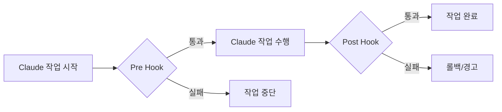
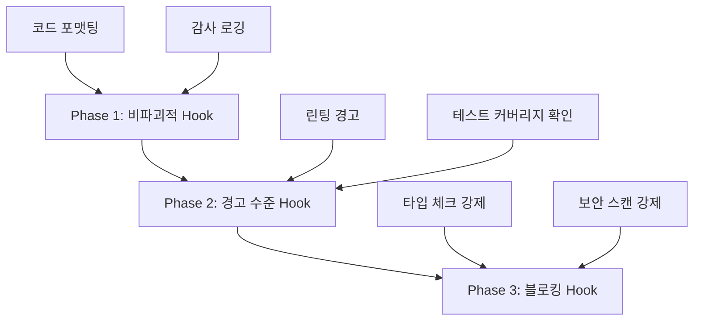
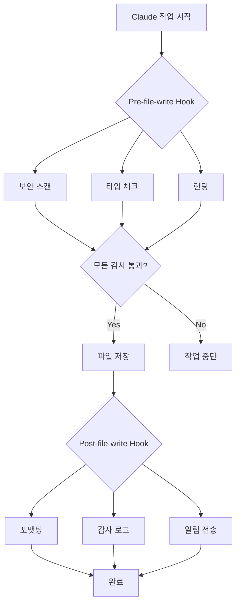

## 개요

AI 기반 코딩 어시스턴트가 생산성을 크게 향상시키지만, <strong>일관된 코드 품질과 규칙 준수</strong>를 보장하는 것은 여전히 어려운 과제입니다. Claude Code의 <strong>Hook 시스템</strong>은 이 문제를 해결하는 강력한 솔루션입니다.

Hook은 특정 워크플로우 단계에서 자동으로 실행되는 스크립트로, 코드 작성, 파일 저장, 커밋 전후 등 다양한 시점에 커스텀 검증 로직을 삽입할 수 있습니다. 이를 통해 코드 리뷰, 테스트, 보안 스캔, 규정 준수 등을 완전히 자동화할 수 있습니다.

### 이 글에서 다룰 내용

- Hook 시스템의 핵심 개념과 동작 원리
- 다양한 Hook 타입과 활용 사례
- 코딩 규칙 자동 검증 구현
- 자동화된 코드 리뷰 프로세스 구축
- CI/CD 파이프라인 통합 전략
- 실전 예제와 모범 사례

## Hook 시스템 이해하기

### Hook이란?

Claude Code Hook은 <strong>워크플로우의 특정 시점에서 실행되는 사용자 정의 스크립트</strong>입니다. Git hook과 유사한 개념이지만, Claude의 AI 코딩 워크플로우에 특화되어 있습니다.



### Hook 실행 메커니즘

Hook은 종료 코드(exit code)로 Claude의 동작을 제어합니다:

```bash
# 성공 (작업 계속)
exit 0

# 실패 (작업 중단)
exit 1

# 경고 (작업 계속하되 경고 표시)
exit 2
```

### Hook 디렉토리 구조

```
.claude/
└── hooks/
    ├── pre-file-write.sh      # 파일 저장 전 실행
    ├── post-file-write.py     # 파일 저장 후 실행
    ├── pre-commit.sh          # 커밋 전 실행
    ├── post-commit.py         # 커밋 후 실행
    └── code-review.js         # 커스텀 리뷰 Hook
```

## Hook 설정 및 구성

### 1. 기본 Hook 생성

가장 간단한 Hook부터 시작해 봅시다:

````bash
#!/bin/bash
# .claude/hooks/pre-file-write.sh

# Hook 입력 데이터는 JSON으로 전달됨
input=$(cat)

# 파일 경로 추출
file_path=$(echo "$input" | jq -r '.file_path')

echo "Checking file: $file_path"

# 민감한 파일 보호
if [[ "$file_path" == *".env"* ]] || [[ "$file_path" == *"credentials"* ]]; then
    echo "Error: Cannot modify sensitive files"
    exit 1
fi

# 성공
exit 0
````

### 2. 실행 권한 설정

Hook 스크립트는 실행 가능해야 합니다:

```bash
chmod +x .claude/hooks/pre-file-write.sh

# 모든 Hook에 실행 권한 부여
chmod +x .claude/hooks/*.sh
chmod +x .claude/hooks/*.py
```

### 3. Hook 데이터 구조

Claude는 Hook에 JSON 형식으로 컨텍스트 정보를 전달합니다:

```json
{
  "file_path": "src/components/Button.tsx",
  "operation": "write",
  "content": "...",
  "metadata": {
    "timestamp": "2025-10-29T10:30:00Z",
    "user": "developer@example.com"
  }
}
```

## 코딩 규칙 자동 검증

### 1. TypeScript 타입 체크 Hook

```bash
#!/bin/bash
# .claude/hooks/typescript-check.sh

input=$(cat)
file_path=$(echo "$input" | jq -r '.file_path')

# TypeScript 파일만 검사
if [[ "$file_path" != *.ts ]] && [[ "$file_path" != *.tsx ]]; then
    exit 0
fi

echo "Running TypeScript type check..."

# 타입 체크 실행
npx tsc --noEmit "$file_path" 2>&1 | tee /tmp/tsc-output.txt

if [ ${PIPESTATUS[0]} -ne 0 ]; then
    echo "❌ Type check failed"
    cat /tmp/tsc-output.txt
    exit 1
fi

echo "✅ Type check passed"
exit 0
```

### 2. ESLint 린팅 Hook

```python
#!/usr/bin/env python3
# .claude/hooks/eslint-check.py

import sys
import json
import subprocess

def main():
    # 입력 데이터 읽기
    input_data = json.loads(sys.stdin.read())
    file_path = input_data.get('file_path', '')

    # JavaScript/TypeScript 파일만 검사
    if not (file_path.endswith('.js') or
            file_path.endswith('.ts') or
            file_path.endswith('.jsx') or
            file_path.endswith('.tsx')):
        sys.exit(0)

    print(f"Running ESLint on {file_path}...")

    # ESLint 실행
    result = subprocess.run(
        ['npx', 'eslint', file_path, '--format', 'json'],
        capture_output=True,
        text=True
    )

    if result.returncode != 0:
        lint_results = json.loads(result.stdout)

        # 에러 요약 출력
        for file_result in lint_results:
            for message in file_result.get('messages', []):
                severity = 'Error' if message['severity'] == 2 else 'Warning'
                print(f"{severity}: {message['message']} "
                      f"(line {message['line']}, col {message['column']})")

        sys.exit(1)

    print("✅ ESLint passed")
    sys.exit(0)

if __name__ == '__main__':
    main()
```

### 3. 코드 포맷팅 자동 적용

```bash
#!/bin/bash
# .claude/hooks/post-file-write.sh

input=$(cat)
file_path=$(echo "$input" | jq -r '.file_path')

# 지원되는 파일 확장자
if [[ "$file_path" =~ \.(js|ts|jsx|tsx|json|css|scss)$ ]]; then
    echo "Auto-formatting $file_path with Prettier..."

    npx prettier --write "$file_path"

    if [ $? -eq 0 ]; then
        echo "✅ Formatted successfully"
    else
        echo "⚠️  Formatting failed, but continuing..."
    fi
fi

exit 0
```

## 자동화 코드 리뷰 프로세스

### 1. 종합 코드 리뷰 Hook

```bash
#!/bin/bash
# .claude/hooks/comprehensive-review.sh

set -e

input=$(cat)
file_path=$(echo "$input" | jq -r '.file_path')

echo "🔍 Starting comprehensive code review for $file_path"

# 단계별 검증
declare -a checks=(
    "Security scan"
    "Type checking"
    "Linting"
    "Test coverage"
    "Documentation check"
)

# 1. 보안 스캔
echo "🔒 ${checks[0]}..."
if command -v semgrep &> /dev/null; then
    semgrep --config=auto "$file_path" --quiet
fi

# 2. 타입 체크
echo "📝 ${checks[1]}..."
if [[ "$file_path" =~ \.(ts|tsx)$ ]]; then
    npx tsc --noEmit "$file_path"
fi

# 3. 린팅
echo "✨ ${checks[2]}..."
if [[ "$file_path" =~ \.(js|ts|jsx|tsx)$ ]]; then
    npx eslint "$file_path"
fi

# 4. 테스트 커버리지 확인
echo "🧪 ${checks[3]}..."
test_file="${file_path/src/tests}"
test_file="${test_file/.ts/.test.ts}"

if [ ! -f "$test_file" ]; then
    echo "⚠️  Warning: No test file found at $test_file"
    # 경고만 하고 계속 진행
fi

# 5. 문서화 확인
echo "📚 ${checks[4]}..."
if [[ "$file_path" =~ \.(ts|tsx|js|jsx)$ ]]; then
    # JSDoc 주석 검사
    if ! grep -q "\/\*\*" "$file_path"; then
        echo "⚠️  Warning: No JSDoc comments found"
    fi
fi

echo "✅ Code review completed successfully"
exit 0
```

### 2. SOX/SOC2 감사 추적 Hook

```python
#!/usr/bin/env python3
# .claude/hooks/audit-trail.py

import sys
import json
import hashlib
from datetime import datetime
import os

AUDIT_LOG = '.claude/audit/trail.jsonl'

def main():
    # 입력 데이터
    input_data = json.loads(sys.stdin.read())

    # 감사 로그 디렉토리 생성
    os.makedirs(os.path.dirname(AUDIT_LOG), exist_ok=True)

    # 감사 엔트리 생성
    audit_entry = {
        'timestamp': datetime.utcnow().isoformat(),
        'operation': input_data.get('operation', 'unknown'),
        'file_path': input_data.get('file_path', ''),
        'user': os.environ.get('USER', 'unknown'),
        'content_hash': hashlib.sha256(
            input_data.get('content', '').encode()
        ).hexdigest(),
        'metadata': input_data.get('metadata', {})
    }

    # JSONL 형식으로 로그 추가
    with open(AUDIT_LOG, 'a') as f:
        f.write(json.dumps(audit_entry) + '\n')

    print(f"✅ Audit trail recorded: {audit_entry['timestamp']}")
    sys.exit(0)

if __name__ == '__main__':
    main()
```

### 3. Pull Request 자동 검증

```bash
#!/bin/bash
# .claude/hooks/pr-validation.sh

input=$(cat)
file_path=$(echo "$input" | jq -r '.file_path')

echo "🔍 PR Validation Checks"

# 체크리스트
declare -A checks=(
    ["Tests"]="npm test"
    ["Build"]="npm run build"
    ["Type Check"]="npm run typecheck"
    ["Lint"]="npm run lint"
)

failed=0

for check_name in "${!checks[@]}"; do
    echo ""
    echo "Running: $check_name"

    if eval "${checks[$check_name]}" > /tmp/check-output.txt 2>&1; then
        echo "✅ $check_name passed"
    else
        echo "❌ $check_name failed"
        cat /tmp/check-output.txt
        failed=1
    fi
done

if [ $failed -eq 1 ]; then
    echo ""
    echo "❌ PR validation failed. Please fix the issues before committing."
    exit 1
fi

echo ""
echo "✅ All PR validation checks passed"
exit 0
```

## CI/CD 통합 전략

### 1. GitHub Actions 통합

```yaml
# .github/workflows/claude-hooks.yml
name: Claude Code Hooks

on:
  pull_request:
    types: [opened, synchronize]

jobs:
  run-hooks:
    runs-on: ubuntu-latest

    steps:
      - uses: actions/checkout@v4

      - name: Setup Node.js
        uses: actions/setup-node@v4
        with:
          node-version: '20'

      - name: Install dependencies
        run: npm ci

      - name: Make hooks executable
        run: chmod +x .claude/hooks/*.sh

      - name: Run pre-commit hooks
        run: |
          for file in $(git diff --name-only origin/main); do
            if [ -f ".claude/hooks/pre-commit.sh" ]; then
              echo "{\"file_path\": \"$file\"}" | .claude/hooks/pre-commit.sh
            fi
          done

      - name: Run code review hook
        run: |
          for file in $(git diff --name-only origin/main); do
            if [ -f ".claude/hooks/code-review.sh" ]; then
              echo "{\"file_path\": \"$file\"}" | .claude/hooks/code-review.sh
            fi
          done
```

### 2. N8N 워크플로우 자동화

Hook 실행 결과를 N8N으로 전송하여 알림 자동화:

```bash
#!/bin/bash
# .claude/hooks/notify-n8n.sh

input=$(cat)
file_path=$(echo "$input" | jq -r '.file_path')

# N8N webhook URL (환경 변수에서 가져오기)
WEBHOOK_URL="${N8N_WEBHOOK_URL}"

if [ -z "$WEBHOOK_URL" ]; then
    echo "Warning: N8N_WEBHOOK_URL not set"
    exit 0
fi

# 알림 페이로드 생성
payload=$(cat <<EOF
{
  "event": "code_review_completed",
  "file": "$file_path",
  "timestamp": "$(date -u +%Y-%m-%dT%H:%M:%SZ)",
  "status": "success"
}
EOF
)

# N8N으로 전송
curl -X POST "$WEBHOOK_URL" \
  -H "Content-Type: application/json" \
  -d "$payload" \
  --silent

exit 0
```

### 3. Telegram 알림 통합

```python
#!/usr/bin/env python3
# .claude/hooks/telegram-notify.py

import sys
import json
import os
import requests

def send_telegram_message(message):
    bot_token = os.environ.get('TELEGRAM_BOT_TOKEN')
    chat_id = os.environ.get('TELEGRAM_CHAT_ID')

    if not bot_token or not chat_id:
        print("Warning: Telegram credentials not set")
        return

    url = f"https://api.telegram.org/bot{bot_token}/sendMessage"
    payload = {
        'chat_id': chat_id,
        'text': message,
        'parse_mode': 'Markdown'
    }

    try:
        requests.post(url, json=payload, timeout=5)
    except Exception as e:
        print(f"Warning: Failed to send Telegram notification: {e}")

def main():
    input_data = json.loads(sys.stdin.read())
    file_path = input_data.get('file_path', 'unknown')

    message = f"""
🔍 *Code Review Completed*

📁 File: `{file_path}`
✅ All checks passed
🕐 {input_data.get('metadata', {}).get('timestamp', 'N/A')}
"""

    send_telegram_message(message)
    sys.exit(0)

if __name__ == '__main__':
    main()
```

## 실전 예제와 패턴

### 1. 점진적 Hook 도입 전략

Hook을 한 번에 모두 적용하면 워크플로우가 느려질 수 있습니다. 점진적 도입 전략:



**Phase 1 구현:**

```bash
#!/bin/bash
# .claude/hooks/phase1-gentle.sh

input=$(cat)

# 항상 성공하지만 정보 제공
echo "ℹ️  Code formatting applied"
echo "ℹ️  Audit trail recorded"

exit 0
```

**Phase 2 구현:**

```bash
#!/bin/bash
# .claude/hooks/phase2-warnings.sh

input=$(cat)
file_path=$(echo "$input" | jq -r '.file_path')

# 린팅 실행하지만 실패해도 계속
npx eslint "$file_path" || echo "⚠️  Linting issues found"

# 경고 코드로 종료
exit 2
```

**Phase 3 구현:**

```bash
#!/bin/bash
# .claude/hooks/phase3-blocking.sh

input=$(cat)
file_path=$(echo "$input" | jq -r '.file_path')

# 타입 체크 실패 시 중단
npx tsc --noEmit "$file_path"

if [ $? -ne 0 ]; then
    echo "❌ Type check failed - blocking operation"
    exit 1
fi

exit 0
```

### 2. Hook 조건부 실행

모든 파일에 모든 Hook을 실행할 필요는 없습니다:

```bash
#!/bin/bash
# .claude/hooks/conditional-hooks.sh

input=$(cat)
file_path=$(echo "$input" | jq -r '.file_path')

# 조건별 Hook 실행
case "$file_path" in
    *.ts|*.tsx)
        echo "Running TypeScript checks..."
        .claude/hooks/typescript-check.sh <<< "$input"
        ;;
    *.py)
        echo "Running Python checks..."
        .claude/hooks/python-check.sh <<< "$input"
        ;;
    *.md)
        echo "Running Markdown lint..."
        .claude/hooks/markdown-lint.sh <<< "$input"
        ;;
    *)
        echo "No specific checks for this file type"
        ;;
esac

exit 0
```

### 3. Hook 성능 최적화

Hook이 너무 느리면 개발 경험이 저해됩니다:

```bash
#!/bin/bash
# .claude/hooks/optimized-hook.sh

input=$(cat)
file_path=$(echo "$input" | jq -r '.file_path')

# 타임아웃 설정 (5초)
TIMEOUT=5

# 병렬 실행
(
    timeout $TIMEOUT npx eslint "$file_path" &
    timeout $TIMEOUT npx prettier --check "$file_path" &
    wait
) 2>/dev/null

if [ $? -eq 124 ]; then
    echo "⚠️  Hook timeout - skipping detailed checks"
    exit 2
fi

exit 0
```

### 4. 캐싱을 활용한 최적화

```bash
#!/bin/bash
# .claude/hooks/cached-checks.sh

input=$(cat)
file_path=$(echo "$input" | jq -r '.file_path')
content=$(echo "$input" | jq -r '.content')

# 콘텐츠 해시 생성
content_hash=$(echo "$content" | sha256sum | cut -d' ' -f1)
cache_dir=".claude/cache"
cache_file="$cache_dir/$content_hash"

mkdir -p "$cache_dir"

# 캐시 확인
if [ -f "$cache_file" ]; then
    cache_result=$(cat "$cache_file")
    echo "✅ Using cached result: $cache_result"
    exit 0
fi

# 실제 검사 수행
echo "Running checks..."
npx eslint "$file_path"

if [ $? -eq 0 ]; then
    echo "passed" > "$cache_file"
    exit 0
else
    echo "failed" > "$cache_file"
    exit 1
fi
```

## 모범 사례 및 팁

### 1. Hook 설계 원칙

<strong>SOLID 원칙을 Hook에 적용:</strong>

- <strong>Single Responsibility</strong>: 하나의 Hook은 하나의 책임만
- <strong>Open/Closed</strong>: 확장에는 열려있고 수정에는 닫혀있게
- <strong>Liskov Substitution</strong>: Hook을 교체 가능하게 설계
- <strong>Interface Segregation</strong>: 필요한 데이터만 요구
- <strong>Dependency Inversion</strong>: 구체적 구현이 아닌 추상화에 의존

### 2. 오류 처리 전략

```bash
#!/bin/bash
# .claude/hooks/error-handling.sh

set -euo pipefail  # 오류 발생 시 즉시 중단

input=$(cat)

# 에러 로그 파일
ERROR_LOG=".claude/logs/hook-errors.log"
mkdir -p "$(dirname "$ERROR_LOG")"

# 에러 핸들러
handle_error() {
    local exit_code=$?
    local line_num=$1

    echo "Error on line $line_num (exit code: $exit_code)" | tee -a "$ERROR_LOG"

    # 에러 상세 정보 로깅
    echo "Input data:" >> "$ERROR_LOG"
    echo "$input" >> "$ERROR_LOG"
    echo "---" >> "$ERROR_LOG"

    exit 1
}

# 에러 트랩 설정
trap 'handle_error $LINENO' ERR

# Hook 로직...
echo "Executing hook logic..."

exit 0
```

### 3. 테스트 가능한 Hook 작성

```bash
#!/bin/bash
# .claude/hooks/testable-hook.sh

# 테스트 모드 지원
TEST_MODE=${TEST_MODE:-false}

if [ "$TEST_MODE" = "true" ]; then
    # 테스트용 입력 데이터
    input='{"file_path": "test.ts", "content": "// test"}'
else
    # 실제 입력 데이터
    input=$(cat)
fi

# 로직 실행
file_path=$(echo "$input" | jq -r '.file_path')
echo "Processing: $file_path"

exit 0
```

Hook 테스트:

```bash
# 테스트 실행
TEST_MODE=true .claude/hooks/testable-hook.sh

# 실제 데이터로 테스트
echo '{"file_path": "src/app.ts"}' | .claude/hooks/testable-hook.sh
```

### 4. 문서화 템플릿

```bash
#!/bin/bash
# .claude/hooks/example-hook.sh

# Hook 정보
# Name: Example Hook
# Purpose: 파일 저장 전 기본 검증 수행
# Trigger: pre-file-write
# Exit Codes:
#   0 - Success (작업 계속)
#   1 - Error (작업 중단)
#   2 - Warning (작업 계속하되 경고 표시)
#
# Input JSON Schema:
# {
#   "file_path": "string",
#   "operation": "string",
#   "content": "string",
#   "metadata": {}
# }
#
# Environment Variables:
#   HOOK_DEBUG - Set to "true" for verbose output
#
# Dependencies:
#   - jq (JSON parser)
#   - bash 4.0+
#
# Author: Your Name
# Last Updated: 2025-10-29

# 디버그 모드
DEBUG=${HOOK_DEBUG:-false}

if [ "$DEBUG" = "true" ]; then
    set -x
fi

# Hook 로직...
input=$(cat)
echo "Hook executed successfully"

exit 0
```

### 5. 보안 고려사항

```bash
#!/bin/bash
# .claude/hooks/secure-hook.sh

set -euo pipefail

input=$(cat)

# 1. 입력 검증
if ! echo "$input" | jq empty 2>/dev/null; then
    echo "Error: Invalid JSON input"
    exit 1
fi

# 2. 경로 주입 방지
file_path=$(echo "$input" | jq -r '.file_path')

# 절대 경로만 허용하거나 상대 경로를 안전하게 정규화
if [[ "$file_path" =~ \.\. ]]; then
    echo "Error: Path traversal detected"
    exit 1
fi

# 3. 민감한 데이터 로깅 방지
# 콘텐츠는 로그에 남기지 않음
echo "Processing file: $(basename "$file_path")"

# 4. 환경 변수 검증
if [ -n "${GITHUB_TOKEN:-}" ]; then
    echo "Warning: Sensitive env var detected, masking in logs"
fi

# 5. 임시 파일 안전하게 처리
temp_file=$(mktemp)
trap "rm -f $temp_file" EXIT

# Hook 로직...

exit 0
```

## 트러블슈팅 가이드

### 일반적인 문제와 해결책

#### 1. Hook이 실행되지 않음

<strong>증상:</strong> Hook 스크립트가 전혀 실행되지 않음

<strong>해결책:</strong>

```bash
# 실행 권한 확인
ls -la .claude/hooks/

# 실행 권한 부여
chmod +x .claude/hooks/*.sh

# Hook 디렉토리 확인
cat .claude/settings.json | jq '.hooks'
```

#### 2. Hook이 느림

<strong>증상:</strong> Hook 실행으로 워크플로우가 크게 느려짐

<strong>해결책:</strong>

```bash
# Hook 실행 시간 측정
time echo '{"file_path": "test.ts"}' | .claude/hooks/slow-hook.sh

# 병렬 실행으로 최적화
# Before: 순차 실행 (느림)
check1.sh && check2.sh && check3.sh

# After: 병렬 실행 (빠름)
check1.sh & check2.sh & check3.sh & wait
```

#### 3. Hook 디버깅

```bash
#!/bin/bash
# .claude/hooks/debug-hook.sh

# 디버그 출력을 파일로 저장
DEBUG_LOG=".claude/logs/hook-debug.log"
mkdir -p "$(dirname "$DEBUG_LOG")"

{
    echo "=== Hook Debug Log ==="
    echo "Timestamp: $(date)"
    echo "Input:"
    cat
} | tee -a "$DEBUG_LOG"

# 입력 데이터 파싱
input=$(tail -n 1 "$DEBUG_LOG")

echo "Parsed input: $input" >> "$DEBUG_LOG"

exit 0
```

#### 4. JSON 파싱 오류

```bash
#!/bin/bash
# .claude/hooks/safe-json-parsing.sh

input=$(cat)

# jq가 설치되어 있는지 확인
if ! command -v jq &> /dev/null; then
    echo "Error: jq is not installed"
    exit 1
fi

# JSON 유효성 검증
if ! echo "$input" | jq empty 2>/dev/null; then
    echo "Error: Invalid JSON input"
    echo "Received: $input"
    exit 1
fi

# 안전하게 값 추출
file_path=$(echo "$input" | jq -r '.file_path // "unknown"')

exit 0
```

## 실전 시나리오: 엔터프라이즈 환경 구축

### 완전한 Hook 시스템 아키텍처



### 통합 Hook 스크립트

```bash
#!/bin/bash
# .claude/hooks/enterprise-review.sh

set -euo pipefail

input=$(cat)
file_path=$(echo "$input" | jq -r '.file_path')

LOG_DIR=".claude/logs/$(date +%Y-%m-%d)"
mkdir -p "$LOG_DIR"

echo "🚀 Enterprise Code Review Pipeline"
echo "━━━━━━━━━━━━━━━━━━━━━━━━━━━━━━━━"

# 1단계: 보안 스캔
echo "🔒 Security Scan..."
if command -v semgrep &> /dev/null; then
    semgrep --config=auto "$file_path" --json > "$LOG_DIR/security.json"
    echo "✅ Security scan completed"
else
    echo "⚠️  Semgrep not installed, skipping"
fi

# 2단계: 정적 분석
echo "📊 Static Analysis..."
if [[ "$file_path" =~ \.(ts|tsx)$ ]]; then
    npx tsc --noEmit "$file_path" 2>&1 | tee "$LOG_DIR/typecheck.log"
    echo "✅ Type check completed"
fi

# 3단계: 코드 품질
echo "✨ Code Quality Check..."
if command -v sonar-scanner &> /dev/null; then
    sonar-scanner -Dsonar.sources="$file_path" > "$LOG_DIR/sonar.log"
    echo "✅ SonarQube analysis completed"
fi

# 4단계: 테스트 커버리지
echo "🧪 Test Coverage..."
npm run test:coverage -- "$file_path" > "$LOG_DIR/coverage.log" 2>&1 || true

# 5단계: 감사 추적
echo "📝 Audit Trail..."
python3 .claude/hooks/audit-trail.py <<< "$input"

# 6단계: 결과 요약
echo ""
echo "📋 Review Summary"
echo "━━━━━━━━━━━━━━━━━━━━━━━━━━━━━━━━"
echo "File: $file_path"
echo "Timestamp: $(date -u +%Y-%m-%dT%H:%M:%SZ)"
echo "Logs: $LOG_DIR/"
echo ""
echo "✅ All checks passed"

exit 0
```

## 결론

Claude Code Hook 시스템은 AI 기반 코딩 워크플로우에 <strong>일관성, 품질, 보안</strong>을 보장하는 강력한 도구입니다. 이 글에서 다룬 내용을 요약하면:

### 핵심 요점

1. <strong>Hook은 워크플로우 자동화의 핵심</strong>
   - 특정 시점에 사용자 정의 로직 삽입
   - 종료 코드로 Claude 동작 제어
   - 다양한 언어와 도구 지원

2. <strong>점진적 도입이 중요</strong>
   - Phase 1: 비파괴적 Hook (정보 제공)
   - Phase 2: 경고 수준 Hook (문제 지적)
   - Phase 3: 블로킹 Hook (작업 중단)

3. <strong>성능과 보안 고려</strong>
   - 병렬 실행으로 속도 향상
   - 캐싱으로 중복 작업 방지
   - 입력 검증과 안전한 처리

4. <strong>실전 적용 패턴</strong>
   - 조건부 실행으로 효율성 향상
   - CI/CD 통합으로 자동화 확장
   - 알림 시스템으로 투명성 확보

### 다음 단계

1. 프로젝트에 기본 Hook 설정
2. 코딩 규칙 자동 검증 구현
3. CI/CD 파이프라인 통합
4. 팀 전체로 확산 및 개선

Hook 시스템을 효과적으로 활용하면 코드 품질은 향상되고, 리뷰 시간은 단축되며, 규정 준수는 자동화됩니다. 작은 Hook부터 시작하여 점진적으로 확장해 나가세요.

## 참고 자료

- [Claude Code Hooks Implementation Guide](https://medium.com/@richardhightower/claude-code-hooks-implementation-guide-audit-system-03763748700f)
- [Complete Guide: Creating Claude Code Hooks](https://suiteinsider.com/complete-guide-creating-claude-code-hooks/)
- [6 Easy Ways to Level Up Claude Code](https://blog.logrocket.com/6-easy-ways-to-level-up-claude-code/)
- [Claude Code Documentation Map](https://simonwillison.net/2025/Oct/24/claude-code-docs-map/)
- [GitHub Actions with Claude Code](https://skywork.ai/blog/claude-code-plus-ci-cd-integration-setup/)
