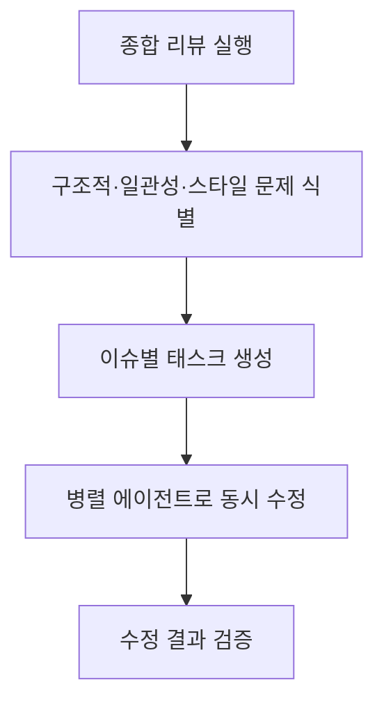
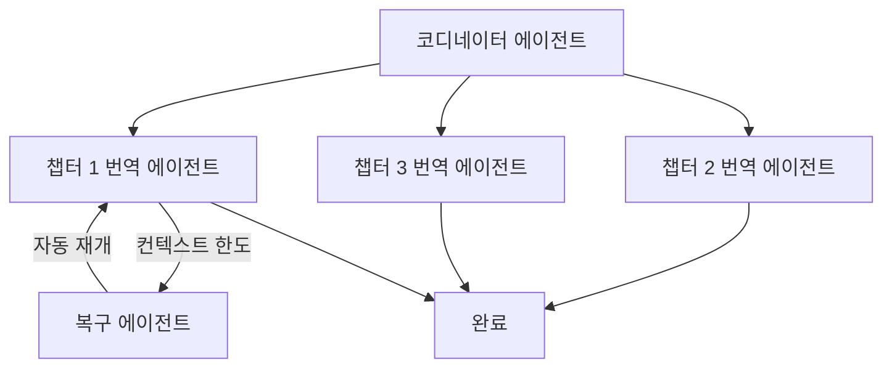

# Claude Code /insights 체험기: 4,516개 메시지가 말해주는 나의 AI 코딩 패턴

"내가 Claude Code를 잘 쓰고 있는 걸까?"

AI 코딩 도구를 매일 사용하면서도 이 질문에 명확히 답하기는 어려웠습니다. 그런데 Claude Code에 `/insights`라는 숨겨진 보석 같은 기능이 있다는 걸 알게 되었습니다. 실제 사용 데이터를 기반으로 나의 워크플로우를 객관적으로 진단해주는 기능입니다.

이 글에서는 실제 프로젝트에서 `/insights`를 실행한 결과를 낱낱이 공개하고, 거기서 얻은 인사이트와 실전 팁을 공유합니다.

## /insights란 무엇인가?

`/insights`는 Claude Code v2.1에서 도입된 사용 패턴 분석 기능입니다. 로컬에 저장된 사용 데이터를 기반으로 다음을 분석해줍니다:

- <strong>사용 통계</strong>: 메시지 수, 세션 수, 파일 수정 내역
- <strong>잘 되고 있는 것</strong>: 효과적으로 활용 중인 기능과 패턴
- <strong>방해 요인</strong>: 생산성을 떨어뜨리는 병목 지점
- <strong>개선 제안</strong>: 바로 적용할 수 있는 실전 팁
- <strong>프로젝트 영역별 분석</strong>: 어떤 작업에 어떻게 쓰고 있는지

일종의 "AI 코딩 건강검진"이라고 생각하면 됩니다. 실행 방법도 간단합니다. Claude Code에서 `/insights`를 입력하면 끝입니다.

## 나의 실행 결과: 핵심 수치

> <strong>분석 기간</strong>: 2025-12-31 ~ 2026-02-03 (약 35일)
> <strong>환경</strong>: Claude Code v2.1.31

### 한눈에 보는 사용량

| 지표 | 수치 |
|------|------|
| 총 메시지 | <strong>4,516개</strong> |
| 총 세션 | <strong>1,042회</strong> |
| 파일 수정 | <strong>6,267개</strong> |
| 코드 변경량 | <strong>+1,046,046 / -109,155 라인</strong> |
| 활동 일수 | <strong>15일</strong> |
| 일평균 메시지 | <strong>301.1개</strong> |

숫자만 봐도 꽤 인상적입니다. 하루 평균 301개의 메시지를 Claude Code와 주고받았다는 건, 거의 풀타임으로 AI 페어 프로그래밍을 하고 있다는 뜻입니다. 100만 라인이 넘는 코드 추가는 소설 프로젝트와 블로그 콘텐츠 생성이 포함된 결과이기도 합니다.

### 도구 사용 Top 6

```
Read     ████████████████████████████ 11,798회
Edit     ████████████████████████   10,068회
Bash     ████████████████         6,334회
Write    ████████████             3,465회
Grep     ██████                   2,059회
TodoWrite ██████                  1,825회
```

Read와 Edit가 압도적입니다. 이는 Claude가 기존 코드를 충분히 읽고 이해한 뒤 수정하는 패턴, 즉 "이해 후 수정" 방식으로 작동하고 있다는 것을 보여줍니다. TodoWrite가 Top 6에 들어있다는 것도 흥미로운데, 이는 병렬 에이전트와 태스크 오케스트레이션을 적극 활용하고 있다는 증거입니다.

### 언어별 분포

| 언어 | 사용 횟수 | 비중 |
|------|-----------|------|
| Markdown | 5,862 | 39.5% |
| TypeScript | 4,540 | 30.6% |
| Rust | 2,096 | 14.1% |
| JavaScript | 1,406 | 9.5% |
| JSON | 678 | 4.6% |
| YAML | 304 | 2.0% |

Markdown이 1위인 것은 블로그 포스트와 소설 콘텐츠 작업이 상당 부분을 차지하기 때문입니다. TypeScript와 Rust를 합치면 전체의 약 45%로, 실제 개발 작업도 활발하게 이루어지고 있음을 알 수 있습니다.

## "잘 되고 있는 것" 분석

`/insights`가 꼽은 강점 3가지입니다.

### 1. 병렬 에이전트와 태스크 오케스트레이션

```
TodoWrite: 1,825회
TaskCreate: 1,276회
합계: 4,751회 (TodoWrite + TaskCreate + TaskUpdate)
```

저는 대규모 작업을 할 때 반드시 태스크 리스트를 먼저 만들고, 이를 병렬 에이전트에 분배하는 패턴을 사용합니다. `/insights`는 이를 "정교한 워크플로우(sophisticated workflow)"라고 평가했습니다.

실제 활용 예시:
- <strong>소설 프로젝트</strong>: 종합 리뷰 → 문제 식별 → 병렬로 여러 파일 동시 수정
- <strong>블로그 생성</strong>: 한국어 작성 → 일본어/영어/중국어 병렬 번역
- <strong>코드 리팩토링</strong>: 이슈 분석 → 태스크 분배 → 동시 수정

이 패턴의 핵심은 "계획 먼저, 실행은 병렬로"입니다.

### 2. 커스텀 슬래시 커맨드 활용

`/write-post` 같은 커스텀 슬래시 커맨드를 만들어 반복 작업을 자동화한 것도 높은 평가를 받았습니다. 블로그 포스트 하나를 작성하려면 리서치 → 한국어 작성 → 3개 언어 번역 → 이미지 생성 → 메타데이터 업데이트 등 10단계 이상의 작업이 필요한데, 이를 하나의 커맨드로 인코딩한 것입니다.

> "복잡한 다단계 콘텐츠 생성을 반복 가능한 원-커맨드 작업으로 변환"
> — /insights 분석 결과

### 3. 일본어 소설의 2단계 패턴

일본어 소설 프로젝트에서 사용한 워크플로우도 좋은 평가를 받았습니다:



"1인 AI 출판사"라는 표현이 인상적이었습니다. 플롯 홀을 찾고, 캐릭터 이름 일관성을 확인하고, 스타일 통일성을 점검한 뒤, 병렬로 여러 파일에 걸쳐 모든 문제를 수정하는 워크플로우입니다.

## "방해 요인" 분석

잘 되는 것만 있으면 좋겠지만, `/insights`는 냉정하게 문제점도 짚어줍니다.

### 컨텍스트 한도 — 가장 큰 병목

> "컨텍스트 한도로 인해 가장 야심찬 세션들이 중간에 종료"

이것이 가장 큰 문제였습니다. 특히 다음 작업에서 빈번하게 발생했습니다:

- <strong>소설 리뷰</strong>: 여러 권에 걸친 종합 리뷰 중 중단
- <strong>번역 작업</strong>: 대규모 번역 중 실행 중간에 끊김
- <strong>블로그 콘텐츠 생성</strong>: 초기 읽기/설정 단계에서 종료

핵심 원인은 <strong>"단일 세션에 너무 큰 작업을 할당하는 패턴"</strong>이었습니다. 모든 것을 한 번에 해결하려는 욕심이 오히려 비효율을 만들고 있었던 셈입니다.

### 에러 패턴 분석

| 에러 유형 | 발생 횟수 |
|-----------|-----------|
| Command Failed | 533건 |
| File Too Large | 293건 |
| Other | 151건 |
| File Changed | 62건 |
| Edit Failed | 37건 |
| File Not Found | 32건 |

"File Too Large" 에러가 293건이나 되는 것은 소설 프로젝트의 대용량 텍스트 파일 때문입니다. 이 데이터를 보고 파일 분할 전략의 필요성을 실감했습니다.

## "빠른 개선 제안" 분석

`/insights`가 제안한 Quick Wins는 매우 실용적이었습니다.

### 1. 체크포인팅 도입

> "헤드리스 모드에서 챕터/섹션별 체크포인팅으로 번역 및 콘텐츠 생성 실행"

장시간 작업이 중간에 끊기는 문제를 해결하려면, 각 단계를 완료할 때마다 진행 상황을 파일에 저장해야 합니다. 이렇게 하면 세션이 종료되더라도 다음 세션에서 이어서 작업할 수 있습니다.

```markdown
<!-- .claude/task-status.md 예시 -->
## 블로그 포스트 작성 진행 상황
- [x] 리서치 완료
- [x] 한국어 초안 작성
- [ ] 일본어 번역
- [ ] 영어 번역
- [ ] 중국어 번역
- [ ] 메타데이터 업데이트
```

### 2. 구조화된 체크포인트 파일

> "TodoWrite/TaskCreate 패턴을 구조화된 체크포인트 파일로 공식화"

이미 TodoWrite를 4,751회나 사용하고 있었지만, 이를 더 체계적인 파일 기반 체크포인트로 발전시키라는 제안이었습니다. 세션 간 상태 공유가 핵심입니다.

### 3. 자동 재개 설계

> "새 세션이 불완전한 작업을 감지하고 재개할 수 있도록 설계"

CLAUDE.md에 "Long-Running Tasks" 섹션을 추가하여, 장시간 작업 시 항상 중간 진행 상황을 파일에 저장하도록 규칙을 명시하라는 것입니다. 컨텍스트 한도에 접근하면 `.claude/task-status.md`에 완료/미완료 작업 요약을 기록하는 패턴입니다.

## 프로젝트 영역별 분석

`/insights`는 작업 유형별로도 상세한 분석을 제공합니다.

### 일본어 소설 & 품질 리뷰 (~3 세션)

출판 품질 평가, 디자인 정합성 리뷰, 다권 종합 리뷰를 수행했습니다. 구조적, 일관성, 스타일 문제를 체계적으로 식별하고 병렬로 수정하는 방식은 기존 출판 업계의 교정·교열 프로세스를 AI로 자동화한 것과 같습니다.

### 소설 번역 — 일본어 → 한국어 (~1 세션)

Claude Code의 병렬 에이전트 기능을 활용한 번역 작업입니다. 챕터별로 병렬 처리하여 속도를 높였지만, 컨텍스트 한도 문제로 세션이 잘리는 경우가 발생했습니다.

### 블로그 콘텐츠 생성 (~2 세션)

커스텀 `/write-post` 커맨드를 통한 블로그 포스트 생성입니다. 리서치 파일을 입력으로 받아 4개 언어 콘텐츠를 생성하는 자동화된 파이프라인이지만, 초기 설정 단계에서 컨텍스트가 소진되는 경우도 있었습니다.

### TypeScript & Rust 개발

TypeScript가 4,540회, Rust가 2,096회로 가장 활발한 개발 영역이었습니다. JavaScript(1,406회), HTML, CSS, JSON 작업도 포함됩니다. 웹 프론트엔드부터 시스템 프로그래밍까지 폭넓게 활용하고 있음을 보여줍니다.

### 멀티 파일 이슈 수정 & 유지보수 (~48 세션)

51건의 멀티 파일 변경이 이루어진 영역입니다. TodoWrite와 Task 관리 도구를 광범위하게 사용하며, 병렬 에이전트로 체계적 리뷰와 대량 수정을 수행했습니다. 이것이 전체 세션의 가장 큰 비중을 차지합니다.

## 시간대별 사용 패턴

```
오전 (06-12)  ████████           419건 (9.3%)
오후 (12-18)  █████████████████████████████████ 1,644건 (36.4%)
저녁 (18-24)  ██████████████████████████████████ 1,675건 (37.1%)
심야 (00-06)  ████████████████   778건 (17.2%)
```

오후와 저녁 시간대에 집중적으로 작업하는 패턴이 명확합니다. 심야에도 17%의 사용량이 있는 것은 AI의 장점 — 밤늦게까지 피로 없이 코딩 파트너를 유지할 수 있다는 점을 활용하고 있는 것이기도 합니다.

사용자 응답 시간도 흥미로운 데이터입니다:

| 지표 | 값 |
|------|------|
| 중앙값 | 155.0초 |
| 평균 | 368.1초 |
| 가장 많은 구간 | 2~5분 (621건) |

응답까지 중앙값 약 2.5분은, Claude의 응답을 검토하고 다음 지시를 내리는 데 걸리는 시간입니다. 완전 자동화가 아닌 "사람이 감독하는 AI 작업" 패턴이라고 할 수 있습니다.

## 미래를 위한 제안

`/insights`는 앞으로 시도해볼 만한 워크플로우도 제안했습니다.

### 자체 복구 병렬 번역 파이프라인



컨텍스트 한도에 도달하면 복구 에이전트가 자동으로 재개하는 "fire-and-forget" 패턴입니다. 현재는 수동으로 세션을 다시 시작해야 하지만, 이 패턴을 도입하면 완전한 자동화가 가능합니다.

### 소설 품질 검증 테스트 케이스

소설의 품질을 CI 파이프라인처럼 자동 검증하는 아이디어도 있었습니다:

- 캐릭터 이름 일관성 테스트
- 타임라인 검증 테스트
- 스타일 가이드 준수 테스트

코드에 단위 테스트가 있듯이, 창작 글쓰기에도 자동화된 품질 검증을 도입하자는 발상이 신선합니다.

## 실무 활용 팁

`/insights`를 통해 얻은 교훈을 정리하면 다음과 같습니다.

### 지금 바로 적용할 수 있는 것

1. <strong>큰 작업은 반드시 분할하세요</strong>: 단일 세션에 모든 것을 넣지 말고, 챕터/섹션/모듈 단위로 나누세요.

2. <strong>체크포인트를 파일로 남기세요</strong>: `task-status.md` 같은 파일을 만들어 진행 상황을 기록하면, 세션이 끊겨도 이어서 작업할 수 있습니다.

3. <strong>커스텀 슬래시 커맨드를 만드세요</strong>: 반복 작업이 있다면 `/write-post`처럼 커맨드로 인코딩하세요. 한 번 만들면 계속 재사용할 수 있습니다.

4. <strong>병렬 에이전트를 적극 활용하세요</strong>: `TodoWrite` → `TaskCreate` 패턴으로 작업을 분배하면 효율이 크게 올라갑니다.

### /insights를 최대한 활용하는 방법

1. <strong>정기적으로 실행하세요</strong>: 한 달에 한 번 정도 `/insights`를 실행하면 작업 패턴의 변화를 추적할 수 있습니다.

2. <strong>CLAUDE.md에 반영하세요</strong>: `/insights`가 제안한 개선사항을 CLAUDE.md에 기록하면, Claude Code가 자동으로 그 규칙을 따릅니다.

3. <strong>에러 패턴을 주시하세요</strong>: "File Too Large"나 "Command Failed" 같은 에러가 많다면 워크플로우를 조정할 필요가 있습니다.

4. <strong>HTML 리포트를 활용하세요</strong>: `/insights`는 상세한 HTML 리포트도 생성합니다. 시각화된 데이터로 더 깊은 분석이 가능합니다.

## 다른 개발자에게 추천하는 이유

`/insights`를 실행한 뒤 가장 크게 느낀 점은, <strong>"내가 AI를 어떻게 쓰는지 모르면서 잘 쓰고 있다고 착각하고 있었다"</strong>는 것입니다.

데이터 기반의 객관적 진단은 다음과 같은 가치를 줍니다:

- <strong>숨겨진 병목 발견</strong>: 컨텍스트 한도 문제를 인식하지 못했다면, 같은 실수를 반복했을 것입니다.
- <strong>효과적인 패턴 강화</strong>: 병렬 에이전트 활용이 실제로 효과적이라는 확인은 자신감으로 이어집니다.
- <strong>구체적 개선 방향</strong>: "더 잘 쓰세요"가 아니라 "체크포인팅을 도입하세요"라는 구체적인 액션 아이템을 제시합니다.

AI 코딩 도구를 사용하는 모든 개발자에게 `/insights` 실행을 추천합니다. 5분이면 실행되지만, 거기서 얻는 인사이트는 앞으로의 워크플로우를 근본적으로 바꿀 수 있습니다.

## 마치며

Claude Code `/insights`는 단순한 통계 기능이 아닙니다. AI 코딩 도구와의 협업 방식을 데이터로 보여주고, 구체적인 개선 방향을 제시하는 <strong>AI 워크플로우 코치</strong>입니다.

4,516개의 메시지, 1,042개의 세션, 6,267개의 파일 수정 — 이 숫자들이 말해주는 것은 단순히 "많이 썼다"가 아니라, "어떻게 쓰고 있고, 어디를 개선하면 더 나아질 수 있는가"입니다.

아직 `/insights`를 실행해보지 않으셨다면, 지금 Claude Code를 열고 `/insights`를 입력해보세요. 자신의 AI 코딩 패턴을 객관적으로 마주하는 것, 그것이 더 나은 개발자가 되는 첫걸음입니다.

## 참고 자료

- [Claude Code 공식 문서](https://docs.anthropic.com/en/docs/claude-code)
- [Claude Code Best Practices](https://docs.anthropic.com/en/docs/claude-code/best-practices)
- [Claude Code CLI 마이그레이션 가이드](/ko/blog/claude-code-cli-migration-guide)
