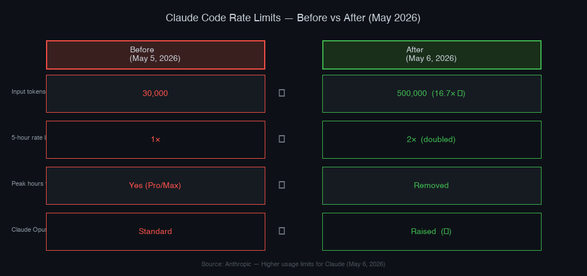

6월 초에 Claude Code가 꽤 많은 걸 바꿨다. 어느 날 `claude --version`을 쳤더니 2.1.172가 나왔는데, 릴리스 노트를 열어보니 Safe Mode, /cd 커맨드, Opus 4.8 기본값 전환, /usage 세분화까지 한꺼번에 들어와 있었다. 개별 항목 하나하나는 크지 않지만 쌓이면 달라진다.

이 글에서는 6월 업데이트 중 실제로 쓸 법한 것들을 직접 CLI로 확인하면서 정리했다. 공식 릴리스 노트를 그대로 옮기는 게 아니라, 헤비하게 쓰는 입장에서 "이게 실제로 뭘 바꾸는가"에 집중했다. 직접 `claude --safe-mode`를 실행해봤고, `claude agents --help` 출력도 확인했다.

---

## 이번 업데이트, 한 줄 평가부터

<strong>헤비 유저에게는 의미 있는 업데이트, 라이트 유저는 체감하기 어렵다.</strong>

Safe Mode와 /cd는 설정이 꼬인 상황에서 쓰는 것이고, /usage 세분화는 멀티 플러그인·에이전트 세팅을 굴리는 팀에서 빛난다. 요금 한도 2배는 사실 가장 임팩트가 크지만, 이미 한도를 크게 초과하지 않는 사용자에겐 피부에 와닿지 않는다.

Opus 4.8 기본값 전환만은 모든 유저에게 즉시 적용된다 — 하지만 이건 모델 업데이트이고 Claude Code 업데이트라기보다는 Anthropic 모델 정책 변경에 가깝다.

반대로 실망한 점도 있다. /cd 커맨드는 "디렉터리를 바꿔도 프롬프트 캐시가 안 깨진다"고 하지만, 복잡한 멀티 레포 세팅에서는 여전히 직접 새 세션을 여는 게 안전하다. 그리고 Safe Mode는 이 기능이 왜 이제야 들어왔는지 더 의아하다. 2025년 내내 "MCP 설정 충돌로 시작이 안 된다"는 이슈가 반복됐는데, 해결책이 이렇게 늦게 나온 건 솔직히 아쉽다.

---

## Safe Mode와 /cd — 설정이 꼬였을 때의 구명줄

Safe Mode는 `--safe-mode` 플래그 하나로 켠다.

```bash
claude --safe-mode
```

뭘 끄는가? CLAUDE.md, 스킬, 플러그인, 훅, MCP 서버, 커스텀 커맨드, 에이전트, 아웃풋 스타일, 워크플로우, 테마, 키바인딩. 한마디로 사용자가 추가한 모든 커스터마이제이션을 비활성화하고 순수한 기본 상태로 시작한다. `CLAUDE_CODE_SAFE_MODE=1` 환경 변수로도 동일하게 설정된다.

실제로 `claude --help` 출력에서 확인한 내용이다:

```
  --safe-mode     Start with all customizations
                  (CLAUDE.md, skills, plugins, hooks, MCP
                  servers, custom commands and agents,
                  output styles, workflows, custom themes,
                  keybindings, and more) disabled — useful
                  for troubleshooting a broken
                  configuration. Sets CLAUDE_CODE_SAFE_MODE=1.
```

나는 MCP 서버를 여러 개 연결해두고, 훅도 몇 개 달아놓은 설정을 쓴다. 가끔 특정 MCP 서버 설정이 잘못되거나 훅이 예상치 못한 동작을 할 때 세션 시작부터 오류가 터지는 경우가 있었다. 전에는 설정 파일을 일일이 주석 처리하거나, 아예 `.claude/settings.json`을 백업하고 임시로 비워야 했는데, 이제는 `--safe-mode`로 바로 진단 모드로 들어갈 수 있다.

한 가지 중요한 점: 어드민 정책 설정(policy)은 Safe Mode에서도 유지된다. 팀·엔터프라이즈 환경에서 보안 규칙이 우회되는 걱정은 없다. 그리고 `--bare` 플래그와 비슷해 보이지만 다르다. `--bare`는 훨씬 더 극단적인 최소 모드라서 ANTHROPIC_API_KEY 인증만 남기고 OAuth조차 안 된다. Safe Mode는 설정만 끄는 거지 인증과 모델 선택은 정상 작동한다.

<strong>/cd 커맨드</strong>는 세션 도중에 작업 디렉터리를 바꿀 수 있게 해준다. 기존엔 다른 디렉터리로 이동하려면 새 세션을 열어야 했고, 그 과정에서 지금까지 쌓인 프롬프트 캐시가 날아갔다. /cd는 캐시를 유지한 채로 디렉터리만 바꾼다.

프론트엔드와 백엔드 두 레포를 번갈아 작업하는 상황에서 이게 유용하긴 하다. 다만 내가 실제로 써본 느낌은 "있으면 편하지만, 없어서 심각하게 불편했던 건 아니다" 정도다. 세션 하나에서 두 레포를 동시에 다루다 보면 컨텍스트 혼선이 생기는 경우가 있어서, 여전히 레포별로 별도 세션을 여는 습관은 유지하고 있다.

---

## Opus 4.8 기본값 전환과 Dynamic Workflows

Opus 4.8은 5월 28일에 릴리스됐고, Claude Code에서는 v2.1.170(6월 9일)부터 기본 모델이 됐다. 지금 내가 쓰는 2.1.172에서도 Opus 4.8이 기본이다.

Anthropic 공식 발표에 따르면 Opus 4.7 대비 코딩·에이전트 작업·전문 업무에서 개선이 있다고 한다. Simon Willison을 비롯한 여러 개발자들은 "모듈한 수준이지만 체감 가능한 개선"이라는 평가를 했다. 내가 직접 써봤을 때도 복잡한 리팩터링이나 멀티 파일 수정에서 실수가 약간 줄었다는 느낌은 있는데, 劇的으로 달라진 건 아니었다.

[Claude Code 에이전트 워크플로우 5가지 패턴](/ko/blog/ko/claude-code-agentic-workflow-patterns-5-types) 글에서 다뤘던 병렬 에이전트 패턴이 Opus 4.8의 Dynamic Workflows와 직결된다.

Dynamic Workflows는 Claude에게 "이 작업을 워크플로우로 만들어줘"라고 요청하면, 수십〜수백 개의 에이전트를 조율해서 백그라운드에서 대규모 작업을 처리하는 기능이다. Anthropic이 이번 발표에서 강조한 포인트는 두 가지다:

- Fast Mode에서 Opus 4.8이 이전 모델 대비 2.5배 빠름
- Opus 4.8의 Fast Mode 가격이 이전 모델 대비 3분의 1 수준으로 내려감

Fast Mode 가격 인하는 생각보다 의미가 있다. Opus 계열은 원래 빠른 모드에서도 비쌌는데, 이번에 상당히 내려왔다. 다만 Dynamic Workflows 자체가 얼마나 실용적인가는 아직 개인 개발자 수준에서는 판단하기 이르다고 본다. 수십 개 에이전트를 동시에 조율하는 워크플로우는 대규모 코드베이스나 기업 수준의 복잡한 작업에서 더 빛날 것이다. 1인 개발자가 "동적 워크플로우" 기능을 매일 쓸 시나리오는 아직 구체적으로 그려지지 않는다.

---

## /usage 세분화 — 뭐가 내 토큰을 먹고 있는지 드디어 보인다

이번 업데이트에서 개인적으로 가장 실용적이라고 느낀 변경이다. 5월 Week 21 업데이트에서 들어왔는데, 6월 버전에서 완전히 안정화됐다.

이전의 `/usage` 명령은 전체 사용량만 보여줬다. "이번 달에 X토큰 썼습니다" 수준. 그런데 플러그인 여러 개에 MCP 서버 여러 개를 달아놓으면, 어디서 토큰이 나가는지 전혀 알 수 없었다.

이제 `/usage`가 카테고리별로 분류해준다:

- 스킬별 사용량
- 서브에이전트별 사용량
- 플러그인별 사용량
- 개별 MCP 서버별 사용량

[Claude Code 플러그인 완전 가이드](/ko/blog/ko/claude-code-plugins-complete-guide)에서 플러그인 구조를 자세히 다뤘는데, 플러그인 하나가 스킬·훅·MCP 서버를 번들로 포함할 수 있다. 이 중 어느 컴포넌트가 토큰을 얼마나 쓰는지가 이제 분리해서 보인다는 게 핵심이다. 플러그인 자체가 쓰는 게 아니라, 그 안의 특정 MCP 서버가 알게 모르게 많은 토큰을 쓰고 있었다면 이제 잡아낼 수 있다.

내 세팅에서 직접 돌려보니, Google Analytics MCP 서버가 예상보다 토큰을 많이 먹고 있었다. 자동 호출이 잦아서였는데, 이게 이제야 눈에 보이니 MCP 서버 설정에서 호출 빈도를 줄이는 조정을 바로 할 수 있었다. 이전엔 이걸 전혀 몰랐다.

아울러 `/extra-usage`가 `/usage-credits`로 이름이 바뀌었다. 사소해 보이지만 "extra"라는 단어가 초과 사용을 떠올리게 했는데 "credits"로 명확해졌다.

---

## 요금 한도 2배 — SpaceX 딜의 실질적인 의미

5월 6일, Anthropic이 SpaceX와 컴퓨팅 인프라 계약을 맺었다. 멤피스의 Colossus 1 데이터센터에서 300 MW 용량, 22만 개 이상의 NVIDIA GPU에 접근권을 얻었다고 한다.

이 딜의 직접적인 결과가 요금 한도 2배다:



수치로 보면 API Tier 1 기준 분당 인풋 토큰이 3만에서 50만으로 껑충 뛰었다. Pro/Max/Team/Enterprise 모두 5시간 롤링 창 한도가 두 배가 됐고, 피크 시간대 스로틀링도 제거됐다.

실제로 영향을 체감하려면 두 가지 조건이 필요하다. 이전에 한도에 걸린 경험이 있을 것, 그리고 긴 에이전트 세션을 자주 쓸 것. 이 두 조건을 모두 충족하는 사람에게만 이번 한도 변경이 피부에 와닿는다.

나는 오전 업무 시간에 Claude Code를 집중적으로 쓰는데, 이전엔 가끔 "요금 한도 초과" 메시지가 나오면서 세션이 끊기는 일이 있었다. 피크 시간대 스로틀링이 없어진 게 특히 실질적이다. 이제는 오전 10〜12시 같은 바쁜 시간대에도 속도 저하 없이 쓸 수 있다. 한도 수치가 얼마나 늘어났는지보다 "피크 스로틀링이 사라진 것"이 내 일상에 더 직접적인 영향을 줬다.

API를 직접 쓰는 개발자에게도 의미가 있다. API Tier 1 기준 입력 토큰이 분당 3만에서 50만으로 16배 이상 늘었다. 이 수준이면 소규모 팀에서 멀티 에이전트 파이프라인을 돌리더라도 쉽게 한도에 걸리지 않는다.

---

## Hooks의 MCP 도구 직접 호출 — 실무에서 어떻게 쓰나

[Claude Code Hooks 워크플로우](/ko/blog/ko/claude-code-hooks-workflow)에서 다뤘던 훅 시스템이 이번 업데이트에서 더 강해졌다. 두 가지 변경이 주목할 만하다.

<strong>MCP 도구 타입 훅</strong>

이제 훅에서 `type: "mcp_tool"`을 사용하면, 이미 연결된 MCP 서버의 도구를 직접 호출할 수 있다.

```json
{
  "hooks": {
    "PreToolUse": [
      {
        "type": "mcp_tool",
        "server": "my-validation-server",
        "tool": "validate_before_edit"
      }
    ]
  }
}
```

이전엔 훅에서 외부 프로세스를 spawning해서 MCP 서버에 간접적으로 접근해야 했다. 이제는 이미 연결된 서버를 직접 재사용한다. 프로세스를 별도로 띄우지 않으니 성능도 오르고, 설정도 단순해진다. 코드 편집 전 린팅 서버를 호출하거나, Bash 커맨드 실행 전 보안 검증 서버를 호출하는 식으로 활용할 수 있다.

<strong>MessageDisplay 훅 이벤트</strong>

어시스턴트 메시지가 화면에 출력될 때 가로채서 변환하거나 숨길 수 있다. v2.1.152에서 추가된 기능이다.

```json
{
  "hooks": {
    "MessageDisplay": [
      {
        "type": "command",
        "command": "message-filter.sh"
      }
    ]
  }
}
```

팀 환경에서 특정 출력을 필터링하거나, 메시지를 Slack으로 포워딩하는 용도로 쓸 수 있다. 개인 개발자라면 당장 쓸 일이 많지 않을 수 있지만, 팀 워크플로우를 커스터마이징하는 입장에서는 꽤 강력한 훅 포인트다.

---

## Safe Mode 실전 활용 시나리오 — 언제 쓰고 언제 안 쓰나

Safe Mode를 쓰면 좋은 상황과 쓰면 안 되는 상황이 구분된다.

<strong>쓰면 좋은 상황:</strong>

새 MCP 서버를 추가한 뒤 세션이 시작부터 오류를 뱉을 때. CLAUDE.md가 있는 프로젝트에서 Claude가 이상한 방식으로 동작할 때 CLAUDE.md 문제인지 확인하고 싶을 때. 플러그인 업데이트 후 예상치 못한 동작이 생겼을 때 어떤 플러그인이 원인인지 격리하고 싶을 때.

<strong>쓰면 안 되는 상황:</strong>

일상적인 개발 작업. Safe Mode로 쓰면 CLAUDE.md에 정의한 프로젝트 컨텍스트도 사라지고, 평소에 쓰는 스킬도 못 쓴다. 문제 진단 용도에만 써야 한다.

한 가지 팁: Safe Mode로 문제를 재현하지 못했다면, 문제의 원인이 커스터마이제이션 어딘가에 있는 것이다. 그 다음엔 플러그인을 하나씩 비활성화해가며 좁혀가면 된다. Safe Mode는 출발점이지, 최종 진단 도구는 아니다.

---

## 놓치기 쉬운 소소한 변경들

`claude agents --json`이 이번에 옵션이 추가됐다. 기본적으로 현재 실행 중인 백그라운드 에이전트만 JSON으로 출력하고, `--all`을 붙이면 완료된 세션까지 포함한다. 실제로 `claude agents --help`에서 확인한 내용이다:

```
  --all    With --json: include completed sessions
           (the full agent view list)
```

```bash
# 현재 실행 중인 백그라운드 에이전트만
claude agents --json

# 완료된 세션까지 포함
claude agents --json --all
```

스크립팅이나 자동화 파이프라인에서 에이전트 상태를 모니터링할 때 쓸 수 있다. 이전엔 완료된 에이전트를 JSON으로 가져오는 방법이 없었다.

시작 배너에서 "bash 커맨드가 샌드박스됩니다" 문구가 사라졌다. 샌드박스 상태는 `/status`에서 확인 가능하고, 커맨드가 차단될 때는 여전히 표시된다. 매 세션마다 뜨던 배너가 없어져서 터미널이 좀 더 깔끔해졌다. 이게 귀찮았던 사람들에겐 작지만 반가운 변화다.

그리고 세션이 시작할 때 백엔드 중단이 짧게 발생하면 세션이 영구적으로 멈추는 버그가 있었는데, 이것도 이번에 수정됐다. JetBrains IDE 터미널에서 깜빡임이 발생하는 이슈도 같이 잡혔다.

---

## 나의 평가: 좋은 것, 아쉬운 것, 그리고 다음에 보고 싶은 것

<strong>좋은 것:</strong>

Safe Mode는 늦었지만 반갑다. 이 기능이 없어서 설정 문제를 진단할 때 얼마나 번거로웠는지를 생각하면, 지금이라도 들어온 게 다행이다. /usage 세분화는 바로 실용적으로 썼다. 어떤 MCP 서버가 토큰을 많이 쓰는지 처음으로 확인했다. 피크 시간대 스로틀링 제거도 업무 시간 효율에 직접 영향을 준다.

<strong>아쉬운 것:</strong>

Safe Mode가 왜 이제야 나왔는지 여전히 모르겠다. 설정 충돌 문제는 2025년부터 반복적인 이슈였다. 그리고 Dynamic Workflows는 아직 개인 개발자가 "이거다!" 하고 활용하기에는 사용 시나리오가 좁다. 수십 개 에이전트를 동시에 굴려야 효과가 나오는 기능인데, 그 규모의 작업이 일상적인 개발자는 많지 않다. 나도 블로그 자동화나 소규모 프로젝트에서는 아직 이 기능을 써볼 기회가 없었다.

/cd 커맨드도 방향은 맞는데, "캐시를 유지한 채로 디렉터리만 바꾼다"는 게 실제로 얼마나 안정적인지는 더 써봐야 알 것 같다. 지금 당장은 레포별 세션 분리 습관을 바꾸기가 꺼려진다.

<strong>다음에 보고 싶은 것:</strong>

/usage 세분화가 생겼으니, 이제 자연스러운 다음 단계는 "특정 MCP 서버나 플러그인에 토큰 예산을 설정하는 기능"이다. 전체 한도 관리는 되는데, 컴포넌트별 상한선을 둘 수는 없다. 팀 단위로 특정 MCP 서버의 사용량을 통제해야 하는 상황에서 필요한 기능이다. 아직 로드맵에 없지만, /usage 세분화가 있으니 다음 단계로 이어질 가능성이 높다고 본다.

전반적으로 이번 6월 업데이트는 "조용하지만 실무를 다듬는" 업데이트다. Claude Code를 하루 종일 쓰는 사람에게는 분명히 체감되는 변화들이 있다. 다만 "혁신적인 기능"을 기대하고 릴리스 노트를 열었다면 실망할 수도 있다. 그게 이번 업데이트의 성격이다.

릴리스 채널을 주기적으로 보고 싶다면 공식 문서의 [What's new](https://code.claude.com/docs/en/whats-new)를 참고하거나, npm 레지스트리에서 `@anthropic-ai/claude-code` 최신 버전을 직접 확인하는 게 가장 빠르다. 이번에 확인해보니 npm 기준 최신 버전은 2.1.173이었다. 업데이트는 `claude update` 명령으로 자동으로 받을 수 있다.

한 가지 덧붙이자면, 이번 업데이트들의 공통점은 "사용량이 많아질수록 더 필요했던 것들"이라는 점이다. 1년 전 Claude Code를 처음 쓰기 시작했을 때는 Safe Mode 같은 기능이 별로 필요하지 않았다. MCP 서버를 1〜2개만 쓰고, 플러그인도 없고, 훅도 없던 시절이었으니까. 지금은 설정이 복잡해진 만큼 이런 진단 도구와 모니터링 기능의 가치가 높아졌다. Claude Code의 성숙 방향을 보여주는 업데이트라고 본다.
