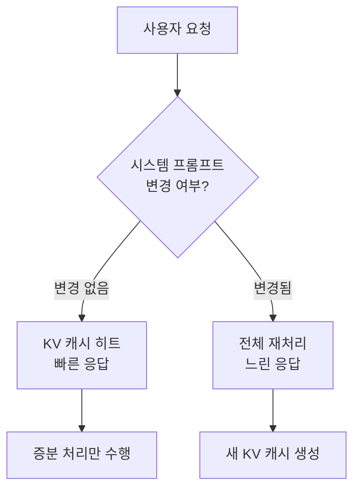
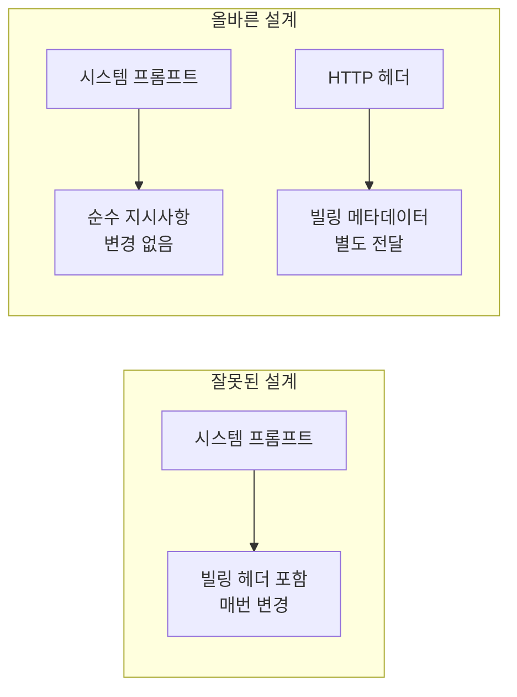

## 개요

Claude Code는 Anthropic이 제공하는 CLI 기반 AI 코딩 어시스턴트입니다. 공식 API를 통해 사용하면 원활하게 동작하지만, 로컬 LLM이나 서드파티 프록시를 통해 실행할 경우 <strong>매 요청마다 전체 프롬프트가 재처리되는</strong> 심각한 비효율성이 발생합니다. 최근 Reddit r/LocalLLaMA 커뮤니티에서 이 문제가 보고되어 큰 관심을 끌었습니다.

이번 글에서는 이 문제의 기술적 원인, 영향, 그리고 해결 방법을 상세히 분석합니다.

## 문제의 핵심: x-anthropic-billing-header

Claude Code는 내부적으로 시스템 프롬프트에 다음과 같은 빌링 헤더를 포함시킵니다:

```
x-anthropic-billing-header: cc_version=2.1.39.c39; cc_entrypoint=cli; cch=56445;
```

이 헤더의 값은 <strong>매 요청마다 변경</strong>됩니다. 공식 Anthropic API에서는 이 헤더가 별도로 처리되지만, 로컬 모델이나 서드파티 프록시를 통해 실행할 경우 이 헤더가 시스템 프롬프트의 일부로 렌더링됩니다.

### KV 캐시 무효화 메커니즘

LLM 추론에서 <strong>KV(Key-Value) 캐시</strong>는 성능 최적화의 핵심입니다. 이전 요청의 연산 결과를 캐시에 저장하고, 동일한 프리픽스를 가진 후속 요청에서 재활용합니다.



빌링 헤더의 값이 매번 바뀌면 시스템 프롬프트 전체가 변경된 것으로 인식되어, <strong>KV 캐시가 완전히 무효화</strong>됩니다. 결과적으로 수천~수만 토큰에 달하는 시스템 프롬프트와 대화 기록이 매번 처음부터 재처리됩니다.

## 성능 영향 분석

### 로컬 LLM에서의 비용

로컬 모델 실행 시 KV 캐시 무효화의 영향은 특히 심각합니다:

| 항목 | KV 캐시 활성 | KV 캐시 무효화 |
|------|-------------|---------------|
| 시스템 프롬프트 처리 | 최초 1회 | 매 요청마다 |
| 대화 컨텍스트 처리 | 증분만 | 전체 재처리 |
| VRAM 사용량 | 안정적 | 급증 후 해제 반복 |
| 응답 지연 | 0.5~2초 | 10~30초+ |
| GPU 연산 비용 | 낮음 | 매우 높음 |

Claude Code의 시스템 프롬프트는 수만 토큰에 달할 수 있으며, 여기에 대화 기록까지 합하면 매 요청마다 수십만 토큰을 재처리하게 됩니다. 로컬 GPU에서 이는 <strong>응답 시간이 10배 이상 증가</strong>하는 결과를 초래합니다.

### API 프록시 사용 시 비용

서드파티 API 프록시를 통해 다른 모델(예: GPT-4, Gemini)에 연결하는 경우에도 동일한 문제가 발생합니다. 프롬프트 캐싱을 지원하는 API에서 캐시가 무효화되면 <strong>토큰 비용이 수배로 증가</strong>합니다.

## 해결 방법

### 환경 변수 설정

가장 간단한 해결책은 빌링 헤더를 비활성화하는 것입니다. `~/.claude/settings.json` 파일에 다음을 추가합니다:

```json
{
  "env": {
    "CLAUDE_CODE_ATTRIBUTION_HEADER": "0"
  }
}
```

이 설정으로 시스템 프롬프트에서 빌링 헤더가 제거되어 KV 캐시가 정상적으로 작동합니다.

### 효과 검증

설정 적용 후 다음 사항을 확인하세요:

1. <strong>응답 속도 개선</strong>: 두 번째 요청부터 응답 시간이 크게 단축됩니다
2. <strong>VRAM 안정화</strong>: GPU 메모리 사용량의 급격한 변동이 줄어듭니다
3. <strong>로그 확인</strong>: 시스템 프롬프트에 빌링 헤더가 포함되지 않는지 확인합니다

## 아키텍처 설계의 교훈

이 문제는 단순한 버그를 넘어 <strong>개발자 도구 설계의 중요한 교훈</strong>을 제공합니다.

### 1. 메타데이터와 콘텐츠의 분리

빌링 정보, 텔레메트리 데이터 등의 메타데이터는 프롬프트 콘텐츠와 명확히 분리되어야 합니다. HTTP 헤더, 별도의 API 파라미터, 또는 out-of-band 채널을 통해 전달하는 것이 올바른 설계입니다.



### 2. 캐시 친화적 설계

LLM 기반 도구를 설계할 때는 <strong>프롬프트의 캐시 친화성</strong>을 반드시 고려해야 합니다:

- 자주 변경되는 요소를 프롬프트 앞부분에 배치하지 않기
- 정적 콘텐츠와 동적 콘텐츠를 구조적으로 분리하기
- 캐시 키에 영향을 주는 요소를 최소화하기

### 3. 서드파티 호환성 고려

공식 API에서는 문제가 없더라도, 서드파티 환경에서의 호환성을 고려한 설계가 필요합니다. 특히 오픈소스 커뮤니티에서 활발히 사용되는 도구라면 더욱 그렇습니다.

## 더 넓은 맥락: LLM 개발자 도구의 미래

이 사례는 LLM 기반 개발자 도구 생태계가 직면한 과제를 보여줍니다:

- <strong>벤더 종속성</strong>: 특정 API에 최적화된 도구가 다른 환경에서 비효율적으로 동작
- <strong>투명성 부족</strong>: 내부 아키텍처가 공개되지 않아 디버깅이 어려움
- <strong>커뮤니티 의존</strong>: 사용자 커뮤니티가 직접 문제를 발견하고 해결책을 공유

앞으로 개발자 도구는 <strong>모델 애그노스틱(model-agnostic)</strong>한 설계를 지향하고, 내부 동작의 투명성을 높이며, 다양한 실행 환경을 공식적으로 지원하는 방향으로 발전해야 할 것입니다.

## 결론

Claude Code의 로컬 모델 사용 시 전체 프롬프트 재처리 문제는 `CLAUDE_CODE_ATTRIBUTION_HEADER` 환경 변수를 `"0"`으로 설정하여 해결할 수 있습니다. 그러나 이 문제가 시사하는 바는 더 큽니다.

LLM 기반 도구를 개발하거나 운영할 때는 <strong>캐시 효율성, 메타데이터 분리, 서드파티 호환성</strong>을 설계 초기부터 고려해야 합니다. 작은 헤더 하나가 전체 시스템의 성능을 극적으로 변화시킬 수 있다는 사실은, 세심한 아키텍처 설계의 중요성을 다시 한번 일깨워줍니다.

## 참고 자료

- [Reddit r/LocalLLaMA — Claude Code with local models: full prompt reprocessing](https://www.reddit.com/r/LocalLLaMA/comments/1r47fz0/claude_code_with_local_models_full_prompt/)
- [claude-code-router Issue #1161 — x-anthropic-billing-header validation error](https://github.com/musistudio/claude-code-router/issues/1161)
- [Anthropic Prompt Caching Documentation](https://docs.anthropic.com/en/docs/build-with-claude/prompt-caching)
