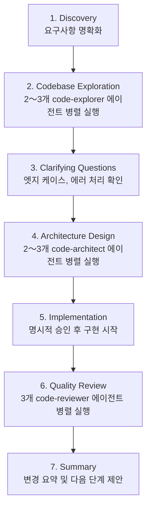

## 개요

Claude Code는 Anthropic이 개발한 에이전틱 코딩 도구입니다. 플러그인 시스템을 통해 슬래시 커맨드, 전문 에이전트, 스킬, 훅을 <strong>하나의 패키지로 설치</strong>할 수 있습니다.

이 포스트에서는 <strong>공식 플러그인 13개</strong>의 상세 기능, <strong>커뮤니티 마켓플레이스</strong>의 100개 이상 플러그인, 그리고 <strong>실제 플러그인 구조</strong>를 심층적으로 분석합니다.

> <strong>★ Insight</strong>
>
> - 공식 플러그인 13개: anthropics/claude-code 저장소에서 관리
> - 커뮤니티 마켓플레이스: 100개 이상의 플러그인 (13개 카테고리)
> - 플러그인 구조: commands/, agents/, skills/, hooks/, .mcp.json

## 플러그인 설치 방법

### 마켓플레이스 추가

Claude Code는 Git 저장소 기반의 마켓플레이스 시스템을 사용합니다.

```bash
# 커뮤니티 마켓플레이스 추가
/plugin marketplace add ccplugins/awesome-claude-code-plugins
/plugin marketplace add kivilaid/plugin-marketplace
/plugin marketplace add ananddtyagi/cc-marketplace

# 등록된 마켓플레이스 목록 확인
/plugin marketplace list
```

### 플러그인 설치

```bash
# 기본 설치
/plugin install commit-commands

# 특정 마켓플레이스에서 설치
/plugin install ultrathink@cc-marketplace

# 설치된 플러그인 목록 확인
/plugin list

# 대화형 설치 (메뉴 방식)
/plugin
```

> <strong>★ Insight</strong>
>
> - 플러그인 최소 요구 버전: Claude Code 1.0.33 이상
> - 저장 위치: 프로젝트(.claude/) 또는 사용자(~/.claude/) 레벨
> - 개발 모드: `cc --plugin-dir /path/to/plugin` 으로 로컬 테스트 가능

## 공식 플러그인 13개 상세 분석

Anthropic이 관리하는 [anthropics/claude-code](https://github.com/anthropics/claude-code/tree/main/plugins) 저장소의 공식 플러그인입니다.

### 1. commit-commands - Git 워크플로우 자동화

```bash
/plugin install commit-commands
```

<strong>제공 커맨드 3개</strong>:

| 커맨드              | 기능                                                         |
| ------------------- | ------------------------------------------------------------ |
| `/commit`         | 변경 사항 분석 후 저장소 스타일에 맞는 커밋 메시지 자동 생성 |
| `/commit-push-pr` | 브랜치 생성 → 커밋 → 푸시 → PR 생성까지 한 번에           |
| `/clean_gone`     | 리모트에서 삭제된 로컬 브랜치 정리, worktree 포함            |

**`/commit` 작동 방식**:

1. `git status`로 변경 사항 확인
2. `git diff`로 staged/unstaged 변경 분석
3. `git log`로 최근 커밋 스타일 파악
4. 저장소 컨벤션에 맞는 커밋 메시지 생성
5. `.env`, `credentials.json` 등 민감 파일 제외

**`/commit-push-pr` 작동 방식**:

1. main 브랜치면 자동으로 새 브랜치 생성
2. 브랜치의 <strong>전체 커밋 히스토리</strong> 분석 (최신 커밋만이 아님)
3. PR 설명 자동 생성 (Summary + Test plan)
4. GitHub CLI(`gh`)로 PR 생성 후 URL 반환

```bash
# 사용 예시
git add .
/commit
# → "feat(auth): add JWT validation middleware" 제안
# → 승인하시겠습니까? [Y/n]
```

### 2. feature-dev - 7단계 기능 개발 워크플로우

```bash
/plugin install feature-dev
```

<strong>7단계 구조화된 워크플로우</strong>:



<strong>전문 에이전트 3종</strong>:

| 에이전트           | 역할                                                        |
| ------------------ | ----------------------------------------------------------- |
| `code-explorer`  | 실행 경로 추적, 아키텍처 레이어 분석, 필수 파일 목록 생성   |
| `code-architect` | 최소 변경 / 클린 아키텍처 / 실용적 균형 등 다중 접근법 설계 |
| `code-reviewer`  | 단순성/DRY, 버그/정확성, 컨벤션/추상화 각각 집중 검토       |

```bash
# 사용 예시
/feature-dev Add OAuth login with Google
# → 7단계 순차 진행, 각 단계에서 사용자 확인
```

<strong>언제 사용하나?</strong>

- 여러 파일에 걸친 새로운 기능 개발
- 아키텍처 결정이 필요한 복잡한 작업
- 요구사항이 불명확한 기능

### 3. code-review - 신뢰도 기반 자동 PR 리뷰

```bash
/plugin install code-review
```

<strong>작동 방식</strong>:

1. 닫힌/초안/사소한/이미 리뷰된 PR은 자동 스킵
2. CLAUDE.md 가이드라인 파일 수집
3. <strong>4개 병렬 에이전트</strong> 실행:
   - Agent #1, #2: CLAUDE.md 준수 여부 (중복 검증)
   - Agent #3: 버그 탐지 (PR 변경 범위 내에서만)
   - Agent #4: Git blame 히스토리 분석
4. 각 이슈에 <strong>신뢰도 점수(0〜100)</strong> 부여
5. <strong>80점 미만 필터링</strong> (오탐 제거)

<strong>신뢰도 점수 기준</strong>:

| 점수 | 의미                        |
| ---- | --------------------------- |
| 0    | 확신 없음, 오탐 가능성 높음 |
| 25   | 어느 정도 확신, 실제일 수도 |
| 50   | 보통 확신, 실제지만 사소함  |
| 75   | 높은 확신, 실제이며 중요    |
| 100  | 절대 확신, 확실히 문제      |

```bash
# 터미널 출력
/code-review

# PR 코멘트로 게시
/code-review --comment
```

<strong>필터링되는 오탐</strong>:

- PR 이전부터 존재하던 문제
- 린터가 잡을 수 있는 문제
- 일반적인 품질 이슈 (CLAUDE.md에 없으면)
- lint ignore 주석이 있는 코드

### 4. hookify - 코딩 없이 훅 생성

```bash
/plugin install hookify
```

<strong>제공 커맨드 4개</strong>:

| 커맨드                   | 기능                                    |
| ------------------------ | --------------------------------------- |
| `/hookify [설명]`      | 자연어로 훅 생성                        |
| `/hookify` (인자 없음) | 대화 분석 후 개선해야 할 패턴 자동 발견 |
| `/hookify:list`        | 활성화된 규칙 목록                      |
| `/hookify:configure`   | 규칙 활성화/비활성화                    |

<strong>훅 파일 형식</strong> (`.claude/hookify.*.local.md`):

```yaml
---
name: block-dangerous-rm
enabled: true
event: bash
pattern: rm\s+-rf
action: block  # warn 또는 block
---

⚠️ **위험한 rm 명령 감지!**

이 명령은 중요한 파일을 삭제할 수 있습니다.
- 경로가 올바른지 확인하세요
- 백업이 있는지 확인하세요
```

<strong>이벤트 타입</strong>:

- `bash`: Bash 명령 실행 시
- `file`: Edit/Write 도구 사용 시
- `stop`: Claude가 작업 종료하려 할 때
- `prompt`: 사용자 프롬프트 제출 시
- `all`: 모든 이벤트

```bash
# 사용 예시
/hookify TypeScript 파일에서 console.log 사용하면 경고해줘
# → .claude/hookify.warn-console-log.local.md 생성
```

### 5. plugin-dev - 8단계 플러그인 개발 도구

```bash
/plugin install plugin-dev
```

<strong>8단계 플러그인 생성 워크플로우</strong>:

1. <strong>Discovery</strong>: 플러그인 목적과 요구사항 파악
2. <strong>Component Planning</strong>: 필요한 skills/commands/agents/hooks/MCP 결정
3. <strong>Detailed Design</strong>: 각 컴포넌트 상세 설계
4. <strong>Structure Creation</strong>: 디렉토리와 manifest 생성
5. <strong>Component Implementation</strong>: AI 지원 구현
6. <strong>Validation</strong>: plugin-validator 및 컴포넌트별 검증
7. <strong>Testing</strong>: Claude Code에서 실제 동작 테스트
8. <strong>Documentation</strong>: README 완성 및 배포 준비

<strong>7개 핵심 스킬</strong>:

| 스킬                | 트리거 키워드                      | 내용                                  |
| ------------------- | ---------------------------------- | ------------------------------------- |
| Hook Development    | "create a hook", "PreToolUse hook" | 프롬프트/커맨드 훅, 모든 이벤트 타입  |
| MCP Integration     | "add MCP server", ".mcp.json"      | stdio/SSE/HTTP/WebSocket 서버 설정    |
| Plugin Structure    | "plugin.json manifest"             | 표준 디렉토리 구조, auto-discovery    |
| Plugin Settings     | ".local.md files"                  | 프로젝트별 설정, YAML frontmatter     |
| Command Development | "create a slash command"           | 커맨드 구조, 인자 처리                |
| Agent Development   | "create an agent"                  | 에이전트 frontmatter, 시스템 프롬프트 |
| Skill Development   | "create a skill"                   | SKILL.md, progressive disclosure      |

```bash
# 사용 예시
/plugin-dev:create-plugin 데이터베이스 마이그레이션 관리 플러그인
# → 8단계 가이드 진행
```

### 6. frontend-design - 자동 활성화 UI 디자인 스킬

```bash
/plugin install frontend-design
```

프론트엔드 작업 시 <strong>자동으로 활성화</strong>되는 스킬입니다.

<strong>핵심 원칙</strong>:

- <strong>대담한 미학적 선택</strong>: 제네릭한 AI 스타일 지양
- <strong>독특한 타이포그래피와 색상 팔레트</strong>
- <strong>고임팩트 애니메이션과 비주얼 디테일</strong>
- <strong>컨텍스트 인식 구현</strong>

```bash
# 자동 활성화 예시
"음악 스트리밍 앱의 대시보드를 만들어줘"
"AI 보안 스타트업의 랜딩 페이지를 만들어줘"
# → frontend-design 스킬이 자동으로 적용됨
```

### 7. pr-review-toolkit - 6개 전문 리뷰 에이전트

```bash
/plugin install pr-review-toolkit
```

<strong>6개 전문 에이전트</strong>:

- 코멘트 리뷰어
- 테스트 리뷰어
- 에러 처리 리뷰어
- 타입 리뷰어
- 코드 품질 리뷰어
- 종합 리뷰어

```bash
/pr-review-toolkit:review-pr
```

### 8. security-guidance - 보안 경고 훅

```bash
/plugin install security-guidance
```

<strong>9개 보안 패턴 모니터링</strong>:

- 인젝션 공격
- XSS (크로스 사이트 스크립팅)
- SQL 인젝션
- 명령어 인젝션
- 경로 순회
- 안전하지 않은 역직렬화
- 민감 데이터 노출
- 취약한 암호화
- 인증/인가 결함

PreToolUse 훅으로 <strong>도구 실행 전</strong> 실시간 경고.

### 기타 공식 플러그인

| 플러그인                      | 설명                                          |
| ----------------------------- | --------------------------------------------- |
| `agent-sdk-dev`             | Claude Agent SDK 개발 키트 (`/new-sdk-app`) |
| `claude-opus-4-5-migration` | Opus 4.5로 자동 마이그레이션                  |
| `explanatory-output-style`  | 구현 선택에 대한 교육적 인사이트 제공         |
| `learning-output-style`     | 5〜10줄 코드 기여 요청하는 학습 모드          |
| `ralph-wiggum`              | 반복 개발을 위한 자기참조 AI 루프             |

## 커뮤니티 마켓플레이스 분석

### 주요 마켓플레이스

| 마켓플레이스                                                                                   | 플러그인 수   | 특징                           |
| ---------------------------------------------------------------------------------------------- | ------------- | ------------------------------ |
| [ccplugins/awesome-claude-code-plugins](https://github.com/ccplugins/awesome-claude-code-plugins) | 100+          | 13개 카테고리, 가장 큰 규모    |
| [kivilaid/plugin-marketplace](https://github.com/kivilaid/plugin-marketplace)                     | 87+           | 문서 처리 도구 강점            |
| [ananddtyagi/cc-marketplace](https://github.com/ananddtyagi/cc-marketplace)                       | 동적 업데이트 | 라이브 데이터베이스 연동       |
| [ivan-magda/claude-code-marketplace](https://github.com/ivan-magda/claude-code-marketplace)       | Swift 중심    | Swift 6 마이그레이션, iOS 개발 |

### 카테고리별 주요 플러그인 (ccplugins 기준)

<strong>워크플로우 오케스트레이션 (8개)</strong>:

- `ultrathink`: 4개 전문 서브에이전트를 지휘하는 코디네이터
- `lyra`: 마스터급 AI 프롬프트 최적화 전문가
- `problem-solver-specialist`: 체계적 문제 해결

<strong>코드 품질 & 테스트 (16개)</strong>:

- `bug-detective`: 단계별 체계적 디버깅
- `double-check`: 변경사항 이중 검증
- `test-writer-fixer`: 테스트 작성 및 수정
- `unit-test-generator`: 단위 테스트 자동 생성
- `database-performance-optimizer`: DB 성능 최적화

<strong>Git 워크플로우 (14개)</strong>:

- `fix-github-issue`: GitHub 이슈 기반 자동 수정
- `create-pr`: PR 생성 자동화
- `update-branch-name`: 브랜치명 컨벤션 적용
- `husky`: Git 훅 설정

<strong>문서화 (8개)</strong>:

- `analyze-codebase`: 코드베이스 종합 분석
- `changelog-generator`: 변경 로그 자동 생성
- `update-claudemd`: CLAUDE.md 자동 업데이트
- `openapi-expert`: OpenAPI 스펙 전문가

<strong>보안 & 컴플라이언스 (7개)</strong>:

- `audit`: 코드베이스 보안 감사
- `enterprise-security-reviewer`: 엔터프라이즈급 보안 리뷰
- `legal-compliance-checker`: 법적 준수 확인
- `data-privacy-engineer`: 데이터 프라이버시

<strong>개발 엔지니어링 (15개)</strong>:

- `ai-engineer`: AI 기능 개발 전문
- `backend-architect`: 백엔드 아키텍처 설계
- `flutter-mobile-app-dev`: Flutter 모바일 앱
- `react-native-dev`: React Native 개발

### kivilaid 마켓플레이스 특화 도구

<strong>문서 처리 스위트</strong>:

- `xlsx`: 수식과 데이터 시각화가 포함된 Excel 생성
- `docx`: 변경 추적과 서식이 포함된 Word 문서
- `pptx`: 레이아웃과 템플릿이 포함된 PowerPoint
- `pdf`: PDF 추출, 병합, 분할, 양식 처리

<strong>크리에이티브 & 디자인</strong>:

- `algorithmic-art`: p5.js 기반 제너레이티브 아트
- `canvas-design`: PNG/PDF 시각 아트 생성
- `slack-gif-creator`: Slack용 애니메이션 GIF

<strong>davila7 툴킷 (10개)</strong>:

- Git 워크플로우, Supabase, Next.js/Vercel
- 테스트, 보안 감사, AI/ML, DevOps
- 문서 생성, 성능 최적화, 프로젝트 관리

## 플러그인 구조 상세

### 표준 디렉토리 구조

```
my-plugin/
├── .claude-plugin/
│   └── plugin.json              # 플러그인 메타데이터 (필수)
├── commands/                    # 슬래시 커맨드
│   ├── command-name.md
│   └── another-command.md
├── agents/                      # 자율 에이전트
│   ├── agent-name.md
│   └── another-agent.md
├── skills/                      # 재사용 가능한 스킬
│   ├── skill-name/
│   │   ├── SKILL.md
│   │   ├── references/
│   │   ├── examples/
│   │   └── scripts/
├── hooks/                       # 이벤트 훅
│   ├── hooks.json
│   └── my-hook.sh
├── .mcp.json                    # MCP 서버 설정 (선택)
└── README.md
```

### plugin.json 예시

```json
{
  "name": "my-team-plugin",
  "version": "1.0.0",
  "description": "팀 전용 개발 워크플로우 플러그인",
  "commands": ["commands/"],
  "agents": ["agents/"],
  "skills": ["skills/"],
  "hooks": ["hooks/"]
}
```

### 커맨드 파일 형식 (YAML frontmatter + Markdown)

```markdown
---
description: "코드 리뷰를 수행합니다"
argument-hint: "[--comment]"
allowed-tools:
  - Read
  - Grep
  - Bash
---

# 코드 리뷰 커맨드

## 지시사항
1. 현재 브랜치의 변경사항을 분석합니다
2. CLAUDE.md 가이드라인을 확인합니다
3. 이슈를 신뢰도 점수와 함께 보고합니다
...
```

### 에이전트 파일 형식

```markdown
---
name: code-explorer
description: |
  코드베이스를 심층 분석하는 에이전트입니다.

  <example>
  사용자: "인증 흐름이 어떻게 작동하는지 추적해줘"
  → code-explorer가 호출됨
  </example>
model: sonnet
color: blue
tools:
  - Read
  - Grep
  - Glob
---

# System Prompt

당신은 코드베이스 탐색 전문가입니다...
```

### 스킬 SKILL.md 형식

```markdown
---
description: |
  프론트엔드 UI 디자인 스킬입니다.

  <trigger_phrases>
  - "대시보드 만들어줘"
  - "랜딩 페이지 디자인"
  - "UI 컴포넌트 생성"
  </trigger_phrases>
auto_invoke: true
---

# Frontend Design Skill

## 핵심 원칙
1. 제네릭한 AI 스타일 지양
2. 대담한 미학적 선택
...
```

### .mcp.json MCP 서버 설정

```json
{
  "mcpServers": {
    "postgresql": {
      "command": "npx",
      "args": ["-y", "@modelcontextprotocol/server-postgres"],
      "env": {
        "DATABASE_URL": "${DATABASE_URL}"
      }
    },
    "browser": {
      "type": "sse",
      "url": "https://mcp.example.com/browser",
      "headers": {
        "Authorization": "Bearer ${API_KEY}"
      }
    }
  }
}
```

<strong>MCP 서버 타입</strong>:

- `stdio`: 로컬 프로세스 (가장 일반적)
- `sse`: Server-Sent Events (호스팅/OAuth)
- `http`: REST API
- `websocket`: 실시간 양방향

## 플러그인 관리 명령어

```bash
# 설치
/plugin install <name>
/plugin install <name>@<marketplace>

# 제거
/plugin uninstall <name>

# 목록
/plugin list

# 업데이트
/plugin update <name>
/plugin update --all

# 마켓플레이스 관리
/plugin marketplace add <owner/repo>
/plugin marketplace remove <name>
/plugin marketplace list

# 대화형 메뉴
/plugin
```

## 상황별 추천 플러그인 조합

### 신규 프로젝트 시작 시

```bash
/plugin install commit-commands     # Git 워크플로우
/plugin install hookify             # 팀 컨벤션 강제
/plugin install security-guidance   # 보안 경고
```

### 기능 개발 집중 시

```bash
/plugin install feature-dev         # 7단계 워크플로우
/plugin install frontend-design     # UI 자동 스킬 (프론트엔드면)
```

### 코드 리뷰 자동화 시

```bash
/plugin install code-review         # 신뢰도 기반 리뷰
/plugin install pr-review-toolkit   # 6개 전문 에이전트
```

### 플러그인 개발 시

```bash
/plugin install plugin-dev          # 8단계 개발 가이드
```

## 주의사항

### 신뢰도 확인

- 공식 플러그인: `anthropics/claude-code` 저장소에서 관리
- 커뮤니티 플러그인: 코드 직접 검토 필요
- 플러그인은 로컬 파일 시스템에 접근 가능

### 버전 요구사항

```bash
# Claude Code 1.0.33 이상 필요
claude --version
```

### MCP 서버 인증

```bash
# 환경 변수로 API 키 설정
export DATABASE_URL="postgresql://..."
export API_KEY="sk-..."
```

## 마무리

Claude Code 플러그인 시스템은 <strong>공식 13개 플러그인</strong>과 <strong>커뮤니티 100개 이상 플러그인</strong>으로 구성된 풍부한 생태계를 제공합니다.

`<strong>`핵심 정리`</strong>`:

| 목적                  | 추천 플러그인                    |
| --------------------- | -------------------------------- |
| Git 워크플로우 자동화 | commit-commands (공식)           |
| 기능 개발 자동화      | feature-dev (공식, 7단계)        |
| 코드 리뷰 자동화      | code-review (공식, 신뢰도 기반)  |
| 커스텀 규칙 생성      | hookify (공식, 노코딩)           |
| 보안 경고             | security-guidance (공식)         |
| 플러그인 개발         | plugin-dev (공식, 8단계)         |
| UI 디자인             | frontend-design (공식, 자동)     |
| 문서 처리             | xlsx, docx, pptx, pdf (kivilaid) |
| 종합 오케스트레이션   | ultrathink (ccplugins)           |

## 참고 자료

- [Claude Code 공식 플러그인](https://github.com/anthropics/claude-code/tree/main/plugins)
- [Claude Code 플러그인 문서](https://code.claude.com/docs/en/discover-plugins)
- [ccplugins/awesome-claude-code-plugins](https://github.com/ccplugins/awesome-claude-code-plugins)
- [kivilaid/plugin-marketplace](https://github.com/kivilaid/plugin-marketplace)
- [ananddtyagi/cc-marketplace](https://github.com/ananddtyagi/cc-marketplace)
- [claudemarketplaces.com](https://claudemarketplaces.com/)
