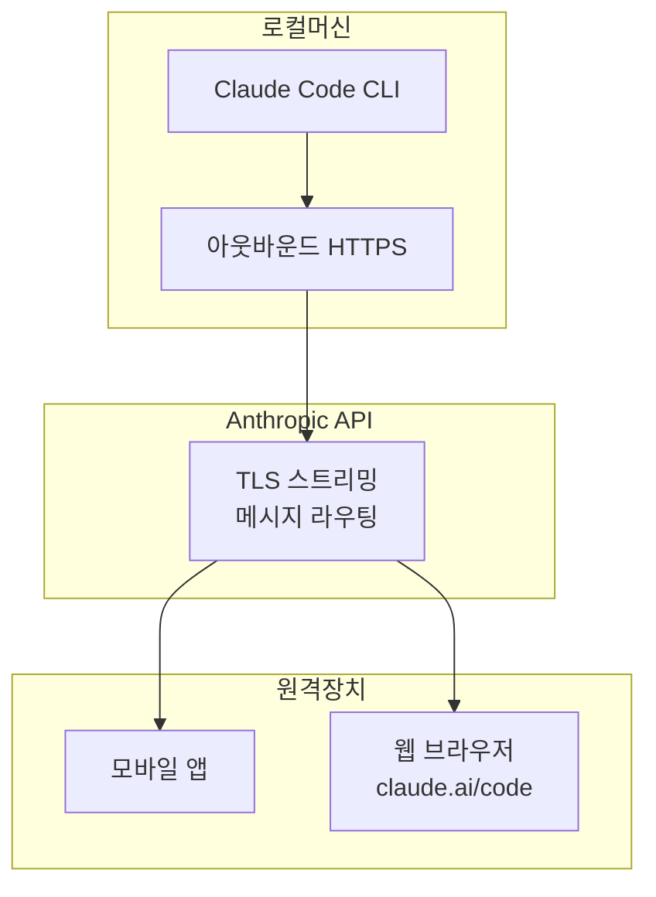
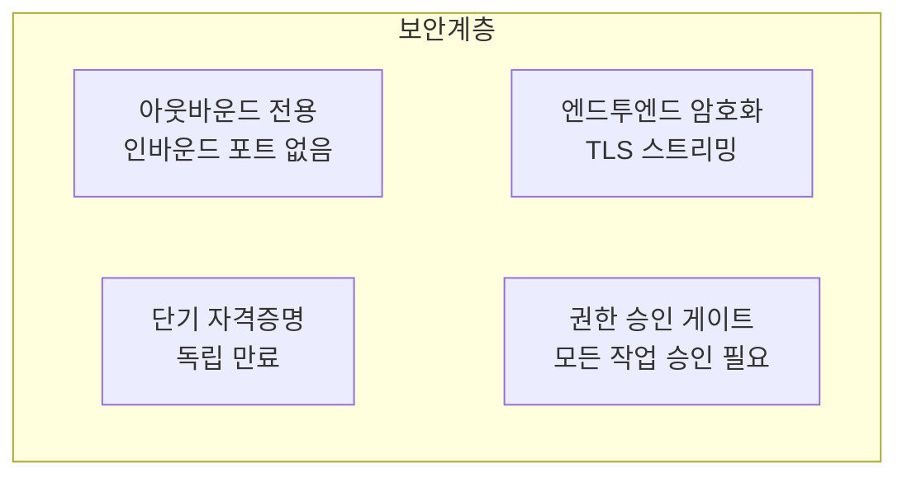

## Remote Control이란?

Claude Code Remote Control은 <strong>로컬 머신에서 실행 중인 Claude Code 세션을 모바일 앱이나 웹 브라우저에서 원격으로 제어</strong>하는 기능입니다. 2026년 2월 25일에 리서치 프리뷰로 출시되었습니다.

핵심 포인트를 짚겠습니다.

- 코드와 개발 환경은 <strong>100% 로컬에 유지</strong>됩니다
- 모바일/웹은 순수한 <strong>원격 조종기</strong> 역할만 합니다
- 데스크톱에서 시작한 작업을 소파에서 모니터링하거나, 회의실에서 지시를 보낼 수 있습니다



## 설정 방법

### 방법 1: 전역 설정 (권장)

모든 세션에서 Remote Control을 자동으로 활성화하려면 `/config` 명령어를 사용합니다.

```bash
# Claude Code 세션 내에서
/config
```

설정 메뉴에서 <strong>"Enable Remote Control for all sessions"</strong>를 선택합니다. 이후 모든 Claude Code 세션이 자동으로 Remote Control을 활성화합니다.

### 방법 2: 세션별 활성화

특정 세션에서만 Remote Control을 켜려면 다음 명령어를 사용합니다.

```bash
# 활성 세션 내에서
/remote-control

# 또는 줄임말
/rc
```

### 방법 3: CLI에서 바로 시작

```bash
# 새로운 Remote Control 세션 시작
claude remote-control

# 상세 로그 포함
claude remote-control --verbose

# 샌드박스 모드로 실행
claude remote-control --sandbox
```

## 원격 기기 연결하기

Remote Control이 활성화되면 세 가지 방법으로 연결할 수 있습니다.

### QR 코드 스캔 (가장 빠름)

터미널에서 스페이스바를 누르면 QR 코드가 표시됩니다. Claude 모바일 앱으로 스캔하면 바로 연결됩니다.

### 세션 URL 복사

터미널에 표시되는 세션 URL을 다른 기기의 브라우저에 붙여넣습니다. `claude.ai/code`에서 열립니다.

### 세션 목록에서 선택

`claude.ai/code` 또는 Claude 모바일 앱을 열면 활성 세션이 초록색 상태 표시와 함께 나타납니다.

> <strong>팁</strong>: 여러 세션을 운용한다면, `/rename`으로 세션에 의미 있는 이름을 붙이세요. 원격 기기에서 찾기가 훨씬 쉬워집니다.

## 네트워크 아키텍처와 보안

Remote Control의 보안 설계는 다음 원칙을 따릅니다.



### 핵심 보안 특성

| 항목 | 설명 |
|------|------|
| <strong>아웃바운드 전용</strong> | 로컬 머신에서 나가는 연결만 사용, 인바운드 포트를 열지 않음 |
| <strong>엔드투엔드 암호화</strong> | 모든 트래픽이 TLS로 암호화 |
| <strong>단기 자격증명</strong> | 각 자격증명은 단일 목적으로 제한, 독립적으로 만료 |
| <strong>Anthropic도 볼 수 없음</strong> | 코드는 로컬에 머물며 Anthropic 서버를 경유하지 않음 |
| <strong>권한 게이트</strong> | 모든 도구 실행에 명시적 승인 필요 |

### 세션 URL 보안

세션 URL은 <strong>비밀번호처럼 취급</strong>해야 합니다. URL을 가진 사람은 누구나 로컬 세션을 제어할 수 있습니다. 공유하지 않도록 주의하세요.

## 실전 활용 시나리오

### 시나리오 1: 장시간 리팩토링 모니터링

데스크톱에서 대규모 리팩토링 작업을 시작하고, 점심 먹으러 가면서 휴대폰으로 진행 상황을 확인합니다.

```bash
# 데스크톱에서
/rename "api-refactoring"
/rc

# → QR 코드를 모바일로 스캔
# → 진행 상황 실시간 모니터링
# → 필요하면 모바일에서 추가 지시
```

### 시나리오 2: 회의 중 코드 수정

회의실에서 버그 리포트를 받았을 때, 자리로 돌아가지 않고 바로 수정 지시를 보냅니다.

```bash
# 이미 Remote Control이 활성화된 데스크톱 세션에
# 모바일 앱에서 입력:
"src/api/auth.ts의 토큰 검증 로직에서 만료 시간 체크가 누락됐어. 수정해줘."
```

### 시나리오 3: 테스트 실행 모니터링

CI 파이프라인처럼 테스트 스위트를 실행하고, 결과를 원격으로 확인합니다.

```bash
# 데스크톱에서 테스트 시작
"전체 테스트 스위트 실행하고 실패하는 것만 리포트해줘"

# → 소파로 이동
# → 모바일에서 테스트 결과 확인
# → 실패한 테스트에 대해 수정 지시
```

### 시나리오 4: 멀티 프로젝트 관리

여러 프로젝트의 Claude Code 세션을 각각 이름을 붙여서 관리합니다.

```bash
# 프로젝트별로 세션 이름 설정
/rename "frontend-nextjs"
/rename "backend-api"
/rename "infra-terraform"

# 모바일에서 세션 목록 → 원하는 프로젝트 선택 → 지시
```

## CLI 연동 명령어

Remote Control과 함께 유용한 CLI 옵션들입니다.

```bash
# 웹에서 새 세션 생성
claude --remote "로그인 버그 수정해줘"

# 웹 세션을 로컬 터미널로 전환
claude --teleport

# 이전 세션 이름으로 재개
claude --resume "api-refactoring"

# 모바일 앱 다운로드 QR 코드 표시
/mobile
```

## 제한 사항 및 주의점

현재 리서치 프리뷰 단계이므로 몇 가지 제한이 있습니다.

| 제한 사항 | 설명 |
|-----------|------|
| <strong>하나의 원격 연결</strong> | 세션당 하나의 원격 연결만 지원 |
| <strong>터미널 유지 필수</strong> | `claude remote-control` 프로세스가 실행 중이어야 함 |
| <strong>네트워크 타임아웃</strong> | 약 10분간 네트워크 단절 시 세션 자동 종료 |
| <strong>플랜 제한</strong> | Max 플랜 우선, Pro 플랜은 순차 제공 예정 |
| <strong>권한 승인 필수</strong> | `--dangerously-skip-permissions`로도 우회 불가 |
| <strong>초기 안정성</strong> | 간헐적 API 500 오류 발생 가능 |

## `/config`로 세션 기본값 관리하기

`/config` 명령어는 Remote Control 외에도 다양한 설정을 관리합니다. Remote Control 관련 설정을 살펴보겠습니다.

```bash
/config

# 표시되는 설정 항목 중:
# ✅ Enable Remote Control for all sessions
#    → 모든 새 세션에서 자동 활성화
```

한 번 설정하면 이후 매번 `/rc`를 입력할 필요 없이, 세션을 시작할 때마다 자동으로 Remote Control이 활성화됩니다.

## 커뮤니티 대안 솔루션

공식 Remote Control 외에도 커뮤니티에서 만든 확장 솔루션들이 있습니다.

| 프로젝트 | 특징 |
|----------|------|
| <strong>claude-agent-server</strong> | WebSocket 서버 래핑, E2B 샌드박스 배포 |
| <strong>claude-code-server</strong> | 웹 UI로 CLI 명령 실행, Socket.io 실시간 스트리밍 |
| <strong>247 Claude Code Remote</strong> | Tailscale VPN + Fly.io VM, 어디서나 접속 |

이 프로젝트들은 공식 지원은 아니지만, 스케줄링이나 프로그래밍 방식 접근이 필요할 때 유용합니다.

## 마무리

Claude Code Remote Control은 "내 책상 앞에 앉아 있어야만 코딩할 수 있다"는 제약을 제거합니다. 코드는 로컬에 안전하게 유지하면서, 어디서든 AI 에이전트에게 작업을 지시하고 모니터링할 수 있습니다.

설정은 `/config` 한 줄이면 충분합니다. 리서치 프리뷰 단계라 간헐적 불안정이 있을 수 있지만, 기본 워크플로우는 충분히 실용적입니다.

<strong>시작하기</strong>: 지금 터미널에서 `/config`을 실행하고 "Enable Remote Control for all sessions"를 켜보세요.
