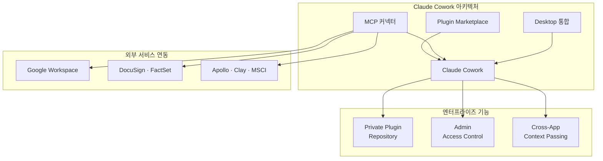
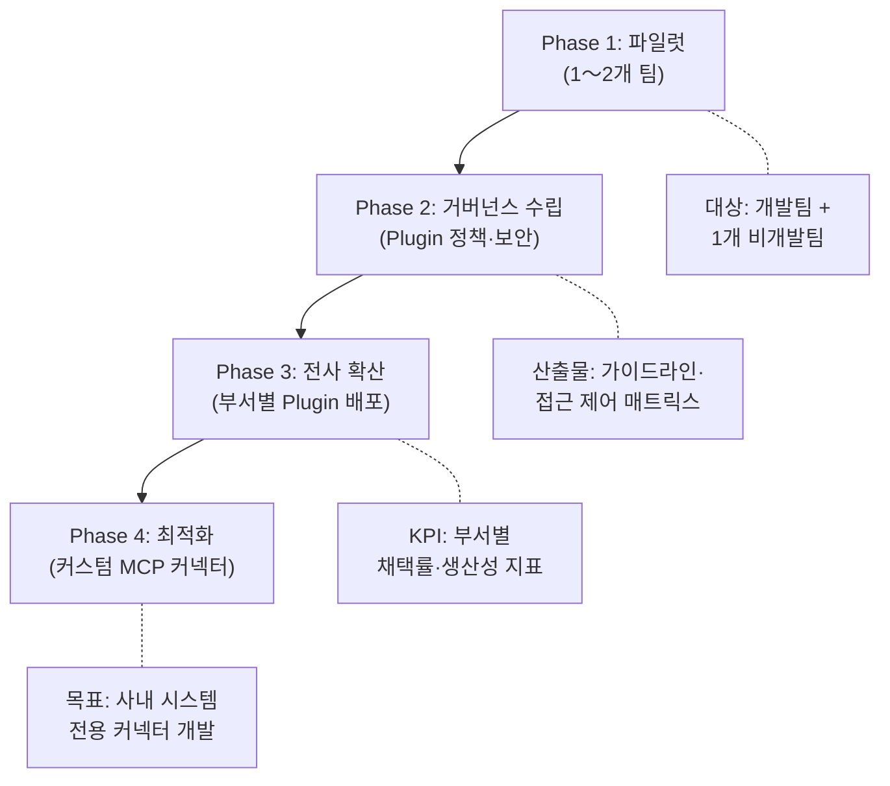

## Claude Code에서 Claude Cowork으로

2026년 1월, Anthropic은 Claude Cowork을 리서치 프리뷰로 공개했다. 2월 24일에는 엔터프라이즈 기능을 대폭 강화하며 본격적인 시장 진출을 선언했다. TechCrunch의 헤드라인이 이 변화를 정확히 요약한다: <strong>"Claude Code가 프로그래밍을 바꿨다면, Cowork은 나머지 엔터프라이즈를 바꾼다."</strong>

Engineering Manager로서 이 제품의 출시가 의미하는 바를 분석해보겠다. Claude Code가 개발팀 내부의 생산성 도구였다면, Cowork은 HR, 디자인, 재무, 운영 등 전 부서로 AI 에이전트 역량을 확장하는 플랫폼이다.

## Cowork의 핵심 아키텍처

Claude Cowork은 세 가지 핵심 축으로 구성된다.

### 1. Plugin Marketplace — 조직 맞춤형 AI 도구 생태계

가장 주목할 변화는 <strong>Private Plugin Marketplace</strong>다. 엔터프라이즈 관리자가 조직 전용 플러그인 마켓플레이스를 구축할 수 있다.

<strong>주요 기능:</strong>

- Private GitHub 레포지토리를 플러그인 소스로 연결
- 직원별 접근 권한 제어 (어떤 플러그인을 누가 사용할 수 있는지)
- HR, 디자인, 엔지니어링, 운영, 재무 분석, 투자 은행, 주식 리서치, PE, 자산관리 등 분야별 프리빌트 템플릿 제공

이것이 중요한 이유는, 기존에 개별 팀이 각자 ChatGPT나 Claude를 "잘 쓰는 방법"을 찾아 헤매던 것에서, <strong>조직 차원에서 검증된 AI 워크플로우를 배포</strong>할 수 있는 인프라가 생겼다는 점이다.

### 2. MCP 커넥터 — 기업 시스템과의 네이티브 통합

Claude Cowork은 Model Context Protocol(MCP)을 통해 기업의 기존 시스템과 직접 연결된다. 새로 추가된 커넥터:

| 카테고리 | 서비스 |
|---------|--------|
| <strong>생산성</strong> | Google Drive, Google Calendar, Gmail |
| <strong>계약·법무</strong> | DocuSign, LegalZoom |
| <strong>영업·마케팅</strong> | Apollo, Clay, Outreach, SimilarWeb |
| <strong>금융·리서치</strong> | FactSet, MSCI |
| <strong>콘텐츠</strong> | WordPress, Harvey |

MCP 커넥터의 의미는 단순한 API 연동 이상이다. Claude가 이 서비스들의 컨텍스트를 <strong>양방향으로</strong> 이해하고 조작할 수 있다는 것이다. 예를 들어 "지난주 계약서 초안 3건을 검토하고 핵심 리스크를 정리해줘"라고 하면, DocuSign에서 문서를 가져와 분석하고, 결과를 Google Drive에 저장하는 워크플로우가 가능하다.

### 3. Desktop 통합 — Excel과 PowerPoint까지

Claude Cowork은 Claude 데스크톱 앱에서 동작하며, <strong>Excel과 PowerPoint와의 직접 통합</strong>을 지원한다. 핵심은 <strong>Cross-App Context Passing</strong>이다:

- Cowork에서 분석한 내용을 Excel에서 이어서 작업
- Excel의 데이터를 PowerPoint 프레젠테이션으로 자동 변환
- 여러 파일 간 컨텍스트가 유지되어, 앱을 전환할 때 처음부터 다시 설명할 필요 없음

이 기능은 특히 경영진 보고서 작성, 분기별 비즈니스 리뷰, 투자 분석 등의 업무에서 큰 생산성 향상을 가져올 수 있다.

## EM/CTO 관점에서의 전략적 시사점

### 1. "개발팀 AI"에서 "전사 AI"로의 전환

대부분의 조직에서 AI 도입은 개발팀에서 시작됐다. Claude Code, GitHub Copilot, Cursor 같은 도구가 대표적이다. 하지만 Cowork의 출시는 이 경계를 무너뜨린다.

<strong>CTO가 고려해야 할 질문:</strong>

- 개발팀의 AI 도구 도입 경험을 비개발 부서로 어떻게 확산할 것인가?
- Plugin Marketplace의 거버넌스 정책을 누가 관리할 것인가?
- MCP 커넥터를 통한 데이터 접근 범위를 어떻게 제한할 것인가?

### 2. 벤더 락인과 플랫폼 전략

Anthropic의 Cowork 전략은 명확하다 — <strong>MCP를 통한 개방형 생태계 구축</strong>이다. MCP가 Linux Foundation에 기증되어 오픈 표준이 된 상황에서, Cowork은 "표준을 가장 잘 구현한 제품"의 위치를 선점하려 한다.

비교:

| 항목 | Claude Cowork | Microsoft Copilot | Google Gemini for Workspace |
|------|-------------|-------------------|---------------------------|
| <strong>프로토콜</strong> | MCP (오픈 표준) | 독자 규격 | 독자 규격 |
| <strong>Plugin 커스터마이징</strong> | Private Marketplace | Admin Center | AppSheet |
| <strong>코딩 에이전트 연계</strong> | Claude Code → Cowork | GitHub Copilot | Jules (제한적) |
| <strong>데스크톱 통합</strong> | Excel, PPT (신규) | Office 365 네이티브 | Google Workspace |

### 3. 보안 고려사항

최근 Check Point Research가 Claude Code에서 CVE-2025-59536, CVE-2026-21852 취약점을 발견한 점은 기억해둘 필요가 있다. Hooks, MCP 서버 설정, 환경 변수를 통한 원격 코드 실행과 API 키 탈취가 가능했다 (현재는 패치됨).

Cowork이 더 많은 기업 시스템과 연결되는 만큼, <strong>MCP 커넥터의 보안 감사</strong>와 <strong>플러그인 코드 리뷰 프로세스</strong>는 필수다.

## 실전 도입 로드맵

엔터프라이즈에서 Claude Cowork을 도입할 때 권장하는 단계별 접근:

<strong>Phase 1: 파일럿 (2〜4주)</strong>

- 이미 Claude Code를 사용 중인 개발팀 + 1개 비개발팀 (예: 재무 또는 HR)
- 기본 MCP 커넥터 (Google Workspace) 연결
- 프리빌트 플러그인 템플릿 테스트

<strong>Phase 2: 거버넌스 수립 (2〜4주)</strong>

- Private Plugin Marketplace 설정
- 플러그인 승인 프로세스 정의
- MCP 커넥터별 데이터 접근 범위 설정
- 보안 감사 체크리스트 수립

<strong>Phase 3: 전사 확산 (4〜8주)</strong>

- 부서별 맞춤 플러그인 배포
- 부서 챔피언 (AI Ambassador) 지정
- 사용량 및 생산성 지표 모니터링

<strong>Phase 4: 최적화 (지속적)</strong>

- 사내 시스템 전용 MCP 커넥터 개발
- 워크플로우 자동화 고도화
- ROI 측정 및 확대 여부 결정

## Anthropic의 엔터프라이즈 전략 읽기

Cowork의 출시를 더 넓은 맥락에서 보면, Anthropic의 전략은 3단계로 읽힌다:

1. <strong>개발자 시장 장악</strong> (2024〜2025): Claude Code로 개발자 생산성 시장에서 입지 구축
2. <strong>엔터프라이즈 확장</strong> (2026 초): Cowork으로 비개발 직군까지 AI 에이전트 확장
3. <strong>플랫폼 생태계</strong> (2026〜): MCP 오픈 표준 + Plugin Marketplace로 서드파티 생태계 구축

이 전략은 Slack이 개발팀 → 전사 커뮤니케이션 도구로 진화한 경로와 유사하다. 차이점은 Cowork이 <strong>에이전틱 AI의 실행력</strong>을 제공한다는 것이다 — 단순히 메시지를 주고받는 것이 아니라, 실제 업무를 대신 수행할 수 있다.

## 결론

Claude Cowork의 엔터프라이즈 출시는 AI 도구 시장의 중요한 전환점이다. 개발팀 내부에 갇혀 있던 AI 에이전트가 전사적 생산성 도구로 확장되는 첫 번째 실질적 사례다.

EM이나 CTO로서 지금 해야 할 것:

1. <strong>현재 조직의 AI 도구 사용 현황</strong>을 파악한다 (섀도우 AI 포함)
2. <strong>Cowork 파일럿 대상 팀</strong>을 선정한다
3. <strong>MCP 커넥터 보안 정책</strong>을 사전에 수립한다
4. <strong>Plugin 거버넌스 체계</strong>를 설계한다

AI가 "개발자의 도구"에서 "조직의 인프라"로 전환되는 시점에 있다. 이 전환을 능동적으로 관리하느냐, 수동적으로 따라가느냐가 향후 조직의 기술 경쟁력을 결정할 것이다.

## 참고 자료

- [Anthropic, Claude Cowork 엔터프라이즈 플러그인 확장 — TechCrunch](https://techcrunch.com/2026/02/24/anthropic-launches-new-push-for-enterprise-agents-with-plugins-for-finance-engineering-and-design/)
- [Claude Cowork: 비개발자를 위한 Claude Code — TechCrunch](https://techcrunch.com/2026/01/12/anthropics-new-cowork-tool-offers-claude-code-without-the-code/)
- [Anthropic, Claude Cowork으로 사무직 생산성 도구 업데이트 — CNBC](https://www.cnbc.com/2026/02/24/anthropic-claude-cowork-office-worker.html)
- [Claude Cowork, Excel과 PowerPoint 워크플로우 혁신 — Applying AI](https://applyingai.com/2026/03/how-anthropics-claude-is-revolutionizing-excel-and-powerpoint-workflows/)
- [Anthropic vs 펜타곤 AI 거버넌스 — Axios](https://www.axios.com/2026/03/03/ai-race-safety-guardrail)
