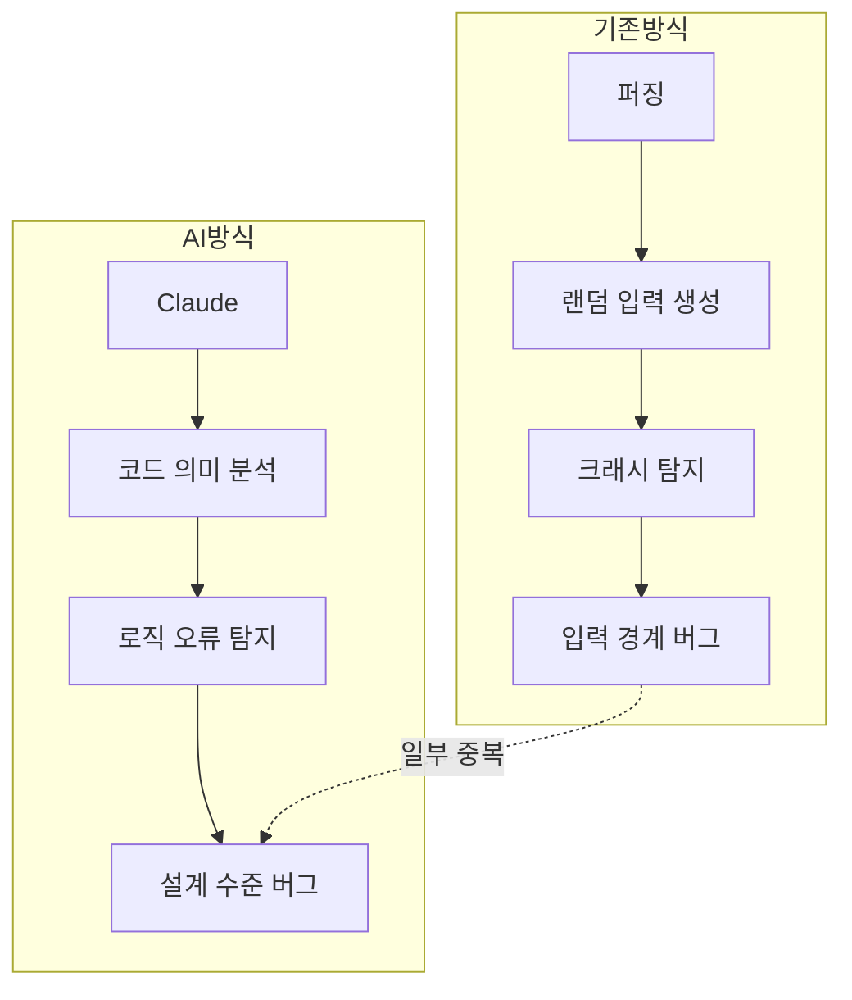
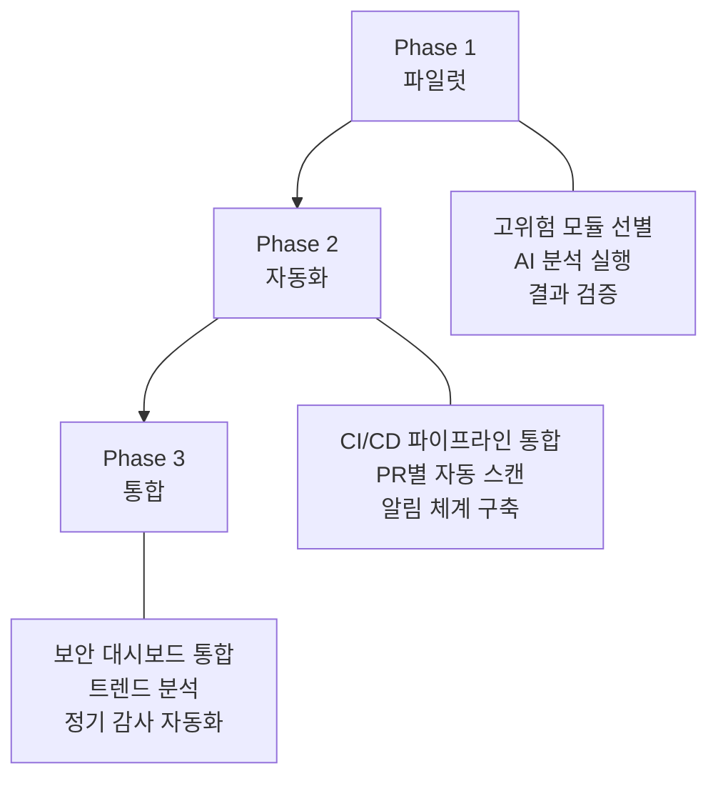

## 2주, 6,000개 C++ 파일, 22개 CVE

2026년 3월 6일, Anthropic과 Mozilla는 AI 모델을 활용한 브라우저 보안 감사 결과를 공동 발표했습니다. Claude Opus 4.6이 Firefox의 C++ 코드베이스 약 <strong>6,000개 파일</strong>을 분석해 <strong>112건의 고유 버그 리포트</strong>를 제출했고, 그 중 <strong>22건이 공식 CVE</strong>로 등록되었습니다.

심각도 분류는 다음과 같습니다:

| 심각도 | 건수 | 비율 |
|--------|------|------|
| High | 14건 | 63.6% |
| Moderate | 7건 | 31.8% |
| Low | 1건 | 4.5% |

14건의 고심각도 취약점은 2025년 한 해 동안 패치된 Firefox 고심각도 취약점의 <strong>약 5분의 1</strong>에 해당합니다. 이 모든 취약점은 Firefox 148에서 패치 완료되었습니다.

## 퍼징이 놓친 것을 AI가 찾았다

Firefox는 수십 년간 <strong>퍼징(fuzzing)</strong>, <strong>정적 분석(static analysis)</strong>, 정기적인 보안 리뷰를 거쳐온 프로젝트입니다. 그럼에도 Claude가 새로운 취약점을 발견할 수 있었던 이유가 흥미롭습니다.

핵심적인 차이는 <strong>탐지 대상의 성격</strong>입니다:

- <strong>퍼징</strong>: 무작위 입력으로 크래시를 유발하는 방식. 입력 검증 누락이나 버퍼 오버플로 같은 패턴에 강합니다.
- <strong>AI 코드 분석</strong>: 코드의 의미와 맥락을 이해하고 논리적 오류를 탐지. 퍼징이 놓치는 <strong>로직 에러(logic errors)</strong>와 <strong>Use After Free</strong> 같은 복합적 메모리 취약점을 발견합니다.

Mozilla의 공식 발표에 따르면, Claude는 "수십 년간의 퍼징과 정적 분석에도 불구하고 이전에 알려지지 않은 많은 버그를 발견"했습니다. 특히 JavaScript 엔진 탐색을 시작한 지 <strong>20분 만에</strong> Use After Free 취약점 하나를 발견한 사례가 보고되었습니다.

## 112건 리포트의 품질 — 왜 Mozilla가 신뢰했나

단순히 "취약점 N개 발견"보다 중요한 것은 <strong>리포트의 품질</strong>입니다. Mozilla 보안팀이 Anthropic의 결과를 빠르게 수용할 수 있었던 이유는 세 가지입니다:

1. <strong>최소 재현 테스트 케이스(Minimal Test Case)</strong>: 각 버그에 대해 재현 가능한 최소 코드를 함께 제출
2. <strong>상세 PoC(Proof of Concept)</strong>: 취약점이 어떻게 악용될 수 있는지 구체적 시나리오 제시
3. <strong>후보 패치(Candidate Patches)</strong>: 수정 방안까지 포함된 완결형 리포트

이런 구조 덕분에 Mozilla 보안팀은 리포트 수신 후 <strong>수 시간 내에</strong> 검증을 완료하고 수정 작업에 착수할 수 있었습니다. 보안 감사에서 가장 큰 병목인 "리포트 트리아지(triage)" 시간이 획기적으로 단축된 셈입니다.

## 익스플로잇 vs 탐지 — AI의 현재 위치

한 가지 주목할 점은, Anthropic이 별도로 Claude의 <strong>익스플로잇 개발 능력</strong>도 테스트했다는 것입니다:

| 항목 | 결과 |
|------|------|
| 테스트 횟수 | 수백 회 |
| API 비용 | $4,000 |
| 성공한 익스플로잇 | 2건 |

<strong>취약점 탐지 능력</strong>과 <strong>익스플로잇 개발 능력</strong> 사이에는 큰 격차가 있습니다. AI는 코드를 읽고 잠재적 문제를 식별하는 데는 탁월하지만, 실제 공격 코드를 작성하는 것은 아직 어렵습니다. 이는 방어 측에 유리한 비대칭으로, 보안 팀이 AI를 공격보다 방어에 먼저 활용할 수 있는 <strong>시간적 여유(window of opportunity)</strong>가 있음을 의미합니다.

## EM/CTO를 위한 실전 시사점

이 사례가 엔지니어링 리더에게 시사하는 바를 정리합니다.

### 1. AI 보안 감사 도입 로드맵

<strong>Phase 1 (파일럿, 1〜2주)</strong>:
- 레거시 코드 중 보안 민감 모듈(인증, 결제, 데이터 처리)을 선별
- LLM 기반 코드 분석 도구로 1회성 감사 실행
- 결과를 기존 보안팀이 검증하여 신뢰도 측정

<strong>Phase 2 (자동화, 1〜2개월)</strong>:
- CI/CD 파이프라인에 AI 보안 스캔 단계 추가
- PR 단위로 변경된 코드에 대한 자동 분석
- Slack/이메일 알림 체계 구축

<strong>Phase 3 (통합, 분기별)</strong>:
- 보안 대시보드에 AI 감사 결과 통합
- 취약점 트렌드 분석 및 리스크 스코어링
- 분기별 전체 코드베이스 자동 감사

### 2. 비용 대비 효과

Anthropic의 사례를 기준으로 추정하면:

| 항목 | 전통적 방식 | AI 감사 |
|------|------------|---------|
| 소요 기간 | 수주〜수개월 | 2주 |
| 전문 인력 | 시니어 보안 엔지니어 2〜3명 | AI + 검증 인력 1명 |
| 범위 | 샘플링 기반 | 전체 코드베이스(6,000 파일) |
| 리포트 품질 | 전문가 수준 | 테스트 케이스 + PoC + 패치 포함 |

물론 AI 감사가 인간 전문가를 완전히 대체하는 것은 아닙니다. 최적의 접근은 <strong>AI가 1차 스크리닝</strong>을 하고, <strong>인간 전문가가 검증 및 우선순위 판단</strong>을 하는 하이브리드 모델입니다.

### 3. 조직 내 도입 시 고려사항

- <strong>코드 기밀성</strong>: 외부 AI API에 코드를 전송하는 것에 대한 보안 정책 검토 필요. 온프레미스 모델 또는 제로 리텐션 API 계약 고려
- <strong>오탐(False Positive) 관리</strong>: 112건 중 22건이 실제 CVE로 등록된 비율(약 20%). 나머지는 낮은 심각도의 버그이거나 오탐. 트리아지 프로세스 필수
- <strong>기존 도구와의 통합</strong>: SAST(정적 분석), DAST(동적 분석), SCA(소프트웨어 구성 분석) 등 기존 AppSec 파이프라인과의 연계 전략 수립
- <strong>규제 준수</strong>: SOC 2, ISO 27001 등 컴플라이언스 프레임워크에서 AI 보안 감사 결과의 증거 활용 방안 검토

## 더 넓은 맥락 — AI AppSec의 미래

이번 사례는 단발성 이벤트가 아니라 <strong>AI 기반 보안 감사</strong>가 산업 표준이 되어가는 흐름의 일부입니다:

- <strong>Google Project Zero</strong>는 이미 LLM을 활용한 취약점 탐지 연구를 진행 중
- <strong>GitHub Copilot</strong>의 보안 리뷰 기능이 강화되고 있고
- <strong>NIST</strong>의 AI 에이전트 보안 표준은 역으로 AI를 보안 도구로 활용하는 가이드라인도 포함

EM/CTO 입장에서 중요한 질문은 "AI 보안 감사를 도입할 것인가"가 아니라 <strong>"언제, 어떤 순서로 도입할 것인가"</strong>입니다. Firefox처럼 수십 년간 검증된 코드베이스에서도 AI가 새로운 취약점을 찾아낸다면, 여러분의 코드베이스는 어떨까요?

## 핵심 요약

| 항목 | 내용 |
|------|------|
| 주체 | Anthropic (Claude Opus 4.6) × Mozilla |
| 기간 | 2주 (2026년 2월) |
| 범위 | Firefox C++ 코드베이스 6,000개 파일 |
| 결과 | 112건 리포트 → 22 CVE (고심각도 14건) |
| 핵심 차별점 | 퍼징이 놓친 로직 에러 탐지 |
| 리포트 품질 | 최소 재현 코드 + PoC + 후보 패치 포함 |
| 패치 상태 | Firefox 148에서 전량 패치 완료 |

## 참고 자료

- [Anthropic 공식 발표: Mozilla Firefox Security](https://www.anthropic.com/news/mozilla-firefox-security)
- [Mozilla 블로그: Hardening Firefox with Anthropic's Red Team](https://blog.mozilla.org/en/firefox/hardening-firefox-anthropic-red-team/)
- [TechCrunch: Anthropic's Claude found 22 vulnerabilities in Firefox over two weeks](https://techcrunch.com/2026/03/06/anthropics-claude-found-22-vulnerabilities-in-firefox-over-two-weeks/)
- [The Hacker News: Anthropic Finds 22 Firefox Vulnerabilities](https://thehackernews.com/2026/03/anthropic-finds-22-firefox.html)
