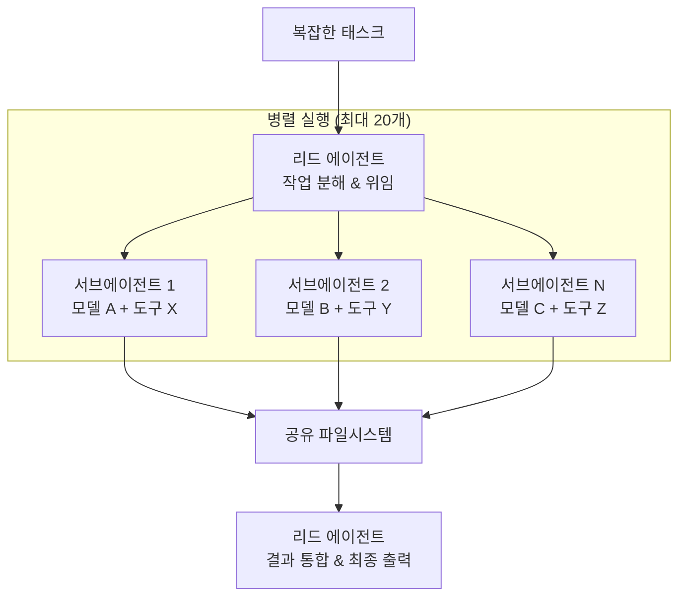
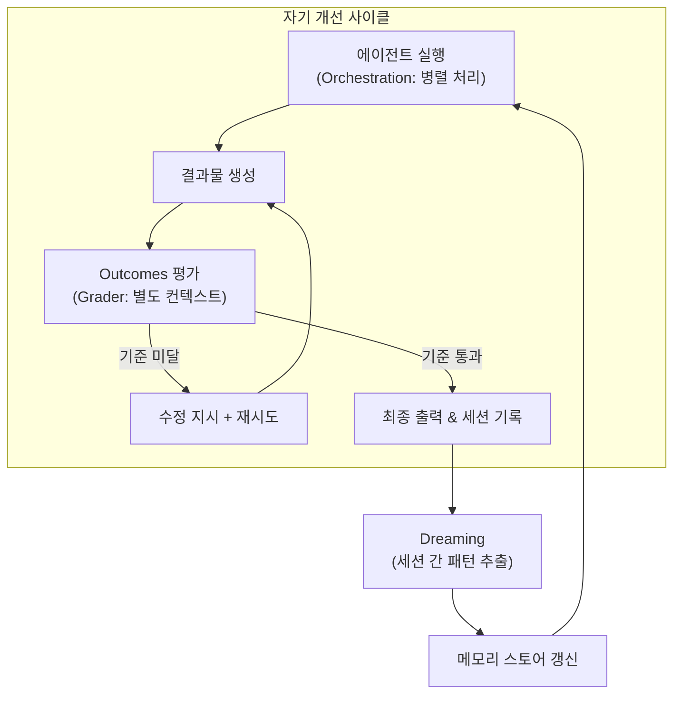

5월 6일 샌프란시스코 Code with Claude 컨퍼런스에서 Anthropic이 세 가지를 발표했을 때, 나는 가장 먼저 이 질문을 떠올렸다. "이 에이전트는 내가 퇴근한 사이에 뭘 배우는 걸까?"

Dreaming, Outcomes, Multiagent Orchestration. 이름만 보면 마케팅 느낌이 있지만, 구조를 뜯어보면 꽤 구체적인 엔지니어링 결정들이 담겨 있다. 특히 Dreaming에 대해 처음 듣는 사람들이 오해하는 지점이 있다. "에이전트가 학습한다"는 건 맞는 말이지만, 모델이 나아지는 게 아니다. 메모리가 나아지는 거다. 이 구별이 실제로 중요하다.

API 키가 없어서 Dreaming을 직접 실행해보지는 못했다. 아직 Research Preview 단계이기도 하고. 이 글은 공식 문서, Anthropic 블로그, 컨퍼런스 발표 자료, 그리고 초기 파일럿 사례를 바탕으로 세 기능의 구조를 분석한다.

## Code with Claude 2026 — 새 모델 없이, 에이전트 인프라만

5월 6일 SF 키노트에서 가장 인상적인 건 새 모델 발표가 없었다는 점이다. Anthropic은 모델 경쟁 대신 에이전트 실행 인프라에 집중했다.

주요 발표 사항:

- **Dreaming**: 에이전트 메모리 자동 갱신 (Research Preview)
- **Outcomes**: 성공 기준 기반 자기 평가·반복 (Public Beta)
- **Multiagent Orchestration**: 리드-서브에이전트 병렬 실행 (Public Beta)
- 사용 한도 2배 증가 (Pro, Max, Team, Enterprise)
- 피크 시간대 쓰로틀링 제거 (Pro, Max)
- <strong>Claude Security</strong>: 코드 취약점 스캐너 (Enterprise, Opus 4.7 기반)
- Remote Agents: 폰으로 노트북 제어
- SpaceX Project Colossus 파트너십 (220,000개 이상 GPU)

이 발표들은 작년에 개인 개발자용 프리뷰로 출발한 Managed Agents가 엔터프라이즈 규모 워크플로우로 진화하고 있다는 방향을 보여준다. 실제로 Notion, Rakuten, Sentry, Harvey가 이미 프로덕션에 적용 중이라고 Anthropic이 밝혔다.

컨퍼런스는 SF에 이어 런던(5월 19일), 도쿄(6월 10일)에서 계속된다. 런던과 도쿄에서 추가 발표가 있을지는 지켜볼 필요가 있다.

## Dreaming — 자는 동안 정리하는 메모리 시스템

Anthropic이 Dreaming을 설명할 때 쓴 비유가 해마(hippocampus)의 메모리 통합이다. 인간이 수면 중에 낮에 경험한 것을 정리하고 중요한 정보를 장기 기억으로 옮기는 과정과 유사하다는 것.

기술적으로 Dreaming이 수행하는 과정:

1. 지난 세션들(최대 100개)을 검토한다
2. 반복 실수, 수렴한 워크플로우, 팀 선호도 같은 패턴을 추출한다
3. 기존 메모리 스토어에서 중복된 항목과 낡은 항목을 제거하고 새 항목을 추가한다
4. 원본 세션 기록은 그대로 보존한다

<strong>중요한 점: 모델 웨이트는 변경되지 않는다.</strong> Dreaming은 파인튜닝이 아니다. 바뀌는 것은 에이전트가 다음 세션 시작 시 참조하는 메모리 스토어다. Anthropic도 명시적으로 밝혔다. "Dreaming does not modify the underlying model weights."

Harvey(법률 AI 스타트업)의 파일럿 결과가 자주 인용된다. 태스크 완료율이 약 6배 향상됐다고 한다. 구체적으로는, Dreaming이 활성화된 이후 에이전트가 파일 형식 특이사항과 도구별 패턴을 세션 간에 기억하게 되면서 완료율이 올라갔다는 것.

이 수치를 나는 흥미롭게 보지만, 문맥이 중요하다고 본다. Harvey는 법률 문서 처리 전문 AI 스타트업이다. 같은 유형의 계약서, 같은 도구, 반복적인 검토 워크플로우 — 패턴이 명확한 환경이다. 이 조건에서 메모리 학습이 잘 작동한다는 건 합리적이다. 하지만 요청이 매번 달라지는 범용 에이전트 환경에서 "6배"를 기대하기는 어렵다.

Wisedocs(캐나다의 법적 문서 자동화 스타트업)도 파일럿에 참여했다. Harvey와 마찬가지로 구조화된 법률 문서를 반복적으로 처리하는 환경이다. 두 파일럿 모두 "구조적 반복성이 높은 전문 도메인"이라는 공통점을 가진다. 이것이 우연은 아닐 것이다.

기술적으로 흥미로운 설계 질문도 있다. 100개 세션을 처리할 때 시간이 오래된 세션의 패턴과 최근 세션의 패턴에 어떤 가중치를 주는가? 6개월 전 팀이 자주 했던 실수와 2주 전에 수렴한 워크플로우 중 어느 쪽을 메모리에 더 강하게 반영해야 하는가? 이 설계 선택이 Dreaming의 장기 품질을 결정하는데, 현재 공식 문서에서는 이 알고리즘 세부사항이 공개되지 않았다.

Dreaming은 아직 Research Preview이기 때문에 공식 문서와 초기 사용자 보고 기반으로만 분석할 수 있다. 직접 테스트한 것처럼 쓰지는 않겠다.

## Outcomes — LLM-as-judge 패턴의 제품화

Outcomes는 솔직히 새로운 개념이 아니다. LLM-as-judge, 즉 별도의 모델 인스턴스가 에이전트 출력을 평가하는 패턴은 이미 많은 에이전트 시스템에서 쓰고 있다. Anthropic이 이것을 Managed Agents에 통합한 방식이 관심 포인트다.

Outcomes가 작동하는 방식:

```
1. 개발자가 성공 기준(rubric) 작성
   예: "계약서 조항이 법적 요건 A, B, C를 모두 충족해야 한다"

2. Writer 에이전트가 출력 생성

3. Grader가 별도 컨텍스트 윈도우에서 rubric 기준 평가
   - Writer의 추론 과정에 오염되지 않은 독립적 평가
   - 기준별 통과/실패 판정 출력

4. 실패 항목 있으면 → Grader가 수정 지시를 Writer에게 전달

5. Writer가 수정 후 재시도

6. 모든 기준 통과 → 결과물 반환
```

핵심 설계 포인트는 grader가 <strong>완전히 별도의 컨텍스트 윈도우</strong>에서 실행된다는 것이다. Writer의 추론 과정에 영향을 받지 않는다. 단순히 "자기 리뷰"를 시키는 것과 다른 이유가 바로 여기다. 같은 컨텍스트 안에서 self-review를 하면 writer가 자신의 결과물에 대해 편향된 평가를 내릴 가능성이 높다.

Anthropic 내부 벤치마크 결과: Word 문서 생성 품질 8.4% 향상, PowerPoint 슬라이드 10.1% 향상.

실제 배포 시에는 rubric 작성이 핵심 작업이 된다. 너무 느슨한 rubric이면 Outcomes의 효과가 없고, 너무 엄격하면 에이전트가 무한 수정 루프에 빠질 수 있다. rubric 설계 시 고려해야 할 원칙 몇 가지:

- **기준 단위를 분리하라**: "좋은 보고서"처럼 포괄적인 기준보다 "데이터 출처가 명시됐는가", "결론이 데이터에서 직접 도출됐는가" 처럼 독립적으로 평가 가능한 단위가 효과적이다
- **통과 기준은 이진법으로 정의하라**: grader가 "어느 정도"를 판단하게 하면 grader 자체의 편향이 개입한다
- **재시도 상한을 설정하라**: Outcomes는 최대 재시도 횟수를 설정할 수 있다. 무제한 재시도는 비용 폭발로 이어진다

Anthropic이 이 부분에 대해 더 많은 가이드라인을 공개하길 기대한다. 현재 Claude Cookbook에 Outcomes 구현 예제가 있지만, 운영 관점의 rubric 설계 가이드는 부족하다.

4월에 다룬 [Managed Agents 기본 배포 가이드](/ko/blog/ko/claude-managed-agents-production-deployment-guide)에서 API 체인 설정과 세션당 $0.08 비용 구조를 분석했는데, Outcomes를 추가하면 grader 실행 비용이 추가되는 구조다. 실제 비용은 rubric 복잡도와 재시도 횟수에 따라 달라진다. 기준이 5개이고 각 시도에서 2개씩 실패하면 총 세션 수가 2배 이상이 될 수 있다.

## Multiagent Orchestration — 병렬 처리의 표준화

복잡한 작업을 한 에이전트가 순차적으로 처리하는 것보다, 전문 에이전트 여러 개가 병렬로 분담하는 것이 더 빠르고 품질도 높다는 건 알려진 사실이다. [Claude Code의 에이전틱 워크플로우 5가지 패턴](/ko/blog/ko/claude-code-agentic-workflow-patterns-5-types)에서도 이 구조를 다룬 적 있다.

Multiagent Orchestration이 추가하는 것:

- 리드 에이전트가 복잡한 작업을 분해하고 서브에이전트에게 위임
- 서브에이전트는 최대 20개까지 병렬 실행
- 각 서브에이전트는 <strong>자체 모델, 프롬프트, 도구</strong> 조합 가능
- 공유 파일시스템에서 결과물 공유
- Claude Console에서 전체 흐름 추적 가능



각 서브에이전트가 자체 모델과 도구를 가질 수 있다는 점이 중요하다. 예를 들어, 코드 생성 서브에이전트는 Claude Opus 4.7을, 빠른 검증 서브에이전트는 Claude Haiku 4.5를 사용하도록 구성할 수 있다. 성능과 비용을 동시에 최적화하는 [이기종 에이전트 플릿 구성](/ko/blog/ko/heterogeneous-llm-agent-fleet-cost-optimization)이 가능해진다.

공식 문서에 따르면 Orchestration은 각 서브에이전트 실행이 독립된 세션 스레드에서 이루어지며, 각자의 컨텍스트 윈도우와 대화 기록을 유지한다. 리드 에이전트는 서브에이전트들의 결과물을 파일시스템을 통해 받아 최종 출력으로 통합한다. 이 흐름 전체가 Claude Console에서 추적 가능하다는 점은 운영 가시성 측면에서 실질적인 장점이다.

단, "최대 20개 서브에이전트"는 기술적 상한이지 권장값이 아니다. 실제로 5〜6개 이상의 서브에이전트를 효율적으로 조율하려면 리드 에이전트의 작업 분해 로직이 정교해야 한다. 작업 분해가 제대로 되지 않으면 오케스트레이션 오버헤드가 병렬화 이득을 상쇄한다.

## 세 기능이 함께 만드는 자기 개선 루프

Dreaming, Outcomes, Orchestration을 각각 독립적으로 보면 별개의 기능처럼 보인다. 함께 작동하는 방식을 보면 구조가 보인다.



Observe: 에이전트가 작업을 수행하는 동안 세션 데이터가 쌓인다.

Evaluate: Outcomes의 grader가 각 작업을 성공 기준으로 평가한다. 실패 원인이 기록된다.

Improve: Dreaming이 주기적으로 쌓인 세션 데이터를 검토하고 메모리를 갱신한다. 다음 세션 에이전트는 이 메모리를 참조한다.

이 사이클이 반복되면 에이전트는 새로운 기술을 습득한 게 아니라, "어떤 상황에서 무엇을 조심해야 하는가"에 대한 운영 지식이 축적된다. 모델은 그대로인데 성능이 나아지는 구조다.

[에이전트 메모리 학습 패턴에 대한 더 깊은 분석은 Hindsight MCP 포스트](/ko/blog/ko/hindsight-mcp-agent-memory-learning)에서 다룬 적 있다. Dreaming이 추구하는 "경험 기반 메모리 갱신" 철학과 유사한 접근이다.

## 비판적으로 보면 — 아직 검증되지 않은 지점들

몇 가지가 솔직히 걸린다.

<strong>첫째, Harvey 6배 수치의 일반화 가능성.</strong> Harvey는 법률 문서 처리 전문 AI 스타트업이다. 같은 유형의 문서를 반복적으로 처리하는 환경에서 패턴 학습은 잘 작동한다. 하지만 "AI 에이전트를 쓰면 완료율이 6배 오른다"는 결론은 오해다. 법률 문서의 반복성이 전제되어야 하는 수치다.

<strong>둘째, 메모리 오염(memory poisoning) 위험.</strong> Dreaming이 잘못된 패턴을 강화할 수 있다. 에이전트가 반복적으로 틀린 방향으로 접근했다면, Dreaming은 그 잘못된 접근을 패턴으로 기록할 수 있다. Anthropic이 "메모리 변경을 적용 전에 검토할 수 있는" 옵션을 제공한다고 밝혔지만, 실제로 모든 팀이 이걸 꼼꼼히 검토할 수 있을지는 별개의 문제다.

<strong>셋째, 거버넌스 긴장.</strong> 에이전트가 스스로 행동 패턴을 바꾸는 시스템은 감사(audit)가 어렵다. "6개월 전에 에이전트가 왜 그 결정을 내렸는가"를 추적하기 위해서는 메모리 스토어의 버전 관리가 필요하다. 이 부분에 대한 Anthropic의 공식 가이드가 아직 충분하지 않다.

<strong>넷째, Research Preview 상태.</strong> Dreaming은 아직 Research Preview다. Public Beta인 Outcomes, Orchestration과 달리 프로덕션에서의 안정성은 검증이 더 필요하다. [에이전트 비용 현실을 분석한 글](/ko/blog/ko/ai-agent-cost-reality)에서도 강조했지만, 에이전트 시스템의 운영 비용은 토큰 비용만이 아니다. 거버넌스 비용, 모니터링 비용, 디버깅 비용이 함께 따라온다.

다섯째로, Outcomes의 grader 실행 비용이다. grader도 에이전트 세션으로 실행되므로 rubric이 복잡하고 재시도가 많아질수록 비용이 선형적으로 증가한다. 이에 대한 비용 예측 도구가 아직 없다.

여섯째, Dreaming의 스케줄 제어 문제다. "언제" Dreaming이 실행되는지, "어떤 조건에서" 메모리를 업데이트하는지에 대한 세밀한 제어가 현재 문서에 충분히 나와 있지 않다. 자동 실행과 수동 검토 옵션이 있다고 하지만, 실제 프로덕션에서 이 경계를 어떻게 설정할지는 팀마다 다른 판단이 필요할 것이다.

## 누구에게 맞는가, 그리고 내 판단

<strong>Outcomes를 먼저 도입해보길 권한다.</strong> Managed Agents를 이미 쓰고 있고, 출력 품질의 일관성이 문제인 팀이라면 rubric 설계에 시간을 투자할 가치가 있다. grader 분리 구조는 self-review의 편향 문제를 실제로 해결한다. Public Beta이므로 안정성도 상대적으로 높다.

<strong>Multiagent Orchestration은 단일 에이전트가 처리하기 너무 크거나 다양한 전문 지식이 필요한 작업에 적합하다.</strong> 대규모 보고서 생성, 코드 리뷰와 문서화 동시 진행, 다중 데이터 소스 분석 같은 작업. 단, 20개 서브에이전트를 잘못 설계하면 오케스트레이션 오버헤드가 병렬화 이득을 상쇄할 수 있다.

<strong>Dreaming은 조심스럽게 접근하길 권한다.</strong> Research Preview 상태이고, 메모리 거버넌스 체계가 준비된 팀에서만 시범 적용할 만하다. 에이전트가 반복적인 유형의 작업을 오래 처리하는 환경일수록 Dreaming 효과가 크다. 매번 다른 요청을 처리하는 환경에서는 효과가 불분명하다.

나는 이 세 기능의 결합이 흥미롭다고 본다. Observe → Evaluate → Improve 사이클이 명확하게 설계됐다. 하지만 "자기 개선 에이전트"라는 프레이밍이 가져오는 과대 기대는 경계해야 한다. 모델이 나아지는 게 아니라 메모리가 나아지는 것이고, 메모리는 틀릴 수 있다. 그리고 Research Preview 기능은 Anthropic이 직접 경고하듯, 아직 프로덕션에서의 검증이 충분하지 않다.

## 실행 가능성 판단

내가 직접 재현할 수 있었던 범위는 여기까지다: Anthropic SDK 설치, 기본 Messages API 연결. Managed Agents의 Dreaming, Outcomes, Orchestration은 Enterprise/Beta 플랜이 필요한 기능이라 직접 실행하지 못했다.

공식 문서에서 확인한 범위:
- [New in Claude Managed Agents: dreaming, outcomes, and multiagent orchestration](https://claude.com/blog/new-in-claude-managed-agents)
- Outcomes 구현 예제: [Claude Cookbook — managed-agents-cma-verify-with-outcome-grader](https://platform.claude.com/cookbook/managed-agents-cma-verify-with-outcome-grader)
- Code with Claude 2026 개요: [Code w/ Claude SF 2026](https://claude.com/blog/code-w-claude-sf-2026-sf)

직접 사용해본 팀들의 공개 리포트가 더 나오면, 특히 Harvey 외 다른 도메인에서의 Dreaming 효과 데이터가 나오면 판단을 업데이트하겠다. 지금은 "흥미로운 구조지만 아직 충분히 검증되지 않은 기능"이라는 평가가 적절하다고 본다.
