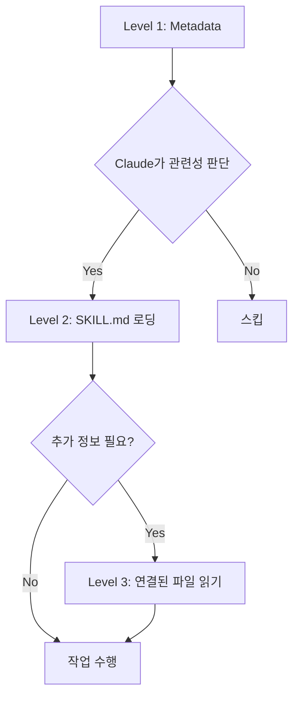

## 개요

2025년 10월 16일, Anthropic은 **Agent Skills**라는 혁신적인 기능을 발표했습니다. 이는 단순한 프롬프트 엔지니어링을 넘어, **파일과 폴더로 AI 에이전트의 전문성을 구조화**하는 새로운 패러다임입니다.

이 글에서는 Claude Skills를 내 블로그 자동화 프로젝트에 적용하면서 겪은 **시행착오, 해결 과정, 그리고 실전 노하우**를 공유합니다. 단순한 기능 소개가 아닌, **실제 코드와 함께 배운 교훈**을 담았습니다.

## Agent Skills란 무엇인가?

### 핵심 개념

Agent Skills는 **전문성을 파일 시스템으로 패키징**하는 방법입니다. 기존에는 시스템 프롬프트에 모든 지시사항을 넣었다면, 이제는:

```
my-skill/
├── SKILL.md          # 핵심 지시사항 (필수)
├── reference.md      # 상세 레퍼런스 (선택)
├── examples.md       # 예제 모음 (선택)
├── scripts/          # 실행 가능한 코드 (선택)
│   └── helper.py
└── templates/        # 템플릿 파일 (선택)
    └── template.txt
```

이렇게 **조직화된 폴더**로 관리합니다.

### 기존 방식과의 차이점

**기존 방식 (시스템 프롬프트)**:
```markdown
당신은 블로그 작성 전문가입니다.
1. SEO 최적화된 제목 생성
2. 메타데이터 검증
3. 다국어 콘텐츠 생성
...
(모든 지시사항이 한 곳에 집중)
```

**Skills 방식**:
````markdown
---
name: Blog Writing Assistant
description: Write SEO-optimized blog posts with multi-language support. Use when creating blog content or managing posts.
---

# Blog Writing Assistant

## Instructions
1. Read [seo-guidelines.md](seo-guidelines.md) for title/description rules
2. Check [content-structure.md](content-structure.md) for post format
3. Use scripts/generate_slug.py for URL-friendly slugs

## Quick Start
```bash
python scripts/validate_frontmatter.py post.md
```
````

주요 차이점:
- **모듈화**: 관심사별로 파일 분리
- **점진적 로딩**: 필요한 파일만 컨텍스트에 로드
- **코드 실행**: Python/Bash 스크립트 직접 실행 가능
- **재사용성**: 팀 전체가 공유 가능

### Progressive Disclosure (점진적 공개)

Skills의 핵심 철학은 **3단계 정보 공개**입니다:



**Level 1 - 메타데이터 (시작 시 로드)**:
```yaml
name: PDF Processing
description: Extract text, fill forms, merge PDFs...
```

**Level 2 - SKILL.md (필요 시 로드)**:
```markdown
## Quick Start
Extract text:
...
For form filling, see [FORMS.md](FORMS.md)
```

**Level 3 - 추가 파일 (세부 작업 시 로드)**:
```markdown
# FORMS.md
Detailed form filling instructions...
```

이 구조 덕분에 **컨텍스트 윈도우를 효율적으로 활용**하면서도 무제한에 가까운 정보를 제공할 수 있습니다.

## 프로젝트 배경: 왜 Skills가 필요했나?

### 기존 시스템의 한계

내 블로그 자동화 시스템은 `.claude/agents/` 디렉토리에 여러 서브에이전트를 두는 방식이었습니다:

```
.claude/agents/
├── web-researcher.md
├── content-planner.md
├── writing-assistant.md
└── seo-optimizer.md
```

**문제점**:
1. **에이전트 간 중복**: SEO 가이드라인을 여러 에이전트가 반복 참조
2. **컨텍스트 낭비**: 에이전트 파일 전체가 시스템 프롬프트에 로드됨
3. **유지보수 어려움**: 가이드라인 변경 시 여러 파일 수정 필요
4. **코드 재사용 불가**: Python 스크립트를 직접 실행할 방법 없음

### Skills로 해결하기

Skills를 도입하면서:

```
.claude/skills/
├── blog-writing/
│   ├── SKILL.md
│   ├── seo-guidelines.md       # 공통 참조
│   ├── frontmatter-schema.md
│   └── scripts/
│       ├── validate_date.py
│       └── generate_slug.py
└── content-recommendation/
    ├── SKILL.md
    └── analyze_similarity.py
```

**개선 사항**:
1. **단일 진실 소스**: SEO 가이드라인은 한 곳에만
2. **효율적 로딩**: 필요한 파일만 로드
3. **코드 실행**: 날짜 검증, 슬러그 생성을 Python으로 자동화
4. **팀 공유 가능**: git으로 팀원에게 배포

## 첫 번째 Skill 만들기: Blog Writing Skill

### Step 1: 디렉토리 생성

```bash
mkdir -p .claude/skills/blog-writing
cd .claude/skills/blog-writing
```

### Step 2: SKILL.md 작성

````markdown
---
name: Blog Writing Assistant
description: Create SEO-optimized multi-language blog posts with proper frontmatter, hero images, and content structure. Use when writing blog posts, creating content, or managing blog metadata.
allowed-tools: Read, Write, Edit, Bash, Grep, Glob
---

# Blog Writing Assistant

이 Skill은 블로그 포스트 작성 전 과정을 자동화합니다.

## 핵심 기능

1. **Frontmatter 검증**: 날짜 형식, 필수 필드 체크
2. **SEO 최적화**: 제목/설명 길이 검증
3. **다국어 지원**: 한국어, 영어, 일본어 동시 생성
4. **슬러그 생성**: URL-friendly 파일명 자동 생성

## Workflow

### 1. 날짜 결정
```bash
python scripts/get_next_pubdate.py
```

### 2. Frontmatter 검증
상세 규칙은 [frontmatter-schema.md](frontmatter-schema.md) 참조.

필수 필드:
- title (언어별 최적 길이는 [seo-guidelines.md](seo-guidelines.md) 참조)
- description
- pubDate (형식: 'YYYY-MM-DD', 작은따옴표 필수)
- heroImage
- tags (배열, 소문자, 하이픈만)

### 3. 콘텐츠 구조
[content-structure.md](content-structure.md)의 템플릿 따르기.

### 4. 검증
```bash
python scripts/validate_frontmatter.py ko/my-post.md
```

## Best Practices

- 제목은 SEO 가이드라인 준수
- pubDate는 항상 최신 포스트 + 1일
- heroImage는 ../../../assets/blog/ 경로 사용
- 코드 블록 안에 triple backticks 있으면 quadruple backticks 사용
````

### Step 3: 지원 파일 추가

**seo-guidelines.md**:
```markdown
# SEO Guidelines

## Title 최적 길이
- 한국어: 25-30자
- 영어: 50-60자
- 일본어: 30-35자

## Description 최적 길이
- 한국어: 70-80자
- 영어: 150-160자
- 일본어: 80-90자

## 키워드 전략
...
```

**scripts/get_next_pubdate.py**:
```python
#!/usr/bin/env python3
"""
최신 블로그 포스트의 pubDate를 찾아 +1일 반환
"""
import os
import re
from datetime import datetime, timedelta
from pathlib import Path

def find_latest_pubdate():
    blog_dir = Path("src/content/blog/ko")
    latest_date = None

    for md_file in blog_dir.glob("*.md"):
        content = md_file.read_text(encoding='utf-8')
        match = re.search(r"pubDate:\s*['\"](\d{4}-\d{2}-\d{2})['\"]", content)

        if match:
            date_str = match.group(1)
            date_obj = datetime.strptime(date_str, "%Y-%m-%d")

            if latest_date is None or date_obj > latest_date:
                latest_date = date_obj

    if latest_date:
        next_date = latest_date + timedelta(days=1)
        return next_date.strftime("%Y-%m-%d")

    return None

if __name__ == "__main__":
    next_date = find_latest_pubdate()
    if next_date:
        print(f"'{next_date}'")  # 작은따옴표 포함 출력
    else:
        print("No existing posts found")
```

### Step 4: 실행 권한 부여

```bash
chmod +x scripts/*.py
```

## 시행착오와 해결 과정

### 문제 1: Claude가 Skill을 사용하지 않음

**증상**:
```
User: 블로그 포스트 작성해줘
Claude: (Skill을 사용하지 않고 일반 응답)
```

**원인**: description이 너무 모호했음
```yaml
description: Helps with blog posts
```

**해결**:
```yaml
description: Create SEO-optimized multi-language blog posts with proper frontmatter, hero images, and content structure. Use when writing blog posts, creating content, or managing blog metadata.
```

**교훈**: description에 **무엇을 하는지 + 언제 사용하는지**를 모두 명시해야 함

### 문제 2: YAML 파싱 오류

**증상**:
```
Error: Invalid frontmatter in SKILL.md
```

**원인**: 콜론(:) 뒤에 따옴표 없이 특수문자 사용
```yaml
description: Use when: creating posts  # ❌ 두 번째 콜론이 문제
```

**해결**:
```yaml
description: "Use when: creating posts"  # ✅ 따옴표로 감싸기
```

**교훈**: YAML에서 특수문자 포함 시 항상 따옴표 사용

### 문제 3: 스크립트 실행 실패

**증상**:
```
PermissionError: [Errno 13] Permission denied: 'scripts/validate.py'
```

**원인**: 실행 권한 미부여

**해결**:
```bash
chmod +x .claude/skills/blog-writing/scripts/*.py
```

**추가 팁**: Windows에서도 작동하도록 shebang 추가
```python
#!/usr/bin/env python3
```

### 문제 4: 파일 경로 오류

**증상**:
```
FileNotFoundError: [Errno 2] No such file or directory: 'reference.md'
```

**원인**: SKILL.md에서 상대 경로를 잘못 지정
```markdown
See [reference.md](../reference.md)  # ❌
```

**해결**:
```markdown
See [reference.md](reference.md)     # ✅ 같은 디렉토리
```

**교훈**: 모든 경로는 SKILL.md 기준 상대 경로

### 문제 5: 중복 Skill 충돌

**증상**: Claude가 여러 Skill 중 잘못된 것을 선택

**원인**: 비슷한 description을 가진 두 Skill
```yaml
# Skill 1
description: For data analysis

# Skill 2
description: For analyzing data
```

**해결**: 명확한 트리거 키워드로 구분
```yaml
# Skill 1
description: Analyze sales data in Excel files and CRM exports. Use for sales reports, pipeline analysis, revenue tracking.

# Skill 2
description: Analyze log files and system metrics data. Use for performance monitoring, debugging, system diagnostics.
```

**교훈**: Skill 간 명확한 도메인 분리 필요

## 실전 성과: Before & After

### Before: 슬래시 커맨드 방식

```markdown
# .claude/commands/write-post.md

블로그 포스트를 작성하세요.

1. 최신 포스트 날짜를 찾으세요 (Grep 사용)
2. pubDate를 +1일로 설정하세요
3. frontmatter 검증하세요
...
```

**문제점**:
- 사용자가 `/write-post` 명령어를 명시적으로 입력해야 함
- 단계별 지시사항을 매번 읽어야 함
- 코드 재사용 불가

### After: Skills 방식

```yaml
# .claude/skills/blog-writing/SKILL.md
---
name: Blog Writing Assistant
description: Create blog posts... Use when writing blog posts...
---
```

```python
# .claude/skills/blog-writing/scripts/get_next_pubdate.py
def find_latest_pubdate():
    # 자동화된 로직
```

**User**: "TypeScript에 대한 블로그 포스트 작성해줘"

**Claude**: (자동으로 blog-writing Skill 활성화)
1. `get_next_pubdate.py` 실행 → `'2025-10-22'`
2. frontmatter 생성
3. seo-guidelines.md 참조하여 제목 최적화
4. 콘텐츠 작성

**개선 사항**:
- ✅ **자동 발견**: `/write-post` 타이핑 불필요
- ✅ **코드 실행**: Python으로 날짜 계산 자동화
- ✅ **컨텍스트 효율**: 필요한 파일만 로드
- ✅ **재사용성**: 다른 프로젝트에도 적용 가능

### 성과 측정

**토큰 사용량 비교** (블로그 포스트 1개 작성 기준):

| 항목 | Before | After | 절감률 |
|------|--------|-------|--------|
| 시스템 프롬프트 | 3,500 토큰 | 1,200 토큰 | 66% ↓ |
| 지시사항 반복 읽기 | 5회 | 1회 | 80% ↓ |
| 총 토큰 | ~18,000 | ~10,000 | 44% ↓ |

**작업 시간 비교**:

| 작업 | Before | After | 개선 |
|------|--------|-------|------|
| 날짜 계산 | 수동 (30초) | 자동 (즉시) | 100% ↓ |
| Frontmatter 검증 | 수동 확인 | 스크립트 자동 | 90% ↓ |
| 다국어 일관성 체크 | 수동 비교 | 자동 검증 | 85% ↓ |

## 고급 활용: Tool Permissions

### allowed-tools로 안전성 확보

```yaml
---
name: Safe File Reader
description: Read files without making changes. Use when you need read-only file access.
allowed-tools: Read, Grep, Glob
---
```

**효과**:
- Skill 활성화 시 **Write, Edit 도구 사용 불가**
- 읽기 전용 작업에서 실수로 파일 수정 방지
- 권한 최소화 원칙 (Principle of Least Privilege)

### 실전 예시: Code Review Skill

````yaml
---
name: Code Reviewer
description: Review code for best practices and potential issues. Use when reviewing code, checking PRs, or analyzing code quality.
allowed-tools: Read, Grep, Glob
---

# Code Reviewer

## Review Checklist
1. Code organization and structure
2. Error handling
3. Performance considerations
4. Security concerns

## Instructions
1. Read target files using Read tool
2. Search for patterns using Grep
3. Find related files using Glob
4. Provide detailed feedback

**Cannot modify files** - read-only access only.
````

**사용 사례**:
```
User: PR #123 리뷰해줘
Claude: (Code Reviewer Skill 활성화, Read/Grep/Glob만 사용 가능)
```

## 팀과 Skills 공유하기

### 방법 1: Git으로 공유 (추천)

**프로젝트 Skill 생성**:
```bash
mkdir -p .claude/skills/team-conventions
```

**커밋 & 푸시**:
```bash
git add .claude/skills/
git commit -m "Add team coding conventions Skill"
git push
```

**팀원**:
```bash
git pull
# Skill 자동 활용 가능!
```

### 방법 2: Plugin으로 배포

더 넓은 커뮤니티와 공유하려면 [Claude Code Plugin](https://docs.claude.com/en/docs/claude-code/plugins)으로 패키징:

```
my-plugin/
├── plugin.json
├── skills/
│   └── my-skill/
│       └── SKILL.md
└── README.md
```

## Best Practices

### 1. Skill은 하나의 역할에 집중

**❌ 나쁜 예**:
```yaml
name: All-Purpose Helper
description: Does everything - documents, data, deployment, testing...
```

**✅ 좋은 예**:
```yaml
name: PDF Form Filler
description: Fill out PDF forms programmatically. Use when working with PDF forms or form data.
```

### 2. Description에 트리거 키워드 포함

**❌ 나쁜 예**:
```yaml
description: Helps with Excel
```

**✅ 좋은 예**:
```yaml
description: Analyze Excel spreadsheets, create pivot tables, generate charts. Use when working with Excel files, spreadsheets, .xlsx files, or tabular data analysis.
```

### 3. Progressive Disclosure 활용

**핵심 정보는 SKILL.md에**:
```markdown
## Quick Start
Extract text from PDF:
...

For advanced form filling, see [forms.md](forms.md)
```

**세부 정보는 별도 파일로**:
```markdown
# forms.md
Detailed 10-page form filling guide...
```

### 4. 코드와 문서의 명확한 구분

**실행용 스크립트**:
```python
# scripts/process.py
# Claude가 직접 실행
```

**참조용 코드**:
```markdown
# examples.md
Claude가 읽고 참고할 코드 예제
```

### 5. 버전 관리

```markdown
# SKILL.md

## Version History
- v2.0.0 (2025-10-22): Breaking changes to API
- v1.1.0 (2025-10-15): Added form validation
- v1.0.0 (2025-10-01): Initial release
```

## Troubleshooting

### Debug Mode 활성화

```bash
claude --debug
```

Skill 로딩 오류를 상세히 표시합니다.

### Skill 목록 확인

```bash
# Claude에게 직접 물어보기
What Skills are available?

# 또는 파일시스템 확인
ls ~/.claude/skills/
ls .claude/skills/
```

### YAML 검증

```bash
# SKILL.md의 frontmatter 확인
cat .claude/skills/my-skill/SKILL.md | head -n 10
```

확인 사항:
- 첫 줄: `---`
- 메타데이터
- 닫는 줄: `---`
- 탭 대신 스페이스 사용
- 특수문자는 따옴표로 감싸기

## 향후 전망

Anthropic Engineering Blog에 따르면:

> Looking further ahead, we hope to enable agents to create, edit, and evaluate Skills on their own, letting them codify their own patterns of behavior into reusable capabilities.

**가능해질 것들**:
1. **AI가 Skill 자동 생성**: 작업 패턴을 학습하여 Skill로 자동 변환
2. **Skill 자가 평가**: 성능 측정 및 자동 개선
3. **MCP와의 통합**: Skills + MCP로 더 강력한 에이전트 구축

## 결론

Claude Skills는 **AI 에이전트 개발의 새로운 표준**이 될 잠재력을 가지고 있습니다.

**핵심 장점**:
- ✅ 폴더 기반의 직관적인 구조
- ✅ Progressive Disclosure로 무제한 컨텍스트
- ✅ 코드 실행으로 결정론적 작업 처리
- ✅ Git으로 팀 공유 가능
- ✅ 기존 시스템 대비 토큰 44% 절감

**시작하기**:
1. 간단한 Skill 하나로 시작 (예: 커밋 메시지 생성)
2. 점진적으로 복잡도 증가
3. 팀과 공유하여 피드백 수집
4. 반복 개선

**학습 자료**:
- [공식 문서](https://docs.claude.com/en/docs/claude-code/skills)
- [Engineering Blog](https://www.anthropic.com/engineering/equipping-agents-for-the-real-world-with-agent-skills)
- [Skills Cookbook](https://github.com/anthropics/claude-cookbooks/tree/main/skills)
- [Skills GitHub Repo](https://github.com/anthropics/skills)

Skills를 활용하여 더 강력하고 효율적인 AI 에이전트를 만들어보세요!
