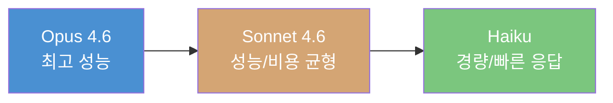
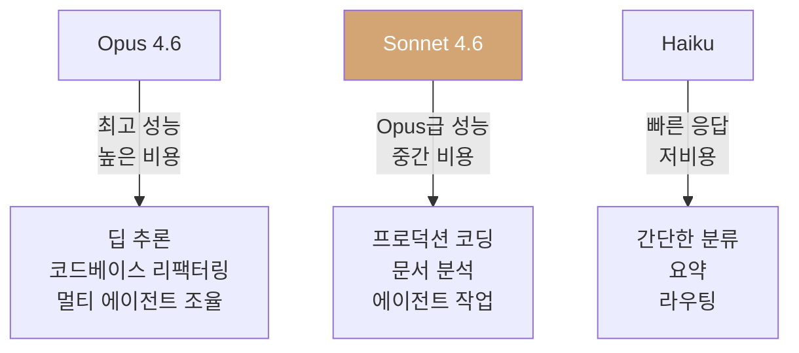

## 개요

Anthropic이 <strong>Claude Sonnet 4.6</strong>을 출시했습니다. 이번 모델은 코딩, 컴퓨터 사용, 장문 맥락 추론, 에이전트 계획, 지식 작업, 디자인 전반에 걸쳐 전면적인 업그레이드를 이루었으며, 베타로 <strong>100만 토큰 컨텍스트 윈도우</strong>를 지원합니다. Hacker News에서 724포인트를 기록하며 큰 관심을 받고 있는 이 발표를 심층 분석합니다.

## Sonnet 4 → 4.6: 무엇이 달라졌나

### 코딩 능력의 도약

Claude Code 내부 테스트에서 사용자들은 Sonnet 4.6을 Sonnet 4.5 대비 <strong>약 70%의 비율로 선호</strong>했습니다. 특히 다음과 같은 개선이 보고되었습니다:

- 코드 수정 전 <strong>컨텍스트(Context)를 더 효과적으로 파악</strong>
- 공유 로직을 중복 없이 <strong>통합하는 능력 향상</strong>
- 장시간 세션에서의 <strong>성능 저하 감소</strong>
- 과도한 엔지니어링과 "게으른 응답"이 <strong>크게 줄어듦</strong>

놀랍게도 사용자들은 2025년 11월 출시된 프론티어 모델 <strong>Opus 4.5보다도 Sonnet 4.6을 59% 비율로 선호</strong>했습니다.

### 컴퓨터 사용(Computer Use) 성능

Anthropic은 2024년 10월 범용 컴퓨터 사용 모델을 업계 최초로 도입했습니다. <strong>OSWorld 벤치마크</strong>에서 Sonnet 모델은 16개월간 꾸준한 성능 향상을 보여왔으며, Sonnet 4.6은 복잡한 스프레드시트 탐색이나 다단계 웹 양식 작성에서 <strong>인간 수준의 능력</strong>을 보이고 있습니다.

보안 측면에서도 프롬프트 인젝션 공격에 대한 저항력이 Sonnet 4.5 대비 <strong>크게 개선</strong>되어 Opus 4.6과 유사한 수준에 도달했습니다.

### 100만 토큰 컨텍스트 윈도우

베타로 제공되는 <strong>1M 토큰 컨텍스트 윈도우</strong>는 전체 코드베이스, 장문의 계약서, 수십 편의 연구 논문을 한 번의 요청에 담을 수 있습니다. 단순히 긴 문맥을 처리하는 것이 아니라 <strong>전체 맥락에 걸쳐 효과적으로 추론</strong>한다는 점이 핵심입니다.

## 모델 버전 전략 분석

### Anthropic의 넘버링 체계

Anthropic은 독특한 버전 관리 전략을 사용합니다:

```
Sonnet 3.5 → Sonnet 4 → Sonnet 4.5 → Sonnet 4.6
Opus 4 → Opus 4.5 → Opus 4.6
```

<strong>0.1 단위의 포인트 릴리스</strong>는 아키텍처를 유지하면서 학습 데이터와 파인튜닝을 개선하는 접근을 시사합니다. 이는 사용자에게 "파괴적 변경 없는 개선"이라는 신뢰를 줍니다.

### 중간 모델 전략의 의미



Sonnet 4.6의 핵심 메시지는 <strong>"Opus급 성능을 Sonnet 가격에"</strong>입니다. 이전에는 Opus가 필요했던 작업들이 이제 Sonnet으로 가능해졌다는 것은 비용 효율성 측면에서 혁신적입니다.

## 벤치마크 성능 비교

### 주요 성과

| 영역 | Sonnet 4.5 대비 | 비고 |
|------|----------------|------|
| Claude Code 선호도 | 70% 선호 | 사용자 평가 |
| vs Opus 4.5 선호도 | 59% 선호 | 사용자 평가 |
| OfficeQA | Opus 4.6 동등 | 문서 이해 |
| Box 추론 Q&A | +15pp | 엔터프라이즈 문서 |
| 보험 벤치마크 | 94% | 컴퓨터 사용 최고 성능 |

### Vending-Bench Arena: 전략적 사고 능력

특히 인상적인 것은 <strong>Vending-Bench Arena</strong> 평가입니다. 이 벤치마크는 AI 모델이 시뮬레이션 비즈니스를 운영하며 경쟁하는 테스트인데, Sonnet 4.6은 독특한 전략을 개발했습니다:

1. 처음 10개월: <strong>설비 투자에 집중</strong> (경쟁자보다 높은 지출)
2. 마지막 구간: <strong>수익성으로 급선회</strong>
3. 결과: 경쟁 모델들을 <strong>크게 앞서며 마무리</strong>

이는 단순한 벤치마크 성능을 넘어 <strong>장기적 계획 수립과 전략적 사고</strong> 능력을 보여주는 사례입니다.

## 비용 효율성 분석

### 가격 정책

Sonnet 4.6의 가격은 Sonnet 4.5와 동일하게 유지됩니다:

- <strong>입력</strong>: $3 / 100만 토큰
- <strong>출력</strong>: $15 / 100만 토큰

### 비용 대비 성능



Anthropic은 Sonnet 4.6의 <strong>"성능 대비 비용 효율이 놀라운 수준"</strong>이라고 표현했으며, 실제로 Opus를 많이 사용하던 고객에게 <strong>충분한 대안</strong>이 되고 있다는 피드백을 공개했습니다.

## 플랫폼 업데이트

Sonnet 4.6 출시와 함께 주목할 만한 플랫폼 개선사항들이 있습니다:

- <strong>어댑티브 씽킹(Adaptive Thinking)</strong>과 확장 사고 지원
- <strong>컨텍스트 컴팩션(Compaction)</strong> 베타: 대화가 한계에 가까워지면 이전 맥락을 자동 요약
- <strong>웹 검색/페치 도구</strong>: 검색 결과를 자동 필터링하는 코드 실행 기능 추가
- <strong>Claude in Excel</strong>: MCP 커넥터 지원으로 S&P Global, Bloomberg 등 외부 데이터 연동
- 코드 실행, 메모리, 프로그래매틱 도구 호출 등 <strong>GA(정식 출시)</strong>

## 개발자를 위한 시사점

### 마이그레이션 권장사항

Anthropic은 Sonnet 4.5에서 마이그레이션할 때 <strong>씽킹(Thinking) 강도를 다양하게 테스트</strong>해볼 것을 권장합니다. Sonnet 4.6은 확장 사고 없이도 강력한 성능을 제공하므로, 용도에 따라 속도와 성능의 최적 균형점을 찾을 수 있습니다.

### 모델 선택 가이드

- <strong>Opus 4.6</strong>: 최심층 추론이 필요한 경우 (코드베이스 리팩터링, 멀티 에이전트 워크플로우)
- <strong>Sonnet 4.6</strong>: 대부분의 프로덕션 작업 (코딩, 문서 분석, 에이전트 작업)
- API 식별자: `claude-sonnet-4-6`

## 결론

Claude Sonnet 4.6은 단순한 포인트 릴리스가 아닙니다. <strong>중간 모델이 프론티어 모델의 영역을 침범</strong>하는 전략적 전환점입니다. Opus급 성능을 Sonnet 가격에 제공하면서, 컴퓨터 사용 능력과 장문 맥락 처리에서 실질적인 도약을 이루었습니다.

Anthropic의 모델 진화 속도는 가속화되고 있으며, <strong>모델 선택의 기준이 "가장 좋은 모델"에서 "용도에 맞는 최적의 모델"</strong>로 이동하고 있습니다. 개발자와 기업에게 이는 더 정교한 모델 전략이 필요하다는 신호입니다.

## 참고 자료

- [Anthropic 공식 발표: Introducing Sonnet 4.6](https://www.anthropic.com/news/claude-sonnet-4-6)
- [Claude Sonnet 4.6 System Card](https://anthropic.com/claude-sonnet-4-6-system-card)
- [Hacker News 토론 (724pts)](https://news.ycombinator.com/item?id=43083851)
- [OSWorld 벤치마크](https://os-world.github.io/)
- [Vending-Bench Arena](https://andonlabs.com/evals/vending-bench-arena)
