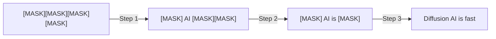
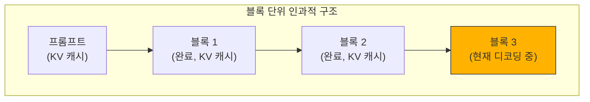

## 개요

Autoregressive(AR) 언어 모델은 토큰을 하나씩 순차적으로 생성합니다. 이 방식은 안정적이지만, 본질적으로 <strong>병렬화가 불가능</strong>하다는 한계가 있습니다. Together AI가 발표한 <strong>Consistency Diffusion Language Models(CDLM)</strong>은 확산 기반 언어 모델의 추론 속도를 최대 14배까지 끌어올리면서 품질 손실을 거의 없앤 혁신적인 기술입니다.

## 확산 언어 모델(DLM)이란

확산 언어 모델은 이미지 생성에서 익숙한 확산(diffusion) 개념을 텍스트에 적용합니다. 완전히 마스킹된 시퀀스에서 시작하여 <strong>여러 반복 단계를 거쳐 점진적으로 깨끗한 텍스트로 변환</strong>합니다.

이 접근 방식은 두 가지 핵심 장점이 있습니다:

- <strong>병렬 생성</strong>: 한 번의 반복에서 여러 토큰을 동시에 확정
- <strong>양방향 컨텍스트</strong>: 텍스트 채우기(infilling)와 수정 작업이 가능

## 기존 DLM의 두 가지 병목

그러나 기존 DLM에는 실용성을 저해하는 심각한 문제가 있었습니다:

1. <strong>KV 캐싱 불가</strong>: 양방향 어텐션을 사용하므로 매 디노이징 스텝마다 전체 컨텍스트에 대해 어텐션을 재계산해야 합니다
2. <strong>높은 반복 횟수 필요</strong>: 품질을 유지하려면 생성 길이에 비례하는 많은 디노이징 스텝이 필요하고, 스텝을 줄이면 품질이 급격히 떨어집니다

## CDLM의 핵심 메커니즘

CDLM은 <strong>사후 학습(post-training)</strong> 기법으로, 이 두 가지 병목을 동시에 해결합니다.

### 1. 궤적 수집(Trajectory Collection)

먼저 교사 DLM을 사용하여 오프라인으로 디코딩 궤적을 수집합니다. 생성 길이 256, 블록 크기 32로 설정하여 고품질 궤적 데이터를 확보합니다.

### 2. 블록 인과적 학생 모델(Block-Causal Student)

교사 모델이 양방향 어텐션을 사용하는 반면, 학생 모델은 <strong>블록 단위 인과적 마스크</strong>를 사용합니다. 이를 통해:

- 프롬프트와 이전 완료 블록에 대한 <strong>정확한 KV 캐싱</strong>이 가능
- 현재 블록 내에서는 양방향 컨텍스트를 유지

### 3. 세 가지 학습 목표

CDLM은 세 가지 손실 함수를 동시에 최적화합니다:

- <strong>증류 손실(Distillation Loss)</strong>: 새로 언마스킹된 위치에서 교사 모델의 분포를 학습
- <strong>일관성 손실(Consistency Loss)</strong>: 블록 내 시간적 일관성을 보장하여 안정적인 다중 스텝 전환 유도
- <strong>보조 MLM 손실(Auxiliary DLM Loss)</strong>: 표준 마스크 디노이징으로 일반적인 토큰 예측 능력과 추론 능력 유지

## 성능 결과

CDLM-Dream의 벤치마크 결과는 인상적입니다:

| 벤치마크 | 스텝 감소 | 레이턴시 개선 |
|---------|----------|-------------|
| GSM8K-CoT | ~7.7x | <strong>11.2x</strong> |
| MBPP-Instruct | ~4.1x | <strong>14.5x</strong> |
| 전체 평균 | 4.1x~7.7x | 최대 14.5x |

핵심은 이러한 속도 향상이 <strong>정확도를 거의 손상시키지 않는다</strong>는 점입니다. 단순히 스텝 수를 줄이면 품질이 크게 떨어지지만, CDLM의 학습 기반 접근법은 궤적 일관성을 강제하여 이 문제를 해결합니다.

## 왜 블록 단위 DLM이 최적인가

하드웨어 활용도 분석에서 블록 단위 DLM은 <strong>AR과 기존 DLM 사이의 최적점</strong>에 위치합니다:

- <strong>AR 디코딩</strong>: 작은 배치에서 메모리 바운드(산술 강도 ≈ 1)
- <strong>기존 DLM</strong>: 배치 1에서도 컴퓨트 바운드(양방향 어텐션으로 인한 포화)
- <strong>블록 DLM(CDLM)</strong>: 블록 내 병렬성으로 메모리 접근을 분산시키면서 실용적 스케일링이 가능한 균형 지점

## 실전적 의미

### AR 일강 시대의 전환점

현재 LLM 생태계는 AR 모델이 지배하고 있습니다. GPT, Claude, Gemini 모두 AR 방식입니다. CDLM은 확산 모델이 <strong>속도와 품질 모두에서 경쟁력</strong>을 가질 수 있음을 보여줍니다.

### 확장 가능성

CDLM은 사후 학습 레시피이므로, 더 강력한 DLM 백본이 등장하면 그 위에 적용할 수 있습니다. 큰 교사 모델에서 궤적을 수집하고 중간 규모 학생 모델을 학습시키는 방향도 유망합니다.

### 새로운 활용 시나리오

양방향 컨텍스트를 활용하므로 텍스트 채우기, 수정, 리라이팅 등 AR 모델이 자연스럽게 처리하기 어려운 작업에서 강점을 발휘할 수 있습니다.

## 결론

CDLM은 확산 언어 모델의 실용화를 위한 중요한 한 걸음입니다. 블록 단위 인과적 구조로 KV 캐싱을 가능하게 하고, 일관성 학습으로 스텝 수를 대폭 줄이면서도 품질을 유지합니다. 최대 14.5배의 레이턴시 개선은 AR 모델 중심의 현재 패러다임에 의미 있는 도전이 될 수 있습니다.

## 참고 자료

- [Together AI 공식 블로그 — Consistency Diffusion Language Models](https://www.together.ai/blog/consistency-diffusion-language-models)
- [Block Diffusion: Interpolating Between Autoregressive and Diffusion Language Models](https://arxiv.org/abs/2503.09573)
- [Beyond Next-Token Prediction: A Performance Characterization of Diffusion versus Autoregressive Language Models](https://arxiv.org/abs/2412.00024)
