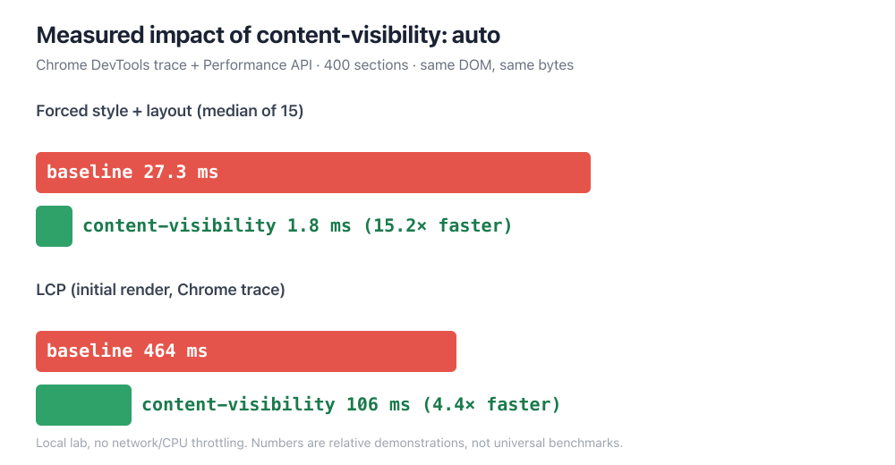

같은 HTML, 같은 바이트다. 스타일시트에 CSS 한 줄만 추가했다. 강제 레이아웃 비용이 27.3ms에서 1.8ms로 떨어졌다. 초기 LCP는 464ms에서 106ms가 됐다. 자바스크립트도, 이미지 최적화도, 서버 설정도 건드리지 않았다. 브라우저에게 "지금 화면에 안 보이는 건 계산하지 말라"고 말했을 뿐이다.

그 한 줄이 `content-visibility: auto`다. 오늘은 400개 섹션짜리 무거운 페이지를 두 벌 만들어, Chrome DevTools 트레이스와 Performance API로 이 속성이 실제로 뭘 얼마나 아끼는지 재봤다. 아래 숫자는 전부 그 샌드박스에서 나온 실제 측정값이고, 마지막엔 이 최적화가 조용히 접근성을 깨뜨리는 지점까지 짚는다.

## 브라우저가 프레임마다 하는 일 — 그래서 뭘 미룰 수 있나

먼저 토대부터. 브라우저가 페이지를 화면에 올릴 때는 매번 정해진 파이프라인을 돈다. DOM과 CSS를 합쳐 스타일을 계산하고(Style), 각 요소의 위치와 크기를 잡고(Layout), 픽셀을 칠하고(Paint), 레이어를 합성한다(Composite). 문제는 이 일이 페이지 전체를 대상으로 일어난다는 점이다. 화면 밖 저 아래 3천 번째 픽셀에 있는 표 한 칸도, 지금 보이는 첫 화면과 똑같이 스타일과 레이아웃 계산을 받는다.

짧은 블로그 글이면 이게 문제가 안 된다. 하지만 긴 문서, 무한 스크롤 피드, 수백 개 카드가 깔린 대시보드, 방대한 상품 목록에서는 이야기가 다르다. 사용자는 첫 화면만 보고 있는데, 브라우저는 보이지도 않는 수만 개 노드의 레이아웃을 매 프레임 다시 계산한다. 스크롤할 때마다, 창 크기를 바꿀 때마다, 폰트 하나 바뀔 때마다 그 비용을 다시 낸다. 이게 무거운 페이지가 스크롤에서 버벅이는 주된 이유다.

여기서 자연스러운 질문. "안 보이는 건 나중에 계산하면 안 되나?" 오래 쓰던 답은 자바스크립트 가상화(virtualization)였다. 화면에 들어온 항목만 DOM에 그리고 나머지는 빼는 방식인데, 라이브러리 의존성이 붙고 접근성·검색·앵커 링크가 깨지기 쉽다. `content-visibility`는 이 일을 CSS 선언 하나로, DOM은 그대로 둔 채 브라우저에게 위임한다.

## 공식 정의 — auto가 켜는 네 가지 containment

`content-visibility: auto`가 정확히 무슨 일을 하는지는 web.dev 문서에 명확히 적혀 있다. 이 속성이 붙은 요소는 <strong>layout, style, paint containment</strong>를 얻는다. 그리고 그 요소가 화면 밖에 있고 사용자와 관련이 없으면(포커스나 선택 영역이 그 안에 없으면) 여기에 <strong>size containment</strong>까지 더해지고, 콘텐츠의 페인팅과 히트 테스트를 멈춘다([web.dev, content-visibility](https://web.dev/articles/content-visibility)).

문서의 표현을 그대로 옮기면 이렇다. "요소가 화면 밖에 있으면 그 자손들은 렌더링되지 않는다. 브라우저는 콘텐츠를 고려하지 않고 요소의 크기를 정한 뒤 거기서 멈춘다." 핵심은 "거기서 멈춘다"다. 스타일 재계산도, 레이아웃도, 페인트도 오프스크린 자손에 대해서는 건너뛴다. 그러다 사용자가 그 근처로 스크롤하면 그때 비로소 렌더링한다. 게으른 렌더링(lazy rendering)을 CSS 레벨에서 하는 것이다.

주의할 건 `auto`와 `hidden`의 차이다. `content-visibility: hidden`은 항상 렌더링을 건너뛰고, 콘텐츠를 프로그램적으로 다시 그리기 전까지 사용자에게도 접근성 트리에서도 안 보인다. 반면 `auto`는 "지금 화면 밖이면 미루고, 관련되면 즉시 그린다"는 조건부다. 첫 화면 콘텐츠에 `auto`를 걸어도 그건 즉시 렌더링된다. 그래서 긴 페이지의 오프스크린 섹션에 걸어두는 게 정석이다.

## 같은 페이지 두 벌 — 딱 CSS 한 줄만 다르게

재현 없는 주장은 하지 않는다. 샌드박스에 정적 HTML 두 개를 만들었다. 400개의 `<section>`, 각 섹션마다 문단 4개와 12행짜리 표 하나. 전부 합쳐 약 28,800개의 DOM 노드, HTML 크기는 약 689KB. 대시보드나 긴 리포트를 흉내 낸 일부러 무거운 페이지다.

두 파일의 DOM은 <strong>완전히 동일</strong>하다. 바이트 수도 사실상 같다. 딱 하나, `cv.html`에만 이 스타일이 들어갔다.

```css
section.cv {
  content-visibility: auto;
  contain-intrinsic-size: auto 480px;
}
```

두 번째 줄이 왜 필요한지는 뒤에서 따로 다룬다. 우선 이 한 블록이 전부라는 걸 기억해두자. 자바스크립트는 한 줄도 없다. 그런 다음 로컬 서버로 두 페이지를 띄우고 Chrome(150 버전, macOS, 네트워크·CPU 스로틀링 없음)에서 각각 트레이스를 떴다.

## 측정 결과 — 초기 렌더와 강제 레이아웃

첫 번째 지표는 <strong>LCP(Largest Contentful Paint)</strong>, 가장 큰 콘텐츠가 그려지는 시점이다. Chrome 트레이스 기준으로 baseline은 LCP 464ms(렌더 지연 462ms), `content-visibility` 버전은 106ms(렌더 지연 104ms)였다. 약 4.4배 빠르다. 두 페이지 모두 CLS는 0.00으로 화면 밀림은 없었다.

솔직히 짚을 게 있다. LCP 트레이스는 실행마다 편차가 있었다. baseline을 다시 재보니 220ms가 나온 적도 있다(첫 실행이 캐시·워밍업 영향을 받는다). 그래서 편차가 적은 두 번째 지표를 따로 측정했다. <strong>강제 레이아웃(forced reflow) 비용</strong>이다. 문서 전체에 스타일 무효화를 준 뒤 `offsetHeight`를 읽어 동기 레이아웃을 강제하고, 그 시간을 15회 재서 중앙값을 냈다.

<figure>
  
  <figcaption>같은 DOM·같은 바이트, CSS 한 줄 차이. 전부 로컬 샌드박스 실측값이다.</figcaption>
</figure>

결과는 baseline 중앙값 27.3ms(최소 26.5, 최대 39.6), `content-visibility` 버전 1.8ms(최소 1.5, 최대 2.7). 약 15배 차이다. 이 숫자가 LCP보다 편차가 작고 원리를 더 정직하게 보여준다. 강제 레이아웃은 오프스크린 콘텐츠가 계산에 참여하느냐 마느냐가 그대로 드러나는 지표이기 때문이다. baseline은 매번 28,800개 노드 전부의 레이아웃을 다시 잡지만, `auto` 버전은 화면 안 몇 개만 잡는다.

곁다리로 하나 더. Chrome 트레이스는 baseline에 대해 "DOM 크기가 크다"는 DOMSize 경고를 띄웠지만 `content-visibility` 버전에는 띄우지 않았다. 브라우저 관점에서 렌더링에 참여하는 유효 DOM이 줄었다는 뜻이다.

## contain-intrinsic-size를 빼먹으면 스크롤바가 춤춘다

여기서 `contain-intrinsic-size`를 왜 같이 써야 하는지 나온다. 오프스크린 섹션의 렌더링을 건너뛰면 브라우저는 그 섹션의 실제 높이를 모른다. 아무것도 안 하면 그 요소의 높이는 0이 된다. 400개 섹션이 전부 0 높이로 접혔다가, 스크롤로 하나씩 들어올 때마다 진짜 높이로 펼쳐지면서 전체 문서 높이가 계속 바뀐다. 스크롤바가 사방으로 튀고, 스크롤 위치가 어긋난다.

`contain-intrinsic-size`가 이 자리를 대신 예약한다. 렌더링을 건너뛰는 동안 "이 섹션은 대략 이 정도 높이"라고 브라우저에 알려주는 자리표시자 크기다. web.dev 문서 표현으로는 "size containment의 영향을 받을 때 요소의 자연 크기를 지정하는" 값이다. 그리고 `auto` 키워드를 붙이면(`auto 480px`처럼) 브라우저가 한 번 렌더링한 뒤에는 그 실제 크기를 기억해서 다음부터 재사용한다.

이건 이미지에 `width`/`height`를 지정해 [레이아웃 이동을 막는 발상](/ko/blog/ko/cls-layout-shift-reserve-space-measure-2026)과 완전히 같은 뿌리다. 자리를 미리 예약해서 나중에 실제 콘텐츠가 들어와도 주변이 밀리지 않게 하는 것. 실측에서도 이게 드러났다. `content-visibility` 페이지의 `scrollHeight`는 206,294px, baseline은 302,454px였다. 차이 나는 건 오류가 아니라, `auto` 버전이 아직 안 그려진 섹션을 480px 추정값으로 잡아뒀기 때문이다. 추정이 실제와 벌어질수록 스크롤 경험이 어색해지므로, 대표 섹션 몇 개의 실제 높이를 재서 근사치를 넣는 게 좋다.

## 접근성은? auto는 display:none이 아니다

성능 얘기만 하다 접근성을 놓치면 최적화가 사고로 바뀐다. 여기서 `auto`의 가장 중요한 성질이 나온다. web.dev 문서는 이렇게 못 박는다. "화면 밖 콘텐츠는 <strong>DOM에, 따라서 접근성 트리에 그대로 남는다</strong>(visibility: hidden과 달리). 즉 그 콘텐츠는 페이지 내에서 검색될 수 있고, 로드를 기다리지 않고도 탐색해 이동할 수 있다."

이 문장이 핵심이다. `content-visibility: auto`는 콘텐츠를 <strong>지우는</strong> 게 아니라 렌더링을 <strong>미루는</strong> 것이다. 스크린 리더는 오프스크린 섹션을 여전히 읽을 수 있고, 브라우저 내 검색(Ctrl+F)은 그 안의 텍스트를 찾아 스크롤해준다. 앵커 링크도 동작한다. `display: none`이나 JS 가상화가 흔히 깨뜨리는 것들을 `auto`는 지킨다. 나는 이게 이 속성의 진짜 가치라고 본다. 성능과 접근성이 대개 상충하는데, `auto`는 드물게 둘을 같이 가져간다.

다만 정직하게 짚을 한계가 있다. 브라우저 지원은 이제 넓어져서 Chrome·Edge 85+, Firefox 125+, Safari 18+에서 동작한다. 그런데 Safari의 페이지 내 검색(Cmd+F)은 `content-visibility: auto`로 미뤄진 텍스트를 항상 찾아주지는 못한다는 보고가 있다(Safari 18.3.x 기준, 참고값·공식 아님). 접근성 트리 노출과 브라우저별 find-in-page 동작은 별개이므로, 검색성이 중요한 콘텐츠라면 대상 브라우저에서 직접 확인하는 게 안전하다.

## 언제 쓰고, 언제 쓰지 말아야 하나

만능은 아니다. 오히려 잘못 쓰면 손해다. 내가 실측하며 정리한 경계는 이렇다.

쓰기 좋은 곳. 첫 화면 아래로 길게 이어지는 오프스크린 섹션, 긴 아티클의 하위 문단, 카드·목록·댓글 스레드·상품 그리드처럼 반복되는 무거운 블록. 요컨대 "지금 안 보이지만 DOM에는 있어야 하는" 덩어리다.

쓰면 안 되는 곳. 첫 화면에 항상 보이는 콘텐츠에 거는 건 이득이 없다(어차피 즉시 렌더링된다). 그리고 CSS 스크롤 스냅, 특정 `position: sticky` 조합, 컨테이너 크기에 의존하는 레이아웃과는 궁합이 나쁠 수 있다.

가장 조용한 함정은 <strong>강제 레이아웃</strong>이다. web.dev가 경고하듯, 브라우저는 여러분이 미뤄진 서브트리에 대해 렌더링을 강제하는 DOM API를 부르지 않을 때만 작업을 건너뛸 수 있다. `getBoundingClientRect()`, `offsetTop`, `scrollHeight` 같은 걸 오프스크린 요소에 대해 호출하면 브라우저는 그 자리에서 레이아웃을 강제로 돌려버리고, 절감이 통째로 날아간다. 스크롤 위치 계산이나 애니메이션 훅에서 이런 API를 습관적으로 부르는 코드가 있다면 감사해봐야 한다. Chromium은 `content-visibility: hidden` 서브트리에 대해 이런 호출이 일어나면 콘솔에 경고를 찍어준다.

한 가지 더 정직하게. 이건 <strong>렌더링 CPU를 아끼는 것이지 다운로드 바이트를 줄이는 게 아니다.</strong> HTML은 그대로 전부 내려온다. 초기 페인트와 스크롤 반응성은 좋아지지만 네트워크 전송량은 그대로다. 바이트를 줄이려면 [진짜 지연 로딩이나 서버 페이지네이션](/ko/blog/ko/lcp-image-preload-scanner-fetchpriority-2026)이 별도로 필요하다. 두 최적화는 목적이 다르다.

## 바로 적용할 체크리스트

실무에 옮길 때 순서는 이렇다.

<strong>1. 후보를 고른다.</strong> 첫 화면 아래로 긴 페이지인가? 반복되는 무거운 블록(카드·행·섹션)이 있는가? 아니라면 이 최적화는 이득이 거의 없다. 무리해서 넣지 마라.

<strong>2. 오프스크린 블록에만 건다.</strong> 첫 화면 콘텐츠는 제외한다.

```css
.article-section,
.card,
.comment {
  content-visibility: auto;
  contain-intrinsic-size: auto 400px; /* 대표 블록 실제 높이 근사 */
}
```

<strong>3. contain-intrinsic-size를 반드시 함께 넣는다.</strong> 빼면 스크롤바가 튄다. 대표 블록 몇 개의 실제 높이를 재서 근사치를 넣고, `auto` 키워드로 렌더 후 실측값을 기억하게 한다.

<strong>4. 강제 레이아웃 코드를 감사한다.</strong> 오프스크린 요소에 `getBoundingClientRect`·`offsetTop` 같은 호출이 있으면 절감이 사라진다.

<strong>5. 재보고, 접근 가능한지 확인한다.</strong> 적용 전후로 강제 레이아웃 시간이나 스크롤 응답을 실제로 측정한다. 그리고 스크린 리더와 대상 브라우저의 Ctrl+F로 오프스크린 텍스트가 여전히 찾아지는지 확인한다. 빨라졌지만 도달 불가능해졌다면 그건 개선이 아니다.

CSS 한 줄로 15배라는 숫자는 물론 이 극단적으로 무거운 샌드박스에서 나온 값이고, 실제 사이트의 이득은 페이지 구조에 따라 다르다. 하지만 원리는 견고하다. 안 보이는 걸 안 그리면 빨라진다. 그리고 `content-visibility`는 그걸 접근성을 깨지 않고 해내는 몇 안 되는 방법이다.

구조화 데이터를 서버사이드로 확실히 내보내거나, 긴 페이지의 렌더링 비용과 Core Web Vitals를 실측 기반으로 손보고 싶다면 개인적으로 상담·구현 의뢰를 받는다. 프로필의 문의 경로로 연락하면 된다. "빨라 보인다"가 아니라 트레이스와 숫자로 확인하는 쪽을 선호한다.
