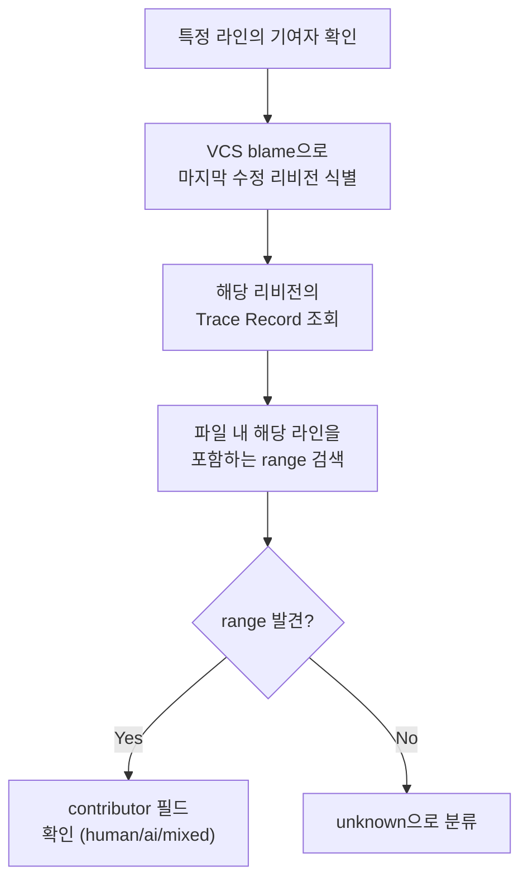
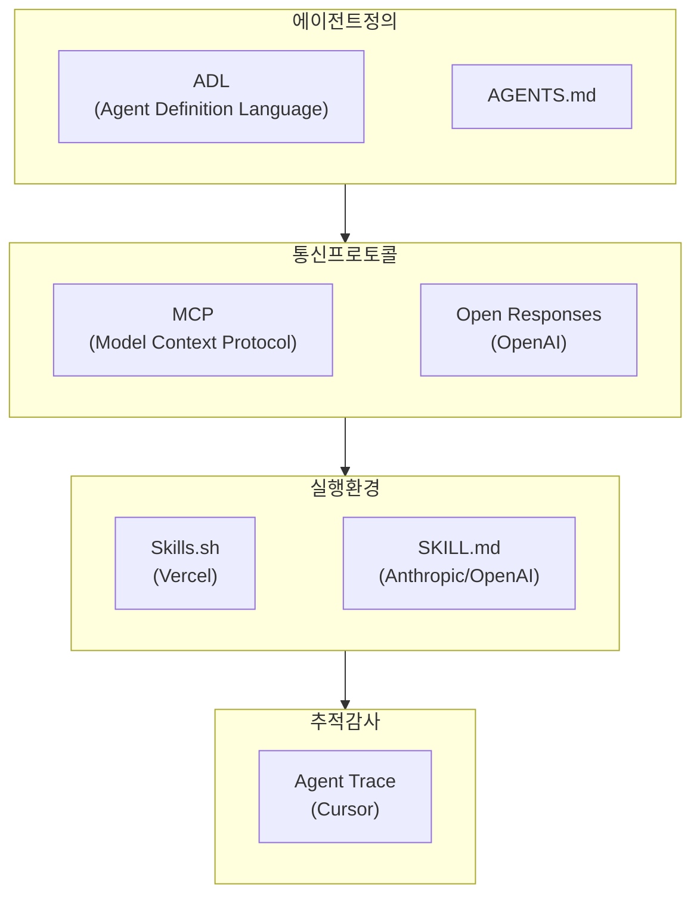

## 개요

2026년 1월, Cursor가 <strong>Agent Trace</strong>라는 오픈 사양(RFC)을 공개했습니다. 버전 0.1.0으로 시작된 이 사양은 "AI가 작성한 코드를 어떻게 추적할 것인가"라는 질문에 대한 업계 최초의 체계적인 답변입니다.

현재 대부분의 개발팀이 사용하는 `git blame`은 "누가 마지막으로 이 줄을 수정했는가"만 알려줍니다. 하지만 AI 코딩 도구가 보편화된 지금, 진짜 필요한 정보는 다릅니다. <strong>이 코드는 인간이 작성한 것인가, AI가 생성한 것인가, 아니면 둘의 협업 결과인가?</strong>

이 글에서는 Agent Trace의 기술 사양을 분석하고, Engineering Manager와 CTO 관점에서 왜 이 표준이 중요한지 살펴봅니다.

## Agent Trace란 무엇인가

Agent Trace는 버전 관리되는 코드베이스에서 <strong>AI 기여와 인간 기여를 벤더 중립적인 JSON 포맷으로 기록</strong>하는 오픈 사양입니다.

핵심 특징은 다음과 같습니다.

<strong>파일 및 라인 수준의 기여 추적</strong>: 단순히 "이 커밋에 AI가 관여했다"가 아니라, 특정 파일의 몇 번째 줄부터 몇 번째 줄까지가 AI에 의해 생성되었는지를 기록합니다.

<strong>4가지 기여자 유형 분류</strong>: `human`(인간 직접 작성), `ai`(AI 생성), `mixed`(인간이 AI 출력을 편집하거나 그 반대), `unknown`(출처 불명)으로 분류합니다.

<strong>벤더 중립적 설계</strong>: Cursor, Copilot, Claude Code 등 어떤 도구에서든 동일한 포맷으로 기록할 수 있습니다.

<strong>저장소 비종속</strong>: 로컬 파일, git notes, 데이터베이스 등 원하는 어디에나 저장할 수 있습니다.

## Trace Record의 구조

Agent Trace의 기본 단위는 <strong>Trace Record</strong>입니다. JSON 스키마를 살펴보겠습니다.

```json
{
  "version": "0.1.0",
  "id": "550e8400-e29b-41d4-a716-446655440000",
  "timestamp": "2026-01-15T09:30:00Z",
  "vcs": {
    "type": "git",
    "revision": "a1b2c3d4e5f6..."
  },
  "tool": {
    "name": "cursor",
    "version": "0.45.0"
  },
  "files": [
    {
      "path": "src/utils/parser.ts",
      "conversations": [
        {
          "url": "https://cursor.com/conversations/abc123",
          "ranges": [
            {
              "start_line": 15,
              "end_line": 42,
              "contributor": "ai",
              "content_hash": "murmur3:9f2e8a1b"
            },
            {
              "start_line": 43,
              "end_line": 50,
              "contributor": "mixed"
            }
          ]
        }
      ]
    }
  ],
  "metadata": {
    "dev.cursor": {
      "session_id": "xyz789"
    }
  }
}
```

이 구조에서 주목할 점이 몇 가지 있습니다.

<strong>대화(conversation) 기반 그룹화</strong>: AI와의 하나의 대화 세션에서 생성된 여러 코드 범위를 묶어서 관리합니다. 이는 "왜 이 코드가 이렇게 생성되었는가"를 추적하는 데 핵심입니다.

<strong>content_hash로 코드 이동 추적</strong>: 코드가 리팩토링으로 다른 파일이나 위치로 이동하더라도, 해시값을 통해 원래의 기여 정보를 유지할 수 있습니다.

<strong>모델 식별자</strong>: `provider/model-name` 형식(예: `anthropic/claude-opus-4-5-20251101`)으로 어떤 AI 모델이 코드를 생성했는지 기록합니다.

## 라인 추적 방법론

Agent Trace에서 특정 라인의 기여자를 확인하는 과정은 다음과 같습니다.



이 방식은 기존의 `git blame`과 상호보완적으로 작동합니다. `git blame`이 "누가 마지막으로 수정했는가"를 알려준다면, Agent Trace는 "그 수정이 AI에 의한 것인지, 인간에 의한 것인지"를 추가로 알려줍니다.

## EM과 CTO에게 왜 중요한가

### 1. 코드 리뷰 워크플로우의 진화

현재 대부분의 팀에서는 PR(Pull Request)의 모든 코드를 동일한 수준으로 리뷰합니다. 하지만 Agent Trace가 도입되면 리뷰 전략을 차별화할 수 있습니다.

<strong>AI 생성 코드</strong>: 로직 정확성, 엣지 케이스, 보안 취약점에 집중 리뷰

<strong>인간 작성 코드</strong>: 설계 의도, 아키텍처 적합성 중심 리뷰

<strong>Mixed 코드</strong>: AI 출력을 인간이 어떻게 수정했는지, 수정 이유가 타당한지 확인

이를 통해 리뷰 시간을 효율적으로 배분할 수 있습니다.

### 2. 팀 역량 측정의 새로운 기준

AI 도구 활용률이 높다고 해서 생산성이 높은 것은 아닙니다. Agent Trace 데이터를 분석하면 다음을 파악할 수 있습니다.

<strong>AI 생성 코드의 수정률</strong>: AI가 생성한 코드 중 인간이 다시 수정해야 했던 비율. 이 값이 높으면 프롬프트 품질이나 AI 도구 선택을 재검토해야 합니다.

<strong>도구별 코드 품질 비교</strong>: Cursor, Copilot, Claude Code 등 도구별로 생성된 코드의 결함률을 비교할 수 있습니다.

<strong>팀원별 AI 활용 패턴</strong>: 누가 AI를 효과적으로 활용하고 있는지, 어떤 영역에서 AI 활용 교육이 필요한지 데이터 기반으로 판단할 수 있습니다.

### 3. 컴플라이언스와 감사 대응

금융, 의료, 방산 등 규제 산업에서는 코드의 출처를 명확히 해야 하는 요구사항이 늘어나고 있습니다. Agent Trace는 다음에 도움됩니다.

<strong>감사 추적(Audit Trail)</strong>: 코드의 AI 기여 비율을 정량적으로 보고할 수 있습니다.

<strong>라이선스 리스크 관리</strong>: AI가 생성한 코드 부분을 식별하여 라이선스 검토 대상을 명확히 합니다.

<strong>보안 취약점 대응</strong>: AI 생성 코드에서 보안 이슈가 발견되면, 동일한 대화 세션에서 생성된 다른 코드도 함께 검토할 수 있습니다.

## 지원하는 VCS와 확장성

Agent Trace는 Git 외에도 여러 버전 관리 시스템을 지원합니다.

| VCS | 리비전 형식 | 특이사항 |
|-----|------------|---------|
| git | 40자 hex SHA | 가장 일반적 |
| jj (Jujutsu) | Change ID | 리베이스에도 안정적 |
| hg (Mercurial) | Changeset ID | 레거시 프로젝트 지원 |
| svn | Revision 번호 | 엔터프라이즈 환경 |

또한 `metadata` 필드에 역도메인 표기법(예: `dev.cursor`, `com.github`)으로 벤더별 확장 데이터를 추가할 수 있어, 호환성을 깨뜨리지 않으면서 각 도구의 고유 정보를 저장할 수 있습니다.

## 의도적으로 다루지 않는 것

Agent Trace 사양이 명시적으로 제외한 영역도 중요합니다.

<strong>법적 소유권/저작권</strong>: AI가 생성한 코드의 법적 소유권 문제는 이 사양의 범위 밖입니다. 이는 법률과 정책의 영역입니다.

<strong>학습 데이터 출처 추적</strong>: AI 모델이 어떤 학습 데이터를 기반으로 코드를 생성했는지는 추적하지 않습니다.

<strong>코드 품질 평가</strong>: AI 생성 코드가 좋은 코드인지 나쁜 코드인지 판단하지 않습니다. 이는 코드 리뷰와 테스트의 영역입니다.

<strong>UI 표현 방식</strong>: 추적 데이터를 어떻게 시각화할지는 각 도구의 구현에 맡깁니다.

이러한 경계 설정은 사양이 현실적이고 채택 가능하도록 만드는 데 핵심적입니다.

## 실무 도입 시나리오

### 시나리오 1: AI 코딩 도구 도입 효과 측정

팀에 Claude Code를 도입한 후 3개월이 지났다고 가정합시다. Agent Trace 데이터를 분석하면 다음과 같은 리포트를 생성할 수 있습니다.

```
AI 코드 기여 분석 리포트 (2026 Q1)
====================================
전체 코드 라인: 45,000
├── human: 28,000 (62.2%)
├── ai: 12,000 (26.7%)
├── mixed: 4,500 (10.0%)
└── unknown: 500 (1.1%)

AI 생성 코드 수정률: 23%
(AI가 생성한 12,000줄 중 2,760줄이 후속 커밋에서 인간에 의해 수정됨)

모델별 분포:
├── anthropic/claude-opus-4-5: 7,200줄 (수정률 18%)
├── openai/gpt-5.2: 3,800줄 (수정률 31%)
└── cursor/custom: 1,000줄 (수정률 15%)
```

이런 데이터가 있다면 AI 도구 투자 대비 효과를 경영진에게 정량적으로 보고할 수 있습니다.

### 시나리오 2: 보안 인시던트 대응

프로덕션에서 보안 취약점이 발견되었을 때, Agent Trace를 통해 해당 코드가 AI에 의해 생성되었음을 확인하고, 같은 대화 세션에서 생성된 다른 코드도 함께 보안 점검 대상으로 포함시킬 수 있습니다.

## AI 에이전트 표준화의 큰 그림

Agent Trace는 단독으로 존재하는 것이 아닙니다. 2025〜2026년에 걸쳐 AI 에이전트 생태계에서 여러 표준이 동시에 등장하고 있습니다.



Agent Trace는 이 생태계에서 <strong>"실행 후(post-execution)"</strong> 단계를 담당합니다. 에이전트가 정의되고(ADL/AGENTS.md), 통신하고(MCP/Open Responses), 실행한(Skills) 후의 결과물을 추적하는 역할입니다.

## 현재 한계와 미해결 과제

RFC 상태인 만큼, 아직 해결되지 않은 과제들이 있습니다.

<strong>머지와 리베이스 처리</strong>: 브랜치 병합 시 Trace Record가 어떻게 합쳐져야 하는지 아직 명확한 답이 없습니다.

<strong>대규모 에이전트 변경</strong>: AI가 한 번에 수백 개 파일을 수정하는 경우의 성능과 저장 전략이 미정입니다.

<strong>채택 인센티브</strong>: 도구 벤더들이 이 사양을 채택해야 하는 동기 부여가 필요합니다. 현재는 Cursor가 주도하고 있으며, Vercel, Cognition, Cloudflare 등이 파트너로 참여하고 있습니다.

## 결론

Agent Trace는 AI 코딩 시대의 <strong>"누가 이 코드를 작성했는가"</strong>라는 근본적인 질문에 대한 첫 번째 체계적인 답변입니다. 아직 RFC 단계이지만, 코드 리뷰, 팀 역량 측정, 컴플라이언스라는 세 가지 실무 영역에서 즉시 가치를 제공할 수 있는 잠재력을 가지고 있습니다.

특히 EM이나 CTO 관점에서는 이 사양의 발전을 주시하면서, 팀 내 AI 코딩 도구 사용 현황을 측정하는 기반을 미리 준비해 두는 것이 현명한 전략입니다. Agent Trace가 성숙하면, 그 데이터는 AI 도구 투자 판단과 팀 운영 최적화의 핵심 근거가 될 것입니다.

## 참고 자료

- [Agent Trace 공식 사이트](https://agent-trace.dev/)
- [Cursor Agent Trace GitHub 저장소](https://github.com/cursor/agent-trace)
- [InfoQ: Agent Trace 분석 기사](https://www.infoq.com/news/2026/02/agent-trace-cursor/)
- [Cognition: Agent Trace 컨텍스트 그래프](https://cognition.ai/blog/agent-trace)
