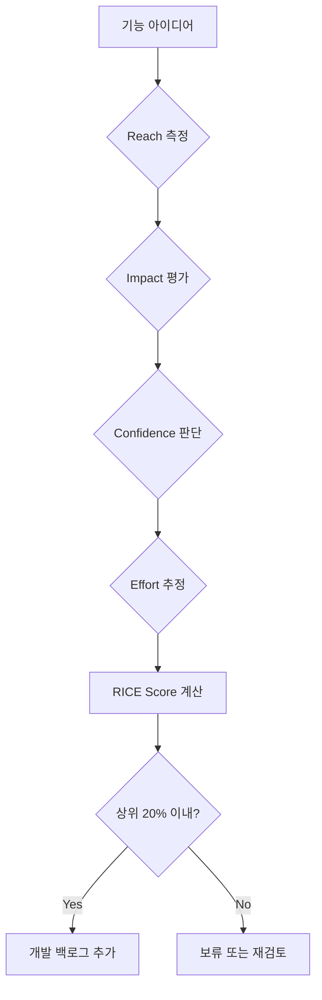
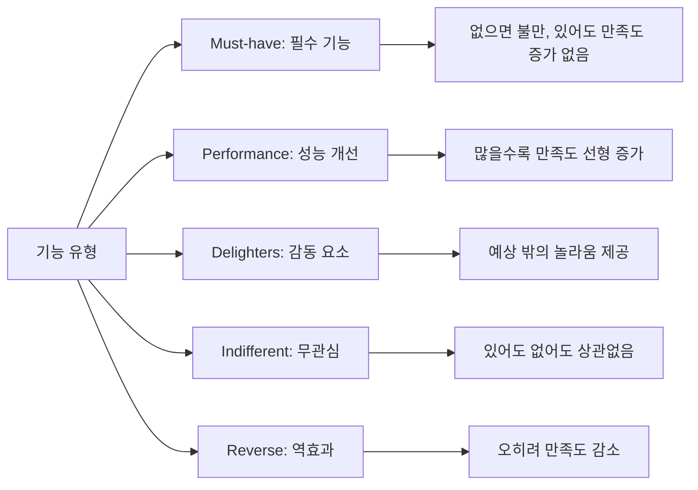
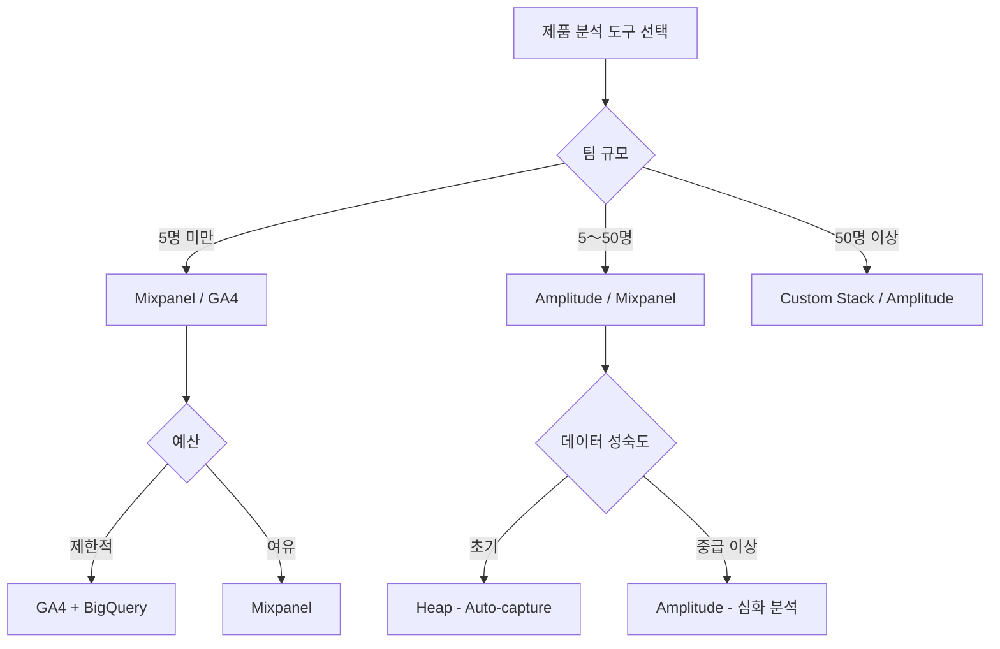
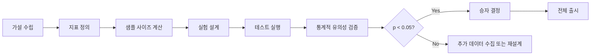
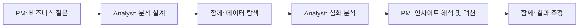

## 개요: 왜 데이터 기반 의사결정이 중요한가

제품 관리자(PM)는 매일 수십 가지 결정을 내립니다. 어떤 기능을 우선 개발할지, 사용자 경험을 어떻게 개선할지, 리소스를 어디에 투자할지 등 중요한 선택의 연속입니다. 직관과 경험도 중요하지만, <strong>데이터에 기반한 의사결정</strong>은 성공 확률을 크게 높여줍니다.

Netflix, Spotify, Amazon과 같은 글로벌 기업들이 데이터 중심 문화로 시장을 선도하는 이유는 명확합니다. 데이터는 다음을 가능하게 합니다:

- <strong>객관적인 우선순위 결정</strong>: 주관적 의견이 아닌 실제 사용자 행동 기반
- <strong>빠른 실험과 검증</strong>: A/B 테스트로 가설을 신속하게 테스트
- <strong>리스크 최소화</strong>: 큰 투자 전 데이터로 방향성 검증
- <strong>팀 정렬</strong>: 공통 지표로 이해관계자 간 합의 도출

이 글에서는 PM이 실무에서 바로 활용할 수 있는 핵심 지표, 의사결정 프레임워크, 분석 도구, 그리고 실전 사례를 상세히 다룹니다.

## 핵심 지표: 제품의 건강 상태 측정하기

### 1. 사용자 참여도 지표

#### DAU/MAU Ratio (Daily Active Users / Monthly Active Users)

<strong>DAU/MAU 비율</strong>은 사용자 참여도를 측정하는 가장 기본적인 지표입니다.

```
DAU/MAU Ratio = (일일 활성 사용자 수 / 월간 활성 사용자 수) × 100%
```

<strong>벤치마크</strong>:
- 20% 이상: 우수한 참여도 (예: Facebook, Instagram)
- 10〜20%: 양호한 수준 (대부분의 소셜 앱)
- 10% 미만: 개선 필요 (유틸리티 앱은 예외)

<strong>실무 활용</strong>:
- 제품의 "습관 형성력"을 측정
- 신규 기능 출시 후 참여도 변화 추적
- 경쟁사와 벤치마킹

#### Retention Rate (재방문율)

사용자가 얼마나 오래 제품을 사용하는지 측정합니다.

<strong>측정 시점별 분류</strong>:
- <strong>Day 1 Retention</strong>: 가입 다음 날 재방문율 (30〜40% 이상 목표)
- <strong>Day 7 Retention</strong>: 일주일 후 (20〜30%)
- <strong>Day 30 Retention</strong>: 한 달 후 (10〜20%)

<strong>Cohort Retention 분석 SQL</strong>:

```sql
-- 코호트별 재방문율 분석
WITH user_cohorts AS (
  SELECT
    user_id,
    DATE_TRUNC('month', first_login_date) AS cohort_month
  FROM users
),
cohort_activity AS (
  SELECT
    uc.cohort_month,
    DATE_TRUNC('month', a.activity_date) AS activity_month,
    COUNT(DISTINCT uc.user_id) AS active_users
  FROM user_cohorts uc
  JOIN user_activity a ON uc.user_id = a.user_id
  WHERE a.activity_date >= uc.cohort_month
  GROUP BY 1, 2
)
SELECT
  cohort_month,
  activity_month,
  active_users,
  ROUND(100.0 * active_users /
    FIRST_VALUE(active_users) OVER (
      PARTITION BY cohort_month
      ORDER BY activity_month
    ), 2
  ) AS retention_rate
FROM cohort_activity
ORDER BY cohort_month, activity_month;
```

### 2. 비즈니스 성과 지표

#### NPS (Net Promoter Score)

사용자 만족도와 추천 의향을 측정하는 지표입니다.

```
NPS = (추천 고객 비율) - (비추천 고객 비율)
```

<strong>점수 해석</strong>:
- 9〜10점: Promoters (추천 고객)
- 7〜8점: Passives (중립)
- 0〜6점: Detractors (비추천 고객)

<strong>산업별 벤치마크</strong>:
- SaaS: 30〜40
- E-commerce: 30〜50
- Consumer Apps: 20〜40

#### Conversion Rate & Funnel Analysis

사용자 여정의 각 단계별 전환율을 측정합니다.

<strong>E-commerce 깔때기 예시</strong>:
```
방문 → 상품 조회 → 장바구니 → 결제 → 구매 완료
100% →   60%    →   25%   →  15%  →    12%
```

<strong>Funnel 분석 SQL</strong>:

```sql
-- 사용자 여정 깔때기 분석
WITH funnel_events AS (
  SELECT
    user_id,
    MAX(CASE WHEN event_name = 'page_view' THEN 1 ELSE 0 END) AS viewed,
    MAX(CASE WHEN event_name = 'product_click' THEN 1 ELSE 0 END) AS clicked,
    MAX(CASE WHEN event_name = 'add_to_cart' THEN 1 ELSE 0 END) AS added_cart,
    MAX(CASE WHEN event_name = 'checkout' THEN 1 ELSE 0 END) AS checked_out,
    MAX(CASE WHEN event_name = 'purchase' THEN 1 ELSE 0 END) AS purchased
  FROM user_events
  WHERE event_date BETWEEN '2025-10-01' AND '2025-10-31'
  GROUP BY user_id
)
SELECT
  SUM(viewed) AS total_views,
  SUM(clicked) AS total_clicks,
  ROUND(100.0 * SUM(clicked) / NULLIF(SUM(viewed), 0), 2) AS click_rate,
  SUM(added_cart) AS total_cart_adds,
  ROUND(100.0 * SUM(added_cart) / NULLIF(SUM(clicked), 0), 2) AS cart_rate,
  SUM(checked_out) AS total_checkouts,
  ROUND(100.0 * SUM(checked_out) / NULLIF(SUM(added_cart), 0), 2) AS checkout_rate,
  SUM(purchased) AS total_purchases,
  ROUND(100.0 * SUM(purchased) / NULLIF(SUM(checked_out), 0), 2) AS purchase_rate
FROM funnel_events;
```

### 3. 제품 유형별 맞춤 지표

| 제품 유형 | 핵심 지표 | 설명 |
|---------|----------|------|
| <strong>B2B SaaS</strong> | MRR (Monthly Recurring Revenue) | 월간 반복 매출 |
| | Churn Rate | 이탈률 (5% 미만 목표) |
| | CAC Payback Period | 고객 획득 비용 회수 기간 |
| <strong>Marketplace</strong> | GMV (Gross Merchandise Value) | 총 거래액 |
| | Take Rate | 수수료율 |
| | Liquidity (공급-수요 매칭률) | 양면 시장 균형도 |
| <strong>Consumer Apps</strong> | Session Length | 평균 사용 시간 |
| | Screen Flow Efficiency | 화면 전환 효율성 |
| | Feature Adoption Rate | 신규 기능 채택률 |

## 의사결정 프레임워크: 무엇을 먼저 할 것인가

### 1. RICE Framework

RICE는 <strong>Reach</strong>, <strong>Impact</strong>, <strong>Confidence</strong>, <strong>Effort</strong>의 약자로, 기능 우선순위를 정량적으로 평가합니다.

```
RICE Score = (Reach × Impact × Confidence) / Effort
```

<strong>각 요소 설명</strong>:

| 요소 | 측정 방법 | 예시 |
|-----|----------|------|
| <strong>Reach</strong> | 분기당 영향받는 사용자 수 | 10,000명 |
| <strong>Impact</strong> | 사용자당 영향도 (0.25〜3) | 2.0 (큰 영향) |
| <strong>Confidence</strong> | 확신도 (0〜100%) | 80% |
| <strong>Effort</strong> | 개발 공수 (person-months) | 2개월 |

<strong>실전 예시</strong>:



<strong>실제 계산 예시</strong>:

| 기능 | Reach | Impact | Confidence | Effort | RICE Score |
|-----|-------|--------|------------|--------|-----------|
| 소셜 로그인 추가 | 15,000 | 1.5 | 90% | 1 | 20,250 |
| AI 추천 시스템 | 25,000 | 2.5 | 60% | 4 | 9,375 |
| 다크 모드 | 8,000 | 1.0 | 100% | 0.5 | 16,000 |

결과: <strong>소셜 로그인</strong>이 가장 높은 RICE 점수로 1순위

### 2. ICE Framework (간소화 버전)

빠른 의사결정이 필요할 때 사용하는 경량 프레임워크입니다.

```
ICE Score = (Impact + Confidence + Ease) / 3
```

- <strong>Impact</strong>: 영향도 (1〜10)
- <strong>Confidence</strong>: 확신도 (1〜10)
- <strong>Ease</strong>: 구현 용이성 (1〜10)

<strong>활용 시나리오</strong>: 스프린트 플래닝, 스타트업 초기 단계, 빠른 실험 평가

### 3. Kano Model (사용자 만족도 분석)

기능을 사용자 만족도 기준으로 분류합니다.



<strong>실무 적용</strong>:
1. <strong>Must-have 먼저 충족</strong>: 로그인, 검색, 결제 등
2. <strong>Performance 지속 개선</strong>: 속도, 정확도, UX
3. <strong>Delighters 선별 투자</strong>: 차별화 포인트

### 4. Value vs Effort Matrix (2x2 매트릭스)

시각적으로 빠르게 우선순위를 파악합니다.

```
높은 가치
    ↑
    │  Quick Wins     │  Major Projects
    │  (즉시 실행)     │  (계획 후 실행)
────┼──────────────┼────────────────→
    │  Fill-ins       │  Time Sinks
    │  (여유 시 실행)  │  (보류/폐기)
    ↓
낮은 가치          낮은 노력 ← → 높은 노력
```

## 데이터 분석 도구: 무엇을 선택할 것인가

### 주요 Product Analytics 도구 비교

| 도구 | 강점 | 약점 | 가격대 | 추천 대상 |
|-----|------|------|--------|----------|
| <strong>Amplitude</strong> | - 강력한 Behavioral Cohort<br>- 심화 퍼널 분석<br>- Predictive Analytics | - 학습 곡선 가파름<br>- 설정 복잡도 높음 | $$$ | B2B SaaS, 성장 단계 스타트업 |
| <strong>Mixpanel</strong> | - 직관적인 UI<br>- 실시간 분석<br>- 우수한 문서 | - 대규모 데이터 처리 시 느림 | $$ | Consumer Apps, 중소 규모 팀 |
| <strong>Heap</strong> | - Auto-capture (코드 변경 불필요)<br>- 회고적 분석 가능 | - 데이터 양 많을 시 비용↑<br>- 커스터마이징 제한 | $$$ | 빠른 프로토타이핑, 초기 단계 |
| <strong>Google Analytics 4</strong> | - 무료<br>- 광범위한 통합<br>- 강력한 머신러닝 | - 복잡한 인터페이스<br>- Product-specific 기능 부족 | Free | 예산 제약, 웹 중심 제품 |

### 도구 선택 기준



### SQL 기반 자체 분석 스택 구축

많은 기업이 <strong>Data Warehouse + SQL + BI 도구</strong> 조합을 선호합니다.

<strong>장점</strong>:
- 완전한 데이터 통제권
- 비용 효율성 (대규모 시)
- 커스터마이징 자유도

<strong>구성 예시</strong>:
```
데이터 수집: Segment / RudderStack
    ↓
저장: Snowflake / BigQuery
    ↓
변환: dbt (data build tool)
    ↓
시각화: Looker / Tableau / Metabase
```

## A/B 테스트: 과학적 실험으로 검증하기

### A/B 테스트 프로세스



### 샘플 사이즈 계산

<strong>필요한 샘플 수 공식</strong> (간소화):

```
n = (Z² × p × (1-p)) / E²

n: 필요한 샘플 수
Z: 신뢰 수준 (95% → 1.96)
p: 예상 전환율
E: 허용 오차
```

<strong>실전 계산기</strong>: [Evan Miller's Sample Size Calculator](https://www.evanmiller.org/ab-testing/sample-size.html)

<strong>예시</strong>:
- 현재 전환율: 10%
- 최소 감지 효과: 2% (절대값)
- 신뢰 수준: 95%
- 검정력: 80%

→ <strong>필요 샘플 수: 약 3,800명/그룹</strong>

### A/B 테스트 Best Practices

#### 1. 명확한 가설 수립

<strong>나쁜 예시</strong>: "버튼 색을 바꿔보자"

<strong>좋은 예시</strong>:
```
가설: CTA 버튼을 파란색에서 초록색으로 변경하면,
      사용자의 심리적 "안전감" 증가로 인해
      가입 전환율이 5% 이상 증가할 것이다.

귀무가설(H0): 색상 변경이 전환율에 영향을 주지 않는다.
대립가설(H1): 초록색 버튼이 전환율을 증가시킨다.
```

#### 2. 하나의 변수만 테스트 (Multivariate 주의)

- <strong>A/B 테스트</strong>: 버튼 색상만 변경
- <strong>Multivariate 테스트</strong>: 버튼 색상 + 문구 + 위치 동시 변경 (복잡도↑)

#### 3. 충분한 테스트 기간

<strong>최소 기간</strong>: 1〜2주 (요일 효과 제거)
<strong>주의</strong>: 너무 짧으면 "novelty effect" (신기함 효과)에 영향받음

#### 4. 세그먼트별 분석

전체 평균만 보지 말고 세그먼트별로 분석하세요.

```sql
-- 세그먼트별 A/B 테스트 결과 분석
SELECT
  user_segment,
  experiment_group,
  COUNT(DISTINCT user_id) AS users,
  SUM(converted) AS conversions,
  ROUND(100.0 * SUM(converted) / COUNT(DISTINCT user_id), 2) AS conversion_rate
FROM ab_test_results
WHERE test_id = 'checkout_button_color'
GROUP BY user_segment, experiment_group
ORDER BY user_segment, experiment_group;
```

<strong>결과 예시</strong>:

| Segment | Group | Users | Conversions | Conv. Rate |
|---------|-------|-------|-------------|-----------|
| New Users | Control | 5,000 | 500 | 10.0% |
| New Users | Treatment | 5,000 | 575 | 11.5% |
| Returning | Control | 3,000 | 600 | 20.0% |
| Returning | Treatment | 3,000 | 585 | 19.5% |

<strong>인사이트</strong>: 신규 사용자는 긍정적이지만 재방문자는 부정적 → <strong>신규 사용자만 타겟팅 고려</strong>

### 흔한 A/B 테스트 실수

#### 1. Peeking Problem (중간 확인 오류)

실험 중간에 결과를 보고 조기 종료하면 <strong>위양성(False Positive)</strong> 확률 증가.

<strong>해결책</strong>: Sequential Testing 또는 사전에 정한 종료 시점 엄수

#### 2. Simpson's Paradox

전체적으로는 A가 우세하지만, 세그먼트별로는 B가 우세한 경우.

<strong>예시</strong>:
```
전체: Treatment 승리 (12% vs 11%)
모바일: Control 승리 (8% vs 7%)
데스크톱: Control 승리 (15% vs 14%)
```

→ Treatment 그룹에 고전환율 세그먼트가 많이 배정된 것 (무작위 배정 실패)

#### 3. 통계적 유의성 ≠ 실질적 의미

p < 0.05 달성해도 <strong>효과 크기가 작으면 실행 가치 없을 수 있음</strong>.

<strong>판단 기준</strong>:
- 절대값: 전환율 0.1% 증가 (10.0% → 10.1%)
- 상대값: 1% 증가
- 비즈니스 영향: 월 매출 $500 증가

→ 개발 비용 대비 ROI 검토 필요

## 실전 사례: 글로벌 기업의 데이터 활용법

### 1. Netflix: 개인화 추천 시스템

<strong>도전 과제</strong>: 수천만 콘텐츠 중 사용자가 볼 콘텐츠를 어떻게 찾게 할까?

<strong>데이터 기반 해결책</strong>:
- <strong>75%의 시청이 추천에서 발생</strong>
- A/B 테스트로 썸네일 이미지 최적화
- 사용자별 다른 썸네일 표시 (개인화)

<strong>핵심 지표</strong>:
- Effective Catalog Size: 실제 시청되는 콘텐츠 비율
- Take Rate: 추천 클릭 후 시청 전환율

<strong>결과</strong>: 추천 알고리즘이 연간 <strong>$1B 이상의 가치</strong> 창출 (이탈 방지)

### 2. Spotify: Discover Weekly

<strong>도전 과제</strong>: 사용자가 새로운 음악을 발견하도록 유도

<strong>데이터 활용</strong>:
- Collaborative Filtering + NLP (가사 분석)
- 청취 이력, 스킵 패턴, 플레이리스트 저장 데이터 활용

<strong>A/B 테스트 결과</strong>:
- <strong>재생 시간 9% 증가</strong>
- 프리미엄 전환율 5% 개선

<strong>핵심 인사이트</strong>: "신선함 vs 익숙함" 균형 (70% 익숙한 장르 + 30% 새로운 장르)

### 3. Airbnb: Dynamic Pricing (Smart Pricing)

<strong>도전 과제</strong>: 호스트가 최적 가격을 설정하도록 지원

<strong>데이터 모델</strong>:
- 수요 예측: 지역 이벤트, 계절성, 검색 트렌드
- 공급 분석: 주변 숙소 가격, 편의시설
- 머신러닝으로 최적 가격 제안

<strong>결과</strong>:
- 호스트 수익 <strong>평균 4% 증가</strong>
- 예약률 8% 상승

### 4. Amazon: 1-Click Ordering

<strong>가설</strong>: 결제 단계가 많을수록 이탈률 증가

<strong>실험</strong>:
- Control: 기존 3단계 결제
- Treatment: 원클릭 결제

<strong>결과</strong>:
- 전환율 <strong>20% 이상 증가</strong>
- 특허 획득 및 경쟁 우위 확보

<strong>교훈</strong>: <strong>마찰(friction) 제거가 핵심</strong>

## 데이터 함정 피하기: 흔한 실수들

### 1. Correlation ≠ Causation (상관관계 ≠ 인과관계)

<strong>예시</strong>:
- 관찰: "앱 푸시 알림을 많이 받는 사용자일수록 재방문율 높음"
- 잘못된 결론: "푸시 알림을 더 보내면 재방문율 증가"
- 실제 원인: 활동적인 사용자가 푸시를 더 많이 받은 것

<strong>해결책</strong>: <strong>Randomized Controlled Trial (RCT)</strong> = A/B 테스트

### 2. Vanity Metrics (허영 지표)

의미 없는 숫자에 집착하지 마세요.

| Vanity Metric | Actionable Metric |
|--------------|------------------|
| 총 회원 수 | 월간 활성 사용자(MAU) |
| 페이지뷰 | 세션당 목표 달성률 |
| 앱 다운로드 수 | Day 7 Retention |
| 팔로워 수 | Engagement Rate (좋아요, 댓글) |

### 3. Survivorship Bias (생존자 편향)

<strong>예시</strong>: "성공한 사용자들은 모두 튜토리얼을 완료했다"
→ 하지만 튜토리얼 중 이탈한 사용자는 분석에서 제외됨

<strong>해결책</strong>: <strong>이탈 사용자 분석</strong> 포함

```sql
-- 이탈 사용자 vs 유지 사용자 행동 비교
SELECT
  CASE
    WHEN last_login_date < CURRENT_DATE - INTERVAL '30 days' THEN 'Churned'
    ELSE 'Active'
  END AS user_status,
  AVG(sessions_count) AS avg_sessions,
  AVG(feature_usage_count) AS avg_feature_usage,
  AVG(tutorial_completion_rate) AS avg_tutorial_completion
FROM user_metrics
GROUP BY user_status;
```

### 4. HARKing (Hypothesizing After Results are Known)

데이터를 본 후 가설을 만드는 것 = <strong>과학적 방법 위반</strong>

<strong>올바른 순서</strong>:
1. 가설 수립
2. 실험 설계
3. 데이터 수집
4. 분석 및 결론

<strong>잘못된 순서</strong>:
1. 데이터 수집
2. 패턴 발견
3. 가설 추가 (사후 정당화)

### 5. 다중 비교 문제 (Multiple Comparisons)

20개의 A/B 테스트를 동시에 실행하면, 우연히 1개는 p < 0.05 나올 수 있음.

<strong>해결책</strong>: <strong>Bonferroni Correction</strong> 적용
```
조정된 유의수준 = 0.05 / 테스트 개수
```

예: 10개 테스트 → p < 0.005 기준 적용

## 데이터 문화 구축: 조직 차원의 변화

### 1. Data Literacy 교육

<strong>모든 팀원이 데이터를 읽고 해석할 수 있어야 합니다.</strong>

<strong>교육 프로그램</strong>:
- 기초 SQL 교육 (2주 과정)
- 통계 101: p-value, 신뢰구간, 표본 크기
- 대시보드 읽는 법 (주요 지표 이해)

<strong>추천 리소스</strong>:
- Mode Analytics SQL Tutorial
- Khan Academy Statistics
- Amplitude's Product Analytics Playbook

### 2. 셀프 서비스 분석 인프라

PM이 데이터 팀에 의존하지 않고 직접 분석할 수 있어야 합니다.

<strong>구축 요소</strong>:
- 표준화된 데이터 웨어하우스
- 사전 정의된 지표 (Metric Layer)
- 대시보드 템플릿
- SQL 쿼리 라이브러리

<strong>도구 예시</strong>:
- dbt (데이터 변환 및 문서화)
- Looker / Tableau (셀프 서비스 BI)
- Metabase (오픈소스 대안)

### 3. 데이터 거버넌스

<strong>정의해야 할 것들</strong>:
- <strong>North Star Metric</strong>: 회사 전체의 최우선 지표
- 지표 정의 문서 (DAU의 정확한 정의는?)
- 데이터 품질 SLA (정확도, 신선도, 완결성)

<strong>예시: North Star Metric</strong>:
- Spotify: Time Spent Listening
- Airbnb: Nights Booked
- Facebook: Daily Active Users (DAU)

### 4. 실험 중심 문화

<strong>"의견"이 아닌 "데이터"로 논쟁을 해결하세요.</strong>

<strong>실천 방법</strong>:
- 모든 기능 출시 전 A/B 테스트 의무화
- 실패한 실험도 공유 (학습 문화)
- 실험 결과 정기 리뷰 회의

<strong>Amazon의 "Disagree and Commit"</strong>:
- 의견이 다르면 데이터로 검증
- 실험 결과에 따라 신속하게 방향 전환

### 5. PM과 Data Analyst 협업

<strong>효과적인 협업 구조</strong>:



<strong>Weekly Data Sync</strong> 권장:
- 지난주 실험 결과 리뷰
- 이번주 우선순위 지표 확인
- 데이터 이슈 및 해결책 논의

## 결론: PM이 오늘부터 할 수 있는 것

데이터 기반 의사결정은 하루아침에 만들어지지 않습니다. 하지만 <strong>작은 습관부터 시작</strong>하면 점진적으로 역량을 키울 수 있습니다.

### 즉시 실천 가능한 액션 플랜

#### Week 1: 기초 다지기
- [ ] 제품의 <strong>핵심 지표 3개</strong> 정의 (DAU, Retention, Conversion)
- [ ] 매일 아침 대시보드 확인 습관 들이기
- [ ] SQL 기초 강의 1개 완료 (예: Mode Analytics Tutorial)

#### Week 2-4: 분석 시작
- [ ] 첫 번째 <strong>Cohort Retention 분석</strong> 실행
- [ ] Funnel 분석으로 주요 이탈 지점 파악
- [ ] 세그먼트별 지표 비교 (신규 vs 재방문, 모바일 vs 데스크톱)

#### Month 2: 실험 시작
- [ ] 첫 번째 <strong>A/B 테스트</strong> 설계 및 실행
- [ ] RICE 프레임워크로 백로그 우선순위 재정렬
- [ ] 팀과 실험 결과 공유 및 학습 세션

#### Month 3+: 문화 구축
- [ ] 매주 "Data Office Hours" 운영 (팀원 질문 답변)
- [ ] 주요 지표 대시보드를 팀 전체와 공유
- [ ] 실패한 실험 사례 발표 (학습 중심)

### 핵심 원칙 3가지

1. <strong>완벽함보다 실행</strong>: 80% 확신으로 시작하고, 반복하며 개선하세요.
2. <strong>데이터는 시작점</strong>: 수치가 모든 것을 말해주지 않습니다. 사용자 인터뷰와 병행하세요.
3. <strong>문화가 전부</strong>: 도구보다 중요한 것은 팀 전체가 데이터를 신뢰하고 활용하는 문화입니다.

### 추천 학습 자료

<strong>책</strong>:
- "Lean Analytics" by Alistair Croll & Benjamin Yoskovitz
- "Trustworthy Online Controlled Experiments" by Ron Kohavi et al.
- "How to Measure Anything" by Douglas W. Hubbard

<strong>온라인 강의</strong>:
- Reforge: [Product Analytics](https://www.reforge.com/product-analytics)
- Udacity: [A/B Testing by Google](https://www.udacity.com/course/ab-testing--ud257)
- Amplitude Academy: 무료 Product Analytics 강의

<strong>커뮤니티</strong>:
- [Lenny's Newsletter](https://www.lennysnewsletter.com/) - PM 인사이트
- [Reforge Community](https://www.reforge.com/community) - 데이터 중심 PM 네트워크
- [Product School](https://productschool.com/) - 이벤트 및 워크샵

---

데이터는 PM의 의사결정을 <strong>더 빠르고, 정확하고, 자신감 있게</strong> 만들어줍니다. 오늘부터 작은 지표 하나를 추적하는 것으로 시작해보세요. 3개월 후, 여러분은 완전히 다른 수준의 PM이 되어 있을 것입니다.
