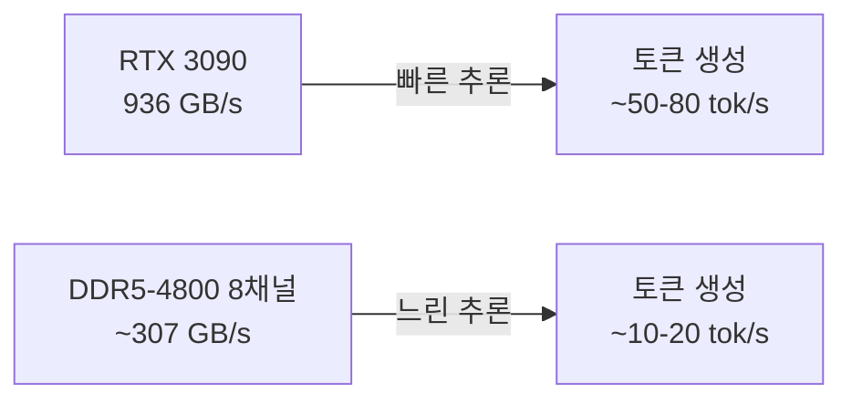
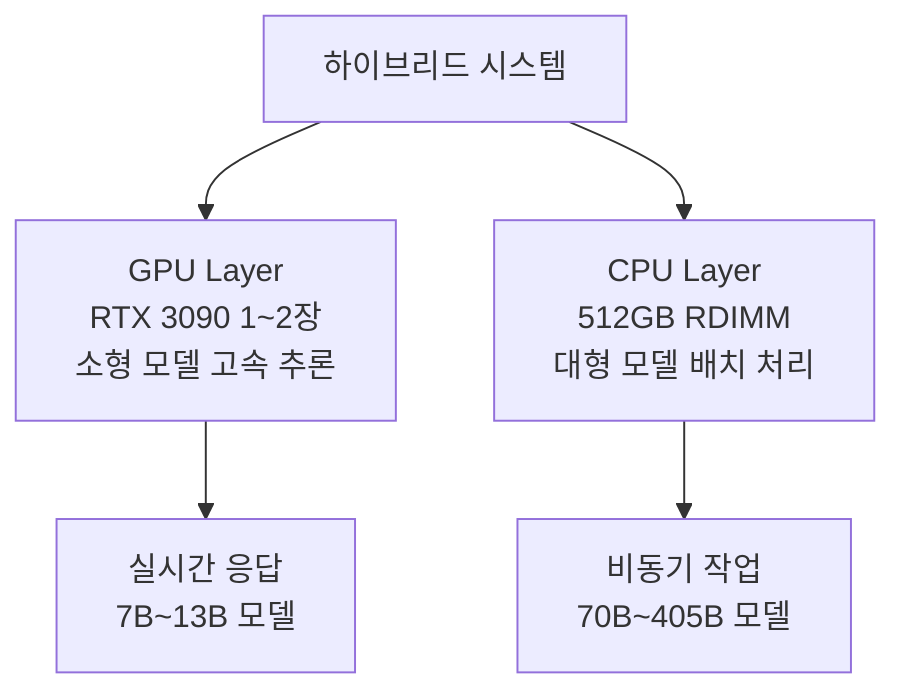

## 개요

2026년 2월, Reddit r/LocalLLaMA 커뮤니티에서 <strong>DDR5 RDIMM의 GB당 가격이 RTX 3090의 VRAM GB당 가격을 하회했다</strong>는 논의가 화제가 되었습니다. 346개의 추천을 받은 이 게시물은 로컬 LLM 하드웨어 선택에 있어 근본적인 전환점을 시사합니다.

그동안 "VRAM이 곧 정의"였던 로컬 LLM 커뮤니티에서, RAM 기반 CPU 추론이 비용 효율성 측면에서 GPU를 역전할 수 있다는 가능성은 많은 사람들에게 충격을 주었습니다.

## GB당 비용 비교: 현재 시점의 실제 수치

### RTX 3090의 VRAM 비용

RTX 3090은 24GB GDDR6X VRAM을 탑재하고 있으며, 2026년 현재 중고 시장에서 약 <strong>$600~800</strong> 수준에 거래되고 있습니다.

- VRAM 24GB 기준: <strong>$25~33/GB</strong>
- 4장 스택 시 (96GB): <strong>$2,400~3,200</strong>
- NVLink 미지원으로 텐서 병렬화 불가, 파이프라인 병렬화만 가능

### DDR5 RDIMM의 비용

DDR5 RDIMM 가격이 급격히 하락하면서 상황이 변했습니다.

- DDR5-4800 RDIMM 128GB: <strong>약 $200~250</strong>
- GB당 비용: <strong>$1.5~2.0/GB</strong>
- 512GB 구성 시: <strong>$800~1,000</strong>

```
┌─────────────────────────────────────────────┐
│         GB당 비용 비교 (2026년 2월)          │
├──────────────────┬──────────────────────────┤
│ RTX 3090 VRAM    │ $25~33/GB               │
│ DDR5 RDIMM       │ $1.5~2.0/GB             │
│ 비용 격차        │ 약 15~20배              │
├──────────────────┴──────────────────────────┤
│ 512GB 메모리 확보 비용                      │
│ GPU (3090 x22장) │ ~$15,000                │
│ RAM (RDIMM x4)   │ ~$1,000                 │
└─────────────────────────────────────────────┘
```

## 그런데 왜 GPU를 쓰는가: 속도의 문제

GB당 비용만 보면 RDIMM이 압도적으로 유리하지만, 핵심은 <strong>추론 속도</strong>입니다.

### 메모리 대역폭 비교



- <strong>RTX 3090</strong>: GDDR6X 936 GB/s 대역폭
- <strong>DDR5-4800 8채널</strong>: 약 307 GB/s 대역폭
- GPU가 약 <strong>3배</strong> 빠른 대역폭을 제공

LLM 추론에서 토큰 생성 속도는 메모리 대역폭에 거의 정비례합니다. 즉, 같은 모델을 실행할 때 GPU가 약 3~5배 빠릅니다.

## 비용 구조 분석: 언제 CPU가 유리한가

### 시나리오 1: 대형 모델 로딩이 목표인 경우

70B~405B 파라미터급 모델을 로컬에서 실행하고 싶다면, VRAM 확보가 최대 병목입니다.

- <strong>Llama 3.1 405B (Q4_K_M)</strong>: 약 230GB 필요
- GPU로 충당: RTX 3090 약 10장 ($6,000~8,000)
- RAM으로 충당: DDR5 RDIMM 256GB ($500) + CPU/MB ($1,000~2,000)

이 경우 <strong>CPU 추론이 비용 대비 압도적으로 유리</strong>합니다.

### 시나리오 2: 빠른 응답이 필수인 경우

실시간 채팅봇이나 코드 자동 완성처럼 지연 시간이 중요한 경우:

- RTX 3090 1장으로 7B~13B 모델: <strong>50+ tok/s</strong>
- DDR5 시스템으로 동일 모델: <strong>10~20 tok/s</strong>

속도가 중요하다면 여전히 <strong>GPU가 압도적</strong>입니다.

### 시나리오 3: 배치 처리/비동기 작업

문서 요약, 번역, 데이터 분석 등 응답 시간이 크게 중요하지 않은 경우:

- GPU 시스템 비용: <strong>$3,000~5,000</strong> (3090 x2~4장)
- CPU 시스템 비용: <strong>$2,000~3,000</strong> (Xeon + 512GB RDIMM)
- CPU 시스템이 <strong>더 큰 모델을 더 저렴하게</strong> 실행 가능

## 커뮤니티 반응과 주요 논점

Reddit 커뮤니티에서 나온 핵심 논점을 정리하면:

### "RDIMM은 컴퓨팅 파워가 포함되지 않는다"

GPU는 VRAM + 컴퓨팅 파워(CUDA 코어)를 함께 제공합니다. RDIMM은 순수 메모리만 제공하므로, 별도의 CPU가 필요합니다. 하지만 최신 Xeon이나 EPYC 프로세서의 AVX-512 성능은 CPU 추론에 상당히 효율적입니다.

### "전력 소비도 고려해야 한다"

- RTX 3090 4장: <strong>~1,400W</strong>
- Xeon + 512GB RDIMM 시스템: <strong>~300~500W</strong>

장기 운영 시 전력 비용 차이가 상당합니다.

### "중고 3090 가격이 더 떨어질 수 있다"

RTX 5090이 출시되면서 3090 중고 가격이 하락 추세에 있지만, RDIMM 가격 하락 속도가 더 빠릅니다.

## 실전 빌드 가이드: CPU 추론 시스템

대용량 모델을 위한 CPU 추론 시스템을 구성한다면:

### 추천 구성 (약 $2,500)

| 부품 | 모델 | 예상 가격 |
|------|------|-----------|
| CPU | Intel Xeon w5-2465X (16코어) | $800 |
| 마더보드 | ASUS Pro WS W790E-SAGE | $700 |
| RAM | DDR5-4800 RDIMM 128GB x4 (512GB) | $800 |
| 기타 | PSU, 케이스, SSD | $200 |

### llama.cpp 설정

```bash
# llama.cpp 빌드 (AVX-512 최적화)
cmake -B build -DGGML_AVX512=ON -DGGML_AVX512_VNNI=ON
cmake --build build --config Release

# 405B 모델 실행 (Q4_K_M 양자화)
./build/bin/llama-server \
  -m models/llama-3.1-405b-q4_k_m.gguf \
  --threads 16 \
  --ctx-size 8192 \
  --host 0.0.0.0 \
  --port 8080
```

## 하이브리드 접근법: GPU + CPU 조합

실제로 가장 현실적인 선택은 <strong>하이브리드 구성</strong>입니다.



- 소형 모델 (7B~13B)은 GPU로 고속 추론
- 대형 모델 (70B+)은 CPU로 비용 효율적 실행
- llama.cpp의 `--n-gpu-layers` 옵션으로 일부 레이어만 GPU에 오프로드 가능

## 결론: 전환점의 의미

DDR5 RDIMM 가격이 RTX 3090 VRAM의 GB당 비용을 하회한 것은 단순한 가격 역전이 아닙니다. 이것은 <strong>로컬 LLM 운영 전략의 근본적 변화</strong>를 의미합니다.

1. <strong>대형 모델 접근성 향상</strong>: 405B급 모델도 $2,500 시스템으로 실행 가능
2. <strong>비용 최적화 옵션 다양화</strong>: 용도에 따라 GPU/CPU/하이브리드 선택
3. <strong>진입 장벽 하락</strong>: 로컬 LLM 실험의 비용이 크게 감소

속도가 최우선이라면 여전히 GPU가 정답입니다. 하지만 <strong>"가장 큰 모델을 가장 저렴하게"</strong>가 목표라면, DDR5 RDIMM 기반 CPU 추론이 2026년의 새로운 최적해가 되고 있습니다.

## 참고 자료

- [Reddit r/LocalLLaMA: PSA: DDR5 RDIMM price passed the point were 3090 are less expensive per gb](https://www.reddit.com/r/LocalLLaMA/comments/1r83irw/psa_ddr5_rdimm_price_passed_the_point_were_3090/)
- [llama.cpp GitHub Repository](https://github.com/ggml-org/llama.cpp)
- [DDR5 RDIMM Pricing Trends — Memory Benchmark](https://www.memorybenchmark.net/)
