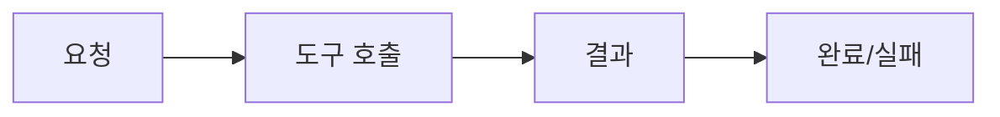
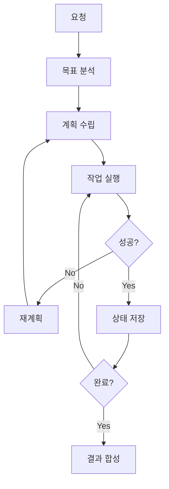
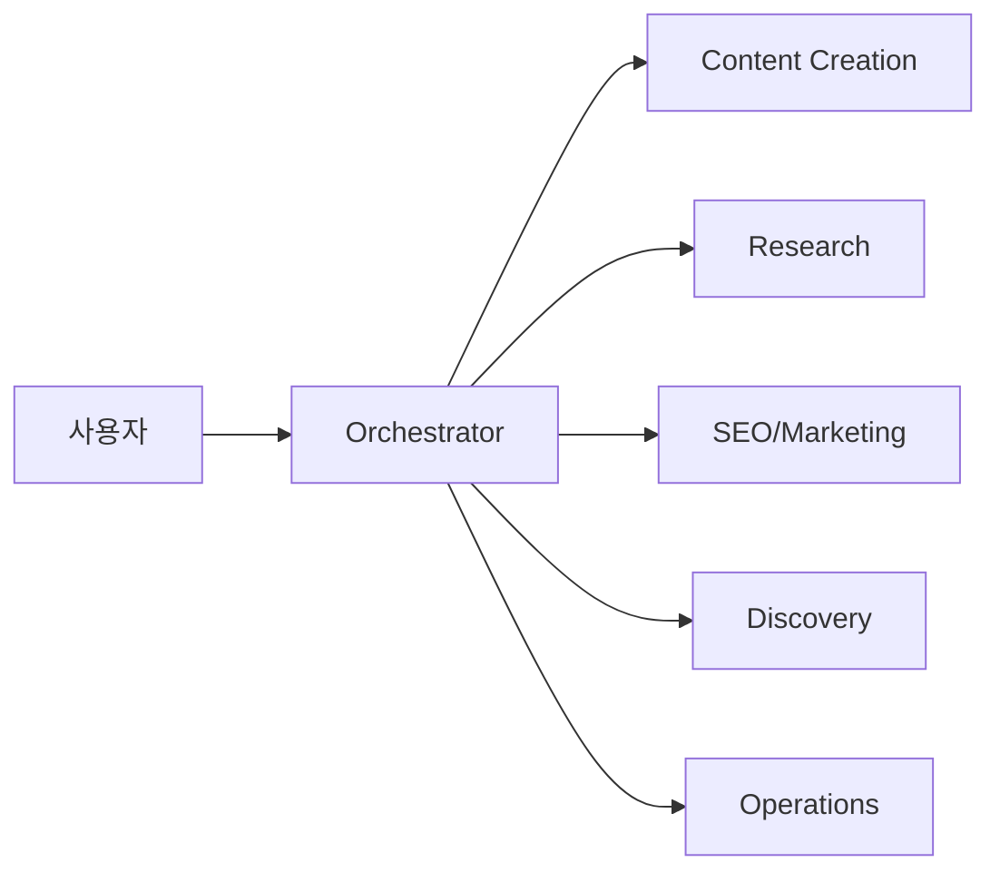
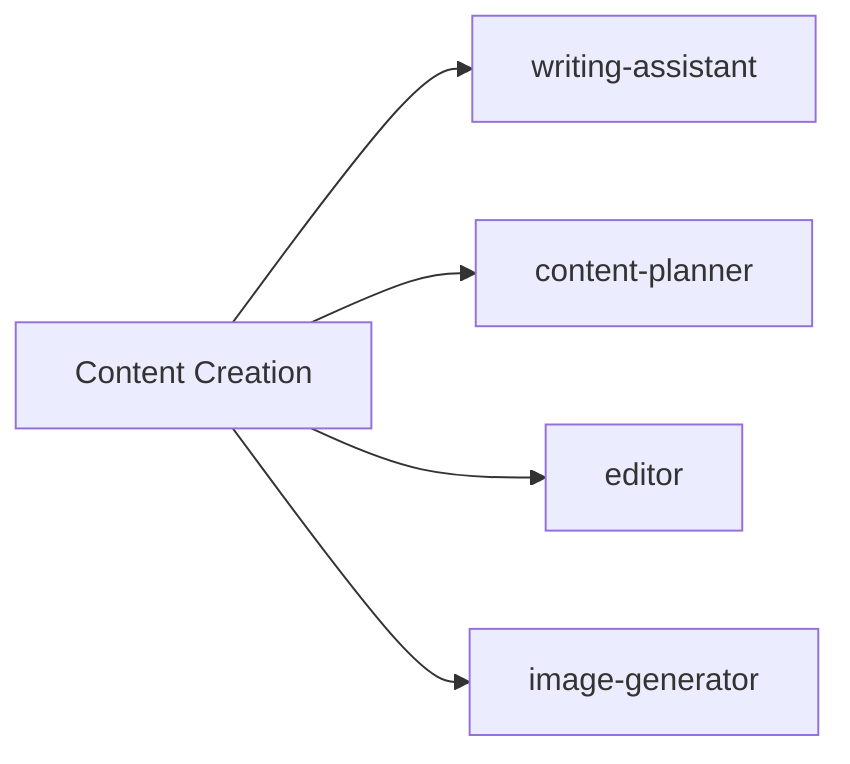
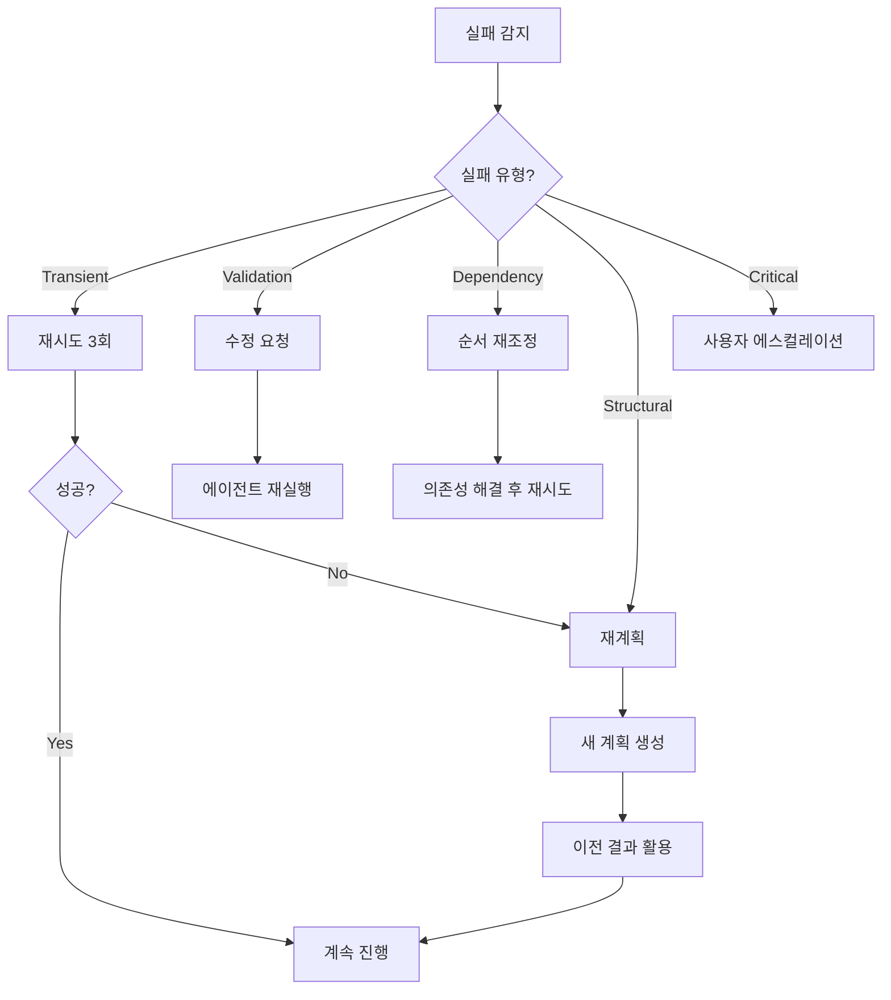

## AI 에이전트의 진화: Shallow에서 Deep으로

2025년, AI 에이전트 시스템은 중요한 전환점을 맞이하고 있습니다. 단순한 도구 호출과 반응형 응답을 넘어, <strong>계획적이고 지속적인 작업 수행이 가능한 "Deep Agents"</strong> 패러다임이 등장했습니다.

이 글에서는 LangChain과 AWS의 Philipp Schmid가 제안한 Deep Agents 개념을 분석하고, 실제 블로그 자동화 시스템의 `.claude/` 디렉토리 구조를 이 패러다임에 맞게 최적화한 과정을 공유합니다.

### Deep Agents vs Shallow Agents

<strong>Shallow Agents (Agent 1.0)</strong>의 특징:
- 단순 ReAct 패턴 (Reasoning → Action → Observation)
- 5〜15 스텝 이내의 짧은 작업
- 실패 시 즉각 중단
- 컨텍스트 비지속적

<strong>Deep Agents (Agent 2.0)</strong>의 특징:
- 100+ 스텝의 장기 작업 수행 가능
- 명시적 계획 및 재계획
- 지속적 상태 관리
- 자동 복구 및 적응

**Shallow Agents (1.0) 워크플로우:**



**Deep Agents (2.0) 워크플로우:**



## Deep Agents의 4가지 핵심 기둥

Philipp Schmid의 연구와 LangChain의 구현을 분석한 결과, Deep Agents 패러다임은 4가지 핵심 기둥으로 구성됩니다.

### 1. Explicit Planning (명시적 계획)

Deep Agents는 암묵적 추론이 아닌 <strong>명시적이고 구조화된 계획</strong>을 생성합니다.

```markdown
## 작업 계획

### 목표
TypeScript 5.0 심층 분석 다국어 블로그 포스트 완성

### 단계 (8단계)
1. [research] web-researcher: TypeScript 5.0 공식 문서 조사
2. [research] web-researcher: 커뮤니티 반응 및 사용 사례 수집
3. [generate] image-generator: 히어로 이미지 생성
4. [write] writing-assistant: 한국어 초안 작성
5. [translate] writing-assistant: 영어 버전 번역
6. [translate] writing-assistant: 일본어 버전 번역
7. [review] editor: 전체 품질 검토 및 SEO 최적화
8. [verify] site-manager: 빌드 검증 및 배포

### 의존성
- Step 4는 Step 1, 2, 3 완료 필요
- Step 5, 6은 Step 4 완료 필요
- Step 7은 Step 5, 6 완료 필요

### 병렬 실행 가능
- Step 1, 2, 3 (Phase A)
- Step 5, 6 (Phase B)
```

### 2. Hierarchical Delegation (계층적 위임)

복잡한 작업은 <strong>계층 구조를 통해 적합한 전문 에이전트에게 위임</strong>됩니다.

**오케스트레이터 → 클러스터:**



**클러스터 → 에이전트 (예: Content Creation):**



각 클러스터는 명확한 책임과 리더십을 가집니다:
- <strong>content-creation</strong>: 콘텐츠 생성 (리더: writing-assistant)
- <strong>research-analysis</strong>: 조사 및 분석 (리더: web-researcher)
- <strong>seo-marketing</strong>: SEO 및 마케팅 (리더: seo-optimizer)
- <strong>content-discovery</strong>: 콘텐츠 추천 (리더: content-recommender)
- <strong>operations</strong>: 운영 및 배포 (리더: site-manager)

### 3. Persistent Memory (지속적 메모리)

Deep Agents는 <strong>세션 간에도 컨텍스트와 상태를 유지</strong>합니다.

```json
{
  "current_task": {
    "id": "task_20251118_001",
    "started_at": "2025-11-18T10:00:00Z",
    "goal": "Deep Agents 블로그 포스트 작성",
    "status": "in_progress",
    "plan": {
      "total_steps": 8,
      "completed_steps": 5,
      "steps": [
        {
          "id": 1,
          "agent": "web-researcher",
          "task": "TypeScript 5.0 조사",
          "status": "completed",
          "output_path": ".claude/memory/research/ts5.md"
        },
        {
          "id": 6,
          "agent": "writing-assistant",
          "task": "일본어 번역",
          "status": "in_progress",
          "progress": 60
        }
      ]
    }
  },
  "context": {
    "research_results": [...],
    "generated_images": [...],
    "intermediate_outputs": [...]
  },
  "recovery_points": [
    {
      "step": 4,
      "timestamp": "2025-11-18T11:30:00Z",
      "state_snapshot": "..."
    }
  ]
}
```

### 4. Extreme Context Engineering (극단적 컨텍스트 엔지니어링)

Deep Agents는 <strong>가능한 모든 관련 정보를 컨텍스트에 포함</strong>시킵니다.

```markdown
## 위임 컨텍스트

### 작업
한국어 블로그 포스트 초안 작성

### 전달 정보
1. **프로젝트 규칙**: CLAUDE.md의 블로그 작성 가이드라인
2. **리서치 결과**: TypeScript 5.0 기능 요약 (2000자)
3. **참고 포스트**: 유사 주제의 기존 포스트 3개
4. **타겟 독자**: 한국어 개발자, 중급 이상
5. **SEO 요구사항**: 키워드 3개, description 150자
6. **이미지 경로**: heroImage 위치

### 품질 기준
- Frontmatter 완전성
- 코드 예제 포함
- 2000자 이상
```

## 현재 시스템 분석: 65% 준수율

기존 `.claude/` 디렉토리 구조를 Deep Agents 패러다임 기준으로 분석했습니다.

### 준수 항목 (65%)

| 영역 | 상태 | 설명 |
|------|------|------|
| 에이전트 전문화 | ✅ | 18개 전문 에이전트 정의 |
| 역할 분리 | ✅ | 명확한 책임 경계 |
| 클러스터 구조 | ✅ | 5개 기능별 클러스터 |
| 도구 명세 | ✅ | 각 에이전트별 도구 정의 |

### 미준수 항목 (35%)

| 영역 | 상태 | 필요 작업 |
|------|------|-----------|
| 명시적 계획 | ⚠️ | planning-protocol.md 구현 필요 |
| 지속적 상태 | ⚠️ | state-management.md 구현 필요 |
| 복구 프로토콜 | ⚠️ | recovery-protocol.md 구현 필요 |
| 오케스트레이터 | ⚠️ | orchestrator.md 강화 필요 |

## 최적화 구현

### 1. 디렉토리 구조 재설계

```
.claude/
├── agents/                    # 18개 전문 에이전트
│   ├── orchestrator.md        # [신규] 중앙 조율자
│   ├── writing-assistant.md
│   ├── web-researcher.md
│   └── ...
├── guidelines/                # [신규] 가이드라인
│   ├── planning-protocol.md   # 계획 프로토콜
│   ├── agent-clusters.md      # 클러스터 정의
│   ├── state-management.md    # 상태 관리
│   └── recovery-protocol.md   # 복구 프로토콜
├── memory/                    # [신규] 지속적 메모리
│   ├── task-state.json        # 현재 작업 상태
│   ├── task-history.json      # 작업 이력
│   └── context-cache/         # 컨텍스트 캐시
└── commands/                  # 슬래시 커맨드
```

### 2. 오케스트레이터 에이전트 구현

오케스트레이터는 전체 시스템의 <strong>중앙 조율자</strong> 역할을 합니다.

```typescript
// Orchestrator의 핵심 워크플로우

interface OrchestratorWorkflow {
  // Phase 1: 분석
  async analyze(request: string): Promise<TaskAnalysis> {
    return {
      goals: extractGoals(request),
      requirements: extractRequirements(request),
      successCriteria: defineSuccessCriteria(request),
      complexity: assessComplexity(request)
    };
  }

  // Phase 2: 계획
  async plan(analysis: TaskAnalysis): Promise<ExecutionPlan> {
    const steps = decomposeIntoSteps(analysis);
    const agents = assignAgents(steps);
    const dependencies = identifyDependencies(steps);
    const parallel = findParallelOpportunities(dependencies);

    return { steps, agents, dependencies, parallel };
  }

  // Phase 3: 실행
  async execute(plan: ExecutionPlan): Promise<void> {
    for (const phase of plan.phases) {
      const results = await Promise.all(
        phase.steps.map(step =>
          this.delegateToAgent(step.agent, step.task)
        )
      );

      await this.updateState(phase, results);
      await this.qualityCheck(phase, results);
    }
  }

  // Phase 4: 합성
  async synthesize(results: StepResult[]): Promise<FinalResult> {
    return {
      deliverables: collectDeliverables(results),
      summary: generateSummary(results),
      metrics: calculateMetrics(results)
    };
  }
}
```

### 3. Planning Protocol 구현

모든 복잡한 작업은 명시적 계획을 따릅니다:

```markdown
## Planning Protocol

### 계획 생성 규칙

1. **목표 명확화**
   - 최종 산출물 정의
   - 성공 기준 명시
   - 범위 제한 설정

2. **단계 분해**
   - 각 단계는 하나의 에이전트가 수행
   - 단계당 예상 시간 명시
   - 의존성 명확히 표시

3. **리소스 할당**
   - 필요 도구 나열
   - 필요 컨텍스트 명시
   - 예상 토큰 사용량

4. **리스크 평가**
   - 잠재적 실패 지점 식별
   - 대안 경로 준비
   - 복구 전략 수립
```

### 4. State Management 구현

```typescript
// 상태 관리 시스템

interface TaskState {
  current_task: {
    id: string;
    goal: string;
    status: 'planning' | 'in_progress' | 'paused' | 'completed' | 'failed';
    plan: ExecutionPlan;
    context: Record<string, any>;
  };

  recovery_points: RecoveryPoint[];
  last_updated: string;
}

// 상태 업데이트 예시
async function updateTaskState(
  stepId: number,
  status: string,
  output: any
): Promise<void> {
  const state = await readState('.claude/memory/task-state.json');

  // 단계 상태 업데이트
  const step = state.current_task.plan.steps.find(s => s.id === stepId);
  step.status = status;
  step.output = output;
  step.completed_at = new Date().toISOString();

  // 복구 포인트 생성 (5단계마다)
  if (stepId % 5 === 0) {
    state.recovery_points.push({
      step: stepId,
      timestamp: new Date().toISOString(),
      state_snapshot: JSON.stringify(state.current_task)
    });
  }

  state.last_updated = new Date().toISOString();
  await writeState('.claude/memory/task-state.json', state);
}
```

### 5. Recovery Protocol 구현



<strong>실패 분류 및 대응</strong>:

| 유형 | 설명 | 대응 | 예시 |
|------|------|------|------|
| Transient | 일시적 오류 | 백오프 후 재시도 | 네트워크 오류, API 제한 |
| Validation | 품질 기준 미달 | 구체적 피드백으로 재요청 | 내용 부족, 형식 오류 |
| Dependency | 필요 입력 누락 | 순서 재조정 | 이전 단계 미완료 |
| Structural | 접근 방식 부적합 | 전체 재계획 | 잘못된 가정 |
| Critical | 복구 불가능 | 사용자에게 보고 | 권한 부족, 리소스 없음 |

## 5개 클러스터 구조

### 클러스터 상세 정의

```yaml
content-creation:
  leader: writing-assistant
  members:
    - content-planner
    - editor
    - image-generator
  capabilities:
    - 블로그 포스트 작성
    - 콘텐츠 전략 수립
    - 문법/스타일 검토
    - 히어로 이미지 생성
  communication: leader가 작업 조율

research-analysis:
  leader: web-researcher
  members:
    - post-analyzer
    - analytics
    - analytics-reporter
  capabilities:
    - 웹 리서치
    - 콘텐츠 분석
    - 트래픽 분석
    - 데이터 리포트 생성

seo-marketing:
  leader: seo-optimizer
  members:
    - backlink-manager
    - social-media-manager
  capabilities:
    - 사이트맵 최적화
    - 메타태그 관리
    - 백링크 전략
    - 소셜 미디어 공유

content-discovery:
  leader: content-recommender
  members: []
  capabilities:
    - 의미론적 추천
    - 관련 콘텐츠 발견

operations:
  leader: site-manager
  members:
    - portfolio-curator
    - learning-tracker
    - improvement-tracker
    - prompt-engineer
  capabilities:
    - 빌드/배포
    - 포트폴리오 관리
    - 학습 추적
    - 프롬프트 최적화
```

## 예상 개선 효과

### 정량적 개선

| 지표 | Before | After | 개선율 |
|------|--------|-------|--------|
| 최대 작업 스텝 | 5〜15 | 100+ | 6배+ |
| 자동 복구율 | 0% | 90%+ | - |
| 컨텍스트 재사용 | 0% | 80%+ | - |
| 병렬 실행 효율 | 10% | 60%+ | 6배 |

### 정성적 개선

1. <strong>장기 작업 지원</strong>
   - 복잡한 다국어 콘텐츠 생성
   - 전체 사이트 SEO 감사 및 최적화
   - 데이터 분석 기반 콘텐츠 전략 수립

2. <strong>자율적 문제 해결</strong>
   - API 오류 자동 재시도
   - 품질 기준 미달 시 자동 수정
   - 접근 방식 실패 시 대안 탐색

3. <strong>투명한 진행 상황</strong>
   - 명시적 계획으로 예측 가능성 향상
   - 상태 추적으로 중단 후 재개 가능
   - 이력 관리로 학습 및 개선

## 실전 예시: 다국어 블로그 포스트 작성

### 사용자 요청
```
"TypeScript 5.0의 새로운 기능에 대한 심층 분석 블로그 포스트를 작성해주세요.
코드 예제와 성능 벤치마크를 포함하고, 한국어, 영어, 일본어 버전을 모두 만들어주세요."
```

### 오케스트레이터 실행 계획

```markdown
## 작업 계획: TypeScript 5.0 다국어 블로그 포스트

### 목표
TypeScript 5.0 심층 분석 3개 언어 버전 완성

### Phase A: 준비 (병렬 실행)
1. [web-researcher] TypeScript 5.0 공식 릴리스 노트 조사
2. [web-researcher] 성능 벤치마크 데이터 수집
3. [image-generator] 히어로 이미지 생성

### Phase B: 작성 (순차 실행)
4. [writing-assistant] 한국어 초안 작성 (2500자+)
5. [writing-assistant] 영어 버전 작성
6. [writing-assistant] 일본어 버전 작성

### Phase C: 검증 (순차 실행)
7. [editor] 전체 버전 품질 검토
8. [seo-optimizer] 메타데이터 및 키워드 최적화
9. [site-manager] 빌드 검증

### 예상 소요 시간
- Phase A: 5분 (병렬)
- Phase B: 15분 (순차)
- Phase C: 5분 (순차)
- 총: 25분

### 복구 전략
- Step 1-3 실패: 재시도 후 대체 소스 사용
- Step 4-6 실패: 구체적 피드백으로 재작성
- Step 7-9 실패: 수정 후 재검증
```

## 구현 시 고려사항

### 1. 점진적 도입

전체 시스템을 한 번에 바꾸지 말고 단계적으로 도입하세요:

1. <strong>Phase 1</strong>: orchestrator.md 추가 및 기본 위임 구현
2. <strong>Phase 2</strong>: planning-protocol.md 추가
3. <strong>Phase 3</strong>: state-management.md 및 memory/ 디렉토리 추가
4. <strong>Phase 4</strong>: recovery-protocol.md 추가

### 2. 성능 균형

Deep Agents는 더 많은 토큰을 사용합니다. 다음을 고려하세요:

- 작업 복잡도에 따른 동적 계획 깊이
- 캐싱을 통한 반복 조회 최소화
- 필요한 컨텍스트만 선별적 전달

### 3. 모니터링

상태 관리 시스템을 통해 다음을 추적하세요:

- 평균 작업 완료 시간
- 실패율 및 복구 성공률
- 에이전트별 활용도

## 참고 자료

이 구현은 다음 연구를 기반으로 합니다:

1. <strong>Philipp Schmid</strong> - "Deep Agents" / "Agents 2.0" 개념
   - 장기 작업 수행을 위한 에이전트 아키텍처
   - Explicit Planning, Persistent Memory 패턴

2. <strong>LangChain</strong> - Multi-Agent Orchestration
   - 계층적 에이전트 위임
   - 상태 관리 및 복구 메커니즘

3. <strong>Anthropic</strong> - Claude Code Best Practices
   - Explore → Plan → Code → Commit 워크플로우
   - 서브에이전트 활용 전략

## 마치며

Deep Agents 패러다임은 AI 에이전트 시스템의 <strong>다음 단계</strong>입니다. 단순한 도구 호출을 넘어, 복잡하고 장기적인 작업을 자율적으로 수행할 수 있는 시스템으로 진화하고 있습니다.

이번 `.claude/` 디렉토리 최적화를 통해:
- 65%에서 95%+ 준수율로 향상
- 5〜15 스텝에서 100+ 스텝 지원
- 90%+ 자동 복구율 달성 예상

핵심은 <strong>명시적 계획</strong>, <strong>계층적 위임</strong>, <strong>지속적 상태</strong>, <strong>극단적 컨텍스트 엔지니어링</strong>입니다. 이 4가지 기둥을 중심으로 에이전트 시스템을 구축하면, 진정한 자율적 AI 협업 파트너를 만들 수 있습니다.

다음 단계로는 실제 100+ 스텝 작업을 수행해보고, 복구 프로토콜의 효과를 측정하며, 지속적으로 시스템을 개선해 나갈 예정입니다.
