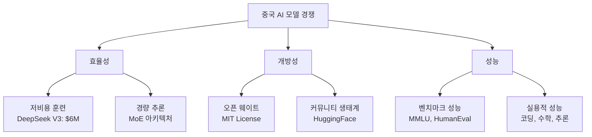

## 개요

2026년 초, 중국 AI 업계에서 대규모 언어 모델(LLM)의 새로운 물결이 밀려오고 있습니다. Reddit r/LocalLLaMA 커뮤니티에서 <strong>DeepSeek V4의 출시가 임박했다</strong>는 소식이 전해지며 큰 관심을 모으고 있습니다. Qwen3.5, GLM-5에 이어 DeepSeek V4까지 — 중국 AI 기업들의 차세대 모델 경쟁이 본격적으로 가속화되고 있습니다.

## DeepSeek의 발자취

### V3에서 V4로의 도약

DeepSeek는 2023년 설립 이후 빠르게 성장한 중국 AI 기업입니다. 특히 <strong>DeepSeek V3</strong>는 불과 600만 달러의 훈련 비용으로 GPT-4에 필적하는 성능을 달성하며, AI 업계에 "스푸트니크 모멘트"를 불러일으켰습니다.

V4에서 기대되는 주요 개선 사항은 다음과 같습니다:

- <strong>Mixture of Experts(MoE) 아키텍처</strong>의 더욱 정교한 활용
- 추론 능력의 대폭 강화(R1 계열의 성과 통합)
- 멀티모달 지원 확대
- 훈련 효율성의 추가 개선

### 오픈 웨이트 전략의 지속

DeepSeek의 핵심 경쟁력 중 하나는 <strong>오픈 웨이트 정책</strong>입니다. MIT 라이선스 하에 모델 가중치를 공개함으로써, 전 세계 개발자 커뮤니티에서 자유롭게 활용하고 개선할 수 있습니다. V4에서도 이 전략이 이어질 것으로 예상됩니다.

## 중국 AI 모델 러시 — 2026년 현황

2026년 초에 발표된(또는 발표 예정인) 중요 모델들을 정리하면 다음과 같습니다:

| 모델 | 개발사 | 특징 |
|------|--------|------|
| <strong>DeepSeek V4</strong> | DeepSeek | MoE 기반, 초효율 훈련, 오픈 웨이트 |
| <strong>Qwen3.5</strong> | Alibaba Cloud | 대규모 파라미터, 다국어 강화 |
| <strong>GLM-5</strong> | Zhipu AI | 멀티모달 통합, 에이전트 기능 강화 |
| <strong>Yi-Lightning</strong> | 01.AI | 추론 최적화, 비용 효율 |

### 경쟁의 핵심 축

## 오픈 모델 vs 클로즈드 모델 구도

중국 AI 기업들의 오픈 모델 전략은 서방 기업들의 클로즈드 모델 접근과 대조적입니다.

### 오픈 모델의 장점

- <strong>투명성</strong>: 모델 구조와 가중치를 검증할 수 있음
- <strong>커스터마이징</strong>: 특정 도메인에 맞게 파인튜닝 가능
- <strong>로컬 실행</strong>: 데이터 프라이버시 보장
- <strong>커뮤니티 혁신</strong>: 양자화, 최적화 등 커뮤니티 기여

### 클로즈드 모델과의 격차 축소

DeepSeek R1이 OpenAI o1과 비견되는 성능을 보여주었듯이, 중국 오픈 모델들은 클로즈드 모델과의 성능 격차를 빠르게 좁혀가고 있습니다. 특히 <strong>코딩</strong>, <strong>수학</strong>, <strong>추론</strong> 분야에서의 발전이 두드러집니다.

## 로컬 LLM 커뮤니티의 반응

Reddit r/LocalLLaMA 커뮤니티에서 DeepSeek V4 소식은 308포인트를 기록하며 큰 반향을 불러일으켰습니다. 주요 관심사는 다음과 같습니다:

- <strong>로컬 실행 가능성</strong>: VRAM 요구 사양은 어떻게 될 것인가
- <strong>양자화 지원</strong>: GGUF, GPTQ 등 포맷 지원 계획
- <strong>성능 벤치마크</strong>: GPT-4o, Claude 3.5와의 비교
- <strong>API 가격</strong>: 기존 V3 대비 가격 변동

## 향후 전망

### 경쟁 가속화의 의미

중국 AI 기업들의 모델 러시는 단순한 경쟁을 넘어, AI 기술의 민주화에 기여하고 있습니다. 오픈 모델의 지속적인 발전은 다음과 같은 변화를 가져올 것으로 예상됩니다:

1. <strong>AI 접근성 향상</strong>: 소규모 기업과 개인 개발자도 최첨단 모델 활용 가능
2. <strong>비용 절감</strong>: 훈련 및 추론 비용의 지속적 하락
3. <strong>혁신 가속</strong>: 커뮤니티 기반의 모델 개선과 응용 분야 확대
4. <strong>지정학적 영향</strong>: AI 기술 패권 경쟁의 새로운 국면

## 결론

DeepSeek V4의 출시가 가까워지면서, 중국 AI 기업들의 차세대 모델 경쟁은 새로운 단계에 접어들고 있습니다. Qwen3.5, GLM-5와 함께 이어지는 모델 러시는 오픈 AI 모델 생태계를 더욱 풍성하게 만들어줄 것입니다. 로컬 LLM을 활용하는 개발자들에게는 그 어느 때보다 흥미로운 시기가 다가오고 있습니다.

## 참고 자료

- [Reddit r/LocalLLaMA - DeepSeek V4 Release Soon](https://www.reddit.com/r/LocalLLaMA/comments/1r71tn1/deepseek_v4_release_soon/)
- [DeepSeek 공식 사이트](https://www.deepseek.com/)
- [DeepSeek HuggingFace](https://huggingface.co/deepseek-ai)
- [Wikipedia - DeepSeek](https://en.wikipedia.org/wiki/DeepSeek)
