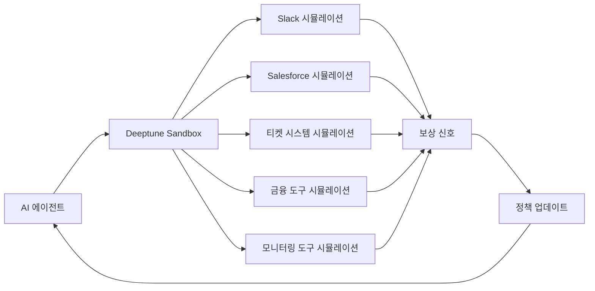
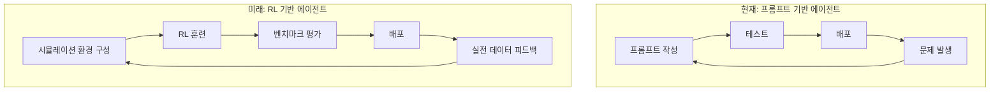

## 개요

뉴욕 기반 스타트업 **Deeptune**이 Andreessen Horowitz(a16z) 주도로 **$43M Series A** 투자를 유치했습니다. 776, Abstract Ventures, Inspired Capital이 참여했고, OpenAI Research의 Noam Brown, Mercor CEO Brendan Foody, Applied Compute CEO Yash Patil 등 업계 핵심 인물들이 엔젤 투자자로 이름을 올렸습니다.

Deeptune이 만드는 것은 AI 에이전트를 위한 **"트레이닝 짐(training gym)"** — 회계사, 고객지원 담당자, DevOps 엔지니어 등 전문 직군의 실제 업무 환경을 고충실도(high-fidelity)로 시뮬레이션하는 **강화학습(Reinforcement Learning, RL) 환경**입니다. Slack, Salesforce, 티켓 시스템, 금융 도구, 모니터링 툴 등을 가상으로 재현하여 AI 에이전트가 실전 경험을 쌓도록 합니다.

이 글에서는 Deeptune의 접근법이 왜 주목할 만한지, 그리고 엔지니어링 리더로서 이 트렌드를 어떻게 준비해야 하는지 분석합니다.

---

## Deeptune이 하는 일

### "Sandbox" 아키텍처

Deeptune의 핵심 아이디어는 간단합니다: **AI 에이전트에게 실제 업무 환경과 동일한 가상 환경을 제공하고, 강화학습으로 반복 훈련시키는 것**입니다.

기존 LLM 파인튜닝이 "교과서를 읽히는 것"이라면, Deeptune의 RL 환경은 "실습실에서 직접 해보게 하는 것"에 가깝습니다. 에이전트가 Slack 메시지를 확인하고, Salesforce에서 고객 데이터를 조회하고, 티켓 시스템에 응답을 작성하는 전체 워크플로우를 시뮬레이션 안에서 수천 번 반복합니다.

### 팀 구성

Deeptune 팀은 **Anthropic, Scale AI, Palantir, Glean** 출신 인재들로 구성되어 있습니다. AI 모델 개발, 데이터 인프라, 엔터프라이즈 소프트웨어에 대한 깊은 이해를 가진 팀입니다. 특히 Anthropic 출신이 포함되어 있다는 점은 LLM의 한계와 RL의 보완 가능성을 체감한 사람들이 이 문제를 풀고 있다는 신호입니다.

### 왜 RL인가?

현재 대부분의 AI 에이전트는 프롬프트 엔지니어링과 few-shot 예제에 의존합니다. 이 방식의 한계는 명확합니다:

- **엣지 케이스 대응 부족**: 프롬프트로 모든 예외 상황을 커버할 수 없습니다
- **도구 사용 최적화 부재**: 어떤 순서로, 어떤 도구를 써야 효율적인지 학습하지 못합니다
- **멀티스텝 의사결정 취약**: 5단계 이상의 복합 워크플로우에서 정확도가 급격히 떨어집니다

RL은 이 문제를 **경험 기반 학습**으로 해결합니다. 수천 번의 시뮬레이션을 통해 에이전트가 최적의 행동 정책(policy)을 스스로 발견합니다.

---

## 왜 엔지니어링 조직이 주목해야 하는가

### 1. AI 에이전트 도입의 병목이 바뀐다

지금까지 AI 에이전트 도입의 최대 병목은 **"모델 성능"** 이었습니다. 하지만 GPT-4, Claude, Gemini 등 Foundation Model의 성능이 수렴하면서, 병목이 **"특정 업무에 대한 적응(adaptation)"** 으로 이동하고 있습니다.

Deeptune의 접근법은 이 적응 문제를 구조적으로 풀겠다는 것입니다. 엔지니어링 조직 입장에서는, 범용 LLM을 프롬프트로 "설득"하는 것이 아니라, **RL로 "훈련된" 에이전트를 배치**하는 시대가 온다는 의미입니다.

### 2. "AI 에이전트 DevOps" 시대의 도래

현재 소프트웨어 개발에서 CI/CD 파이프라인이 필수인 것처럼, 곧 **AI 에이전트의 훈련-평가-배포 파이프라인**이 필수가 될 것입니다. Deeptune의 RL 환경은 그 파이프라인의 "훈련" 단계를 담당합니다.

### 3. RL 시장의 폭발적 성장

강화학습 시장은 2025년 **$11.6B** 규모에서 2034년 **$90B 이상**으로 성장할 것으로 전망됩니다. 이 성장의 상당 부분은 게임이나 로봇공학이 아닌, **엔터프라이즈 업무 자동화** 영역에서 올 것입니다. Deeptune은 이 거대한 시장의 인프라 레이어를 노리고 있습니다.

---

## 전문 업무 워크플로우를 위한 RL: 기술적 분석

### 기존 RL과의 차이점

Atari 게임이나 로봇 제어에 사용되는 RL과 비교했을 때, 전문 업무 워크플로우 RL에는 고유한 기술적 도전이 있습니다:

| 차원 | 게임/로봇 RL | 전문 업무 RL |
|------|-------------|-------------|
| **상태 공간** | 픽셀, 센서 값 (연속적) | 텍스트, 구조화 데이터 (복합적) |
| **행동 공간** | 조이스틱 입력 (제한적) | API 호출, 텍스트 입력 (무한에 가까움) |
| **보상 신호** | 점수, 거리 (즉각적) | 작업 품질, 고객 만족도 (지연됨) |
| **에피소드 길이** | 수초~수분 | 수분~수시간 |
| **환경 복잡도** | 물리 법칙 기반 | 비즈니스 로직 기반 |

### 핵심 기술적 과제

**1. 환경 충실도(Environment Fidelity)**

시뮬레이션 환경이 실제 환경과 얼마나 비슷한가가 RL 훈련의 성패를 결정합니다. Deeptune이 Slack, Salesforce 등을 "고충실도"로 시뮬레이션한다는 것은, 단순히 API를 모킹(mocking)하는 수준이 아니라 **실제 사용 패턴, 데이터 분포, 에러 케이스까지 재현**한다는 의미입니다.

**2. 보상 함수 설계(Reward Shaping)**

"좋은 고객 응대"의 정의를 수치화하는 것은 쉽지 않습니다. Deeptune은 아마도 다음과 같은 다층적 보상 체계를 사용할 것입니다:

- **완료 보상**: 작업을 성공적으로 완료했는가
- **효율 보상**: 최소한의 단계로 완료했는가
- **품질 보상**: 결과물의 정확성과 완성도
- **안전 보상**: 위험한 행동(데이터 삭제, 잘못된 금액 입력 등)을 피했는가

**3. Sim-to-Real Transfer**

시뮬레이션에서 훈련한 정책이 실제 환경에서도 작동하는가의 문제입니다. 게임 RL에서도 이 gap은 큰 도전인데, 업무 환경에서는 **예상치 못한 사용자 행동, 시스템 장애, 데이터 불일치** 등으로 gap이 더 클 수 있습니다.

### OpenAI의 Noam Brown이 투자한 이유

엔젤 투자자 목록에서 가장 눈에 띄는 이름은 OpenAI Research의 **Noam Brown**입니다. 포커 AI Libratus와 Pluribus의 핵심 연구자로, RL을 통한 전략적 의사결정의 최전선에 있는 인물입니다. 그가 Deeptune에 투자했다는 것은 **"LLM 만으로는 실전 업무 에이전트를 만들 수 없고, RL이 필수"** 라는 확신의 표현입니다.

---

## CTO/EM 액션 아이템

### 단기 (3-6개월)

1. **AI 에이전트 파일럿 업무 식별**: 사내에서 반복적이고, 규칙이 명확하며, 실패 비용이 낮은 업무를 리스트업하세요. 이런 업무가 향후 RL 기반 에이전트의 첫 번째 적용 대상이 됩니다.

2. **현재 프롬프트 기반 에이전트의 한계 문서화**: 기존에 LLM 기반 에이전트를 도입했다면, 어떤 유형의 실패가 반복되는지 체계적으로 기록하세요. 이 데이터가 향후 RL 보상 함수 설계의 기초가 됩니다.

3. **업무 워크플로우 표준화**: RL 훈련을 위해서는 업무 프로세스가 명확히 정의되어 있어야 합니다. 지금부터 핵심 워크플로우를 문서화하고 도구 사용 패턴을 표준화하세요.

### 중기 (6-18개월)

4. **RL Ops 역량 확보**: MLOps 팀에 RL 경험이 있는 엔지니어를 확보하거나 기존 팀의 RL 역량을 강화하세요. Deeptune 같은 플랫폼을 활용하더라도, 자사 도메인에 맞는 커스터마이징은 필요합니다.

5. **시뮬레이션 환경 파이프라인 검토**: Deeptune과 같은 서드파티 솔루션을 평가하되, 자사 업무 환경의 특수성을 시뮬레이션할 수 있는지 확인하세요. 특히 사내 독자 시스템이 많은 조직은 환경 구축 비용을 신중히 평가해야 합니다.

6. **에이전트 평가 프레임워크 구축**: RL 훈련된 에이전트를 프로덕션에 배포하기 전, 체계적으로 성능을 평가할 수 있는 벤치마크와 안전성 테스트 프레임워크를 준비하세요.

### 장기 (18개월+)

7. **"Human-in-the-Loop RL" 프로세스 설계**: 에이전트가 프로덕션에서 쌓는 경험을 다시 RL 훈련에 반영하는 피드백 루프를 설계하세요. 이것이 경쟁사 대비 에이전트 성능 차별화의 핵심이 됩니다.

8. **AI 에이전트 거버넌스 체계 수립**: RL로 훈련된 에이전트의 행동은 프롬프트 기반보다 예측하기 어렵습니다. 모니터링, 감사(audit), 롤백 정책을 포함한 거버넌스 체계가 필요합니다.

---

## 결론

Deeptune의 $43M 투자 유치는 단순한 스타트업 뉴스가 아닙니다. 이것은 AI 에이전트 시장이 **"프롬프트 엔지니어링의 시대"에서 "강화학습 훈련의 시대"로 전환**하고 있다는 강력한 시그널입니다.

핵심 메시지를 정리하면:

- **LLM은 "지식"을 제공하지만, RL은 "경험"을 제공합니다.** 전문 업무를 수행하는 에이전트에게는 둘 다 필요합니다.
- **시뮬레이션 환경은 새로운 인프라 레이어입니다.** CI/CD가 소프트웨어 배포의 표준이 된 것처럼, RL 시뮬레이션이 에이전트 배포의 표준이 될 것입니다.
- **지금 준비해야 합니다.** 업무 워크플로우 표준화, 에이전트 실패 패턴 문서화, RL Ops 역량 확보 — 이 세 가지를 시작하세요.

a16z, OpenAI Research의 Noam Brown, 그리고 Anthropic/Scale AI 출신 팀이 모두 같은 방향을 가리키고 있습니다. 엔지니어링 리더로서, 이 전환점을 놓치지 않아야 합니다.
