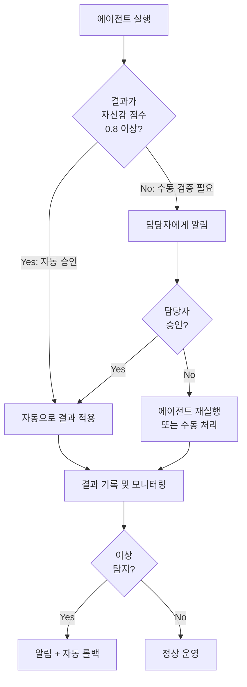
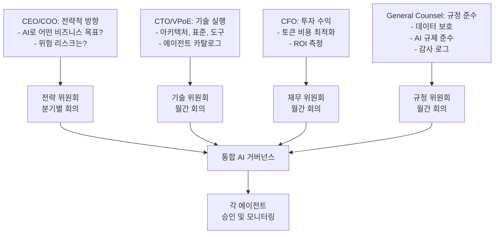

## 서론: Agentic AI 혁명의 신기루

2024년부터 "AI 에이전트 시대"가 온다고 했습니다. 그리고 일부 기업들은 정말로 멋진 데모를 만들었습니다. Slack 메시지를 받고 자동으로 Jira 티켓을 생성하고, 데이터를 분석하고, 보고서를 작성하는 에이전트들 말입니다.

그러나 Deloitte의 2026 Tech Trends 보고서가 폭로한 현실은 차갑습니다:

**<strong>전 세계 기업의 11%만이 Agentic AI를 프로덕션 환경에서 실제로 운영하고 있습니다.</strong>**

나머지는 어디 있을까요?

- **42%**: 아직도 전략을 개발 중입니다
- **35%**: 공식적인 전략이 없습니다
- **12%**: 실험 단계에 머물러 있습니다

<strong>89%의 기업이 실제 운영(production)에 도달하지 못하고 있습니다.</strong> 이는 단순한 지연이 아닙니다. 이것은 조직적 운영 모델의 실패입니다.

이 포스트에서 다루는 것은 "왜 AI 에이전트를 도입해야 하는가"가 아닙니다. (그것은 이전 포스트 "생성형 AI 도입, 왜 탑다운 방식이 필요한가"에서 다뤘습니다.) 대신 <strong>실제로 어떻게 운영해야 하는가</strong>를 EM/VPoE 관점에서 구체적으로 제시합니다.

---

## 파트 1: 현실 진단 — 당신의 조직은 어느 단계인가

### 스테이지 1: 탐색 단계 (42% - 아직 전략 수립 중)

"AI 에이전트는 미래다. 우리도 뭔가 해야 한다."

이 단계의 조직들은 다음 특징을 보입니다:

- <strong>분산된 PoC (Proof of Concept)</strong>: 각 팀이 독립적으로 작은 에이전트를 만들고 있습니다
- <strong>명확한 소유권 부재</strong>: "누가 이걸 책임지나요?" 답변이 없습니다
- <strong>토큰 비용에 대한 충격</strong>: 몇 개의 작은 에이전트만 돌려도 월간 청구서가 수만 달러입니다
- <strong>연속성 없음</strong>: 한 사람이 떠나면 에이전트도 따라 떠납니다

**경고 신호**:
```
엔지니어1: "우리 팀에서 Slack AI 봇 만들었어요"
엔지니어2: "어? 우리도 만들었는데?"
EM: "... 둘 다 프로덕션이야?"
```

### 스테이지 2: 파일럿 단계 (12% - 실험 중)

"좋아, 조직 차원의 접근을 해보자."

이 단계에서는:

- <strong>중앙 AI 팀이 구성됩니다</strong> (또는 시도됩니다)
- <strong>몇 개의 주요 워크플로우가 선택됩니다</strong>
- <strong>초기 성공을 거둡니다</strong>: 개발자가 코드 리뷰 요청을 자동화했더니 정말 도움이 됩니다
- <strong>그리고 나서 정체됩니다</strong>: 5개 이상의 에이전트를 동시에 운영하기 시작하면, 관리 복잡성이 폭증합니다

**전형적인 좌절 지점**:
```
월 1주: "이거 정말 잘 된다!"
월 3주: "근데... 이 에이전트가 가끔 이상한 일을 해요"
월 4주: "이 문제 원인이 뭐지? 누가 코드를 봐줄 수 있어?"
월 5주: "결국 수동으로 다시 하자"
```

### 스테이지 3: 전략 부재 (35% - 방향 없음)

가장 위험한 상태입니다. 조직이 AI 에이전트의 필요성은 느끼지만 어떻게 진행해야 할지 모릅니다.

이 단계의 조직들이 보이는 패턴:

- <strong>높은 기대, 낮은 기대치</strong>: CEO는 "AI로 효율을 2배 올려달라"고 하지만, 팀은 "기본 인프라도 없는데 뭘 어떻게"라고 생각합니다
- <strong>거버넌스 공백</strong>: AI 에이전트가 회사 데이터에 접근하지만, 누가 감시할지 정해지지 않았습니다
- <strong>토큰 비용 쇼크</strong>: Gartner에 따르면, 토큰 비용은 2년 동안 280배 떨어졌는데, 엔터프라이즈 월간 청구서는 수천만 달러입니다. 왜? 사용량이 폭증했기 때문입니다.

---

## 파트 2: 실패의 근본 원인 — 기술이 아니라 운영

Gartner의 경고는 명확합니다:

**<strong>아젠틱 AI 프로젝트의 40%가 2027년까지 실패할 것입니다. 원인은 기술 부족이 아니라, 조직이 깨진 프로세스에 에이전트를 얹혀 있기 때문입니다.</strong>**

### 근본 원인 1: 자동화와 함께 일하는 방식 재설계하지 않음

대부분의 조직이 하는 실수:

**잘못된 접근**:
```
기존 프로세스: 인간 → 데이터 수집 → 분석 → 리포트 → 의사결정
↓
새로운 프로세스: 에이전트 → 데이터 수집 → 분석 → 리포트 → 인간 (의사결정)
```

에이전트를 단순히 "인간의 수동 작업 부분"에 치환하는 것입니다. 이것은 조직 운영의 근본적인 병목을 해결하지 못합니다.

**올바른 접근**:
```
분석: 왜 이 프로세스가 느린가?
- "데이터 수집에 2일이 걸린다" → 데이터 접근 구조 재설계
- "리포트 포맷이 복잡하다" → 리포트 자동 생성 + 핵심만 인간이 검토
- "의사결정이 여러 팀을 거친다" → 의사결정 권한 재편성

재설계된 프로세스: 에이전트 → 실시간 데이터 접근 → 자동 분석 → 핵심 항목만 인간 승인 → 자동 실행
```

**CIO.com의 2026 엔지니어링 리포트**에 따르면, 선도 기업의 엔지니어들은 더 이상 "코드를 쓰는" 데 시간을 쓰지 않습니다. 대신:

- <strong>데이터 엔지니어링</strong> (50% 이상의 시간): 에이전트가 접근할 수 있는 데이터 구조 설계
- <strong>에이전트 오케스트레이션</strong> (20〜30%): 여러 에이전트 간 조율
- <strong>거버넌스 및 규정 준수</strong> (20% 이상): 에이전트가 무엇을 할 수 있고 없는지 정의
- <strong>코딩</strong> (10% 이하): 이전에는 대부분의 시간을 썼던 활동

### 근본 원인 2: 숨은 작업의 폭발

Deloitte의 보고서에서 놀라운 발견:

<strong>전체 작업의 80%가 "지루한" 일들입니다.</strong>

- 데이터 정제 및 검증
- 이해관계자 간 조율 및 커뮤니케이션
- 거버넌스, 감시, 규정 준수 체크
- 워크플로우 통합 및 예외 처리

에이전트를 도입하면, <strong>이 지루한 작업이 갑자기 가시화됩니다.</strong>

```
이전: "리포트 작성에 3시간 걸려요"
→ 에이전트 도입 후: "리포트는 1시간 만에 되는데, 데이터 검증하는 데 4시간,
                      3개 팀과 의견 조율하는 데 2시간, 규정 체크하는 데 1시간..."
```

예상하지 못한 이 "숨은 작업"들이 에이전트 도입의 진정한 비용입니다.

### 근본 원인 3: 토큰 비용의 급증

이것은 단순한 비용 문제가 아니라, <strong>운영 모델 설계의 실패</strong>를 드러냅니다.

**사실들:**
- Claude/GPT-4 토큰 비용은 2년 사이 280배 하락했습니다 ✓
- 그런데 엔터프라이즈 월간 AI 청구서는 $10M〜$50M입니다 ✗

**왜인가?**

선도 기업들은 다음을 이해합니다:
- 에이전트는 24/7 실행됩니다 (업무 시간만 아니라)
- 각 워크플로우마다 여러 에이전트가 필요합니다
- 재시도, 예외 처리, 감시로 인해 토큰 사용량이 5〜10배 증가합니다

**올바른 운영 모델에서는:**
- 에이전트가 "언제 실행되어야 하는지" 정의합니다
- 토큰 사용을 모니터링하고 이상 탐지합니다
- 각 에이전트의 비용을 측정하고 ROI를 추적합니다

---

## 파트 3: Delegate, Review, Own 프레임워크

이것이 **HBR와 Google Cloud가 제시하는 "Enterprise-Wide Agentic AI Transformation"의 핵심 운영 모델**입니다.

### 개념 설명

```mermaid
graph TD
    A["Delegate: 어떤 작업을 에이전트에게<br/>위임할 것인가?"] --> B["명확한 책임 영역 정의"]
    B --> C["데이터 접근 권한 설정"]
    C --> D["입력과 출력 표준화"]

    E["Review: 에이전트가 한 일을<br/>누가, 어떻게 검토하나?"] --> F["자동 검증 로직"]
    F --> G["인간 승인 프로세스"]
    G --> H["감시 및 모니터링"]

    I["Own: 누가 이 에이전트를<br/>소유하고 책임지나?"] --> J["명확한 담당자"]
    J --> K["의사결정 권한"]
    K --> L["장애 대응 계획"]

    B --> M["에이전트 설계 및 배포"]
    D --> M

    M --> N["지속적 운영"]

    F --> N
    G --> N
    H --> N

    J --> N
    K --> N
    L --> N
```



### 1단계: Delegate (위임) — 무엇을 에이전트에게 맡길 것인가

이 단계는 <strong>기술이 아니라 조직 설계입니다.</strong>

**체크리스트**:

1. <strong>작업 범위 정의</strong>
   - [ ] "이 작업의 입력은 무엇인가?" (데이터, 신호, 요청)
   - [ ] "성공의 정의는 무엇인가?" (측정 가능한 결과)
   - [ ] "실패할 수 있는가? 어떻게 처리할 것인가?" (예외 처리)

2. <strong>데이터 거버넌스</strong>
   - [ ] "에이전트가 어떤 데이터에 접근할 것인가?"
   - [ ] "접근 권한은 누가 검증하나?"
   - [ ] "민감 데이터(PII, 금융정보)는 어떻게 처리하나?"

3. <strong>경계 설정</strong>
   - [ ] "에이전트가 할 수 없는 것은?" (예: 절대 삭제하지 않기, 항상 승인 필요 등)
   - [ ] "토큰 예산은?" (월간 비용 상한)
   - [ ] "응답 시간 요구사항은?" (실시간? 매시간? 매일?)

**실제 사례**:

```
작업: 매일 고객 만족도 리포트 생성

Delegate:
✓ 입력: 어제의 고객 피드백 데이터 (자동 수집)
✓ 작업: 감정 분석 → 주제 분류 → 요약
✓ 출력: 구조화된 JSON (리포트 시스템이 이해하는 형식)
✓ 권한: 고객 이름은 익명화
✓ 경계: 절대 고객에게 직접 메시지하지 않기
✓ 토큰 예산: 하루 $500 이상 사용하지 않기
✓ 시간: 매일 오전 9시 KST
```

### 2단계: Review (검토) — 자동화된 검증과 인간의 승인

이것이 <strong>89%의 조직이 실패하는 지점</strong>입니다.

많은 조직이 다음 중 하나의 극단으로 갑니다:

**극단 1: 완전 자동화**
```
에이전트 실행 → 자동으로 결과 적용 (인간 개입 없음)
문제: 한 번 잘못되면 대규모 피해
```

**극단 2: 100% 수동 검증**
```
에이전트 실행 → 인간이 모든 결과 확인 및 승인
문제: 에이전트의 이점을 없앱니다. 업무량 증가만 초래
```

**올바른 접근: 지능형 Review 구조**



**Review 설계 원칙:**

1. <strong>자신감 점수 기반 자동화</strong>
   - 에이전트의 출력이 얼마나 확실한가?
   - 통상 0.8 이상이면 자동 실행, 0.5〜0.8이면 수동 검증, 0.5 이하면 거부

2. <strong>예외 기반 모니터링</strong>
   - 모든 결과를 살피는 대신, 비정상만 감지
   - "어제와 5% 이상 차이난다", "금액이 평균의 2배다" 등

3. <strong>승인 권한의 분산</strong>
   ```
   낮은 리스크 작업: 팀 리더 자동 승인
   중간 리스크: EM 또는 담당자 승인 필요
   높은 리스크: VPoE/기술 리더 승인 필요
   규정 영향: 법무/컴플라이언스 최종 승인
   ```

### 3단계: Own (소유) — 명확한 책임과 권한

**이것이 가장 중요합니다.** 89%의 실패 조직들은 이 단계를 건너뜁니다.

각 에이전트마다:

1. <strong>명확한 담당자 지정</strong>
   - 보통은 "에이전트가 자동화하는 작업의 원래 담당자"
   - 예: 데일리 리포트를 생성하는 에이전트 → 데이터 분석가가 Owner

2. <strong>의사결정 권한</strong>
   - [ ] 에이전트의 입력값을 변경할 수 있나? (예: 분석 기간)
   - [ ] 에이전트가 실행되는 빈도를 조정할 수 있나?
   - [ ] 에이전트의 출력 형식을 변경할 수 있나?

3. <strong>장애 대응 계획 (RCA: Root Cause Analysis)</strong>
   - 에이전트가 실패했을 때 어떻게 하나?
   - Fallback 프로세스는? (수동으로 돌아가기)
   - 어느 선까지는 자동으로 재시도하고, 언제 인간에게 알릴 것인가?

**실제 템플릿**:

```markdown
## Agent Owner Checklist

### 에이전트: Customer_Satisfaction_Report_Generator

**Owner**: 김데이터 (데이터 분석팀 리더)
**백업**: 이인사이트 (시니어 분석가)

### 의사결정 권한
- [x] 분석 기간 조정 (매일 → 매주)
- [x] 포함/제외 고객 그룹 변경
- [x] 감정 분석 임계값 조정
- [ ] 출력 형식 변경 (VPoE 승인 필요)

### 모니터링
- 일일 실행 여부: Slack #ai-agents 채널에서 확인
- 실패율 목표: 3% 이하
- 토큰 사용: $400/일 (예산: $500/일)

### 장애 대응
1. 자동 재시도 (3회, 1시간 간격)
2. 여전히 실패하면 Slack에서 Owner에게 알림
3. Owner가 1시간 내 응답 없으면 에스컬레이션
4. Fallback: 어제 리포트 전송 (최소한의 서비스 유지)
```

---

## 파트 4: EM을 위한 실전 체크리스트 — Monday 아침에 할 일

당신이 EM이나 VPoE라면, 이번 주 월요일 아침에 이 체크리스트를 실행하세요.

### Week 1: 현황 파악

**월요일**:
- [ ] 조직의 현재 AI 에이전트 현황 파악
  ```bash
  Q: "우리 조직에서 프로덕션으로 실행 중인 AI 에이전트가 몇 개인가?"
      (프로토타입 제외)
  ```
- [ ] 각 에이전트마다 Owner 확인
  ```bash
  Q: "각 에이전트의 Owner가 명확하게 지정되어 있나?"
      (대답: "네/아니오" → 아니오면 문제)
  ```
- [ ] 토큰 비용 추적 시스템 확인
  ```bash
  Q: "지난 달 AI 에이전트에 얼마를 썼나?"
      (답변을 못 하면 비상)
  ```

**화요일**:
- [ ] 실패하는 에이전트 파악
  ```bash
  Q: "지난 3개월간 운영을 중단한 에이전트가 있나?"
      있으면: "왜 중단했나? Owner는?"
  ```
- [ ] 숨은 비용 파악
  ```bash
  엔지니어에게: "AI 에이전트 때문에 새로 생긴 일이 있나?
                 데이터 검증, 모니터링, 예외 처리?"
  ```

**수요일 〜 금요일**:
- [ ] 각 팀의 에이전트 사용자 만남 (1시간씩 5팀)
  - 무엇이 잘 되고 있는가?
  - 무엇이 막혀 있는가?
  - 어떤 거버넌스가 필요한가?

### Week 2: 문제 정의

**월요일**:
- [ ] Delegate, Review, Own 프레임워크 문서 작성 (초안)
- [ ] 각 팀에 배포하고 피드백 수집

**화요일 〜 금요일**:
- [ ] 각 에이전트마다 Review 프로세스 재설계
  - 현재: 어떤 검증을 하고 있나? (또는 하지 않나?)
  - 목표: 자신감 점수 기반 자동화 + 이상 탐지

### Week 3 〜 4: 실행

**주요 작업**:

1. <strong>Owner 재지정</strong>
   - 모든 에이전트마다 명확한 Owner 지정
   - 업무 기술서(JD) 업데이트 (AI 에이전트 관리 책임 포함)

2. <strong>Review 구조 개선</strong>
   - 자신감 점수 기반 자동화 구현 (엔지니어링팀)
   - 모니터링 대시보드 구축

3. <strong>토큰 비용 추적**</strong>
   - 각 에이전트별 비용 태깅
   - 월간 리포팅 체계 수립

4. <strong>거버넌스 정책 수립</strong>
   - 어떤 데이터는 에이전트가 접근할 수 없는가?
   - 감시 및 감사 로그는 어떻게 유지하나?

---

## 파트 5: 거버넌스 — 리더십이 직접 나서야 하는 이유

이것이 가장 중요한 부분입니다.

HBR의 "Blueprint for Enterprise-Wide Agentic AI Transformation"에 따르면:

**<strong>Senior leadership이 AI 거버넌스에 직접 관여하는 기업은 그렇지 않은 기업보다 3배 더 많은 비즈니스 가치를 창출합니다.</strong>**

이것은 왜일까요?

### 거버넌스의 진정한 의미

거버넌스는 "에이전트가 뭘 하도록 할 것인가"가 아닙니다. (그것은 기술 결정입니다.)

거버넌스는 **"조직이 AI 에이전트를 통해 어떤 가치를 창출할 것인가"를 정의하는 것**입니다.

### 거버넌스 프레임워크



### 4가지 거버넌스 정책

**1. 데이터 거버넌스**

```
정책: 어떤 데이터는 에이전트가 볼 수 없는가?

✓ 접근 가능:
  - 공개 고객 데이터 (익명화됨)
  - 내부 메트릭 (수익, 성장률 등)
  - 표준화된 운영 데이터

✗ 접근 불가:
  - 개인 식별정보 (PII)
  - 금융 계좌 정보
  - 의료/민감 정보
  - 임직원 개인정보
  - M&A 등 기밀 정보
```

**2. 토큰 비용 거버넌스**

```
정책: 에이전트의 비용을 어떻게 관리하나?

레벨별 예산 승인:
- <$1K/월: Team Lead 승인
- $1K〜$10K/월: EM 승인
- $10K〜$100K/월: VPoE 승인
- >$100K/월: CEO/CTO 승인

이상 탐지:
- 일일 비용이 예산의 150% 초과 → 자동 중단 + 알림
- 월 비용이 예산의 120% 초과 → 리뷰 회의
```

**3. 규정 준수 거버넌스**

```
정책: 에이전트가 생성하는 출력의 책임은 누구에게 있는가?

원칙:
- 모든 에이전트 출력은 감사 로그에 기록됨
- 에이전트 출력으로 인한 비즈니스 손실 → Owner 책임
- 에이전트 자체의 기술적 오류 → 엔지니어링팀 책임
- 거버넌스 정책 위반 → VPoE + 법무팀 책임

예시:
에이전트가 고객 개인정보를 노출 → 법무팀 + Owner + CTO 조사
```

**4. 성과 측정 거버넌스**

```
정책: 에이전트의 성공을 어떻게 정의하나?

모든 에이전트마다:
1. 비즈니스 메트릭
   - "시간 절감: 월 40시간" → 가치: $5,000/월
   - "오류율 감소: 95% → 99%" → 고객 만족 향상
   - "토큰 비용: $200/월"

2. 기술 메트릭
   - 성공률: 99% 이상 목표
   - 평균 응답 시간: <5초
   - 재시도율: <3%

3. 거버넌스 메트릭
   - 규정 준수율: 100%
   - 감사 결과: 통과/미통과
```

---

## 파트 6: 구현 로드맵 (3개월)

### 월 1: 기초 구축

**주간 계획:**

**주 1: 현황 파악 및 팀 편성**
- [ ] AI 에이전트 인벤토리 구축 (프로덕션, 파일럿, PoC 구분)
- [ ] 각 에이전트의 Owner/담당자 확인
- [ ] AI 거버넌스 태스크포스 구성 (CEO, CTO, CFO, General Counsel 포함)

**주 2〜3: Delegate, Review, Own 프레임워크 정의**
- [ ] 프레임워크 문서 작성 및 이사회 승인
- [ ] 각 팀과 워크샵 (최소 5팀)
- [ ] 초기 피드백 수집 및 개선

**주 4: 거버넌스 정책 수립**
- [ ] 데이터 접근 정책 수립
- [ ] 토큰 비용 관리 정책 수립
- [ ] 규정 준수 요구사항 정의

### 월 2: 첫 번째 구현

**주간 계획:**

**주 1: 파일럿 에이전트 선정**
- [ ] Delegate, Review, Own을 적용할 3개 에이전트 선정 (낮은 리스크부터)
- [ ] 각 에이전트의 재설계 계획 수립

**주 2〜4: 파일럿 재설계 및 배포**
- [ ] Delegate: 입력, 출력, 권한 명확화
- [ ] Review: 자신감 점수 기반 자동화 구현
- [ ] Own: Owner 지정 및 책임 체계 수립

**모니터링:**
- 성공률 추적
- 토큰 비용 추적
- 사용자 피드백 수집

### 월 3: 확대 및 최적화

**주간 계획:**

**주 1〜2: 파일럿 결과 평가**
- [ ] 비즈니스 메트릭 검토 (시간 절감, 오류율 등)
- [ ] 기술 메트릭 검토 (성공률, 응답 시간)
- [ ] 거버넌스 준수도 검토

**주 3〜4: 조직 전체 확대**
- [ ] 모든 에이전트에 Delegate, Review, Own 적용
- [ ] 자동 모니터링 대시보드 구축
- [ ] 분기별 리뷰 프로세스 수립

---

## 파트 7: EM이 피해야 할 5가지 실수

Deloitte 연구에서 발견한 패턴들입니다.

### 실수 1: 에이전트가 "자율적"이라고 생각하기

**위험**: "이 에이전트는 완전히 자율적으로 작동한다. 우리는 손을 뗄 수 있다."

**현실**: 자율적 에이전트도 거버넌스가 필요합니다.
- 모니터링 (성과 지표)
- 감사 (규정 준수)
- 재교육 (데이터 변화 시)

**올바른 마인드셋**: "에이전트는 일꾼이지 로봇이 아니다"

### 실수 2: 모니터링 없는 배포

**위험**: 에이전트를 배포했는데 그 후로 신경을 쓰지 않는다.

**현실**:
```
배포 첫 주: 모든 게 잘 된다.
배포 둘째 주: 미묘한 문제 발생 (5% 오류율)
배포 셋째 주: 누군가 버그 발견했는데 이미 손상된 데이터가 1,000건
```

**올바른 접근**:
- Week 1: 일일 모니터링
- Week 2〜4: 주간 모니터링
- 월 2 이후: 자동 모니터링 + 주간 리뷰

### 실수 3: 인간을 대체하려고 생각하기

**위험**: "이 에이전트로 이 팀원을 없앨 수 있다."

**현실**: Deloitte의 발견에 따르면, 에이전트 도입 후:
- 자동화된 작업 30% 감소 ✓
- 새로운 관리/모니터링 작업 25% 증가
- 순 업무량 감소: 5%만

**올바른 접근**: "에이전트로 인간을 재배치하고, 더 높은 가치의 일에 투입"
- 데이터 검증 → 전략적 분석
- 리포트 생성 → 인사이트 도출
- 일정 관리 → 프로젝트 기획

### 실수 4: 승인 프로세스 없이 출력 적용

**위험**: 에이전트가 생성한 리포트를 바로 고객에게 보낸다.

**현실**:
```
에이전트 실수 사례 (실제 발생):
1. ChatGPT가 생성한 법률 의견서에 환각(hallucination)이 있었음
   → 변호사가 법원에 제출 (재앙)

2. AI 에이전트가 급여 계산을 실수 → 직원 300명에게 잘못된 급여 지급
   → 규정 위반 + 소송 리스크
```

**올바른 접근**: 항상 Review 단계가 필요
- 낮은 리스크: 자동 승인 (자신감 0.9 이상)
- 중간 리스크: 팀 리더 승인
- 높은 리스크: EM/VPoE 승인

### 실수 5: 토큰 비용을 추적하지 않기

**위험**: "AI 비용이 얼마인지 모른다"

**현실**:
```
2024년: 엔터프라이즈 AI 월간 비용 $2M
2025년: $8M (4배 증가)
2026년: 예상 $25M

경영진: "뭐가 늘었어?"
VPoE: "에이전트가... 음... 더 많이..."
```

**올바른 접근**:
```yaml
에이전트별 비용 추적:
  - Customer_Analysis_Agent: $1,200/월
  - Inventory_Optimizer: $3,500/월
  - Support_Chatbot: $2,100/월
  - ...

이상 탐지:
  - 어제 대비 2배 이상 → 알림
  - 월간 예산 120% 초과 → 검토

최적화:
  - 배치 처리로 변경 (실시간 → 매일 1회) → 70% 비용 감소
  - 더 효율적인 모델로 변경 → 40% 비용 감소
```

---

## 결론: 당신의 다음 한 걸음

Deloitte의 현실은 차갑지만 명확합니다:

**<strong>기술은 준비되어 있습니다. 남은 것은 운영 모델입니다.</strong>**

당신이 EM이나 VPoE라면:

1. **이번 주 월요일**: 조직의 현황을 파악하세요. "우리는 Deloitte 보고서의 11%에 속하는가, 89%에 속하는가?"

2. **이번 달**: Delegate, Review, Own 프레임워크를 도입하세요. 한 번에 조직 전체를 바꾸려 하지 말고, 한 에이전트부터 시작하세요.

3. **이번 분기**: 거버넌스 정책을 수립하세요. 토큰 비용을 추적하고, 성과를 측정하세요.

4. **3개월 후**: 당신의 조직이 11%에 진입했는지, 여전히 89%에 있는지 평가하세요.

HBR의 말이 옳습니다: <strong>"Senior leadership이 AI 거버넌스에 직접 관여하는 기업은 그렇지 않은 기업보다 3배 더 많은 비즈니스 가치를 창출합니다."</strong>

당신의 리더십이 이 변화의 중심에 있을 때, 조직은 비로소 Agentic AI 시대에 도달할 수 있습니다.

---

## 참고 자료

**연구 출처:**
- Deloitte Tech Trends 2026
- Gartner Enterprise AI Survey
- HBR "Blueprint for Enterprise-Wide Agentic AI Transformation" + Google Cloud
- CIO.com "Engineering Workflows in 2026"
- MIT Sloan Management Review (AI Pilot Success Rate)

**관련 포스트:**
- "생성형 AI 도입, 왜 탑다운 방식이 필요한가" (전략적 관점)
- "AI 에이전트 KPI와 윤리: 성과 측정을 어떻게 할 것인가" (거버넌스 심화)
- "NIST AI 에이전트 보안 표준" (보안 관점)
