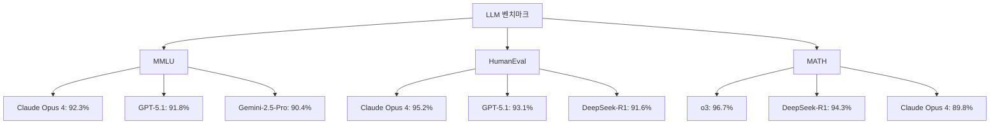
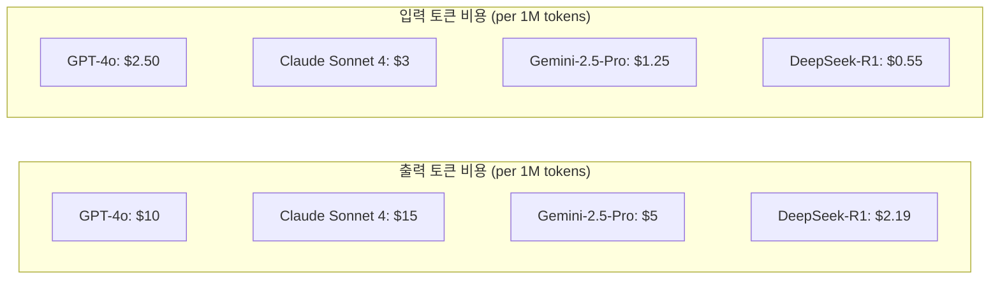
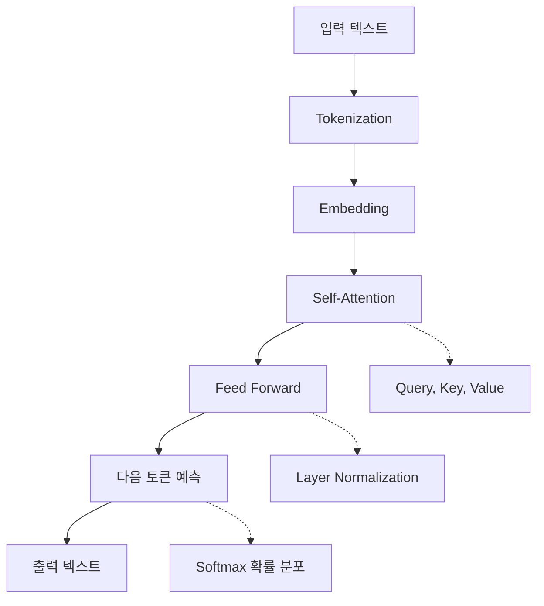
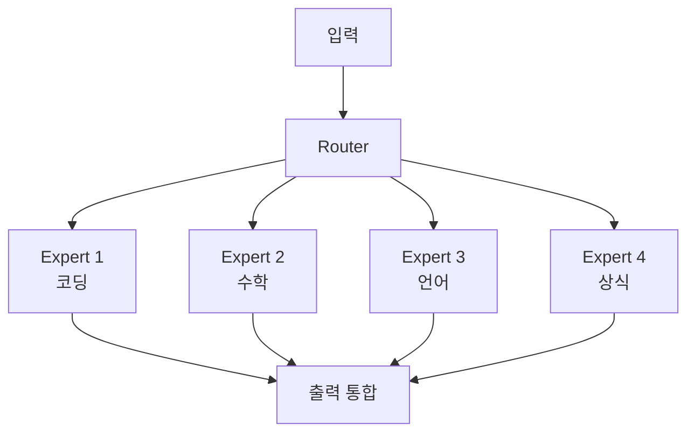
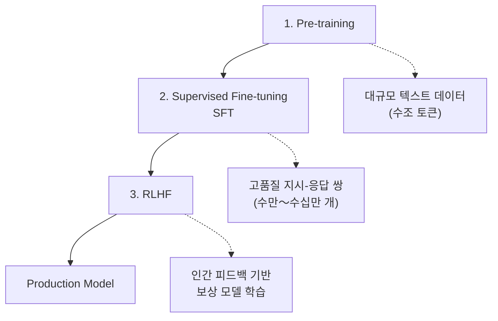
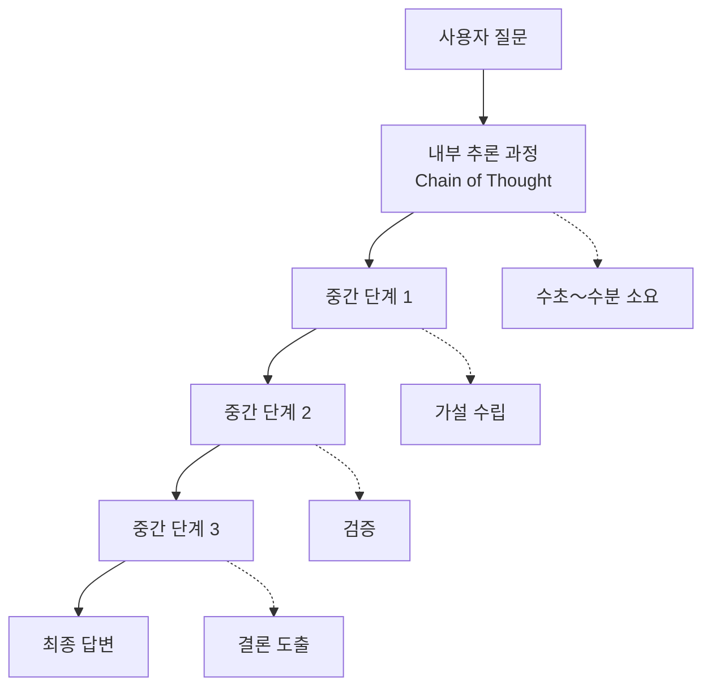
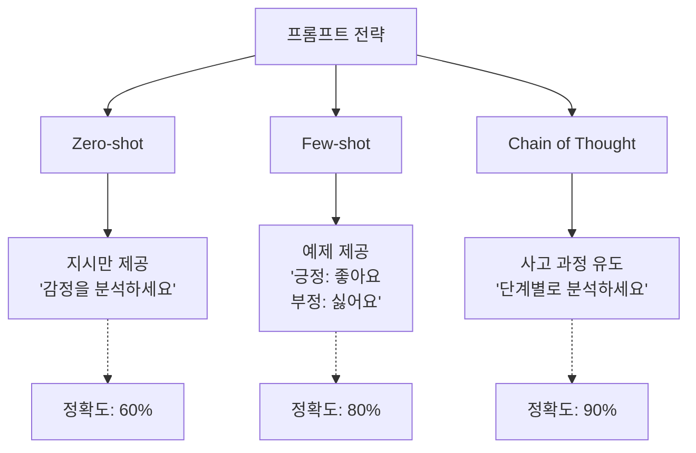
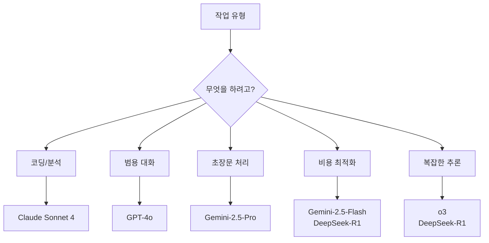

> <strong>시리즈: DeNA LLM 스터디</strong> (1/5)
>
> 1. <strong>[Part 1: LLM 기초와 2025년 AI 현황](/ko/blog/ko/dena-llm-study-part1-fundamentals)</strong> ← 현재 글
> 2. [Part 2: 구조화 출력과 멀티 LLM 파이프라인](/ko/blog/ko/dena-llm-study-part2-structured-output)
> 3. [Part 3: 모델 학습 방법론](/ko/blog/ko/dena-llm-study-part3-model-training)
> 4. [Part 4: RAG 아키텍처와 최신 트렌드](/ko/blog/ko/dena-llm-study-part4-rag)
> 5. [Part 5: 에이전트 설계와 멀티 에이전트 오케스트레이션](/ko/blog/ko/dena-llm-study-part5-agent-design)

## DeNA LLM 스터디를 시작하며

2025년, AI 기술의 발전 속도는 상상을 초월하고 있습니다. DeNA에서 진행한 LLM 스터디 자료를 바탕으로, 최신 LLM 기술의 기초부터 실전 활용까지 5회에 걸쳐 정리합니다. 이번 Part 1에서는 LLM의 기본 원리와 2025년 현재의 AI 생태계를 살펴봅니다.

> <strong>자료 출처</strong>: 본 포스트는 [DeNA 社内勉強会資料](https://dena.github.io/llm-study20251201/)을 기반으로 작성되었습니다.

## 2025년 주요 LLM 현황

### 성능 비교: GPT vs Claude vs Gemini

2025년 현재, 주요 LLM 제공업체들이 차세대 모델을 출시하며 경쟁하고 있습니다:

```markdown
| 모델                               | 개발사    | 특징            | 강점                    |
| ---------------------------------- | --------- | --------------- | ----------------------- |
| <strong>GPT-5.1 / GPT-4o</strong>  | OpenAI    | 128K 컨텍스트   | 범용성, 멀티모달        |
| <strong>Claude Opus 4</strong>     | Anthropic | 200K 컨텍스트   | 에이전트, 코딩, 분석    |
| <strong>Claude Sonnet 4</strong>   | Anthropic | 200K 컨텍스트   | 코딩, 비용 효율         |
| <strong>Gemini-2.5-Pro</strong>    | Google    | 1M 컨텍스트     | 멀티모달, 초장문        |
| <strong>DeepSeek-R1</strong>       | DeepSeek  | 64K 컨텍스트    | 추론, 오픈소스          |
```

### 벤치마크 성능 (2025년 12월 기준)



> <strong>MMLU</strong>: Massive Multitask Language Understanding (57개 과목 지식 평가)
> <strong>HumanEval</strong>: 프로그래밍 능력 평가
> <strong>MATH</strong>: 수학 문제 해결 능력

### 가격 비교 (2025년 12월 기준)



> <strong>핵심 인사이트</strong>: DeepSeek-R1은 가격 대비 추론 성능이 뛰어나며, Claude Opus 4는 에이전트와 복잡한 코딩 작업에서 우위를 보입니다.

## Next Token Prediction: LLM의 핵심 원리

### Transformer 아키텍처

LLM의 기반이 되는 Transformer는 2017년 Google의 "Attention is All You Need" 논문에서 처음 소개되었습니다.



### Next Token Prediction 동작 원리

```python
# 간단한 Next Token Prediction 예제
def predict_next_token(context: str, model: LLM) -> str:
    """
    주어진 컨텍스트에서 다음 토큰 예측

    Args:
        context: "The quick brown"
        model: LLM 모델

    Returns:
        "fox" (가장 높은 확률의 토큰)
    """
    # 1. 토큰화
    tokens = tokenize(context)  # ["The", "quick", "brown"]

    # 2. 임베딩 변환
    embeddings = model.embed(tokens)

    # 3. Transformer 레이어 통과
    hidden_states = model.forward(embeddings)

    # 4. 확률 분포 계산
    logits = model.lm_head(hidden_states[-1])  # 마지막 토큰의 hidden state
    probs = softmax(logits)

    # 5. 가장 높은 확률의 토큰 선택
    next_token = argmax(probs)  # "fox" (prob: 0.87)

    return next_token
```

> <strong>중요</strong>: LLM은 단어가 아닌 <strong>토큰</strong> 단위로 작동합니다. 영어는 1단어 ≈ 1토큰, 한국어는 1단어 ≈ 2〜3토큰입니다.

### 최신 연구 동향: Mixture of Experts (MoE)

2024년부터 대형 모델들은 MoE 아키텍처를 채택하고 있습니다:



<strong>장점</strong>:

- 계산 효율성: 전체 파라미터 중 일부만 활성화
- 전문화: 각 Expert가 특정 도메인에 특화
- 확장성: Expert 추가로 성능 향상 가능

## Instruction Tuning: AI를 지시 따르기 가능하게

### Pre-training vs Fine-tuning vs RLHF



### Instruction Tuning 데이터셋 예시

```yaml
# SFT (Supervised Fine-Tuning) 데이터 형식
- instruction: "다음 JSON을 파싱하여 이름을 추출하세요."
  input: '{"user": {"name": "John", "age": 30}}'
  output: "John"

- instruction: "이 코드의 버그를 수정하세요."
  input: |
    def add(a, b):
        return a - b
  output: |
    def add(a, b):
        return a + b  # - 대신 + 사용

- instruction: "다음 문장을 한국어로 번역하세요."
  input: "Hello, world!"
  output: "안녕하세요, 세계!"
```

### Post-training 기법 비교

| 기법                               | 목적               | 데이터 요구량 | 비용 |
| ---------------------------------- | ------------------ | ------------- | ---- |
| <strong>SFT</strong>               | 지시 따르기 학습   | 수만 개       | 낮음 |
| <strong>RLHF</strong>              | 인간 선호도 정렬   | 수천〜수만 개 | 높음 |
| <strong>DPO</strong>               | 선호도 직접 최적화 | 수천 개       | 중간 |
| <strong>Constitutional AI</strong> | 가치 정렬 자동화   | 매우 적음     | 낮음 |

> <strong>DPO (Direct Preference Optimization)</strong>: 2023년 Stanford에서 제안한 방법으로, RLHF보다 간단하면서도 효과적입니다.

## Reasoning 모델: 생각하는 AI

### o1, o3와 DeepSeek-R1의 등장

2024년 9월, OpenAI는 "생각하는" AI 모델 o1을 발표했고, 2025년에는 o3까지 발전했습니다. 특히 DeepSeek-R1은 오픈소스로 공개되어 큰 주목을 받았습니다:



### Reasoning 모델 성능 비교

```markdown
| 벤치마크                                     | GPT-4o          | o1              | o3              | DeepSeek-R1     |
| -------------------------------------------- | --------------- | --------------- | --------------- | --------------- |
| <strong>AIME 2024</strong> (수학 올림피아드) | 13.4%           | 74.4%           | 96.7%           | 79.8%           |
| <strong>Codeforces</strong> (코딩 대회)      | 11th percentile | 89th percentile | 99th percentile | 96th percentile |
| <strong>GPQA Diamond</strong> (과학)         | 50.6%           | 78.3%           | 87.7%           | 71.5%           |
```

> <strong>DeepSeek-R1</strong>: 오픈소스 Reasoning 모델로, 상용 모델과 비교해도 뛰어난 추론 능력을 보여줍니다. MIT 라이선스로 자유로운 사용이 가능합니다.

### Chain of Thought (CoT) 프롬프팅

일반 모델도 CoT를 사용하면 추론 능력을 향상시킬 수 있습니다:

```markdown
# ❌ 일반 프롬프트

"234 × 567을 계산하세요."
→ 틀린 답변 가능성 높음

# ✅ CoT 프롬프트

"234 × 567을 단계별로 계산하세요. 각 단계의 중간 결과를 보여주세요."
→ 정확도 대폭 향상
```

<strong>실제 CoT 예시</strong>:

```
질문: 234 × 567을 계산하세요.

CoT 응답:
1. 먼저 234를 200 + 30 + 4로 분해합니다.
2. 각각을 567에 곱합니다:
   - 200 × 567 = 113,400
   - 30 × 567 = 17,010
   - 4 × 567 = 2,268
3. 모두 더합니다:
   113,400 + 17,010 + 2,268 = 132,678

답: 132,678
```

## 프롬프트 엔지니어링 기초

### Zero-shot vs Few-shot vs Chain of Thought



### Temperature 파라미터의 영향

```python
# Temperature 설정에 따른 출력 차이

# Temperature = 0 (결정적, 일관성)
response = model.generate(
    "Python으로 피보나치 수열을 작성하세요.",
    temperature=0
)
# 출력: 항상 동일한 코드 (가장 확률 높은 토큰 선택)

# Temperature = 0.7 (균형적, 권장)
response = model.generate(
    "창의적인 이야기를 써주세요.",
    temperature=0.7
)
# 출력: 적당히 다양하면서도 일관성 유지

# Temperature = 1.5 (창의적, 불안정)
response = model.generate(
    "완전히 새로운 아이디어를 제안하세요.",
    temperature=1.5
)
# 출력: 매우 다양하지만 일관성 낮음, 때로 이상한 출력
```

### 효과적인 프롬프트 작성 원칙

1. <strong>명확성</strong>: 모호한 지시 피하기

   ```
   ❌ "이것에 대해 말해줘"
   ✅ "Claude Sonnet 4의 주요 특징 3가지를 150자 이내로 설명해주세요."
   ```

2. <strong>컨텍스트 제공</strong>: 배경 정보 포함

   ```
   ❌ "코드 리뷰해줘"
   ✅ "다음은 React 컴포넌트입니다. 성능, 가독성, 접근성 관점에서 리뷰해주세요: [코드]"
   ```

3. <strong>출력 형식 지정</strong>: 원하는 구조 명시
   ```
   ✅ "다음 형식으로 응답해주세요:
   1. 요약 (1문장)
   2. 주요 포인트 (3개)
   3. 실행 계획 (단계별)"
   ```

## 실습 A 인사이트: OpenAI API 실전

### API 기본 사용법

```python
from openai import OpenAI

client = OpenAI(api_key="your-api-key")

# 기본 채팅 완성
response = client.chat.completions.create(
    model="gpt-4o",
    messages=[
        {"role": "system", "content": "당신은 도움이 되는 AI 어시스턴트입니다."},
        {"role": "user", "content": "LLM이 무엇인가요?"}
    ],
    temperature=0.7,
    max_tokens=500
)

print(response.choices[0].message.content)
```

### 대화 히스토리 관리

```python
# 대화 컨텍스트 유지
conversation_history = [
    {"role": "system", "content": "당신은 Python 전문가입니다."}
]

def chat(user_message: str) -> str:
    # 사용자 메시지 추가
    conversation_history.append({"role": "user", "content": user_message})

    # API 호출
    response = client.chat.completions.create(
        model="gpt-4o",
        messages=conversation_history,
        temperature=0.7
    )

    # 어시스턴트 응답 저장
    assistant_message = response.choices[0].message.content
    conversation_history.append({"role": "assistant", "content": assistant_message})

    return assistant_message

# 대화 예시
print(chat("리스트 컴프리헨션을 설명해주세요."))
print(chat("예제 코드를 보여주세요."))  # 이전 컨텍스트 유지
print(chat("이걸 딕셔너리 컴프리헨션으로 바꿔주세요."))  # 연속적인 대화
```

### 토큰 사용량 최적화

```python
import tiktoken

def count_tokens(text: str, model: str = "gpt-4") -> int:
    """텍스트의 토큰 수 계산"""
    encoding = tiktoken.encoding_for_model(model)
    return len(encoding.encode(text))

# 프롬프트 최적화 예시
long_prompt = "이것은 매우 긴 프롬프트입니다..." * 100
token_count = count_tokens(long_prompt)
print(f"토큰 수: {token_count}")  # 예: 8,543 tokens

# 비용 계산
input_cost = (token_count / 1_000_000) * 10  # GPT-4 Turbo 입력 비용
print(f"예상 비용: ${input_cost:.4f}")
```

## 주요 학습 포인트

### 1. 모델 선택 기준



### 2. 성능 향상 체크리스트

- ✅ <strong>명확한 지시</strong>: 모호성 제거
- ✅ <strong>Few-shot 예제</strong>: 3〜5개 제공
- ✅ <strong>CoT 프롬프팅</strong>: 복잡한 추론 작업
- ✅ <strong>Temperature 조정</strong>: 작업에 맞게 설정
- ✅ <strong>출력 형식 지정</strong>: 구조화된 응답
- ✅ <strong>컨텍스트 관리</strong>: 토큰 한계 고려

### 3. 실전 활용 시나리오

| 시나리오       | 권장 모델        | 설정     |
| -------------- | ---------------- | -------- |
| 코드 리뷰      | Claude Sonnet 4  | temp=0.3 |
| 창의적 글쓰기  | GPT-4o           | temp=0.9 |
| 데이터 분석    | Claude Sonnet 4  | temp=0.1 |
| 고객 지원 챗봇 | Gemini-2.5-Flash | temp=0.7 |
| 장문 문서 요약 | Gemini-2.5-Pro   | temp=0.5 |
| 복잡한 추론    | o3 / DeepSeek-R1 | temp=0.1 |

## 다음 회차 예고

Part 2에서는 <strong>구조화 출력과 멀티 LLM 파이프라인</strong>을 다룹니다:

- JSON 모드와 Function Calling
- 구조화 출력의 실전 활용
- 멀티 LLM 파이프라인 설계
- Pydantic을 활용한 타입 안전성
- 실습 B: 복잡한 데이터 추출 시스템 구축

> <strong>다음 글 바로가기</strong>: [Part 2: 구조화 출력과 멀티 LLM 파이프라인](/ko/blog/ko/dena-llm-study-part2-structured-output)

## 참고 자료

- [DeNA LLM 스터디 자료 (Zenn)](https://dena.github.io/llm-study20251201/)
- [OpenAI API Documentation](https://platform.openai.com/docs)
- [Anthropic Claude Documentation](https://docs.anthropic.com/claude/docs)
- [Google Gemini Documentation](https://ai.google.dev/docs)
- [Attention is All You Need (Transformer 논문)](https://arxiv.org/abs/1706.03762)
- [Chain of Thought Prompting](https://arxiv.org/abs/2201.11903)

---

<strong>작성일</strong>: 2025년 12월 8일
<strong>시리즈</strong>: DeNA LLM 스터디 (1/5)
<strong>태그</strong>: #LLM #AI #PromptEngineering #DeNA
