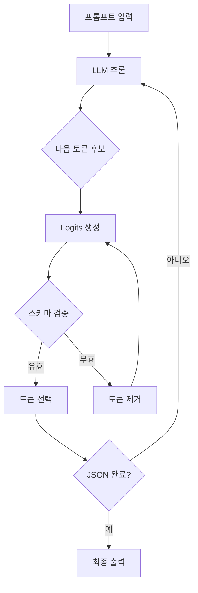
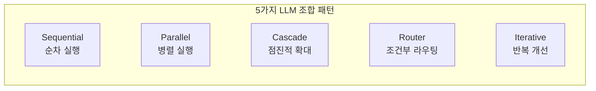

> <strong>시리즈: DeNA LLM 스터디</strong> (2/5)
>
> 1. [Part 1: LLM 기초와 2025년 AI 현황](/ko/blog/ko/dena-llm-study-part1-fundamentals)
> 2. <strong>[Part 2: 구조화 출력과 멀티 LLM 파이프라인](/ko/blog/ko/dena-llm-study-part2-structured-output)</strong> ← 현재 글
> 3. [Part 3: 모델 학습 방법론](/ko/blog/ko/dena-llm-study-part3-model-training)
> 4. [Part 4: RAG 아키텍처와 최신 트렌드](/ko/blog/ko/dena-llm-study-part4-rag)
> 5. [Part 5: 에이전트 설계와 멀티 에이전트 오케스트레이션](/ko/blog/ko/dena-llm-study-part5-agent-design)

## 개요

DeNA의 LLM 스터디 시리즈 Part 2에서는 LLM 출력을 안정적으로 제어하는 <strong>구조화 출력(Structured Output)</strong> 기법과 여러 LLM을 조합하여 더 강력한 시스템을 만드는 <strong>Multi-LLM 파이프라인 패턴</strong>을 다룹니다.

이번 글에서는 DeNA 스터디 자료를 기반으로 최신 정보를 추가하여, 실무에서 즉시 활용할 수 있는 패턴과 베스트 프랙티스를 정리했습니다.

### 이 글에서 다룰 내용

1. <strong>구조화 출력 기법</strong>
   - JSON Schema와 Pydantic 활용
   - Constrained Decoding 원리
   - 프로바이더별 구현 방식 (OpenAI, Anthropic, Google)

2. <strong>복수 LLM 조합 패턴</strong>
   - Sequential, Parallel, Cascade, Router, Iterative
   - 각 패턴의 적용 시나리오와 트레이드오프
   - 실전 구현 예제

3. <strong>실습 B & C 내용</strong>
   - B1: 이항 분류 (코멘트 분류)
   - B2: 복수 항목 추출과 채점
   - B3: 네스트 구조화 출력
   - C1: 복수 평가축 병렬 처리
   - C2: 평가 결과를 이용한 수정
   - C3: 수정-평가 루프 구현

## 1. 구조화 출력 (Structured Output)

### 1.1 구조화 출력이 필요한 이유

LLM은 기본적으로 자유 형식의 텍스트를 생성합니다. 하지만 실무 애플리케이션에서는 다음과 같은 요구사항이 있습니다:

- <strong>파싱 가능한 데이터</strong>: JSON, YAML 등 표준 형식
- <strong>타입 안전성</strong>: 필드 타입 검증 (string, number, boolean 등)
- <strong>필수 필드 보장</strong>: 누락 방지
- <strong>중첩 구조 지원</strong>: 복잡한 데이터 모델

자유 텍스트 출력의 문제점:

```python
# ❌ 문제: 파싱 실패 가능성
response = llm.generate("Extract name and age from: John is 30 years old")
# 출력: "John is 30 years old. His name is John and he is 30."
# 이 텍스트를 어떻게 파싱할까?
```

구조화 출력의 장점:

```python
# ✅ 해결: 구조화된 출력
response = llm.generate_structured(
    prompt="Extract name and age",
    schema={"name": str, "age": int}
)
# 출력: {"name": "John", "age": 30}
# 즉시 사용 가능한 데이터
```

### 1.2 JSON Schema 기반 구조화

JSON Schema는 JSON 데이터의 구조를 정의하는 표준입니다.

#### 기본 예제

```json
{
  "$schema": "http://json-schema.org/draft-07/schema#",
  "type": "object",
  "properties": {
    "name": {
      "type": "string",
      "description": "사용자 이름"
    },
    "age": {
      "type": "integer",
      "minimum": 0,
      "maximum": 150
    },
    "email": {
      "type": "string",
      "format": "email"
    }
  },
  "required": ["name", "age"]
}
```

#### OpenAI Structured Outputs API (2024년 8월 출시)

OpenAI는 JSON Schema를 직접 지원하는 API를 제공합니다:

```python
from openai import OpenAI

client = OpenAI()

response = client.chat.completions.create(
    model="gpt-4o",
    messages=[
        {"role": "user", "content": "Extract: John is 30 years old, email: john@example.com"}
    ],
    response_format={
        "type": "json_schema",
        "json_schema": {
            "name": "user_info",
            "strict": True,  # 엄격 모드: 스키마 완벽 준수
            "schema": {
                "type": "object",
                "properties": {
                    "name": {"type": "string"},
                    "age": {"type": "integer"},
                    "email": {"type": "string"}
                },
                "required": ["name", "age", "email"],
                "additionalProperties": False
            }
        }
    }
)

data = json.loads(response.choices[0].message.content)
# {"name": "John", "age": 30, "email": "john@example.com"}
```

<strong>주요 특징</strong>:

- `strict: True` 옵션으로 100% 스키마 준수 보장
- Constrained Decoding 기반으로 잘못된 JSON 생성 불가능
- 추가 비용 없음

### 1.3 Pydantic을 활용한 타입 안전 구조화

Pydantic은 Python의 데이터 검증 라이브러리로, LLM 출력 검증에 이상적입니다.

#### 기본 Pydantic 모델

```python
from pydantic import BaseModel, Field, EmailStr
from typing import List, Optional

class UserInfo(BaseModel):
    """사용자 정보 모델"""
    name: str = Field(description="사용자 이름")
    age: int = Field(ge=0, le=150, description="나이 (0-150)")
    email: EmailStr = Field(description="이메일 주소")
    tags: Optional[List[str]] = Field(default=None, description="태그 목록")

# Pydantic 모델 → JSON Schema 자동 변환
schema = UserInfo.model_json_schema()
```

#### Instructor 라이브러리 활용

Instructor는 Pydantic과 LLM API를 완벽하게 통합합니다:

```python
import instructor
from openai import OpenAI

# OpenAI 클라이언트에 Instructor 패치
client = instructor.from_openai(OpenAI())

# Pydantic 모델로 직접 응답 받기
user = client.chat.completions.create(
    model="gpt-4o",
    messages=[
        {"role": "user", "content": "Extract: John is 30, email john@example.com"}
    ],
    response_model=UserInfo  # Pydantic 모델 직접 전달
)

print(user.name)  # "John"
print(user.age)   # 30
print(user.email) # "john@example.com"
```

<strong>장점</strong>:

- Python 네이티브 타입 체크
- IDE 자동완성 지원
- 런타임 검증 자동 수행
- 복잡한 중첩 구조 지원

#### 중첩 구조 예제 (B3 실습)

```python
from pydantic import BaseModel
from typing import List

class Address(BaseModel):
    """주소 정보"""
    street: str
    city: str
    zip_code: str

class Company(BaseModel):
    """회사 정보"""
    name: str
    industry: str

class Person(BaseModel):
    """사람 정보 (중첩 구조)"""
    name: str
    age: int
    address: Address  # 중첩된 객체
    companies: List[Company]  # 객체 배열

# LLM에게 중첩 구조 추출 요청
person = client.chat.completions.create(
    model="gpt-4o",
    messages=[
        {"role": "user", "content": """
        Extract information:
        John lives at 123 Main St, New York, 10001.
        He works at Google (tech) and Microsoft (software).
        """}
    ],
    response_model=Person
)

print(person.address.city)  # "New York"
print(person.companies[0].name)  # "Google"
```

### 1.4 Constrained Decoding 원리

Constrained Decoding은 LLM이 토큰을 생성할 때, <strong>스키마에 맞지 않는 토큰을 실시간으로 차단</strong>하는 기법입니다.

#### 작동 원리



#### 예제: JSON 생성 과정

```python
# 목표 스키마: {"name": str, "age": int}
# LLM 생성 과정 (단계별)

# Step 1: 첫 토큰
# 후보: ["{", "The", "Name", ...] → "{" 선택 (스키마 시작)

# Step 2: 키 생성
# 후보: ["name", "age", "invalid", ...] → "name" 선택

# Step 3: 구분자
# 후보: [":", ",", "}"] → ":" 선택

# Step 4: 값 생성
# 후보: ["John", "123", "true"] → "John" 선택 (string 타입)

# Step 5: 다음 필드
# 후보: [",", "}"] → "," 선택 (age 필드 필요)

# Step 6: 두 번째 키
# 후보: ["age", "name", ...] → "age" 선택

# Step 7: 값 생성
# 후보: ["30", "John", "true"] → "30" 선택 (integer 타입)

# Step 8: 종료
# 후보: ["}"] → "}" 선택 (필수 필드 완료)

# 최종 출력: {"name": "John", "age": 30}
```

<strong>핵심</strong>:

- 각 단계에서 <strong>스키마에 맞는 토큰만 허용</strong>
- 잘못된 JSON이 생성될 가능성 <strong>0%</strong>
- 추가 검증 로직 불필요

#### 프로바이더별 구현

| 프로바이더            | 구현 방식                               | 비고                     |
| --------------------- | --------------------------------------- | ------------------------ |
| <strong>OpenAI</strong>            | Native Structured Outputs API           | 가장 편리 (2024.08〜)    |
| <strong>Anthropic</strong>         | Tool Use 우회 방식                      | `tools` 파라미터 활용    |
| <strong>Google Gemini</strong>     | `response_mime_type="application/json"` | JSON Schema 지원 (Beta)  |
| <strong>Local (llama.cpp)</strong> | Grammar-based decoding                  | GBNF 문법 정의 필요      |
| <strong>Outlines</strong>          | FSM-based decoding                      | 오픈소스, 모든 모델 지원 |

#### Anthropic Claude Tool Use 방식

Claude는 직접적인 JSON Schema 지원 대신 Tool Use를 활용합니다:

```python
import anthropic

client = anthropic.Anthropic()

response = client.messages.create(
    model="claude-sonnet-4-20250514",
    max_tokens=1024,
    tools=[
        {
            "name": "extract_user_info",
            "description": "사용자 정보 추출",
            "input_schema": {
                "type": "object",
                "properties": {
                    "name": {"type": "string"},
                    "age": {"type": "integer"}
                },
                "required": ["name", "age"]
            }
        }
    ],
    messages=[
        {"role": "user", "content": "John is 30 years old"}
    ]
)

# Tool use 결과 추출
tool_use = next(
    block for block in response.content
    if block.type == "tool_use"
)
data = tool_use.input  # {"name": "John", "age": 30}
```

### 1.5 실습 B: 구조화 출력 실전

#### B1: 이항 분류 (Sentiment Analysis)

```python
from pydantic import BaseModel
from enum import Enum

class Sentiment(str, Enum):
    """감정 분류"""
    POSITIVE = "positive"
    NEGATIVE = "negative"

class SentimentResult(BaseModel):
    """감정 분석 결과"""
    text: str
    sentiment: Sentiment
    confidence: float = Field(ge=0.0, le=1.0)

# 분류 실행
result = client.chat.completions.create(
    model="gpt-4o",
    messages=[
        {"role": "user", "content": "Analyze: This product is amazing!"}
    ],
    response_model=SentimentResult
)

print(result.sentiment)  # Sentiment.POSITIVE
print(result.confidence)  # 0.95
```

#### B2: 복수 항목 추출과 채점

```python
from typing import List

class Entity(BaseModel):
    """개체명 인식 결과"""
    text: str = Field(description="추출된 텍스트")
    type: str = Field(description="개체 타입 (PERSON, ORG, LOC 등)")
    start: int = Field(description="시작 위치")
    end: int = Field(description="종료 위치")

class ExtractionResult(BaseModel):
    """복수 항목 추출 결과"""
    entities: List[Entity]
    total_count: int
    quality_score: float = Field(ge=0.0, le=1.0, description="추출 품질 점수")

# 복수 항목 추출
result = client.chat.completions.create(
    model="gpt-4o",
    messages=[
        {"role": "user", "content": """
        Extract entities from:
        "Apple CEO Tim Cook announced the new iPhone in California."
        """}
    ],
    response_model=ExtractionResult
)

for entity in result.entities:
    print(f"{entity.text} ({entity.type})")
# Apple (ORG)
# Tim Cook (PERSON)
# iPhone (PRODUCT)
# California (LOC)

print(f"Quality: {result.quality_score}")  # 0.92
```

## 2. 복수 LLM 조합 패턴

단일 LLM만으로는 해결하기 어려운 문제를 여러 LLM을 조합하여 해결합니다.

### 2.1 패턴 개요



### 2.2 Sequential Pattern (순차 실행)

<strong>개념</strong>: 이전 LLM의 출력을 다음 LLM의 입력으로 사용

<strong>적용 시나리오</strong>:

- 단계적 데이터 변환 (번역 → 요약 → 감정 분석)
- 점진적 정제 (초안 작성 → 문법 교정 → 스타일 개선)

```python
# 예제: 번역 → 요약 파이프라인
async def sequential_pipeline(text: str) -> str:
    # Step 1: 번역
    translated = await llm_call(
        model="gpt-4o",
        prompt=f"Translate to English: {text}"
    )

    # Step 2: 요약 (번역 결과 사용)
    summary = await llm_call(
        model="gpt-4o-mini",  # 더 저렴한 모델로 요약
        prompt=f"Summarize in 3 sentences: {translated}"
    )

    return summary

# 실행
result = await sequential_pipeline("한국어 긴 문서...")
```

<strong>트레이드오프</strong>:

- ✅ 각 단계가 명확하게 분리
- ✅ 디버깅 용이
- ❌ 지연 시간 누적 (단계 수 × LLM 호출 시간)
- ❌ 앞 단계 오류가 뒷 단계에 전파

### 2.3 Parallel Pattern (병렬 실행)

<strong>개념</strong>: 여러 LLM을 동시에 실행하여 결과 집계

<strong>적용 시나리오</strong>:

- 다각도 평가 (문법, 스타일, 내용 동시 평가)
- 앙상블 추론 (여러 모델의 결과를 투표/평균)

```python
import asyncio

async def parallel_evaluation(text: str) -> dict:
    """복수 평가축 병렬 처리 (C1 실습)"""

    # 3가지 평가를 병렬로 실행
    tasks = [
        evaluate_grammar(text),    # 문법 평가
        evaluate_style(text),      # 스타일 평가
        evaluate_content(text)     # 내용 평가
    ]

    # 동시 실행 (asyncio.gather)
    grammar, style, content = await asyncio.gather(*tasks)

    return {
        "grammar_score": grammar,
        "style_score": style,
        "content_score": content,
        "overall_score": (grammar + style + content) / 3
    }

async def evaluate_grammar(text: str) -> float:
    response = await llm_call(
        model="gpt-4o",
        prompt=f"문법 점수 (0-100): {text}",
        response_model=ScoreResult
    )
    return response.score

# 다른 평가 함수도 동일한 패턴...
```

<strong>실행 시간 비교</strong>:

```python
# Sequential: 3초 × 3 = 9초
# Parallel: max(3초, 3초, 3초) = 3초
# → 66% 시간 단축!
```

<strong>트레이드오프</strong>:

- ✅ 최대 속도 (병렬 실행)
- ✅ 독립적인 평가 가능
- ❌ 비용 증가 (동시에 여러 API 호출)
- ❌ 결과 집계 로직 필요

### 2.4 Cascade Pattern (점진적 확대)

<strong>개념</strong>: 작은 모델부터 시작하여, 필요시 큰 모델로 확대

<strong>적용 시나리오</strong>:

- 비용 최적화 (간단한 질문은 작은 모델로)
- 품질 보장 (복잡한 질문만 큰 모델로)

```python
async def cascade_routing(query: str) -> str:
    """Cascade 패턴: 작은 모델 → 큰 모델"""

    # Step 1: 작은 모델로 시도
    response_small = await llm_call(
        model="gpt-4o-mini",  # 저렴한 모델
        prompt=query,
        max_tokens=100
    )

    # Step 2: 품질 검증
    quality = await evaluate_quality(response_small)

    if quality >= 0.8:
        # 품질 충분 → 작은 모델 결과 반환
        return response_small

    # Step 3: 품질 부족 → 큰 모델로 재시도
    response_large = await llm_call(
        model="gpt-4o",  # 강력한 모델
        prompt=query,
        max_tokens=500
    )

    return response_large

# 비용 절감 효과
# - 80% 질문: gpt-4o-mini ($0.15/1M tokens)
# - 20% 질문: gpt-4o ($5/1M tokens)
# → 평균 비용: 0.15 × 0.8 + 5 × 0.2 = $1.12 (78% 절감)
```

<strong>트레이드오프</strong>:

- ✅ 비용 효율 극대화
- ✅ 평균 품질 유지
- ❌ 최악의 경우 지연 시간 2배 (재시도)
- ❌ 품질 평가 로직 필요

### 2.5 Router Pattern (조건부 라우팅)

<strong>개념</strong>: 입력의 특성에 따라 최적의 모델로 라우팅

<strong>적용 시나리오</strong>:

- 도메인별 전문가 모델 (의료, 법률, 기술)
- 언어별 모델 (한국어 특화, 영어 특화)

```python
from enum import Enum

class QueryType(str, Enum):
    TECHNICAL = "technical"
    MEDICAL = "medical"
    LEGAL = "legal"
    GENERAL = "general"

async def router_pattern(query: str) -> str:
    # Step 1: 쿼리 분류
    classification = await llm_call(
        model="gpt-4o-mini",  # 빠른 분류기
        prompt=f"Classify query type: {query}",
        response_model=QueryClassification
    )

    # Step 2: 전문가 모델로 라우팅
    if classification.type == QueryType.TECHNICAL:
        model = "gpt-4o"  # 기술 문서에 강한 모델
    elif classification.type == QueryType.MEDICAL:
        model = "claude-opus-4-20250514"  # 의료 지식이 풍부한 모델
    elif classification.type == QueryType.LEGAL:
        model = "gpt-4o"  # 법률 추론에 강한 모델
    else:
        model = "gpt-4o-mini"  # 일반 질문은 저렴한 모델

    # Step 3: 선택된 모델로 실행
    response = await llm_call(model=model, prompt=query)
    return response
```

<strong>트레이드오프</strong>:

- ✅ 최적의 모델 선택
- ✅ 비용 대비 품질 최적화
- ❌ 분류 오류 가능성
- ❌ 라우팅 로직 유지보수

### 2.6 Iterative Pattern (반복 개선)

<strong>개념</strong>: 평가 → 수정을 반복하며 품질 개선

<strong>적용 시나리오</strong>:

- 글쓰기 개선 (초안 → 피드백 → 수정 → 재평가)
- 코드 리팩토링 (코드 → 리뷰 → 수정 → 재리뷰)

```python
async def iterative_improvement(
    initial_text: str,
    max_iterations: int = 3,
    target_score: float = 0.9
) -> str:
    """수정-평가 루프 (C2, C3 실습)"""

    current_text = initial_text

    for iteration in range(max_iterations):
        # Step 1: 평가
        evaluation = await llm_call(
            model="gpt-4o",
            prompt=f"Evaluate quality (0-1): {current_text}",
            response_model=EvaluationResult
        )

        print(f"Iteration {iteration + 1}: Score = {evaluation.score}")

        # Step 2: 목표 달성 확인
        if evaluation.score >= target_score:
            print(f"Target achieved! ({evaluation.score} >= {target_score})")
            break

        # Step 3: 피드백 기반 수정
        current_text = await llm_call(
            model="gpt-4o",
            prompt=f"""
            Improve the text based on feedback:

            Current text: {current_text}
            Feedback: {evaluation.feedback}

            Generate improved version.
            """
        )

    return current_text

# 실행
improved = await iterative_improvement(
    initial_text="초안 텍스트...",
    max_iterations=3,
    target_score=0.9
)
```

<strong>트레이드오프</strong>:

- ✅ 점진적 품질 개선
- ✅ 명확한 피드백 루프
- ❌ 비용 증가 (반복 횟수 × 비용)
- ❌ 수렴 보장 없음 (무한 루프 가능성)

### 2.7 패턴 선택 가이드

| 요구사항    | 추천 패턴  | 이유                      |
| ----------- | ---------- | ------------------------- |
| 속도 최우선 | Parallel   | 병렬 실행으로 지연 최소화 |
| 비용 최우선 | Cascade    | 작은 모델 우선 사용       |
| 품질 최우선 | Iterative  | 반복 개선으로 품질 보장   |
| 도메인 특화 | Router     | 전문가 모델로 라우팅      |
| 단계적 처리 | Sequential | 명확한 파이프라인 구성    |

### 2.8 실전 구현: 하이브리드 패턴

실무에서는 여러 패턴을 조합합니다:

```python
async def hybrid_pipeline(text: str) -> str:
    """Router + Cascade + Parallel 조합"""

    # Step 1: Router (쿼리 분류)
    query_type = await classify_query(text)

    if query_type == "simple":
        # Step 2a: Cascade (간단한 쿼리)
        return await cascade_routing(text)

    else:
        # Step 2b: Parallel + Iterative (복잡한 쿼리)
        # 병렬로 초안 생성 및 평가
        draft, evaluation = await asyncio.gather(
            generate_draft(text),
            evaluate_requirements(text)
        )

        # 반복 개선
        improved = await iterative_improvement(
            draft,
            evaluation,
            max_iterations=2
        )

        return improved
```

## 3. 실습 정리

### 실습 B: 구조화 출력

| 실습 | 주제           | 핵심 개념                      |
| ---- | -------------- | ------------------------------ |
| B1   | 이항 분류      | Enum 타입, Pydantic validation |
| B2   | 복수 항목 추출 | List 타입, 중첩 검증           |
| B3   | 네스트 구조    | 객체 중첩, 복잡한 스키마       |

### 실습 C: 복수 LLM 조합

| 실습 | 주제      | 핵심 개념                       |
| ---- | --------- | ------------------------------- |
| C1   | 병렬 평가 | asyncio.gather, 동시 실행       |
| C2   | 평가-수정 | Sequential pattern, 피드백 활용 |
| C3   | 반복 루프 | Iterative pattern, 수렴 조건    |

## 4. 최신 동향 및 베스트 프랙티스

### 4.1 2025년 구조화 출력 표준

<strong>OpenAI Structured Outputs</strong>가 사실상 표준으로 자리잡았습니다:

- <strong>Constrained Decoding 기반</strong>: 100% 스키마 준수
- <strong>추가 비용 없음</strong>: 기존 API와 동일한 가격
- <strong>Pydantic 통합</strong>: Instructor 등 라이브러리 지원

<strong>경쟁 제품</strong>:

- Anthropic: Tool Use 방식 (우회적)
- Google: `response_mime_type` (Beta)
- Local: Outlines, llama-cpp-python

### 4.2 비용 최적화 전략

```python
# 비용 효율 전략 조합
async def cost_optimized_pipeline(query: str) -> str:
    # 1. Cascade: 작은 모델 우선
    result = await cascade_routing(query)

    # 2. Caching: 반복 쿼리 캐싱
    cache_key = hash(query)
    if cache_key in cache:
        return cache[cache_key]

    # 3. Batch Processing: API 호출 묶기
    if len(pending_queries) >= 10:
        results = await batch_call(pending_queries)

    cache[cache_key] = result
    return result
```

<strong>비용 절감 효과</strong>:

- Cascade: 70-80%
- Caching: 50-90% (반복 쿼리 비율에 따라)
- Batch: 20-30%

### 4.3 품질 보장 체크리스트

<strong>구조화 출력</strong>:

- ✅ 필수 필드 정의 (`required` 배열)
- ✅ 타입 제약 (`minimum`, `maximum`, `pattern`)
- ✅ 설명 추가 (`description` 필드로 LLM 가이드)
- ✅ 검증 로직 (`Pydantic validator`)

<strong>파이프라인 설계</strong>:

- ✅ 오류 처리 (각 단계마다 try-catch)
- ✅ 타임아웃 설정 (무한 대기 방지)
- ✅ 로깅 (디버깅을 위한 중간 결과 기록)
- ✅ 모니터링 (비용, 지연, 오류율 추적)

### 4.4 오픈소스 도구 에코시스템

| 도구           | 용도                        | 추천도     |
| -------------- | --------------------------- | ---------- |
| <strong>Instructor</strong> | Pydantic ↔ LLM 통합         | ⭐⭐⭐⭐⭐ |
| <strong>Outlines</strong>   | Constrained Decoding (로컬) | ⭐⭐⭐⭐   |
| <strong>LangChain</strong>  | 파이프라인 오케스트레이션   | ⭐⭐⭐     |
| <strong>LlamaIndex</strong> | RAG + Structured Outputs    | ⭐⭐⭐⭐   |
| <strong>Guidance</strong>   | Template-based 출력 제어    | ⭐⭐⭐     |

## 5. 다음 단계

### Part 3 예고: RAG와 벡터 데이터베이스

다음 글에서는 <strong>외부 지식을 LLM에 주입</strong>하는 RAG(Retrieval-Augmented Generation) 기법을 다룹니다:

1. <strong>벡터 데이터베이스 기초</strong>
   - Embedding 모델 선택
   - FAISS, Pinecone, Weaviate 비교

2. <strong>RAG 파이프라인 구축</strong>
   - Chunking 전략
   - Retrieval 최적화
   - Reranking 기법

3. <strong>고급 RAG 패턴</strong>
   - Hybrid Search (키워드 + 벡터)
   - Multi-hop Retrieval
   - Self-Query

### 실습 프로젝트 제안

1. <strong>문서 처리 시스템</strong>
   - PDF → 구조화 데이터 추출
   - Parallel Pattern으로 병렬 처리
   - Pydantic으로 검증

2. <strong>자동 평가 파이프라인</strong>
   - Iterative Pattern으로 품질 개선
   - 복수 평가축 (문법, 스타일, 내용)
   - 목표 점수 도달까지 반복

3. <strong>비용 최적화 시스템</strong>
   - Cascade Pattern으로 모델 선택
   - 쿼리 분류 → 라우팅
   - 캐싱 + 배치 처리

## 결론

DeNA LLM 스터디 Part 2에서는 LLM을 실무에 적용하기 위한 두 가지 핵심 기법을 배웠습니다:

1. <strong>구조화 출력</strong>
   - JSON Schema, Pydantic으로 타입 안전한 출력 보장
   - Constrained Decoding으로 100% 스키마 준수
   - OpenAI Structured Outputs API가 현재 최고의 선택

2. <strong>Multi-LLM 조합 패턴</strong>
   - Sequential, Parallel, Cascade, Router, Iterative
   - 각 패턴의 트레이드오프 이해
   - 실무에서는 하이브리드 조합 활용

<strong>핵심 메시지</strong>:

- 구조화 출력은 <strong>프로덕션 LLM 애플리케이션의 필수 요소</strong>
- 단일 LLM보다 <strong>복수 LLM 조합이 더 강력</strong>
- 비용, 속도, 품질의 <strong>균형점을 찾는 것이 실무의 핵심</strong>

다음 Part 3에서는 RAG를 통해 LLM의 지식을 확장하는 방법을 배웁니다!

## 참고 자료

### 공식 문서

- [OpenAI Structured Outputs](https://openai.com/index/introducing-structured-outputs-in-the-api/)
- [Anthropic Tool Use](https://docs.anthropic.com/claude/docs/tool-use)
- [Pydantic 공식 문서](https://docs.pydantic.dev/)
- [Instructor 라이브러리](https://python.useinstructor.com/)

### 논문 및 연구

- [A Unified Approach to Routing and Cascading for LLMs](https://arxiv.org/html/2410.10347v1) (2024)
- [Constrained Decoding for LLMs](https://www.aidancooper.co.uk/constrained-decoding/) (2024)
- [Generating Structured Outputs from Language Models](https://arxiv.org/html/2501.10868v1) (2025)

### 실무 가이드

- [Enforcing JSON Outputs in Commercial LLMs](https://datachain.ai/blog/enforcing-json-outputs-in-commercial-llms)
- [Mastering Pydantic for LLM Workflows](https://ai.plainenglish.io/mastering-pydantic-for-llm-workflows-c6ed18fc79cc)
- [The guide to structured outputs and function calling](https://agenta.ai/blog/the-guide-to-structured-outputs-and-function-calling-with-llms)
