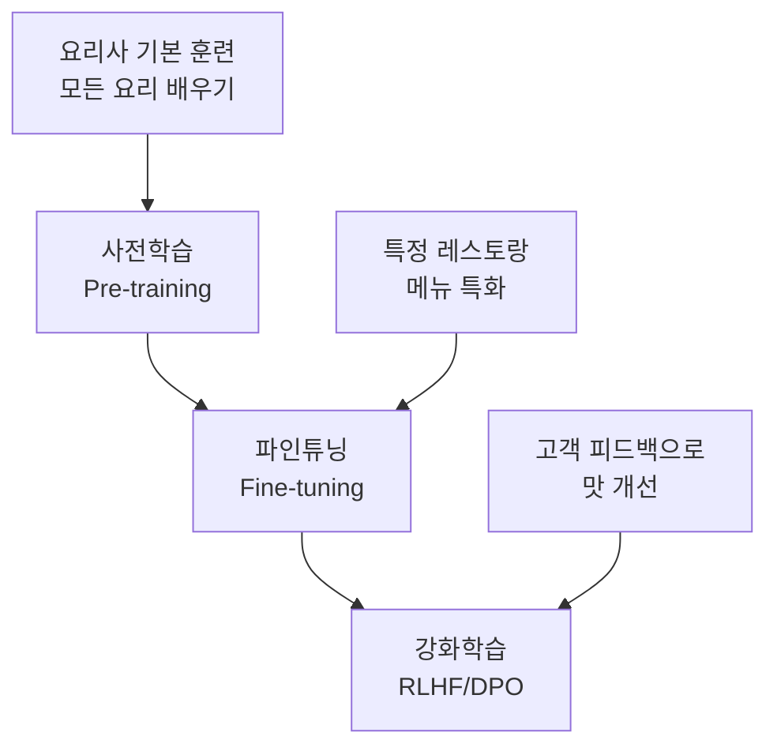
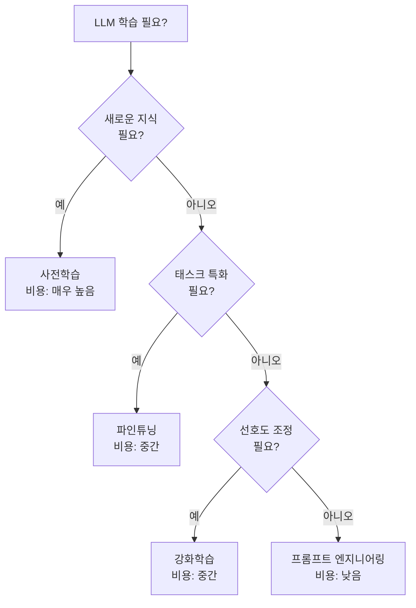
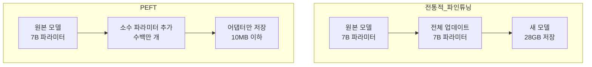
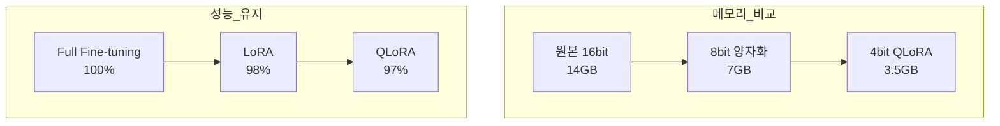
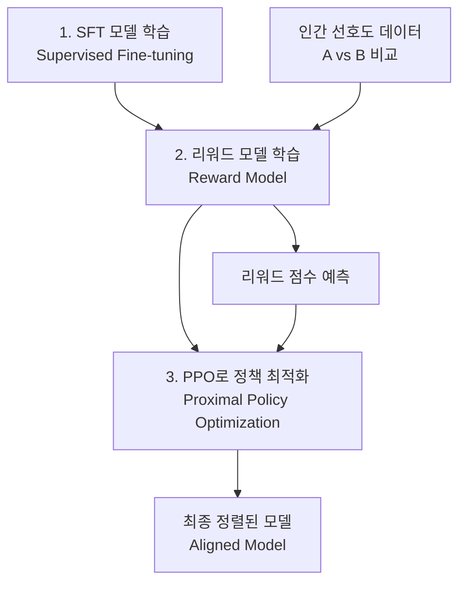
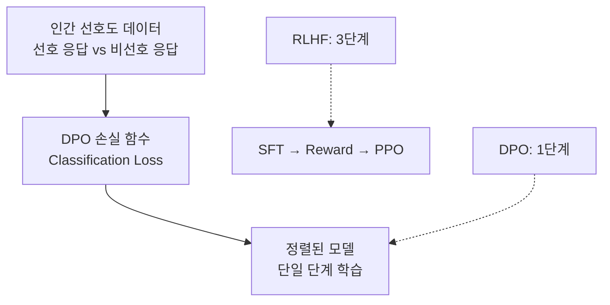
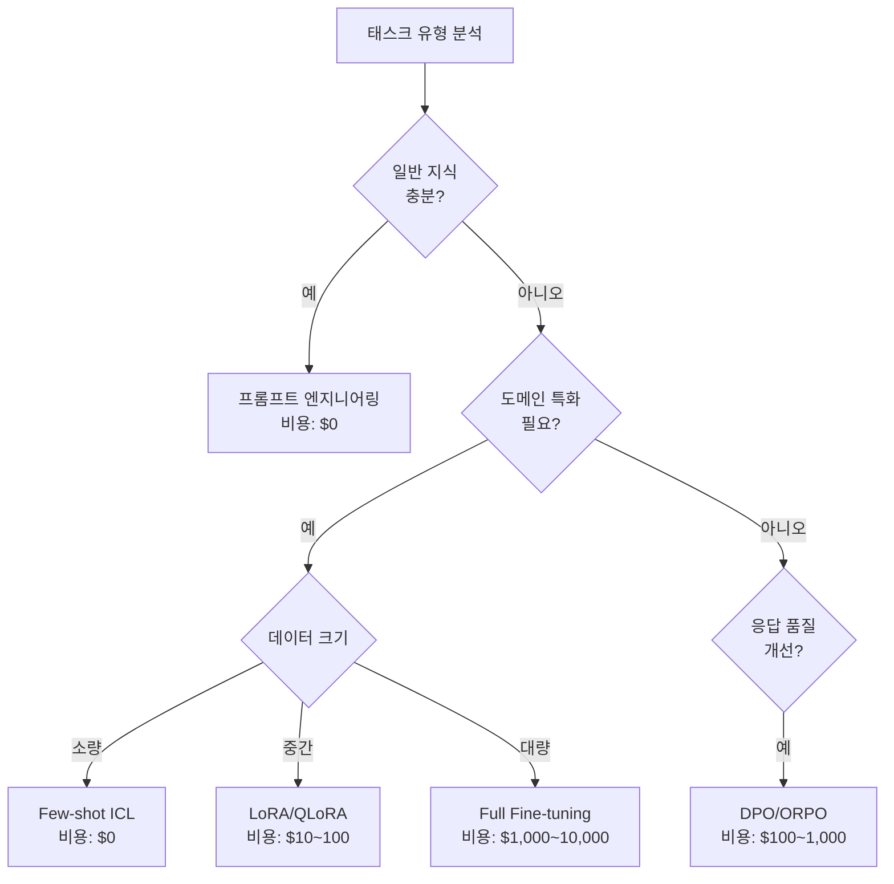

> **시리즈: DeNA LLM 스터디** (3/5)
>
> 1. [Part 1: LLM 기초와 2025년 AI 현황](/ko/blog/ko/dena-llm-study-part1-fundamentals)
> 2. [Part 2: 구조화 출력과 멀티 LLM 파이프라인](/ko/blog/ko/dena-llm-study-part2-structured-output)
> 3. <strong>[Part 3: 모델 학습 방법론](/ko/blog/ko/dena-llm-study-part3-model-training)</strong> ← 현재 글
> 4. [Part 4: RAG 아키텍처와 최신 트렌드](/ko/blog/ko/dena-llm-study-part4-rag)
> 5. [Part 5: 에이전트 설계와 멀티 에이전트 오케스트레이션](/ko/blog/ko/dena-llm-study-part5-agent-design)

## 들어가며

DeNA의 LLM 스터디 자료 Part 3는 LLM의 다양한 학습 방법론을 다룹니다. 사전학습(Pre-training), 파인튜닝(Fine-tuning), 강화학습(Reinforcement Learning)의 차이를 이해하고, LoRA, QLoRA, DPO 같은 최신 효율적 학습 기법의 원리와 실무 적용 방법을 살펴봅니다.

본 포스트는 DeNA 스터디 자료를 기반으로 하되, 2025년 최신 트렌드와 실무 경험을 추가하여 작성했습니다.

## 사전학습 vs 파인튜닝 vs 강화학습

### 레스토랑 비유로 이해하기

DeNA 자료는 세 가지 학습 방식을 레스토랑 운영에 비유하여 설명합니다:



**사전학습 (Pre-training)**

- <strong>목적</strong>: 범용적인 언어 이해 능력 획득
- <strong>데이터</strong>: 수십〜수백 TB의 웹 데이터
- <strong>비용</strong>: 수억〜수천억 원 (GPT-4 추정 1000억 원 이상)
- <strong>비유</strong>: 요리학교에서 모든 요리 기법을 배우는 과정

**파인튜닝 (Fine-tuning)**

- <strong>목적</strong>: 특정 태스크/도메인에 특화
- <strong>데이터</strong>: 수천〜수만 개의 태스크별 데이터
- <strong>비용</strong>: 수십만〜수백만 원
- <strong>비유</strong>: 이탈리안 레스토랑의 파스타 전문가가 되는 과정

**강화학습 (Reinforcement Learning)**

- <strong>목적</strong>: 인간의 선호도에 맞춘 응답 생성
- <strong>데이터</strong>: 수천〜수만 개의 선호도 데이터
- <strong>비용</strong>: 수백만〜수천만 원
- <strong>비유</strong>: 고객 피드백을 받아 요리 맛을 조정하는 과정

### 실무 의사결정 가이드



<strong>의사결정 체크리스트</strong>:

1. <strong>프롬프트로 해결 가능한가?</strong> → 먼저 프롬프트 최적화 시도
2. <strong>기존 모델이 태스크를 이해하는가?</strong> → 예: 강화학습, 아니오: 파인튜닝
3. <strong>완전히 새로운 도메인인가?</strong> → 사전학습 고려 (단, 비용 주의)

## PEFT: 효율적 파인튜닝의 등장

### 전통적 파인튜닝의 문제점

전체 파라미터를 업데이트하는 Full Fine-tuning의 한계:

- <strong>메모리 사용량</strong>: 7B 모델 파인튜닝에 80GB+ VRAM 필요
- <strong>시간 비용</strong>: 수 시간〜수일 소요
- <strong>배포 어려움</strong>: 태스크마다 전체 모델 저장 필요 (수십 GB)

### PEFT의 핵심 아이디어

Parameter-Efficient Fine-Tuning (PEFT)는 <strong>전체 파라미터의 일부만 학습</strong>하여 효율성을 극대화합니다:



<strong>PEFT 주요 방법론</strong>:

1. <strong>Adapter</strong>: 레이어 사이에 작은 네트워크 삽입
2. <strong>Prefix Tuning</strong>: 입력에 학습 가능한 prefix 추가
3. <strong>LoRA</strong>: 가중치 행렬을 저랭크 분해하여 업데이트 (가장 인기)
4. <strong>Prompt Tuning</strong>: 소프트 프롬프트만 학습

## LoRA: 저랭크 적응의 원리

### 수학적 배경

LoRA(Low-Rank Adaptation)는 다음과 같은 수학적 통찰에 기반합니다:

```python
# 원본 가중치 업데이트 (Full Fine-tuning)
W_new = W_original + ΔW  # ΔW는 d×d 크기

# LoRA의 저랭크 분해
ΔW = B @ A  # B는 d×r, A는 r×d (r << d)

# 실제 적용
output = (W_original + B @ A) @ input
```

<strong>핵심 아이디어</strong>:

- 사전학습된 가중치는 이미 많은 정보를 담고 있음
- 파인튜닝 시 필요한 변화량(ΔW)은 <strong>낮은 내재 차원(intrinsic dimension)</strong>을 가짐
- 따라서 ΔW를 두 개의 작은 행렬(B, A)의 곱으로 표현 가능

### LoRA 하이퍼파라미터 설정 가이드

```yaml
# LoRA 설정 예시 (HuggingFace PEFT)
lora_config:
  r: 8 # Rank (내재 차원)
  lora_alpha: 16 # 스케일링 파라미터
  lora_dropout: 0.1 # Dropout 비율
  target_modules: # 적용할 레이어
    - q_proj # Query projection
    - v_proj # Value projection
  bias: "none" # Bias 학습 여부
```

<strong>하이퍼파라미터 선택 가이드</strong>:

| 파라미터                        | 권장 값        | 설명                                                    |
| ------------------------------- | -------------- | ------------------------------------------------------- |
| <strong>r (Rank)</strong>       | 4〜16          | 작을수록 메모리 절약, 크면 표현력 증가. 대부분 8이 적절 |
| <strong>lora_alpha</strong>     | r〜2r          | 학습률과 유사한 역할. 보통 r의 1〜2배                   |
| <strong>lora_dropout</strong>   | 0.05〜0.1      | 과적합 방지. 작은 데이터셋은 높게 설정                  |
| <strong>target_modules</strong> | q_proj, v_proj | Attention의 Query/Value가 가장 효과적                   |

### LoRA 변형들

**DoRA (Weight-Decomposed Low-Rank Adaptation, 2024)**

```python
# DoRA: 가중치를 크기(magnitude)와 방향(direction)으로 분해
W = m * (V + B @ A)
# m: 학습 가능한 크기, V: 정규화된 가중치, B@A: LoRA
```

- <strong>장점</strong>: Full Fine-tuning에 더 가까운 성능
- <strong>단점</strong>: LoRA보다 약간 느림

**GaLore (Gradient Low-Rank Projection, 2024)**

```python
# Gradient를 저랭크 공간에 투영하여 메모리 절약
gradient_lowrank = project_to_lowrank(gradient)
optimizer.step(gradient_lowrank)
```

- <strong>장점</strong>: 옵티마이저 상태도 저랭크로 압축 → 메모리 50% 추가 절감
- <strong>단점</strong>: 구현 복잡도 높음

**LoRA+ (2024)**

```python
# 학습률을 행렬 A, B에 다르게 적용
lr_A = lr * eta  # A는 높은 학습률
lr_B = lr        # B는 기본 학습률
```

- <strong>장점</strong>: 수렴 속도 1.5〜2배 개선
- <strong>단점</strong>: 하이퍼파라미터 튜닝 필요

## QLoRA: 양자화와 PEFT의 결합

### 4bit 양자화의 혁신

QLoRA는 <strong>4bit 양자화</strong>와 LoRA를 결합하여 메모리 사용량을 극적으로 줄입니다:



<strong>QLoRA 핵심 기술</strong>:

1. <strong>4bit NormalFloat (NF4)</strong>: 정규분포에 최적화된 양자화
2. <strong>Double Quantization</strong>: 양자화 상수도 양자화
3. <strong>Paged Optimizers</strong>: CPU-GPU 메모리 자동 관리

### QLoRA 실무 워크플로우

```python
from transformers import AutoModelForCausalLM, BitsAndBytesConfig
from peft import LoraConfig, get_peft_model

# 1. 4bit 양자화 설정
bnb_config = BitsAndBytesConfig(
    load_in_4bit=True,
    bnb_4bit_quant_type="nf4",      # NormalFloat 4bit
    bnb_4bit_compute_dtype="float16", # 계산은 float16
    bnb_4bit_use_double_quant=True,   # Double quantization
)

# 2. 모델 로드
model = AutoModelForCausalLM.from_pretrained(
    "meta-llama/Llama-2-7b-hf",
    quantization_config=bnb_config,
    device_map="auto"  # 자동 디바이스 할당
)

# 3. LoRA 설정
lora_config = LoraConfig(
    r=8,
    lora_alpha=16,
    target_modules=["q_proj", "v_proj"],
    lora_dropout=0.1,
    bias="none",
    task_type="CAUSAL_LM"
)

# 4. PEFT 모델 생성
model = get_peft_model(model, lora_config)

# 5. 학습 가능한 파라미터 확인
trainable_params = sum(p.numel() for p in model.parameters() if p.requires_grad)
print(f"훈련 가능 파라미터: {trainable_params:,} ({trainable_params/7e9*100:.2f}%)")
# 출력: 훈련 가능 파라미터: 4,194,304 (0.06%)
```

<strong>QLoRA 실무 팁</strong>:

- <strong>GPU 메모리</strong>: 7B 모델을 단일 RTX 3090 (24GB)에서 학습 가능
- <strong>배치 크기</strong>: Gradient accumulation 활용 (예: batch_size=1, gradient_accumulation_steps=16)
- <strong>학습 시간</strong>: Full Fine-tuning 대비 1.5〜2배 느림 (양자화 오버헤드)

## RLHF와 DPO: 인간 선호도 학습

### RLHF의 복잡성

Reinforcement Learning from Human Feedback (RLHF)는 강력하지만 복잡합니다:



<strong>RLHF의 문제점</strong>:

1. <strong>3단계 파이프라인</strong>: SFT → Reward Model → RL 최적화
2. <strong>불안정성</strong>: PPO는 하이퍼파라미터에 민감
3. <strong>높은 비용</strong>: 리워드 모델 학습 + RL 샘플링
4. <strong>디버깅 어려움</strong>: RL 수렴 실패 시 원인 파악 난해

### DPO: 직접 선호도 최적화

Direct Preference Optimization (DPO)는 <strong>리워드 모델 없이</strong> 인간 선호도를 직접 학습합니다:



<strong>DPO 손실 함수</strong>:

```python
# DPO Loss (수식 간소화)
loss = -log(σ(β * (log π(y_w|x) - log π(y_l|x))))

# y_w: 선호 응답 (chosen)
# y_l: 비선호 응답 (rejected)
# β: 하이퍼파라미터 (일반적으로 0.1)
# σ: Sigmoid 함수
```

<strong>DPO의 장점</strong>:

- <strong>단순성</strong>: 리워드 모델 불필요, 한 번의 학습으로 완료
- <strong>안정성</strong>: Classification loss는 PPO보다 안정적
- <strong>효율성</strong>: 메모리와 시간 50% 절감
- <strong>성능</strong>: RLHF와 동등하거나 더 나은 성능

### DPO 실무 구현

```python
from trl import DPOTrainer

# DPO 학습 설정
training_args = TrainingArguments(
    output_dir="./dpo_model",
    per_device_train_batch_size=4,
    learning_rate=5e-5,
    num_train_epochs=3,
    gradient_accumulation_steps=4,
)

# DPO Trainer 초기화
dpo_trainer = DPOTrainer(
    model=model,
    args=training_args,
    train_dataset=preference_dataset,  # (prompt, chosen, rejected) 형식
    tokenizer=tokenizer,
    beta=0.1,  # DPO 하이퍼파라미터
)

# 학습 실행
dpo_trainer.train()
```

<strong>선호도 데이터 형식</strong>:

```python
preference_dataset = [
    {
        "prompt": "파이썬으로 리스트를 정렬하는 방법은?",
        "chosen": "sorted() 함수를 사용하면 됩니다: sorted([3,1,2])",
        "rejected": "그냥 sort() 쓰면 돼요"
    },
    # ...
]
```

### DPO 변형들

**ORPO (Odds Ratio Preference Optimization, 2024)**

- SFT와 선호도 학습을 <strong>동시에</strong> 수행
- 별도의 SFT 단계 불필요
- 학습 시간 추가 단축

**IPO (Identity Preference Optimization, 2024)**

- Reference 모델 없이 학습 가능
- 메모리 사용량 더 절감

**KTO (Kahneman-Tversky Optimization, 2024)**

- 쌍 비교 데이터 대신 <strong>개별 피드백</strong> 사용 (좋음/나쁨)
- 데이터 수집 비용 대폭 감소

## 태스크별 학습 방법 선택 가이드

### 비용-성능 트레이드오프



### 실무 권장 사항

**1. 챗봇/대화형 시스템**

```
프롬프트 → SFT (LoRA) → DPO
```

- 도메인 지식 주입: LoRA로 효율적 파인튜닝
- 대화 품질 개선: DPO로 선호도 정렬

**2. 문서 분류/태깅**

```
프롬프트 → LoRA (선택적)
```

- 대부분 프롬프트로 충분
- 극한 성능 필요 시 LoRA 추가

**3. 코드 생성**

```
프롬프트 → SFT (QLoRA) → RLHF/DPO
```

- 코드 스타일 학습: QLoRA로 대량 코드 학습
- 실행 가능성 개선: RLHF로 컴파일 오류 페널티

**4. 요약/번역**

```
프롬프트 → DPO
```

- 기본 모델로 충분한 경우 많음
- 스타일 조정: DPO로 원하는 톤/길이 학습

### 메모리 요구사항 비교

| 방법                              | 7B 모델               | 13B 모델              | 70B 모델               |
| --------------------------------- | --------------------- | --------------------- | ---------------------- |
| <strong>Full Fine-tuning</strong> | 80GB                  | 160GB                 | 800GB+                 |
| <strong>LoRA</strong>             | 40GB                  | 80GB                  | 400GB                  |
| <strong>QLoRA</strong>            | <strong>24GB</strong> | <strong>40GB</strong> | <strong>200GB</strong> |

<strong>소비자용 GPU 활용 가능 여부</strong>:

- <strong>RTX 4090 (24GB)</strong>: QLoRA로 7B, LoRA로 3B 학습 가능
- <strong>RTX 3090 (24GB)</strong>: QLoR로 7B 학습 가능
- <strong>RTX 4060 Ti (16GB)</strong>: QLoRA로 3B 학습 가능

## 시사점 및 느낀 점

### 민주화되는 LLM 파인튜닝

DeNA 자료를 통해 가장 인상 깊었던 점은 <strong>LLM 파인튜닝이 더 이상 대기업의 전유물이 아니다</strong>는 것입니다. QLoRA와 DPO의 등장으로:

- 24GB VRAM으로 7B 모델 파인튜닝 가능
- 수백 달러 예산으로 도메인 특화 모델 구축 가능
- 복잡한 RLHF 대신 간단한 DPO 활용 가능

### 효율성의 패러다임 전환

최근 <strong>효율성(Efficiency)</strong>이 화두가 되고 있습니다:

- LoRA: 파라미터 0.1% 학습으로 Full Fine-tuning의 98% 성능
- QLoRA: 메모리 1/4로 동일 성능
- DPO: RLHF 복잡도 1/3로 동등 성능

이는 단순한 최적화가 아니라 <strong>새로운 수학적 통찰</strong>의 결과입니다. 저랭크 가설, 양자화 이론, 암묵적 리워드 모델 등 학계의 연구가 실무로 빠르게 이전되고 있습니다.

### 실무자에게 주는 교훈

1. <strong>프롬프트부터 시작하라</strong>: 80%는 프롬프트로 해결 가능
2. <strong>LoRA를 기본으로</strong>: 파인튜닝 필요 시 먼저 LoRA 시도
3. <strong>QLoRA로 리소스 절약</strong>: 성능 차이 미미, 메모리 4배 절약
4. <strong>DPO로 정렬</strong>: RLHF는 레거시, DPO가 새로운 표준
5. <strong>측정하고 개선하라</strong>: 벤치마크 점수보다 실제 태스크 성능에 집중

### 2025년 전망

다음과 같은 트렌드가 예상됩니다:

- <strong>더 작고 강력한 모델</strong>: Phi-3, Gemma 2 같은 소형 모델의 약진
- <strong>온디바이스 파인튜닝</strong>: 스마트폰에서도 파인튜닝 가능한 시대
- <strong>자동화된 하이퍼파라미터 튜닝</strong>: AutoML for LLM Fine-tuning
- <strong>멀티모달 PEFT</strong>: 이미지+텍스트 동시 파인튜닝

## 참고 자료

### 논문

- [LoRA: Low-Rank Adaptation of Large Language Models](https://arxiv.org/abs/2106.09685) (Microsoft, 2021)
- [QLoRA: Efficient Finetuning of Quantized LLMs](https://arxiv.org/abs/2305.14314) (University of Washington, 2023)
- [Direct Preference Optimization](https://arxiv.org/abs/2305.18290) (Stanford, 2023)
- [DoRA: Weight-Decomposed Low-Rank Adaptation](https://arxiv.org/abs/2402.09353) (NVIDIA, 2024)
- [GaLore: Memory-Efficient LLM Training](https://arxiv.org/abs/2403.03507) (CMU, 2024)

### 라이브러리

- [HuggingFace PEFT](https://github.com/huggingface/peft) - LoRA, QLoRA 구현
- [HuggingFace TRL](https://github.com/huggingface/trl) - RLHF, DPO 구현
- [Unsloth](https://github.com/unslothai/unsloth) - 2배 빠른 LoRA 학습

### 실습 자료

- [QLoRA Fine-tuning Tutorial](https://colab.research.google.com/drive/1VoYNfYDKcKRQRor98Zbf2-9VQTtGJ24k)
- [DPO Training Example](https://huggingface.co/docs/trl/dpo_trainer)
- [한 권으로 끝내는 실전 LLM 파인튜닝](https://product.kyobobook.co.kr/detail/S000214934825) (교보문고)

---

<strong>다음 글 예고</strong>: "DeNA LLM 스터디 Part 4: 프로덕션 배포와 모니터링"에서는 파인튜닝된 모델을 실제 서비스에 배포하는 전략, 모니터링 방법, 비용 최적화 기법을 다룰 예정입니다.
