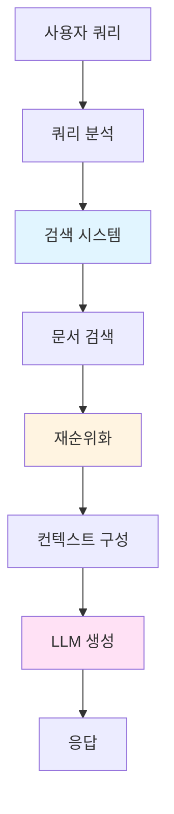
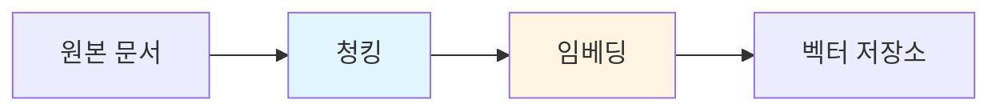
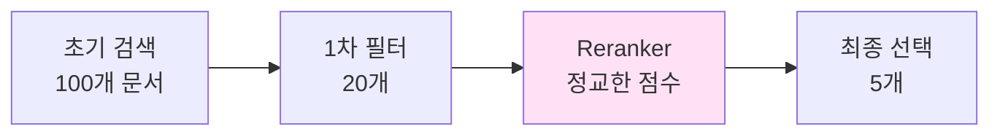
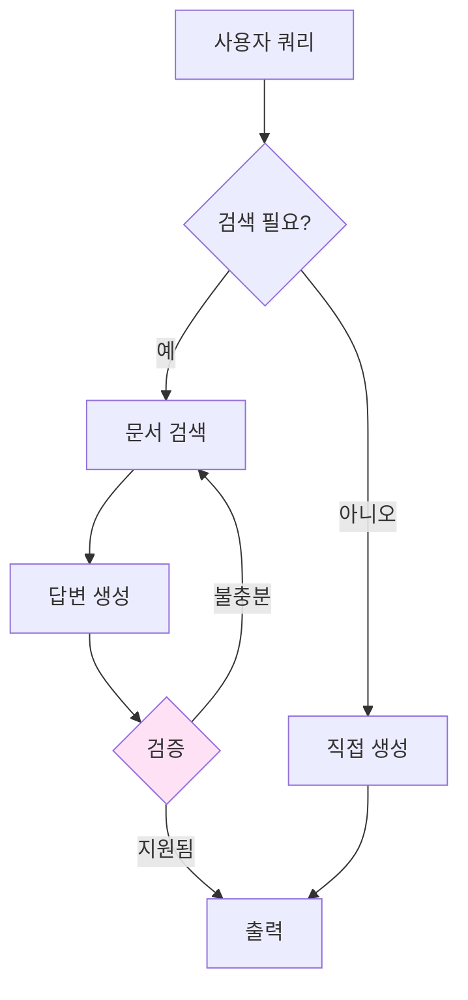
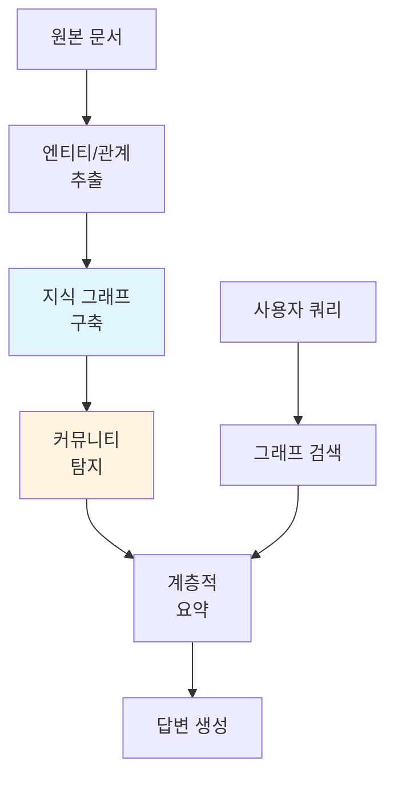
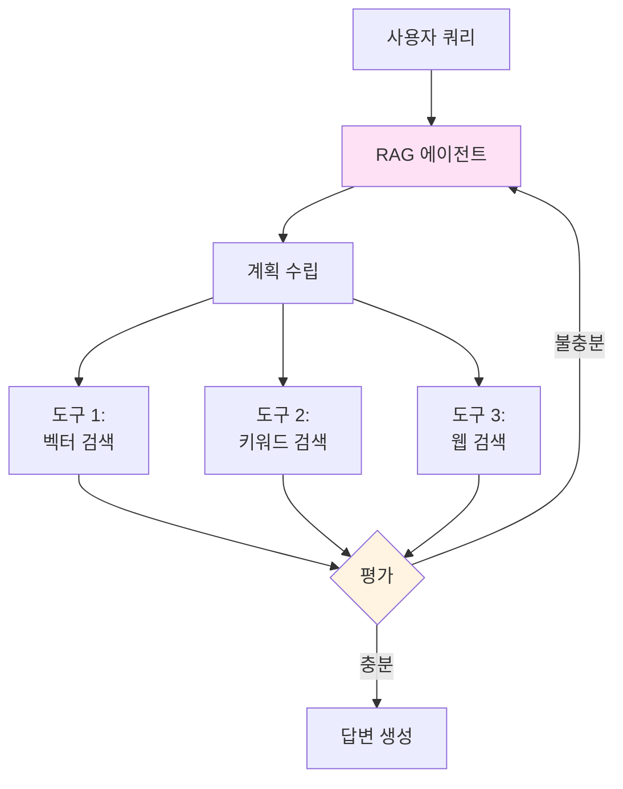
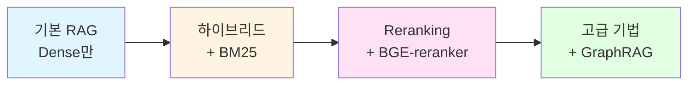
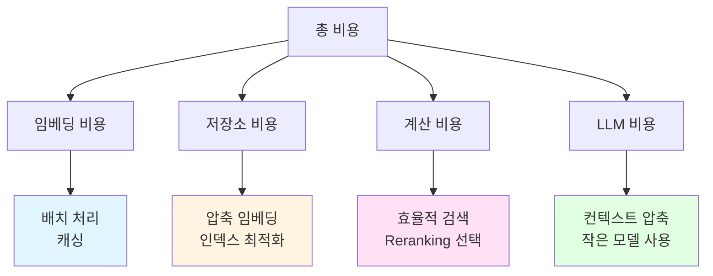

> <strong>시리즈: DeNA LLM 스터디</strong> (4/5)
>
> 1. [Part 1: LLM 기초와 2025년 AI 현황](/ko/blog/ko/dena-llm-study-part1-fundamentals)
> 2. [Part 2: 구조화 출력과 멀티 LLM 파이프라인](/ko/blog/ko/dena-llm-study-part2-structured-output)
> 3. [Part 3: 모델 학습 방법론](/ko/blog/ko/dena-llm-study-part3-model-training)
> 4. <strong>[Part 4: RAG 아키텍처와 최신 트렌드](/ko/blog/ko/dena-llm-study-part4-rag)</strong> ← 현재 글
> 5. [Part 5: 에이전트 설계와 멀티 에이전트 오케스트레이션](/ko/blog/ko/dena-llm-study-part5-agent-design)

## 개요

DeNA의 LLM 스터디 시리즈 Part 4에서는 RAG(Retrieval-Augmented Generation)의 핵심 개념부터 최신 트렌드까지 다룹니다. 단순한 프롬프트 엔지니어링을 넘어 외부 지식을 효과적으로 활용하는 시스템 설계 방법을 학습했습니다.

이번 글에서는 DeNA 스터디 자료를 기반으로 RAG의 전체 아키텍처, 하이브리드 검색 전략, Reranking 기법, 그리고 GraphRAG와 Agentic RAG 같은 최신 발전 방향을 정리합니다.

## 컨텍스트 엔지니어링: LLM은 인터페이스

DeNA 스터디에서 강조하는 핵심 개념은 <strong>"LLM은 인터페이스일 뿐, 검색 시스템이 진짜 핵심"</strong>이라는 점입니다.

### 프롬프트 엔지니어링을 넘어서

전통적인 프롬프트 엔지니어링은 LLM에게 더 나은 지시를 내리는 데 집중했습니다. 하지만 RAG 시스템에서는:

- <strong>검색 품질</strong>이 응답 품질을 결정합니다
- <strong>컨텍스트 선택</strong>이 환각(hallucination)을 방지합니다
- <strong>시스템 설계</strong>가 성능과 비용을 최적화합니다



### RAG의 핵심 가치

1. <strong>최신 정보 활용</strong>: 모델 학습 이후의 정보도 사용 가능
2. <strong>도메인 지식 통합</strong>: 기업 내부 문서, 전문 지식 활용
3. <strong>환각 방지</strong>: 근거 있는 응답 생성
4. <strong>추적 가능성</strong>: 출처 제공으로 신뢰성 확보

## RAG 아키텍처 전체 구성

DeNA 스터디에서는 RAG를 다음 5단계로 구분합니다.

### 1. 문서 인덱싱 (Indexing)



<strong>청킹 전략</strong>:

- <strong>고정 크기</strong>: 512 토큰 단위로 분할
- <strong>의미 기반</strong>: 문단, 섹션 단위로 분할
- <strong>오버랩</strong>: 50〜100 토큰 중첩으로 컨텍스트 유지

<strong>임베딩 선택</strong>:

- <strong>OpenAI text-embedding-3</strong>: 범용성, API 편의성
- <strong>Cohere Embed v3</strong>: 다국어 지원, 압축 임베딩
- <strong>BGE 시리즈</strong>: 오픈소스, 커스터마이징 가능

### 2. 쿼리 확장 (Query Expansion)

사용자의 짧은 질문을 더 풍부하게 만드는 기법:

```python
# HyDE (Hypothetical Document Embeddings)
query = "RAG 성능 개선 방법은?"

# 1. LLM이 가상 답변 생성
hypothetical_answer = llm.generate(f"""
다음 질문에 대한 상세한 답변을 작성하세요:
{query}
""")

# 2. 가상 답변을 임베딩하여 검색
embedding = embed_model.encode(hypothetical_answer)
results = vector_store.search(embedding, top_k=5)
```

<strong>쿼리 확장 기법</strong>:

- <strong>HyDE</strong>: 가상 문서 생성 후 검색
- <strong>Multi-Query</strong>: 여러 관점의 쿼리 생성
- <strong>Query Decomposition</strong>: 복잡한 쿼리를 하위 쿼리로 분해

### 3. 하이브리드 검색 (Hybrid Search)

DeNA 스터디의 핵심 강조점: <strong>BM25 + Dense + Sparse 조합</strong>

```python
# 하이브리드 검색 구현 예시
def hybrid_search(query, alpha=0.5):
    # 1. BM25 (키워드 기반)
    bm25_scores = bm25_retriever.search(query, top_k=20)

    # 2. Dense Vector (의미 기반)
    dense_embedding = dense_model.encode(query)
    dense_scores = vector_store.search(dense_embedding, top_k=20)

    # 3. Sparse Vector (중요 토큰 기반)
    sparse_embedding = splade_model.encode(query)
    sparse_scores = sparse_store.search(sparse_embedding, top_k=20)

    # 4. 점수 결합 (가중 평균)
    combined_scores = (
        alpha * bm25_scores +
        (1 - alpha) * 0.7 * dense_scores +
        (1 - alpha) * 0.3 * sparse_scores
    )

    return combined_scores.top_k(10)
```

<strong>각 방법의 특징</strong>:

| 방법                    | 강점                     | 약점             |
| ----------------------- | ------------------------ | ---------------- |
| <strong>BM25</strong>   | 정확한 키워드 매칭, 빠름 | 의미 이해 부족   |
| <strong>Dense</strong>  | 의미적 유사도 포착       | 키워드 누락 가능 |
| <strong>Sparse</strong> | 중요 토큰 강조           | 계산 비용 높음   |

### 4. Reranking (재순위화)

검색된 문서를 더 정교하게 재정렬하는 단계:



<strong>Reranking 모델 선택</strong>:

1. <strong>ColBERT (Late Interaction)</strong>
   - 쿼리와 문서의 토큰별 유사도 계산
   - 속도와 정확도 균형
   - 장점: 빠르고 효과적

2. <strong>Cross-Encoder</strong>
   - 쿼리와 문서를 함께 인코딩
   - 가장 높은 정확도
   - 단점: 느림 (모든 쌍 계산 필요)

3. <strong>BGE-reranker</strong>
   - 오픈소스 Cross-Encoder
   - 다국어 지원
   - 실무에서 널리 사용

```python
# BGE-reranker 사용 예시
from FlagEmbedding import FlagReranker

reranker = FlagReranker('BAAI/bge-reranker-large', use_fp16=True)

# 검색된 문서 재순위화
pairs = [[query, doc.text] for doc in retrieved_docs]
scores = reranker.compute_score(pairs)

# 점수 기준 정렬
reranked_docs = sorted(
    zip(retrieved_docs, scores),
    key=lambda x: x[1],
    reverse=True
)[:5]
```

### 5. 생성 (Generation)

최종적으로 선택된 컨텍스트로 LLM 응답 생성:

```python
def generate_with_citations(query, top_docs):
    # 컨텍스트 구성
    context = "\n\n".join([
        f"[{i+1}] {doc.text}\n출처: {doc.source}"
        for i, doc in enumerate(top_docs)
    ])

    prompt = f"""
다음 컨텍스트를 바탕으로 질문에 답변하세요.
반드시 출처 번호를 명시하세요 (예: [1], [2]).

컨텍스트:
{context}

질문: {query}

답변:"""

    response = llm.generate(prompt)
    return response
```

## Embedding 모델 비교

DeNA 스터디에서 다룬 주요 임베딩 모델:

### OpenAI text-embedding-3

```python
from openai import OpenAI

client = OpenAI()

# Small 모델 (저렴, 빠름)
response = client.embeddings.create(
    model="text-embedding-3-small",
    input="Your text here"
)
embedding_small = response.data[0].embedding  # 1536 차원

# Large 모델 (고품질)
response = client.embeddings.create(
    model="text-embedding-3-large",
    input="Your text here",
    dimensions=3072  # 최대 3072 차원
)
embedding_large = response.data[0].embedding
```

<strong>특징</strong>:

- API 기반으로 사용 간편
- 범용성 높음
- 비용 효율적 (small: $0.02/1M 토큰)

### Cohere Embed v3

```python
import cohere

co = cohere.Client('your-api-key')

# 다국어 임베딩
response = co.embed(
    texts=["한국어 텍스트", "English text", "日本語テキスト"],
    model="embed-multilingual-v3.0",
    input_type="search_query"  # or "search_document"
)

embeddings = response.embeddings  # 1024 차원
```

<strong>특징</strong>:

- 100개 이상 언어 지원
- 입력 타입별 최적화 (query vs document)
- 압축 임베딩 지원 (128〜1024 차원)

### BGE (Beijing Academy of AI) 시리즈

```python
from FlagEmbedding import FlagModel

# BGE-M3: 다기능 임베딩
model = FlagModel('BAAI/bge-m3', use_fp16=True)

# Dense 임베딩
dense_vecs = model.encode(
    ["Query text"],
    return_dense=True,
    return_sparse=False,
    return_colbert_vecs=False
)

# Sparse 임베딩 (SPLADE-like)
sparse_vecs = model.encode(
    ["Query text"],
    return_dense=False,
    return_sparse=True,
    return_colbert_vecs=False
)

# ColBERT 스타일 multi-vector
colbert_vecs = model.encode(
    ["Query text"],
    return_dense=False,
    return_sparse=False,
    return_colbert_vecs=True
)
```

<strong>특징</strong>:

- 오픈소스 (상업적 사용 가능)
- 3가지 검색 방법 모두 지원 (Dense, Sparse, Multi-vector)
- 긴 컨텍스트 지원 (최대 8192 토큰)
- 100개 이상 언어 지원

## Grounding: 환각 방지 전략

RAG의 가장 중요한 목표 중 하나는 <strong>환각(hallucination) 방지</strong>입니다.

### 1. 인용 강제 (Citation Enforcement)

```python
system_prompt = """
당신은 제공된 컨텍스트만을 사용하여 답변하는 AI입니다.
반드시 다음 규칙을 따르세요:

1. 모든 주장에 출처 번호 표시 [1], [2] 등
2. 컨텍스트에 없는 정보는 "제공된 정보에 없습니다" 명시
3. 확실하지 않으면 "불확실합니다" 표현
4. 추측하지 말고 사실만 전달
"""
```

### 2. 불확실성 표현

```python
def generate_with_confidence(query, context):
    prompt = f"""
컨텍스트: {context}

질문: {query}

다음 형식으로 답변하세요:
- 답변: [귀하의 답변]
- 확신도: [높음/보통/낮음]
- 근거: [컨텍스트의 해당 부분 인용]
"""
    return llm.generate(prompt)
```

### 3. Self-RAG: 자가 검증

Self-RAG는 LLM이 스스로 검색 필요성을 판단하고 응답을 검증합니다.



```python
def self_rag(query):
    # 1. 검색 필요성 판단
    need_retrieval = llm.classify(
        f"다음 질문에 답하려면 외부 정보가 필요한가요? {query}"
    )

    if need_retrieval:
        # 2. 문서 검색
        docs = retriever.search(query)

        # 3. 답변 생성
        response = llm.generate_with_context(query, docs)

        # 4. 답변 검증
        is_supported = llm.verify(
            f"다음 답변이 컨텍스트로 충분히 뒷받침되는가? 답변: {response}"
        )

        if not is_supported:
            # 재검색 또는 더 많은 문서 필요
            return self_rag(query)  # 재귀 호출
    else:
        response = llm.generate(query)

    return response
```

## 최신 RAG 트렌드

DeNA 스터디에서 다룬 최신 RAG 발전 방향:

### 1. GraphRAG

Microsoft가 2024년에 공개한 지식 그래프 기반 RAG:



<strong>GraphRAG의 장점</strong>:

- <strong>관계 기반 추론</strong>: 엔티티 간 연결 활용
- <strong>다단계 추론</strong>: "A의 B를 아는 C"같은 복잡한 질문 처리
- <strong>전체 맥락 파악</strong>: 문서 간 연결 이해

<strong>사용 사례</strong>:

- 기업 조직도 기반 질의응답
- 법률 문서의 판례 참조
- 학술 논문의 인용 관계 분석

### 2. Agentic RAG

최근 "에이전트의 시대"를 맞아 등장한 자율적 RAG:



<strong>전통적 RAG vs Agentic RAG</strong>:

| 전통적 RAG           | Agentic RAG         |
| -------------------- | ------------------- |
| 단일 검색 단계       | 반복적 검색         |
| 고정된 파이프라인    | 동적 도구 선택      |
| 사용자 쿼리에만 반응 | 계획 수립 및 실행   |
| 검색 실패 시 종료    | 재시도 및 전략 변경 |

<strong>구현 예시</strong> (LangGraph):

```python
from langgraph.graph import StateGraph, END
from langchain.tools import Tool

# RAG 에이전트 정의
class RAGAgent:
    def __init__(self):
        self.tools = [
            Tool(name="vector_search", func=self.vector_search),
            Tool(name="keyword_search", func=self.keyword_search),
            Tool(name="web_search", func=self.web_search)
        ]

    def plan(self, query):
        # LLM이 검색 전략 결정
        plan = self.llm.generate(f"""
        다음 질문에 답하기 위한 검색 전략을 수립하세요:
        {query}

        사용 가능한 도구: {[tool.name for tool in self.tools]}
        """)
        return plan

    def execute(self, query):
        max_iterations = 3
        context = []

        for i in range(max_iterations):
            # 계획 수립
            plan = self.plan(query)

            # 도구 실행
            results = self.execute_tools(plan)
            context.extend(results)

            # 충분한 정보인지 평가
            is_sufficient = self.evaluate(query, context)

            if is_sufficient:
                break

        # 최종 답변 생성
        return self.generate_response(query, context)
```

### 3. Long RAG

긴 컨텍스트 처리를 위한 RAG 변형:

<strong>문제</strong>: 기존 RAG는 제한된 컨텍스트 윈도우(4K〜8K 토큰) 내에서 작동

<strong>해결책</strong>:

1. <strong>계층적 검색</strong>: 챕터 → 섹션 → 문단 순으로 좁혀가기
2. <strong>스트리밍 컨텍스트</strong>: 필요한 부분만 순차 로드
3. <strong>요약 기반 검색</strong>: 긴 문서는 요약으로 먼저 검색

```python
def long_rag(query, long_documents):
    # 1단계: 문서 요약으로 후보 선택
    summaries = [doc.summary for doc in long_documents]
    candidate_docs = vector_search(query, summaries, top_k=3)

    # 2단계: 선택된 문서 내 세부 검색
    detailed_chunks = []
    for doc in candidate_docs:
        chunks = chunk_document(doc, chunk_size=512)
        relevant_chunks = vector_search(query, chunks, top_k=5)
        detailed_chunks.extend(relevant_chunks)

    # 3단계: 최종 컨텍스트로 답변 생성
    return generate_response(query, detailed_chunks)
```

### 4. 다중모달 RAG (ColPali)

텍스트뿐만 아니라 이미지, 표, 다이어그램을 함께 검색:

<strong>ColPali</strong>: 문서 페이지 전체를 이미지로 임베딩

```python
from colpali import ColPali

# 문서 페이지 이미지 임베딩
model = ColPali()
page_embeddings = model.encode_images([
    "doc1_page1.png",
    "doc1_page2.png",
    "doc2_page1.png"
])

# 텍스트 쿼리로 이미지 검색
query_embedding = model.encode_text("재무제표에서 순이익은?")
similar_pages = vector_search(query_embedding, page_embeddings)

# 검색된 페이지 이미지를 Vision LLM에 전달
response = vision_llm.generate_with_image(
    query="재무제표에서 순이익은?",
    images=similar_pages
)
```

<strong>다중모달 RAG의 장점</strong>:

- <strong>레이아웃 보존</strong>: PDF의 표, 차트 원본 유지
- <strong>OCR 불필요</strong>: 이미지 그대로 처리
- <strong>시각적 컨텍스트</strong>: 다이어그램, 그래프 활용

## 실전 적용 시사점

DeNA 스터디를 통해 얻은 실무 적용 인사이트:

### 1. 단계적 최적화 전략



1. <strong>1단계: 기본 RAG</strong>
   - Dense 벡터 검색만 사용
   - 빠른 프로토타입 구축
   - 베이스라인 성능 측정

2. <strong>2단계: 하이브리드 검색</strong>
   - BM25 추가로 키워드 매칭 개선
   - 10〜20% 성능 향상 기대

3. <strong>3단계: Reranking</strong>
   - BGE-reranker로 정밀도 향상
   - 추가 15〜25% 성능 개선

4. <strong>4단계: 고급 기법</strong>
   - 도메인에 따라 GraphRAG, Agentic RAG 적용
   - 복잡한 질문 처리 능력 강화

### 2. 평가 메트릭 설정

RAG 시스템의 성능을 측정하는 주요 지표:

```python
# 검색 품질 지표
def evaluate_retrieval(queries, ground_truth):
    metrics = {
        'recall@k': [],  # 정답 문서 k개 내 포함률
        'mrr': [],       # Mean Reciprocal Rank
        'ndcg': []       # Normalized Discounted Cumulative Gain
    }

    for query, truth in zip(queries, ground_truth):
        retrieved = retriever.search(query, top_k=10)

        # Recall@10
        recall = len(set(retrieved) & set(truth)) / len(truth)
        metrics['recall@k'].append(recall)

        # MRR
        for i, doc in enumerate(retrieved):
            if doc in truth:
                metrics['mrr'].append(1 / (i + 1))
                break

    return {k: sum(v) / len(v) for k, v in metrics.items()}

# 생성 품질 지표
def evaluate_generation(responses, references):
    from ragas import evaluate

    return evaluate(
        responses=responses,
        references=references,
        metrics=['answer_relevancy', 'faithfulness', 'context_precision']
    )
```

<strong>목표 수치</strong> (DeNA 스터디 권장):

- <strong>Recall@10</strong>: 0.8 이상 (정답 문서의 80% 이상 검색)
- <strong>MRR</strong>: 0.6 이상 (평균적으로 상위 2개 내 정답)
- <strong>Answer Relevancy</strong>: 0.9 이상
- <strong>Faithfulness</strong>: 0.95 이상 (환각 최소화)

### 3. 비용 최적화

RAG 시스템의 비용 구조:



<strong>비용 절감 전략</strong>:

1. <strong>임베딩 최적화</strong>

   ```python
   # 배치 처리로 API 호출 줄이기
   batch_size = 100
   embeddings = []
   for i in range(0, len(texts), batch_size):
       batch = texts[i:i+batch_size]
       embeddings.extend(embed_model.encode(batch))

   # 임베딩 캐싱
   import pickle
   with open('embeddings_cache.pkl', 'wb') as f:
       pickle.dump(embeddings, f)
   ```

2. <strong>컨텍스트 압축</strong>

   ```python
   def compress_context(docs, max_tokens=2000):
       # 중요 문장만 추출
       sentences = extract_sentences(docs)
       scores = compute_relevance(sentences, query)

       # 토큰 제한 내에서 가장 관련성 높은 문장 선택
       selected = []
       total_tokens = 0
       for sent, score in sorted(zip(sentences, scores),
                                  key=lambda x: x[1],
                                  reverse=True):
           sent_tokens = count_tokens(sent)
           if total_tokens + sent_tokens <= max_tokens:
               selected.append(sent)
               total_tokens += sent_tokens

       return " ".join(selected)
   ```

3. <strong>캐싱 전략</strong>

   ```python
   from functools import lru_cache

   @lru_cache(maxsize=1000)
   def cached_retrieval(query_hash):
       return retriever.search(query_hash)

   # 사용
   query_hash = hash(query)
   results = cached_retrieval(query_hash)
   ```

### 4. 보안 및 프라이버시

RAG 시스템의 보안 고려사항:

<strong>데이터 격리</strong>:

```python
def secure_rag(query, user_id):
    # 사용자별 문서 접근 권한 확인
    allowed_docs = get_user_documents(user_id)

    # 필터링된 벡터 저장소 검색
    results = vector_store.search(
        query,
        filter={"doc_id": {"$in": allowed_docs}}
    )

    return results
```

<strong>민감 정보 필터링</strong>:

```python
import re

def sanitize_response(response):
    # 개인정보 패턴 제거
    patterns = {
        'email': r'\b[A-Za-z0-9._%+-]+@[A-Za-z0-9.-]+\.[A-Z|a-z]{2,}\b',
        'phone': r'\b\d{3}[-.]?\d{3,4}[-.]?\d{4}\b',
        'ssn': r'\b\d{6}[-]?\d{7}\b'
    }

    for name, pattern in patterns.items():
        response = re.sub(pattern, f'[{name.upper()}_REDACTED]', response)

    return response
```

## 느낀 점과 다음 단계

DeNA의 LLM 스터디 Part 4를 통해 RAG가 단순한 "검색 후 생성"이 아니라, 정교한 시스템 설계가 필요한 엔지니어링 영역임을 깊이 이해하게 되었습니다.

### 핵심 인사이트

1. <strong>검색이 핵심</strong>: LLM은 인터페이스, 진짜 가치는 정확한 컨텍스트 검색
2. <strong>하이브리드 접근</strong>: Dense, Sparse, BM25를 조합해야 최고 성능
3. <strong>재순위화 필수</strong>: 초기 검색 결과를 정교하게 필터링
4. <strong>환각 방지</strong>: 인용, 검증, Self-RAG로 신뢰성 확보
5. <strong>진화하는 패러다임</strong>: GraphRAG, Agentic RAG로 계속 발전 중

### 실무 적용 계획

이번 학습을 바탕으로 다음과 같은 개선을 계획하고 있습니다:

1. <strong>하이브리드 검색 도입</strong>
   - 현재 Dense 벡터만 사용 → BM25 추가
   - BGE-M3 모델로 다기능 임베딩 적용

2. <strong>Reranking 파이프라인 구축</strong>
   - BGE-reranker-large 통합
   - 2단계 검색 (100개 → 20개 → 5개)

3. <strong>평가 체계 확립</strong>
   - Recall@10, MRR, NDCG 측정
   - A/B 테스트 프레임워크 구축

4. <strong>Agentic RAG 실험</strong>
   - LangGraph로 동적 검색 전략
   - 복잡한 다단계 질문 처리

### 다음 학습: Part 5 - 프로덕션 배포와 모니터링

DeNA 스터디 시리즈의 마지막 Part 5에서는:

- LLM 시스템의 프로덕션 배포 전략
- 성능 모니터링 및 로깅
- A/B 테스트와 지속적 개선
- 비용 최적화와 확장성

을 다룰 예정입니다.

## 참고 자료

### 논문 및 서베이

- [Retrieval-Augmented Generation for LLMs: A Survey](https://arxiv.org/abs/2312.10997) (2023)
- [RAG and Beyond: A Comprehensive Survey](https://arxiv.org/abs/2409.14924) (2024)
- [Self-RAG: Learning to Retrieve, Generate, and Critique](https://arxiv.org/abs/2310.11511) (2023)

### 오픈소스 프로젝트

- [FlagEmbedding (BGE 모델)](https://github.com/FlagOpen/FlagEmbedding)
- [LangChain RAG 튜토리얼](https://python.langchain.com/docs/tutorials/rag/)
- [LlamaIndex](https://github.com/run-llama/llama_index)

### 도구 및 플랫폼

- [Weaviate (하이브리드 검색)](https://weaviate.io/)
- [Qdrant (벡터 데이터베이스)](https://qdrant.tech/)
- [Pinecone (관리형 벡터 DB)](https://www.pinecone.io/)

### 추가 학습 자료

- [RAGFlow Blog: RAG in 2025](https://ragflow.io/blog/rag-at-the-crossroads-mid-2025-reflections-on-ai-evolution)
- [Advanced RAG Variants Explained](https://www.glukhov.org/post/2025/11/advanced-rag-variants-longrag-self-rag-graphrag/)
- [The Ultimate RAG Blueprint 2025/2026](https://langwatch.ai/blog/the-ultimate-rag-blueprint-everything-you-need-to-know-about-rag-in-2025-2026)

---

<strong>시리즈 계속</strong>: [Part 5: 프로덕션 배포와 모니터링](/ko/blog/ko/dena-llm-study-part5-agent-design) (예정)
