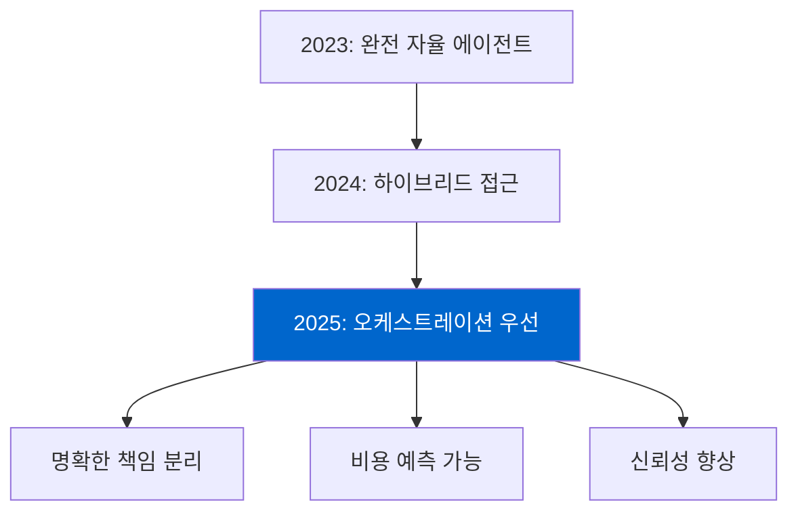
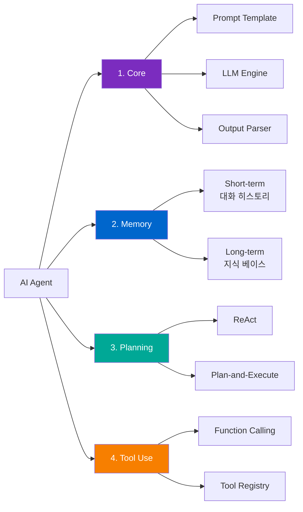
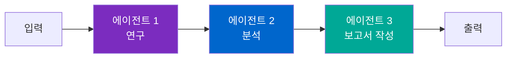
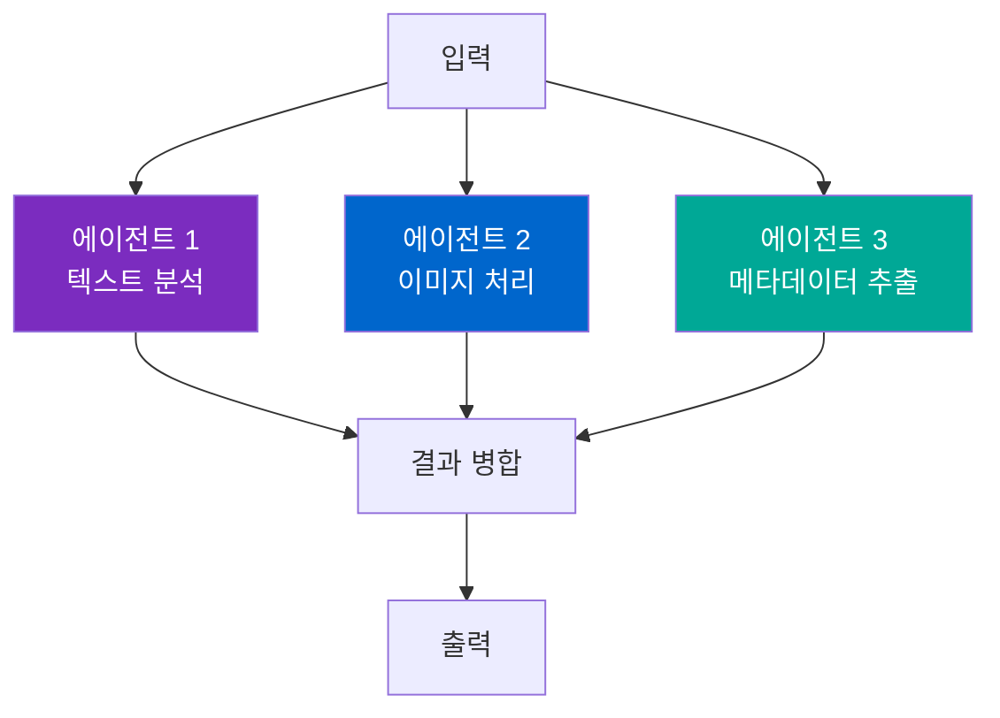
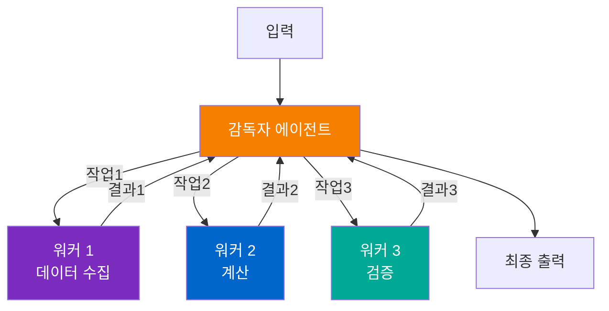
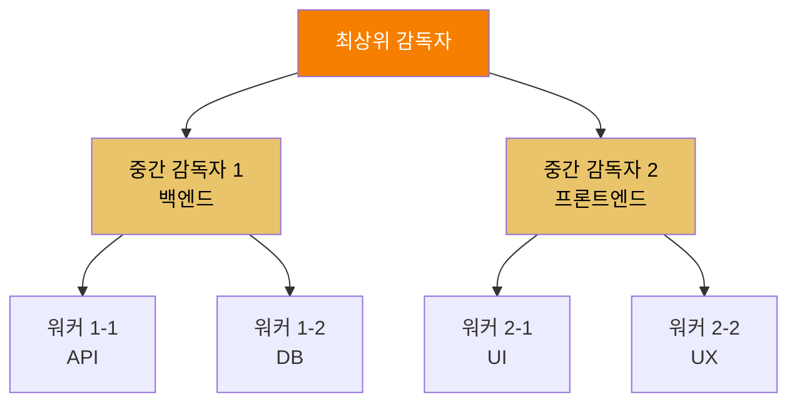
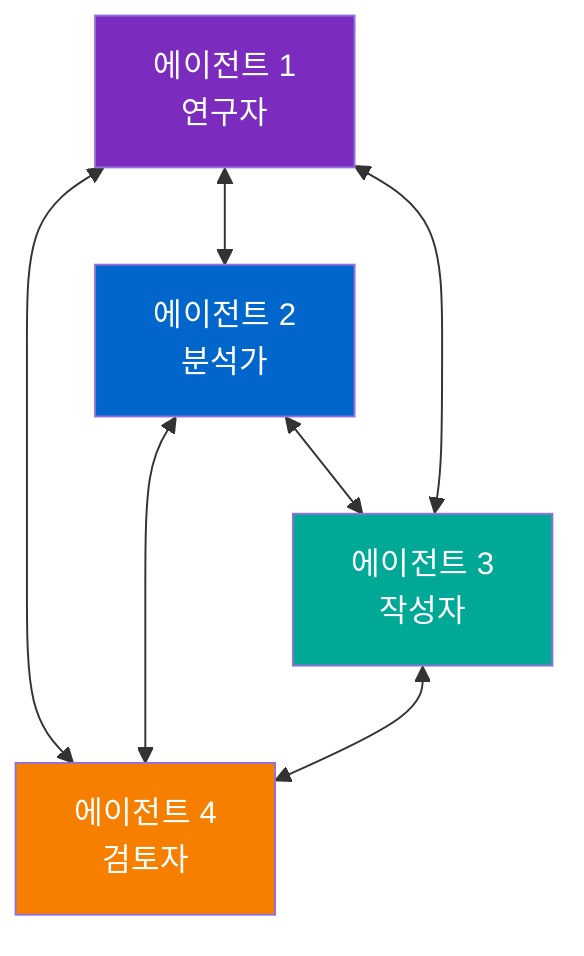
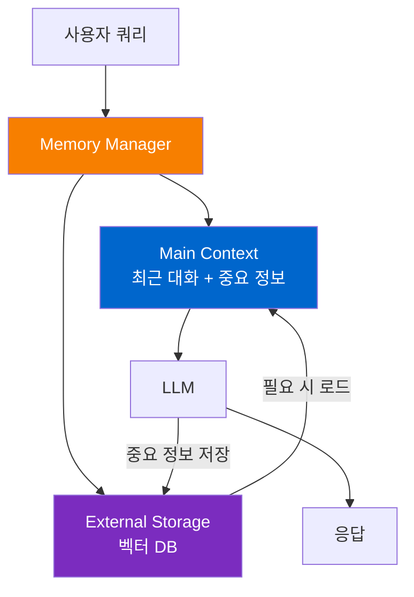
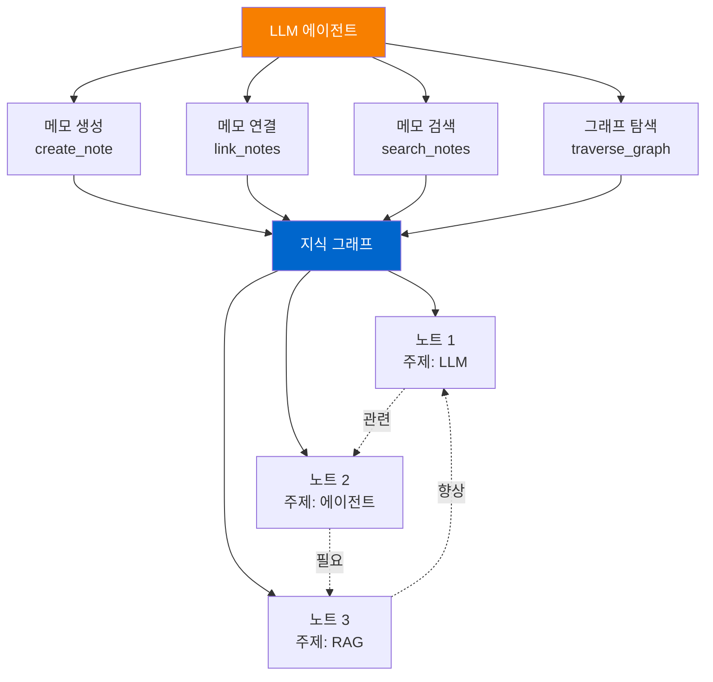
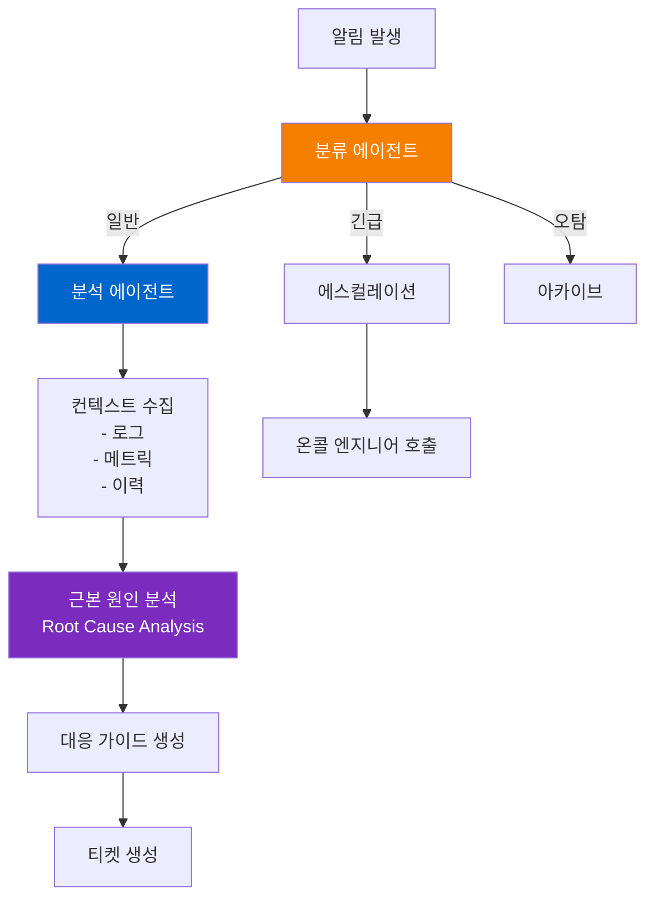

> <strong>시리즈: DeNA LLM 스터디</strong> (5/5 - 최종회)
>
> 1. [Part 1: LLM 기초와 2025년 AI 현황](/ko/blog/ko/dena-llm-study-part1-fundamentals)
> 2. [Part 2: 구조화 출력과 멀티 LLM 파이프라인](/ko/blog/ko/dena-llm-study-part2-structured-output)
> 3. [Part 3: 모델 학습 방법론](/ko/blog/ko/dena-llm-study-part3-model-training)
> 4. [Part 4: RAG 아키텍처와 최신 트렌드](/ko/blog/ko/dena-llm-study-part4-rag)
> 5. <strong>[Part 5: 에이전트 설계와 멀티 에이전트 오케스트레이션](/ko/blog/ko/dena-llm-study-part5-agent-design)</strong> ← 현재 글

## 개요

DeNA LLM 스터디 시리즈의 마지막 편입니다. 이번 Part 5에서는 LLM을 활용한 <strong>에이전트 설계</strong>와 <strong>멀티 에이전트 오케스트레이션</strong>을 다룹니다. 단순한 프롬프트 엔지니어링을 넘어 자율적으로 작동하는 에이전트 시스템을 구축하는 방법과 실무에서 고려해야 할 비용, 성능, 신뢰성 문제를 집중적으로 살펴봅니다.

### Part 5 주요 주제

1. <strong>n8n을 활용한 LLM 워크플로우</strong> - 노코드/로우코드 자동화 플랫폼으로 에이전트 구축
2. <strong>에이전트 설계 원칙</strong> - 핵심 컴포넌트와 Self-Healing 패턴
3. <strong>멀티 에이전트 오케스트레이션</strong> - 6가지 패턴과 프레임워크 비교 (LangGraph, AutoGen, CrewAI)
4. <strong>메모리 및 상태 관리</strong> - MemGPT, A-MEM (Zettelkasten 기반)
5. <strong>실무 사례</strong> - DeNA NOC Alert Agent
6. <strong>비용 및 성능 최적화</strong> - 시맨틱 캐싱, 배칭, SLM 활용

이 글에서는 DeNA의 공식 스터디 자료를 기반으로 최신 연구 결과와 실무 사례를 추가하여 종합적으로 정리했습니다.

## 1. n8n을 활용한 LLM 워크플로우

### n8n이란?

[n8n](https://n8n.io/)은 <strong>노코드/로우코드 워크플로우 자동화 플랫폼</strong>입니다. 2025년 기준으로 422개 이상의 통합을 지원하며, LLM 에이전트 구축에 특화된 기능을 제공합니다.

<strong>핵심 특징</strong>:

- 시각적 워크플로우 빌더
- LangChain, Ollama 등 주요 LLM 프레임워크 통합
- ReAct Agent 패턴 네이티브 지원
- Self-hosted 가능 (데이터 프라이버시 보장)

### ReAct Agent 구현

n8n에서 ReAct (Reasoning and Acting) 패턴을 구현하는 예제입니다:

```typescript
// n8n ReAct Agent 워크플로우 예제
{
  "nodes": [
    {
      "type": "n8n-nodes-langchain.agent",
      "name": "ReAct Agent",
      "parameters": {
        "agentType": "react",
        "systemMessage": "당신은 데이터 분석 전문가입니다. 사용자 질문을 분석하고 적절한 도구를 선택하여 답변하세요.",
        "tools": ["webSearch", "calculator", "database"]
      }
    }
  ]
}
```

<strong>ReAct 패턴의 장점</strong>:

- <strong>추론 과정 추적</strong>: "왜 이 도구를 선택했는가" 명시적 표현
- <strong>동적 도구 선택</strong>: 상황에 따라 적절한 도구 호출
- <strong>오류 복구</strong>: 도구 실패 시 대안 시도

### Ollama 통합 사례

n8n은 로컬 LLM 실행 도구인 [Ollama](https://ollama.com/)와의 통합을 지원합니다:

```yaml
# Ollama + n8n 통합 예제
workflow:
  - trigger: webhook
  - ollama_llm:
      model: "llama3.2"
      prompt: "{{$json.query}}"
      temperature: 0.7
  - process_response:
      parse: true
      format: "json"
```

<strong>로컬 LLM의 이점</strong>:

- 데이터 프라이버시 (외부 API 불필요)
- 비용 절감 (API 호출료 없음)
- 레이턴시 감소 (네트워크 지연 제거)

### 2025 트렌드: 오케스트레이션 > 완전 자율

DeNA 스터디 자료와 최신 연구에 따르면, 2025년 에이전트 시스템의 핵심 트렌드는 <strong>"완전 자율"에서 "오케스트레이션"으로의 전환</strong>입니다.



<strong>이유</strong>:

1. <strong>비용 폭발</strong>: 자율 에이전트의 무제한 API 호출
2. <strong>예측 불가능성</strong>: 에이전트 행동 통제 어려움
3. <strong>신뢰성 부족</strong>: 프로덕션 환경에서 불안정

n8n 같은 워크플로우 도구가 각광받는 이유는 바로 <strong>명시적 오케스트레이션</strong>을 제공하기 때문입니다.

## 2. 에이전트 설계 원칙

### 핵심 컴포넌트

LLM 에이전트는 4개의 핵심 컴포넌트로 구성됩니다:



#### 1. Core (코어)

에이전트의 중심 엔진입니다.

<strong>구성 요소</strong>:

- <strong>Prompt Template</strong>: 시스템 메시지, 페르소나 정의
- <strong>LLM Engine</strong>: Claude, GPT-4, Gemini 등
- <strong>Output Parser</strong>: LLM 출력을 구조화된 데이터로 변환

<strong>예제</strong>:

````typescript
// Core 구현 예제
const agent = {
  prompt: `당신은 전문 데이터 분석가입니다.

사용자 질문: {{query}}
현재 컨텍스트: {{context}}

다음 도구를 사용할 수 있습니다:
- search: 웹 검색
- query_db: 데이터베이스 조회
- calculate: 계산

답변 형식:
```json
{
  "reasoning": "추론 과정",
  "action": "도구명",
  "action_input": "입력값"
}
```
`,
  llm: new Claude({ model: "claude-sonnet-4-20250514" }),
  parser: new JSONParser()
};
````

#### 2. Memory (메모리)

에이전트의 기억 시스템입니다.

<strong>Short-term Memory</strong>:

- 현재 대화 세션의 히스토리
- 일반적으로 마지막 N개 메시지 (N=5〜10)
- Context Window에 직접 포함

<strong>Long-term Memory</strong>:

- 영구 저장 지식 베이스
- Vector Database (Pinecone, Weaviate 등)
- RAG 패턴으로 필요 시 검색

#### 3. Planning (계획)

에이전트가 복잡한 작업을 수행하는 전략입니다.

<strong>ReAct 패턴</strong>:

```
Thought: 사용자가 회사 매출 데이터를 요청했다.
Action: query_db
Action Input: SELECT revenue FROM sales WHERE year=2024
Observation: [결과: $1.5M]
Thought: 작년과 비교가 필요하다.
Action: query_db
Action Input: SELECT revenue FROM sales WHERE year=2023
Observation: [결과: $1.2M]
Thought: 증가율을 계산해야 한다.
Action: calculate
Action Input: ((1.5 - 1.2) / 1.2) * 100
Observation: 25%
Final Answer: 2024년 매출은 $1.5M으로, 전년 대비 25% 증가했습니다.
```

<strong>Plan-and-Execute 패턴</strong>:

```
Plan:
1. 2024년 매출 조회
2. 2023년 매출 조회
3. 증가율 계산
4. 결과 종합

Execute:
[각 단계 순차 실행]
```

#### 4. Tool Use (도구 사용)

LLM이 외부 도구와 상호작용하는 메커니즘입니다.

<strong>Function Calling 예제</strong>:

```typescript
// Function Calling 정의
const tools = [
  {
    name: "get_weather",
    description: "특정 도시의 현재 날씨를 조회합니다.",
    parameters: {
      type: "object",
      properties: {
        city: { type: "string", description: "도시명" },
        unit: { type: "string", enum: ["celsius", "fahrenheit"] },
      },
      required: ["city"],
    },
  },
];

// LLM 호출
const response = await claude.messages.create({
  model: "claude-sonnet-4-20250514",
  tools: tools,
  messages: [{ role: "user", content: "서울 날씨 알려줘" }],
});

// Tool Use 응답 처리
if (response.stop_reason === "tool_use") {
  const toolUse = response.content.find((c) => c.type === "tool_use");
  const result = await executeFunction(toolUse.name, toolUse.input);
  // 결과를 LLM에 다시 전달
}
```

### 함수 호출 신뢰성 문제

DeNA 스터디 자료에서 지적한 중요한 문제입니다: <strong>LLM의 함수 호출은 100% 신뢰할 수 없습니다</strong>.

<strong>문제 사례</strong>:

1. <strong>잘못된 파라미터</strong>: 필수 필드 누락, 타입 불일치
2. <strong>환각(Hallucination)</strong>: 존재하지 않는 도구 호출
3. <strong>무한 루프</strong>: 같은 도구 반복 호출

<strong>해결 방법</strong>:

```typescript
// 함수 호출 검증 레이어
class ToolValidator {
  validate(toolUse: ToolUse): ValidationResult {
    // 1. 도구 존재 여부 확인
    if (!this.toolRegistry.has(toolUse.name)) {
      return { valid: false, error: "Unknown tool" };
    }

    // 2. 파라미터 스키마 검증
    const schema = this.toolRegistry.get(toolUse.name).schema;
    const valid = this.validateSchema(toolUse.input, schema);
    if (!valid) {
      return { valid: false, error: "Invalid parameters" };
    }

    // 3. 호출 빈도 체크 (무한 루프 방지)
    if (this.callCount[toolUse.name] > 5) {
      return { valid: false, error: "Too many calls" };
    }

    return { valid: true };
  }
}
```

### Self-Healing 패턴

에이전트가 오류를 자동 복구하는 메커니즘입니다.

<strong>구현 예제</strong>:

```typescript
class SelfHealingAgent {
  async execute(task: Task): Promise<Result> {
    const maxRetries = 3;
    let attempt = 0;

    while (attempt < maxRetries) {
      try {
        const result = await this.runTask(task);
        return result;
      } catch (error) {
        attempt++;

        // 오류 분석
        const analysis = await this.analyzeError(error);

        // 복구 전략 선택
        if (analysis.recoverable) {
          task = await this.adjustTask(task, analysis);
          console.log(`Retry ${attempt}: ${analysis.suggestion}`);
        } else {
          throw new UnrecoverableError(error);
        }
      }
    }

    throw new Error("Max retries exceeded");
  }

  async analyzeError(error: Error): Promise<ErrorAnalysis> {
    // LLM에게 오류 분석 요청
    const prompt = `다음 오류를 분석하고 복구 방법을 제안하세요:

오류: ${error.message}
스택: ${error.stack}

복구 가능한가요? 어떻게 해결할 수 있을까요?`;

    const response = await this.llm.generate(prompt);
    return this.parseAnalysis(response);
  }
}
```

<strong>Self-Healing의 이점</strong>:

- <strong>견고성 향상</strong>: 일시적 오류 자동 복구
- <strong>사용자 경험 개선</strong>: 수동 개입 불필요
- <strong>프로덕션 안정성</strong>: 예상치 못한 상황 대응

## 3. 멀티 에이전트 오케스트레이션

### 6가지 오케스트레이션 패턴

복잡한 작업을 여러 에이전트로 분산 처리하는 패턴입니다.

#### 1. Sequential (순차)

한 에이전트의 출력이 다음 에이전트의 입력이 되는 선형 구조입니다.



<strong>사용 사례</strong>:

- 블로그 포스트 작성: 연구 → 초안 → 편집 → 발행
- 데이터 파이프라인: 수집 → 정제 → 분석 → 시각화

<strong>장점</strong>:

- 구현 단순
- 디버깅 용이
- 비용 예측 가능

<strong>단점</strong>:

- 병목 지점 발생
- 전체 처리 시간 = 각 단계 시간의 합

#### 2. Parallel (병렬)

여러 에이전트가 동시에 독립적으로 작업하는 구조입니다.



<strong>사용 사례</strong>:

- 콘텐츠 검수: 품질 검사 + 법률 검토 + 사실 확인 동시 수행
- 멀티모달 분석: 텍스트 + 이미지 + 오디오 병렬 처리

<strong>장점</strong>:

- 처리 속도 향상 (최대 N배, N=에이전트 수)
- 독립적 실패 격리

<strong>단점</strong>:

- 비용 증가 (동시 API 호출)
- 결과 병합 복잡성

#### 3. Supervisor (감독자)

중앙 감독자가 작업을 분배하고 결과를 통합하는 구조입니다.



<strong>사용 사례</strong>:

- 복잡한 리서치: 감독자가 하위 주제를 여러 워커에 분배
- 코드 생성: 감독자가 모듈별 구현을 워커에 할당

<strong>장점</strong>:

- 동적 작업 분배
- 로드 밸런싱 가능
- 중앙 집중식 모니터링

<strong>단점</strong>:

- 감독자가 단일 실패 지점(SPOF)
- 감독자의 의사결정 품질에 의존

#### 4. Hierarchical (계층적)

여러 단계의 감독자-워커 관계가 트리 구조를 이루는 방식입니다.



<strong>사용 사례</strong>:

- 대규모 프로젝트 관리: PM → 팀 리더 → 개발자
- 복잡한 시스템 설계: 아키텍트 → 모듈 설계자 → 구현자

<strong>장점</strong>:

- 매우 복잡한 작업 처리 가능
- 명확한 책임 분리

<strong>단점</strong>:

- 높은 구현 복잡도
- 오버헤드 증가

#### 5. Network (네트워크)

에이전트들이 P2P 방식으로 자유롭게 통신하는 구조입니다.



<strong>사용 사례</strong>:

- 창의적 협업: 아이디어 브레인스토밍
- 민주적 의사결정: 투표 기반 합의

<strong>장점</strong>:

- 높은 유연성
- 창발적 행동 가능

<strong>단점</strong>:

- 예측 불가능
- 디버깅 매우 어려움
- 무한 대화 루프 위험

#### 6. Custom (맞춤형)

특정 문제에 최적화된 독자적 패턴입니다.

<strong>예제: State Machine 기반</strong>

```typescript
// 유한 상태 기계(FSM) 기반 에이전트 오케스트레이션
const workflow = {
  initial: "research",
  states: {
    research: {
      agent: "researcher",
      on: {
        COMPLETE: "draft",
        ERROR: "error_handler",
      },
    },
    draft: {
      agent: "writer",
      on: {
        COMPLETE: "review",
        NEED_MORE_INFO: "research",
      },
    },
    review: {
      agent: "editor",
      on: {
        APPROVED: "publish",
        REVISE: "draft",
      },
    },
    publish: {
      agent: "publisher",
      on: {
        COMPLETE: "done",
      },
    },
  },
};
```

### 프레임워크 비교: LangGraph vs AutoGen vs CrewAI

3대 멀티 에이전트 프레임워크의 특징을 비교합니다.

| 특징                              | LangGraph                           | AutoGen            | CrewAI                         |
| --------------------------------- | ----------------------------------- | ------------------ | ------------------------------ |
| <strong>핵심 개념</strong>        | 그래프 기반 워크플로우              | 대화 기반 에이전트 | 역할 기반 팀                   |
| <strong>상태 관리</strong>        | 명시적 상태 그래프                  | 대화 히스토리      | 내장 메모리                    |
| <strong>오케스트레이션</strong>   | 개발자 정의 DAG                     | 에이전트 간 대화   | 역할 계층 구조                 |
| <strong>학습 곡선</strong>        | 중간                                | 높음               | 낮음                           |
| <strong>커스터마이징</strong>     | 매우 높음                           | 높음               | 중간                           |
| <strong>프로덕션 준비도</strong>  | ⭐⭐⭐⭐⭐                          | ⭐⭐⭐⭐           | ⭐⭐⭐                         |
| <strong>적합한 사용 사례</strong> | 복잡한 워크플로우, 명확한 제어 필요 | 창의적 협업, 연구  | 빠른 프로토타입, 팀 시뮬레이션 |

#### LangGraph

<strong>철학</strong>: <strong>그래프로 모든 것을 표현</strong>

```python
from langgraph.graph import StateGraph, END

# 상태 정의
class AgentState(TypedDict):
    messages: list[str]
    research_data: dict
    draft: str
    approved: bool

# 그래프 구축
workflow = StateGraph(AgentState)

workflow.add_node("researcher", research_agent)
workflow.add_node("writer", writer_agent)
workflow.add_node("editor", editor_agent)

workflow.add_edge("researcher", "writer")
workflow.add_edge("writer", "editor")
workflow.add_conditional_edges(
    "editor",
    lambda state: "writer" if not state["approved"] else END,
    {
        "writer": "writer",
        END: END
    }
)

app = workflow.compile()
```

<strong>장점</strong>:

- <strong>명확한 제어 흐름</strong>: 모든 경로가 그래프에 명시
- <strong>디버깅 용이</strong>: 상태 추적 가능
- <strong>프로덕션 안정성</strong>: 예측 가능한 동작

<strong>단점</strong>:

- 초기 설정 복잡
- 그래프 설계 필요

#### AutoGen

<strong>철학</strong>: <strong>에이전트 간 대화로 문제 해결</strong>

```python
from autogen import AssistantAgent, UserProxyAgent

# 에이전트 정의
researcher = AssistantAgent(
    name="researcher",
    system_message="당신은 리서치 전문가입니다.",
    llm_config={"model": "gpt-4"}
)

writer = AssistantAgent(
    name="writer",
    system_message="당신은 작가입니다.",
    llm_config={"model": "gpt-4"}
)

# 대화 시작
researcher.initiate_chat(
    writer,
    message="AI 에이전트에 대한 블로그 포스트를 작성해주세요."
)
```

<strong>장점</strong>:

- <strong>자연스러운 협업</strong>: 인간 팀의 대화 방식 모방
- <strong>유연성</strong>: 동적 대화 흐름
- <strong>창발적 행동</strong>: 예상치 못한 문제 해결

<strong>단점</strong>:

- 비용 폭발 위험 (무제한 대화)
- 예측 불가능
- 디버깅 어려움

#### CrewAI

<strong>철학</strong>: <strong>역할 기반 팀 구성</strong>

```python
from crewai import Agent, Task, Crew

# 에이전트 정의 (역할 중심)
researcher = Agent(
    role="연구원",
    goal="정확한 정보 수집",
    backstory="10년 경력의 데이터 사이언티스트",
    tools=[search_tool, scrape_tool]
)

writer = Agent(
    role="작가",
    goal="명확하고 흥미로운 글 작성",
    backstory="베스트셀러 저자",
    tools=[grammar_tool]
)

# 작업 정의
research_task = Task(
    description="AI 에이전트 트렌드 조사",
    agent=researcher
)

write_task = Task(
    description="블로그 포스트 작성",
    agent=writer
)

# 팀(Crew) 구성
crew = Crew(
    agents=[researcher, writer],
    tasks=[research_task, write_task],
    verbose=True
)

result = crew.kickoff()
```

<strong>장점</strong>:

- <strong>직관적</strong>: 역할 개념이 이해하기 쉬움
- <strong>빠른 프로토타입</strong>: 적은 코드로 구현
- <strong>내장 메모리</strong>: 자동 컨텍스트 관리

<strong>단점</strong>:

- 로깅 부족 (디버깅 어려움)
- 복잡한 워크플로우에서 한계
- 세밀한 제어 어려움

### 패턴 선택에 따른 비용 차이

실제 프로젝트에서 패턴 선택이 비용에 미치는 영향을 분석합니다.

<strong>시나리오</strong>: 블로그 포스트 생성 (연구 + 작성 + 편집)

| 패턴              | API 호출 수                      | 예상 비용    | 처리 시간  |
| ----------------- | -------------------------------- | ------------ | ---------- |
| Sequential        | 3회                              | $0.15        | 90초       |
| Parallel          | 3회 (동시)                       | $0.15        | 30초       |
| Supervisor        | 7회 (감독자 2 + 워커 3 + 통합 2) | $0.35        | 60초       |
| Network (AutoGen) | 15〜50회 (대화)                  | $0.75〜$2.50 | 120〜300초 |

<strong>비용 예측 불가능성</strong>:

- Sequential, Parallel: 고정 비용
- Supervisor: 예측 가능 (감독자 로직에 의존)
- Network: <strong>예측 불가능</strong> (에이전트 대화 길이에 따라 변동)

<strong>실무 권장사항</strong>:

1. <strong>명확한 워크플로우</strong>가 있다면 → Sequential 또는 Parallel
2. <strong>동적 작업 분배</strong>가 필요하다면 → Supervisor
3. <strong>창의적 협업</strong>이 필요하다면 → Network (단, 비용 리밋 설정 필수)

## 4. 메모리 및 상태 관리

### MemGPT 패턴

[MemGPT](https://arxiv.org/abs/2310.08560)는 운영체제의 가상 메모리 개념을 LLM에 적용한 혁신적 접근입니다.

<strong>핵심 아이디어</strong>:

- <strong>Main Context (주 메모리)</strong>: LLM의 Context Window
- <strong>External Storage (외부 저장소)</strong>: 벡터 DB, 관계형 DB
- <strong>Memory Manager (메모리 관리자)</strong>: 중요도에 따라 swap in/out



#### Push vs Pull 하이브리드

MemGPT는 두 가지 메모리 전략을 결합합니다.

<strong>Push (능동적)</strong>:

- LLM이 중요하다고 판단한 정보를 자동 저장
- 예: "이 사용자는 TypeScript를 선호함" → 저장

```typescript
// Push 예제
const memoryPushInstruction = `
대화 중 중요한 정보를 발견하면 save_memory 함수를 호출하세요.

중요 정보 예시:
- 사용자 선호도
- 반복되는 요청 패턴
- 프로젝트 컨텍스트
`;
```

<strong>Pull (수동적)</strong>:

- 필요할 때 외부 저장소에서 검색
- 예: 사용자가 "내 선호도를 고려해서"라고 하면 → 검색

```typescript
// Pull 예제
const memoryPullInstruction = `
사용자가 이전 대화나 선호도를 언급하면 recall_memory 함수를 호출하세요.
`;
```

#### 계층적 메모리 구조

MemGPT는 3단계 메모리 계층을 제안합니다.

```
L1: Working Memory (Context Window)
    ├─ 현재 대화 (5〜10 메시지)
    ├─ 활성 작업 상태
    └─ 시스템 프롬프트

L2: Recent Memory (단기 저장)
    ├─ 최근 세션 (1주일)
    ├─ 자주 참조되는 정보
    └─ 임시 작업 데이터

L3: Long-term Memory (장기 저장)
    ├─ 사용자 프로필
    ├─ 도메인 지식
    └─ 누적된 학습 데이터
```

<strong>구현 예제</strong>:

```typescript
class HierarchicalMemory {
  l1: WorkingMemory; // Context Window
  l2: RecentMemory; // Redis (빠른 접근)
  l3: LongTermMemory; // Vector DB (영구 저장)

  async recall(query: string): Promise<Memory[]> {
    // L1에서 먼저 찾기
    let results = this.l1.search(query);
    if (results.length > 0) return results;

    // L2에서 찾기
    results = await this.l2.search(query);
    if (results.length > 0) {
      // L1으로 승격
      this.l1.add(results);
      return results;
    }

    // L3에서 찾기
    results = await this.l3.vectorSearch(query);
    if (results.length > 0) {
      // L2로 승격
      this.l2.add(results);
      return results;
    }

    return [];
  }

  async store(memory: Memory): Promise<void> {
    // L1에 추가
    this.l1.add(memory);

    // 중요도에 따라 L2/L3 저장
    if (memory.importance > 0.8) {
      await this.l2.add(memory);
      await this.l3.add(memory);
    } else if (memory.importance > 0.5) {
      await this.l2.add(memory);
    }
  }
}
```

### A-MEM (Zettelkasten 기반)

[A-MEM](https://arxiv.org/abs/2502.12110)은 2025년 Rutgers 대학에서 제안한 혁신적 메모리 시스템입니다. Zettelkasten(독일어로 "메모 상자") 방법론을 LLM 에이전트에 적용했습니다.

<strong>Zettelkasten이란?</strong>

- 니클라스 루만(사회학자)이 개발한 메모 정리법
- 각 메모에 고유 ID 부여
- 메모 간 연결(링크)로 지식 네트워크 구축
- 창발적 통찰 생성

#### A-MEM 아키텍처



#### 동적 메모리 조직화

A-MEM의 핵심은 <strong>에이전트가 스스로 메모리를 조직</strong>한다는 점입니다.

<strong>예제 시나리오</strong>:

```
[초기 상태]
Note-001: "LLM은 대규모 언어 모델이다."
Note-002: "에이전트는 자율적으로 작동한다."
Note-003: "RAG는 검색 증강 생성이다."

[에이전트 학습 중]
→ "LLM 에이전트"라는 개념 발견
→ Note-001과 Note-002 연결
→ 새 노트 생성: Note-004 "LLM 에이전트는 LLM을 사용하는 자율 시스템"

[더 많은 학습]
→ "RAG 에이전트"라는 패턴 발견
→ Note-002, Note-003, Note-004 연결
→ 클러스터 형성: [에이전트 시스템]

[지식 그래프 진화]
초기: 고립된 노드들
→ 점진적 연결 형성
→ 클러스터 생성
→ 계층 구조 출현
→ 창발적 통찰
```

<strong>구현 예제</strong>:

```typescript
class AMem {
  notes: Map<string, Note>;
  graph: Graph;

  async createNote(content: string, metadata: Metadata): Promise<string> {
    const noteId = generateId();
    const note = new Note(noteId, content, metadata);

    // 자동 태깅
    const tags = await this.extractTags(content);
    note.tags = tags;

    // 기존 노트와 유사도 계산
    const similar = await this.findSimilarNotes(note);

    // 자동 연결 생성 (유사도 > 0.7)
    for (const [relatedNote, similarity] of similar) {
      if (similarity > 0.7) {
        this.linkNotes(noteId, relatedNote.id, {
          type: "related",
          strength: similarity,
        });
      }
    }

    this.notes.set(noteId, note);
    return noteId;
  }

  async search(query: string): Promise<Note[]> {
    // 1. 시맨틱 검색
    const candidates = await this.vectorSearch(query);

    // 2. 그래프 확장 (연결된 노트 포함)
    const expanded = new Set<Note>();
    for (const note of candidates) {
      expanded.add(note);
      const neighbors = this.graph.getNeighbors(note.id);
      neighbors.forEach((n) => expanded.add(n));
    }

    // 3. 관련성 순 정렬
    return Array.from(expanded).sort((a, b) => b.relevance - a.relevance);
  }

  async traverse(startNoteId: string, maxDepth: number = 2): Promise<Note[]> {
    // BFS로 그래프 탐색
    const visited = new Set<string>();
    const queue: [string, number][] = [[startNoteId, 0]];
    const result: Note[] = [];

    while (queue.length > 0) {
      const [noteId, depth] = queue.shift()!;

      if (visited.has(noteId) || depth > maxDepth) continue;

      visited.add(noteId);
      const note = this.notes.get(noteId)!;
      result.push(note);

      // 이웃 노드 추가
      const neighbors = this.graph.getNeighbors(noteId);
      for (const neighbor of neighbors) {
        queue.push([neighbor.id, depth + 1]);
      }
    }

    return result;
  }
}
```

<strong>A-MEM의 이점</strong>:

1. <strong>동적 조직화</strong>: 수동 구조화 불필요
2. <strong>연관성 기반 검색</strong>: 직접적 매칭 + 간접적 연결
3. <strong>창발적 통찰</strong>: 노트 간 새로운 연결 발견
4. <strong>확장성</strong>: 지식이 증가해도 효율 유지

### 메모리 관리 베스트 프랙티스

실무에서 메모리 시스템을 구현할 때 고려사항입니다.

<strong>1. 메모리 계층 선택</strong>

```typescript
// 사용 패턴에 따른 메모리 전략
const memoryStrategy = {
  // 단기 대화 (챗봇)
  shortSession: {
    l1: "context_window", // 마지막 10 메시지
    l2: null, // 불필요
    l3: null,
  },

  // 일반 에이전트
  standard: {
    l1: "context_window",
    l2: "redis", // 최근 7일
    l3: "vector_db", // 영구 저장
  },

  // 고도화된 에이전트 (A-MEM)
  advanced: {
    l1: "context_window",
    l2: "redis",
    l3: "knowledge_graph", // Zettelkasten
  },
};
```

<strong>2. 중요도 판단</strong>

```typescript
// 메모리 중요도 점수 계산
function calculateImportance(memory: Memory): number {
  let score = 0;

  // 사용자 명시적 요청 (최고 우선순위)
  if (memory.isUserRequested) score += 0.5;

  // 반복 패턴
  score += memory.frequency * 0.1;

  // 최근성
  const ageInDays = (Date.now() - memory.timestamp) / (1000 * 60 * 60 * 24);
  score += Math.max(0, 0.3 - ageInDays * 0.01);

  // 연결성 (다른 메모리와 링크 수)
  score += Math.min(0.2, memory.connections * 0.05);

  return Math.min(1.0, score);
}
```

<strong>3. 메모리 압축</strong>

Context Window가 부족할 때 메모리 압축이 필요합니다.

```typescript
// 대화 히스토리 압축
async function compressHistory(messages: Message[]): Promise<string> {
  const prompt = `다음 대화를 핵심만 남기고 요약하세요:

${messages.map((m) => `${m.role}: ${m.content}`).join("\n")}

요약 (3문장 이내):`;

  const summary = await llm.generate(prompt);
  return summary;
}

// 사용
if (contextWindowUsage > 0.8) {
  const oldMessages = messages.slice(0, -5); // 최근 5개 제외
  const summary = await compressHistory(oldMessages);
  messages = [
    { role: "system", content: `이전 대화 요약: ${summary}` },
    ...messages.slice(-5),
  ];
}
```

## 5. 실무 사례: DeNA NOC Alert Agent

DeNA에서 실제 프로덕션에 적용한 <strong>NOC (Network Operations Center) Alert Agent</strong> 사례입니다.

### 문제 정의

<strong>배경</strong>:

- 운영팀에 하루 100〜200건의 알림 도착
- 알림의 70%는 오탐(false positive)
- 엔지니어가 수동으로 알림 분류 및 대응

<strong>목표</strong>:

- 알림 자동 분류 및 우선순위 지정
- 오탐 필터링
- 대응 가이드 자동 생성

### 워크플로우 설계



### 워크플로우 언어화

DeNA 스터디 자료에서 강조하는 핵심 개념입니다: <strong>"워크플로우를 자연어로 설명하면 에이전트가 이해하고 실행할 수 있다"</strong>.

<strong>예제</strong>:

```typescript
const workflowDescription = `
당신은 NOC Alert Agent입니다. 다음 절차를 따르세요:

1. 분류 단계:
   - 알림의 severity, 영향 범위, 빈도를 분석
   - 긴급(P0): 즉시 온콜 호출
   - 일반(P1-P2): 분석 진행
   - 오탐: 아카이브하고 오탐 패턴 학습

2. 분석 단계 (일반 알림):
   - 관련 로그 수집 (최근 1시간)
   - 메트릭 확인 (CPU, 메모리, 네트워크)
   - 유사한 과거 이력 검색

3. 근본 원인 분석:
   - 수집된 데이터를 종합
   - 가능한 원인 3가지 추론
   - 각 원인의 확률 계산

4. 대응 가이드 생성:
   - 우선 대응 방법 (1분 이내)
   - 임시 조치 방법 (5분 이내)
   - 근본 해결 방법 (장기)

5. 티켓 생성:
   - 제목, 설명, 우선순위, 담당자 지정
   - 대응 가이드 첨부
`;

// 에이전트 실행
const agent = new Agent({
  systemMessage: workflowDescription,
  tools: [searchLogs, queryMetrics, searchHistory, createTicket, callOnCall],
});

const result = await agent.run(alert);
```

### 프로덕션 적용 시 고려사항

실제 배포 과정에서 발견한 문제와 해결책입니다.

#### 1. 환각(Hallucination) 문제

<strong>문제</strong>: LLM이 존재하지 않는 로그나 메트릭을 언급

<strong>해결</strong>:

```typescript
// 도구 호출 결과 검증
class ToolExecutor {
  async execute(toolName: string, input: any): Promise<any> {
    const tool = this.registry.get(toolName);

    // 입력 검증
    if (!this.validateInput(tool, input)) {
      return {
        error: "Invalid input",
        suggestion: "Please check the tool documentation",
      };
    }

    // 실행
    const result = await tool.execute(input);

    // 출력 검증
    if (this.isEmpty(result)) {
      return {
        error: "No data found",
        suggestion: "Try different search parameters",
      };
    }

    return result;
  }
}
```

#### 2. 레이턴시 문제

<strong>문제</strong>: 알림 → 대응까지 평균 45초 소요 (목표: 10초)

<strong>해결</strong>:

- <strong>병렬 처리</strong>: 로그/메트릭/이력을 동시 수집
- <strong>캐싱</strong>: 자주 사용되는 쿼리 결과 캐싱
- <strong>Streaming</strong>: 부분 결과를 즉시 표시

```typescript
// 병렬 데이터 수집
const [logs, metrics, history] = await Promise.all([
  searchLogs(alert.timestamp),
  queryMetrics(alert.service),
  searchHistory(alert.pattern),
]);

// 스트리밍 응답
for await (const chunk of agent.stream(alert)) {
  // 부분 결과 즉시 표시
  console.log(chunk);
}
```

#### 3. 비용 문제

<strong>문제</strong>: 하루 200건 × $0.20 = $40 (월 $1,200)

<strong>해결</strong>:

- <strong>오탐 프리필터</strong>: 명확한 오탐은 규칙 기반으로 먼저 걸러냄
- <strong>배칭</strong>: 유사한 알림은 묶어서 처리
- <strong>SLM 활용</strong>: 간단한 분류는 작은 모델 사용

```typescript
// 오탐 프리필터 (LLM 호출 전)
function isFalsePositive(alert: Alert): boolean {
  // 명확한 오탐 패턴
  const falsePositivePatterns = [
    /test alert/i,
    /monitoring check/i,
    /health check failed/i, // 일시적 health check 실패
  ];

  return falsePositivePatterns.some((pattern) => pattern.test(alert.message));
}

// 알림 처리 파이프라인
async function processAlert(alert: Alert) {
  // 1단계: 규칙 기반 필터 (무료)
  if (isFalsePositive(alert)) {
    return { action: "archive", reason: "Known false positive" };
  }

  // 2단계: 간단한 분류 (SLM, $0.001)
  const priority = await smallModel.classify(alert);

  // 3단계: 긴급한 경우만 상세 분석 (Large Model, $0.20)
  if (priority === "P0") {
    return await largeModel.analyze(alert);
  }

  return { action: "queue", priority };
}
```

#### 4. 인간 피드백 루프

에이전트의 판단이 잘못되었을 때 학습하는 메커니즘입니다.

```typescript
// 피드백 수집
interface Feedback {
  alertId: string;
  agentDecision: Decision;
  humanCorrection: Decision;
  timestamp: Date;
}

// 피드백 기반 재학습
async function learnFromFeedback(feedbacks: Feedback[]) {
  // 1. 잘못된 판단 패턴 분석
  const mistakes = feedbacks.filter(
    (f) => f.agentDecision.action !== f.humanCorrection.action
  );

  // 2. Few-shot 예제로 추가
  const examples = mistakes.map((m) => ({
    alert: m.alert,
    correctDecision: m.humanCorrection,
    reasoning: m.humanCorrection.reasoning,
  }));

  // 3. 프롬프트에 반영
  agent.addExamples(examples);

  // 4. 규칙 업데이트 (명확한 패턴)
  const patterns = extractPatterns(mistakes);
  ruleEngine.addRules(patterns);
}
```

### 성과

6개월 운영 결과:

- <strong>오탐 필터링 정확도</strong>: 92%
- <strong>대응 시간 단축</strong>: 평균 15분 → 3분
- <strong>엔지니어 부담 감소</strong>: 주당 20시간 절약
- <strong>월 운영 비용</strong>: $1,200 → $350 (최적화 후)

## 6. 비용 및 성능 최적화

LLM 에이전트 시스템의 최대 과제는 <strong>비용</strong>과 <strong>레이턴시</strong>입니다. 4가지 핵심 최적화 기법을 소개합니다.

### 1. 시맨틱 캐싱 (90% 비용 감소)

<strong>개념</strong>: 의미론적으로 유사한 쿼리는 캐시된 응답을 재사용

```typescript
// 시맨틱 캐싱 구현
class SemanticCache {
  private cache: Map<string, CacheEntry> = new Map();
  private embeddings: EmbeddingModel;

  async get(query: string): Promise<string | null> {
    // 쿼리 임베딩
    const queryEmbedding = await this.embeddings.encode(query);

    // 유사도 검색
    for (const [cachedQuery, entry] of this.cache) {
      const similarity = cosineSimilarity(queryEmbedding, entry.embedding);

      // 유사도 > 0.95면 캐시 히트
      if (similarity > 0.95) {
        console.log(`Cache hit! (similarity: ${similarity})`);
        return entry.response;
      }
    }

    return null;
  }

  async set(query: string, response: string): Promise<void> {
    const embedding = await this.embeddings.encode(query);
    this.cache.set(query, {
      query,
      response,
      embedding,
      timestamp: Date.now(),
    });
  }
}

// 사용
const cache = new SemanticCache(embeddingModel);

async function queryWithCache(query: string): Promise<string> {
  // 캐시 확인
  const cached = await cache.get(query);
  if (cached) return cached;

  // 캐시 미스: LLM 호출
  const response = await llm.generate(query);

  // 캐시 저장
  await cache.set(query, response);

  return response;
}
```

<strong>효과</strong>:

- 캐시 히트율 60% 달성 시 → 비용 60% 절감
- 레이턴시 95% 감소 (네트워크 지연 제거)

<strong>주의사항</strong>:

- 임베딩 모델 비용 고려 (하지만 LLM보다 100배 저렴)
- 캐시 만료 정책 필요 (오래된 정보 제거)

### 2. 배칭 (50% 절감)

<strong>개념</strong>: 여러 요청을 묶어서 한 번에 처리

```typescript
// 배칭 구현
class BatchProcessor {
  private queue: Request[] = [];
  private batchSize = 10;
  private maxWaitTime = 100; // ms

  async add(request: Request): Promise<Response> {
    return new Promise((resolve) => {
      this.queue.push({ request, resolve });

      // 배치 크기 도달 or 타임아웃
      if (this.queue.length >= this.batchSize) {
        this.flush();
      } else if (this.queue.length === 1) {
        setTimeout(() => this.flush(), this.maxWaitTime);
      }
    });
  }

  private async flush() {
    if (this.queue.length === 0) return;

    const batch = this.queue.splice(0, this.batchSize);

    // 배치 요청 생성
    const batchRequest = batch.map((b) => b.request.query).join("\n---\n");
    const prompt = `다음 ${batch.length}개 질문에 각각 답변하세요:

${batchRequest}

각 답변은 "Answer N:" 형식으로 구분하세요.`;

    // 한 번의 API 호출
    const response = await llm.generate(prompt);

    // 응답 분할
    const answers = response.split(/Answer \d+:/);

    // 각 요청에 응답 전달
    batch.forEach((item, index) => {
      item.resolve(answers[index + 1]);
    });
  }
}

// 사용
const batcher = new BatchProcessor();

// 동시에 여러 요청
const responses = await Promise.all([
  batcher.add({ query: "Python의 장점은?" }),
  batcher.add({ query: "JavaScript의 특징은?" }),
  batcher.add({ query: "TypeScript를 사용하는 이유는?" }),
]);
// → 1회 API 호출 (3회 대신)
```

<strong>효과</strong>:

- 배치 크기 10일 때 → 비용 약 50% 절감
- 단, 레이턴시는 약간 증가 (대기 시간)

<strong>적합한 사용 사례</strong>:

- 백그라운드 작업 (실시간 응답 불필요)
- 대량 데이터 처리 (로그 분석, 리포트 생성)

### 3. SLM (Small Language Model, 14배 절감)

<strong>개념</strong>: 간단한 작업은 작은 모델 사용

```typescript
// 모델 라우팅
class ModelRouter {
  private smallModel: SLM; // Llama 3.2 (8B)
  private largeModel: LLM; // Claude 3.5 Sonnet

  async route(task: Task): Promise<Response> {
    const complexity = this.assessComplexity(task);

    if (complexity < 0.3) {
      // 간단한 작업: SLM ($0.001)
      return await this.smallModel.execute(task);
    } else {
      // 복잡한 작업: Large Model ($0.014)
      return await this.largeModel.execute(task);
    }
  }

  private assessComplexity(task: Task): number {
    let score = 0;

    // 추론 깊이
    if (task.requiresMultiStepReasoning) score += 0.4;

    // 도메인 지식
    if (task.requiresSpecializedKnowledge) score += 0.3;

    // 출력 복잡도
    if (task.outputFormat === "structured") score += 0.2;

    // 컨텍스트 길이
    if (task.contextLength > 2000) score += 0.1;

    return score;
  }
}

// 사용 예제
const router = new ModelRouter();

// 간단한 분류 → SLM
const sentiment = await router.route({
  type: "classify",
  input: "이 제품 정말 좋아요!",
  requiresMultiStepReasoning: false,
});
// → SLM 사용 ($0.001)

// 복잡한 분석 → Large Model
const analysis = await router.route({
  type: "analyze",
  input: "지난 분기 매출 데이터를 분석하고 다음 분기 전략을 제안하세요.",
  requiresMultiStepReasoning: true,
  requiresSpecializedKnowledge: true,
});
// → Large Model 사용 ($0.014)
```

<strong>효과</strong>:

- 작업의 70%가 SLM으로 처리 가능하다면
- 비용: 70% × $0.001 + 30% × $0.014 = $0.0049 (평균)
- Large Model만 사용 시: $0.014
- <strong>절감률: 65%</strong> (약 14배 저렴, SLM 단독 사용 시)

<strong>SLM 적합 작업</strong>:

- 텍스트 분류 (감정, 주제, 언어)
- 간단한 요약
- 데이터 추출 (정규식으로 안 되는 경우)
- 번역 (일반적 문장)

<strong>Large Model 필요 작업</strong>:

- 복잡한 추론 (multi-hop reasoning)
- 창의적 생성 (스토리, 코드)
- 전문 도메인 지식 필요 (법률, 의료)
- 긴 컨텍스트 이해 (10k+ tokens)

### 4. 양자화 (Quantization)

<strong>개념</strong>: 모델 가중치의 정밀도를 낮춰 크기와 비용 절감

```bash
# Llama 3.2 8B 양자화 예제
# 원본: FP16 (16GB)
# 4bit 양자화: 4GB (75% 절감)

ollama run llama3.2:8b-instruct-q4_0

# 8bit 양자화 (정확도 우선)
ollama run llama3.2:8b-instruct-q8_0
```

| 양자화 수준 | 모델 크기 | 정확도 손실 | 추론 속도 | 사용 사례              |
| ----------- | --------- | ----------- | --------- | ---------------------- |
| FP16 (원본) | 16GB      | 0%          | 1x        | 벤치마크 기준          |
| 8bit        | 8GB       | ~1%         | 1.5x      | 프로덕션 (정확도 중요) |
| 4bit        | 4GB       | ~3%         | 2x        | 로컬 실행, 실험        |
| 2bit        | 2GB       | ~10%        | 3x        | 프로토타입, 데모       |

<strong>실무 권장</strong>:

- 클라우드 API: 양자화 불필요 (제공업체가 최적화)
- 로컬 실행 (Ollama): 4bit 양자화가 최적 균형
- 임베디드 디바이스: 2bit까지 고려

### 비용 최적화 종합 전략

4가지 기법을 결합한 실제 사례입니다.

<strong>Before (최적화 전)</strong>:

```typescript
// 모든 요청을 Claude 3.5 Sonnet으로 처리
const response = await claude.generate(query);
// 비용: $0.014 per request
// 레이턴시: 2초
```

<strong>After (최적화 후)</strong>:

```typescript
async function optimizedQuery(query: string): Promise<string> {
  // 1. 시맨틱 캐싱 (60% 히트율)
  const cached = await cache.get(query);
  if (cached) return cached; // 비용: $0, 레이턴시: 50ms

  // 2. 복잡도 평가 및 모델 라우팅
  const complexity = assessComplexity(query);

  let response: string;

  if (complexity < 0.3) {
    // 3. SLM 사용 (70% 요청)
    response = await smallModel.generate(query);
    // 비용: $0.001, 레이턴시: 500ms
  } else {
    // 4. Large Model (30% 요청)
    response = await largeModel.generate(query);
    // 비용: $0.014, 레이턴시: 2초
  }

  // 캐시 저장
  await cache.set(query, response);

  return response;
}
```

<strong>비용 계산</strong>:

```
캐시 히트 (60%): $0 × 0.6 = $0
캐시 미스 중:
  - SLM (28%): $0.001 × 0.28 = $0.00028
  - Large (12%): $0.014 × 0.12 = $0.00168

평균 비용: $0.00196 per request
절감률: 86% (Before $0.014 → After $0.00196)
```

<strong>레이턴시</strong>:

```
평균: 60% × 50ms + 28% × 500ms + 12% × 2000ms
     = 30ms + 140ms + 240ms
     = 410ms

절감: 79% (Before 2000ms → After 410ms)
```

## 시사점 및 느낀점

DeNA LLM 스터디 Part 5를 정리하며 얻은 핵심 인사이트입니다.

### 1. "완전 자율"보다 "오케스트레이션"

2025년 트렌드의 핵심입니다. 에이전트가 모든 것을 스스로 결정하게 하는 것보다, <strong>명확한 워크플로우 안에서 자율성을 발휘하게 하는 것</strong>이 실무에서 더 효과적입니다.

<strong>이유</strong>:

- <strong>비용 예측 가능</strong>: 무제한 API 호출 방지
- <strong>신뢰성</strong>: 예상 밖의 행동 통제
- <strong>디버깅</strong>: 명확한 실패 지점 파악

<strong>실천 방법</strong>:

- n8n, LangGraph 같은 워크플로우 도구 활용
- 에이전트의 "자율 범위"를 명시적으로 정의
- 중요한 결정은 인간 승인 단계 추가

### 2. 메모리가 에이전트의 진정한 지능을 만든다

MemGPT, A-MEM 같은 고급 메모리 시스템은 에이전트를 단순한 "프롬프트 실행기"에서 <strong>"학습하고 진화하는 시스템"</strong>으로 변화시킵니다.

<strong>특히 인상 깊었던 점</strong>:

- <strong>Zettelkasten 메타포</strong>: 노트 간 연결로 창발적 통찰 생성
- <strong>계층적 메모리</strong>: OS의 가상 메모리 개념 차용
- <strong>동적 조직화</strong>: 에이전트가 스스로 지식을 구조화

<strong>실무 적용 가능성</strong>:

- 장기 실행 에이전트 (고객 지원, 개인 비서)
- 누적 학습이 중요한 도메인 (법률, 의료 상담)
- 팀 지식 관리 시스템

### 3. 멀티 에이전트 패턴은 문제에 맞춰 선택

6가지 패턴 중 "만능"은 없습니다. 각 패턴은 명확한 장단점이 있습니다.

<strong>실무 의사결정 프레임워크</strong>:

```
명확한 단계 있음?
├─ Yes → Sequential 또는 Parallel
└─ No
   └─ 동적 작업 분배 필요?
      ├─ Yes → Supervisor
      └─ No
         └─ 창의적 협업 필요?
            ├─ Yes → Network (비용 리밋 설정!)
            └─ No → Custom (상태 기계 등)
```

<strong>프레임워크 선택 가이드</strong>:

- <strong>LangGraph</strong>: 복잡한 워크플로우, 명확한 제어 필요 → 프로덕션 1순위
- <strong>AutoGen</strong>: 연구, 실험, 창의적 협업 → 비용 주의
- <strong>CrewAI</strong>: 빠른 프로토타입, 간단한 팀 구성 → MVP

### 4. 비용 최적화는 필수, 선택 아님

실무에서 LLM 에이전트 시스템의 최대 장애물은 <strong>비용</strong>입니다.

<strong>핵심 전략</strong>:

1. <strong>시맨틱 캐싱</strong> - 모든 시스템에 적용 (60% 히트율만으로도 큰 효과)
2. <strong>SLM 라우팅</strong> - 간단한 작업(70%)은 작은 모델로
3. <strong>배칭</strong> - 실시간 불필요한 작업은 묶어서 처리
4. <strong>프리필터</strong> - 명확한 케이스는 규칙 기반으로 걸러내기

<strong>비용 추적 필수</strong>:

```typescript
// 모든 LLM 호출에 비용 로깅
logger.info({
  model: "claude-3.5-sonnet",
  tokens: { input: 1200, output: 500 },
  cost: calculateCost(1200, 500),
  latency: 2.1,
  cached: false,
});
```

### 5. 프로덕션 에이전트는 "Self-Healing" 필수

LLM은 확률적 시스템입니다. 100% 정확한 응답은 불가능합니다.

<strong>실무 필수 요소</strong>:

- <strong>Tool Use 검증</strong>: 함수 호출 파라미터 검증
- <strong>재시도 메커니즘</strong>: 오류 시 자동 복구 시도
- <strong>Fallback</strong>: 복구 실패 시 안전한 기본값
- <strong>인간 개입 트리거</strong>: 자동 복구 불가능 시 알림

```typescript
// Self-Healing 패턴 템플릿
const maxRetries = 3;
for (let i = 0; i < maxRetries; i++) {
  try {
    return await agent.execute(task);
  } catch (error) {
    if (i === maxRetries - 1) {
      // 인간 개입 요청
      await notifyHuman(task, error);
      throw error;
    }
    // 오류 분석 및 재시도
    task = await analyzeAndAdjust(task, error);
  }
}
```

## 시리즈 총정리

DeNA LLM 스터디 Part 1〜5를 모두 마쳤습니다. 전체 학습 여정을 돌아봅니다.

### Part 1: LLM의 기초와 주요 모델 비교

- Transformer 아키텍처 이해
- Claude, GPT-4, Gemini 비교
- 토큰화, Context Window의 중요성

<strong>핵심 교훈</strong>: LLM은 "다음 토큰 예측"이라는 단순한 원리로 놀라운 능력을 발휘한다.

### Part 2: 프롬프트 엔지니어링과 RAG

- Few-shot, Chain-of-Thought 기법
- RAG (Retrieval-Augmented Generation)
- 프롬프트 최적화 전략

<strong>핵심 교훈</strong>: 올바른 프롬프트는 모델 성능을 10배 향상시킬 수 있다.

### Part 3: LLM 파인튜닝 기법

- Full Fine-tuning vs LoRA vs QLoRA
- Instruction Tuning, RLHF
- 파인튜닝 시 과적합 문제

<strong>핵심 교훈</strong>: 파인튜닝은 강력하지만, 대부분의 경우 프롬프트 엔지니어링 + RAG로 충분하다.

### Part 4: 임베딩과 벡터 데이터베이스

- 시맨틱 검색의 원리
- Pinecone, Weaviate, Chroma 비교
- 하이브리드 검색 (키워드 + 시맨틱)

<strong>핵심 교훈</strong>: 임베딩은 "의미의 좌표"다. 벡터 공간에서 가까운 점들은 의미도 유사하다.

### Part 5: 에이전트 설계와 멀티 에이전트 오케스트레이션 (현재 글)

- n8n 워크플로우, 에이전트 설계 원칙
- 멀티 에이전트 오케스트레이션 패턴
- MemGPT, A-MEM 메모리 시스템
- 비용 최적화 (시맨틱 캐싱, SLM, 배칭)

<strong>핵심 교훈</strong>: 에이전트 시스템은 "오케스트레이션"과 "메모리"가 핵심이다. 완전 자율보다 명확한 제어가 실무에서 더 효과적이다.

### 전체 시리즈에서 얻은 통찰

1. <strong>LLM은 도구다</strong>: 만능이 아니다. 문제에 맞는 올바른 사용법이 중요하다.
2. <strong>프롬프트 > 파인튜닝</strong>: 90% 문제는 프롬프트로 해결 가능하다.
3. <strong>RAG는 필수</strong>: 최신 정보, 도메인 지식에는 RAG가 답이다.
4. <strong>에이전트는 메모리가 생명</strong>: 상태 없는 LLM에 메모리를 부여하는 것이 진정한 에이전트다.
5. <strong>비용 최적화는 설계 단계부터</strong>: 나중에 최적화하려면 비용이 10배 든다.

## 참고 자료

### DeNA 공식 자료

- [DeNA 테크 블로그](https://engineering.dena.com/)
- DeNA LLM 스터디 발표 자료 (사내 자료, 2024)

### n8n 및 워크플로우

- [n8n 공식 문서](https://docs.n8n.io/)
- [n8n AI Agent 가이드](https://blog.n8n.io/llm-agents/)
- [ReAct Agent 노드 문서](https://docs.n8n.io/integrations/builtin/cluster-nodes/root-nodes/n8n-nodes-langchain.agent/react-agent/)

### 멀티 에이전트 프레임워크

- [LangGraph 공식 문서](https://langchain-ai.github.io/langgraph/)
- [AutoGen GitHub](https://github.com/microsoft/autogen)
- [CrewAI 공식 사이트](https://www.crewai.com/)
- [LangGraph vs AutoGen vs CrewAI 비교 (DataCamp)](https://www.datacamp.com/tutorial/crewai-vs-langgraph-vs-autogen)

### 메모리 시스템

- [MemGPT 논문](https://arxiv.org/abs/2310.08560)
- [A-MEM 논문](https://arxiv.org/abs/2502.12110)
- [A-MEM GitHub](https://github.com/agiresearch/A-mem)
- [Zettelkasten 소개](https://zettelkasten.de/introduction/)

### 비용 최적화

- [Semantic Caching 논문](https://arxiv.org/abs/2508.07675)
- [LLM Cost Optimization 가이드 (Koombea)](https://ai.koombea.com/blog/llm-cost-optimization)
- [Anthropic 프롬프트 캐싱](https://docs.anthropic.com/en/docs/build-with-claude/prompt-caching)

### 추가 학습 리소스

- [Anthropic 에이전트 가이드](https://docs.anthropic.com/en/docs/agents/)
- [OpenAI Function Calling](https://platform.openai.com/docs/guides/function-calling)
- [LangChain 에이전트 문서](https://python.langchain.com/docs/modules/agents/)

---

<strong>DeNA LLM 스터디 시리즈를 완료했습니다!</strong> 이 시리즈가 여러분의 LLM 에이전트 개발 여정에 도움이 되기를 바랍니다. 실무에서 적용하며 새로운 인사이트를 얻으시길 기대합니다.
