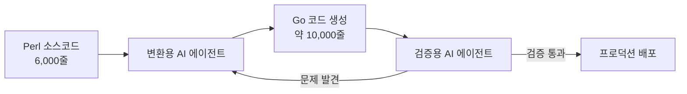
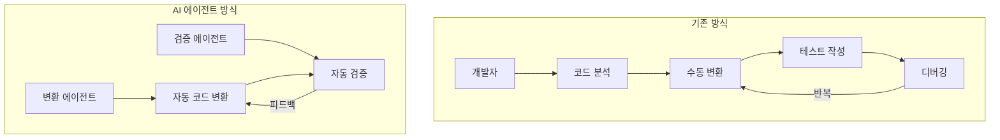

## 개요

대규모 레거시 코드를 모던 언어로 마이그레이션하는 작업은 어느 조직에서나 '중요하지만 우선순위에서 밀리는' 과제입니다. DeNA는 이 문제를 AI 에이전트를 활용해 극적으로 해결했습니다. Perl 6,000줄로 작성된 서버 자산 관리 API를 Go로 전환하면서, **변환용 에이전트**와 **검증용 에이전트** 2종류를 병행 운용하여 통상 반년이 걸리는 작업을 **단 1개월 만에 완료**했습니다.

## 배경: 왜 마이그레이션이 필요했는가

DeNA의 서버 자산 관리 API는 2018년에 Perl로 구축되었으며, 수천 대의 서버 이름·용도·IP 주소 등을 관리하는 핵심 인프라 시스템입니다.

시스템 자체에 큰 결함은 없었지만, 다음과 같은 이유로 모던 언어로의 전환이 필요했습니다:

- **Perl의 미래 전망**: 언어의 장기적 발전 가능성과 커뮤니티 축소에 대한 우려
- **유지보수 문제**: 신규 개발자 채용 시 Perl 경험자 확보가 어려움
- **리소스 문제**: 마이그레이션의 필요성은 인식하면서도, 기존 업무 우선순위에 밀려 착수하지 못하는 상황

DeNA IT본부 IT기반부 소이케 부부장은 "리소스가 많이 드는 것이 눈에 보여, 우선순위 문제로 도저히 착수하지 못했다"고 말합니다.

## DeNA의 'AI 올인' 전략

2025년 2월, DeNA 창업자 남바 토모코 회장이 **'AI 올인' 선언**을 발표했습니다. AI를 철저히 활용하여 생산성을 높이고, 기존 사업을 절반의 인원으로 운영할 수 있는 체제를 구축하겠다는 것이었습니다.

이 전략의 일환으로, AI를 활용한 파일럿 프로젝트 중 하나로 서버 자산 관리 API의 모던화가 선정되었습니다.

## 핵심 전략: AI 에이전트 2종 분업 체제

이 프로젝트의 가장 혁신적인 부분은 AI 에이전트를 **특성에 따라 2종류로 나누어 운용**한 점입니다.

### 1. 변환용 AI 에이전트

- **역할**: Perl 코드를 Go 코드로 변환
- **특성**: 코드 생성에 특화된 에이전트
- **결과**: Perl 약 6,000줄 → Go 약 10,000줄로 변환

### 2. 검증용 AI 에이전트

- **역할**: 변환된 Go 코드의 정확성 검증
- **특성**: 테스트와 품질 검증에 특화된 에이전트
- **프로세스**: 문제 발견 시 변환용 에이전트에 피드백

이 2종 분업 체제를 통해 **변환→검증→수정**의 사이클을 빠르게 반복할 수 있었고, 사람이 직접 하면 반년 이상 걸릴 작업을 1개월로 단축했습니다.

## 프로젝트 타임라인

| 기간 | 내용 |
|------|------|
| 2025년 10월 말~11월 말 | Perl→Go 마이그레이션 실행 (1개월) |
| 2025년 12월~2026년 1월 | 개발 환경 가동 확인 (약 2개월) |
| 2026년 1월 말 | 프로덕션 환경 가동 개시 |

## 시사점: 레거시 마이그레이션에 AI를 활용하는 방법

### 에이전트 분업의 효과

단일 AI에게 "변환하고 검증도 해줘"라고 맡기는 것이 아니라, **역할을 명확히 분리**하여 각 에이전트의 강점을 극대화한 점이 핵심입니다.

### 적용 가능한 시나리오

이 사례는 다음과 같은 상황에 특히 참고가 됩니다:

1. **레거시 언어에서 모던 언어로의 마이그레이션**: COBOL→Java, PHP→Go, Ruby→Rust 등
2. **대규모 코드베이스 변환**: 수천~수만 줄 규모의 코드 전환
3. **공수 문제로 착수하지 못한 기술 부채 해소**: AI로 비용 대비 효과를 극적으로 개선

### 주의할 점

- **2개월간의 검증 기간**을 별도로 확보한 점에 주목해야 합니다. AI가 변환한 코드라도 프로덕션 투입 전에 충분한 검증이 필수입니다.
- 에이전트의 역할 분담 설계가 성공의 핵심이므로, 프로젝트 특성에 맞는 에이전트 구성을 신중히 설계해야 합니다.

## 결론

DeNA의 사례는 AI 에이전트를 단순한 코딩 보조 도구가 아닌, **프로젝트 레벨의 전략적 자원**으로 활용할 수 있음을 보여줍니다. 핵심은 다음 세 가지입니다:

1. **에이전트 역할 분업**: 변환과 검증을 분리하여 각각의 품질 극대화
2. **반복 사이클 자동화**: 변환→검증→수정의 루프를 AI가 자동 수행
3. **충분한 검증 기간 확보**: AI 변환 결과에 대한 인간의 최종 검증

"AI로 이만큼 효율화할 수 있다면, 지금까지 리소스 문제로 손대지 못했던 과제에도 착수할 수 있게 된다"는 소이케 부부장의 말처럼, AI 에이전트는 기술 부채 해소의 새로운 돌파구가 될 수 있습니다.

## 참고 자료

- [DeNAがPerl6000行を1カ月でGo言語へ、特性異なるAIエージェント駆使 - 日経クロステック](https://xtech.nikkei.com/atcl/nxt/column/18/00001/11469/)
